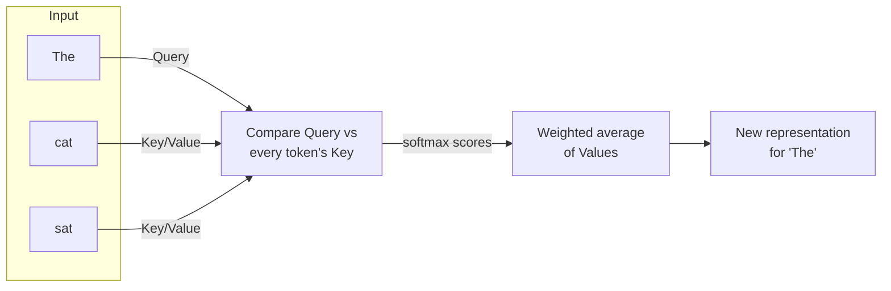
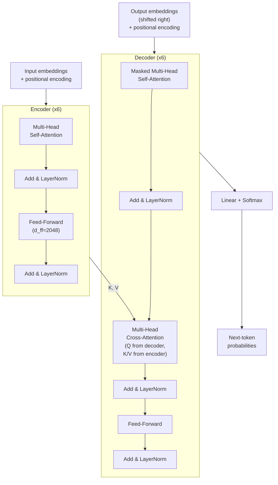
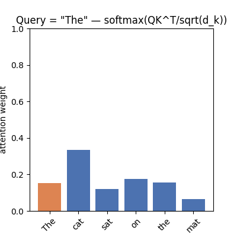
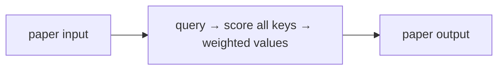
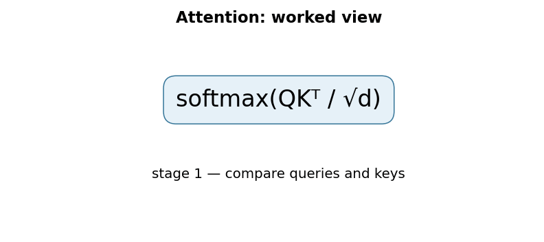

# Attention Is All You Need

## TL;DR

In 2017, a team at Google proposed the Transformer: a sequence model built
entirely out of attention layers, with no recurrence (RNNs/LSTMs) and no
convolutions at all. Instead of processing a sentence one token at a time
in order, it lets every token look directly at every other token in a
single matrix multiplication, weighted by how relevant they are to each
other. This made training dramatically more parallelizable, and it beat
the best recurrent and convolutional translation models of the time while
training in a fraction of the wall-clock time. Almost every large language
model built since — BERT, GPT, T5, LLaMA — is a descendant of this
architecture.

## Fun Map for First Years 🧭

Words are like students in a group project: each word can look around and decide who to listen to most. Attention is the set of “who should I listen to?” scores.

`📚 words → 👀 attention looks around → 🧠 richer word meanings → ✍️ next word`

Instead of passing one message along a single line, every word can directly inspect the other words. That makes “it” easier to connect to the right earlier noun, even when they are far apart.

In “The animal did not cross the street because it was tired,” attention can give “it” a large connection to “animal.” The resulting representation carries that useful relationship forward.

💻 **CS analogy:** attention is a database query: each word asks which records are most relevant, then combines their values.

## Math Playground 🧮

**Essential equation:** softmax(QKᵀ/√d)V. First, each question vector Q scores every key K: a large score means “pay attention here.” Softmax turns scores into percentages that add to 100%; those percentages average the value vectors V. The √d divisor prevents large vectors from making one percentage unfairly close to 100%.

The essential equation or rule is:

```text
softmax(QKᵀ / √d) V
```

You can read the equation left to right: score possible connections, turn scores into fair shares, then blend information using those shares. The symbols are learned number lists, not words themselves.

For one query, the row of softmax values is a set of weights that sums to 1. If one key scores far above the rest, its value contributes most; if scores are similar, the result blends several values.

## Background: What Came Before 🕰️

Before this paper, translation models usually processed text one word at a time with recurrent networks, sometimes aided by convolutional layers and an attention add-on. Long paths made distant relationships hard to learn and limited parallel training. The Transformer was needed to make attention itself the main computation, so every token could connect directly to the others.

This direct connection path let the architecture handle distant relationships while doing much more work in parallel than recurrent models.

This direct path changed the cost of relating distant words from walking through many recurrent steps to a single attention comparison.

## Why It Matters

Before 2017, the dominant approach to sequence-to-sequence tasks
(translation, summarization) was recurrent: an RNN or LSTM read a
sentence one word at a time, carrying a hidden state forward, sometimes
augmented with an attention mechanism that let the decoder peek back at
encoder states (Bahdanau et al., 2015). This worked, but it had a
structural problem — the recurrence itself. Because word *t* depends on
the hidden state computed at word *t-1*, you cannot compute the states
for a whole sentence in parallel; you're stuck processing it sequentially,
one step per token, even on a GPU with thousands of idle cores. For a
sentence of length *n*, that's *n* sequential steps you cannot avoid,
and longer sequences make the vanishing/exploding gradient problem worse
the more steps information has to travel through.

Convolutional sequence models (like ByteNet and ConvS2S) fixed the
parallelism problem but introduced a different one: a single convolution
only sees a local window, so relating a word to another word far away in
the sentence takes multiple stacked conv layers — the number of
operations needed grows with the distance between positions (linearly for
ConvS2S, logarithmically for ByteNet).

The Transformer's insight was: what if the "relate any two positions"
mechanism *is* the entire model, instead of a bolt-on to a recurrent
backbone? Self-attention connects any two positions in a sequence with a
constant number of operations, regardless of how far apart they are, and
the whole computation for a given layer is just matrix multiplications —
trivially parallel across a GPU. The paper backed this up with results,
not just an efficiency argument: on WMT 2014 English-to-German, the "big"
Transformer scored 28.4 BLEU, beating the best previously reported models
(including ensembles) by more than 2 BLEU, while training in 3.5 days on
8 P100 GPUs — a small fraction of the training cost of the best prior
models. On English-to-French it reached 41.8 BLEU, a new single-model
state of the art, at less than 1/4 the training cost of the previous
state-of-the-art model.

What changed after: within about a year, this architecture became the
substrate for essentially every major advance in NLP — BERT (bidirectional
pretraining on top of the Transformer encoder), GPT (autoregressive
pretraining on top of the Transformer decoder), and eventually every large
language model in production today, including the one that may have
generated part of this sentence.

## Core Intuition

Think of self-attention as **each word in a sentence asking a question,
and every other word (including itself) answering it, weighted by how
relevant the answer is.**

Concretely, each token produces three vectors from its own embedding:
- a **Query** ("what am I looking for?")
- a **Key** ("what do I have to offer, as a label?")
- a **Value** ("what do I have to offer, as content?")

To decide how much attention token A should pay to token B, you compare
A's Query to B's Key (via a dot product — higher means "more relevant").
Do that for every pair of tokens, turn the row of scores into a
probability distribution with softmax, and use those probabilities to
take a weighted average of everyone's Value vectors. The result: each
token's new representation is a blend of everyone else's content,
weighted by relevance.

A concrete example: in the sentence "The cat sat on the mat because **it**
was tired," when the model processes the word "it", self-attention lets
"it" directly query every other word and discover that "cat" is the most
relevant referent — no matter how many words separate them, and without
needing to carry that information forward step-by-step through a chain of
hidden states the way an RNN would. This directness — a constant number of
computational "hops" between any two positions — is the mechanical reason
Transformers handle long-range dependencies better than recurrent models.



One more piece of intuition: because there's no recurrence, the model has
no inherent sense of word *order* — attention treats the sentence as a
set, not a sequence. "The cat sat" and "sat cat The" would look identical
to raw self-attention. The paper's fix is **positional encoding**: before
the first layer, each token's embedding gets a fixed vector added to it
that encodes its position using sine and cosine waves at different
frequencies. Nothing is learned here; it's a deterministic geometric
trick that gives the model position information it can then learn to use.

## The Mechanism

### Scaled dot-product attention

The core operation, applied to matrices Q (queries), K (keys), and V
(values), each of shape `(sequence_length, d_k)`:

```
Attention(Q, K, V) = softmax(QK^T / sqrt(d_k)) V
```

Three things worth understanding about this formula specifically:

1. **`QK^T`** computes every pairwise dot-product between queries and
   keys in one matrix multiply — this is what makes it parallel.
2. **`/ sqrt(d_k)`** is a scaling factor. Without it, as `d_k` grows,
   dot products grow large in magnitude, pushing softmax into regions
   with extremely small gradients (the softmax saturates — one input
   dominates and the gradient nearly vanishes everywhere else). Dividing
   by `sqrt(d_k)` keeps the variance of the dot products roughly constant
   regardless of dimension, which keeps training stable. This single
   scaling factor is the entire difference between "dot-product
   attention" and "scaled dot-product attention." The paper reports that
   for large `d_k`, unscaled dot-product attention underperforms additive
   attention (an observation it attributes to cited prior work) and
   states its authors "suspect" the variance-growth/softmax-saturation
   mechanism above is the cause — this is the paper's own stated
   reasoning, not an ablation it ran itself.
3. **`softmax(...)  V`** turns the scores into a weighted average of
   value vectors — the actual content that gets passed forward.

### Multi-head attention

Rather than doing this once with the full `d_model`-dimensional vectors,
the paper splits Q, K, V into `h` separate, smaller projections (`d_k =
d_v = d_model / h`), runs scaled dot-product attention independently in
each of these `h` "heads," concatenates the results, and applies one more
linear projection:

```
MultiHead(Q, K, V) = Concat(head_1, ..., head_h) W^O
where head_i = Attention(Q W_i^Q, K W_i^K, V W_i^V)
```

Why bother, instead of just using one big attention operation? The
paper's own stated reason is that averaging over a single attention
head inhibits the model's ability to jointly attend to information from
different representation subspaces at different positions — one shared
softmax has to compromise across everything it's tracking at once. A
useful (if informal) way to picture that: multiple heads let the model
track several different kinds of relationships in parallel — e.g. one
head might specialize in subject-verb agreement, another in coreference
("it" → "cat"), another in adjacent-word syntax — without any of them
having to share a single softmax distribution. Empirically, later
interpretability work (not this paper) has found heads that do
specialize this way, though it's not guaranteed or interpretable in
every model.

The base model uses `d_model = 512`, `h = 8` heads, so each head works in
`d_k = d_v = 64` dimensions. The "big" model uses `d_model = 1024`,
`h = 16`.

### Full architecture

The Transformer is an encoder-decoder stack, `N = 6` identical layers
each:



Each sub-layer (self-attention, feed-forward) is wrapped in a residual
connection followed by layer normalization: `LayerNorm(x +
Sublayer(x))`. The residual connection is what makes stacking this many
layers dramatically easier to train — without it, gradients have to flow
unaided through every attention and feed-forward transformation at every
layer, which in general deep networks makes optimization far more
difficult (though not strictly impossible).

Three places attention is used, each slightly differently:
- **Encoder self-attention:** every input token attends to every other
  input token — fully bidirectional, no masking.
- **Decoder masked self-attention:** every output token attends to
  earlier output tokens only. This is enforced by setting the attention
  score to `-infinity` (before softmax) for any position ahead of the
  current one — see `causal_mask()` in the code example below. This
  masking is what makes the decoder autoregressive: at generation time it
  can only condition on tokens it has already produced.
- **Encoder-decoder cross-attention:** the decoder's Queries come from
  the decoder's own representations, but the Keys and Values come from
  the encoder's final output. This is the mechanism by which the decoder
  "looks at" the source sentence while generating the target sentence —
  the direct architectural descendant of Bahdanau-style attention, just
  generalized and stripped of its RNN scaffolding.

The animation below shows one query token's attention weights over a
6-token sentence, one query at a time — a stand-in for the per-token
softmax(QK^T/sqrt(d_k)) distribution described above (illustrative
weights, not extracted from a trained model):



### Position-wise feed-forward network

Between attention sub-layers, every position independently passes
through the same two-layer MLP: `FFN(x) = max(0, x W_1 + b_1) W_2 + b_2`,
expanding to `d_ff = 2048` in the base model before projecting back down
to `d_model = 512`. "Position-wise" means the same weights are applied to
each token independently — there's no mixing across positions here; all
cross-token interaction happens in the attention sub-layers. You can
think of the FFN as where the model does per-token "thinking" after
attention has gathered the relevant context.

### Training setup (base model, for grounding)

- Optimizer: Adam, β₁=0.9, β₂=0.98, ε=1e-9
- Learning rate: increases linearly for the first `warmup_steps = 4000`
  steps, then decays proportionally to the inverse square root of the
  step number — this warmup is important because early in training, with
  randomly initialized weights, a high learning rate applied immediately
  can destabilize the Adam optimizer's second-moment estimates.
- Regularization: dropout `P_drop = 0.1` applied to the output of each
  sub-layer and to the sums of embeddings + positional encodings; label
  smoothing `eps_ls = 0.1` on the output distribution (the model is
  trained to not be 100% confident even on the correct token, which the
  paper reports hurts perplexity but improves BLEU and accuracy).
- Data: WMT 2014 English-German, ~4.5M sentence pairs, byte-pair encoded
  into a shared ~37,000-token vocabulary.
- Base model: 100,000 steps, ~12 hours on 8 NVIDIA P100 GPUs, ~65M
  parameters. Big model: 300,000 steps, 3.5 days, ~213M parameters.
- Inference: beam search with beam size 4, length penalty α = 0.6.

## Practical Engineering Notes

### Worked Math & Dataflow

The compact view below makes the paper's central calculation concrete:

```text
softmax(QKᵀ / √d)
```

In practice, the calculation is a pipeline: A query compares itself with every key, then uses the resulting weights to mix value vectors. The √d term prevents large dot products from making softmax nearly one-hot too early. The important engineering
choice is to preserve the paper's intended invariant while making the operation
fit the available memory, batch size, and evaluation protocol.






**Where this lives in real code:** Hugging Face `transformers` implements
this almost layer-for-layer in its per-model self-attention classes
(exact class names and module paths shift release to release as the
library refactors its attention internals — search the installed
version's source for "self_attention" or "Attention" in a given model's
`modeling_*.py`). More directly and more durably, PyTorch's own built-in
`torch.nn.functional.scaled_dot_product_attention` (added in PyTorch 2.0)
implements exactly the formula above but dispatches to fused,
hardware-specific kernels (FlashAttention, memory-efficient attention, or
a math fallback) depending on your device and input shapes, instead of
materializing the full `QK^T` score matrix in memory.

**The quadratic cost is the thing to internalize.** Computing `QK^T` for
a sequence of length `n` produces an `n × n` matrix — both compute and
memory scale as O(n²) in sequence length. This is fine for the sentence
lengths in the original paper (tens to low hundreds of tokens) but becomes
the dominant cost as context windows grow into the thousands or hundreds
of thousands of tokens, which is exactly why a whole line of follow-up
research (FlashAttention for a faster *exact* implementation, sparse/local
attention variants, linear-attention approximations) exists purely to
attack this one term. If you're debugging an out-of-memory error on a
long-context model, this `n²` term is usually where to look first —
memory grows quadratically even though parameter count doesn't.

**Why LayerNorm placement matters in practice.** The original paper uses
"post-norm" (`LayerNorm(x + Sublayer(x))`, normalizing *after* the
residual add). Later architectures (GPT-2 onward, most modern LLMs) moved
to "pre-norm" (`x + Sublayer(LayerNorm(x))`, normalizing *before* the
sublayer). Pre-norm trains more stably at scale — gradients flow through
an unbroken residual path with normalization only inside the branch — but
that particular choice is not in this paper; it's a real engineering
lesson learned from trying to train very deep post-norm Transformers and
hitting instability. Worth knowing when you read a modern model's code
and it doesn't match the diagram in this paper exactly.

**KV-caching is invisible in this paper and everywhere in production.**
At inference time, generating token *t* only needs Key/Value vectors for
positions ≤ t, and those don't change as you generate more tokens — so
production inference servers cache K and V per layer, computing them once
per token, instead of recomputing the full self-attention over the whole
generated-so-far sequence at every step. This is why LLM inference has
two very different performance profiles: prompt processing ("prefill",
compute-bound, processes the whole prompt in parallel) versus token-by-token
generation ("decode", memory-bandwidth-bound, one token at a time,
reading the growing KV cache).

**Parameter budget intuition.** Working through the base model's ~65M
parameters by block: the position-wise FFN sublayers total roughly 25M
(`d_model × d_ff × 2` per layer ≈ 2.1M, across 12 FFN blocks — 6 encoder
+ 6 decoder), the tied input/output embedding matrix is roughly 19M
(~37,000-token vocab × 512), and all the attention projection matrices
(`W^Q, W^K, W^V, W^O` across 18 attention blocks — 6 encoder self-attn +
6 decoder self-attn + 6 decoder cross-attn) total roughly 19M. So the FFN
sublayers are the single largest block — around 40% of the total — but
not a majority: embeddings and attention projections together outweigh
them. Worth knowing because it means a meaningful share of a
Transformer's capacity, in the original design, sits outside the
attention mechanism itself, even though attention is what the paper (and
this explainer) spends most of its words on.

## Runnable Code Example

### Run it

The implementation is intentionally small and self-checking. From the repository root, use Python 3; the module docstring states the learning goal, comments identify the paper-specific calculation, and assertions verify the toy invariant.

```bash
python3 papers/01-attention-is-all-you-need/code/attention_from_scratch.py
```

### Read it in order

Start with the module docstring, then follow the named helper calculations and the final assertions. The example is a dependency-light teaching implementation, not a production training system; change one input at a time and rerun it to see which invariant changes.


See `code/attention_from_scratch.py` for a minimal, runnable
implementation of `scaled_dot_product_attention` and `MultiHeadAttention`
in PyTorch — about 50 lines, no external dependencies beyond `torch`.

Running it (`python code/attention_from_scratch.py`) does two things:

1. Builds a random batch of shape `(2, 5, 16)` (batch of 2, sequence
   length 5, `d_model` 16 — scaled down from the paper's 512 so it runs
   instantly), passes it through 4-head multi-head attention, and asserts
   the output shape matches the input shape — self-attention is a
   shape-preserving operation, since every attention layer needs to feed
   into the next one of the same width.
2. Builds a causal mask via `causal_mask(5)` (a lower-triangular boolean
   matrix) and asserts that after masking, the attention weight matrix
   has exactly zero weight in its upper triangle — i.e., no position
   attends to a future position, which is the property that makes the
   decoder autoregressive and safe to use for left-to-right generation.

Expected output:
```
ok: unmasked output shape (2, 5, 16) matches input shape
ok: causal mask zeroes all attention weights to future positions
```

If you want to extend it: try feeding the same query, key, and value
tensor into `scaled_dot_product_attention` directly (self-attention is
exactly this — Q, K, and V all derived from the same input) and print the
returned `weights` matrix to see the actual `softmax(QK^T / sqrt(d_k))`
probability distribution for a real (if untrained) set of projections.

## Common Misconceptions & Pitfalls

- **"Attention replaces the need for any other layer type."** It doesn't
  — the position-wise feed-forward network is still a standard MLP doing
  real computational work per token, and as noted above, it's the single
  largest block of the base model's parameters. Attention is what mixes
  information *across* tokens; the FFN is what transforms information
  *within* a token after that mixing — they're doing structurally
  different jobs, and later ablation studies (not this paper) have found
  removing the FFN and relying on attention alone measurably hurts
  performance, consistent with that division of labor.
- **"Multi-head attention means the model literally learns semantic roles
  like 'subject' and 'object' per head."** Some heads in some trained
  models do show interpretable, specializable patterns (this was studied
  in later interpretability papers, not this one), but it's an emergent
  property of training, not something architecturally guaranteed or
  enforced. Don't assume any given head in any given trained model has a
  clean, human-nameable job.
- **"Self-attention is inherently order-aware."** It is not — without
  positional encoding, self-attention over a set of tokens is *permutation
  equivariant*, not invariant: shuffle the input tokens and the output
  shuffles the same way (rather than staying fixed), so the model has no
  independent signal for absolute or relative position at all. All
  positional information comes from the added encoding vectors, not from
  the attention mechanism itself.
- **"Bigger `d_k` per head is always better."** The scaling factor
  `1/sqrt(d_k)` exists precisely because larger `d_k` pushes dot products
  toward the extremes, saturating softmax and killing gradients if you
  don't correct for it. This is a concrete, checkable numerical-stability
  issue, not just a design preference — it's the paper's own stated
  motivation for the scaling term (see The Mechanism above for the exact
  attribution).

## Interview Q&A

**Q:** Why divide by `sqrt(d_k)` in scaled dot-product attention — what
actually breaks if you don't?
**A:** As `d_k` grows, the dot product between two random vectors grows
in expected magnitude (its variance scales with `d_k`, assuming
components have roughly unit variance). Large-magnitude inputs to
softmax push it toward a near-one-hot output, where the gradient with
respect to all but the max input is close to zero. That kills useful
gradient signal during backpropagation and makes training unstable or
slow to converge, especially with a large `d_k`. Dividing by `sqrt(d_k)`
renormalizes the variance back to roughly 1 regardless of dimension,
keeping softmax in a well-behaved regime.

**Q:** What's the actual computational complexity of self-attention
versus a recurrent layer, and why does that matter in practice?
**A:** Self-attention is O(n² · d) per layer (all-pairs comparison across
a sequence of length n, each comparison costing O(d) for d-dimensional
vectors), but every one of those n² comparisons is independent and can be
computed in parallel — the sequential depth is O(1). A recurrent layer is
O(n · d²) total (cheaper in total operations than attention specifically
when the sequence is short relative to the dimension, i.e. `n < d`) but
has O(n) sequential depth — you cannot start computing step t+1 until
step t finishes. In practice, on hardware with massive
parallelism (GPUs/TPUs), that O(1) sequential depth dominates wall-clock
training time far more than the raw operation count does, which is the
efficiency argument the paper makes for preferring attention. The
tradeoff flips for very long sequences where n² memory/compute starts to
dominate — which is exactly the motivation for later work like
FlashAttention and sparse attention variants.

**Q:** Why does the decoder need a mask but the encoder doesn't?
**A:** The encoder processes the entire source sentence at once — nothing
about translating "the cat sat" requires hiding "sat" from "the," since
the whole source sentence is available up front. The decoder, though, is
autoregressive: at generation time, token t+1 hasn't been produced yet
when you're generating token t, so it must not be allowed to "cheat" by
looking at ground-truth future tokens during training either — that would
create a mismatch between training (where the whole target sequence is
available) and inference (where it isn't). The causal mask enforces this
by setting attention scores to `-inf` for any future position before the
softmax, making the learned weight exactly 0 there.

**Q:** What would happen if you used only one attention head with the
full `d_model` dimensionality instead of `h` smaller heads?
**A:** The paper's own reasoning: averaging over a single attention head
inhibits the model from jointly attending to information from different
representation subspaces at different positions — one shared softmax
distribution has to compromise across everything it's tracking at once.
Splitting into `h` heads with their own smaller projections gives the
model `h` independent softmax distributions per query, so it can
represent several different kinds of relationships in parallel instead of
compromising within one. It's not solely an efficiency trick — going from
one head at `d_model` dimensions to `h` heads at `d_model/h` dimensions
each keeps total compute roughly comparable, so the benefit is
representational, not computational.

**Q:** Where does positional information actually enter the model, and
why sine/cosine functions specifically rather than, say, a learned
position embedding?
**A:** It's added directly to the token embeddings before the first
layer: `PE(pos, 2i) = sin(pos / 10000^(2i/d_model))`,
`PE(pos, 2i+1) = cos(pos / 10000^(2i/d_model))`. The paper chose a fixed
sinusoidal function (rather than a learned embedding table, which they
also tried and found performed nearly identically) partly because it
hypothesized this would let the model extrapolate to sequence lengths
longer than any seen during training — for any fixed offset k, PE(pos+k)
can be expressed as a linear function of PE(pos), which the paper
suggests could make it easier for attention to learn to attend by
relative position. In practice, many later models (BERT, GPT-2) reverted
to learned positional embeddings, and still later models (RoPE, ALiBi)
went back to different flavors of fixed/relative schemes — this remains
an actively revisited design decision, not a settled one.

**Q:** In a production LLM serving stack, why is "prefill" a different
performance regime than "decode," and how does that trace back to this
paper's architecture?
**A:** Prefill (processing the input prompt) computes Key/Value vectors
and attention for every prompt token in parallel — it's compute-bound,
and GPUs are efficient here because you're doing large, dense matrix
multiplications. Decode (generating each new token one at a time) can
only compute one new token's Query at a time (because of the causal
mask — you don't know token t+1 until you've generated token t), and
with KV-caching, that one step is dominated by reading the entire
accumulated KV cache from memory rather than by the FLOPs of the matmul
itself — so it's memory-bandwidth-bound, not compute-bound. This split is
a direct consequence of the paper's autoregressive, causally-masked
decoder design: the model is architecturally required to generate one
token at a time at inference, even though it was trained with full
sequences available in parallel (via teacher forcing).

## SDE2 Interview Drill-down

These prompts are designed for a second-level software engineering interview: explain the mechanism, name the operational trade-off, and describe how you would test it.

**Q:** Walk through scaled dot-product attention end to end. What does `softmax(QKᵀ/√dₖ)V` mean in an implementation?
**A:** Start by identifying the data structure entering the operation, the learned or configured values it uses, and the invariant that must hold at the output. In this paper, softmax(QKᵀ/√dₖ)V is not just notation: it tells you what is compared, normalized, accumulated, or optimized. A strong implementation makes those stages visible in separate functions, keeps tensor shapes and dtypes explicit, and tests a tiny hand-computed example before optimizing. Explain what happens when the inputs are short, padded, empty, or unusually large; those cases often reveal whether the code actually matches the paper.

**Follow-up:** Which invariant would you assert?
**A:** Assert the property that makes the method meaningful: probabilities normalize over valid choices, a residual preserves shape, a target does not bootstrap past termination, or an update leaves frozen state untouched. The assertion should be local and cheap enough to run in tests, not an end-to-end hope such as “accuracy improves.” Also compare the optimized path with a simple reference on random small inputs using an appropriate tolerance. That catches indexing, masking, reduction, and broadcasting errors while the failing example is still understandable.

**Q:** What is the main production trade-off, and how would you capacity-plan it?
**A:** The practical trade-off here is O(n²d) attention work and O(n²) score storage in the naive implementation. Estimate both arithmetic work and memory movement, then identify whether the service is compute-bound, bandwidth-bound, latency-bound, or limited by coordination. Include batch-size effects, peak activation/state memory, serialization, and cold-start behavior; average throughput can hide a bad tail latency. Choose a baseline configuration, measure it on representative shapes, and document which quality metric is allowed to move. If the system is distributed, include communication and retry behavior rather than treating the model operation as an isolated kernel.

**Follow-up:** What would make you reject an apparently faster optimization?
**A:** Reject it when it changes the evaluation contract, weakens isolation, creates silent quality regressions, or only wins on a synthetic shape. For this paper, watch especially for causal-mask leakage or quadratic memory pressure. A safe rollout uses a reference implementation, shadow traffic or canaries, resource limits, and dashboards for both system and model metrics. Keep the old path available until numerical outputs, error rates, p95/p99 latency, and cost are stable across the important input distributions.

**Q:** How would you debug a model that passes unit tests but fails in production?
**A:** Reproduce the smallest production-shaped input and compare intermediate values against the reference path, not only the final score. Log versioned preprocessing, shapes, masks, random seeds where relevant, and the exact model/configuration identifiers; otherwise a numerical symptom can be caused by data drift or a serving mismatch. Separate failures into data, numerical stability, optimization, and infrastructure categories. For this method, begin with compare a masked reference implementation with an optimized kernel, then run a controlled ablation that disables the paper-specific mechanism to determine whether the regression is in the mechanism or its integration.

**Follow-up:** What evidence would you present in the postmortem or interview?
**A:** Show one minimal failing example, the expected invariant, the observed intermediate divergence, and the fix’s regression test. Add a before/after metric table covering quality, memory, throughput, and tail latency, plus the rollout guard that would catch recurrence. This demonstrates engineering judgment: the goal is not merely to identify a clever algorithm, but to make its behavior observable, reproducible, and safe to operate.


## Further Reading

- [Attention Is All You Need (arXiv:1706.03762)](https://arxiv.org/abs/1706.03762) — the original paper
- [The Illustrated Transformer (Jay Alammar)](https://jalammar.github.io/illustrated-transformer/) — a widely-used visual walkthrough of the same architecture
- [The Annotated Transformer (Harvard NLP)](http://nlp.seas.harvard.edu/annotated-transformer/) — a line-by-line PyTorch implementation paired with the paper's text
- [Neural Machine Translation by Jointly Learning to Align and Translate (Bahdanau et al., 2015)](https://arxiv.org/abs/1409.0473) — the earlier RNN + attention mechanism this paper generalizes and replaces
- [FlashAttention (Dao et al., 2022)](https://arxiv.org/abs/2205.14135) — the systems-level follow-up addressing this paper's O(n²) memory cost
