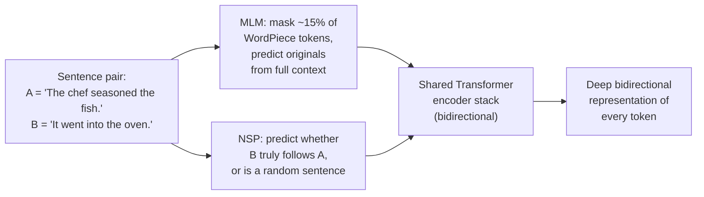

# BERT: Pre-training of Deep Bidirectional Transformers for Language Understanding

## TL;DR

In October 2018, a team at Google AI Language proposed BERT (Bidirectional
Encoder Representations from Transformers): a way to pre-train a plain
Transformer *encoder* stack (Vaswani et al., 2017) on unlabeled text so
that every layer conditions on both left and right context simultaneously,
rather than reading left-to-right or gluing together two separate
left-to-right and right-to-left models. It does this with two pre-training
objectives — masked language modeling (predict randomly hidden words from
their full surrounding context) and next sentence prediction (predict
whether one sentence follows another) — and then fine-tunes the exact same
pre-trained weights, with only one lightweight task-specific layer added
on top, for a huge range of downstream tasks: sentence classification,
sentence-pair tasks, question answering, and token tagging. BERT pushed
the GLUE benchmark score to 80.5% and SQuAD v1.1 Test F1 to 93.2, and the
paper reports it obtained new state-of-the-art results on eleven NLP
tasks at the time. It became the template — pre-train once on raw text,
fine-tune cheaply per task — that most subsequent encoder-based NLP
systems followed.

## Why It Matters

Before BERT, the strongest pre-trained language representations came from
one of two families, and both had a real limitation. ELMo (Peters et al.,
2018) trained a *separate* left-to-right LSTM and a separate
right-to-left LSTM and concatenated their hidden states — a "shallow"
combination of two unidirectional views, not a single representation that
jointly conditions on both directions at every layer. OpenAI GPT (Radford
et al., 2018) used a Transformer decoder pre-trained purely
left-to-right, with a causal self-attention mask at every layer, so a
token's representation could never see anything to its right — a
deliberate constraint that makes autoregressive generation well-defined,
but a real cost for tasks like question answering or sentence
classification where the whole input is available up front and there is
no reason to hide half of it.

The paper's central argument is that standard language modeling
objectives are fundamentally unidirectional, and this limits the choice of
architectures usable during pre-training. A left-to-right objective forces
you to use a left-to-right model — you cannot train a token's
representation to use right context if the loss never asks it to predict
using right context. BERT's fix is to change the pre-training *objective*
rather than bolt bidirectionality onto a unidirectional model: replace
"predict the next word" with "predict a randomly masked word given its
full left and right context" (masked language modeling, or MLM, borrowing
the "Cloze task" idea from earlier psycholinguistics work). Because a
standard Transformer encoder's self-attention is unmasked by default —
every position already attends to every other position — MLM lets you
pre-train a plain, unmodified Transformer encoder stack (not the
decoder half used by GPT) and get genuine deep bidirectionality for free,
where "deep" means every one of the model's layers sees both directions,
not just a final concatenation step.

The paper reports results on eleven tasks after this change: GLUE average
80.5% (a 7.7-point absolute improvement over the prior state of the art at
the time), MultiNLI accuracy 86.7% (+4.6 points), SQuAD v1.1 Test F1 93.2
(+1.5 points), and SQuAD v2.0 Test F1 83.1 (+5.1 points). What changed
after: "pre-train a Transformer encoder on unlabeled text with a masked
objective, then fine-tune the whole thing per task with one small added
head" became the dominant recipe for encoder-based NLP for years —
RoBERTa, ALBERT, ELECTRA, and DistilBERT are all direct descendants that
kept the masked/bidirectional pre-training idea and iterated on training
recipe, parameter efficiency, or the pre-training objective itself.

## Core Intuition

Think of reading a sentence with one word blanked out: **"The chef seasoned
the ___ before it went into the oven."** To guess the missing word, you
don't read strictly left-to-right and stop — you use "chef" and "seasoned"
from the left *and* "before it went into the oven" from the right at the
same time. That's the whole idea behind BERT's pre-training objective: take
real, unlabeled sentences, randomly hide (mask) about 15% of the words,
and train the model to predict each hidden word using everything else in
the sentence, in both directions, in a single pass.

This is different from asking a model to predict "the next word" given
only what came before, which is what a classic language model (and GPT)
does. A next-word predictor by construction never gets access to the
words after the one it's predicting — that's the whole task. A model
solving "fill in this blank in the middle of a sentence" has no such
restriction: right context is exactly as available as left context, and
the training signal explicitly rewards using it.

A second, independent training signal helps BERT reason about
relationships *between* sentences, not just within one. During
pre-training, the model is also shown pairs of sentences A and B and
asked a yes/no question: "does B actually follow A in the original text,
or is B a random sentence pulled from elsewhere in the corpus?" This is
next sentence prediction (NSP), and the paper's motivation for it is that
many important downstream tasks — question answering, natural language
inference — depend on understanding the *relationship* between two
sentences, something a single-sentence masked-word objective alone
doesn't directly train for.



Once pre-trained this way, the same encoder stack — same weights, same
architecture — gets reused for a completely different-looking task by
swapping only the very last layer: add a classification head on top of
the special `[CLS]` token's final representation for sentence-level tasks,
or add a start/end-span head over every token's representation for
question answering. The heavy lifting (understanding language) was
already learned during pre-training; fine-tuning is comparatively cheap
and fast because it's adapting, not learning from scratch.

## The Mechanism

### Architecture: it's a Transformer encoder, unmodified

BERT's architecture is, deliberately, nothing new: it is a multi-layer
bidirectional Transformer encoder, essentially identical to the encoder
half of Vaswani et al. (2017) (see this repo's
[Attention Is All You Need explainer](../01-attention-is-all-you-need/README.md)
for the underlying scaled dot-product / multi-head attention mechanics).
The paper releases two sizes:

| Model | Layers (L) | Hidden size (H) | Attention heads (A) | Total parameters |
|---|---|---|---|---|
| BERT-BASE | 12 | 768 | 12 | 110M |
| BERT-LARGE | 24 | 1024 | 16 | 340M |

BERT-BASE was deliberately chosen to match OpenAI GPT's size for a fair
architectural comparison; BERT-LARGE shows what the same recipe does at
roughly 3x the parameter count. In both sizes, the feed-forward
intermediate size is `4H` (matching the `d_ff = 4 * d_model` ratio used
in the original Transformer's base configuration).

The one architectural property that matters most for everything else in
this section: a standard Transformer *encoder* self-attention layer has
**no directional mask at all** — every token attends to every other token
in the sequence, before and after it, with no `-infinity` scores anywhere
in the attention matrix. That's the entire mechanical difference from a
Transformer *decoder* layer (used by GPT), which applies a causal mask so
position *i* can only attend to positions `<= i`. BERT uses the encoder
half specifically because it wants that unrestricted, bidirectional
attention pattern; there is no new attention mechanism invented in this
paper, only a new way of training an existing one.

### Input representation

Because BERT needs to handle both single sentences and sentence pairs
with one unified input format, every input sequence is built from three
components summed together, position by position:

1. **WordPiece token embeddings** — a 30,000-token subword vocabulary
   (the same tokenization scheme used by earlier work), so rare words
   decompose into known sub-word pieces rather than becoming a single
   out-of-vocabulary token.
2. **Segment embeddings** — a learned embedding indicating whether a
   token belongs to sentence A or sentence B, letting the model tell the
   two sentences apart even after they're concatenated into one sequence.
3. **Position embeddings** — a *learned* embedding per absolute position
   (unlike the original Transformer's fixed sinusoidal encoding), up to a
   maximum sequence length of 512 tokens.

Every input sequence starts with a special `[CLS]` token, whose final
hidden state is used as the aggregate sequence representation for
classification tasks, and sentences within a sequence are separated by a
special `[SEP]` token.

### Pre-training objective 1: Masked Language Model (MLM)

Standard language-model training can't be made bidirectional by simply
removing the causal mask, because doing so would let a token trivially
"see itself" through the layers when the objective is "predict this exact
token" — with the mask gone, the answer is already sitting right there in
the input, and the model would trivially learn to just copy it forward
rather than learn anything about language. BERT's fix is to corrupt the
input first, then ask the model to reconstruct what was corrupted.

The exact procedure (paper section 3.1): for each training sequence,
15% of WordPiece token positions are randomly selected. For each selected
position:

- **80% of the time**, replace the token with a special `[MASK]` token.
- **10% of the time**, replace the token with a random token from the
  vocabulary.
- **10% of the time**, leave the token unchanged.

The model is then trained to predict the *original* token at every
selected position (not just the `[MASK]`-replaced ones), using a
cross-entropy loss over the vocabulary, with all other (unselected)
positions excluded from the loss.

Why not just mask 100% of the selected positions with `[MASK]`? The paper's
stated reasoning is a train/fine-tune mismatch problem: `[MASK]` never
appears in real text, so it never appears during fine-tuning either — if
every masked position were always literally `[MASK]` during pre-training,
the model could over-rely on a token that will simply never occur again at
fine-tuning time. Mixing in random-token and unchanged-token corruption
forces the model to keep a good contextual representation of *every*
token position, not just the ones flagged `[MASK]`, since it can never be
sure in advance which positions it's actually being asked to predict.

### Pre-training objective 2: Next Sentence Prediction (NSP)

For NSP, training examples are constructed as sentence pairs A and B: 50%
of the time B is the actual sentence that follows A in the source
document (label `IsNext`), and 50% of the time B is a random sentence
sampled from elsewhere in the corpus (label `NotNext`). The final hidden
state of the `[CLS]` token is fed into a single additional classification
layer trained to predict this binary label. The paper's own ablation
(discussed further below, under fine-tuning) finds that removing NSP
measurably hurts performance on tasks that depend on cross-sentence
reasoning, such as QNLI, MNLI, and SQuAD.

### Pre-training data and compute

Pre-training used BooksCorpus (800M words) and English Wikipedia (2,500M
words, text passages only — lists, tables, and headers were stripped
out), for roughly 3.3 billion words of raw text combined. Both models
were trained for 1,000,000 steps with a batch size of 256 sequences
(roughly 128,000 tokens per batch, since each sequence is up to 512
tokens); BERT-BASE trained on 4 Cloud TPUs (16 TPU chips) and BERT-LARGE
on 16 Cloud TPUs (64 TPU chips), each configuration taking about 4 days.

### Fine-tuning: same weights, one new layer

Because self-attention in a Transformer encoder already lets every input
position interact with every other position, fine-tuning BERT for a new
task is largely a matter of feeding it the right input/output format and
letting all parameters (the pre-trained encoder plus one new small
task-specific layer) update end-to-end on labeled data for that task:

- **Sentence-pair classification** (e.g. MNLI): feed sentence A and B as
  one sequence separated by `[SEP]`, classify from `[CLS]`'s final hidden
  state.
- **Single-sentence classification** (e.g. SST-2): same idea with a single
  sentence.
- **Question answering** (e.g. SQuAD): feed the question and passage as
  one sequence, and instead of a single classification head, add two
  vectors (learned during fine-tuning) whose dot product with every
  token's final hidden state produces a start-position score and an
  end-position score — the answer span is read off as the highest-scoring
  `(start, end)` pair.
- **Token-level tagging** (e.g. named entity recognition): classify every
  token's final hidden state independently.

This is the practical payoff of bidirectional pre-training: fine-tuning
is cheap (the paper reports it can be done in as little as one hour on a
single Cloud TPU, or a few hours on a GPU, for most tasks) specifically
*because* nearly all of the representational work was already done during
pre-training — fine-tuning is adjusting, not learning language from
scratch.

The animation below shows the mechanical crux of the whole paper: a
masked query token's attention reach, contrasted between BERT's
unrestricted bidirectional self-attention and a GPT-style causal
self-attention over the identical sentence and identical toy affinity
scores. Under bidirectional attention, the masked token can pull weight
from the word after it ("mat"); under a causal mask, that same weight is
architecturally zeroed out, because the position simply isn't visible yet.


### Ablations: why both bidirectionality and NSP matter

The paper's own ablation study (section 5.1) compares BERT-BASE against
two stripped-down variants trained with the exact same data and
hyperparameters: "No NSP" (MLM only, no next-sentence objective) and
"LTR & No NSP" (a left-to-right language-modeling objective instead of
MLM, with no NSP, architecturally resembling GPT). The paper reports that
removing NSP measurably hurts performance on QNLI, MNLI, and SQuAD, and
that replacing the bidirectional MLM objective with a left-to-right
objective produces large drops on MRPC and SQuAD specifically — SQuAD is
hit hardest, which the paper attributes to the token-level hidden states
in a purely left-to-right model having no right-side context at all,
which is intuitively a severe handicap for a task like span extraction
where the correct span boundary may depend on words that come after it.

## Practical Engineering Notes

**Where this lives in real code.** Hugging Face `transformers` implements
BERT with the same encoder-stack structure described above — an
embedding layer combining token/segment/position embeddings feeding into
a stack of self-attention + feed-forward encoder blocks (exact class
names and module paths shift release to release as the library
refactors; search the installed version's source for "Bert" in its
`modeling_bert.py`-style files, or more durably, load `bert-base-uncased`
via `AutoModel.from_pretrained` and let the library resolve the specific
class). The core self-attention math is the same unmasked
`softmax(QK^T / sqrt(d_k)) V` from the original Transformer — nothing
BERT-specific happens at the attention-math level, only at the level of
what mask (none) and what objective (MLM + NSP) are used.

**`[CLS]` is a learned aggregate, not a magic summary token.** It's
tempting to treat `[CLS]`'s final hidden state as automatically "the
meaning of the sentence," but that behavior is entirely a product of what
it was trained to do. During pre-training, `[CLS]`'s representation is
only directly supervised by the NSP loss; during fine-tuning, it's
whatever the fine-tuning task's classification head asks it to become.
For unsupervised or lightly-supervised sentence-similarity tasks, later
work (e.g. Sentence-BERT) found that raw `[CLS]` embeddings, or even a
naive mean of all token embeddings, from a BERT model that was never
fine-tuned for the purpose actually underperform much simpler baselines —
`[CLS]`'s representation is only as good as what it was fine-tuned or
pre-trained to encode, not a general-purpose sentence embedding by
default.

**NSP turned out to be a weaker signal than the paper's own framing
suggested, in later work.** RoBERTa (Liu et al., 2019) re-ran BERT's
pre-training recipe at larger scale and longer training and reported that
removing NSP entirely, while keeping single, contiguous, full-length
segments per training example instead of the original two-segment format,
did not hurt (and in their setup, modestly helped) downstream performance
compared to keeping NSP. This is a finding from later work outside this
paper, not a claim of the BERT paper itself — worth knowing if you read a
modern model card and notice NSP has quietly disappeared from the recipe.

**512-token max length is a hidden production constraint, not a footnote.**
Because BERT uses learned (not extrapolatable sinusoidal) position
embeddings up to a fixed maximum of 512, you cannot simply feed it a
longer document at inference time the way some other architectures allow
graceful degradation — positions beyond 512 have no embedding to look up
at all. In production, this means long documents need chunking, sliding
windows, or a different long-context architecture (e.g. Longformer,
BigBird) entirely; it isn't a tunable knob on a stock BERT checkpoint.

**Masking is a data-loading concern, not a model-architecture concern.**
Because the 80/10/10 MLM corruption happens to the *input* before it ever
reaches the model, it's implemented as a preprocessing/data-collation
step (see `DataCollatorForLanguageModeling` in Hugging Face `transformers`
for the modern equivalent), not inside the encoder's forward pass. This
matters practically: the encoder architecture itself is task-agnostic and
identical whether you're pretraining with MLM or fine-tuning on a
downstream task — only the data pipeline and the final task-specific
head change.

**Distillation and efficiency descendants exist because BERT-Large is
expensive to serve.** 340M parameters and full self-attention's O(n^2)
cost in sequence length (inherited unchanged from the underlying
Transformer encoder — see the Attention explainer in this repo for why)
made BERT-Large costly for latency-sensitive production inference. This
is the direct motivation behind DistilBERT (a smaller student model
trained to mimic BERT's outputs) and ALBERT (parameter-sharing across
layers to shrink the parameter count without shrinking depth) — both are
later work responding to a real deployment cost this paper doesn't itself
address.

## Runnable Code Example

See `code/bert_mlm_from_scratch.py` for a minimal, runnable
implementation of two things: bidirectional self-attention (contrasted
against a causally-masked version of the identical layer) and the
paper's MLM 80/10/10 masking procedure — about 130 lines, no external
dependencies beyond `torch`.

Running it (`python code/bert_mlm_from_scratch.py`) does three things:

1. Builds a random batch of shape `(2, 6, 16)` (batch of 2, sequence
   length 6, `d_model` 16 — scaled down from BERT-base's 768 so it runs
   instantly), passes it through single-head bidirectional self-attention
   with no mask, and asserts that some of the resulting attention weight
   lands on positions strictly *after* the query position — the defining
   property of bidirectional attention, since a causally-masked layer
   could never produce a nonzero weight there.
2. Applies a causal mask to the exact same projected queries/keys/values
   and asserts every future-position weight is now exactly zero — the
   GPT-style contrast case, computed from the identical underlying
   projections so the only variable that changed is the mask.
3. Builds a synthetic 512-token sequence and runs `apply_mlm_masking`,
   then asserts that roughly 15% of positions were selected for masking,
   roughly 80% of those selected positions were replaced with the
   `[MASK]` token, and that every unselected position was left both
   unmodified in the input and excluded from the loss (label `-100`).

Expected output:
```
ok: bidirectional attention output shape (2, 6, 16) matches input, and attends to future positions (sum of future weights = 4.7129)
ok: applying a causal mask to the same layer zeroes all future-position weights -- this is the GPT-style contrast case BERT does not use
ok: MLM masking selected 14.5% of 512 positions (target ~15%), 71.6% of those replaced with [MASK] (target ~80%)
```

(The exact numeric values in the first and third lines depend on the
random seed and will vary slightly if you change it; the assertions check
ranges, not exact values, because this is inherently a stochastic
procedure.)

If you want to extend it: try increasing `mask_prob` in
`apply_mlm_masking` and observe how quickly the assertions on selected
fraction start to fail if you also shrink the sequence length — with a
short sequence, the sampled fraction of masked positions has much higher
variance around its target than with 512 tokens, which is itself a small,
concrete illustration of why the paper's masking ratios are described as
targets over long sequences, not guarantees for any individual short one.

## Common Misconceptions & Pitfalls

- **"BERT is bidirectional the same way you'd get by running an LSTM
  forward and backward and concatenating."** That's what ELMo does — two
  independent unidirectional models combined at the output. BERT's
  bidirectionality is architectural and applies inside every layer:
  because a Transformer encoder's self-attention has no directional mask
  at all, a token's representation at layer 3 is already a function of
  both left and right context from layer 2, and that compounds through
  every subsequent layer. This "deep" bidirectionality — not a shallow
  concatenation at the end — is the paper's specific, stated contribution
  relative to ELMo.
- **"You could get the same effect by just removing the causal mask from
  GPT."** Mechanically, removing the causal mask from a decoder-style
  model does make its self-attention unmasked, but the paper's argument is
  that the *training objective* also has to change to make use of that,
  not just the architecture. A left-to-right, next-token-prediction
  objective trivially "solves itself" if a token can already see the
  answer through unmasked attention to its own future position — there is
  nothing left to predict. BERT's MLM objective is specifically designed
  so that this shortcut isn't available: the token to be predicted is
  literally corrupted in the input, so seeing "the answer" isn't possible
  even with unrestricted attention.
- **"BERT's masking is always literally replacing the word with
  `[MASK]`."** Only 80% of the selected 15% of positions get the literal
  `[MASK]` token; 10% get a random other token, and 10% are left as the
  original word (see The Mechanism above). This detail is easy to
  overlook and is specifically motivated by avoiding a pre-training/
  fine-tuning mismatch, since `[MASK]` never appears in real fine-tuning
  data.
- **"NSP is essential and every BERT-style model uses it."** It was
  central to the original paper's framing and ablations, but later work
  (RoBERTa, notably — outside this paper) found that dropping NSP while
  changing how training segments are constructed did not hurt and
  arguably helped their setup. Treat NSP as a design choice this
  particular paper made and validated for its own configuration, not an
  architectural requirement of bidirectional pre-training in general.
- **"110M and 340M parameters mean BERT-Base and BERT-Large differ only in
  size, not in kind."** They share the same architecture family (encoder
  blocks, MLM + NSP pre-training), but the paper reports the two were
  trained identically otherwise, and the performance gap between them
  across GLUE tasks is consistently reported as nontrivial (BERT-Large
  scores higher on every GLUE task in Table 1 of the paper) — depth and
  width, at fixed pre-training data and objective, are not a "same model,
  proportionally scaled" story; the paper explicitly credits BERT-Large's
  size as material to its state-of-the-art results, particularly on
  smaller fine-tuning datasets.

## Interview Q&A

**Q:** What specifically makes BERT "bidirectional" in a way that ELMo's
combination of forward and backward LSTMs is not?
**A:** ELMo trains two entirely separate unidirectional LSTMs (one reading
left-to-right, one right-to-left) and concatenates their final hidden
states — each individual LSTM never sees the other direction while
computing its own representations; the combination happens only after
both have already run. BERT instead uses a single Transformer encoder
whose self-attention has no directional mask at every layer, so a given
token's representation at layer *k* is already a joint function of both
directions from layer *k-1*, and this compounds through every subsequent
layer. The paper describes this as "deep" bidirectionality specifically
to distinguish it from the shallow concatenation approach.

**Q:** Why can't you just remove the causal mask from a GPT-style model
and get the same bidirectional benefit without changing the training
objective?
**A:** Removing the mask changes the architecture, but the standard
next-token-prediction objective would then let a token's own future
position attend to itself, making the prediction trivial — the model
would just learn to copy the token forward instead of learning anything
about language, since the answer is directly visible with no restriction.
BERT's fix pairs the unmasked architecture with a different objective
(masked language modeling) where the token to predict is actually removed
or corrupted from the input, so there's no shortcut available even with
fully unrestricted attention.

**Q:** Walk through the 80/10/10 masking rule and explain why it isn't
just "always replace with [MASK]."
**A:** For the 15% of WordPiece positions selected for masking: 80% are
replaced with the literal `[MASK]` token, 10% are replaced with a random
other token from the vocabulary, and 10% are left unchanged (but still
counted in the loss). If every selected position were always literally
`[MASK]`, the model would only ever need to build a good representation
for positions it can see are masked — but at fine-tuning time, `[MASK]`
never appears at all, creating a train/fine-tune mismatch. Mixing in
random-token and unchanged-token corruption forces the model to maintain
a genuinely useful contextual representation at every position, since it
can't tell in advance which positions the loss will actually be computed
on.

**Q:** What's the practical difference between how BERT is used for
sentence classification versus how it's used for SQuAD-style question
answering, given it's the same pre-trained weights?
**A:** For sentence (or sentence-pair) classification, the input is
formatted as `[CLS] sentence_A [SEP] (sentence_B) [SEP]` and a single
classification layer is trained on top of `[CLS]`'s final hidden state.
For SQuAD-style extractive question answering, the input is `[CLS]
question [SEP] passage [SEP]`, and instead of a `[CLS]`-based
classification head, two separate learned vectors are trained whose dot
product with *every* token's final hidden state produces a start-score
and an end-score per token; the predicted answer span is the
highest-scoring `(start, end)` pair. Both reuse the identical pre-trained
encoder; only the small task-specific head on top and the input
formatting change.

**Q:** The paper's abstract reports a GLUE score of 80.5%, but Table 1 in
the paper reports BERT-Large's average GLUE score as 82.1%. Are these
inconsistent?
**A:** They're measuring slightly different things, not contradicting
each other: Table 1's 82.1% average is computed across the 8 GLUE tasks
shown in that table's columns. The 80.5% figure in the abstract reflects
the official GLUE leaderboard score, which the paper elsewhere notes
includes the WNLI task — a task the authors describe having practical
issues with. This is a good habit generally: when a paper reports two
numbers for "the same" benchmark, check exactly which task subset and
aggregation each number is computed over, rather than assuming a
contradiction or arithmetic error.

**Q:** Why does removing NSP hurt SQuAD performance in the paper's
ablation, given that SQuAD is a single-passage task and doesn't obviously
need "does sentence B follow sentence A" reasoning?
**A:** The paper's ablation groups "No NSP" together with "LTR & No NSP,"
and it's actually the LTR (left-to-right) variant — not NSP removal
alone — that the paper reports causes the largest SQuAD-specific drop,
which it attributes to the token-level hidden states having no
right-side context, a serious handicap for span-extraction where the
correct boundary can depend on words after the span. The "No NSP" variant
(bidirectional MLM, but no NSP) is reported to hurt QNLI, MNLI, and SQuAD
to a smaller degree than the LTR variant — the paper's interpretation is
that NSP contributes a coarser, sentence-relationship signal that still
helps somewhat even on tasks that aren't explicitly about sentence pairs,
though the much larger effect on SQuAD specifically comes from losing
bidirectionality, not from losing NSP.

## Further Reading

- [BERT: Pre-training of Deep Bidirectional Transformers for Language Understanding (arXiv:1810.04805)](https://arxiv.org/abs/1810.04805) — the original paper
- [Attention Is All You Need explainer, this repo](../01-attention-is-all-you-need/README.md) — the Transformer encoder architecture BERT reuses unmodified
- [Deep contextualized word representations / ELMo (Peters et al., 2018)](https://arxiv.org/abs/1802.05365) — the shallow bidirectional (concatenated forward/backward LSTM) approach BERT is explicitly contrasted against
- [Improving Language Understanding by Generative Pre-Training / GPT (Radford et al., 2018)](https://cdn.openai.com/research-covers/language-unsupervised/language_understanding_paper.pdf) — the left-to-right, causally-masked Transformer decoder model BERT is directly compared to throughout the paper
- [RoBERTa: A Robustly Optimized BERT Pretraining Approach (Liu et al., 2019)](https://arxiv.org/abs/1907.11692) — later work that re-examines NSP and BERT's training recipe at larger scale
