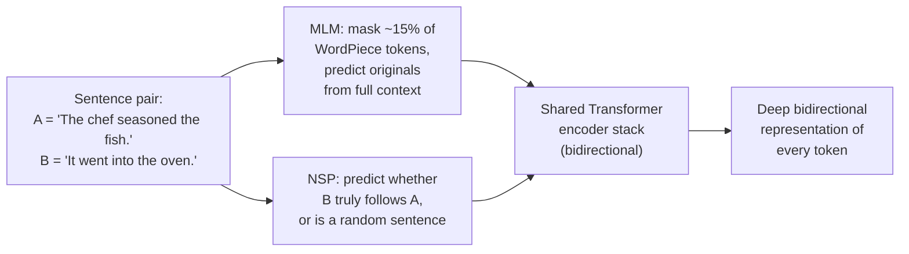
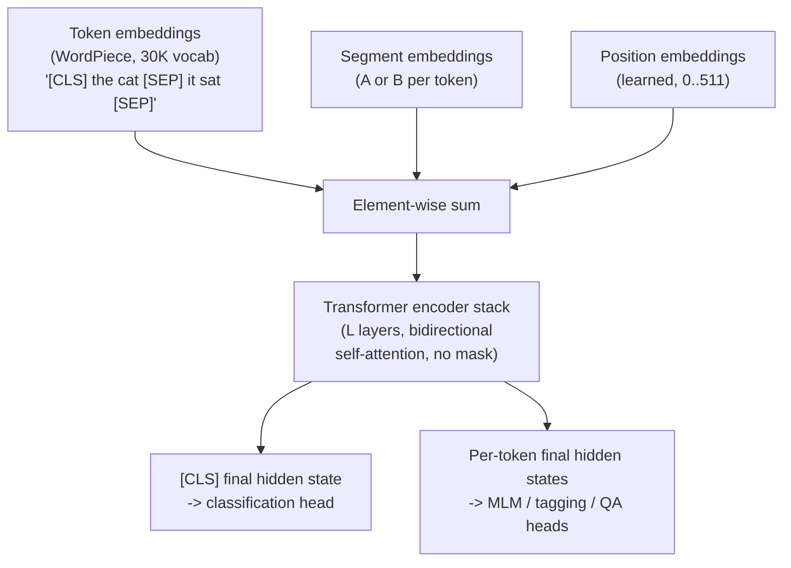
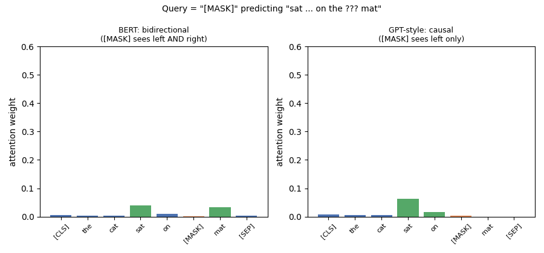
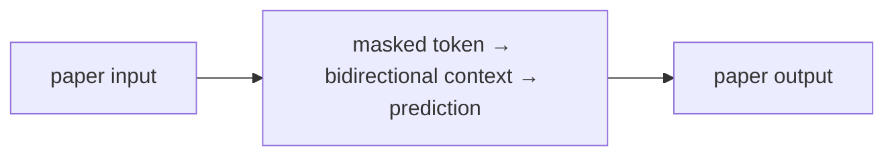
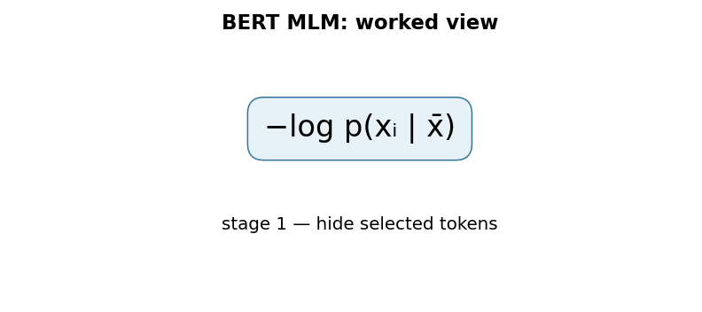

# BERT: Pre-training of Deep Bidirectional Transformers for Language Understanding

## 1. TL;DR
In October 2018, a team at Google AI Language proposed BERT (Bidirectional
Encoder Representations from Transformers): a way to pre-train a plain
Transformer *encoder* stack (Vaswani et al., 2017) on unlabeled text so
that every layer conditions on both left and right context simultaneously,
rather than reading left-to-right or gluing together two separate
left-to-right and right-to-left models. It does this with two pre-training
objectives — masked language modeling (predict randomly hidden words from
their full surrounding context) and next sentence prediction (predict
whether one sentence follows another) — and then fine-tunes the exact same
pre-trained weights, with only one lightweight task-specific layer added
on top, for a huge range of downstream tasks: sentence classification,
sentence-pair tasks, question answering, and token tagging. BERT pushed
the GLUE benchmark score to 80.5% and SQuAD v1.1 Test F1 to 93.2, and the
paper reports it obtained new state-of-the-art results on eleven NLP
tasks at the time. It became the template — pre-train once on raw text,
fine-tune cheaply per task — that most subsequent encoder-based NLP
systems followed.

## 2. Fun Map for First Years
BERT is a reading student who practices filling in missing words while looking both left and right. That practice builds a useful understanding of whole sentences.

`📖 sentence with blanks → 👀 read both directions → 🧩 guess blank → 🧠 reusable language skills`

BERT practices a fill-in-the-blank game millions of times. Because it can look left and right, it learns that the same word can mean different things in different sentences.

For “The bank approved the loan,” the words “approved” and “loan” help BERT fill a blank with the financial meaning of bank. A surrounding context can disambiguate the same spelling.

💻 **CS analogy:** masked-language training is like a unit test with a deliberately deleted variable that the program must reconstruct from surrounding context.

### Beginner walkthrough

Read the arrows as a sequence of responsibilities. First identify what enters
the system, then ask what the paper changes, what information is preserved or
discarded, and what leaves the operation. For **masked-language pretraining with bidirectional encoder layers**, the key question
is not “does the model sound clever?” but “which intermediate value carries the
new information, and what would go wrong if it were missing?”

### CS student checkpoint

The map corresponds to a small program: input data enters a function, the
paper-specific state or transformation runs, and an assertion checks **only selected masked positions contribute to the MLM loss and padding is ignored**.
The equation `−log p(xᵢ|context)` is the compact specification for that function. Trace
one concrete item through each arrow before thinking about larger batches,
parallel hardware, or production optimizations.

## 3. Math Playground
**Essential equation:** −log p(correct missing word | surrounding words). BERT fills in a hidden word and gives every possible word a probability. If it gives the real word 90%, the penalty is small; if it gives it 1%, the penalty is large. Training lowers this penalty, like grading a multiple-choice guess much more harshly when the correct answer was ranked last.

The essential equation or rule is:

```text
−log p(correct missing word | surrounding words)
```

The vertical bar means “given”: predict the missing word given its context. The log is a scoring trick that makes many small probabilities easier for a computer to add during training.

If BERT assigns 0.8 probability to the correct word, −log(0.8) is a small cost; at 0.01 it is much larger. The loss therefore rewards confidence on the right answer, not merely a correct top guess.

## 4. Background: What Came Before
Language models were often trained left-to-right, so a word representation could not use the words after it during pretraining. Task-specific models also had to be built from scratch for each benchmark. BERT was needed to learn reusable bidirectional language features from unlabeled text, then adapt them with a small supervised fine-tuning step.

This made it possible to pretrain one general language model and adapt it cheaply to many benchmarks instead of building a separate model for each.

Bidirectional pretraining became a reusable starting point: later task data could teach a small final adjustment instead of teaching language from scratch.

## 5. Why It Matters
Before BERT, the strongest pre-trained language representations came from
one of two families, and both had a real limitation. ELMo (Peters et al.,
2018) trained a *separate* left-to-right LSTM and a separate
right-to-left LSTM and concatenated their hidden states — a "shallow"
combination of two unidirectional views, not a single representation that
jointly conditions on both directions at every layer. OpenAI GPT (Radford
et al., 2018) used a Transformer decoder pre-trained purely
left-to-right, with a causal self-attention mask at every layer, so a
token's representation could never see anything to its right — a
deliberate constraint that makes autoregressive generation well-defined,
but a real cost for tasks like question answering or sentence
classification where the whole input is available up front and there is
no reason to hide half of it.

The paper's central argument is that standard language modeling
objectives are fundamentally unidirectional, and this limits the choice of
architectures usable during pre-training. A left-to-right objective forces
you to use a left-to-right model — you cannot train a token's
representation to use right context if the loss never asks it to predict
using right context. BERT's fix is to change the pre-training *objective*
rather than bolt bidirectionality onto a unidirectional model: replace
"predict the next word" with "predict a randomly masked word given its
full left and right context" (masked language modeling, or MLM, borrowing
the "Cloze task" idea from earlier psycholinguistics work). Because a
standard Transformer encoder's self-attention is unmasked by default —
every position already attends to every other position — MLM lets you
pre-train a plain, unmodified Transformer encoder stack (not the
decoder half used by GPT) and get genuine deep bidirectionality for free,
where "deep" means every one of the model's layers sees both directions,
not just a final concatenation step.

The paper reports results on eleven tasks after this change: GLUE average
80.5% (a 7.7-point absolute improvement over the prior state of the art at
the time), MultiNLI accuracy 86.7% (+4.6 points), SQuAD v1.1 Test F1 93.2
(+1.5 points), and SQuAD v2.0 Test F1 83.1 (+5.1 points). What changed
after: "pre-train a Transformer encoder on unlabeled text with a masked
objective, then fine-tune the whole thing per task with one small added
head" became the dominant recipe for encoder-based NLP for years —
RoBERTa, ALBERT, ELECTRA, and DistilBERT are all direct descendants that
kept the masked/bidirectional pre-training idea and iterated on training
recipe, parameter efficiency, or the pre-training objective itself.

## 6. Core Intuition
Think of reading a sentence with one word blanked out: **"The chef seasoned
the ___ before it went into the oven."** To guess the missing word, you
don't read strictly left-to-right and stop — you use "chef" and "seasoned"
from the left *and* "before it went into the oven" from the right at the
same time. That's the whole idea behind BERT's pre-training objective: take
real, unlabeled sentences, randomly hide (mask) about 15% of the words,
and train the model to predict each hidden word using everything else in
the sentence, in both directions, in a single pass.

This is different from asking a model to predict "the next word" given
only what came before, which is what a classic language model (and GPT)
does. A next-word predictor by construction never gets access to the
words after the one it's predicting — that's the whole task. A model
solving "fill in this blank in the middle of a sentence" has no such
restriction: right context is exactly as available as left context, and
the training signal explicitly rewards using it.

A second, independent training signal helps BERT reason about
relationships *between* sentences, not just within one. During
pre-training, the model is also shown pairs of sentences A and B and
asked a yes/no question: "does B actually follow A in the original text,
or is B a random sentence pulled from elsewhere in the corpus?" This is
next sentence prediction (NSP), and the paper's motivation for it is that
many important downstream tasks — question answering, natural language
inference — depend on understanding the *relationship* between two
sentences, something a single-sentence masked-word objective alone
doesn't directly train for.



Once pre-trained this way, the same encoder stack — same weights, same
architecture — gets reused for a completely different-looking task by
swapping only the very last layer: add a classification head on top of
the special `[CLS]` token's final representation for sentence-level tasks,
or add a start/end-span head over every token's representation for
question answering. The heavy lifting (understanding language) was
already learned during pre-training; fine-tuning is comparatively cheap
and fast because it's adapting, not learning from scratch.

## 7. The Mechanism
### Architecture: it's a Transformer encoder, unmodified

BERT's architecture is, deliberately, nothing new: it is a multi-layer
bidirectional Transformer encoder, essentially identical to the encoder
half of Vaswani et al. (2017) (see this repo's
[Attention Is All You Need explainer](../01-attention-is-all-you-need/README.md)
for the underlying scaled dot-product / multi-head attention mechanics).
The paper releases two sizes:

| Model | Layers (L) | Hidden size (H) | Attention heads (A) | Total parameters |
|---|---|---|---|---|
| BERT-BASE | 12 | 768 | 12 | 110M |
| BERT-LARGE | 24 | 1024 | 16 | 340M |

BERT-BASE was deliberately chosen to match OpenAI GPT's size for a fair
architectural comparison; BERT-LARGE shows what the same recipe does at
roughly 3x the parameter count. In both sizes, the feed-forward
intermediate size is `4H` (matching the `d_ff = 4 * d_model` ratio used
in the original Transformer's base configuration).

The one architectural property that matters most for everything else in
this section: a standard Transformer *encoder* self-attention layer has
**no directional mask at all** — every token attends to every other token
in the sequence, before and after it, with no `-infinity` scores anywhere
in the attention matrix. That's the entire mechanical difference from a
Transformer *decoder* layer (used by GPT), which applies a causal mask so
position *i* can only attend to positions `<= i`. BERT uses the encoder
half specifically because it wants that unrestricted, bidirectional
attention pattern; there is no new attention mechanism invented in this
paper, only a new way of training an existing one.

### Input representation

Because BERT needs to handle both single sentences and sentence pairs
with one unified input format, every input sequence is built from three
components summed together, position by position:

1. **WordPiece token embeddings** — a 30,000-token subword vocabulary
   (the same tokenization scheme used by earlier work), so rare words
   decompose into known sub-word pieces rather than becoming a single
   out-of-vocabulary token.
2. **Segment embeddings** — a learned embedding indicating whether a
   token belongs to sentence A or sentence B, letting the model tell the
   two sentences apart even after they're concatenated into one sequence.
3. **Position embeddings** — a *learned* embedding per absolute position
   (unlike the original Transformer's fixed sinusoidal encoding), up to a
   maximum sequence length of 512 tokens.

Every input sequence starts with a special `[CLS]` token, whose final
hidden state is used as the aggregate sequence representation for
classification tasks, and sentences within a sequence are separated by a
special `[SEP]` token.



### Pre-training objective 1: Masked Language Model (MLM)

Standard language-model training can't be made bidirectional by simply
removing the causal mask, because doing so would let a token trivially
"see itself" through the layers when the objective is "predict this exact
token" — with the mask gone, the answer is already sitting right there in
the input, and the model would trivially learn to just copy it forward
rather than learn anything about language. BERT's fix is to corrupt the
input first, then ask the model to reconstruct what was corrupted.

The exact procedure (paper section 3.1): for each training sequence,
15% of WordPiece token positions are randomly selected. For each selected
position:

- **80% of the time**, replace the token with a special `[MASK]` token.
- **10% of the time**, replace the token with a random token from the
  vocabulary.
- **10% of the time**, leave the token unchanged.

The model is then trained to predict the *original* token at every
selected position (not just the `[MASK]`-replaced ones), using a
cross-entropy loss over the vocabulary, with all other (unselected)
positions excluded from the loss.

Why not just mask 100% of the selected positions with `[MASK]`? The paper's
stated reasoning is a train/fine-tune mismatch problem: `[MASK]` never
appears in real text, so it never appears during fine-tuning either — if
every masked position were always literally `[MASK]` during pre-training,
the model could over-rely on a token that will simply never occur again at
fine-tuning time. Mixing in random-token and unchanged-token corruption
forces the model to keep a good contextual representation of *every*
token position, not just the ones flagged `[MASK]`, since it can never be
sure in advance which positions it's actually being asked to predict.

### Pre-training objective 2: Next Sentence Prediction (NSP)

For NSP, training examples are constructed as sentence pairs A and B: 50%
of the time B is the actual sentence that follows A in the source
document (label `IsNext`), and 50% of the time B is a random sentence
sampled from elsewhere in the corpus (label `NotNext`). The final hidden
state of the `[CLS]` token is fed into a single additional classification
layer trained to predict this binary label. The paper's own ablation
(discussed further below, under fine-tuning) finds that removing NSP
measurably hurts performance on tasks that depend on cross-sentence
reasoning, such as QNLI, MNLI, and SQuAD.

### Pre-training data and compute

Pre-training used BooksCorpus (800M words) and English Wikipedia (2,500M
words, text passages only — lists, tables, and headers were stripped
out), for roughly 3.3 billion words of raw text combined. Both models
were trained for 1,000,000 steps with a batch size of 256 sequences
(roughly 128,000 tokens per batch, since each sequence is up to 512
tokens); BERT-BASE trained on 4 Cloud TPUs (16 TPU chips) and BERT-LARGE
on 16 Cloud TPUs (64 TPU chips), each configuration taking about 4 days.

### Fine-tuning: same weights, one new layer

Because self-attention in a Transformer encoder already lets every input
position interact with every other position, fine-tuning BERT for a new
task is largely a matter of feeding it the right input/output format and
letting all parameters (the pre-trained encoder plus one new small
task-specific layer) update end-to-end on labeled data for that task:

- **Sentence-pair classification** (e.g. MNLI): feed sentence A and B as
  one sequence separated by `[SEP]`, classify from `[CLS]`'s final hidden
  state.
- **Single-sentence classification** (e.g. SST-2): same idea with a single
  sentence.
- **Question answering** (e.g. SQuAD): feed the question and passage as
  one sequence, and instead of a single classification head, add two
  vectors (learned during fine-tuning) whose dot product with every
  token's final hidden state produces a start-position score and an
  end-position score — the answer span is read off as the highest-scoring
  `(start, end)` pair.
- **Token-level tagging** (e.g. named entity recognition): classify every
  token's final hidden state independently.

This is the practical payoff of bidirectional pre-training: fine-tuning
is cheap (the paper reports it can be done in as little as one hour on a
single Cloud TPU, or a few hours on a GPU, for most tasks) specifically
*because* nearly all of the representational work was already done during
pre-training — fine-tuning is adjusting, not learning language from
scratch.

The animation below shows the mechanical crux of the whole paper: a
masked query token's attention reach, contrasted between BERT's
unrestricted bidirectional self-attention and a GPT-style causal
self-attention over the identical sentence and identical toy affinity
scores. Under bidirectional attention, the masked token can pull weight
from the word after it ("mat"); under a causal mask, that same weight is
architecturally zeroed out, because the position simply isn't visible yet.



### Ablations: why both bidirectionality and NSP matter

The paper's own ablation study (section 5.1) compares BERT-BASE against
two stripped-down variants trained with the exact same data and
hyperparameters: "No NSP" (MLM only, no next-sentence objective) and
"LTR & No NSP" (a left-to-right language-modeling objective instead of
MLM, with no NSP, architecturally resembling GPT). The paper reports that
removing NSP measurably hurts performance on QNLI, MNLI, and SQuAD, and
that replacing the bidirectional MLM objective with a left-to-right
objective produces large drops on MRPC and SQuAD specifically — SQuAD is
hit hardest, which the paper attributes to the token-level hidden states
in a purely left-to-right model having no right-side context at all,
which is intuitively a severe handicap for a task like span extraction
where the correct span boundary may depend on words that come after it.

### Mechanism in Code

At implementation level, the mechanism operates on token, segment, and position embeddings. A faithful
forward pass should follow this order: encode the full sequence, predict selected masks, then attach a task head. Keep the intermediate
representation available while debugging; collapsing everything into one
opaque framework call makes shape and numerical errors much harder to isolate.

The key production failure to guard against is letting labels or unmasked target tokens leak into the input. Add a tiny
reference test with hand-checkable values, then add a property test that
covers padding, empty/short inputs, boundary probabilities, and the largest
supported shape. Compare intermediate tensors with tolerances appropriate to
the dtype, and log the paper-specific statistic during a canary rollout.


## 8. Practical Engineering Notes
### Worked Math & Dataflow

The compact view below makes the paper's central calculation concrete:

```text
−log p(xᵢ | x̄)
```

In practice, the calculation is a pipeline: Only selected input positions contribute prediction targets, while the encoder can use both left and right context. This makes the pretraining signal different from next-token prediction. The important engineering
choice is to preserve the paper's intended invariant while making the operation
fit the available memory, batch size, and evaluation protocol.






**Where this lives in real code.** Hugging Face `transformers` implements
BERT with the same encoder-stack structure described above — an
embedding layer combining token/segment/position embeddings feeding into
a stack of self-attention + feed-forward encoder blocks (exact class
names and module paths shift release to release as the library
refactors; search the installed version's source for "Bert" in its
`modeling_bert.py`-style files, or more durably, load `bert-base-uncased`
via `AutoModel.from_pretrained` and let the library resolve the specific
class). The core self-attention math is the same unmasked
`softmax(QK^T / sqrt(d_k)) V` from the original Transformer — nothing
BERT-specific happens at the attention-math level, only at the level of
what mask (none) and what objective (MLM + NSP) are used.

**`[CLS]` is a learned aggregate, not a magic summary token.** It's
tempting to treat `[CLS]`'s final hidden state as automatically "the
meaning of the sentence," but that behavior is entirely a product of what
it was trained to do. During pre-training, `[CLS]`'s representation is
only directly supervised by the NSP loss; during fine-tuning, it's
whatever the fine-tuning task's classification head asks it to become.
For unsupervised or lightly-supervised sentence-similarity tasks, later
work (e.g. Sentence-BERT) found that raw `[CLS]` embeddings, or even a
naive mean of all token embeddings, from a BERT model that was never
fine-tuned for the purpose actually underperform much simpler baselines —
`[CLS]`'s representation is only as good as what it was fine-tuned or
pre-trained to encode, not a general-purpose sentence embedding by
default.

**NSP turned out to be a weaker signal than the paper's own framing
suggested, in later work.** RoBERTa (Liu et al., 2019) re-ran BERT's
pre-training recipe at larger scale and longer training and reported that
removing NSP entirely, while keeping single, contiguous, full-length
segments per training example instead of the original two-segment format,
did not hurt (and in their setup, modestly helped) downstream performance
compared to keeping NSP. This is a finding from later work outside this
paper, not a claim of the BERT paper itself — worth knowing if you read a
modern model card and notice NSP has quietly disappeared from the recipe.

**512-token max length is a hidden production constraint, not a footnote.**
Because BERT uses learned (not extrapolatable sinusoidal) position
embeddings up to a fixed maximum of 512, you cannot simply feed it a
longer document at inference time the way some other architectures allow
graceful degradation — positions beyond 512 have no embedding to look up
at all. In production, this means long documents need chunking, sliding
windows, or a different long-context architecture (e.g. Longformer,
BigBird) entirely; it isn't a tunable knob on a stock BERT checkpoint.

**Masking is a data-loading concern, not a model-architecture concern.**
Because the 80/10/10 MLM corruption happens to the *input* before it ever
reaches the model, it's implemented as a preprocessing/data-collation
step (see `DataCollatorForLanguageModeling` in Hugging Face `transformers`
for the modern equivalent), not inside the encoder's forward pass. This
matters practically: the encoder architecture itself is task-agnostic and
identical whether you're pretraining with MLM or fine-tuning on a
downstream task — only the data pipeline and the final task-specific
head change.

**Distillation and efficiency descendants exist because BERT-Large is
expensive to serve.** 340M parameters and full self-attention's O(n^2)
cost in sequence length (inherited unchanged from the underlying
Transformer encoder — see the Attention explainer in this repo for why)
made BERT-Large costly for latency-sensitive production inference. This
is the direct motivation behind DistilBERT (a smaller student model
trained to mimic BERT's outputs) and ALBERT (parameter-sharing across
layers to shrink the parameter count without shrinking depth) — both are
later work responding to a real deployment cost this paper doesn't itself
address.

## 9. Runnable Code Example
### Run from the repository root

Prerequisites: Python 3 and the dependencies imported by [`implementations/02-bert/code/bert_mlm_from_scratch.py`](implementations/02-bert/code/bert_mlm_from_scratch.py).
The example is intentionally small enough to run on CPU; it is a teaching
implementation, not a production training or serving benchmark.

```bash
python3 implementations/02-bert/code/bert_mlm_from_scratch.py
```

### What the example demonstrates

Read the module docstring first, then follow the functions implementing
**masked-language pretraining with bidirectional encoder layers**. The program turns `−log p(xᵢ|context)` into executable operations,
prints a compact result, and checks that **only selected masked positions contribute to the MLM loss and padding is ignored**. The assertion matters:
it tests the semantic contract near the mechanism instead of treating a
plausible final number as proof that the implementation is correct.

### Expected behavior and useful experiments

The command should finish without a traceback and print a successful summary
or assertion message. You should observe the paper-specific behavior, not a
particular random numeric value. Change one input at a time: inspect the
intermediate tensor or state, rerun with a boundary case, and then compare the
result with the expected invariant. A useful first experiment is to **assert masked positions and evaluate a small downstream classifier with a frozen preprocessing snapshot**.

### Production connection

The toy program does not model every distributed or large-scale concern. In a
real service, version the preprocessing and configuration, record the relevant
intermediate statistic, and measure peak memory, throughput, p95/p99 latency,
and task quality. The first production guard should target **train/serve tokenizer drift or an incorrect mask-label alignment**;
preserve a transparent reference path or a canary comparison before replacing
it with a fused, distributed, or highly optimized implementation.

## 10. Common Misconceptions & Pitfalls
- **Misconception: `−log p(xᵢ|context)` is the whole implementation.** The equation describes the paper's central relationship, but `masked-language pretraining with bidirectional encoder layers` also requires explicit input contracts, ordering, masking or sampling rules, and numerical choices. If those details are left implicit, two implementations can share the same formula and still produce different results. Treat the equation as a contract and document each intermediate tensor or state transition.
- **Misconception: the mechanism is automatically reliable when the final metric looks good.** A model can compensate for a wrong reduction, stale state, or malformed edge/token boundary on common examples. The local guard is **only selected masked positions contribute to the MLM loss and padding is ignored**. Check it on a tiny hand-worked fixture and on adversarial inputs before trusting an aggregate benchmark.
- **Pitfall: optimizing the operation before measuring its actual bottleneck.** For this paper, watch for **train/serve tokenizer drift or an incorrect mask-label alignment** rather than assuming the largest theoretical term dominates every workload. Record memory, bandwidth, batch shape, tail latency, and quality slices. An optimization is only safe when it preserves the paper-specific contract and has a rollback path.
- **Pitfall: debugging only the final prediction.** Start with **assert masked positions and evaluate a small downstream classifier with a frozen preprocessing snapshot**; compare intermediate values with a simple reference. Freeze preprocessing, configuration, seeds, and model versions; then bisect the first divergence. This makes a failure reproducible and distinguishes data-contract errors from numerical instability, integration bugs, and a genuinely unsuitable paper mechanism.

## 11. Quick Concept Checks
**Q:** What is the central idea behind **masked-language pretraining with bidirectional encoder layers**?
**A:** It is a structured data or optimization path, not a slogan: inputs are transformed, paper-specific relationships are computed, invalid choices are excluded when necessary, and the result is aggregated into an output or objective. The important implementation question is which intermediate values must remain observable so a reviewer can connect the code to the paper.

**Q:** How should I read `−log p(xᵢ|context)`?
**A:** Read each symbol as an operation with a shape, a data source, and a numerical range. Ask what changes when its scale, temperature, rank, timestep, neighborhood, or other paper-specific value changes. Then make a two- or three-example fixture where the expected result can be calculated by hand; this catches notation-to-code misunderstandings early.

**Q:** What invariant must a correct implementation preserve?
**A:** It must preserve **only selected masked positions contribute to the MLM loss and padding is ignored**. This is stronger than asking whether accuracy improved because it is local, deterministic, and testable near the operation that could be wrong. Assert it at the boundary, compare against a small reference implementation, and include the unusual input shape most likely to violate it in production.

**Q:** What is the most dangerous failure mode?
**A:** The first risk to investigate is **train/serve tokenizer drift or an incorrect mask-label alignment**. It can produce plausible outputs while degrading only a slice of traffic, so monitor a paper-specific statistic alongside quality and system metrics. A canary should compare the old and new paths on identical inputs and should retain enough intermediate diagnostics to explain a regression.

**Q:** How would I test this idea beyond a happy-path unit test?
**A:** Begin with **assert masked positions and evaluate a small downstream classifier with a frozen preprocessing snapshot**, then add differential tests against a transparent reference on small randomized inputs. Cover boundaries such as padding, termination, empty neighborhoods, long sequences, rare tokens, extreme values, or duplicated examples when they apply. Test both output values and gradients or state updates when training behavior is part of the paper's claim.

**Q:** What should I remember when applying the paper in a real system?
**A:** Keep the paper's assumptions in the production contract: version the preprocessing and configuration, expose the relevant intermediate statistic, and define quality slices before tuning performance. Compare throughput, peak memory, p95/p99 latency, and task quality against a baseline. The paper is useful only when its mechanism remains correct under the workload and failure modes you actually operate.

## 12. Interview Q&A
**Q:** Walk through **masked-language pretraining with bidirectional encoder layers** end to end. How would you implement `−log p(xᵢ|context)`?
**A:** Decompose the expression into the actual data path: inputs enter the paper-specific transformation, intermediate scores or states are computed, invalid elements are excluded, and the result is reduced into the output or loss. For this paper, `−log p(xᵢ|context)` is an executable contract, not decoration: document tensor shapes, ownership of mutable state, numerical precision, and where batching changes semantics. Keep a small reference implementation beside the optimized path so a reviewer can connect each line of `code` to one term in the equation.

**Follow-up:** What invariant would you assert, and why is it stronger than checking final accuracy?
**A:** Assert that **only selected masked positions contribute to the MLM loss and padding is ignored**. That property is local enough to fail near the defect, whereas accuracy can remain acceptable while a mask, reduction, or state boundary is wrong on a rare input. Add a hand-computed fixture, a randomized differential test against the reference, and shape/dtype assertions at the API boundary. The test should also cover an empty, padded, terminal, high-degree, long-context, or otherwise adversarial case when that input is meaningful for this mechanism.

**Q:** What is the main production trade-off in this paper, and how would you capacity-plan it?
**A:** The central trade-off is that **the mechanism changes both quality behavior and resource use**. Capacity planning therefore needs more than average FLOPs: measure peak memory, memory bandwidth, communication, preprocessing, batch-size sensitivity, and p95/p99 latency on representative distributions. Define a quality budget before optimizing, then compare a simple baseline with the paper mechanism using identical inputs and seeds. A faster path that silently changes tokenization, routing, masking, sampling, or optimization behavior is not an acceptable optimization until its quality impact is measured.

**Follow-up:** Which failure mode would make you roll back first?
**A:** Roll back on evidence of **train/serve tokenizer drift or an incorrect mask-label alignment**, especially when the symptom is silent and outputs still look plausible. Add dashboards for the paper-specific statistic, error and timeout rates, resource saturation, and a task metric sliced by difficult inputs. Use a canary or shadow comparison with the previous implementation, retain the old path behind a flag, and make the rollback decision threshold explicit before deployment. The important SDE2 judgment is to protect the paper’s semantic contract, not merely to chase a faster benchmark.

**Q:** A model passes unit tests but fails in production. What is your debugging plan?
**A:** Start with **assert masked positions and evaluate a small downstream classifier with a frozen preprocessing snapshot**. Reproduce the smallest production-shaped example, freeze the model and preprocessing versions, and compare intermediate tensors or records rather than only the final prediction. Check data contracts, masks, sequence boundaries, random seeds, numerical precision, and serving mode in that order; then bisect between the reference and optimized implementations. If the defect is not numerical, run a controlled ablation that removes the paper-specific mechanism and compare the resulting failure rate, which separates integration problems from a bad mechanism or configuration.

**Follow-up:** What evidence would you present in the review or postmortem?
**A:** Present one minimal failing input, the expected **only selected masked positions contribute to the MLM loss and padding is ignored**, the first intermediate value that diverged, and the regression test that now protects it. Include a before/after table for task quality, memory, throughput, p95/p99 latency, and cost, with slices for the failure population. A complete SDE2 answer also states the rollout guard, owner, and alert threshold. That turns a paper idea into an operable system rather than a one-line claim about an equation.

## 13. Further Reading
- [BERT: Pre-training of Deep Bidirectional Transformers for Language Understanding (arXiv:1810.04805)](https://arxiv.org/abs/1810.04805) — the original paper
- [Attention Is All You Need explainer, this repo](../01-attention-is-all-you-need/README.md) — the Transformer encoder architecture BERT reuses unmodified
- [Deep contextualized word representations / ELMo (Peters et al., 2018)](https://arxiv.org/abs/1802.05365) — the shallow bidirectional (concatenated forward/backward LSTM) approach BERT is explicitly contrasted against
- [Improving Language Understanding by Generative Pre-Training / GPT (Radford et al., 2018)](https://cdn.openai.com/research-covers/language-unsupervised/language_understanding_paper.pdf) — the left-to-right, causally-masked Transformer decoder model BERT is directly compared to throughout the paper
- [RoBERTa: A Robustly Optimized BERT Pretraining Approach (Liu et al., 2019)](https://arxiv.org/abs/1907.11692) — later work that re-examines NSP and BERT's training recipe at larger scale
