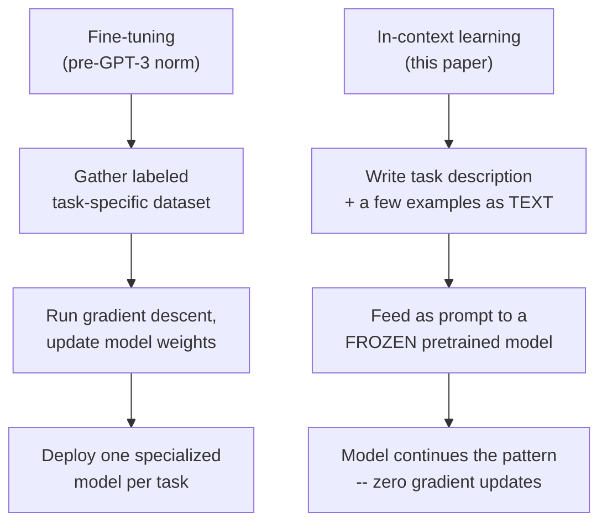
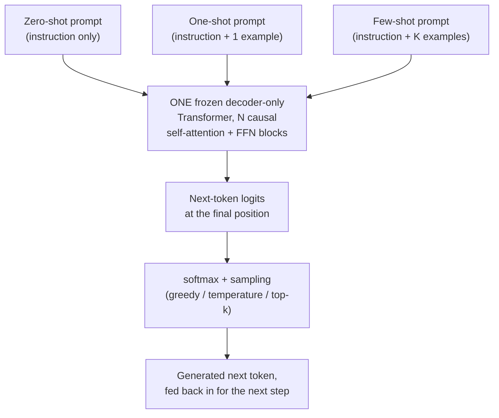
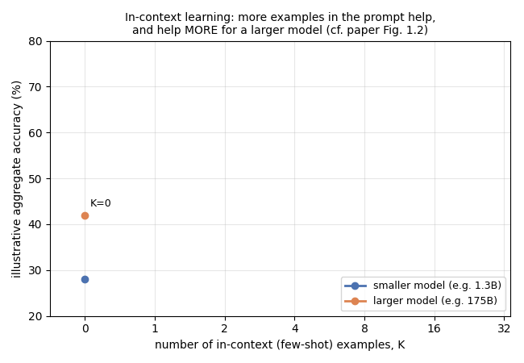
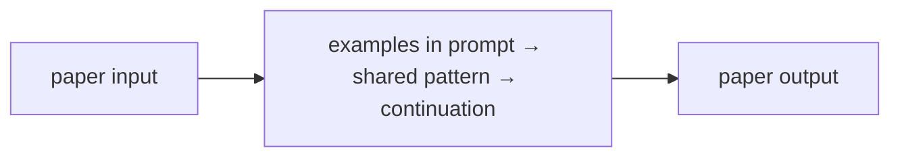
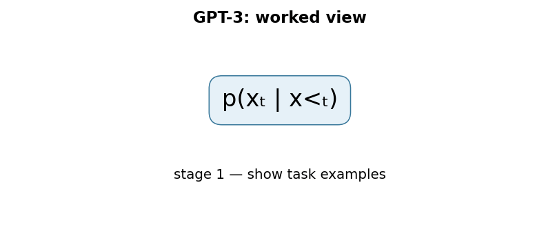

# Language Models are Few-Shot Learners (GPT-3)

## TL;DR

In May 2020, OpenAI released GPT-3: a 175-billion-parameter autoregressive
language model, roughly 10x larger than any previous non-sparse language
model at the time. The paper's central claim isn't about a new
architecture — GPT-3 is a scaled-up version of the same GPT-2-style,
decoder-only Transformer — it's about a new *capability that emerges from
scale*: given nothing but a natural-language task description and a
handful of examples written directly into the input prompt, GPT-3 can
perform a new task competitively with fine-tuned models, without any
gradient update or weight change at all. The paper calls this "in-context
learning," and it demonstrates that the more of it you give the model
(zero examples, one example, or many examples — "zero-shot," "one-shot,"
"few-shot"), and the bigger the model, the better it works. This single
finding — that task adaptation could happen entirely inside a prompt,
with no fine-tuning step — is the direct ancestor of the "prompt
engineering" and general-purpose chat-assistant paradigm that followed.

## Fun Map for First Years 🧭

GPT-3 is a next-word machine that can learn a pattern from examples placed in its prompt, like copying a worksheet format without changing its brain.

`📝 examples in prompt → 🤖 spot the pattern → 🔮 predict next text → 📤 answer`

Nothing inside the model is retrained when it sees those examples. The prompt acts like a temporary instruction sheet: show a few input-output pairs, then ask it to complete the next one.

A prompt can show “red → rojo” and “blue → azul,” then ask “green →”. The model continues a visible pattern, using its next-token skill rather than a new training update.

💻 **CS analogy:** autoregressive generation is a loop whose next iteration receives every previous output as state.

## Math Playground 🧮

**Essential equation:** p(x₁,…,xₙ) = ∏ p(xᵢ | x₁,…,xᵢ₋₁). The probability of a whole sentence is found by multiplying the chance of each next word after the earlier words. It is like calculating a sequence of dependent events: predict word 1, then word 2 given word 1, and so on. Few-shot learning comes from putting examples in that earlier-word history.

The essential equation or rule is:

```text
p(x₁,…,xₙ) = ∏ p(xᵢ | x₁,…,xᵢ₋₁)
```

The ∏ sign means “multiply all these pieces.” A good next-word predictor can use the examples in the prompt as clues about what continuation the user wants.

If each next word has a probability, a sentence’s probability shrinks when any one necessary word is very unlikely. Training improves the whole chain by improving many local next-word predictions.

## Background: What Came Before 🕰️

After pretraining, NLP systems commonly needed labeled task data and gradient-based fine-tuning for each new job. Earlier language models showed transfer, but their in-context abilities were less broadly demonstrated. GPT-3 was needed to test whether scale alone could let one next-token model pick up a task from instructions and examples placed in its prompt.

It showed a route to task adaptation at use time: describe the task with examples instead of changing the model’s weights.

This turned prompts into a practical adaptation interface, although results still depend heavily on wording, examples, and model scale.

## Why It Matters

Before GPT-3, the dominant recipe for applying a pretrained language model
to a new NLP task was the one GPT-3's own predecessor helped popularize:
pretrain a large Transformer on unlabeled text, then **fine-tune** it —
update its weights via gradient descent on a labeled dataset specific to
the target task (BERT, released in 2018, is the canonical example of this
pattern; see [papers/02-bert](../02-bert/README.md) in this repo). Fine-tuning
works well, but it has real structural costs: it requires a labeled
dataset for every new task, a separate set of fine-tuned weights (or a
full-size fine-tuning run) per task, and — the paper argues — because the
model is trained to be narrowly good at exactly the fine-tuning
distribution, it can exploit spurious dataset-specific patterns rather
than generalizing, which is part of why fine-tuned models have sometimes
generalized poorly out-of-distribution while still looking strong on
their own benchmark.

GPT-2 (2019) had already shown a hint of an alternative: a large enough
language model, trained purely to predict the next token on a huge, varied
text corpus, picks up rudimentary task-following behavior "for free" —
without any task-specific fine-tuning at all, just from being shown a
task-like prompt at generation time. GPT-3's contribution is to take that
hint and push it hard along one axis — scale — and to run a systematic
empirical study of what happens as you do. The paper trains a family of
eight models spanning 125 million to 175 billion parameters on the same
data mixture and evaluates every one of them in three prompting regimes:
**zero-shot** (a task instruction only, no examples), **one-shot** (the
instruction plus exactly one worked example), and **few-shot** (the
instruction plus, typically, ten to a few hundred worked examples — as
many as fit in the model's 2048-token context window) — all of it
supplied purely as text in the prompt, with **zero gradient updates in any
of the three regimes**.

The headline empirical result: performance improves substantially both as
the model gets bigger and as you give it more in-context examples, and —
crucially — the *few-shot advantage over zero-shot* itself grows with
model scale. On some benchmarks, GPT-3's few-shot performance reaches or
exceeds prior fine-tuned state-of-the-art results without ever having seen
a single labeled training example for that specific task during training.
On LAMBADA (a word-prediction benchmark requiring long-range context), the
paper reports GPT-3 achieves 86.4% accuracy in the few-shot setting, an
18-percentage-point improvement over the previous state of the art. On
TriviaQA, GPT-3's one-shot accuracy (68.0%) matches open-domain,
fine-tuned models that use explicit retrieval systems, and its few-shot
accuracy (71.2%) exceeds that mark by 3.2 points. On the SuperGLUE
benchmark suite, the paper reports a few-shot average of 71.8%, still
below the 89.0% fine-tuned state of the art (few-shot GPT-3 is not
universally competitive — it does close to fine-tuned-SOTA on some
component tasks like COPA, 92.0%, and ReCoRD, 91.1%, but trails on
others). What changed after this paper: the idea that you could get
useful, general task performance out of *prompting alone*, with no
fine-tuning pipeline, became the default way people first try to use a
large language model — the entire "prompt engineering" practice, and the
instruction-following chat assistants that followed (InstructGPT, ChatGPT,
and their many successors), build directly on the in-context-learning
capability this paper measured and named.

## Core Intuition

Think of it this way: **a fine-tuned model is a specialist who went to
school for one specific job. An in-context-learned model is a generalist
who reads the first few pages of a new job's manual, right there at their
desk, and starts doing the job — no training program, just really good
reading comprehension built up from a lifetime of reading almost
everything.**

The mechanical trick behind this is almost deceptively simple: a decoder-
only Transformer language model is trained to do exactly one thing —
predict the next token, given everything that came before it in its input
sequence. Nothing in that setup distinguishes "the text so far is a
sentence I'm continuing" from "the text so far is a few examples of a
task, followed by a new unsolved instance of that task, and the most
likely next tokens happen to be the correct answer." If the pretraining
corpus was broad and large enough to contain many implicit examples of
that second pattern — question-answer pairs, translated sentence pairs,
worked arithmetic, and so on — then a model good enough at general next-
token prediction will, as a side effect, get good at continuing a
few-shot-formatted prompt correctly. GPT-3's authors didn't design a
special "few-shot learning module" into the architecture at all — the
paper's argument is that this capability is an emergent side effect of
training a large enough next-token predictor on a large enough, varied
enough corpus.

Concretely, a few-shot prompt to GPT-3 for, say, English-to-French
translation looks like ordinary text:
```
sea otter => loutre de mer
cheese => fromage
peppermint => menthe poivrée
plush girafe => peluche de girafe
cheese =>
```
The model has never been told "you are now doing translation." It has
simply been shown a text pattern — several `English => French` pairs — and
is asked to predict the most likely continuation of that pattern. Because
GPT-3 was trained on a huge, unfiltered slice of the internet (which
contains an enormous amount of implicitly task-like text: FAQ pages,
glossaries, quizzes, bilingual text, and so on), it has, in effect,
already "seen" this shape of pattern many times before, just never
labeled as a "translation task." In-context learning is the model
recognizing the pattern at inference time and continuing it — it is
*pattern completion*, not a new learning algorithm bolted onto the
architecture.



The number of examples you show it — zero, one, or a few dozen — is
purely a choice about how long you make the input text before the query.
That's the paper's key empirical finding stated as intuition: **more
demonstrations = a longer, more specific pattern for the model to
recognize and continue, and a bigger model is better at recognizing
subtler versions of that pattern from fewer demonstrations.**

## The Mechanism

### Architecture: scaled-up GPT-2, not a new design

GPT-3 uses the same decoder-only Transformer architecture as GPT-2,
including the same initialization, pre-layer-normalization, and
byte-pair-encoding tokenization scheme, with one specific modeling
addition: the paper states it uses "alternating dense and locally banded
sparse attention patterns in the layers of the transformer, similar to
the Sparse Transformer" (Child et al., 2019). Everything else the paper
studies — in-context learning, few-shot performance, scaling behavior —
is a property of *what this same, largely unmodified architecture does
when trained much larger on much more data*, not of any new attention
mechanism or training objective. If you've read [papers/01](../01-attention-is-all-you-need/README.md)
in this repo, the core operation is unchanged: causal (left-to-right only)
self-attention, computed as `softmax(QK^T / sqrt(d_k)) V` with future
positions masked to `-inf`, exactly the mechanism used in this repo's
decoder-only smoke test below.



The diagram above is the mechanical core of this whole paper: three
different *inputs* (differing only in how many demonstrations they carry),
one unchanged model, one forward-pass function. Nothing about the box
labeled "ONE frozen decoder-only Transformer" is aware of which of the
three prompt types produced its input — from the model's perspective it
is always just doing the same thing it was trained to do: predict the
next token given everything before it.

The paper trains and evaluates a family of eight models at this
architecture, varying only depth and width:

| Model | Params | Layers | d_model | Heads | Head dim | Batch size | Learning rate |
|---|---|---|---|---|---|---|---|
| GPT-3 Small | 125M | 12 | 768 | 12 | 64 | 0.5M | 6.0e-4 |
| GPT-3 Medium | 350M | 24 | 1024 | 16 | 64 | 0.5M | 3.0e-4 |
| GPT-3 Large | 760M | 24 | 1536 | 16 | 96 | 0.5M | 2.5e-4 |
| GPT-3 XL | 1.3B | 24 | 2048 | 24 | 128 | 1M | 2.0e-4 |
| GPT-3 2.7B | 2.7B | 32 | 2560 | 32 | 80 | 1M | 1.6e-4 |
| GPT-3 6.7B | 6.7B | 32 | 4096 | 32 | 128 | 2M | 1.2e-4 |
| GPT-3 13B | 13.0B | 40 | 5140 | 40 | 128 | 2M | 1.0e-4 |
| **GPT-3 175B** | **175.0B** | **96** | **12288** | **96** | **128** | **3.2M** | **0.6e-4** |

All eight models share a context window of `n_ctx = 2048` tokens and were
trained on the same 300-billion-token mixture (the paper's Table 2.1 is
the source for this table). Note that batch size and learning rate both
*change with model size* — bigger models train with larger batches and
smaller (more conservative) learning rates, a pattern the paper attributes
to prior scaling-law work, not something specific to in-context learning.

### Training data: quality-weighted mixture, not raw proportional sampling

GPT-3 is trained on a mixture of five data sources, and — this is the
detail worth internalizing — the mixture weights are **not** proportional
to each source's raw size. Higher-quality, more curated sources
(Wikipedia, curated book corpora) are *oversampled* relative to their
share of total tokens, while the largest but noisiest source (a filtered
slice of Common Crawl) is *undersampled*:

| Dataset | Tokens | Weight in training mix | Epochs elapsed over 300B tokens |
|---|---|---|---|
| Common Crawl (filtered) | 410B | 60% | 0.44 |
| WebText2 | 19B | 22% | 2.9 |
| Books1 | 12B | 8% | 1.9 |
| Books2 | 55B | 8% | 0.43 |
| Wikipedia | 3B | 3% | 3.4 |

Reading the "epochs" column is the fastest way to see the oversampling in
action: Wikipedia (3B tokens) is seen 3.4 times over the course of
training despite being the smallest source, while Common Crawl (410B
tokens, by far the largest) is seen less than half of one time — most of
the raw Common Crawl data is never touched at all. The paper describes
filtering Common Crawl for quality (using a classifier trained to
distinguish it from curated reference corpora) and performing fuzzy
document-level deduplication "within and across datasets, to prevent
redundancy and preserve the integrity of our held-out validation set" —
i.e., part of the data pipeline exists specifically to reduce the risk of
train/test overlap (data contamination) inflating benchmark scores, which
the paper treats as a serious enough concern that it built dedicated
tooling to measure it and discusses its effects explicitly in a section of
the paper devoted to that analysis.

### Zero-shot, one-shot, and few-shot, precisely defined

The paper is precise about what these three terms mean, and the
distinction is about *how much task-specific text is in the prompt*, not
about any change to the model itself:

- **Zero-shot:** the model is given only a natural-language instruction
  describing the task — no worked examples at all.
- **One-shot:** the model is given the instruction plus exactly one
  worked example (input plus correct output) before the actual query.
- **Few-shot:** the model is given the instruction plus multiple worked
  examples — the paper generally uses "as many examples as will fit in
  the model's context window," typically in the range of 10 to 100 —
  before the actual query.

In every one of these three settings, **no gradient update happens and no
model weight changes** — the paper is explicit that "no weight updates
are allowed" in the few-shot condition specifically, to distinguish it
sharply from fine-tuning. The only thing that differs between the three
settings is how long the input token sequence is before the final
(unanswered) query. This is the property the code example in this repo
demonstrates directly: the exact same frozen decoder-only model, with an
unchanged parameter count, processes progressively longer input sequences
as you go from zero-shot to one-shot to few-shot.

### The empirical trend: bigger models benefit more from more examples

The paper's headline scaling result (its Figure 1.2) is not just "few-shot
beats zero-shot" — it's that **the size of the few-shot advantage itself
grows with model scale**. A small model gets only a modest boost from
seeing more in-context examples; the 175B model gets a much larger boost
from the same number of examples. The animation below is an illustrative,
synthetic reconstruction of that qualitative shape (not the paper's actual
numbers, which are reported as an aggregate over 42 accuracy-denominated
benchmarks, not a single closed-form curve) — the point being made is
purely structural: both curves rise as the number of in-context examples
`K` increases, but the larger model's curve rises faster and from a
higher starting point.



### Concrete benchmark numbers (grounded in the paper)

A sample of the paper's reported few-shot results, to make the scale of
"competitive with fine-tuned models" concrete:

- **LAMBADA** (predict the final word of a passage requiring long-range
  context): 86.4% few-shot accuracy, an 18-percentage-point improvement
  over the prior state of the art the paper compares against.
- **TriviaQA** (open-domain question answering): 68.0% one-shot accuracy,
  which the paper reports as matching open-domain QA systems that use
  fine-tuning combined with explicit retrieval — GPT-3 has no retrieval
  step, only what it memorized during pretraining and what's in the
  prompt; the few-shot accuracy (71.2%) exceeds that matched mark by 3.2
  points.
- **SuperGLUE** (aggregate of several hard NLU tasks): 71.8% few-shot
  average, against an 89.0% fine-tuned state of the art at the time — a
  clear case where few-shot GPT-3 does **not** close the gap to
  fine-tuning, though it does well on specific component tasks such as
  COPA (92.0%) and ReCoRD (91.1%), and clearly trails on others, such as
  RTE (69.0% few-shot vs. 92.5% fine-tuned SOTA).
- **Machine translation, English to French** (few-shot): 32.6 BLEU,
  which the paper reports as approaching (not exceeding) the best
  unsupervised neural machine translation results.
- **Arithmetic** (3-digit addition, few-shot): 80.4% accuracy — the paper
  reports this ability degrades as digit count grows, evidence (the paper
  argues) against pure training-set memorization, since 3-digit addition
  problems are extremely unlikely to appear verbatim in the training
  corpus at the needed frequency, though the paper is careful to frame
  this as suggestive rather than airtight given the scale and opacity of
  the training data.

The paper is explicit about where this approach falls short, too: it
reports that GPT-3 is comparatively weak in the few-shot and one-shot
settings on tasks that require comparing two sentences (certain natural
language inference tasks), and it underperforms on some reading
comprehension benchmarks such as QuAC and RACE relative to fine-tuned
systems on those same benchmarks.

### Mechanism in Code

At implementation level, the mechanism operates on a causal token prefix. A faithful
forward pass should follow this order: run masked self-attention, take next-token logits, sample or select, and append. Keep the intermediate
representation available while debugging; collapsing everything into one
opaque framework call makes shape and numerical errors much harder to isolate.

The key production failure to guard against is exceeding the context budget or changing prompt formatting between evaluation and serving. Add a tiny
reference test with hand-checkable values, then add a property test that
covers padding, empty/short inputs, boundary probabilities, and the largest
supported shape. Compare intermediate tensors with tolerances appropriate to
the dtype, and log the paper-specific statistic during a canary rollout.


## Practical Engineering Notes

### Worked Math & Dataflow

The compact view below makes the paper's central calculation concrete:

```text
p(xₜ | x<ₜ)
```

In practice, the calculation is a pipeline: The model learns a probability for the next token given the entire prefix. A few demonstrations change the prefix, so the task can be specified at inference time without updating weights. The important engineering
choice is to preserve the paper's intended invariant while making the operation
fit the available memory, batch size, and evaluation protocol.






**This is the paper that made "prompt engineering" a real discipline.**
Because task adaptation now happens by *writing better text into the
prompt* rather than by collecting a labeled dataset and running a
training job, the practical skill of getting good task performance out of
a large language model shifted substantially toward how you phrase the
instruction and choose/order the examples — the same underlying model,
given a slightly different prompt, can produce meaningfully different
task performance. This is a direct, load-bearing engineering consequence
of the in-context-learning mechanism this paper describes: the model has
no separate "task configuration" input; the entire task specification
lives in the same token stream as everything else, so its exact wording
and ordering are part of the model's effective input distribution.

**The context window is a hard, load-bearing constraint, and it was much
smaller than it is today.** GPT-3's `n_ctx = 2048` tokens has to hold the
task instruction, every few-shot demonstration, and the query, all at
once — which is precisely why the paper describes few-shot prompts as
using "as many examples as will fit in the model's context window."
Modern production LLM APIs now commonly offer context windows in the tens
to hundreds of thousands of tokens, but the underlying tradeoff GPT-3
exposed is unchanged: every token spent on demonstrations is a token not
spent on the model's own generated output (or on other demonstrations),
and because attention cost grows quadratically with sequence length (see
[papers/01](../01-attention-is-all-you-need/README.md) for why), a longer
few-shot prompt is not free — it costs more compute and latency per
request, every single request, not just once during a training run the
way fine-tuning cost is amortized.

**In-context learning does not remove the need for a labeled evaluation
set — it just removes the need for a labeled *training* set for gradient
updates.** You still need held-out, correctly labeled examples to know
whether your few-shot prompt is actually working, and — as the paper's
own contamination-analysis section makes clear — you need to actively
check that your evaluation examples were not memorized verbatim from a
training corpus that scraped a huge slice of the public internet, since
an apparently strong result on a benchmark whose answers leaked into
pretraining data is not evidence of the capability the benchmark is meant
to measure.

**Where this shows up in real inference code.** A modern decoder-only
causal-language-model inference call — whether through the Hugging Face
`transformers` library's stable public entry point (`AutoModelForCausalLM
.from_pretrained(...)` and its `.generate(...)` method) or a hosted
provider's chat/completions API — is, mechanically, exactly what this
paper describes: you construct one token sequence (system instructions +
demonstrations + query, however your particular API frames that), run one
forward pass per generated token through a frozen model, and sample the
next token from the resulting logits. There is no special "few-shot mode"
flag anywhere in the architecture or inference code — few-shot prompting
is a convention about *what text you put in the input*, not a code path.
This is exactly the property the runnable code example below asserts
directly: the same model, same weights, same forward-pass function
handles the zero-shot, one-shot, and few-shot cases, differing only in
input sequence length.

**Sampling parameters matter more once fine-tuning is off the table.**
Because you can no longer adjust a model's behavior by training it
further on your data, the practical levers available at inference time —
temperature, top-k / top-p (nucleus) sampling, and the prompt itself —
carry more of the weight of getting useful output. A low temperature
(closer to 0) makes sampling closer to always picking the single
highest-probability next token (greedy decoding); a higher temperature
flattens the probability distribution over the vocabulary, increasing
diversity but also increasing the odds of an incoherent or off-task
continuation. This paper doesn't introduce these sampling techniques, but
it's the paper that made getting them right, per-task, a routine part of
using an LLM in production, since there's no other lever left once
weights are frozen.

## Runnable Code Example

### Run from the repository root

Prerequisites: Python 3 and the dependencies imported by [`implementations/03-gpt3-few-shot-learners/code/gpt3_incontext_decoder.py`](implementations/03-gpt3-few-shot-learners/code/gpt3_incontext_decoder.py).
The example is intentionally small enough to run on CPU; it is a teaching
implementation, not a production training or serving benchmark.

```bash
python3 implementations/03-gpt3-few-shot-learners/code/gpt3_incontext_decoder.py
```

### What the example demonstrates

Read the module docstring first, then follow the functions implementing
**autoregressive in-context learning**. The program turns `p(xₜ|x₍<ₜ₎)` into executable operations,
prints a compact result, and checks that **the demonstration examples and query remain in order and the causal mask hides future tokens**. The assertion matters:
it tests the semantic contract near the mechanism instead of treating a
plausible final number as proof that the implementation is correct.

### Expected behavior and useful experiments

The command should finish without a traceback and print a successful summary
or assertion message. You should observe the paper-specific behavior, not a
particular random numeric value. Change one input at a time: inspect the
intermediate tensor or state, rerun with a boundary case, and then compare the
result with the expected invariant. A useful first experiment is to **hold weights fixed, replay prompts byte-for-byte, and compare task accuracy across controlled prompt variants**.

### Production connection

The toy program does not model every distributed or large-scale concern. In a
real service, version the preprocessing and configuration, record the relevant
intermediate statistic, and measure peak memory, throughput, p95/p99 latency,
and task quality. The first production guard should target **prompt-format sensitivity and context-window truncation**;
preserve a transparent reference path or a canary comparison before replacing
it with a fused, distributed, or highly optimized implementation.

## Common Misconceptions & Pitfalls

- **Misconception: `p(xₜ|x₍<ₜ₎)` is the whole implementation.** The equation describes the paper's central relationship, but `autoregressive in-context learning` also requires explicit input contracts, ordering, masking or sampling rules, and numerical choices. If those details are left implicit, two implementations can share the same formula and still produce different results. Treat the equation as a contract and document each intermediate tensor or state transition.
- **Misconception: the mechanism is automatically reliable when the final metric looks good.** A model can compensate for a wrong reduction, stale state, or malformed edge/token boundary on common examples. The local guard is **the demonstration examples and query remain in order and the causal mask hides future tokens**. Check it on a tiny hand-worked fixture and on adversarial inputs before trusting an aggregate benchmark.
- **Pitfall: optimizing the operation before measuring its actual bottleneck.** For this paper, watch for **prompt-format sensitivity and context-window truncation** rather than assuming the largest theoretical term dominates every workload. Record memory, bandwidth, batch shape, tail latency, and quality slices. An optimization is only safe when it preserves the paper-specific contract and has a rollback path.
- **Pitfall: debugging only the final prediction.** Start with **hold weights fixed, replay prompts byte-for-byte, and compare task accuracy across controlled prompt variants**; compare intermediate values with a simple reference. Freeze preprocessing, configuration, seeds, and model versions; then bisect the first divergence. This makes a failure reproducible and distinguishes data-contract errors from numerical instability, integration bugs, and a genuinely unsuitable paper mechanism.

## Quick Concept Checks

**Q:** What is the central idea behind **autoregressive in-context learning**?
**A:** It is a structured data or optimization path, not a slogan: inputs are transformed, paper-specific relationships are computed, invalid choices are excluded when necessary, and the result is aggregated into an output or objective. The important implementation question is which intermediate values must remain observable so a reviewer can connect the code to the paper.

**Q:** How should I read `p(xₜ|x₍<ₜ₎)`?
**A:** Read each symbol as an operation with a shape, a data source, and a numerical range. Ask what changes when its scale, temperature, rank, timestep, neighborhood, or other paper-specific value changes. Then make a two- or three-example fixture where the expected result can be calculated by hand; this catches notation-to-code misunderstandings early.

**Q:** What invariant must a correct implementation preserve?
**A:** It must preserve **the demonstration examples and query remain in order and the causal mask hides future tokens**. This is stronger than asking whether accuracy improved because it is local, deterministic, and testable near the operation that could be wrong. Assert it at the boundary, compare against a small reference implementation, and include the unusual input shape most likely to violate it in production.

**Q:** What is the most dangerous failure mode?
**A:** The first risk to investigate is **prompt-format sensitivity and context-window truncation**. It can produce plausible outputs while degrading only a slice of traffic, so monitor a paper-specific statistic alongside quality and system metrics. A canary should compare the old and new paths on identical inputs and should retain enough intermediate diagnostics to explain a regression.

**Q:** How would I test this idea beyond a happy-path unit test?
**A:** Begin with **hold weights fixed, replay prompts byte-for-byte, and compare task accuracy across controlled prompt variants**, then add differential tests against a transparent reference on small randomized inputs. Cover boundaries such as padding, termination, empty neighborhoods, long sequences, rare tokens, extreme values, or duplicated examples when they apply. Test both output values and gradients or state updates when training behavior is part of the paper's claim.

**Q:** What should I remember when applying the paper in a real system?
**A:** Keep the paper's assumptions in the production contract: version the preprocessing and configuration, expose the relevant intermediate statistic, and define quality slices before tuning performance. Compare throughput, peak memory, p95/p99 latency, and task quality against a baseline. The paper is useful only when its mechanism remains correct under the workload and failure modes you actually operate.

## Interview Q&A

**Q:** Walk through **autoregressive in-context learning** end to end. How would you implement `p(xₜ|x₍<ₜ₎)`?
**A:** Decompose the expression into the actual data path: inputs enter the paper-specific transformation, intermediate scores or states are computed, invalid elements are excluded, and the result is reduced into the output or loss. For this paper, `p(xₜ|x₍<ₜ₎)` is an executable contract, not decoration: document tensor shapes, ownership of mutable state, numerical precision, and where batching changes semantics. Keep a small reference implementation beside the optimized path so a reviewer can connect each line of `code` to one term in the equation.

**Follow-up:** What invariant would you assert, and why is it stronger than checking final accuracy?
**A:** Assert that **the demonstration examples and query remain in order and the causal mask hides future tokens**. That property is local enough to fail near the defect, whereas accuracy can remain acceptable while a mask, reduction, or state boundary is wrong on a rare input. Add a hand-computed fixture, a randomized differential test against the reference, and shape/dtype assertions at the API boundary. The test should also cover an empty, padded, terminal, high-degree, long-context, or otherwise adversarial case when that input is meaningful for this mechanism.

**Q:** What is the main production trade-off in this paper, and how would you capacity-plan it?
**A:** The central trade-off is that **the mechanism changes both quality behavior and resource use**. Capacity planning therefore needs more than average FLOPs: measure peak memory, memory bandwidth, communication, preprocessing, batch-size sensitivity, and p95/p99 latency on representative distributions. Define a quality budget before optimizing, then compare a simple baseline with the paper mechanism using identical inputs and seeds. A faster path that silently changes tokenization, routing, masking, sampling, or optimization behavior is not an acceptable optimization until its quality impact is measured.

**Follow-up:** Which failure mode would make you roll back first?
**A:** Roll back on evidence of **prompt-format sensitivity and context-window truncation**, especially when the symptom is silent and outputs still look plausible. Add dashboards for the paper-specific statistic, error and timeout rates, resource saturation, and a task metric sliced by difficult inputs. Use a canary or shadow comparison with the previous implementation, retain the old path behind a flag, and make the rollback decision threshold explicit before deployment. The important SDE2 judgment is to protect the paper’s semantic contract, not merely to chase a faster benchmark.

**Q:** A model passes unit tests but fails in production. What is your debugging plan?
**A:** Start with **hold weights fixed, replay prompts byte-for-byte, and compare task accuracy across controlled prompt variants**. Reproduce the smallest production-shaped example, freeze the model and preprocessing versions, and compare intermediate tensors or records rather than only the final prediction. Check data contracts, masks, sequence boundaries, random seeds, numerical precision, and serving mode in that order; then bisect between the reference and optimized implementations. If the defect is not numerical, run a controlled ablation that removes the paper-specific mechanism and compare the resulting failure rate, which separates integration problems from a bad mechanism or configuration.

**Follow-up:** What evidence would you present in the review or postmortem?
**A:** Present one minimal failing input, the expected **the demonstration examples and query remain in order and the causal mask hides future tokens**, the first intermediate value that diverged, and the regression test that now protects it. Include a before/after table for task quality, memory, throughput, p95/p99 latency, and cost, with slices for the failure population. A complete SDE2 answer also states the rollout guard, owner, and alert threshold. That turns a paper idea into an operable system rather than a one-line claim about an equation.

## Further Reading

- [Language Models are Few-Shot Learners (arXiv:2005.14165)](https://arxiv.org/abs/2005.14165) — the original paper
- [Language Models are Unsupervised Multitask Learners (GPT-2 paper)](https://cdn.openai.com/better-language-models/language_models_are_unsupervised_multitask_learners.pdf) — the predecessor whose zero-shot task-transfer results this paper scales up and studies systematically
- [Generating Long Sequences with Sparse Transformers (Child et al., 2019)](https://arxiv.org/abs/1904.10509) — the sparse attention pattern GPT-3's architecture description cites directly
- [Training language models to follow instructions with human feedback (InstructGPT)](https://arxiv.org/abs/2203.02155) — the direct successor that fine-tunes a GPT-3-family model with human feedback (RLHF) to make its in-context behavior more reliably instruction-following
- [papers/01-attention-is-all-you-need](../01-attention-is-all-you-need/README.md) — this repo's explainer of the Transformer architecture GPT-3's decoder is built from
