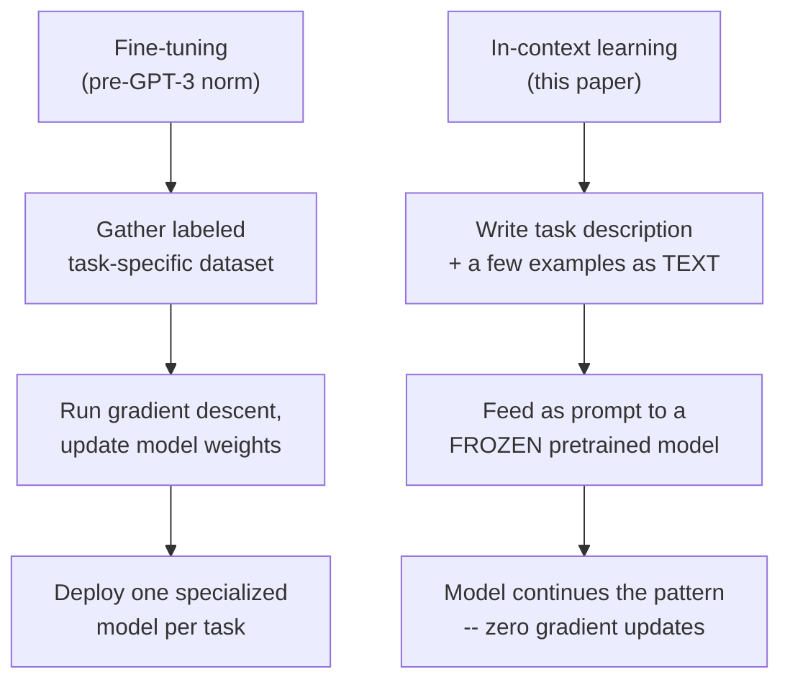
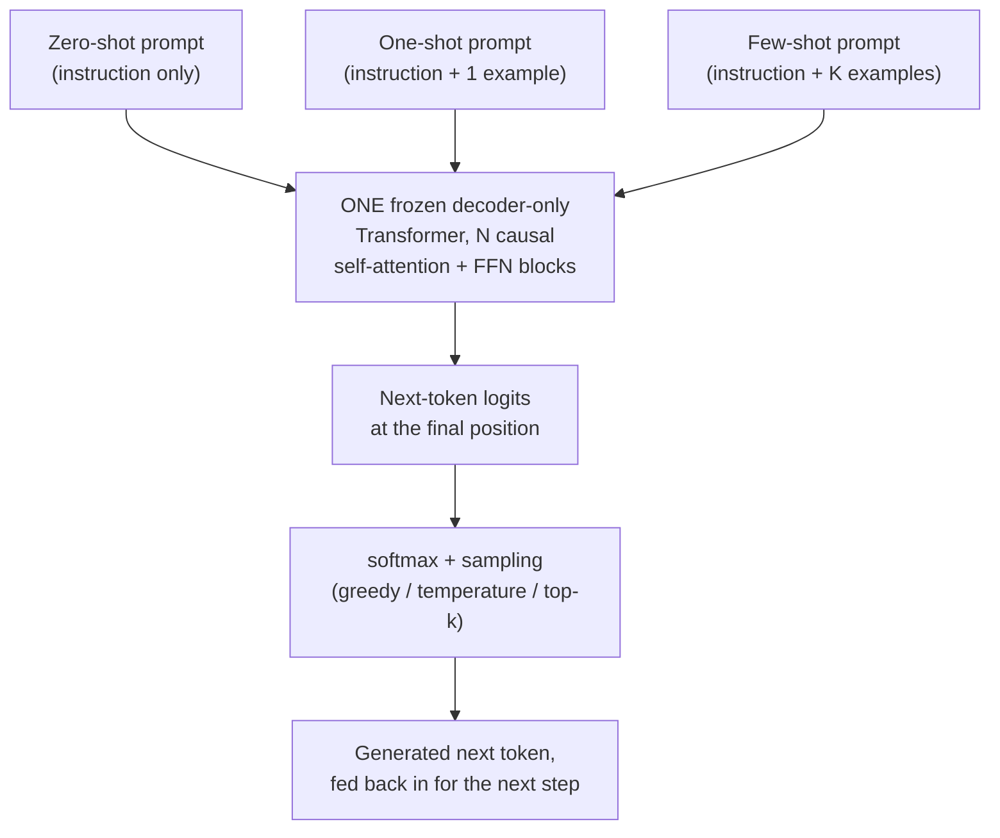

# Language Models are Few-Shot Learners (GPT-3)

## TL;DR

In May 2020, OpenAI released GPT-3: a 175-billion-parameter autoregressive
language model, roughly 10x larger than any previous non-sparse language
model at the time. The paper's central claim isn't about a new
architecture — GPT-3 is a scaled-up version of the same GPT-2-style,
decoder-only Transformer — it's about a new *capability that emerges from
scale*: given nothing but a natural-language task description and a
handful of examples written directly into the input prompt, GPT-3 can
perform a new task competitively with fine-tuned models, without any
gradient update or weight change at all. The paper calls this "in-context
learning," and it demonstrates that the more of it you give the model
(zero examples, one example, or many examples — "zero-shot," "one-shot,"
"few-shot"), and the bigger the model, the better it works. This single
finding — that task adaptation could happen entirely inside a prompt,
with no fine-tuning step — is the direct ancestor of the "prompt
engineering" and general-purpose chat-assistant paradigm that followed.

## Why It Matters

Before GPT-3, the dominant recipe for applying a pretrained language model
to a new NLP task was the one GPT-3's own predecessor helped popularize:
pretrain a large Transformer on unlabeled text, then **fine-tune** it —
update its weights via gradient descent on a labeled dataset specific to
the target task (BERT, released in 2018, is the canonical example of this
pattern; see [papers/02-bert](../02-bert/README.md) in this repo). Fine-tuning
works well, but it has real structural costs: it requires a labeled
dataset for every new task, a separate set of fine-tuned weights (or a
full-size fine-tuning run) per task, and — the paper argues — because the
model is trained to be narrowly good at exactly the fine-tuning
distribution, it can exploit spurious dataset-specific patterns rather
than generalizing, which is part of why fine-tuned models have sometimes
generalized poorly out-of-distribution while still looking strong on
their own benchmark.

GPT-2 (2019) had already shown a hint of an alternative: a large enough
language model, trained purely to predict the next token on a huge, varied
text corpus, picks up rudimentary task-following behavior "for free" —
without any task-specific fine-tuning at all, just from being shown a
task-like prompt at generation time. GPT-3's contribution is to take that
hint and push it hard along one axis — scale — and to run a systematic
empirical study of what happens as you do. The paper trains a family of
eight models spanning 125 million to 175 billion parameters on the same
data mixture and evaluates every one of them in three prompting regimes:
**zero-shot** (a task instruction only, no examples), **one-shot** (the
instruction plus exactly one worked example), and **few-shot** (the
instruction plus, typically, ten to a few hundred worked examples — as
many as fit in the model's 2048-token context window) — all of it
supplied purely as text in the prompt, with **zero gradient updates in any
of the three regimes**.

The headline empirical result: performance improves substantially both as
the model gets bigger and as you give it more in-context examples, and —
crucially — the *few-shot advantage over zero-shot* itself grows with
model scale. On some benchmarks, GPT-3's few-shot performance reaches or
exceeds prior fine-tuned state-of-the-art results without ever having seen
a single labeled training example for that specific task during training.
On LAMBADA (a word-prediction benchmark requiring long-range context), the
paper reports GPT-3 achieves 86.4% accuracy in the few-shot setting, an
18-percentage-point improvement over the previous state of the art. On
TriviaQA, GPT-3's one-shot accuracy (68.0%) matches open-domain,
fine-tuned models that use explicit retrieval systems, and its few-shot
accuracy (71.2%) exceeds that mark by 3.2 points. On the SuperGLUE
benchmark suite, the paper reports a few-shot average of 71.8%, still
below the 89.0% fine-tuned state of the art (few-shot GPT-3 is not
universally competitive — it does close to fine-tuned-SOTA on some
component tasks like COPA, 92.0%, and ReCoRD, 91.1%, but trails on
others). What changed after this paper: the idea that you could get
useful, general task performance out of *prompting alone*, with no
fine-tuning pipeline, became the default way people first try to use a
large language model — the entire "prompt engineering" practice, and the
instruction-following chat assistants that followed (InstructGPT, ChatGPT,
and their many successors), build directly on the in-context-learning
capability this paper measured and named.

## Core Intuition

Think of it this way: **a fine-tuned model is a specialist who went to
school for one specific job. An in-context-learned model is a generalist
who reads the first few pages of a new job's manual, right there at their
desk, and starts doing the job — no training program, just really good
reading comprehension built up from a lifetime of reading almost
everything.**

The mechanical trick behind this is almost deceptively simple: a decoder-
only Transformer language model is trained to do exactly one thing —
predict the next token, given everything that came before it in its input
sequence. Nothing in that setup distinguishes "the text so far is a
sentence I'm continuing" from "the text so far is a few examples of a
task, followed by a new unsolved instance of that task, and the most
likely next tokens happen to be the correct answer." If the pretraining
corpus was broad and large enough to contain many implicit examples of
that second pattern — question-answer pairs, translated sentence pairs,
worked arithmetic, and so on — then a model good enough at general next-
token prediction will, as a side effect, get good at continuing a
few-shot-formatted prompt correctly. GPT-3's authors didn't design a
special "few-shot learning module" into the architecture at all — the
paper's argument is that this capability is an emergent side effect of
training a large enough next-token predictor on a large enough, varied
enough corpus.

Concretely, a few-shot prompt to GPT-3 for, say, English-to-French
translation looks like ordinary text:
```
sea otter => loutre de mer
cheese => fromage
peppermint => menthe poivrée
plush girafe => peluche de girafe
cheese =>
```
The model has never been told "you are now doing translation." It has
simply been shown a text pattern — several `English => French` pairs — and
is asked to predict the most likely continuation of that pattern. Because
GPT-3 was trained on a huge, unfiltered slice of the internet (which
contains an enormous amount of implicitly task-like text: FAQ pages,
glossaries, quizzes, bilingual text, and so on), it has, in effect,
already "seen" this shape of pattern many times before, just never
labeled as a "translation task." In-context learning is the model
recognizing the pattern at inference time and continuing it — it is
*pattern completion*, not a new learning algorithm bolted onto the
architecture.



The number of examples you show it — zero, one, or a few dozen — is
purely a choice about how long you make the input text before the query.
That's the paper's key empirical finding stated as intuition: **more
demonstrations = a longer, more specific pattern for the model to
recognize and continue, and a bigger model is better at recognizing
subtler versions of that pattern from fewer demonstrations.**

## The Mechanism

### Architecture: scaled-up GPT-2, not a new design

GPT-3 uses the same decoder-only Transformer architecture as GPT-2,
including the same initialization, pre-layer-normalization, and
byte-pair-encoding tokenization scheme, with one specific modeling
addition: the paper states it uses "alternating dense and locally banded
sparse attention patterns in the layers of the transformer, similar to
the Sparse Transformer" (Child et al., 2019). Everything else the paper
studies — in-context learning, few-shot performance, scaling behavior —
is a property of *what this same, largely unmodified architecture does
when trained much larger on much more data*, not of any new attention
mechanism or training objective. If you've read [papers/01](../01-attention-is-all-you-need/README.md)
in this repo, the core operation is unchanged: causal (left-to-right only)
self-attention, computed as `softmax(QK^T / sqrt(d_k)) V` with future
positions masked to `-inf`, exactly the mechanism used in this repo's
decoder-only smoke test below.



The diagram above is the mechanical core of this whole paper: three
different *inputs* (differing only in how many demonstrations they carry),
one unchanged model, one forward-pass function. Nothing about the box
labeled "ONE frozen decoder-only Transformer" is aware of which of the
three prompt types produced its input — from the model's perspective it
is always just doing the same thing it was trained to do: predict the
next token given everything before it.

The paper trains and evaluates a family of eight models at this
architecture, varying only depth and width:

| Model | Params | Layers | d_model | Heads | Head dim | Batch size | Learning rate |
|---|---|---|---|---|---|---|---|
| GPT-3 Small | 125M | 12 | 768 | 12 | 64 | 0.5M | 6.0e-4 |
| GPT-3 Medium | 350M | 24 | 1024 | 16 | 64 | 0.5M | 3.0e-4 |
| GPT-3 Large | 760M | 24 | 1536 | 16 | 96 | 0.5M | 2.5e-4 |
| GPT-3 XL | 1.3B | 24 | 2048 | 24 | 128 | 1M | 2.0e-4 |
| GPT-3 2.7B | 2.7B | 32 | 2560 | 32 | 80 | 1M | 1.6e-4 |
| GPT-3 6.7B | 6.7B | 32 | 4096 | 32 | 128 | 2M | 1.2e-4 |
| GPT-3 13B | 13.0B | 40 | 5140 | 40 | 128 | 2M | 1.0e-4 |
| **GPT-3 175B** | **175.0B** | **96** | **12288** | **96** | **128** | **3.2M** | **0.6e-4** |

All eight models share a context window of `n_ctx = 2048` tokens and were
trained on the same 300-billion-token mixture (the paper's Table 2.1 is
the source for this table). Note that batch size and learning rate both
*change with model size* — bigger models train with larger batches and
smaller (more conservative) learning rates, a pattern the paper attributes
to prior scaling-law work, not something specific to in-context learning.

### Training data: quality-weighted mixture, not raw proportional sampling

GPT-3 is trained on a mixture of five data sources, and — this is the
detail worth internalizing — the mixture weights are **not** proportional
to each source's raw size. Higher-quality, more curated sources
(Wikipedia, curated book corpora) are *oversampled* relative to their
share of total tokens, while the largest but noisiest source (a filtered
slice of Common Crawl) is *undersampled*:

| Dataset | Tokens | Weight in training mix | Epochs elapsed over 300B tokens |
|---|---|---|---|
| Common Crawl (filtered) | 410B | 60% | 0.44 |
| WebText2 | 19B | 22% | 2.9 |
| Books1 | 12B | 8% | 1.9 |
| Books2 | 55B | 8% | 0.43 |
| Wikipedia | 3B | 3% | 3.4 |

Reading the "epochs" column is the fastest way to see the oversampling in
action: Wikipedia (3B tokens) is seen 3.4 times over the course of
training despite being the smallest source, while Common Crawl (410B
tokens, by far the largest) is seen less than half of one time — most of
the raw Common Crawl data is never touched at all. The paper describes
filtering Common Crawl for quality (using a classifier trained to
distinguish it from curated reference corpora) and performing fuzzy
document-level deduplication "within and across datasets, to prevent
redundancy and preserve the integrity of our held-out validation set" —
i.e., part of the data pipeline exists specifically to reduce the risk of
train/test overlap (data contamination) inflating benchmark scores, which
the paper treats as a serious enough concern that it built dedicated
tooling to measure it and discusses its effects explicitly in a section of
the paper devoted to that analysis.

### Zero-shot, one-shot, and few-shot, precisely defined

The paper is precise about what these three terms mean, and the
distinction is about *how much task-specific text is in the prompt*, not
about any change to the model itself:

- **Zero-shot:** the model is given only a natural-language instruction
  describing the task — no worked examples at all.
- **One-shot:** the model is given the instruction plus exactly one
  worked example (input plus correct output) before the actual query.
- **Few-shot:** the model is given the instruction plus multiple worked
  examples — the paper generally uses "as many examples as will fit in
  the model's context window," typically in the range of 10 to 100 —
  before the actual query.

In every one of these three settings, **no gradient update happens and no
model weight changes** — the paper is explicit that "no weight updates
are allowed" in the few-shot condition specifically, to distinguish it
sharply from fine-tuning. The only thing that differs between the three
settings is how long the input token sequence is before the final
(unanswered) query. This is the property the code example in this repo
demonstrates directly: the exact same frozen decoder-only model, with an
unchanged parameter count, processes progressively longer input sequences
as you go from zero-shot to one-shot to few-shot.

### The empirical trend: bigger models benefit more from more examples

The paper's headline scaling result (its Figure 1.2) is not just "few-shot
beats zero-shot" — it's that **the size of the few-shot advantage itself
grows with model scale**. A small model gets only a modest boost from
seeing more in-context examples; the 175B model gets a much larger boost
from the same number of examples. The animation below is an illustrative,
synthetic reconstruction of that qualitative shape (not the paper's actual
numbers, which are reported as an aggregate over 42 accuracy-denominated
benchmarks, not a single closed-form curve) — the point being made is
purely structural: both curves rise as the number of in-context examples
`K` increases, but the larger model's curve rises faster and from a
higher starting point.


### Concrete benchmark numbers (grounded in the paper)

A sample of the paper's reported few-shot results, to make the scale of
"competitive with fine-tuned models" concrete:

- **LAMBADA** (predict the final word of a passage requiring long-range
  context): 86.4% few-shot accuracy, an 18-percentage-point improvement
  over the prior state of the art the paper compares against.
- **TriviaQA** (open-domain question answering): 68.0% one-shot accuracy,
  which the paper reports as matching open-domain QA systems that use
  fine-tuning combined with explicit retrieval — GPT-3 has no retrieval
  step, only what it memorized during pretraining and what's in the
  prompt; the few-shot accuracy (71.2%) exceeds that matched mark by 3.2
  points.
- **SuperGLUE** (aggregate of several hard NLU tasks): 71.8% few-shot
  average, against an 89.0% fine-tuned state of the art at the time — a
  clear case where few-shot GPT-3 does **not** close the gap to
  fine-tuning, though it does well on specific component tasks such as
  COPA (92.0%) and ReCoRD (91.1%), and clearly trails on others, such as
  RTE (69.0% few-shot vs. 92.5% fine-tuned SOTA).
- **Machine translation, English to French** (few-shot): 32.6 BLEU,
  which the paper reports as approaching (not exceeding) the best
  unsupervised neural machine translation results.
- **Arithmetic** (3-digit addition, few-shot): 80.4% accuracy — the paper
  reports this ability degrades as digit count grows, evidence (the paper
  argues) against pure training-set memorization, since 3-digit addition
  problems are extremely unlikely to appear verbatim in the training
  corpus at the needed frequency, though the paper is careful to frame
  this as suggestive rather than airtight given the scale and opacity of
  the training data.

The paper is explicit about where this approach falls short, too: it
reports that GPT-3 is comparatively weak in the few-shot and one-shot
settings on tasks that require comparing two sentences (certain natural
language inference tasks), and it underperforms on some reading
comprehension benchmarks such as QuAC and RACE relative to fine-tuned
systems on those same benchmarks.

## Practical Engineering Notes

**This is the paper that made "prompt engineering" a real discipline.**
Because task adaptation now happens by *writing better text into the
prompt* rather than by collecting a labeled dataset and running a
training job, the practical skill of getting good task performance out of
a large language model shifted substantially toward how you phrase the
instruction and choose/order the examples — the same underlying model,
given a slightly different prompt, can produce meaningfully different
task performance. This is a direct, load-bearing engineering consequence
of the in-context-learning mechanism this paper describes: the model has
no separate "task configuration" input; the entire task specification
lives in the same token stream as everything else, so its exact wording
and ordering are part of the model's effective input distribution.

**The context window is a hard, load-bearing constraint, and it was much
smaller than it is today.** GPT-3's `n_ctx = 2048` tokens has to hold the
task instruction, every few-shot demonstration, and the query, all at
once — which is precisely why the paper describes few-shot prompts as
using "as many examples as will fit in the model's context window."
Modern production LLM APIs now commonly offer context windows in the tens
to hundreds of thousands of tokens, but the underlying tradeoff GPT-3
exposed is unchanged: every token spent on demonstrations is a token not
spent on the model's own generated output (or on other demonstrations),
and because attention cost grows quadratically with sequence length (see
[papers/01](../01-attention-is-all-you-need/README.md) for why), a longer
few-shot prompt is not free — it costs more compute and latency per
request, every single request, not just once during a training run the
way fine-tuning cost is amortized.

**In-context learning does not remove the need for a labeled evaluation
set — it just removes the need for a labeled *training* set for gradient
updates.** You still need held-out, correctly labeled examples to know
whether your few-shot prompt is actually working, and — as the paper's
own contamination-analysis section makes clear — you need to actively
check that your evaluation examples were not memorized verbatim from a
training corpus that scraped a huge slice of the public internet, since
an apparently strong result on a benchmark whose answers leaked into
pretraining data is not evidence of the capability the benchmark is meant
to measure.

**Where this shows up in real inference code.** A modern decoder-only
causal-language-model inference call — whether through the Hugging Face
`transformers` library's stable public entry point (`AutoModelForCausalLM
.from_pretrained(...)` and its `.generate(...)` method) or a hosted
provider's chat/completions API — is, mechanically, exactly what this
paper describes: you construct one token sequence (system instructions +
demonstrations + query, however your particular API frames that), run one
forward pass per generated token through a frozen model, and sample the
next token from the resulting logits. There is no special "few-shot mode"
flag anywhere in the architecture or inference code — few-shot prompting
is a convention about *what text you put in the input*, not a code path.
This is exactly the property the runnable code example below asserts
directly: the same model, same weights, same forward-pass function
handles the zero-shot, one-shot, and few-shot cases, differing only in
input sequence length.

**Sampling parameters matter more once fine-tuning is off the table.**
Because you can no longer adjust a model's behavior by training it
further on your data, the practical levers available at inference time —
temperature, top-k / top-p (nucleus) sampling, and the prompt itself —
carry more of the weight of getting useful output. A low temperature
(closer to 0) makes sampling closer to always picking the single
highest-probability next token (greedy decoding); a higher temperature
flattens the probability distribution over the vocabulary, increasing
diversity but also increasing the odds of an incoherent or off-task
continuation. This paper doesn't introduce these sampling techniques, but
it's the paper that made getting them right, per-task, a routine part of
using an LLM in production, since there's no other lever left once
weights are frozen.

## Runnable Code Example

See `code/gpt3_incontext_decoder.py` for a minimal, runnable decoder-only
causal Transformer (a toy GPT-3-shaped model: token embedding + learned
positional embedding + causal self-attention + feed-forward blocks) in
PyTorch, with no external dependencies beyond `torch`.

Running it (`python code/gpt3_incontext_decoder.py`) does three things:

1. Builds one `TinyGPT` model instance, then constructs three input token
   sequences of increasing length representing a zero-shot prompt (query
   only), a one-shot prompt (one demonstration + query), and a few-shot
   prompt (five demonstrations + query) — feeds all three through the
   *same* frozen model, and asserts the parameter count is identical
   before and after all three forward passes, and that sequence lengths
   strictly increase zero < one < few-shot. This is the direct code
   analogue of the paper's core claim: in-context learning is purely a
   longer input sequence through an unchanged model.
2. Verifies the causal-masking property that makes autoregressive
   generation well-defined: it appends one extra token after the
   zero-shot query and asserts the logits at the original query position
   are unchanged (within floating-point tolerance) — a position's output
   can never depend on tokens that come after it.
3. Runs greedy (argmax) decoding and temperature-scaled softmax sampling
   on the few-shot sequence's final-position logits, and asserts the
   resulting probability distribution sums to 1.

Expected output:
```
ok: zero-shot seq_len=2, one-shot seq_len=6, few-shot seq_len=22 -- same 22,450-parameter model, same forward pass, zero weight updates
ok: causal mask verified -- a later token cannot change an earlier position's logits
ok: greedy next-token id=7 at temperature=0.7, softmax probs sum to 1.0000
```

(The exact parameter count and predicted token id are deterministic given
the fixed random seed in the script but are not meaningful in themselves —
this is an untrained, randomly initialized toy model; the point of the
example is the *shape* of the computation, not its predictions.)

If you want to extend it: try increasing `n_layers` or `d_model` in
`TinyGPT` and re-running — the assertions should still pass unchanged,
because none of the properties being tested (frozen parameter count,
causal masking, valid softmax) depend on model size. That's exactly the
paper's point about scale: GPT-3's 175B-parameter model and its 125M
Small model share the identical mechanism this code demonstrates; scale
changes *how well* it works, not *whether* it works.

## Common Misconceptions & Pitfalls

- **"Few-shot learning in this paper means the model is being trained on
  the few examples you give it."** No — the paper is explicit that "no
  weight updates are allowed" in the few-shot setting. The examples are
  part of the input text the model conditions on for one forward pass, not
  training data for a gradient step. This is precisely the distinction the
  paper draws between "few-shot learning" (in-context, no weight update)
  and "fine-tuning" (weight update via gradient descent on labeled data) —
  conflating the two erases the paper's central contribution.
- **"GPT-3 introduced a new attention mechanism or architecture."** It
  did not — the paper explicitly builds on the same GPT-2-style
  decoder-only Transformer, with alternating dense and locally banded
  sparse attention patterns "similar to the Sparse Transformer" (a
  technique from prior work, not introduced in this paper). The paper's
  contribution is the scaling study and the empirical characterization of
  in-context learning, not a novel model architecture.
- **"More few-shot examples always helps, without limit."** The context
  window is a hard ceiling (`n_ctx = 2048` for GPT-3) — you cannot supply
  more demonstration tokens than fit alongside the instruction and query,
  and the paper's own results show diminishing (not indefinitely growing)
  returns as K increases within that window. This repo's GIF depicts
  monotonically increasing curves for illustration, but the paper does not
  claim the trend is unbounded.
- **"GPT-3's strong few-shot numbers prove it 'understands' language the
  way a human does."** The paper itself is measured about this: it
  reports numbers, notes where the model is weak (certain
  sentence-comparison and reading-comprehension tasks), and dedicates
  real space to discussing data contamination risk and the difficulty of
  fully ruling out that some benchmark performance reflects patterns
  memorized from a huge, largely unfiltered web-scale training corpus
  rather than a general reasoning capability. Treat "the paper shows X" and
  "later work argues X" as different claims — this explainer tries to mark
  that distinction explicitly throughout, and you should do the same when
  reading benchmark headlines.
- **"Scaling parameters is the only lever that matters, so a bigger model
  is strictly better for a given task."** The training-data table in this
  explainer's Mechanism section shows the paper deliberately *does not*
  scale data proportionally with model size on a per-source basis — some
  smaller, higher-quality sources are oversampled relative to their size.
  Model scale, data scale, and data quality are three separate levers the
  paper manipulates together; crediting results to parameter count alone
  overstates what one paper's specific data-mixture choices established.

## Interview Q&A

**Q:** What, precisely, is the difference between few-shot learning as
this paper defines it and fine-tuning?
**A:** Fine-tuning updates the model's weights via gradient descent on a
labeled dataset for the target task — you end up with a separate,
specialized set of weights per task. Few-shot learning (in this paper's
sense) supplies the task instruction and several worked examples as plain
text inside the input prompt to a single frozen model, and the paper is
explicit that in this setting "no weight updates are allowed" — the model
never sees a gradient computed from those examples. The only thing that
differs across zero-shot, one-shot, and few-shot is how much task-specific
text sits in the input before the query; the underlying model and its
parameters are completely unchanged in all three cases.

**Q:** Did GPT-3 introduce a new model architecture to make in-context
learning work?
**A:** No. The paper uses essentially the same architecture as GPT-2 — a
decoder-only Transformer with causal self-attention — with one specific
addition: "alternating dense and locally banded sparse attention patterns
in the layers of the transformer, similar to the Sparse Transformer," a
technique from prior work rather than a novel contribution of this paper.
In-context learning is not a special module bolted onto the model; the
paper's argument is that it's an emergent behavior of training a
large-enough version of an otherwise ordinary next-token predictor on a
large, varied enough training corpus.

**Q:** Why does the paper's training data mixture oversample Wikipedia
and undersample Common Crawl, given that Common Crawl is by far the
largest source?
**A:** The paper weights training-mix sampling by source quality rather
than raw token count: Common Crawl (410B tokens, 60% weight) is seen only
0.44 times over the course of training, while Wikipedia (3B tokens, 3%
weight) is seen 3.4 times. Common Crawl, though enormous, is a noisy,
largely unfiltered scrape of the web; Wikipedia and curated book corpora
are comparatively higher-quality, more consistent text. The paper is
willing to under-sample a much larger but noisier corpus and repeat a
smaller, cleaner one several times over, on the view that data quality,
not just data quantity, affects downstream model quality.

**Q:** The paper reports 3-digit addition accuracy dropping as digit
count increases. Why does the paper treat this as evidence against pure
memorization, and how strong is that evidence really?
**A:** The paper's reasoning is that if GPT-3 were simply recalling
arithmetic answers memorized verbatim from its training corpus, there's
no obvious reason accuracy should degrade smoothly as problems get
harder (more digits) — you'd expect either "this exact problem was seen"
or "it wasn't," not a graceful accuracy curve. A smoothly degrading curve
is more consistent with the model having learned something like a
general (if imperfect) arithmetic procedure. That said, the paper itself
is careful here — it does not claim to have proven the model isn't
partially relying on memorized patterns for simpler problems; given the
scale and opacity of a huge web-scraped training corpus, this is
presented as suggestive evidence, not a controlled ablation that rules
memorization out entirely.

**Q:** Where does the "prompt engineering" practice used with modern LLM
APIs trace directly back to in this paper?
**A:** To the paper's demonstration that a frozen, pretrained model's task
performance can vary substantially based purely on how the input text
(instruction + demonstrations + query ordering and wording) is
constructed — with no way to further adjust the model itself short of a
full fine-tuning run. Because the entire task specification lives inside
the same token sequence the model conditions on, and because the paper
shows this channel alone can get you competitive performance on some
tasks, the practical skill of authoring effective prompts became a
first-class part of using large language models in production, in a way
it simply wasn't as relevant when fine-tuning was the primary adaptation
mechanism.

**Q:** GPT-3's few-shot SuperGLUE score (71.8%) is well below the fine-
tuned state of the art (89.0%) reported in the paper. Does that
contradict the paper's headline claim?
**A:** Not really — it's consistent with the paper's actual claim, which
is narrower than "few-shot always matches fine-tuning." The paper
presents a mix of results: some benchmarks (like LAMBADA, at 86.4%
few-shot) where GPT-3 beats prior fine-tuned state of the art outright;
some (like TriviaQA) where its one-shot result matches, and its few-shot
result exceeds, strong fine-tuned-plus-retrieval systems; and some (like
the SuperGLUE aggregate, and specific tasks like
QuAC and RACE) where it clearly trails fine-tuning. The paper's
contribution is characterizing this whole landscape — where in-context
learning closes the gap to fine-tuning and where it doesn't — not
claiming a uniform victory over fine-tuning on every task.

**Q:** Why does the context window size (`n_ctx = 2048` tokens for
GPT-3) matter as a practical engineering constraint, independent of the
model's parameter count?
**A:** Every token of a few-shot prompt — the instruction, every
demonstration, and the query — has to fit inside that fixed window, so
context length places a hard ceiling on how many demonstrations you can
supply, regardless of how capable the underlying model is. And because
self-attention's compute and memory cost grows quadratically with
sequence length (see this repo's [Attention Is All You Need explainer](../01-attention-is-all-you-need/README.md)),
a longer few-shot prompt is not just a formatting choice — it's a real,
recurring compute and latency cost paid on every single inference
request, unlike a fine-tuning cost that's paid once and amortized across
many later requests.

## Further Reading

- [Language Models are Few-Shot Learners (arXiv:2005.14165)](https://arxiv.org/abs/2005.14165) — the original paper
- [Language Models are Unsupervised Multitask Learners (GPT-2 paper)](https://cdn.openai.com/better-language-models/language_models_are_unsupervised_multitask_learners.pdf) — the predecessor whose zero-shot task-transfer results this paper scales up and studies systematically
- [Generating Long Sequences with Sparse Transformers (Child et al., 2019)](https://arxiv.org/abs/1904.10509) — the sparse attention pattern GPT-3's architecture description cites directly
- [Training language models to follow instructions with human feedback (InstructGPT)](https://arxiv.org/abs/2203.02155) — the direct successor that fine-tunes a GPT-3-family model with human feedback (RLHF) to make its in-context behavior more reliably instruction-following
- [papers/01-attention-is-all-you-need](../01-attention-is-all-you-need/README.md) — this repo's explainer of the Transformer architecture GPT-3's decoder is built from
