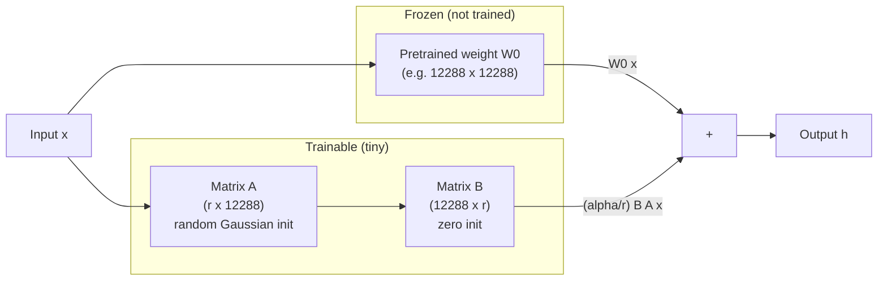
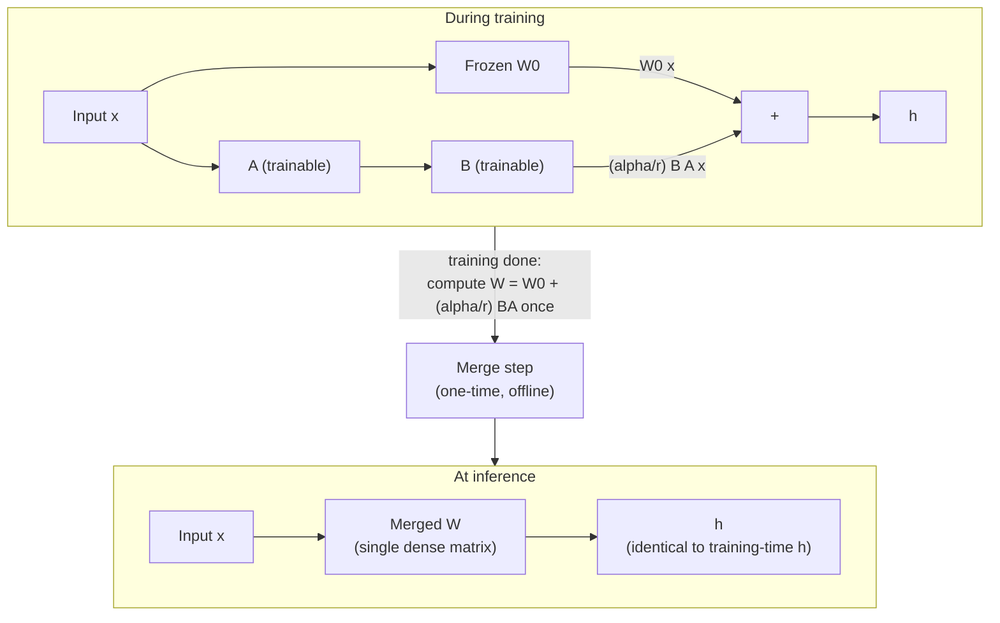
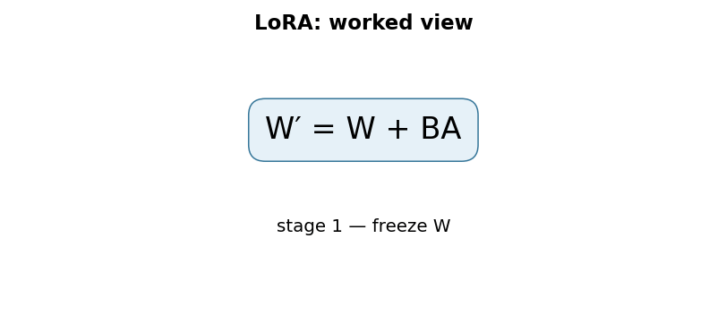

# LoRA: Low-Rank Adaptation of Large Language Models

## TL;DR

In 2021, researchers at Microsoft proposed LoRA: instead of updating every
weight of a large pretrained model during fine-tuning, freeze the entire
pretrained model and train only a tiny pair of low-rank matrices injected
alongside each weight matrix you want to adapt. The paper reports that on
GPT-3 175B, this cuts the number of trainable parameters by roughly
10,000x and the GPU memory needed for training by about 3x, while
matching or slightly exceeding full fine-tuning quality on the benchmarks
it tests. Because the low-rank update can be mathematically merged back
into the original weight matrix before deployment, LoRA also adds zero
extra inference latency compared to a normally fine-tuned model — a
property adapter-based methods do not share. This combination (huge
training-cost reduction, no runtime cost) is why LoRA became the default
way the industry fine-tunes large models, and the direct ancestor of the
whole "parameter-efficient fine-tuning" (PEFT) ecosystem, including
QLoRA and countless production fine-tuning pipelines.

## Fun Map for First Years 🧭

LoRA teaches a huge model a small new habit without repainting its entire brain. It adds tiny “correction notes” instead of replacing the original textbook.

`🧠 frozen big model + 📝 tiny correction → 🎯 new task behavior → 💾 small saved update`

The base model stays unchanged, so many tasks can share it. Each task only needs its own small patch, which saves training memory and storage.

For a customer-support task, one LoRA patch can teach a response style while the shared base remains available for translation or coding. Swapping a patch changes behavior without downloading a whole new model.

💻 **CS analogy:** LoRA is a small patch file applied at runtime instead of copying and editing an entire large binary.

## Math Playground 🧮

The essential equation or rule is:

```text
W′ = W + BA
```

**Essential equation:** W′ = W + BA. W is the original large table of model weights; instead of changing every cell, LoRA learns two skinny tables, B and A. Multiplying the skinny tables makes a compact change table, then adding it to W adapts the model. Think of storing a small patch file rather than a complete second copy of a program.

The prime means “new version.” Low rank means the patch is built from a small number of reusable patterns, so B and A can be much smaller than W.

Matrix multiplication BA combines a small number of directions from A with a small number from B. The result can change a large W, but only along those selected directions.

## Background: What Came Before 🕰️

Full fine-tuning copies and changes every weight for every task, which is expensive to store, train, and deploy as base models grow. Earlier adapter methods added task modules but could introduce inference overhead. LoRA was needed to express a useful weight update as a small, mergeable low-rank patch.

This made adapting giant models practical for many teams and tasks instead of requiring a full private copy for each job.

The key systems consequence is that adapters can be stored, versioned, reviewed, and rolled back like small artifacts rather than full model checkpoints.

## Why It Matters

Before LoRA, if you wanted to adapt a large pretrained model — say GPT-3
175B — to a new task, your two realistic options were both expensive in
different ways. **Full fine-tuning** updates every parameter in the
model, which means for GPT-3 175B you need enough GPU memory to hold the
weights, the gradients, and the Adam optimizer's two moment estimates for
all 175 billion parameters simultaneously — the paper reports this
required roughly 1.2TB of VRAM in their training setup, far beyond what
any single accelerator (or often even a single node) provides, and every
fine-tuned copy of the model is a full 175-billion-parameter checkpoint
you have to store and manage separately. If you're serving ten different
fine-tuned variants of the same base model for ten different customers or
tasks, you're storing (and potentially loading) ten full copies of a
model that differs from its neighbors in only a small, task-specific way.

The alternative that existed before LoRA was **parameter-efficient
fine-tuning via adapters or prompt/prefix tuning** — freeze the base
model and insert small trainable modules (adapter layers between
Transformer sublayers, or trainable "virtual tokens" prepended to the
input). These approaches do cut the number of trainable parameters
dramatically, but each comes with its own structural cost. Adapter
layers are inserted directly into the model's forward path, so every
inference call has to run through them sequentially — the paper cites
prior work showing this adds measurable inference latency, especially
in the low-batch-size, short-sequence online-serving setting that
production systems actually run in (it doesn't parallelize away, because
the extra depth is on the model's critical path). Prefix/prompt tuning,
meanwhile, eats into the model's usable input sequence length (every
token spent on a trainable prefix is a token not available for the
user's actual input) and the paper reports that in their experiments its
performance was non-monotonic and sometimes unstable as the number of
trainable prefix parameters increased, making it harder to tune reliably
than the alternatives.

LoRA's contribution was showing you could get parameter-efficiency
without either of those costs. It doesn't touch the model's forward-path
depth (no new sequential layers to run through) and it doesn't consume
any of the input sequence (no prefix tokens). Instead, it exploits an
empirical observation the paper makes explicit: the *change* a
pretrained model's weights need to undergo to specialize to a new task
appears to have a very low "intrinsic rank" — you don't need a full-rank
update to capture most of the useful adaptation, a much lower-rank
approximation of that update captures most of what matters. That's a
claim about the *task-specific update*, not about the pretrained weights
themselves, and it's the load-bearing empirical finding the whole method
rests on.

What changed after: LoRA rapidly became the default fine-tuning
technique across the open-source LLM ecosystem. It's the mechanism
behind QLoRA (which combines LoRA with 4-bit quantization of the frozen
base model to fine-tune large models on a single consumer GPU), it's
built into Hugging Face's `peft` library as arguably its flagship method,
and most "fine-tune your own copy of this open model" tutorials you'll
find today are, under the hood, LoRA fine-tuning. The pattern of
"freeze almost everything, train a small low-rank side-path" also
generalized well beyond text — you'll see the same idea applied to
diffusion image models, vision transformers, and multimodal models,
usually still called LoRA even outside the original NLP setting.

## Core Intuition

Think of a pretrained model's weight matrix as a giant, already-very-good
map of relationships the model learned during pretraining. Full
fine-tuning says: "redraw the entire map from scratch, adjusting every
single line, to fit this new task." LoRA says something much more
modest: **"keep the whole map exactly as it is, and hand me a
transparent overlay sheet I can draw a few new, simple lines on, so that
map-plus-overlay does what I need for this task."**

The overlay sheet is deliberately *low-rank* — it can't express an
arbitrary, fully independent correction to every entry of the original
map; it can only express corrections that are themselves built from a
much smaller number of "directions." That sounds like it should be a
serious limitation, but the paper's central empirical bet — later
confirmed by their rank analysis — is that the corrections a pretrained
model actually needs for a new downstream task live mostly in a
small number of directions anyway. Most of the "capacity" a full,
full-rank weight update would offer turns out to be capacity the task
doesn't need.

A second piece of intuition: because the overlay starts as a *blank*
transparent sheet (mathematically, the update is initialized to exactly
zero), training doesn't start by perturbing the model's behavior at
all — it starts from the frozen pretrained model's exact original
behavior and gradually learns which small set of adjustments help. This
is different from full fine-tuning, where every weight starts moving
away from its pretrained value from step one.

A third piece, and the one that makes this practical rather than just
elegant: once training finishes, the overlay sheet and the original map
can be **physically merged into a single new map** — you don't need to
carry the overlay around separately at inference time, paying an
extra lookup cost on every request. This is the property that
distinguishes LoRA from adapter layers, which stay as separate modules
the forward pass must run through even after training ends.



## The Mechanism

### The core equation

For any pretrained weight matrix `W0` of shape `(d, k)` that you want to
adapt, LoRA does not update `W0` directly. Instead it represents the
update as the product of two much smaller matrices, and adds that
product's (scaled) output to the frozen layer's output:

```
h = W0 x + (alpha / r) * B A x
```

Where, matching the paper's own notation (section 4.1):
- `W0` is the frozen pretrained weight, shape `(d, k)`, `requires_grad =
  False` for the entire duration of fine-tuning.
- `A` has shape `(r, k)` and `B` has shape `(d, r)`, so the product `BA`
  has the same shape `(d, k)` as `W0` — it's a full-size update matrix,
  just one that's *constrained* to be expressible as a product of two
  skinny matrices, i.e. constrained to have rank at most `r`.
- `r` is the rank — a small integer, typically single digits to a few
  dozen, chosen by the practitioner. It's the one knob controlling the
  tradeoff between "how much correction capacity does the overlay have"
  and "how many trainable parameters does this cost."
- `alpha` is a fixed scaling hyperparameter. The paper describes tuning
  `alpha` as playing a role "roughly the same as tuning the learning
  rate," and reports that in their own experiments they simply set
  `alpha` to the value of the first `r` they tried and did not
  extensively re-tune it afterward — worth knowing so you don't treat
  `alpha` as a heavily-searched hyperparameter in the original work.

### Initialization: why one matrix is zero and the other isn't

The paper specifies an asymmetric initialization that is doing real
work, not an arbitrary choice: `A` gets a random Gaussian initialization
(the source of the *only* randomness in the initial update), while `B`
is initialized to all zeros. Since the update is the product `BA`, and
`B` is entirely zero, `BA` is exactly the zero matrix at the start of
training — my interpretation of why this direction and not the reverse:
zero-initializing `B` (rather than `A`) still leaves `A` free to have a
well-scaled, non-degenerate random initialization ready to receive
gradient signal from the very first backward pass, while the *product*
stays exactly zero until `B` starts moving away from zero. Practically,
this means training begins from the pretrained model's exact, unmodified
behavior — `h = W0 x` exactly, for every input — and the model gradually
"discovers" a small correction rather than being perturbed away from its
pretrained behavior on step one the way full fine-tuning is.

### Which weight matrices get this treatment

A Transformer has several distinct weight matrices per layer: the
self-attention query/key/value/output projections (`Wq`, `Wk`, `Wv`,
`Wo`) and the feed-forward (MLP) matrices. The paper states it limits
its own study to adapting only the attention projection matrices,
leaving the MLP modules frozen — the paper's own stated reasons are
simplicity and parameter-efficiency, not a claim that MLP adaptation
would necessarily hurt. Within that restricted scope, the paper reports
an ablation (its Table 5) comparing which subset of `{Wq, Wk, Wv, Wo}`
to adapt under a fixed total parameter budget, and finds that adapting
**both `Wq` and `Wv` together** gives the best overall downstream
performance — better than putting the entire parameter budget into a
higher rank on just one matrix. The practical takeaway the paper draws:
spreading a fixed low-rank budget across more matrices tends to beat
concentrating it in fewer matrices at higher rank each.

### How small can the rank actually be?

The paper's experiments sweep `r` across values including 1, 2, 4, 8,
and 64. The finding it highlights as surprising: for adapting `Wq` and
`Wv` on GPT-3, **a rank as small as `r=1` already performs quite well**
on the tasks tested (paper Table 6) — going to much higher rank does not
buy much additional quality. The paper follows this up with a direct
analysis of the learned update matrices at different ranks (its section
7.2): it finds that the subspace spanned by the top singular
vectors of the rank-8 and rank-64 learned updates overlaps substantially,
which is the paper's own proposed explanation for why increasing `r`
much past a small value yields diminishing returns — most of what a
higher rank *could* express, the model apparently doesn't need to use.
The paper is explicit that this is evidence the task-specific update
`ΔW` has a low **intrinsic rank**, not evidence that the pretrained
model `W0` itself is low-rank — those are different claims, and the
paper is careful to only claim the former.

### Scale: what this looks like on GPT-3 175B

Putting numbers on the abstract claim: the paper reports that on GPT-3
175B, full fine-tuning with Adam requires holding the model weights,
gradients, and the two Adam moment estimates all in accelerator memory,
which the paper states came to roughly **1.2TB of VRAM** in their
training setup. With LoRA — because the vast majority of parameters are
frozen and Adam only needs to track moments for the (far smaller) `A`
and `B` matrices — the paper reports this drops to roughly **350GB**,
about a 3x reduction, matching the abstract's headline "3 times" GPU
memory claim. The paper also reports a checkpoint-size figure for one
specific configuration: with `r=4` and only `Wq`/`Wv` adapted, the
saved LoRA weights shrink the *per-task* checkpoint from 350GB (the size
of a full fine-tuned copy) down to roughly **35MB** — about a 10,000x
reduction, matching the abstract's "10,000 times" fewer trainable
parameters claim (the checkpoint-size number and the trainable-parameter
number are two views of the same underlying fact: you only need to save
the tiny `A`/`B` matrices per task, not a full copy of the model).

### Does the quality actually hold up?

Cost reduction alone would be a poor tradeoff if it came with a real
quality hit, so it's worth grounding the paper's own reported numbers
rather than just its headline "on-par or better" framing. On the GLUE
benchmark average (its Table 2), the paper reports RoBERTa-large full
fine-tuning (355.0M trainable parameters) scoring 88.9 versus LoRA
(0.8M trainable parameters) scoring 88.6 — a small drop, not a gain, on
that particular model. The paper also reports DeBERTa-XXL full
fine-tuning at 91.1 versus LoRA at 91.3 on the same GLUE average — a
small LoRA *edge* on that larger model, though I have lower confidence in
this specific pair of numbers than the RoBERTa-large ones above (fetched
and cross-checked only once, versus three independent checks for
RoBERTa-large), so treat the DeBERTa-XXL figures as reported-but-less-
rigorously-verified rather than as solid as the RoBERTa-large comparison.
On
GPT-2 large's E2E NLG Challenge results (its Table 3), the paper reports
full fine-tuning (774.03M trainable parameters) at 68.5 BLEU versus LoRA
(0.77M trainable parameters) at 70.4 BLEU — LoRA ahead there. On GPT-3
175B's WikiSQL results (its Table 4), full fine-tuning scores 73.8%
accuracy versus a higher-rank LoRA configuration (37.7M trainable
parameters) at 74.0%. Read across these four data points, the honest
summary is: LoRA lands within roughly a point of full fine-tuning in
every case listed above, sometimes slightly below and sometimes
slightly above, while training far fewer parameters throughout — about
444x fewer on RoBERTa-large (355.0M / 0.8M), roughly 1,005x fewer on
GPT-2 large (774.03M / 0.77M), and roughly 4,648x fewer on the
higher-rank GPT-3 175B WikiSQL configuration (175,255.8M / 37.7M) —
with the reduction ratio depending heavily on how large the full base
model is relative to the fixed-size low-rank update. "On par," not
"strictly better," is the more precise characterization of what the
paper's own numbers show, even though the abstract's framing ("on-par
or better") is technically consistent with that spread.

### Inference: no separate module to run through

Because `h = W0 x + (alpha/r) B A x = (W0 + (alpha/r) BA) x`, after
training you can compute the merged matrix `W = W0 + (alpha/r) BA`
exactly once and simply replace `W0` with it — the paper states this
"guarantee[s] that we do not introduce any additional inference latency
compared to a fine-tuned model, by construction." This is the concrete
mechanical reason LoRA avoids the inference-latency cost the paper
attributes to adapter layers: an adapter layer is a separate module that
has to be executed on every forward pass, in sequence, no matter what;
a merged LoRA update is indistinguishable at inference time from a
normally fine-tuned weight matrix, because after merging, it *is* one.



The animation below shows the practical consequence of the rank-only
scaling: for one attention projection matrix at GPT-3 175B's scale
(`d_model = 12288`, a fact from the GPT-3 paper, Brown et al. 2020, not
this one), trainable parameters grow only linearly with `r` — `r *
(d_model + d_model)` — while the reference full fine-tuning parameter
count for that one matrix stays fixed at `d_model^2` (about 151 million).
Even at `r=64`, the LoRA side is still roughly 96x smaller — nearly two
orders of magnitude — than the single full matrix it's adapting
(1,572,864 LoRA parameters vs. 150,994,944 full parameters):


### Mechanism in Code

At implementation level, the mechanism operates on a frozen linear layer plus A and B. A faithful
forward pass should follow this order: compute the base projection, compute the low-rank correction, scale it, and add it. Keep the intermediate
representation available while debugging; collapsing everything into one
opaque framework call makes shape and numerical errors much harder to isolate.

The key production failure to guard against is training the base weights accidentally or merging an adapter twice. Add a tiny
reference test with hand-checkable values, then add a property test that
covers padding, empty/short inputs, boundary probabilities, and the largest
supported shape. Compare intermediate tensors with tolerances appropriate to
the dtype, and log the paper-specific statistic during a canary rollout.


## Practical Engineering Notes

### Worked Math & Dataflow

The compact view below makes the paper's central calculation concrete:

```text
W′ = W + BA
```

In practice, the calculation is a pipeline: The frozen matrix keeps the pretrained capability while two small matrices learn the task-specific direction. Rank r controls adapter capacity and parameter count. The important engineering
choice is to preserve the paper's intended invariant while making the operation
fit the available memory, batch size, and evaluation protocol.





**Where this lives in real code.** Hugging Face's `peft` library is the
most widely used implementation, exposing a `LoraConfig` object where you
set `r`, `target_modules` (which named modules to wrap — commonly the
query/value projections, matching the paper's own Table 5 finding, though
practitioners today often also target key/output/MLP projections since
compute is usually cheaper now than in 2021), and `lora_alpha`. Exact
class names and internal module paths shift release to release as the
library evolves — the durable pattern to look for in any framework's
docs is "wrap a `Linear` layer with a frozen weight plus a trainable
low-rank pair," which is what every LoRA implementation is doing
underneath its particular API.

**Merging isn't free of tradeoffs, just free of the adapter-style
tradeoff.** Merging `W0 + (alpha/r) BA` into a single matrix before
deployment gives you zero inference latency versus a fully fine-tuned
model, exactly as the paper states — but it also means you've committed
to one task's adaptation baked into the weights. Production LoRA serving
systems that need to serve *many* different task-specific adapters
against the same base model (a common real deployment pattern — one
frozen base model, dozens of customer- or task-specific LoRA adapters)
typically keep the adapters unmerged and swap `A`/`B` pairs per request,
trading a small amount of extra compute at inference for not needing a
separate merged full-size checkpoint per adapter.

**Rank is a real, tunable hyperparameter, not just a knob toward
"smaller is better."** The paper's own finding that `r=1` performs well
for `Wq`+`Wv` on the tasks it tested is a result on those specific
tasks and matrix choices — my interpretation, extending the paper's own
low-intrinsic-rank framing: harder tasks, larger domain shifts from the
pretraining distribution, or adapting different matrices may need a
larger `r` to capture a genuinely higher-rank task-specific update.
Treat `r` as something to sweep on your own task rather than assuming
the paper's smallest reported values transfer unchanged.

**Numerical stability of the scaling factor.** The `alpha/r` scaling
term means that if you change `r` without also reconsidering `alpha`,
you change the effective magnitude of every update, which behaves
similarly to changing a learning rate — a change the paper itself
draws an explicit analogy to. A common practical convention (not
specified by the paper as a fixed rule, but widely used downstream) is
to set `alpha` to roughly `2x` the chosen `r` and only then treat further
tuning as a genuine hyperparameter search, rather than leaving `alpha`
fixed while sweeping `r` and inadvertently sweeping the effective
learning rate at the same time.

**Where this connects to quantization.** A widely used follow-up
technique, QLoRA (Dettmers et al., 2023, not this paper), combines LoRA
with 4-bit quantization of the frozen base weights `W0` — since `W0`
never receives gradients under LoRA, it can be stored in a much lower
precision than the `A`/`B` matrices (which do need gradients and
therefore stay in higher precision), letting you fine-tune much larger
models on much smaller GPUs than either full fine-tuning or full-precision
LoRA would allow. This is a real, widely-adopted extension of the ideas
here, but it's later work's contribution, not something this paper
describes.

## Runnable Code Example

### Run from the repository root

Prerequisites: Python 3 and the dependencies imported by [`implementations/04-lora/code/lora_from_scratch.py`](implementations/04-lora/code/lora_from_scratch.py).
The example is intentionally small enough to run on CPU; it is a teaching
implementation, not a production training or serving benchmark.

```bash
python3 implementations/04-lora/code/lora_from_scratch.py
```

### What the example demonstrates

Read the module docstring first, then follow the functions implementing
**low-rank adapter injection into a frozen linear layer**. The program turns `W′=W+BA` into executable operations,
prints a compact result, and checks that **the base weight is unchanged while adapter shapes and merge/unmerge logits agree**. The assertion matters:
it tests the semantic contract near the mechanism instead of treating a
plausible final number as proof that the implementation is correct.

### Expected behavior and useful experiments

The command should finish without a traceback and print a successful summary
or assertion message. You should observe the paper-specific behavior, not a
particular random numeric value. Change one input at a time: inspect the
intermediate tensor or state, rerun with a boundary case, and then compare the
result with the expected invariant. A useful first experiment is to **compare merged and unmerged logits and assert the frozen parameter checksum**.

### Production connection

The toy program does not model every distributed or large-scale concern. In a
real service, version the preprocessing and configuration, record the relevant
intermediate statistic, and measure peak memory, throughput, p95/p99 latency,
and task quality. The first production guard should target **wrong adapter rank, dtype, target module, or accidental base-weight updates**;
preserve a transparent reference path or a canary comparison before replacing
it with a fused, distributed, or highly optimized implementation.

## Common Misconceptions & Pitfalls

- **Misconception: `W′=W+BA` is the whole implementation.** The equation describes the paper's central relationship, but `low-rank adapter injection into a frozen linear layer` also requires explicit input contracts, ordering, masking or sampling rules, and numerical choices. If those details are left implicit, two implementations can share the same formula and still produce different results. Treat the equation as a contract and document each intermediate tensor or state transition.
- **Misconception: the mechanism is automatically reliable when the final metric looks good.** A model can compensate for a wrong reduction, stale state, or malformed edge/token boundary on common examples. The local guard is **the base weight is unchanged while adapter shapes and merge/unmerge logits agree**. Check it on a tiny hand-worked fixture and on adversarial inputs before trusting an aggregate benchmark.
- **Pitfall: optimizing the operation before measuring its actual bottleneck.** For this paper, watch for **wrong adapter rank, dtype, target module, or accidental base-weight updates** rather than assuming the largest theoretical term dominates every workload. Record memory, bandwidth, batch shape, tail latency, and quality slices. An optimization is only safe when it preserves the paper-specific contract and has a rollback path.
- **Pitfall: debugging only the final prediction.** Start with **compare merged and unmerged logits and assert the frozen parameter checksum**; compare intermediate values with a simple reference. Freeze preprocessing, configuration, seeds, and model versions; then bisect the first divergence. This makes a failure reproducible and distinguishes data-contract errors from numerical instability, integration bugs, and a genuinely unsuitable paper mechanism.

## Quick Concept Checks

**Q:** What is the central idea behind **low-rank adapter injection into a frozen linear layer**?
**A:** It is a structured data or optimization path, not a slogan: inputs are transformed, paper-specific relationships are computed, invalid choices are excluded when necessary, and the result is aggregated into an output or objective. The important implementation question is which intermediate values must remain observable so a reviewer can connect the code to the paper.

**Q:** How should I read `W′=W+BA`?
**A:** Read each symbol as an operation with a shape, a data source, and a numerical range. Ask what changes when its scale, temperature, rank, timestep, neighborhood, or other paper-specific value changes. Then make a two- or three-example fixture where the expected result can be calculated by hand; this catches notation-to-code misunderstandings early.

**Q:** What invariant must a correct implementation preserve?
**A:** It must preserve **the base weight is unchanged while adapter shapes and merge/unmerge logits agree**. This is stronger than asking whether accuracy improved because it is local, deterministic, and testable near the operation that could be wrong. Assert it at the boundary, compare against a small reference implementation, and include the unusual input shape most likely to violate it in production.

**Q:** What is the most dangerous failure mode?
**A:** The first risk to investigate is **wrong adapter rank, dtype, target module, or accidental base-weight updates**. It can produce plausible outputs while degrading only a slice of traffic, so monitor a paper-specific statistic alongside quality and system metrics. A canary should compare the old and new paths on identical inputs and should retain enough intermediate diagnostics to explain a regression.

**Q:** How would I test this idea beyond a happy-path unit test?
**A:** Begin with **compare merged and unmerged logits and assert the frozen parameter checksum**, then add differential tests against a transparent reference on small randomized inputs. Cover boundaries such as padding, termination, empty neighborhoods, long sequences, rare tokens, extreme values, or duplicated examples when they apply. Test both output values and gradients or state updates when training behavior is part of the paper's claim.

**Q:** What should I remember when applying the paper in a real system?
**A:** Keep the paper's assumptions in the production contract: version the preprocessing and configuration, expose the relevant intermediate statistic, and define quality slices before tuning performance. Compare throughput, peak memory, p95/p99 latency, and task quality against a baseline. The paper is useful only when its mechanism remains correct under the workload and failure modes you actually operate.

## Interview Q&A

**Q:** Walk through **low-rank adapter injection into a frozen linear layer** end to end. How would you implement `W′=W+BA`?
**A:** Decompose the expression into the actual data path: inputs enter the paper-specific transformation, intermediate scores or states are computed, invalid elements are excluded, and the result is reduced into the output or loss. For this paper, `W′=W+BA` is an executable contract, not decoration: document tensor shapes, ownership of mutable state, numerical precision, and where batching changes semantics. Keep a small reference implementation beside the optimized path so a reviewer can connect each line of `code` to one term in the equation.

**Follow-up:** What invariant would you assert, and why is it stronger than checking final accuracy?
**A:** Assert that **the base weight is unchanged while adapter shapes and merge/unmerge logits agree**. That property is local enough to fail near the defect, whereas accuracy can remain acceptable while a mask, reduction, or state boundary is wrong on a rare input. Add a hand-computed fixture, a randomized differential test against the reference, and shape/dtype assertions at the API boundary. The test should also cover an empty, padded, terminal, high-degree, long-context, or otherwise adversarial case when that input is meaningful for this mechanism.

**Q:** What is the main production trade-off in this paper, and how would you capacity-plan it?
**A:** The central trade-off is that **the mechanism changes both quality behavior and resource use**. Capacity planning therefore needs more than average FLOPs: measure peak memory, memory bandwidth, communication, preprocessing, batch-size sensitivity, and p95/p99 latency on representative distributions. Define a quality budget before optimizing, then compare a simple baseline with the paper mechanism using identical inputs and seeds. A faster path that silently changes tokenization, routing, masking, sampling, or optimization behavior is not an acceptable optimization until its quality impact is measured.

**Follow-up:** Which failure mode would make you roll back first?
**A:** Roll back on evidence of **wrong adapter rank, dtype, target module, or accidental base-weight updates**, especially when the symptom is silent and outputs still look plausible. Add dashboards for the paper-specific statistic, error and timeout rates, resource saturation, and a task metric sliced by difficult inputs. Use a canary or shadow comparison with the previous implementation, retain the old path behind a flag, and make the rollback decision threshold explicit before deployment. The important SDE2 judgment is to protect the paper’s semantic contract, not merely to chase a faster benchmark.

**Q:** A model passes unit tests but fails in production. What is your debugging plan?
**A:** Start with **compare merged and unmerged logits and assert the frozen parameter checksum**. Reproduce the smallest production-shaped example, freeze the model and preprocessing versions, and compare intermediate tensors or records rather than only the final prediction. Check data contracts, masks, sequence boundaries, random seeds, numerical precision, and serving mode in that order; then bisect between the reference and optimized implementations. If the defect is not numerical, run a controlled ablation that removes the paper-specific mechanism and compare the resulting failure rate, which separates integration problems from a bad mechanism or configuration.

**Follow-up:** What evidence would you present in the review or postmortem?
**A:** Present one minimal failing input, the expected **the base weight is unchanged while adapter shapes and merge/unmerge logits agree**, the first intermediate value that diverged, and the regression test that now protects it. Include a before/after table for task quality, memory, throughput, p95/p99 latency, and cost, with slices for the failure population. A complete SDE2 answer also states the rollout guard, owner, and alert threshold. That turns a paper idea into an operable system rather than a one-line claim about an equation.

## Further Reading

- [LoRA: Low-Rank Adaptation of Large Language Models (arXiv:2106.09685)](https://arxiv.org/abs/2106.09685) — the original paper
- [QLoRA: Efficient Finetuning of Quantized LLMs (Dettmers et al., 2023)](https://arxiv.org/abs/2305.14314) — combines LoRA with 4-bit quantization of the frozen base weights, the most widely used follow-up
- [Hugging Face PEFT documentation](https://huggingface.co/docs/peft/index) — the most widely used open-source implementation of LoRA and related parameter-efficient fine-tuning methods
- [Attention Is All You Need (arXiv:1706.03762)](https://arxiv.org/abs/1706.03762) — the Transformer architecture whose attention projection matrices (Wq/Wk/Wv/Wo) are what LoRA's own experiments target
- [Language Models are Few-Shot Learners (arXiv:2005.14165)](https://arxiv.org/abs/2005.14165) — the GPT-3 175B paper this repository's LoRA experiments adapt, and the source of the `d_model=12288` figure used in this explainer's scaling figure
