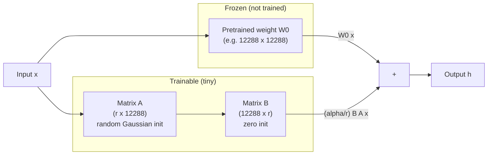
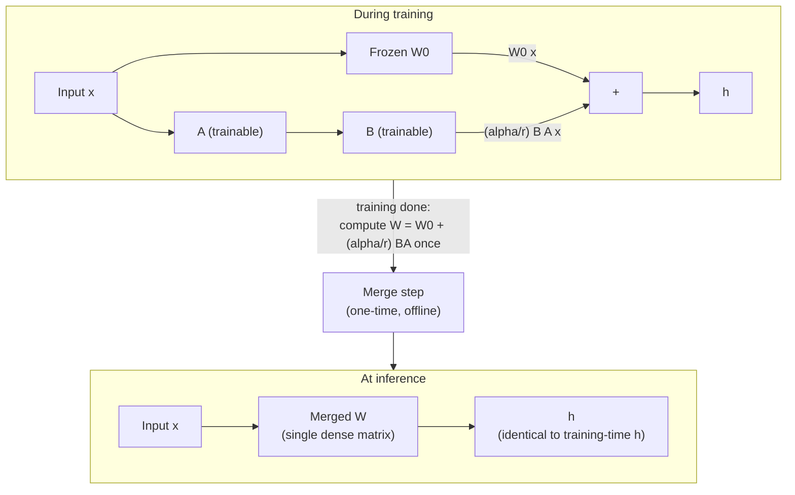
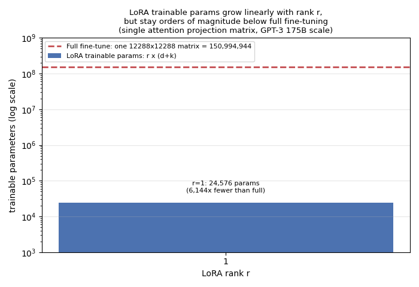

# LoRA: Low-Rank Adaptation of Large Language Models

## TL;DR

In 2021, researchers at Microsoft proposed LoRA: instead of updating every
weight of a large pretrained model during fine-tuning, freeze the entire
pretrained model and train only a tiny pair of low-rank matrices injected
alongside each weight matrix you want to adapt. The paper reports that on
GPT-3 175B, this cuts the number of trainable parameters by roughly
10,000x and the GPU memory needed for training by about 3x, while
matching or slightly exceeding full fine-tuning quality on the benchmarks
it tests. Because the low-rank update can be mathematically merged back
into the original weight matrix before deployment, LoRA also adds zero
extra inference latency compared to a normally fine-tuned model — a
property adapter-based methods do not share. This combination (huge
training-cost reduction, no runtime cost) is why LoRA became the default
way the industry fine-tunes large models, and the direct ancestor of the
whole "parameter-efficient fine-tuning" (PEFT) ecosystem, including
QLoRA and countless production fine-tuning pipelines.

## Fun Map for First Years 🧭

LoRA teaches a huge model a small new habit without repainting its entire brain. It adds tiny “correction notes” instead of replacing the original textbook.

`🧠 frozen big model + 📝 tiny correction → 🎯 new task behavior → 💾 small saved update`

💻 **CS analogy:** LoRA is a small patch file applied at runtime instead of copying and editing an entire large binary.

## Math Playground 🧮

LoRA replaces a weight matrix with `W' = W + BA`, where `B` and `A` are thin matrices. Their product is a low-rank update: it can express a focused set of directions while storing far fewer numbers than a full replacement for `W`.

## Background: What Came Before 🕰️

Full fine-tuning copies and changes every weight for every task, which is expensive to store, train, and deploy as base models grow. Earlier adapter methods added task modules but could introduce inference overhead. LoRA was needed to express a useful weight update as a small, mergeable low-rank patch.

## Why It Matters

Before LoRA, if you wanted to adapt a large pretrained model — say GPT-3
175B — to a new task, your two realistic options were both expensive in
different ways. **Full fine-tuning** updates every parameter in the
model, which means for GPT-3 175B you need enough GPU memory to hold the
weights, the gradients, and the Adam optimizer's two moment estimates for
all 175 billion parameters simultaneously — the paper reports this
required roughly 1.2TB of VRAM in their training setup, far beyond what
any single accelerator (or often even a single node) provides, and every
fine-tuned copy of the model is a full 175-billion-parameter checkpoint
you have to store and manage separately. If you're serving ten different
fine-tuned variants of the same base model for ten different customers or
tasks, you're storing (and potentially loading) ten full copies of a
model that differs from its neighbors in only a small, task-specific way.

The alternative that existed before LoRA was **parameter-efficient
fine-tuning via adapters or prompt/prefix tuning** — freeze the base
model and insert small trainable modules (adapter layers between
Transformer sublayers, or trainable "virtual tokens" prepended to the
input). These approaches do cut the number of trainable parameters
dramatically, but each comes with its own structural cost. Adapter
layers are inserted directly into the model's forward path, so every
inference call has to run through them sequentially — the paper cites
prior work showing this adds measurable inference latency, especially
in the low-batch-size, short-sequence online-serving setting that
production systems actually run in (it doesn't parallelize away, because
the extra depth is on the model's critical path). Prefix/prompt tuning,
meanwhile, eats into the model's usable input sequence length (every
token spent on a trainable prefix is a token not available for the
user's actual input) and the paper reports that in their experiments its
performance was non-monotonic and sometimes unstable as the number of
trainable prefix parameters increased, making it harder to tune reliably
than the alternatives.

LoRA's contribution was showing you could get parameter-efficiency
without either of those costs. It doesn't touch the model's forward-path
depth (no new sequential layers to run through) and it doesn't consume
any of the input sequence (no prefix tokens). Instead, it exploits an
empirical observation the paper makes explicit: the *change* a
pretrained model's weights need to undergo to specialize to a new task
appears to have a very low "intrinsic rank" — you don't need a full-rank
update to capture most of the useful adaptation, a much lower-rank
approximation of that update captures most of what matters. That's a
claim about the *task-specific update*, not about the pretrained weights
themselves, and it's the load-bearing empirical finding the whole method
rests on.

What changed after: LoRA rapidly became the default fine-tuning
technique across the open-source LLM ecosystem. It's the mechanism
behind QLoRA (which combines LoRA with 4-bit quantization of the frozen
base model to fine-tune large models on a single consumer GPU), it's
built into Hugging Face's `peft` library as arguably its flagship method,
and most "fine-tune your own copy of this open model" tutorials you'll
find today are, under the hood, LoRA fine-tuning. The pattern of
"freeze almost everything, train a small low-rank side-path" also
generalized well beyond text — you'll see the same idea applied to
diffusion image models, vision transformers, and multimodal models,
usually still called LoRA even outside the original NLP setting.

## Core Intuition

Think of a pretrained model's weight matrix as a giant, already-very-good
map of relationships the model learned during pretraining. Full
fine-tuning says: "redraw the entire map from scratch, adjusting every
single line, to fit this new task." LoRA says something much more
modest: **"keep the whole map exactly as it is, and hand me a
transparent overlay sheet I can draw a few new, simple lines on, so that
map-plus-overlay does what I need for this task."**

The overlay sheet is deliberately *low-rank* — it can't express an
arbitrary, fully independent correction to every entry of the original
map; it can only express corrections that are themselves built from a
much smaller number of "directions." That sounds like it should be a
serious limitation, but the paper's central empirical bet — later
confirmed by their rank analysis — is that the corrections a pretrained
model actually needs for a new downstream task live mostly in a
small number of directions anyway. Most of the "capacity" a full,
full-rank weight update would offer turns out to be capacity the task
doesn't need.

A second piece of intuition: because the overlay starts as a *blank*
transparent sheet (mathematically, the update is initialized to exactly
zero), training doesn't start by perturbing the model's behavior at
all — it starts from the frozen pretrained model's exact original
behavior and gradually learns which small set of adjustments help. This
is different from full fine-tuning, where every weight starts moving
away from its pretrained value from step one.

A third piece, and the one that makes this practical rather than just
elegant: once training finishes, the overlay sheet and the original map
can be **physically merged into a single new map** — you don't need to
carry the overlay around separately at inference time, paying an
extra lookup cost on every request. This is the property that
distinguishes LoRA from adapter layers, which stay as separate modules
the forward pass must run through even after training ends.



## The Mechanism

### The core equation

For any pretrained weight matrix `W0` of shape `(d, k)` that you want to
adapt, LoRA does not update `W0` directly. Instead it represents the
update as the product of two much smaller matrices, and adds that
product's (scaled) output to the frozen layer's output:

```
h = W0 x + (alpha / r) * B A x
```

Where, matching the paper's own notation (section 4.1):
- `W0` is the frozen pretrained weight, shape `(d, k)`, `requires_grad =
  False` for the entire duration of fine-tuning.
- `A` has shape `(r, k)` and `B` has shape `(d, r)`, so the product `BA`
  has the same shape `(d, k)` as `W0` — it's a full-size update matrix,
  just one that's *constrained* to be expressible as a product of two
  skinny matrices, i.e. constrained to have rank at most `r`.
- `r` is the rank — a small integer, typically single digits to a few
  dozen, chosen by the practitioner. It's the one knob controlling the
  tradeoff between "how much correction capacity does the overlay have"
  and "how many trainable parameters does this cost."
- `alpha` is a fixed scaling hyperparameter. The paper describes tuning
  `alpha` as playing a role "roughly the same as tuning the learning
  rate," and reports that in their own experiments they simply set
  `alpha` to the value of the first `r` they tried and did not
  extensively re-tune it afterward — worth knowing so you don't treat
  `alpha` as a heavily-searched hyperparameter in the original work.

### Initialization: why one matrix is zero and the other isn't

The paper specifies an asymmetric initialization that is doing real
work, not an arbitrary choice: `A` gets a random Gaussian initialization
(the source of the *only* randomness in the initial update), while `B`
is initialized to all zeros. Since the update is the product `BA`, and
`B` is entirely zero, `BA` is exactly the zero matrix at the start of
training — my interpretation of why this direction and not the reverse:
zero-initializing `B` (rather than `A`) still leaves `A` free to have a
well-scaled, non-degenerate random initialization ready to receive
gradient signal from the very first backward pass, while the *product*
stays exactly zero until `B` starts moving away from zero. Practically,
this means training begins from the pretrained model's exact, unmodified
behavior — `h = W0 x` exactly, for every input — and the model gradually
"discovers" a small correction rather than being perturbed away from its
pretrained behavior on step one the way full fine-tuning is.

### Which weight matrices get this treatment

A Transformer has several distinct weight matrices per layer: the
self-attention query/key/value/output projections (`Wq`, `Wk`, `Wv`,
`Wo`) and the feed-forward (MLP) matrices. The paper states it limits
its own study to adapting only the attention projection matrices,
leaving the MLP modules frozen — the paper's own stated reasons are
simplicity and parameter-efficiency, not a claim that MLP adaptation
would necessarily hurt. Within that restricted scope, the paper reports
an ablation (its Table 5) comparing which subset of `{Wq, Wk, Wv, Wo}`
to adapt under a fixed total parameter budget, and finds that adapting
**both `Wq` and `Wv` together** gives the best overall downstream
performance — better than putting the entire parameter budget into a
higher rank on just one matrix. The practical takeaway the paper draws:
spreading a fixed low-rank budget across more matrices tends to beat
concentrating it in fewer matrices at higher rank each.

### How small can the rank actually be?

The paper's experiments sweep `r` across values including 1, 2, 4, 8,
and 64. The finding it highlights as surprising: for adapting `Wq` and
`Wv` on GPT-3, **a rank as small as `r=1` already performs quite well**
on the tasks tested (paper Table 6) — going to much higher rank does not
buy much additional quality. The paper follows this up with a direct
analysis of the learned update matrices at different ranks (its section
7.2): it finds that the subspace spanned by the top singular
vectors of the rank-8 and rank-64 learned updates overlaps substantially,
which is the paper's own proposed explanation for why increasing `r`
much past a small value yields diminishing returns — most of what a
higher rank *could* express, the model apparently doesn't need to use.
The paper is explicit that this is evidence the task-specific update
`ΔW` has a low **intrinsic rank**, not evidence that the pretrained
model `W0` itself is low-rank — those are different claims, and the
paper is careful to only claim the former.

### Scale: what this looks like on GPT-3 175B

Putting numbers on the abstract claim: the paper reports that on GPT-3
175B, full fine-tuning with Adam requires holding the model weights,
gradients, and the two Adam moment estimates all in accelerator memory,
which the paper states came to roughly **1.2TB of VRAM** in their
training setup. With LoRA — because the vast majority of parameters are
frozen and Adam only needs to track moments for the (far smaller) `A`
and `B` matrices — the paper reports this drops to roughly **350GB**,
about a 3x reduction, matching the abstract's headline "3 times" GPU
memory claim. The paper also reports a checkpoint-size figure for one
specific configuration: with `r=4` and only `Wq`/`Wv` adapted, the
saved LoRA weights shrink the *per-task* checkpoint from 350GB (the size
of a full fine-tuned copy) down to roughly **35MB** — about a 10,000x
reduction, matching the abstract's "10,000 times" fewer trainable
parameters claim (the checkpoint-size number and the trainable-parameter
number are two views of the same underlying fact: you only need to save
the tiny `A`/`B` matrices per task, not a full copy of the model).

### Does the quality actually hold up?

Cost reduction alone would be a poor tradeoff if it came with a real
quality hit, so it's worth grounding the paper's own reported numbers
rather than just its headline "on-par or better" framing. On the GLUE
benchmark average (its Table 2), the paper reports RoBERTa-large full
fine-tuning (355.0M trainable parameters) scoring 88.9 versus LoRA
(0.8M trainable parameters) scoring 88.6 — a small drop, not a gain, on
that particular model. The paper also reports DeBERTa-XXL full
fine-tuning at 91.1 versus LoRA at 91.3 on the same GLUE average — a
small LoRA *edge* on that larger model, though I have lower confidence in
this specific pair of numbers than the RoBERTa-large ones above (fetched
and cross-checked only once, versus three independent checks for
RoBERTa-large), so treat the DeBERTa-XXL figures as reported-but-less-
rigorously-verified rather than as solid as the RoBERTa-large comparison.
On
GPT-2 large's E2E NLG Challenge results (its Table 3), the paper reports
full fine-tuning (774.03M trainable parameters) at 68.5 BLEU versus LoRA
(0.77M trainable parameters) at 70.4 BLEU — LoRA ahead there. On GPT-3
175B's WikiSQL results (its Table 4), full fine-tuning scores 73.8%
accuracy versus a higher-rank LoRA configuration (37.7M trainable
parameters) at 74.0%. Read across these four data points, the honest
summary is: LoRA lands within roughly a point of full fine-tuning in
every case listed above, sometimes slightly below and sometimes
slightly above, while training far fewer parameters throughout — about
444x fewer on RoBERTa-large (355.0M / 0.8M), roughly 1,005x fewer on
GPT-2 large (774.03M / 0.77M), and roughly 4,648x fewer on the
higher-rank GPT-3 175B WikiSQL configuration (175,255.8M / 37.7M) —
with the reduction ratio depending heavily on how large the full base
model is relative to the fixed-size low-rank update. "On par," not
"strictly better," is the more precise characterization of what the
paper's own numbers show, even though the abstract's framing ("on-par
or better") is technically consistent with that spread.

### Inference: no separate module to run through

Because `h = W0 x + (alpha/r) B A x = (W0 + (alpha/r) BA) x`, after
training you can compute the merged matrix `W = W0 + (alpha/r) BA`
exactly once and simply replace `W0` with it — the paper states this
"guarantee[s] that we do not introduce any additional inference latency
compared to a fine-tuned model, by construction." This is the concrete
mechanical reason LoRA avoids the inference-latency cost the paper
attributes to adapter layers: an adapter layer is a separate module that
has to be executed on every forward pass, in sequence, no matter what;
a merged LoRA update is indistinguishable at inference time from a
normally fine-tuned weight matrix, because after merging, it *is* one.



The animation below shows the practical consequence of the rank-only
scaling: for one attention projection matrix at GPT-3 175B's scale
(`d_model = 12288`, a fact from the GPT-3 paper, Brown et al. 2020, not
this one), trainable parameters grow only linearly with `r` — `r *
(d_model + d_model)` — while the reference full fine-tuning parameter
count for that one matrix stays fixed at `d_model^2` (about 151 million).
Even at `r=64`, the LoRA side is still roughly 96x smaller — nearly two
orders of magnitude — than the single full matrix it's adapting
(1,572,864 LoRA parameters vs. 150,994,944 full parameters):



## Practical Engineering Notes

**Where this lives in real code.** Hugging Face's `peft` library is the
most widely used implementation, exposing a `LoraConfig` object where you
set `r`, `target_modules` (which named modules to wrap — commonly the
query/value projections, matching the paper's own Table 5 finding, though
practitioners today often also target key/output/MLP projections since
compute is usually cheaper now than in 2021), and `lora_alpha`. Exact
class names and internal module paths shift release to release as the
library evolves — the durable pattern to look for in any framework's
docs is "wrap a `Linear` layer with a frozen weight plus a trainable
low-rank pair," which is what every LoRA implementation is doing
underneath its particular API.

**Merging isn't free of tradeoffs, just free of the adapter-style
tradeoff.** Merging `W0 + (alpha/r) BA` into a single matrix before
deployment gives you zero inference latency versus a fully fine-tuned
model, exactly as the paper states — but it also means you've committed
to one task's adaptation baked into the weights. Production LoRA serving
systems that need to serve *many* different task-specific adapters
against the same base model (a common real deployment pattern — one
frozen base model, dozens of customer- or task-specific LoRA adapters)
typically keep the adapters unmerged and swap `A`/`B` pairs per request,
trading a small amount of extra compute at inference for not needing a
separate merged full-size checkpoint per adapter.

**Rank is a real, tunable hyperparameter, not just a knob toward
"smaller is better."** The paper's own finding that `r=1` performs well
for `Wq`+`Wv` on the tasks it tested is a result on those specific
tasks and matrix choices — my interpretation, extending the paper's own
low-intrinsic-rank framing: harder tasks, larger domain shifts from the
pretraining distribution, or adapting different matrices may need a
larger `r` to capture a genuinely higher-rank task-specific update.
Treat `r` as something to sweep on your own task rather than assuming
the paper's smallest reported values transfer unchanged.

**Numerical stability of the scaling factor.** The `alpha/r` scaling
term means that if you change `r` without also reconsidering `alpha`,
you change the effective magnitude of every update, which behaves
similarly to changing a learning rate — a change the paper itself
draws an explicit analogy to. A common practical convention (not
specified by the paper as a fixed rule, but widely used downstream) is
to set `alpha` to roughly `2x` the chosen `r` and only then treat further
tuning as a genuine hyperparameter search, rather than leaving `alpha`
fixed while sweeping `r` and inadvertently sweeping the effective
learning rate at the same time.

**Where this connects to quantization.** A widely used follow-up
technique, QLoRA (Dettmers et al., 2023, not this paper), combines LoRA
with 4-bit quantization of the frozen base weights `W0` — since `W0`
never receives gradients under LoRA, it can be stored in a much lower
precision than the `A`/`B` matrices (which do need gradients and
therefore stay in higher precision), letting you fine-tune much larger
models on much smaller GPUs than either full fine-tuning or full-precision
LoRA would allow. This is a real, widely-adopted extension of the ideas
here, but it's later work's contribution, not something this paper
describes.

## Runnable Code Example

See `code/lora_from_scratch.py` for a minimal, runnable PyTorch
implementation of a `LoRALinear` module — a frozen base `nn.Linear`
plus trainable low-rank `A`/`B` matrices, about 60 lines, no external
dependencies beyond `torch`.

Running it (`python code/lora_from_scratch.py`) does four things:

1. Builds a `LoRALinear(in_features=64, out_features=32, r=4, alpha=8)`
   layer and checks that, at initialization (`B` all zeros), its output
   on a random input exactly matches the frozen base layer's output
   alone — confirming the update `BA` really is zero at the start of
   training, as the paper's initialization scheme requires.
2. Checks that only the parameters named `A` and `B` have
   `requires_grad=True`, and that the base layer's weight is frozen —
   the mechanical core of "freeze the pretrained model, train a small
   side path."
3. Compares parameter counts: the base weight has `64 x 32 = 2048`
   parameters, while `A` (`4 x 64`) and `B` (`32 x 4`) together have
   only `256 + 128 = 384` — asserting the LoRA side is meaningfully
   smaller, the small-scale analogue of the paper's 10,000x reduction
   claim on GPT-3 175B.
4. Perturbs `B` to simulate a few steps of training (so the update is no
   longer zero), then computes the merged weight `W0 + (alpha/r) BA` and
   checks its output matches the unmerged two-path forward pass exactly —
   demonstrating the zero-extra-inference-latency merge described above.

Expected output:
```
ok: forward pass matches frozen base exactly at init (B zero-initialized)
ok: only ['A', 'B'] are trainable; base W0 is frozen
ok: W0 has 2048 params, A+B have 384 (5.3x fewer trainable params)
ok: merged weight W0 + (alpha/r)*BA reproduces the unmerged forward pass exactly
```

If you want to extend it: try wrapping two `LoRALinear` layers to stand
in for `Wq` and `Wv` on a toy multi-head attention block (see paper
01's `attention_from_scratch.py` in this repo for a base
`MultiHeadAttention` implementation you could adapt), freeze its
existing `q_proj`/`v_proj` weights, and add LoRA layers alongside them —
this is a small-scale version of exactly what the paper's Table 5
ablation is comparing.

## Common Misconceptions & Pitfalls

- **"LoRA fine-tunes a low-rank *approximation of the model*."** It
  doesn't approximate the pretrained weights `W0` at all — `W0` stays
  exactly as it was pretrained, untouched, for the entire process. What's
  low-rank is the *update* `ΔW = BA` applied on top of it. The paper is
  explicit that its evidence points to the task-specific change needed
  having low intrinsic rank, not that the pretrained model itself is
  low-rank or that any information is being discarded from `W0`.
- **"Adapters and LoRA are basically the same idea."** Both freeze the
  base model and train a small number of new parameters, but
  structurally they differ in an important way: adapter layers are new
  modules inserted into the model's sequential forward path (so every
  inference call executes them, adding latency the paper attributes to
  adapters), while LoRA's update runs in parallel to an existing weight
  matrix and can be algebraically merged into that matrix after
  training, leaving nothing extra to execute at inference time. Treating
  them as interchangeable "PEFT methods" glosses over exactly the
  property (zero inference-latency overhead) the paper spends real
  space distinguishing.
- **"A smaller rank `r` is always strictly better because it's more
  efficient."** The paper's `r=1` result is a specific finding for
  specific matrices (`Wq`, `Wv`) on specific tasks, not a universal
  claim that rank barely matters anywhere. Treating it as "rank doesn't
  matter, just use r=1 everywhere" both overclaims the paper's result
  and risks underfitting a task whose necessary update genuinely needs
  more directions than a rank-1 update can express — this is a case
  where "the paper reports X for its tested setting" needs to be kept
  separate from "X generalizes to every setting."
- **"LoRA reduces the compute cost of the forward/backward pass in the
  same proportion as it reduces trainable parameters."** It doesn't:
  every forward pass still runs the full computation through the frozen
  `W0` (the paper doesn't shrink the model's activations or its
  matrix-multiply FLOPs for the frozen path), plus a small extra
  computation through `A` and `B`. What shrinks is the number of
  parameters the optimizer has to track gradients and Adam moments for
  — which is exactly why the memory savings the paper reports (1.2TB to
  350GB) are large, but the forward-pass compute savings are much more
  modest than the 10,000x parameter-count number might suggest at a
  glance.

## Interview Q&A

**Q:** Walk through the LoRA forward-pass equation and explain what each
term does.
**A:** `h = W0 x + (alpha/r) * B A x`. `W0` is the frozen pretrained
weight — it never receives a gradient during LoRA fine-tuning. `A`
(shape `r x k`) and `B` (shape `d x r`) are the trainable low-rank
factors whose product `BA` (shape `d x k`, same as `W0`) forms the
task-specific update, constrained to rank at most `r`. The `alpha/r`
term is a fixed scaling factor that controls the update's effective
magnitude, similar in effect to a learning rate — the paper reports
tuning it plays roughly that role and that they typically didn't
re-tune it extensively beyond setting it to their first tried `r`.

**Q:** Why is `B` initialized to zero and `A` to a random Gaussian,
rather than the other way around, or both being zero?
**A:** The product `BA` needs to be exactly zero at the start of
training so fine-tuning begins from the pretrained model's exact,
unmodified behavior. Zero-initializing `B` alone (with `A` random)
achieves that: the product is zero regardless of what's in `A`, because
anything times a zero matrix is zero. If both were zero, `BA` would
still be zero, but the gradient with respect to `A` would also be zero
at initialization (since it's being multiplied by `B=0` in the forward
path in a way that keeps the very first gradient degenerate) — so at
least one factor needs a nondegenerate, non-zero initialization to give
the model somewhere to move on the first backward pass. The paper's
choice is to make that factor `A`.

**Q:** LoRA and adapter layers are both "freeze the base model, add a
few trainable parameters" methods — what's the concrete difference in
where those parameters live, and why does it matter for latency?
**A:** Adapter layers are inserted as new modules directly in the
model's sequential forward path — a token's activations flow through
the frozen sublayer, then through the small trainable adapter, in
series. That extra module has to execute on every request, adding
measurable latency, which the paper cites as a real cost of adapter
methods, especially at the low batch sizes and short sequence lengths
typical of online serving where there's little parallel work to hide
that extra computation behind. LoRA's update instead runs in parallel to
an existing weight matrix (`W0 x` and `B A x` are computed independently
and summed), and because both paths are linear, the paper shows you can
algebraically fold the update into `W0` after training — `W =
W0 + (alpha/r) BA` — producing one merged matrix with no separate module
left to execute. That's the structural reason LoRA can guarantee zero
added inference latency while adapters cannot, by construction.

**Q:** The paper reports a rank as low as `r=1` performs well for
adapting `Wq` and `Wv` on GPT-3. Does that mean the pretrained weight
matrices themselves are low-rank?
**A:** No — and this distinction matters. The paper's rank-1 finding
and its follow-up singular-value analysis are about the *task-specific
update* `ΔW = BA` needed to adapt the model to a new task, not about the
pretrained weight `W0` itself, which is never modified in any way LoRA
would reveal as low-rank or otherwise. The paper's own framing is that
whatever correction the model needs to specialize to a given downstream
task appears to be expressible with very few effective directions, and
its singular-vector overlap analysis between rank-8 and rank-64 learned
updates is offered as supporting evidence for exactly that — a claim
about how much the model needs to change, not about the model's existing
structure.

**Q:** How does LoRA's approach to GPU memory savings differ from its
approach to trainable-parameter-count savings — are they the same
number for a different reason, or genuinely different mechanisms?
**A:** They're related but not identical. The parameter-count reduction
(the paper's reported ~10,000x figure) comes directly from training
`A`/`B` (a tiny fraction of the full weight count) instead of the full
weight matrices. The memory reduction (~3x, from a reported 1.2TB to
350GB on GPT-3 175B) comes specifically from the optimizer state: Adam
tracks two moment estimates per trainable parameter, so freezing the
overwhelming majority of parameters means Adam only needs to allocate
those moment buffers for the small `A`/`B` matrices, not the full model.
The two numbers differ by orders of magnitude (10,000x vs 3x) because
the frozen model's *weights themselves* still have to be held in memory
during training even though they receive no gradient or optimizer
state — the model's static footprint doesn't shrink, only its trainable
and optimizer-tracked footprint does.

**Q:** If you needed to serve many different LoRA-adapted versions of
the same base model simultaneously (e.g. one adapter per customer), what
production tradeoff would you face that a single merged deployment
doesn't have?
**A:** Merging `W0 + (alpha/r) BA` into one matrix is ideal when you're
deploying a single fine-tuned variant, since it reproduces normal
fine-tuned-model inference latency exactly, per the paper. But merging
commits the weights to one specific adapter — you'd need a separate
full-size merged checkpoint per customer, losing the storage advantage
that made LoRA attractive in the first place (this is my interpretation,
extending beyond what the paper itself addresses, since it doesn't
discuss multi-tenant serving). The alternative real-world pattern is to
keep adapters unmerged and swap in the relevant small `A`/`B` pair per
request against one shared frozen base model, trading a small amount of
extra per-request compute (running two matrix multiplies instead of
one merged one) for the ability to serve arbitrarily many task-specific
adapters off a single copy of the base model's weights in memory.

## Further Reading

- [LoRA: Low-Rank Adaptation of Large Language Models (arXiv:2106.09685)](https://arxiv.org/abs/2106.09685) — the original paper
- [QLoRA: Efficient Finetuning of Quantized LLMs (Dettmers et al., 2023)](https://arxiv.org/abs/2305.14314) — combines LoRA with 4-bit quantization of the frozen base weights, the most widely used follow-up
- [Hugging Face PEFT documentation](https://huggingface.co/docs/peft/index) — the most widely used open-source implementation of LoRA and related parameter-efficient fine-tuning methods
- [Attention Is All You Need (arXiv:1706.03762)](https://arxiv.org/abs/1706.03762) — the Transformer architecture whose attention projection matrices (Wq/Wk/Wv/Wo) are what LoRA's own experiments target
- [Language Models are Few-Shot Learners (arXiv:2005.14165)](https://arxiv.org/abs/2005.14165) — the GPT-3 175B paper this repository's LoRA experiments adapt, and the source of the `d_model=12288` figure used in this explainer's scaling figure
