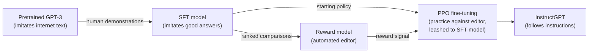
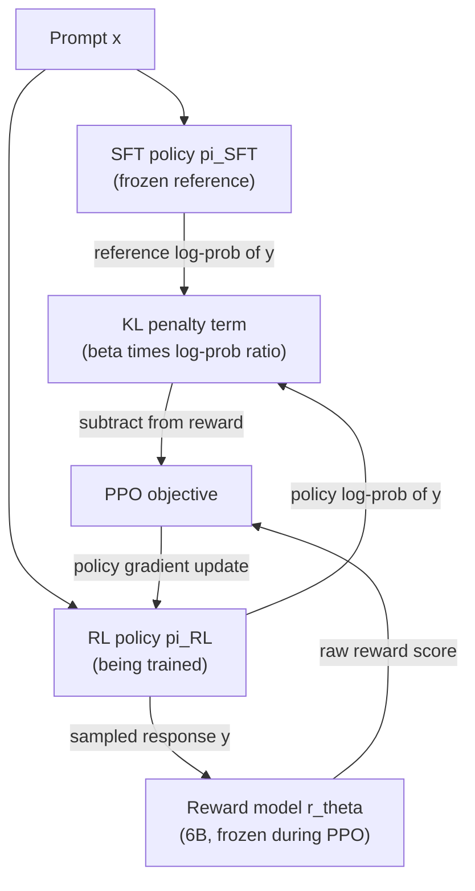
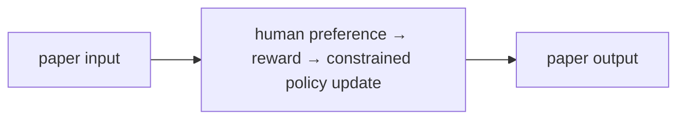

# Training Language Models to Follow Instructions with Human Feedback (InstructGPT)

## 1. TL;DR
In March 2022, OpenAI published InstructGPT: a version of GPT-3 fine-tuned
with human feedback to actually follow instructions rather than just
continue text in whatever way is statistically likely given internet
training data. The recipe is a three-step pipeline — supervised
fine-tuning on human demonstrations, training a reward model on human
preference comparisons, and then using that reward model to fine-tune the
language model with reinforcement learning (PPO) — now generally known as
Reinforcement Learning from Human Feedback (RLHF). The headline result:
human labelers preferred outputs from a 1.3-billion-parameter InstructGPT
model to outputs from the 175-billion-parameter base GPT-3, despite the
InstructGPT model having over 100x fewer parameters. This paper is the
direct methodological ancestor of essentially every "helpful assistant"
LLM product that followed it, including ChatGPT.

## 2. Fun Map for First Years
RLHF teaches a model from human preferences: people compare answers, a reward model learns their taste, and the assistant practices earning better scores.

`🤖 draft answers → 🧑‍⚖️ humans compare → 🏆 reward signal → 📈 improved assistant`

People do not need to write a perfect numerical score for every answer. Choosing “A is better than B” is often enough to teach a model what people prefer.

If two replies are factually similar but one is concise and polite, an annotator can choose it without explaining a numeric scoring formula. Many such choices teach the reward model a pattern.

💻 **CS analogy:** RLHF resembles training a ranking service from A/B preference logs, then optimizing a policy against that learned scorer.

### Beginner walkthrough

Read the arrows as a sequence of responsibilities. First identify what enters
the system, then ask what the paper changes, what information is preserved or
discarded, and what leaves the operation. For **reward-model-guided policy optimization**, the key question
is not “does the model sound clever?” but “which intermediate value carries the
new information, and what would go wrong if it were missing?”

### CS student checkpoint

The map corresponds to a small program: input data enters a function, the
paper-specific state or transformation runs, and an assertion checks **the KL penalty is measured against the frozen reference policy and reward inputs use the same prompt contract**.
The equation `E[reward]−βKL(π||πref)` is the compact specification for that function. Trace
one concrete item through each arrow before thinking about larger batches,
parallel hardware, or production optimizations.

## 3. Math Playground
The essential equation or rule is:

```text
−log σ(r(chosen) − r(rejected))
```

**Essential equation:** −log σ(r(chosen) − r(rejected)). Humans pick the better of two answers. The reward model gives each answer a score; subtracting scores asks whether the chosen answer is ahead. The sigmoid σ converts that difference into a number from 0 to 1, like a predicted chance of winning. Training penalizes it when the preferred answer is not predicted to win.

If the chosen answer scores much higher, the sigmoid is near 1 and the penalty is low. If the rejected answer wins, the model gets a large penalty.

The score difference is all that matters: adding 10 to both answer scores changes nothing. The sigmoid only asks whether the chosen answer is ahead, and by how confidently.

## 4. Background: What Came Before
Next-token pretraining teaches a model to imitate internet text, not necessarily to follow a helpful, safe instruction. Supervised prompts helped, but they could not capture every quality judgment with one target answer. InstructGPT was needed to turn human preference comparisons into an optimization signal that steers a pretrained model’s behavior.

The new idea connected subjective human judgments to a training signal, so usefulness could be optimized rather than assumed from internet text.

This made product-quality preferences—helpfulness, tone, and harmlessness—part of the training loop, while also creating the need to guard against reward hacking.

## 5. Why It Matters
Before this paper, the standard way to make a large language model useful
was pretraining at scale (GPT-3, Brown et al. 2020) followed, at most, by
few-shot prompting or light supervised fine-tuning on a task-specific
dataset. But the pretraining objective — predict the next token on a huge
scrape of internet text — is not the same thing as "be a helpful,
truthful, non-harmful assistant that follows what the user actually
asked." A model trained purely to imitate internet text will happily
imitate misinformation, imitate texts that ignore the literal instruction
in favor of some more statistically common continuation, and imitate
toxic or evasive content whenever that pattern was common in its training
distribution. The paper's own framing of this: "language models trained
to predict the next word on a webpage, for example, are not necessarily
aligned with these objectives" (helpful, honest, harmless) — the
pretraining objective is a proxy for what we actually want, and it's a
leaky one.

The prevailing intuition going into this paper — and still a common one —
was that scale mostly fixes this: a bigger, better-pretrained model
would naturally get better at following instructions along with
everything else. InstructGPT's headline result is direct evidence
against that intuition in isolation: their 1.3B-parameter model, fine-tuned
with human feedback, produced outputs human labelers preferred over the
175B-parameter GPT-3's outputs, despite being over 100x smaller. Model
scale and alignment turned out to be separable axes — you can make a
much smaller model behave better on the dimension people actually care
about (following instructions, not misinformation-laundering, not being
toxic) without touching parameter count at all, by changing what you
optimize the model against during a later training stage.

What changed after: RLHF (or its later reformulations, like Direct
Preference Optimization) became the standard second stage of training for
essentially every deployed conversational LLM — ChatGPT, Claude, Gemini,
and open-weight instruction-tuned models all use some variant of this
"pretrain, then fine-tune on demonstrations, then optimize against a
learned preference model" recipe. It's worth being precise about
attribution here: InstructGPT was published in March 2022, before
ChatGPT's November 2022 release; the paper itself does not describe or
name ChatGPT (it hadn't been announced yet). That ChatGPT descends
methodologically from this line of work is well documented in OpenAI's
own subsequent public communications and industry reporting, not a claim
made inside this specific paper — worth keeping the paper's own claims and
later industry history distinct.

## 6. Core Intuition
Think of pretraining a large language model as raising a very
well-read but never-supervised writer: it has absorbed an enormous amount
of text and can continue almost any prompt fluently, but nobody ever told
it what a *good* response actually looks like versus merely a *plausible*
one. Ask it a direct question and it might answer helpfully, might
answer evasively, might change the subject, or might continue as if it
were an essay question on a forum — all of these are "plausible
continuations" in the training distribution, and the model has no signal
telling it which one you actually wanted.

RLHF is the process of hiring editors. First, you show the writer worked
examples of the response you actually want (the **supervised
fine-tuning** step: human labelers write out ideal answers to sample
prompts, and the model imitates them directly). Then, instead of writing
out ideal answers for every possible prompt forever — expensive and
doesn't scale — you switch to something cheaper: for a new prompt, have
the model produce several candidate answers, and have a human editor just
*rank* them from best to worst (much easier and faster than writing an
ideal answer from scratch). Train a second model — the **reward model** —
to predict those rankings, so it becomes an automated stand-in editor
that can score any candidate answer without a human in the loop. Finally,
turn the original writer loose to practice against this automated editor
at scale, using reinforcement learning: generate an answer, get scored by
the reward model, adjust to produce higher-scoring answers next time
(the **PPO** step).

The one subtlety that separates this from naive "just maximize the
editor's score": an automated editor can be gamed. If you let the writer
optimize purely against the reward model's score with no other
constraint, it will eventually find degenerate outputs the reward model
happens to score highly but that a real human would consider useless or
bizarre — the classic "reward hacking" failure of any learned proxy
objective. The paper's fix is a leash: a penalty term that keeps the
writer's behavior close to how it behaved right after the demonstration
stage (the supervised fine-tuned model), growing as the two diverge. The
writer can improve within that leash's radius, but can't wander
arbitrarily far from human-demonstrated behavior chasing reward-model
score alone.



## 7. The Mechanism
The three stages below, and exactly what data and reward signal flows
between them for a single training example:



### Step 1: Supervised fine-tuning (SFT)

Starting from pretrained GPT-3 checkpoints, OpenAI collected demonstration
data: human labelers wrote out ideal responses to prompts (both
labeler-written prompts and prompts submitted by users through the OpenAI
API's Playground, filtered for personally identifiable information). The
paper reports roughly 13,000 training prompts for this step. The model is
then fine-tuned with ordinary supervised learning — standard
cross-entropy next-token loss — but only on these curated
prompt/response pairs, for 16 epochs with cosine learning-rate decay and
a residual dropout of 0.2 (a much higher dropout than pretraining, needed
because 16 epochs on only ~13,000 examples overfits quickly otherwise).
This SFT model is the paper's baseline "already follows instructions
somewhat" model, and — critically — it's also the **frozen reference
policy** used in step 3's KL penalty below.

### Step 2: Reward model (RM) training

For a given prompt, the SFT model generates multiple candidate
responses (the paper uses between 4 and 9 responses per prompt), and a
labeler ranks all of them from best to worst. Ranking K responses
produces `C(K, 2)` pairwise comparisons, and the paper reports roughly
33,000 training prompts went into this comparison dataset. All
comparisons from the same prompt are trained on together as a single
batch element, which the paper found reduced overfitting relative to
shuffling individual pairs across batches (highly correlated comparisons
sharing a prompt would otherwise repeatedly reinforce the same signal).

The reward model itself is a GPT-3 model with its final unembedding
layer replaced by a linear layer projecting to a single scalar — so
instead of predicting the next token, it predicts one number: "how good
is this (prompt, response) pair." Given a preferred response `y_w`
("winner") and a dispreferred response `y_l` ("loser") for the same
prompt `x`, the training loss is:

```
loss(theta) = -E[(x, y_w, y_l)~D] [ log( sigmoid( r_theta(x, y_w) - r_theta(x, y_l) ) ) ]
```

This is a pairwise ranking loss: it only ever pushes the *difference*
between the two scores in the right direction (`r_theta(x, y_w)` should
exceed `r_theta(x, y_l)`), never trains toward any particular absolute
value. That has a concrete consequence the paper calls out explicitly:
because this loss is invariant to shifts (adding the same constant to
every score changes nothing), the reward model's raw output has no
inherent zero point. Before using it for RL, the paper normalizes the
reward model with a bias term so that the labeler demonstrations from
step 1 score a mean of 0 — a calibration step, not a modeling choice
that affects what the RM has learned to rank.

One deliberate scale choice: the paper only trains a 6B-parameter reward
model, even for their 175B-parameter InstructGPT variant, for two
reasons it states together: "we only use 6B RMs, as this saves a lot of
compute, and we found that 175B RM training could be unstable and thus
was less suitable to be used as the value function during RL." Compute
savings and training stability are both the paper's own stated
justification for the 6B choice — not competing explanations — and the
6B RM is used across all runs, including as the reward signal for PPO
fine-tuning the 175B policy. The reward model doesn't need to match the
policy's scale to supervise it effectively.

### Step 3: Reinforcement learning with PPO

The SFT model is now treated as an RL policy `pi_RL`, initialized from
the SFT weights, and fine-tuned in what the paper describes as a
**bandit environment**: "a random customer prompt" comes in, the policy
produces one response, the reward model scores the (prompt, response)
pair, and the episode ends — no multi-turn credit assignment, one
prompt/response/reward triple per episode. This makes the RL problem
much simpler than general sequential RL: there's no environment state
that evolves independently of the model's own output, and no long-horizon
credit assignment problem beyond the single response itself.

The full training objective (the paper calls the version below with the
pretraining term "PPO-ptx"; "PPO" is the same objective with the last
term's coefficient set to 0):

```
objective(phi) = E[(x,y)~pi_RL] [ r_theta(x,y) - beta * log( pi_RL(y|x) / pi_SFT(y|x) ) ]
                 + gamma * E[x~D_pretrain] [ log(pi_RL(x)) ]
```

Term by term:
- **`r_theta(x, y)`** — the reward model's score for the sampled
  completion, the thing PPO is fundamentally trying to maximize.
- **`- beta * log(pi_RL(y|x) / pi_SFT(y|x))`** — the KL penalty. `log(pi_RL(y|x) /
  pi_SFT(y|x))` is a per-episode estimate of how much more (or less)
  probable the current policy makes this specific completion compared to
  the frozen SFT/reference policy that produced the human-demonstrated
  behavior; multiplying by `beta` and subtracting means the objective
  actively penalizes drifting toward completions the reference policy
  found improbable, even if the reward model likes them. The paper states
  this is added "to mitigate over-optimization of the reward model" —
  i.e., specifically to counter the reward-hacking failure mode described
  in Core Intuition above. The paper does not give a single fixed
  numeric value of `beta` used across all runs in the main text; it
  states `beta` and the pretraining coefficient `gamma` jointly "control
  the strength" of their respective terms; my interpretation is that this
  implies they're tuned per run (e.g. varied across their ablations),
  though the paper doesn't state that tuning practice explicitly.
- **`gamma * E[log(pi_RL(x))]`** — an additional pretraining-data
  log-likelihood term (mixing in gradient updates from the original GPT-3
  pretraining distribution), present only in the "PPO-ptx" variant
  (`gamma > 0`; plain "PPO" sets `gamma = 0`). This is a separate
  mitigation for a different problem — a regression in performance on
  standard NLP benchmarks — discussed below.

The animation below illustrates the mechanism the KL term exists to
control: a toy PPO policy's output distribution progressively
concentrating on whatever a toy reward function scores highest, plotted
alongside the resulting KL divergence from the frozen reference
distribution at each step. This is an illustrative, hand-constructed
example (not extracted from a trained model) showing the shape of the
tradeoff the `beta` coefficient is there to control — real training
dynamics depend on the actual reward and reference models.


### Headline results

Comparing model outputs pairwise via human preference judgments on a
held-out set of API-style prompts, the paper reports: "outputs from the
1.3B parameter InstructGPT model are preferred to outputs from the 175B
GPT-3, despite having 100x fewer parameters" (175B / 1.3B ≈ 134.6, so
"100x" is itself a round-down of the actual ratio, not an
exaggeration). At matched 175B scale, the paper reports
175B InstructGPT outputs are preferred to plain 175B GPT-3 outputs 85% ±
3% of the time, and preferred 71% ± 4% of the time to 175B GPT-3 prompted
with a handful of few-shot examples designed to encourage
instruction-following. Both comparisons are between models of the same
underlying scale — the 100x-fewer-parameters headline is a separate
comparison, between the smallest InstructGPT and the largest GPT-3.

### The "alignment tax" and how it was mitigated

Fine-tuning purely with PPO against the reward model (the plain "PPO"
variant, `gamma = 0`) caused measurable regressions on standard public
NLP benchmarks the paper evaluated — including SQuAD, DROP, and
HellaSwag — relative to the original pretrained GPT-3. The paper names
this cost directly: "This is an example of an 'alignment tax' since our
alignment procedure comes at the cost of lower performance on certain
tasks." The mitigation was the pretraining-mixing term described above
(PPO-ptx): the paper reports "adding pretraining updates to our PPO
fine-tuning (PPO-ptx) mitigates these performance regressions on all
datasets, and even surpasses GPT-3 on HellaSwag," while also noting they
found this approach worked better than the simpler alternative of just
increasing `beta`. It's worth being precise here too: the paper reports
this mitigation works "on all datasets" in the sense of reducing the
regression, but separately acknowledges residual gaps remained on some
of them, specifically calling out DROP and SQuADv2 as datasets where a
performance gap persisted even with PPO-ptx.

### Mechanism in Code

At implementation level, the mechanism operates on prompt, sampled response, reward, and reference log-probabilities. A faithful
forward pass should follow this order: score the response, subtract KL-shaped control, estimate advantages, and update the policy. Keep the intermediate
representation available while debugging; collapsing everything into one
opaque framework call makes shape and numerical errors much harder to isolate.

The key production failure to guard against is optimizing a reward model outside the distribution of responses it judged. Add a tiny
reference test with hand-checkable values, then add a property test that
covers padding, empty/short inputs, boundary probabilities, and the largest
supported shape. Compare intermediate tensors with tolerances appropriate to
the dtype, and log the paper-specific statistic during a canary rollout.


## 8. Practical Engineering Notes
### Worked Math & Dataflow

The compact view below makes the paper's central calculation concrete:

```text
reward − β KL(π || πref)
```

In practice, the calculation is a pipeline: Reward encourages preferred behavior, while the KL penalty keeps the policy near the supervised model. Increasing β makes updates safer but can limit alignment improvement. The important engineering
choice is to preserve the paper's intended invariant while making the operation
fit the available memory, batch size, and evaluation protocol.




**RLHF's PPO stage is expensive in a specific, easy-to-underestimate way:
you need multiple full-size models resident in memory simultaneously.**
Beyond the policy being trained, PPO-style RLHF typically keeps a frozen
copy of the reference/SFT policy (needed every step to compute the KL
term), the reward model (scores every sampled completion), and — in a
standard PPO implementation — a value function/critic estimating expected
future reward for variance reduction. That's up to four models' worth of
weights and activations in play for what is conceptually "fine-tune one
model," which is a large part of why RLHF training runs are
significantly more expensive per token than supervised fine-tuning at
the same model scale, independent of any RL-specific algorithmic
complexity.

**Where this lives in real code:** the general pattern — a supervised
fine-tuning stage, a reward-model training stage with a pairwise ranking
loss, and a PPO stage with a KL penalty against a frozen reference — is
implemented generically by open-source libraries such as Hugging Face's
`trl` package, which exposes trainer classes for each of the three
stages. Exact class names and internal module paths shift release to
release as these libraries evolve; the durable thing to search for in any
given version is "reward model," "PPO," and "reference model" (or
`ref_model`) in that library's own documentation or source, rather than
memorizing an exact import path.

**Reward-model overoptimization ("reward hacking") is not a hypothetical
edge case — it's the specific failure the KL term exists to bound.**
Because the reward model is itself a learned approximation of what
humans want, not the ground truth, a policy optimized hard enough against
it eventually finds outputs the reward model over-scores relative to what
a human labeler would actually prefer — repetitive filler that happens to
score well, unusually long responses if the reward model has a subtle
length bias, and similar artifacts. In production RLHF pipelines this is
watched for directly, often by periodically re-collecting human
preference judgments on the current policy's outputs and checking that
they still track the reward model's scores, not just trusting the
automated proxy indefinitely.

**Human-preference labeling is a first-class production cost, and label
quality is the actual ceiling on the whole pipeline.** The paper used a
team of roughly 40 contractors for demonstration writing and comparison
labeling. Every downstream stage inherits whatever biases,
inconsistencies, or blind spots exist in that labeling process — a
reward model can only be as good as the preferences it was trained to
predict, and a PPO policy optimized against a subtly miscalibrated reward
model will confidently learn the miscalibration. This is why labeler
selection, instructions, and inter-annotator agreement measurement are
treated as core parts of the method in the paper, not an afterthought
appendix.

**A later, widely-adopted simplification is worth knowing even though
it's not in this paper.** Direct Preference Optimization (Rafailov et
al., 2023) shows that the same KL-constrained reward-maximization
objective this paper solves with online PPO sampling can be re-derived
into a single supervised classification-style loss directly on preference
pairs, with no reward model and no RL sampling loop needed at all. This
is later work, not a claim of this paper, but it's the natural next
question anyone learning this pipeline asks ("do I really need the full
RL machinery?") and the answer, for a meaningful chunk of use cases, has
turned out to be no.

## 9. Runnable Code Example
### Run from the repository root

Prerequisites: Python 3 and the dependencies imported by [`implementations/05-instructgpt-rlhf/code/rlhf_from_scratch.py`](implementations/05-instructgpt-rlhf/code/rlhf_from_scratch.py).
The example is intentionally small enough to run on CPU; it is a teaching
implementation, not a production training or serving benchmark.

```bash
python3 implementations/05-instructgpt-rlhf/code/rlhf_from_scratch.py
```

### What the example demonstrates

Read the module docstring first, then follow the functions implementing
**reward-model-guided policy optimization**. The program turns `E[reward]−βKL(π||πref)` into executable operations,
prints a compact result, and checks that **the KL penalty is measured against the frozen reference policy and reward inputs use the same prompt contract**. The assertion matters:
it tests the semantic contract near the mechanism instead of treating a
plausible final number as proof that the implementation is correct.

### Expected behavior and useful experiments

The command should finish without a traceback and print a successful summary
or assertion message. You should observe the paper-specific behavior, not a
particular random numeric value. Change one input at a time: inspect the
intermediate tensor or state, rerun with a boundary case, and then compare the
result with the expected invariant. A useful first experiment is to **track reward, KL, human preference, and adversarial slices separately during an ablation**.

### Production connection

The toy program does not model every distributed or large-scale concern. In a
real service, version the preprocessing and configuration, record the relevant
intermediate statistic, and measure peak memory, throughput, p95/p99 latency,
and task quality. The first production guard should target **reward hacking, preference-label bias, or an unstable policy/reference gap**;
preserve a transparent reference path or a canary comparison before replacing
it with a fused, distributed, or highly optimized implementation.

## 10. Common Misconceptions & Pitfalls
- **Misconception: `E[reward]−βKL(π||πref)` is the whole implementation.** The equation describes the paper's central relationship, but `reward-model-guided policy optimization` also requires explicit input contracts, ordering, masking or sampling rules, and numerical choices. If those details are left implicit, two implementations can share the same formula and still produce different results. Treat the equation as a contract and document each intermediate tensor or state transition.
- **Misconception: the mechanism is automatically reliable when the final metric looks good.** A model can compensate for a wrong reduction, stale state, or malformed edge/token boundary on common examples. The local guard is **the KL penalty is measured against the frozen reference policy and reward inputs use the same prompt contract**. Check it on a tiny hand-worked fixture and on adversarial inputs before trusting an aggregate benchmark.
- **Pitfall: optimizing the operation before measuring its actual bottleneck.** For this paper, watch for **reward hacking, preference-label bias, or an unstable policy/reference gap** rather than assuming the largest theoretical term dominates every workload. Record memory, bandwidth, batch shape, tail latency, and quality slices. An optimization is only safe when it preserves the paper-specific contract and has a rollback path.
- **Pitfall: debugging only the final prediction.** Start with **track reward, KL, human preference, and adversarial slices separately during an ablation**; compare intermediate values with a simple reference. Freeze preprocessing, configuration, seeds, and model versions; then bisect the first divergence. This makes a failure reproducible and distinguishes data-contract errors from numerical instability, integration bugs, and a genuinely unsuitable paper mechanism.

## 11. Quick Concept Checks
**Q:** What is the central idea behind **reward-model-guided policy optimization**?
**A:** It is a structured data or optimization path, not a slogan: inputs are transformed, paper-specific relationships are computed, invalid choices are excluded when necessary, and the result is aggregated into an output or objective. The important implementation question is which intermediate values must remain observable so a reviewer can connect the code to the paper.

**Q:** How should I read `E[reward]−βKL(π||πref)`?
**A:** Read each symbol as an operation with a shape, a data source, and a numerical range. Ask what changes when its scale, temperature, rank, timestep, neighborhood, or other paper-specific value changes. Then make a two- or three-example fixture where the expected result can be calculated by hand; this catches notation-to-code misunderstandings early.

**Q:** What invariant must a correct implementation preserve?
**A:** It must preserve **the KL penalty is measured against the frozen reference policy and reward inputs use the same prompt contract**. This is stronger than asking whether accuracy improved because it is local, deterministic, and testable near the operation that could be wrong. Assert it at the boundary, compare against a small reference implementation, and include the unusual input shape most likely to violate it in production.

**Q:** What is the most dangerous failure mode?
**A:** The first risk to investigate is **reward hacking, preference-label bias, or an unstable policy/reference gap**. It can produce plausible outputs while degrading only a slice of traffic, so monitor a paper-specific statistic alongside quality and system metrics. A canary should compare the old and new paths on identical inputs and should retain enough intermediate diagnostics to explain a regression.

**Q:** How would I test this idea beyond a happy-path unit test?
**A:** Begin with **track reward, KL, human preference, and adversarial slices separately during an ablation**, then add differential tests against a transparent reference on small randomized inputs. Cover boundaries such as padding, termination, empty neighborhoods, long sequences, rare tokens, extreme values, or duplicated examples when they apply. Test both output values and gradients or state updates when training behavior is part of the paper's claim.

**Q:** What should I remember when applying the paper in a real system?
**A:** Keep the paper's assumptions in the production contract: version the preprocessing and configuration, expose the relevant intermediate statistic, and define quality slices before tuning performance. Compare throughput, peak memory, p95/p99 latency, and task quality against a baseline. The paper is useful only when its mechanism remains correct under the workload and failure modes you actually operate.

## 12. Interview Q&A
**Q:** Walk through **reward-model-guided policy optimization** end to end. How would you implement `E[reward]−βKL(π||πref)`?
**A:** Decompose the expression into the actual data path: inputs enter the paper-specific transformation, intermediate scores or states are computed, invalid elements are excluded, and the result is reduced into the output or loss. For this paper, `E[reward]−βKL(π||πref)` is an executable contract, not decoration: document tensor shapes, ownership of mutable state, numerical precision, and where batching changes semantics. Keep a small reference implementation beside the optimized path so a reviewer can connect each line of `code` to one term in the equation.

**Follow-up:** What invariant would you assert, and why is it stronger than checking final accuracy?
**A:** Assert that **the KL penalty is measured against the frozen reference policy and reward inputs use the same prompt contract**. That property is local enough to fail near the defect, whereas accuracy can remain acceptable while a mask, reduction, or state boundary is wrong on a rare input. Add a hand-computed fixture, a randomized differential test against the reference, and shape/dtype assertions at the API boundary. The test should also cover an empty, padded, terminal, high-degree, long-context, or otherwise adversarial case when that input is meaningful for this mechanism.

**Q:** What is the main production trade-off in this paper, and how would you capacity-plan it?
**A:** The central trade-off is that **the mechanism changes both quality behavior and resource use**. Capacity planning therefore needs more than average FLOPs: measure peak memory, memory bandwidth, communication, preprocessing, batch-size sensitivity, and p95/p99 latency on representative distributions. Define a quality budget before optimizing, then compare a simple baseline with the paper mechanism using identical inputs and seeds. A faster path that silently changes tokenization, routing, masking, sampling, or optimization behavior is not an acceptable optimization until its quality impact is measured.

**Follow-up:** Which failure mode would make you roll back first?
**A:** Roll back on evidence of **reward hacking, preference-label bias, or an unstable policy/reference gap**, especially when the symptom is silent and outputs still look plausible. Add dashboards for the paper-specific statistic, error and timeout rates, resource saturation, and a task metric sliced by difficult inputs. Use a canary or shadow comparison with the previous implementation, retain the old path behind a flag, and make the rollback decision threshold explicit before deployment. The important SDE2 judgment is to protect the paper’s semantic contract, not merely to chase a faster benchmark.

**Q:** A model passes unit tests but fails in production. What is your debugging plan?
**A:** Start with **track reward, KL, human preference, and adversarial slices separately during an ablation**. Reproduce the smallest production-shaped example, freeze the model and preprocessing versions, and compare intermediate tensors or records rather than only the final prediction. Check data contracts, masks, sequence boundaries, random seeds, numerical precision, and serving mode in that order; then bisect between the reference and optimized implementations. If the defect is not numerical, run a controlled ablation that removes the paper-specific mechanism and compare the resulting failure rate, which separates integration problems from a bad mechanism or configuration.

**Follow-up:** What evidence would you present in the review or postmortem?
**A:** Present one minimal failing input, the expected **the KL penalty is measured against the frozen reference policy and reward inputs use the same prompt contract**, the first intermediate value that diverged, and the regression test that now protects it. Include a before/after table for task quality, memory, throughput, p95/p99 latency, and cost, with slices for the failure population. A complete SDE2 answer also states the rollout guard, owner, and alert threshold. That turns a paper idea into an operable system rather than a one-line claim about an equation.

## 13. Further Reading
- [Training language models to follow instructions with human feedback (arXiv:2203.02155)](https://arxiv.org/abs/2203.02155) — the original paper
- [Language Models are Few-Shot Learners (arXiv:2005.14165)](https://arxiv.org/abs/2005.14165) — the GPT-3 paper; the pretrained base model this paper fine-tunes and compares against
- [Deep Reinforcement Learning from Human Preferences (Christiano et al., 2017, arXiv:1706.03741)](https://arxiv.org/abs/1706.03741) — the earlier general RLHF framework this paper applies to language models
- [Learning to Summarize from Human Feedback (Stiennon et al., 2020, arXiv:2009.01325)](https://arxiv.org/abs/2009.01325) — the direct precursor applying the same reward-model + PPO recipe to summarization specifically
- [Direct Preference Optimization (Rafailov et al., 2023, arXiv:2305.18290)](https://arxiv.org/abs/2305.18290) — later work reformulating this paper's KL-constrained RLHF objective as a single supervised loss, without the PPO sampling loop
