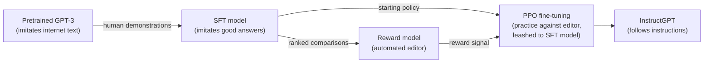
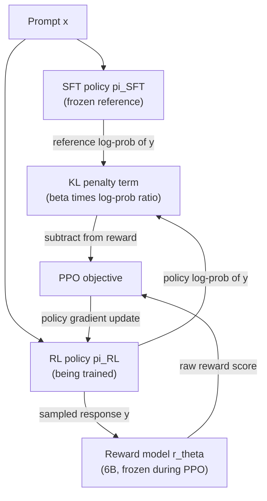
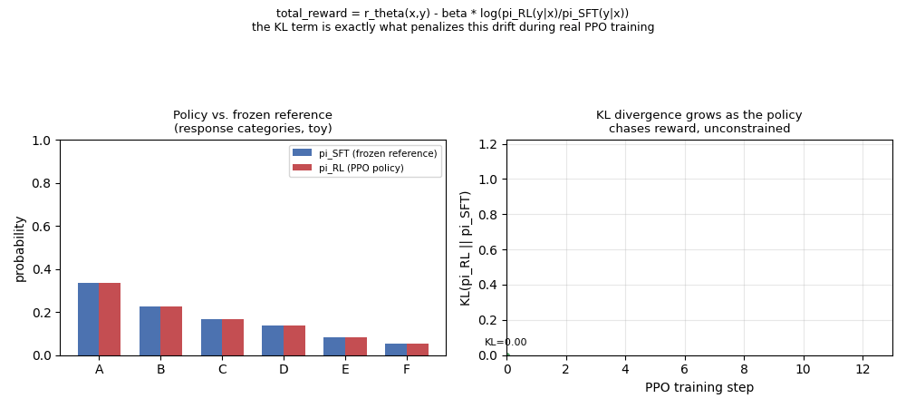
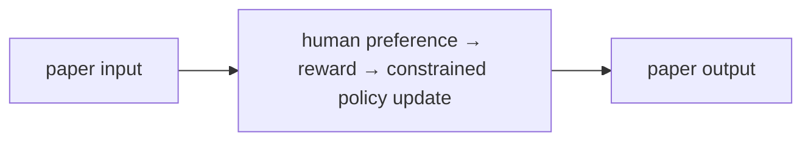
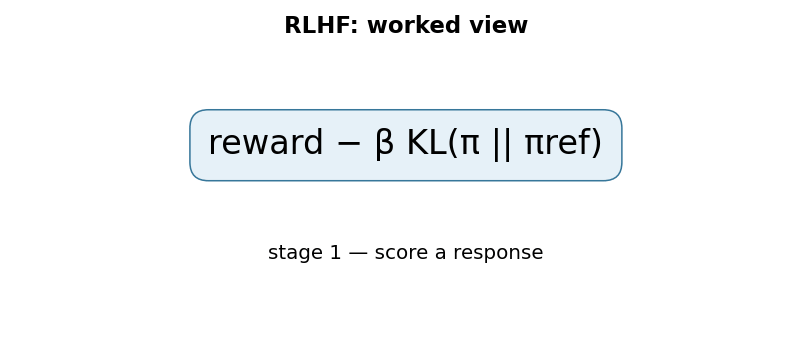

# Training Language Models to Follow Instructions with Human Feedback (InstructGPT)

## TL;DR

In March 2022, OpenAI published InstructGPT: a version of GPT-3 fine-tuned
with human feedback to actually follow instructions rather than just
continue text in whatever way is statistically likely given internet
training data. The recipe is a three-step pipeline — supervised
fine-tuning on human demonstrations, training a reward model on human
preference comparisons, and then using that reward model to fine-tune the
language model with reinforcement learning (PPO) — now generally known as
Reinforcement Learning from Human Feedback (RLHF). The headline result:
human labelers preferred outputs from a 1.3-billion-parameter InstructGPT
model to outputs from the 175-billion-parameter base GPT-3, despite the
InstructGPT model having over 100x fewer parameters. This paper is the
direct methodological ancestor of essentially every "helpful assistant"
LLM product that followed it, including ChatGPT.

## Fun Map for First Years 🧭

RLHF teaches a model from human preferences: people compare answers, a reward model learns their taste, and the assistant practices earning better scores.

`🤖 draft answers → 🧑‍⚖️ humans compare → 🏆 reward signal → 📈 improved assistant`

People do not need to write a perfect numerical score for every answer. Choosing “A is better than B” is often enough to teach a model what people prefer.

If two replies are factually similar but one is concise and polite, an annotator can choose it without explaining a numeric scoring formula. Many such choices teach the reward model a pattern.

💻 **CS analogy:** RLHF resembles training a ranking service from A/B preference logs, then optimizing a policy against that learned scorer.

## Math Playground 🧮

The essential equation or rule is:

```text
−log σ(r(chosen) − r(rejected))
```

**Essential equation:** −log σ(r(chosen) − r(rejected)). Humans pick the better of two answers. The reward model gives each answer a score; subtracting scores asks whether the chosen answer is ahead. The sigmoid σ converts that difference into a number from 0 to 1, like a predicted chance of winning. Training penalizes it when the preferred answer is not predicted to win.

If the chosen answer scores much higher, the sigmoid is near 1 and the penalty is low. If the rejected answer wins, the model gets a large penalty.

The score difference is all that matters: adding 10 to both answer scores changes nothing. The sigmoid only asks whether the chosen answer is ahead, and by how confidently.

## Background: What Came Before 🕰️

Next-token pretraining teaches a model to imitate internet text, not necessarily to follow a helpful, safe instruction. Supervised prompts helped, but they could not capture every quality judgment with one target answer. InstructGPT was needed to turn human preference comparisons into an optimization signal that steers a pretrained model’s behavior.

The new idea connected subjective human judgments to a training signal, so usefulness could be optimized rather than assumed from internet text.

This made product-quality preferences—helpfulness, tone, and harmlessness—part of the training loop, while also creating the need to guard against reward hacking.

## Why It Matters

Before this paper, the standard way to make a large language model useful
was pretraining at scale (GPT-3, Brown et al. 2020) followed, at most, by
few-shot prompting or light supervised fine-tuning on a task-specific
dataset. But the pretraining objective — predict the next token on a huge
scrape of internet text — is not the same thing as "be a helpful,
truthful, non-harmful assistant that follows what the user actually
asked." A model trained purely to imitate internet text will happily
imitate misinformation, imitate texts that ignore the literal instruction
in favor of some more statistically common continuation, and imitate
toxic or evasive content whenever that pattern was common in its training
distribution. The paper's own framing of this: "language models trained
to predict the next word on a webpage, for example, are not necessarily
aligned with these objectives" (helpful, honest, harmless) — the
pretraining objective is a proxy for what we actually want, and it's a
leaky one.

The prevailing intuition going into this paper — and still a common one —
was that scale mostly fixes this: a bigger, better-pretrained model
would naturally get better at following instructions along with
everything else. InstructGPT's headline result is direct evidence
against that intuition in isolation: their 1.3B-parameter model, fine-tuned
with human feedback, produced outputs human labelers preferred over the
175B-parameter GPT-3's outputs, despite being over 100x smaller. Model
scale and alignment turned out to be separable axes — you can make a
much smaller model behave better on the dimension people actually care
about (following instructions, not misinformation-laundering, not being
toxic) without touching parameter count at all, by changing what you
optimize the model against during a later training stage.

What changed after: RLHF (or its later reformulations, like Direct
Preference Optimization) became the standard second stage of training for
essentially every deployed conversational LLM — ChatGPT, Claude, Gemini,
and open-weight instruction-tuned models all use some variant of this
"pretrain, then fine-tune on demonstrations, then optimize against a
learned preference model" recipe. It's worth being precise about
attribution here: InstructGPT was published in March 2022, before
ChatGPT's November 2022 release; the paper itself does not describe or
name ChatGPT (it hadn't been announced yet). That ChatGPT descends
methodologically from this line of work is well documented in OpenAI's
own subsequent public communications and industry reporting, not a claim
made inside this specific paper — worth keeping the paper's own claims and
later industry history distinct.

## Core Intuition

Think of pretraining a large language model as raising a very
well-read but never-supervised writer: it has absorbed an enormous amount
of text and can continue almost any prompt fluently, but nobody ever told
it what a *good* response actually looks like versus merely a *plausible*
one. Ask it a direct question and it might answer helpfully, might
answer evasively, might change the subject, or might continue as if it
were an essay question on a forum — all of these are "plausible
continuations" in the training distribution, and the model has no signal
telling it which one you actually wanted.

RLHF is the process of hiring editors. First, you show the writer worked
examples of the response you actually want (the **supervised
fine-tuning** step: human labelers write out ideal answers to sample
prompts, and the model imitates them directly). Then, instead of writing
out ideal answers for every possible prompt forever — expensive and
doesn't scale — you switch to something cheaper: for a new prompt, have
the model produce several candidate answers, and have a human editor just
*rank* them from best to worst (much easier and faster than writing an
ideal answer from scratch). Train a second model — the **reward model** —
to predict those rankings, so it becomes an automated stand-in editor
that can score any candidate answer without a human in the loop. Finally,
turn the original writer loose to practice against this automated editor
at scale, using reinforcement learning: generate an answer, get scored by
the reward model, adjust to produce higher-scoring answers next time
(the **PPO** step).

The one subtlety that separates this from naive "just maximize the
editor's score": an automated editor can be gamed. If you let the writer
optimize purely against the reward model's score with no other
constraint, it will eventually find degenerate outputs the reward model
happens to score highly but that a real human would consider useless or
bizarre — the classic "reward hacking" failure of any learned proxy
objective. The paper's fix is a leash: a penalty term that keeps the
writer's behavior close to how it behaved right after the demonstration
stage (the supervised fine-tuned model), growing as the two diverge. The
writer can improve within that leash's radius, but can't wander
arbitrarily far from human-demonstrated behavior chasing reward-model
score alone.



## The Mechanism

The three stages below, and exactly what data and reward signal flows
between them for a single training example:



### Step 1: Supervised fine-tuning (SFT)

Starting from pretrained GPT-3 checkpoints, OpenAI collected demonstration
data: human labelers wrote out ideal responses to prompts (both
labeler-written prompts and prompts submitted by users through the OpenAI
API's Playground, filtered for personally identifiable information). The
paper reports roughly 13,000 training prompts for this step. The model is
then fine-tuned with ordinary supervised learning — standard
cross-entropy next-token loss — but only on these curated
prompt/response pairs, for 16 epochs with cosine learning-rate decay and
a residual dropout of 0.2 (a much higher dropout than pretraining, needed
because 16 epochs on only ~13,000 examples overfits quickly otherwise).
This SFT model is the paper's baseline "already follows instructions
somewhat" model, and — critically — it's also the **frozen reference
policy** used in step 3's KL penalty below.

### Step 2: Reward model (RM) training

For a given prompt, the SFT model generates multiple candidate
responses (the paper uses between 4 and 9 responses per prompt), and a
labeler ranks all of them from best to worst. Ranking K responses
produces `C(K, 2)` pairwise comparisons, and the paper reports roughly
33,000 training prompts went into this comparison dataset. All
comparisons from the same prompt are trained on together as a single
batch element, which the paper found reduced overfitting relative to
shuffling individual pairs across batches (highly correlated comparisons
sharing a prompt would otherwise repeatedly reinforce the same signal).

The reward model itself is a GPT-3 model with its final unembedding
layer replaced by a linear layer projecting to a single scalar — so
instead of predicting the next token, it predicts one number: "how good
is this (prompt, response) pair." Given a preferred response `y_w`
("winner") and a dispreferred response `y_l` ("loser") for the same
prompt `x`, the training loss is:

```
loss(theta) = -E[(x, y_w, y_l)~D] [ log( sigmoid( r_theta(x, y_w) - r_theta(x, y_l) ) ) ]
```

This is a pairwise ranking loss: it only ever pushes the *difference*
between the two scores in the right direction (`r_theta(x, y_w)` should
exceed `r_theta(x, y_l)`), never trains toward any particular absolute
value. That has a concrete consequence the paper calls out explicitly:
because this loss is invariant to shifts (adding the same constant to
every score changes nothing), the reward model's raw output has no
inherent zero point. Before using it for RL, the paper normalizes the
reward model with a bias term so that the labeler demonstrations from
step 1 score a mean of 0 — a calibration step, not a modeling choice
that affects what the RM has learned to rank.

One deliberate scale choice: the paper only trains a 6B-parameter reward
model, even for their 175B-parameter InstructGPT variant, for two
reasons it states together: "we only use 6B RMs, as this saves a lot of
compute, and we found that 175B RM training could be unstable and thus
was less suitable to be used as the value function during RL." Compute
savings and training stability are both the paper's own stated
justification for the 6B choice — not competing explanations — and the
6B RM is used across all runs, including as the reward signal for PPO
fine-tuning the 175B policy. The reward model doesn't need to match the
policy's scale to supervise it effectively.

### Step 3: Reinforcement learning with PPO

The SFT model is now treated as an RL policy `pi_RL`, initialized from
the SFT weights, and fine-tuned in what the paper describes as a
**bandit environment**: "a random customer prompt" comes in, the policy
produces one response, the reward model scores the (prompt, response)
pair, and the episode ends — no multi-turn credit assignment, one
prompt/response/reward triple per episode. This makes the RL problem
much simpler than general sequential RL: there's no environment state
that evolves independently of the model's own output, and no long-horizon
credit assignment problem beyond the single response itself.

The full training objective (the paper calls the version below with the
pretraining term "PPO-ptx"; "PPO" is the same objective with the last
term's coefficient set to 0):

```
objective(phi) = E[(x,y)~pi_RL] [ r_theta(x,y) - beta * log( pi_RL(y|x) / pi_SFT(y|x) ) ]
                 + gamma * E[x~D_pretrain] [ log(pi_RL(x)) ]
```

Term by term:
- **`r_theta(x, y)`** — the reward model's score for the sampled
  completion, the thing PPO is fundamentally trying to maximize.
- **`- beta * log(pi_RL(y|x) / pi_SFT(y|x))`** — the KL penalty. `log(pi_RL(y|x) /
  pi_SFT(y|x))` is a per-episode estimate of how much more (or less)
  probable the current policy makes this specific completion compared to
  the frozen SFT/reference policy that produced the human-demonstrated
  behavior; multiplying by `beta` and subtracting means the objective
  actively penalizes drifting toward completions the reference policy
  found improbable, even if the reward model likes them. The paper states
  this is added "to mitigate over-optimization of the reward model" —
  i.e., specifically to counter the reward-hacking failure mode described
  in Core Intuition above. The paper does not give a single fixed
  numeric value of `beta` used across all runs in the main text; it
  states `beta` and the pretraining coefficient `gamma` jointly "control
  the strength" of their respective terms; my interpretation is that this
  implies they're tuned per run (e.g. varied across their ablations),
  though the paper doesn't state that tuning practice explicitly.
- **`gamma * E[log(pi_RL(x))]`** — an additional pretraining-data
  log-likelihood term (mixing in gradient updates from the original GPT-3
  pretraining distribution), present only in the "PPO-ptx" variant
  (`gamma > 0`; plain "PPO" sets `gamma = 0`). This is a separate
  mitigation for a different problem — a regression in performance on
  standard NLP benchmarks — discussed below.

The animation below illustrates the mechanism the KL term exists to
control: a toy PPO policy's output distribution progressively
concentrating on whatever a toy reward function scores highest, plotted
alongside the resulting KL divergence from the frozen reference
distribution at each step. This is an illustrative, hand-constructed
example (not extracted from a trained model) showing the shape of the
tradeoff the `beta` coefficient is there to control — real training
dynamics depend on the actual reward and reference models.



### Headline results

Comparing model outputs pairwise via human preference judgments on a
held-out set of API-style prompts, the paper reports: "outputs from the
1.3B parameter InstructGPT model are preferred to outputs from the 175B
GPT-3, despite having 100x fewer parameters" (175B / 1.3B ≈ 134.6, so
"100x" is itself a round-down of the actual ratio, not an
exaggeration). At matched 175B scale, the paper reports
175B InstructGPT outputs are preferred to plain 175B GPT-3 outputs 85% ±
3% of the time, and preferred 71% ± 4% of the time to 175B GPT-3 prompted
with a handful of few-shot examples designed to encourage
instruction-following. Both comparisons are between models of the same
underlying scale — the 100x-fewer-parameters headline is a separate
comparison, between the smallest InstructGPT and the largest GPT-3.

### The "alignment tax" and how it was mitigated

Fine-tuning purely with PPO against the reward model (the plain "PPO"
variant, `gamma = 0`) caused measurable regressions on standard public
NLP benchmarks the paper evaluated — including SQuAD, DROP, and
HellaSwag — relative to the original pretrained GPT-3. The paper names
this cost directly: "This is an example of an 'alignment tax' since our
alignment procedure comes at the cost of lower performance on certain
tasks." The mitigation was the pretraining-mixing term described above
(PPO-ptx): the paper reports "adding pretraining updates to our PPO
fine-tuning (PPO-ptx) mitigates these performance regressions on all
datasets, and even surpasses GPT-3 on HellaSwag," while also noting they
found this approach worked better than the simpler alternative of just
increasing `beta`. It's worth being precise here too: the paper reports
this mitigation works "on all datasets" in the sense of reducing the
regression, but separately acknowledges residual gaps remained on some
of them, specifically calling out DROP and SQuADv2 as datasets where a
performance gap persisted even with PPO-ptx.

## Practical Engineering Notes

### Worked Math & Dataflow

The compact view below makes the paper's central calculation concrete:

```text
reward − β KL(π || πref)
```

In practice, the calculation is a pipeline: Reward encourages preferred behavior, while the KL penalty keeps the policy near the supervised model. Increasing β makes updates safer but can limit alignment improvement. The important engineering
choice is to preserve the paper's intended invariant while making the operation
fit the available memory, batch size, and evaluation protocol.






**RLHF's PPO stage is expensive in a specific, easy-to-underestimate way:
you need multiple full-size models resident in memory simultaneously.**
Beyond the policy being trained, PPO-style RLHF typically keeps a frozen
copy of the reference/SFT policy (needed every step to compute the KL
term), the reward model (scores every sampled completion), and — in a
standard PPO implementation — a value function/critic estimating expected
future reward for variance reduction. That's up to four models' worth of
weights and activations in play for what is conceptually "fine-tune one
model," which is a large part of why RLHF training runs are
significantly more expensive per token than supervised fine-tuning at
the same model scale, independent of any RL-specific algorithmic
complexity.

**Where this lives in real code:** the general pattern — a supervised
fine-tuning stage, a reward-model training stage with a pairwise ranking
loss, and a PPO stage with a KL penalty against a frozen reference — is
implemented generically by open-source libraries such as Hugging Face's
`trl` package, which exposes trainer classes for each of the three
stages. Exact class names and internal module paths shift release to
release as these libraries evolve; the durable thing to search for in any
given version is "reward model," "PPO," and "reference model" (or
`ref_model`) in that library's own documentation or source, rather than
memorizing an exact import path.

**Reward-model overoptimization ("reward hacking") is not a hypothetical
edge case — it's the specific failure the KL term exists to bound.**
Because the reward model is itself a learned approximation of what
humans want, not the ground truth, a policy optimized hard enough against
it eventually finds outputs the reward model over-scores relative to what
a human labeler would actually prefer — repetitive filler that happens to
score well, unusually long responses if the reward model has a subtle
length bias, and similar artifacts. In production RLHF pipelines this is
watched for directly, often by periodically re-collecting human
preference judgments on the current policy's outputs and checking that
they still track the reward model's scores, not just trusting the
automated proxy indefinitely.

**Human-preference labeling is a first-class production cost, and label
quality is the actual ceiling on the whole pipeline.** The paper used a
team of roughly 40 contractors for demonstration writing and comparison
labeling. Every downstream stage inherits whatever biases,
inconsistencies, or blind spots exist in that labeling process — a
reward model can only be as good as the preferences it was trained to
predict, and a PPO policy optimized against a subtly miscalibrated reward
model will confidently learn the miscalibration. This is why labeler
selection, instructions, and inter-annotator agreement measurement are
treated as core parts of the method in the paper, not an afterthought
appendix.

**A later, widely-adopted simplification is worth knowing even though
it's not in this paper.** Direct Preference Optimization (Rafailov et
al., 2023) shows that the same KL-constrained reward-maximization
objective this paper solves with online PPO sampling can be re-derived
into a single supervised classification-style loss directly on preference
pairs, with no reward model and no RL sampling loop needed at all. This
is later work, not a claim of this paper, but it's the natural next
question anyone learning this pipeline asks ("do I really need the full
RL machinery?") and the answer, for a meaningful chunk of use cases, has
turned out to be no.

## Runnable Code Example

### Run it

The implementation is intentionally small and self-checking. From the repository root, use Python 3; the module docstring states the learning goal, comments identify the paper-specific calculation, and assertions verify the toy invariant.

```bash
python3 papers/05-instructgpt-rlhf/code/rlhf_from_scratch.py
```

### Read it in order

Start with the module docstring, then follow the named helper calculations and the final assertions. The example is a dependency-light teaching implementation, not a production training system; change one input at a time and rerun it to see which invariant changes.


See `code/rlhf_from_scratch.py` for two self-contained, runnable smoke
tests in PyTorch, each mirroring one formula from The Mechanism above:

1. **Reward model training.** A linear `RewardHead` scores pairs of
   frozen random-feature "completions" and is trained with the exact
   pairwise ranking loss from the paper (`-log(sigmoid(r_chosen -
   r_rejected))`, averaged over the batch) against a synthetic ground
   truth. The script asserts the training loss decreases and that the
   trained head ranks the "chosen" completion above the "rejected" one on
   over 90% of held-out pairs — i.e., it actually learns the preference
   structure from pairwise comparisons alone, with no absolute labels
   ever provided, matching how the real reward model is trained.
2. **KL-penalized reward.** `ppo_kl_penalized_reward` implements
   `r_theta(x,y) - beta * log(pi_RL(y|x)/pi_SFT(y|x))` directly. The
   script asserts the penalty is exactly zero when the policy's
   log-probability matches the frozen reference's, and that holding the
   raw reward-model score fixed while increasing the policy's
   log-probability relative to the reference (simulating growing drift)
   causes the total reward to fall strictly monotonically — the
   mechanical reason this term discourages the policy from drifting
   arbitrarily far from the reference just to chase reward-model score.

Running it (`python code/rlhf_from_scratch.py`):

Expected output:
```
ok: reward model loss 0.8440 -> 0.0160 after training; ranks chosen > rejected on 100% of pairs
ok: KL-penalized reward falls monotonically as policy drifts from reference: [2.0, 1.8, 1.6, 1.2] (raw reward-model score fixed at 2.0)
```

(Exact loss/percentage values may vary slightly by PyTorch version even
with a fixed random seed; the qualitative behavior — loss decreasing,
ranking accuracy high, reward falling monotonically — is what the
assertions check.)

## Common Misconceptions & Pitfalls

- **"RLHF teaches the model new facts or capabilities."** It's more
  accurate to say RLHF reweights and elicits behaviors the pretrained
  model can already produce, steering it toward the responses humans
  prefer rather than injecting new knowledge — this is a widely-held
  interpretation in the field, not a specific measured claim made by this
  paper. The paper's own contribution is about *following instructions
  and matching human preferences*, not about expanding what the
  underlying model knows; the SFT and RM datasets (tens of thousands of
  examples) are minuscule next to GPT-3's pretraining corpus, which is
  itself a reason to be skeptical that this stage is where new knowledge
  would come from.
- **"A bigger reward model is always better."** The paper deliberately
  used a 6B-parameter reward model even when fine-tuning the
  175B-parameter policy, stating that 175B reward model training "could
  be unstable" — a concrete, paper-stated reason to *not* default to
  matching reward-model scale to policy scale.
- **"The reward model's raw score is a calibrated, absolute quality
  measure."** It isn't — the pairwise ranking loss is invariant to adding
  a constant to every score (only the *differences* it was trained on
  matter), so the paper has to explicitly renormalize the reward model
  with a bias term before using it in RL, choosing the bias so
  labeler-written demonstrations score a mean of 0. Treat reward-model
  outputs as a relative ranking signal, not an interpretable absolute
  scale.
- **"Alignment tax means RLHF makes the model worse across the board."**
  The paper does report a real regression on some public NLP benchmarks
  for the plain PPO variant, and names it directly ("alignment tax"). But
  the PPO-ptx mitigation (mixing pretraining-data gradient updates back
  in) recovers most of that regression and, on HellaSwag specifically,
  the paper reports it even surpasses plain GPT-3 — so "alignment
  necessarily costs capability" is not the paper's conclusion; residual
  gaps on some benchmarks (DROP, SQuADv2) remained even after the fix,
  which is the more precise version of the finding.
- **"PPO in this paper is a general sequential-decision RL problem."** The
  paper explicitly frames it as a single-step bandit environment: one
  prompt in, one full response out, one reward, episode ends — there's no
  multi-turn state transition or long-horizon credit assignment beyond
  generating that one response. This makes the RL problem considerably
  simpler than, say, a game-playing RL agent, even though the underlying
  PPO algorithm is general-purpose.

## Interview Q&A

**Q:** Walk through the three stages of the RLHF pipeline in this paper —
what does each stage optimize, and what does each stage's output feed
into the next one?
**A:** (1) Supervised fine-tuning: the pretrained GPT-3 model is
fine-tuned with ordinary cross-entropy loss on human-written
demonstrations of ideal responses (~13,000 prompts) — this produces the
SFT model, which becomes both the initial RL policy and the frozen
reference policy used later. (2) Reward model training: the SFT model
generates multiple candidate responses per prompt, humans rank them, and
a separate model (a GPT architecture with its unembedding layer replaced
by a scalar head) is trained on the pairwise ranking loss
`-log(sigmoid(r_chosen - r_rejected))` over ~33,000 comparison prompts —
this produces an automated proxy for human preference. (3) PPO
reinforcement learning: the SFT model (as the RL policy) generates
responses to new prompts, the reward model scores them, and PPO updates
the policy to maximize `reward_model_score - beta * KL(policy || SFT
reference)` — this produces the final InstructGPT policy.

**Q:** Why does the reward model need a normalization/bias correction
before being used for RL, and what specifically would go wrong without
it?
**A:** The reward model is trained on a pairwise ranking loss that only
constrains the *difference* between preferred and dispreferred scores —
adding any constant to every output leaves that difference, and therefore
the loss, unchanged. So the raw trained reward model has an arbitrary,
unconstrained zero point. The paper fixes this by adding a bias so that
labeler demonstrations score a mean of 0 before RL begins. Without this
step, the RL objective's absolute reward scale would be arbitrary
(shifted by whatever the untrained bias happened to converge to), which
matters for things like interpreting reward trends during training and
setting the relative weight of the KL penalty against a raw reward
magnitude that has no principled reference point.

**Q:** What specific problem does the KL penalty term solve, and what
would you observe if you trained with beta = 0?
**A:** It counters reward-model over-optimization ("reward hacking"): if
the policy is free to maximize the reward model's score with no
constraint, it can drift toward outputs the reward model over-scores
relative to what a human would actually prefer, since the reward model is
only an approximation of true human preference, not the ground truth
itself. With beta = 0, you'd expect training to eventually find
degenerate or repetitive outputs that happen to score well on the reward
model but that a human labeler, shown the output directly, would rate
poorly — with no mechanism pulling the policy back toward the
demonstrated, human-vetted behavior of the SFT model. The paper's
qualitative framing (though it doesn't run a beta=0 ablation to failure
in the excerpted results) is that beta exists specifically "to mitigate
over-optimization of the reward model."

**Q:** What is the "alignment tax," and how did the paper address it?
**A:** It's the paper's own term for a measured regression in performance
on standard public NLP benchmarks (including SQuAD, DROP, and HellaSwag)
that resulted from PPO fine-tuning against the reward model, relative to
the original pretrained GPT-3. Their fix was "PPO-ptx": mixing gradient
updates from the original GPT-3 pretraining data distribution back into
the PPO fine-tuning loop, controlled by a coefficient gamma in the
objective. They report this mitigates the regression on all the
benchmarks they tested and even surpasses GPT-3 on HellaSwag, and that it
worked better than the simpler fix of just raising beta — though some
residual gap remained on DROP and SQuADv2 specifically.

**Q:** Why is the RL problem in this paper framed as a "bandit" rather
than a general sequential-decision-making problem, and why does that
framing matter for how hard the RL is?
**A:** Each episode is: one prompt comes in, the policy generates one
full response, the reward model scores the (prompt, response) pair once,
and the episode ends immediately — there's no environment state that
evolves independently of the model's own generation and no multi-step
credit-assignment problem where a decision now affects rewards several
steps later. That's structurally simpler than, say, a multi-turn game,
even though generating the response itself is a multi-token
autoregressive process (which PPO still has to handle at the token
level, hence the per-token KL penalty). The bandit framing is why RLHF
for single-turn instruction-following is tractable with a comparatively
standard PPO setup, without needing the longer-horizon credit-assignment
machinery general RL research usually has to grapple with.

**Q:** The paper reports InstructGPT-1.3B is preferred over GPT-3-175B
"despite having 100x fewer parameters" — is that evidence that scale
doesn't matter for language model quality?
**A:** No — it's evidence that *raw pretraining scale alone* is not the
same axis as *following instructions the way humans want*, for the
specific evaluation the paper ran (human preference on API-style
prompts). It doesn't mean InstructGPT-1.3B is better than GPT-3-175B on
every axis — GPT-3-175B has far more raw knowledge and capability from
pretraining at that scale. The paper's own separate finding on the
"alignment tax" is a good example of why this distinction matters: RLHF
fine-tuning, unmitigated, can trade away some benchmark capability for
better instruction-following, meaning the two axes (scale/capability vs.
alignment/preference-matching) genuinely can move somewhat independently
in both directions, not just in InstructGPT's favor.

## SDE2 Interview Drill-down

These prompts are designed for a second-level software engineering interview: explain the mechanism, name the operational trade-off, and describe how you would test it.

**Q:** Walk through reward-model-guided policy optimization end to end. What does `E[reward]−βKL(π||πref)` mean in an implementation?
**A:** Start by identifying the data structure entering the operation, the learned or configured values it uses, and the invariant that must hold at the output. In this paper, E[reward]−βKL(π||πref) is not just notation: it tells you what is compared, normalized, accumulated, or optimized. A strong implementation makes those stages visible in separate functions, keeps tensor shapes and dtypes explicit, and tests a tiny hand-computed example before optimizing. Explain what happens when the inputs are short, padded, empty, or unusually large; those cases often reveal whether the code actually matches the paper.

**Follow-up:** Which invariant would you assert?
**A:** Assert the property that makes the method meaningful: probabilities normalize over valid choices, a residual preserves shape, a target does not bootstrap past termination, or an update leaves frozen state untouched. The assertion should be local and cheap enough to run in tests, not an end-to-end hope such as “accuracy improves.” Also compare the optimized path with a simple reference on random small inputs using an appropriate tolerance. That catches indexing, masking, reduction, and broadcasting errors while the failing example is still understandable.

**Q:** What is the main production trade-off, and how would you capacity-plan it?
**A:** The practical trade-off here is preference collection, reward inference, and policy updates form a costly and potentially unstable loop. Estimate both arithmetic work and memory movement, then identify whether the service is compute-bound, bandwidth-bound, latency-bound, or limited by coordination. Include batch-size effects, peak activation/state memory, serialization, and cold-start behavior; average throughput can hide a bad tail latency. Choose a baseline configuration, measure it on representative shapes, and document which quality metric is allowed to move. If the system is distributed, include communication and retry behavior rather than treating the model operation as an isolated kernel.

**Follow-up:** What would make you reject an apparently faster optimization?
**A:** Reject it when it changes the evaluation contract, weakens isolation, creates silent quality regressions, or only wins on a synthetic shape. For this paper, watch especially for reward hacking, distribution shift, or policy drift from the reference. A safe rollout uses a reference implementation, shadow traffic or canaries, resource limits, and dashboards for both system and model metrics. Keep the old path available until numerical outputs, error rates, p95/p99 latency, and cost are stable across the important input distributions.

**Q:** How would you debug a model that passes unit tests but fails in production?
**A:** Reproduce the smallest production-shaped input and compare intermediate values against the reference path, not only the final score. Log versioned preprocessing, shapes, masks, random seeds where relevant, and the exact model/configuration identifiers; otherwise a numerical symptom can be caused by data drift or a serving mismatch. Separate failures into data, numerical stability, optimization, and infrastructure categories. For this method, begin with track reward, KL, human preference, and adversarial slices separately, then run a controlled ablation that disables the paper-specific mechanism to determine whether the regression is in the mechanism or its integration.

**Follow-up:** What evidence would you present in the postmortem or interview?
**A:** Show one minimal failing example, the expected invariant, the observed intermediate divergence, and the fix’s regression test. Add a before/after metric table covering quality, memory, throughput, and tail latency, plus the rollout guard that would catch recurrence. This demonstrates engineering judgment: the goal is not merely to identify a clever algorithm, but to make its behavior observable, reproducible, and safe to operate.


## Further Reading

- [Training language models to follow instructions with human feedback (arXiv:2203.02155)](https://arxiv.org/abs/2203.02155) — the original paper
- [Language Models are Few-Shot Learners (arXiv:2005.14165)](https://arxiv.org/abs/2005.14165) — the GPT-3 paper; the pretrained base model this paper fine-tunes and compares against
- [Deep Reinforcement Learning from Human Preferences (Christiano et al., 2017, arXiv:1706.03741)](https://arxiv.org/abs/1706.03741) — the earlier general RLHF framework this paper applies to language models
- [Learning to Summarize from Human Feedback (Stiennon et al., 2020, arXiv:2009.01325)](https://arxiv.org/abs/2009.01325) — the direct precursor applying the same reward-model + PPO recipe to summarization specifically
- [Direct Preference Optimization (Rafailov et al., 2023, arXiv:2305.18290)](https://arxiv.org/abs/2305.18290) — later work reformulating this paper's KL-constrained RLHF objective as a single supervised loss, without the PPO sampling loop
