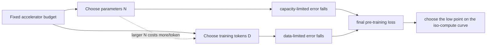
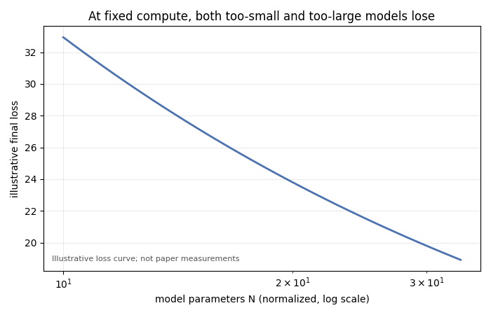
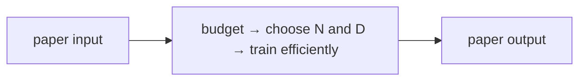
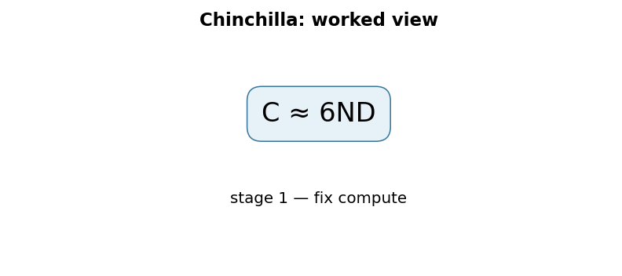

# Training Compute-Optimal Large Language Models (Chinchilla)

Hoffmann et al., 2022 — [arXiv:2203.15556](https://arxiv.org/abs/2203.15556)

## TL;DR

Chinchilla asks a planning question rather than proposing a new Transformer block: with a fixed pre-training compute budget, how should we split it between model parameters and training tokens? The paper finds that many prominent language models had spent too much of their budget on parameter count and too little on data. Across more than 400 training runs, its three estimation methods all said that compute-optimal parameter count and token count should grow at roughly the same rate as compute grows. The headline validation was Chinchilla: a 70B-parameter model trained on 1.4T tokens, using roughly Gopher's training compute but outperforming the 280B-parameter Gopher on the reported downstream suite. This is a scaling-law result: it is a useful empirical rule for the experimental regime, not a law that makes data quality, architecture, hardware, or post-training irrelevant.

## Fun Map for First Years 🧭

Chinchilla says a big brain also needs enough books. Spending all compute on a giant model or all compute on repeated reading wastes part of the budget.

`⚙️ compute budget → 🧠 model size + 📚 training tokens → ⚖️ balanced training → 📉 lower loss`

The key lesson is balance. A giant model that reads too little is like buying a huge hard drive but never filling it; a tiny model that reads everything may not have enough room to learn.

Suppose a team can afford one fixed number of training operations. Spending them on more parameters leaves fewer tokens to read; spending them on more tokens leaves fewer parameters to represent what was learned.

💻 **CS analogy:** compute-optimal training is capacity planning: CPU cores and input records must be provisioned together, not independently maxed out.

## Math Playground 🧮

The essential equation or rule is:

```text
L(C) ≈ aC⁻ᵝ + c
```

**Essential equation:** L(C) ≈ aC⁻ᵝ + c. L means error (lower is better) and C means training compute. The negative exponent says more compute reduces error, but with diminishing returns: doubling the budget helps, yet usually not by twice as much. The fitted curve helped compare how to split one fixed budget between a bigger model and more training tokens.

The ≈ sign means fitted estimate, not an exact rule. The constants a, β, and c are measured from experiments and control the curve’s height, bend, and lower limit.

On a power-law curve, moving C from 1 to 2 may reduce loss a lot, while moving it from 100 to 101 changes little. That bend is the mathematical picture of diminishing returns.

## Background: What Came Before 🕰️

Scaling practice had emphasized making models larger, and compute-optimal rules based on earlier evidence encouraged parameter-heavy training. Many large models consequently saw too few tokens for their size. Chinchilla was needed to show, under a fixed compute budget, that model parameters and training data should grow together.

This shifted planning from “always make it bigger” to testing how model size and data should share a fixed compute budget.

The study made data tokens a first-class scaling decision, not merely fuel to be consumed after model size had already been chosen.

## Why It Matters

Before this paper, a very visible story about language-model progress was “make the dense model larger.” That story had real evidence behind it: the earlier Kaplan scaling-law work showed smooth power-law improvements with model size, data, and compute. But a project does not get to increase all three independently. A team normally knows its accelerator budget and deadline first. At that fixed budget, making each training step more expensive by increasing the number of parameters means it can afford fewer steps or fewer tokens. Conversely, training an extremely small model for a huge number of tokens leaves representational capacity unused. The engineering decision is an allocation problem.

The distinction matters because a parameter is paid for more than once. It costs compute during pre-training, but it also occupies memory, increases the cost and latency of every generated token, constrains batch size and serving hardware, and can make fine-tuning less convenient. A model that is smaller yet better trained can be cheaper over its entire useful life. The paper explicitly frames this lifecycle benefit: training cost is amortized by later inference and fine-tuning.

The contemporary comparison makes the point concrete. The paper lists GPT-3 at 175B parameters and 300B training tokens, Gopher at 280B and 300B tokens, and Chinchilla at 70B and 1.4T tokens. This does not mean “70B is universally ideal.” It means that, for approximately the compute used for Gopher, the authors' fitted frontier expected a model about four times smaller trained on about four times more data to be a better choice. They then tested that prediction rather than stopping at a curve fit.

Chinchilla also shifted attention to the data supply. If keeping a model on the efficient frontier requires many more tokens as compute rises, progress becomes constrained by collecting, cleaning, licensing, deduplicating, mixing, and documenting data. More tokens are not automatically more useful tokens; repeated low-quality data or leakage into benchmarks can invalidate the intended comparison. The result therefore made data engineering a first-class scaling concern alongside distributed-training engineering.

There is a subtle historical correction here. Kaplan et al. had concluded that, at fixed compute, model size should grow faster than the number of training tokens. Chinchilla obtained approximately equal growth. Hoffmann et al. identify methodological differences, including varying the learning-rate schedule with training horizon and using larger models in their analysis. One should not caricature the earlier work as “wrong”: both studies fit empirical scaling relationships under particular choices and extrapolate beyond the smallest runs. The useful lesson is to validate planning laws with controlled sweeps that resemble the regime where they will be used.

## Core Intuition

Imagine opening a restaurant with a fixed payroll. You can hire a very large kitchen but only afford to serve a few customers, or hire a tiny kitchen and spend all day serving more customers than it can learn to handle. Neither extreme is good preparation for a busy service. A training budget has the same tension: parameters are the kitchen's capacity; tokens are its experience with orders.

At fixed compute, the two knobs are coupled. A larger dense Transformer processes a token with more multiply-adds. So, if the total multiply-add budget stays fixed, increasing parameters reduces the affordable token count. The final language-model loss usually has two visible sources of avoidable error: insufficient capacity and insufficient data/optimization. Adding parameters lowers the first; seeing more tokens lowers the second. The efficient choice is where the marginal payoff from either direction is balanced.



This is why a loss-versus-model-size plot at one fixed compute budget has a valley. On the left, the model is small and gets plenty of tokens but lacks capacity. On the right, the model is huge but receives too little training. The low point is not necessarily a single sharp integer; it is a useful region, and uncertainty in the fit, data mix, and system efficiency should be part of any real decision.

“Scale parameters and tokens equally” is easy to misread as “keep tokens-per-parameter constant under every definition.” The paper's claim is about how the *optimal* values scale as the available training compute (C) changes: (N_{opt}\) and (D_{opt}\) each have an exponent near one half. Because dense training compute is approximately proportional to (N D), doubling both quantities approximately quadruples compute. The proportionality constant and the resulting tokens-per-parameter ratio come from the empirical fit and model/training setup; they are not supplied by the exponent alone.

## The Mechanism

The authors formalize the decision as minimizing final pre-training loss (L(N,D)), where (N) is non-embedding parameter count and (D) is the number of training tokens, subject to a compute constraint. Their approximate dense-Transformer accounting is (C \approx 6ND) FLOPs. The constant is a planning approximation; actual cost also depends on sequence length, attention, vocabulary/embeddings, activation recomputation, hardware utilization, and implementation details. Still, it captures the central product constraint: at fixed (C), (D \approx C/(6N)).

Their third approach fits a parametric loss surface:

\[
\hat L(N,D) = E + \frac{A}{N^\alpha} + \frac{B}{D^\beta}.
\]

Here (E) is an irreducible asymptote for the data distribution, the (N) term represents finite-model error, and the (D) term represents the penalty for finite training data/tokens. This is not a derivation from first principles. It is a compact empirical model whose quality must be assessed from held-out runs. Under (C\approx6ND), minimizing this surface yields power-law optimal allocations. The exponents are (a=\beta/(\alpha+\beta)) and (b=\alpha/(\alpha+\beta)) for (N_{opt}\propto C^a) and (D_{opt}\propto C^b).

```mermaid
flowchart TD
    R[Many small-to-medium training runs] --> X[Record N, D, final smoothed loss]
    X --> M1[Approach 1: envelope of training curves]
    X --> M2[Approach 2: isoFLOP profiles]
    X --> M3[Approach 3: fit L-hat(N,D)]
    M1 --> P[fit Nopt(C), Dopt(C)]
    M2 --> P
    M3 --> P
    P --> V[Predict a Gopher-compute model]
    V --> CH[Train Chinchilla: 70B parameters, 1.4T tokens]
    CH --> E[Evaluate against Gopher and other reported baselines]
```

The paper intentionally uses three estimation routes to reduce dependence on one fitting choice. Approach 1 holds model sizes fixed, trains each over several horizons, interpolates smoothed curves, and takes the lowest-loss envelope at each FLOP count. It reports exponents 0.50 for parameters and 0.50 for tokens. Approach 2 constructs fixed-compute (IsoFLOP) profiles: for each of nine FLOP budgets, it varies model size, determines the compatible token count, fits the loss valley, then fits a power law through the minima. It reports 0.49 and 0.51. Approach 3 fits the parametric surface above using Huber loss and L-BFGS and reports 0.46 and 0.54. The agreement is approximate rather than exact, which is the appropriate reading of an empirical frontier.

The experiments cover more than 400 language models, from 70M to over 16B parameters, trained from 5B to 500B tokens according to the abstract. The extrapolation target was much larger, so the crucial test was the final model. Chinchilla used 70B parameters and 1.4T tokens at approximately Gopher's compute budget; the paper reports 67.5% average MMLU accuracy, more than seven percentage points above Gopher. It also reports broad downstream advantages. Those are evaluation claims under the paper's protocols, not a guarantee that every downstream application will see the same margin.

The animation below uses a deliberately simple symmetric teaching loss under fixed normalized compute. It visualizes the valley, not the authors' measured points or fitted coefficients.



One operational detail deserves emphasis: the learning-rate schedule must be part of a fair token-budget experiment. The paper argues that decaying the learning rate over a horizon matched to the training-token horizon gives the best final loss in its setup. Reusing a long schedule and reading intermediate checkpoints can make short runs look worse than properly scheduled short runs. In other words, a scaling sweep is an experiment about a *training recipe*, not only a model shape.

### Mechanism in Code

At implementation level, the mechanism operates on parameter count, token count, and measured loss. A faithful
forward pass should follow this order: fit comparable runs, estimate the frontier, allocate a budget, and validate the forecast. Keep the intermediate
representation available while debugging; collapsing everything into one
opaque framework call makes shape and numerical errors much harder to isolate.

The key production failure to guard against is comparing runs with different data quality or hidden compute budgets. Add a tiny
reference test with hand-checkable values, then add a property test that
covers padding, empty/short inputs, boundary probabilities, and the largest
supported shape. Compare intermediate tensors with tolerances appropriate to
the dtype, and log the paper-specific statistic during a canary rollout.


## Practical Engineering Notes

### Worked Math & Dataflow

The compact view below makes the paper's central calculation concrete:

```text
C ≈ 6ND
```

In practice, the calculation is a pipeline: For a fixed compute budget, increasing parameters leaves fewer tokens and increasing data leaves fewer parameters. The useful design point balances both rather than maximizing model size alone. The important engineering
choice is to preserve the paper's intended invariant while making the operation
fit the available memory, batch size, and evaluation protocol.






Treat a scaling law as a budget-planning prior, then calibrate it with runs in your own regime. Tokenizers change token counts; code, multilingual text, synthetic data, and repeated epochs differ in information content; architecture changes can alter scaling; and loss may not track the product metric your product cares about. Start with a logarithmic grid of model sizes and token horizons, keep a data-mixture version fixed, and record both realized FLOPs and wall-clock throughput. The `6ND` figure is useful for comparing plans, but GPU-hour cost should include attention overhead, communication, checkpointing, evaluation, failures, and utilization.

Data accounting needs to be explicit. Log unique source tokens, tokens presented to the optimizer, repeat rate, filters, deduplication method, and contamination checks. “1T tokens” without a tokenizer, mixture, and repeat policy is not a reproducible compute/data budget. If high-quality data is the bottleneck, blindly repeating it may change the overfitting and memorization behavior that the clean infinite-data approximation abstracts away.

For production, smaller compute-optimal models can improve latency, memory headroom, and fine-tuning cost, but serving is not determined by parameter count alone. Context length, KV-cache size, quantization, batch shape, speculative decoding, and memory bandwidth often dominate. Measure with the intended workload in frameworks such as PyTorch, JAX, or TensorFlow and serving systems such as vLLM, TensorRT-LLM, or Hugging Face Text Generation Inference. A model selected for pre-training FLOP efficiency can still be the wrong latency/cost point for a particular deployment.

When running a sweep, use a shared configuration schema and immutable run metadata: parameter-count convention, number of layers/width/heads, sequence length, optimizer, batch schedule, learning-rate schedule, data snapshot, seed, and compute estimator. Compare loss after matching token or compute budgets as appropriate; avoid quietly comparing an undertrained large checkpoint with a converged small one. Track confidence intervals across seeds if the differences near the valley are small.

Finally, separate pre-training planning from post-training. Instruction tuning, preference optimization, retrieval, tool use, and architecture changes may move product quality substantially without following the same frontier. Chinchilla answers a valuable narrower question: how to allocate dense autoregressive pre-training compute between parameters and tokens in the studied setting.

## Runnable Code Example

### Run it

The implementation is intentionally small and self-checking. From the repository root, use Python 3; the module docstring states the learning goal, comments identify the paper-specific calculation, and assertions verify the toy invariant.

```bash
python3 papers/06-chinchilla/code/compute_optimal_scaling.py
```

### Read it in order

Start with the module docstring, then follow the named helper calculations and the final assertions. The example is a dependency-light teaching implementation, not a production training system; change one input at a time and rerun it to see which invariant changes.


[`code/compute_optimal_scaling.py`](code/compute_optimal_scaling.py) is a CPU-only, dependency-free toy sweep. It holds normalized compute (N D) fixed, evaluates a simplified version of the paper's loss shape for candidate parameter counts, and derives the token count from the fixed budget. The printout marks the lowest point and assertions check that the balanced allocation beats both extremes.

Run it from this directory with:

```bash
python3 code/compute_optimal_scaling.py
```

The constants are intentionally illustrative. The point is executable intuition: if loss has both a capacity-limited and data-limited contribution, a product constraint creates an interior optimum. It does not fit the Chinchilla data, train a language model, or estimate a real hardware budget.

## Common Misconceptions & Pitfalls

**“Chinchilla says every model needs exactly 20 tokens per parameter.”** The paper's central result is near-equal *scaling exponents* for optimal parameters and tokens as compute increases. A convenient rule of thumb derived from a particular fit is not a universal invariant across model families, datasets, or definitions of parameters/tokens.

**“Smaller always beats larger.”** No. For a fixed budget, the paper predicts a specific trade-off. If the budget rises, both the optimal model and optimal data budget rise. A model can also be too small and capacity-limited.

**“More tokens means more distinct high-quality data.”** Not necessarily. A token count can include repeated epochs, low-quality additions, or synthetic data. The paper's interpretation assumes a sufficiently large data regime; data quality and contamination are separate engineering and scientific concerns.

**“The 6ND FLOP formula is an exact bill.”** It is an approximation useful for a dense-Transformer scaling analysis. Sequence length, attention cost, embeddings, communication, and accelerator utilization can make wall-clock and monetary costs differ materially.

**“A lower pre-training loss guarantees better behavior.”** Loss is an important proxy and Chinchilla reports downstream evaluations, but safety, factuality, instruction following, domain fit, and latency require their own measurements and post-training work.

## Quick Concept Checks

**Q:** What question does Chinchilla answer?
**A:** Given fixed dense language-model training compute, it asks how to allocate that budget between parameter count and training-token count to minimize final pre-training loss.

**Q:** Why is there an optimum instead of simply maximizing parameters?
**A:** Approximate training compute grows with the product of parameters and tokens. At fixed compute, more parameters leave fewer tokens, so gains in capacity eventually lose to undertraining.

**Q:** What is an IsoFLOP profile?
**A:** It is a set of runs at a fixed FLOP budget with different model sizes and therefore different compatible token counts. Plotting final loss against model size reveals a valley whose minimum estimates the efficient allocation for that budget.

**Q:** State the parametric loss model used in the paper.
**A:** The fitted form is \(\hat L(N,D)=E+A/N^\alpha+B/D^\beta\): an irreducible term plus decreasing finite-model and finite-data terms.

**Q:** What empirical scaling result did the three approaches agree on?
**A:** They found parameter count and training tokens should each scale roughly as the square root of compute, so both should approximately double when the compute budget quadruples.

**Q:** How did the paper validate an extrapolated scaling prediction?
**A:** It trained Chinchilla, a 70B-parameter model on 1.4T tokens at about Gopher's compute budget, then compared it with the reported large-model baselines on downstream evaluations.

**Q:** Why can a compute-optimal smaller model be operationally attractive?
**A:** It can deliver stronger quality at a given training budget while lowering later fine-tuning and inference cost relative to a much larger, less fully trained model. Serving measurements are still necessary.

## Worked Scaling Decision

Suppose a team has a fixed training-compute budget. Increasing parameter count
uses more compute per token, leaving fewer tokens affordable; increasing tokens
with a tiny model eventually makes the model unable to absorb the additional
evidence. Chinchilla's practical contribution is to treat this as a joint
allocation problem, not a contest to maximize parameters. Estimate the budget,
choose a model/data pair on the reported compute-optimal frontier, then verify
the choice with small scaling experiments on the actual corpus.

The result is not a permanent universal ratio. Architecture, data quality,
tokenizer, sequence length, objective, and hardware can change the frontier.
The durable lesson is methodological: record both parameters and training
tokens, report compute, and compare models at matched budgets. A model that
looks impressive at one size may be an inefficient use of the same training
resources.

## Interview Q&A

These prompts are designed for a second-level software engineering interview: explain the mechanism, name the operational trade-off, and describe how you would test it.

**Q:** Walk through compute-optimal parameter/data allocation end to end. What does `C≈6ND` mean in an implementation?
**A:** Start by identifying the data structure entering the operation, the learned or configured values it uses, and the invariant that must hold at the output. In this paper, C≈6ND is not just notation: it tells you what is compared, normalized, accumulated, or optimized. A strong implementation makes those stages visible in separate functions, keeps tensor shapes and dtypes explicit, and tests a tiny hand-computed example before optimizing. Explain what happens when the inputs are short, padded, empty, or unusually large; those cases often reveal whether the code actually matches the paper.

**Follow-up:** Which invariant would you assert?
**A:** Assert the property that makes the method meaningful: probabilities normalize over valid choices, a residual preserves shape, a target does not bootstrap past termination, or an update leaves frozen state untouched. The assertion should be local and cheap enough to run in tests, not an end-to-end hope such as “accuracy improves.” Also compare the optimized path with a simple reference on random small inputs using an appropriate tolerance. That catches indexing, masking, reduction, and broadcasting errors while the failing example is still understandable.

**Q:** What is the main production trade-off, and how would you capacity-plan it?
**A:** The practical trade-off here is the best model size depends on both training tokens and available FLOPs, not parameter count alone. Estimate both arithmetic work and memory movement, then identify whether the service is compute-bound, bandwidth-bound, latency-bound, or limited by coordination. Include batch-size effects, peak activation/state memory, serialization, and cold-start behavior; average throughput can hide a bad tail latency. Choose a baseline configuration, measure it on representative shapes, and document which quality metric is allowed to move. If the system is distributed, include communication and retry behavior rather than treating the model operation as an isolated kernel.

**Follow-up:** What would make you reject an apparently faster optimization?
**A:** Reject it when it changes the evaluation contract, weakens isolation, creates silent quality regressions, or only wins on a synthetic shape. For this paper, watch especially for extrapolating a fitted frontier outside the measured scale range. A safe rollout uses a reference implementation, shadow traffic or canaries, resource limits, and dashboards for both system and model metrics. Keep the old path available until numerical outputs, error rates, p95/p99 latency, and cost are stable across the important input distributions.

**Q:** How would you debug a model that passes unit tests but fails in production?
**A:** Reproduce the smallest production-shaped input and compare intermediate values against the reference path, not only the final score. Log versioned preprocessing, shapes, masks, random seeds where relevant, and the exact model/configuration identifiers; otherwise a numerical symptom can be caused by data drift or a serving mismatch. Separate failures into data, numerical stability, optimization, and infrastructure categories. For this method, begin with run matched-budget pilots and hold out larger-scale validation points, then run a controlled ablation that disables the paper-specific mechanism to determine whether the regression is in the mechanism or its integration.

**Follow-up:** What evidence would you present in the postmortem or interview?
**A:** Show one minimal failing example, the expected invariant, the observed intermediate divergence, and the fix’s regression test. Add a before/after metric table covering quality, memory, throughput, and tail latency, plus the rollout guard that would catch recurrence. This demonstrates engineering judgment: the goal is not merely to identify a clever algorithm, but to make its behavior observable, reproducible, and safe to operate.


## Further Reading

- [Original paper: Training Compute-Optimal Large Language Models](https://arxiv.org/abs/2203.15556)
- [Chinchilla paper HTML, including methods and appendices](https://arxiv.org/html/2203.15556)
- [Scaling Laws for Neural Language Models (Kaplan et al.)](https://arxiv.org/abs/2001.08361)
- [The Pile: An 800GB Dataset of Diverse Text for Language Modeling](https://arxiv.org/abs/2101.00027)
