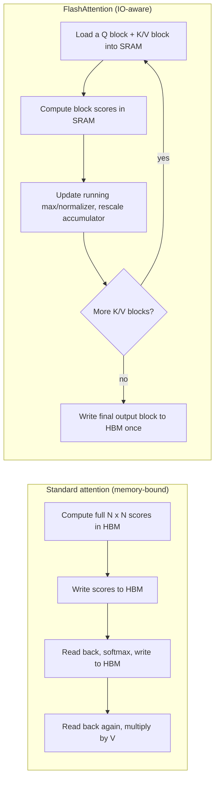
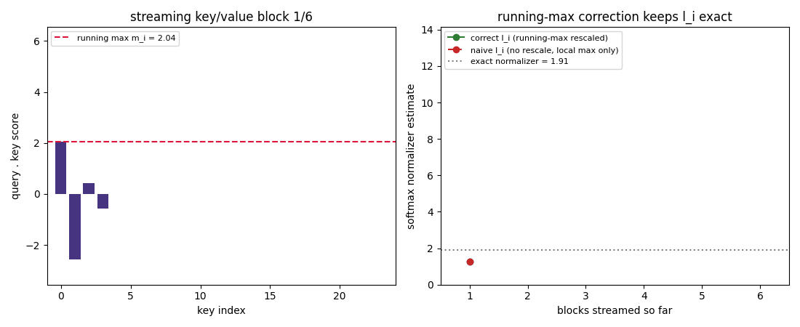
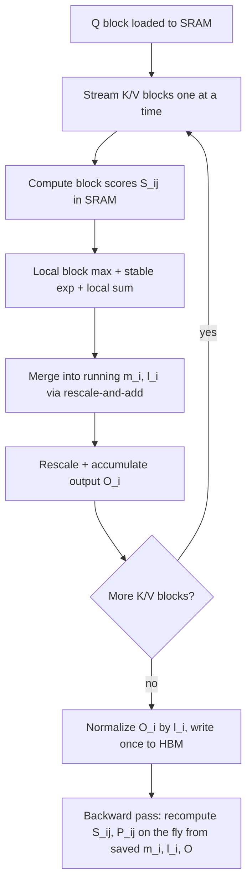
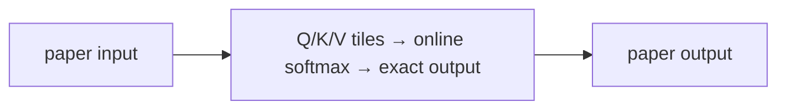
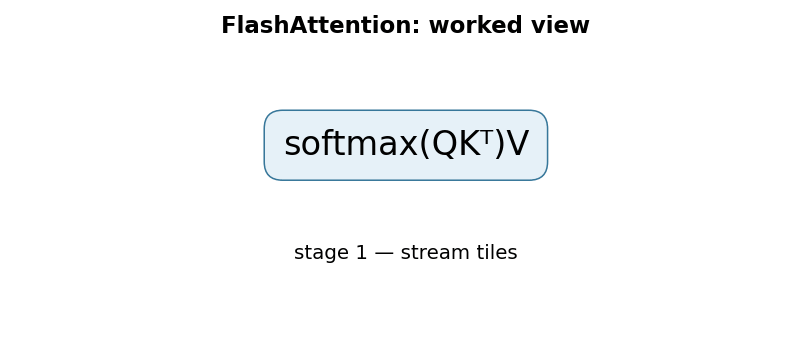

# FlashAttention: Fast and Memory-Efficient Exact Attention with IO-Awareness

Dao, Fu, Ermon, Rudra, Ré, 2022 — [arXiv:2205.14135](https://arxiv.org/abs/2205.14135)

## TL;DR

FlashAttention makes exact softmax attention fast and memory-efficient by rethinking *where* the computation happens relative to a GPU's memory hierarchy, not *what* it computes. Standard attention implementations materialize the full N×N score matrix in slow, high-bandwidth GPU memory (HBM) and then read it back repeatedly; FlashAttention instead tiles queries, keys, and values into blocks that fit in the GPU's much faster on-chip SRAM, and uses an "online softmax" trick to compute the correct row-wise softmax incrementally, block by block, without ever holding the full matrix at once. The backward pass recomputes the needed attention blocks on the fly from small saved statistics instead of storing the N×N matrix, trading extra floating-point operations for far fewer memory transfers. The result is exactly the same attention output as the standard formula (up to ordinary floating-point summation-order effects), with reported wall-clock speedups such as 15% on BERT-large at sequence length 512, 3× on GPT-2 at sequence length 1K, and 2.4× on the Long-Range Arena benchmark, plus enabling longer context windows because memory now scales linearly, not quadratically, in sequence length. This is the first paper in this collection to make its central contribution at the hardware/IO level rather than the modeling level.

## Fun Map for First Years 🧭

FlashAttention solves an organizer problem: do attention in small tiles so the GPU does not keep carrying one enormous sheet of numbers back and forth.

`🧩 small tiles → 🚀 fast GPU memory → 👀 exact attention → ⏱️ cheaper long context`

The result does not approximate attention or skip information. It is the same answer as ordinary attention, but the computer visits data in an order that fits GPU memory better.

A long prompt can create millions of query-key scores. FlashAttention processes one tile, keeps only the needed running summaries, then continues to the next tile without storing every score.

💻 **CS analogy:** FlashAttention is cache-aware blocked matrix multiplication, except it also maintains a streaming softmax result.

## Math Playground 🧮

The essential equation or rule is:

```text
softmax(QKᵀ / √d) V
```

**Essential equation:** softmax(QKᵀ/√d)V. FlashAttention produces this exact same attention result as the original Transformer. Its trick is to keep a running maximum, running total, and running weighted sum while reading small blocks of the score table. Like adding a long column a page at a time, it avoids needing the whole enormous table in memory.

Q, K, and V have the same roles as normal attention: ask, match, and carry information. The innovation is calculating the formula safely piece by piece.

The running maximum is needed because softmax uses exponentials, which can overflow for large scores. Rescaling each tile against that maximum keeps the final percentages mathematically exact and numerically safe.

## Background: What Came Before 🕰️

Standard attention was mathematically simple but materialized a huge score matrix, so memory traffic—not only arithmetic—became the bottleneck for long sequences. Faster hardware did not solve wasteful reads and writes by itself. FlashAttention was needed to preserve exact attention while reorganizing the computation around fast on-chip tiles.

This was needed because standard attention’s giant intermediate table became the bottleneck for long inputs, even when the arithmetic itself was manageable.

This enabled much longer contexts on the same hardware by attacking memory traffic, a constraint that often mattered more than raw FLOP count.

## Why It Matters

Every paper covered so far in this collection changes what a model computes: a new architecture (Attention Is All You Need), a new pretraining objective (BERT), a new adaptation method (LoRA), a new training-time procedure (InstructGPT/RLHF), or a new way to allocate a fixed compute budget (Chinchilla). FlashAttention changes none of that. The attention formula — scaled dot-product queries against keys, softmax, weighted sum of values — is exactly the same before and after. What changes is the *implementation strategy*: how the computation is scheduled against a GPU's memory hierarchy so that the same mathematical function runs faster and in less memory.

This distinction matters because, by 2022, self-attention's quadratic time and memory cost in sequence length N had become a widely felt bottleneck, and the field's dominant response had been architectural: replace exact softmax attention with something structurally cheaper. Sparse attention patterns (fixed or learned sparsity masks so each token attends to only a subset of others), low-rank approximations (Linformer projects the sequence dimension down before attention), and kernel-based linear attention (Performer approximates the softmax kernel to get linear-time attention) all reduce the O(N²) term, but at a cost: they compute something other than exact softmax attention, so they can change model quality in ways that are hard to predict in advance, and many of them do not actually deliver wall-clock speedups in practice because they are not designed around how GPUs actually move data.

FlashAttention's authors made an observation that reframed the problem: on modern GPU accelerators (their reference hardware is an A100), compute throughput has grown much faster than memory bandwidth, so many workloads, including attention, are *memory-bound* rather than *compute-bound* — the bottleneck is not how many floating-point operations you perform, but how many bytes you move between the large, slow off-chip HBM and the tiny, fast on-chip SRAM. Standard attention implementations were leaving a large amount of GPU compute idle while shuttling the N×N score matrix back and forth to HBM multiple times (to compute it, to apply softmax, to apply dropout, to multiply by V). If the real bottleneck is IO, the right fix is an IO-aware algorithm — not a smaller amount of arithmetic, but a smaller amount of data movement, while keeping the *exact* same math.

This reframing had two immediate, practical consequences that the paper demonstrates directly. First, it displaced approximate/sparse attention as the default answer to "attention is too slow for long sequences": if you can make *exact* attention fast enough by being IO-aware, you no longer need to accept the approximation error, tuning burden, and quality risk of a sparse or low-rank alternative for most practical sequence lengths, and the paper shows FlashAttention outperforming these approximate methods in wall-clock terms on the Long-Range Arena suite. Second, because FlashAttention's memory footprint scales linearly rather than quadratically in sequence length, it directly unlocked training and inference at much longer context lengths on the same hardware — the paper reports enabling higher-quality models on long-sequence tasks such as Path-X and Path-256 that were previously effectively out of reach for standard Transformers on the same hardware budget. In the years since, IO-aware exact attention (this paper and its FlashAttention-2 successor) became the default attention implementation across most major training and inference stacks, largely closing off the sparse/approximate-attention research direction as the primary path to fast long-context Transformers, at least for the regimes these kernels cover well.

## Core Intuition

Think of a chef working with two storage areas: a giant walk-in freezer in the basement that holds everything but takes a long, slow trip to reach, and a small countertop mini-fridge next to the stove that holds only a few items but is instantly accessible. A wasteful kitchen workflow is to keep running down to the basement freezer for every single ingredient, over and over, even when the total amount of "thinking time" (actual chopping and cooking) needed is small — most of the time is spent walking back and forth. A well-organized kitchen instead plans ahead: it carries a small batch of ingredients up to the countertop fridge, does everything possible with that batch, and only then goes back down for the next batch. The total amount of chopping is the same either way; the difference is entirely in how many trips to the basement are needed.

In a GPU, HBM (high-bandwidth memory) is the basement freezer — large (tens of gigabytes) but comparatively slow to access — and on-chip SRAM is the countertop fridge — tiny (on the order of a couple hundred kilobytes per streaming multiprocessor) but roughly an order of magnitude faster to read and write. Standard attention's implementation is the wasteful kitchen: it computes the full N×N matrix of attention scores in HBM, writes it out, reads it back to apply softmax, writes the result out, reads it back again to apply dropout, and reads it back once more to multiply by V. Every one of those trips costs time, and for long sequences the N×N matrix itself does not even fit in HBM comfortably, let alone SRAM.



The obstacle to just "doing everything in the small fridge" is that softmax is normally computed as a whole-row operation: to know how much weight to give each key's score, you need to know the sum of exponentiated scores across the *entire* row, which means you would seem to need the whole row of scores in memory before you can produce any normalized output. FlashAttention's key algorithmic insight — "online softmax" — is that this whole-row requirement is not actually necessary: you can process the row's keys in small chunks, keep a running estimate of the row's maximum score and the row's normalizing sum so far, and mathematically correct that running estimate every time a new chunk reveals a bigger score, ending up with the exact same final answer as if you had seen the whole row from the start. The result is that a fixed-size block of query, key, and value data can live entirely in the fast on-chip SRAM for its whole computation, need only a handful of numbers (a running max and running sum per row) carried over from the previous block, and the large N×N matrix is never written to HBM at all — it exists only fleetingly, block by block, in SRAM.

## The Mechanism

**The standard-attention IO bottleneck.** Given queries Q, keys K, and values V, each of shape (N, d), standard attention computes S = QKᵀ/√d (an N×N matrix), P = softmax(S) row-wise, and O = PV. A naive GPU implementation materializes S and P as explicit N×N tensors in HBM: it writes S after the first matmul, reads it back to compute the row-wise softmax, writes P, reads P back again for the final matmul with V (and, if dropout is used, reads/writes an N×N mask too). The paper's Theorem 2 quantifies this: standard attention performs Θ(Nd + N²) HBM accesses, while FlashAttention performs Θ(N²d²M⁻¹) HBM accesses, where M is the SRAM size. Because typical head dimensions d are 64–128 and typical SRAM sizes M are on the order of 100KB, d² is many times smaller than M, so FlashAttention needs far fewer HBM accesses — the paper reports up to 9× fewer in the regimes it measures. A companion result (Proposition 3) shows this Θ(N²d²M⁻¹) count is asymptotically optimal: no algorithm can compute exact attention with asymptotically fewer HBM accesses for all SRAM sizes M in the relevant range [d, Nd]. This is why the paper's contribution is described as IO-*aware*, not merely "a faster kernel" — it is argued to be close to the best any exact-attention algorithm can do under this memory-access cost model.

**Tiling over SRAM-sized blocks.** FlashAttention picks block sizes for the key/value dimension (Bc) and the query dimension (Br) so that a block's worth of Q, K, V, and intermediate scores all fit in on-chip SRAM simultaneously: Bc = ⌈M/(4d)⌉ and Br = min(⌈M/(4d)⌉, d). The outer loop is over blocks of queries; for each query block, the algorithm streams over all key/value blocks, and everything needed to process one (query block, key/value block) pair — loading Q/K/V, computing the block's scores, exponentiating, and multiplying by V — happens entirely in fast SRAM before results are ever committed back to HBM.

**Online softmax: the running-max correction.** For each query block, the algorithm keeps three running quantities as it streams over key/value blocks j = 1, 2, …: the running row max mᵢ, the running normalizer ℓᵢ, and the running (unnormalized) output accumulator Oᵢ. For a new block j with local scores Sᵢⱼ, it computes the block's own local max m̃ᵢⱼ = rowmax(Sᵢⱼ), the numerically-stable exponentials P̃ᵢⱼ = exp(Sᵢⱼ − m̃ᵢⱼ), and the block's local sum ℓ̃ᵢⱼ = rowsum(P̃ᵢⱼ). It then updates the running max mᵢⁿᵉʷ = max(mᵢ, m̃ᵢⱼ), and — this is the step that makes the incremental computation exact rather than merely approximate — rescales everything accumulated so far by exp(mᵢ − mᵢⁿᵉʷ) before adding the new block's (correspondingly rescaled) contribution: ℓᵢⁿᵉʷ = exp(mᵢ − mᵢⁿᵉʷ)·ℓᵢ + exp(m̃ᵢⱼ − mᵢⁿᵉʷ)·ℓ̃ᵢⱼ, and similarly for the output accumulator Oᵢ. This rescale-and-merge step is necessary, not just a numerical-stability nicety: each block's exponentials are computed relative to *that block's own* local max for stability, so before two blocks' partial sums can be validly added together they must first be re-expressed relative to one shared reference max. Skipping that correction — summing each block's locally-normalized contribution directly — does not produce a numerically unstable answer, it produces a *mathematically wrong* one, because the terms are on inconsistent scales. The GIF below simulates exactly this for one query row streamed over six key/value blocks: the left panel shows the running max jumping upward as a later, higher-scoring block arrives, and the right panel plots the correctly rescaled running normalizer against a naive "sum each block's own local softmax total" alternative — the naive curve drifts far above the true exact normalizer (computed with the true global row max), because it never shrinks earlier blocks' contributions down to account for the larger max discovered later.



**Backward pass: recomputation instead of storage.** The gradient of the attention output with respect to Q, K, V requires the same N×N attention-probability matrix P used in the forward pass. The standard way to avoid storing an N×N intermediate for backpropagation is gradient checkpointing — but ordinary checkpointing recomputes the *forward* activations from scratch during the backward pass, trading speed for memory. FlashAttention takes a different trade: it stores only the small per-row statistics from the forward pass (the final mᵢ and ℓᵢ, of size N each, plus the output O of size N×d, and the dropout PRNG state if used) rather than the full N×N matrix P, and during the backward pass it recomputes the needed attention-score blocks on the fly, in SRAM, from Q, K, V, and those saved statistics. This costs more floating-point operations than saving P outright would — but because those extra FLOPs happen on-chip in SRAM, while the memory reads/writes that would otherwise be required to store and reload the full N×N matrix in HBM are eliminated, the paper reports that recomputation nets a *faster* backward pass overall, not merely a smaller memory footprint, in the memory-bound regime attention runs in.



**Measured results.** On an A100 GPU (192KB SRAM per streaming multiprocessor, ~19TB/s SRAM bandwidth vs. 1.5–2.0TB/s HBM bandwidth), a concrete GPT-2 medium configuration (sequence length 1024, head dimension 64, 16 heads, batch size 64) reduces measured HBM read/write traffic from 40.3GB to 4.4GB and end-to-end attention runtime from 41.7ms to 7.3ms. At the model-training level, the paper reports 15% end-to-end wall-clock speedup training BERT-large at sequence length 512 (an MLPerf 1.1 comparison), 3× speedup training GPT-2 at sequence length 1K over a well-tuned HuggingFace/Megatron-LM baseline, and up to 2.4× speedup on Long-Range Arena. Separately, training GPT-2 with FlashAttention's longer-context headroom for the same wall-clock budget yields 0.7 better perplexity than the baseline, plus a 6.4-point accuracy lift on a long-document classification task from using longer sequences that were previously too expensive to train on. Because standard attention's memory scales quadratically in N, FlashAttention's linear memory scaling (the paper reports up to 20× better memory efficiency than exact baselines at long sequence lengths) directly enabled experiments at sequence lengths that were previously impractical: the paper reports 61.4% accuracy on the Path-X challenge (sequence length 16K) with FlashAttention, and 63.1% on the harder Path-256 challenge (sequence length 64K) using block-sparse FlashAttention, tasks where standard Transformers had not previously done better than chance. That block-sparse variant, which combines the same IO-aware tiling with a sparsity mask, is reported as 2–4× faster than dense FlashAttention and scales to sequence lengths of 64K, and the paper reports it is faster than every approximate attention method it compares against, across all tested sequence lengths on Long-Range Arena.

### Mechanism in Code

At implementation level, the mechanism operates on query, key, and value tiles. A faithful
forward pass should follow this order: load a tile, update running max/sum, accumulate normalized values, and evict the tile. Keep the intermediate
representation available while debugging; collapsing everything into one
opaque framework call makes shape and numerical errors much harder to isolate.

The key production failure to guard against is losing numerical precision in the running rescaling step. Add a tiny
reference test with hand-checkable values, then add a property test that
covers padding, empty/short inputs, boundary probabilities, and the largest
supported shape. Compare intermediate tensors with tolerances appropriate to
the dtype, and log the paper-specific statistic during a canary rollout.


## Practical Engineering Notes

### Worked Math & Dataflow

The compact view below makes the paper's central calculation concrete:

```text
softmax(QKᵀ)V
```

In practice, the calculation is a pipeline: Attention is mathematically unchanged; the implementation avoids materializing the full score matrix in high-bandwidth memory. Tiles are accumulated with an online softmax correction. The important engineering
choice is to preserve the paper's intended invariant while making the operation
fit the available memory, batch size, and evaluation protocol.






You will very rarely write a FlashAttention kernel yourself today — it is available as a well-maintained building block in essentially every major deep learning stack. In PyTorch, `torch.nn.functional.scaled_dot_product_attention` will automatically dispatch to a fused, IO-aware attention kernel (a flash-attention-style backend) when the input shapes, dtype, and hardware support it, falling back to a memory-efficient or standard math kernel otherwise; passing `is_causal=True` avoids needing to materialize an explicit causal mask. The `flash-attn` PyPI package (maintained by the original authors' group) provides the reference CUDA implementation directly, including FlashAttention-2's further-optimized kernel, and is what many training frameworks (HuggingFace `transformers`' `attn_implementation="flash_attention_2"`, vLLM, and others) call under the hood on supported NVIDIA GPUs. xFormers' `memory_efficient_attention` predates and, in places, informed FlashAttention; both target the same underlying problem (avoiding an explicit N×N materialization), but FlashAttention's specific contribution is the IO-complexity analysis and the online-softmax/tiling scheme tuned against a concrete SRAM/HBM cost model, and it has generally displaced xFormers' original kernel as the default fast-attention backend where both are available.

There are real constraints to know before assuming "just enable flash attention" always helps. Kernel support is typically restricted to specific head dimensions (historically ≤128, though this has expanded across FlashAttention-2/3), specific dtypes (fp16/bf16 more reliably than fp32), and specific GPU architectures (Ampere and newer for many kernel versions); on unsupported configurations you silently fall back to a slower path unless you check which backend actually ran. The speedup is largest for longer sequences and memory-bound configurations — for very short sequences or already compute-bound workloads the relative win shrinks, since there is less redundant HBM traffic to eliminate in the first place. Because backward-pass recomputation trades FLOPs for memory bandwidth, a GPU with unusually low compute headroom relative to its memory bandwidth (an unusual ratio for current-generation accelerators, but worth checking) could see the trade-off favor a different implementation. Dropout inside attention requires care: FlashAttention regenerates the dropout mask from a saved PRNG state during the backward pass rather than storing the mask, so custom attention variants that need bespoke masking behavior should not assume they can freely swap in a fused kernel without checking semantic equivalence. Finally, remember that FlashAttention computes *exact* attention — if you are debugging a quality regression, the fused kernel is very unlikely to be the cause (output should match standard attention up to floating-point tolerance), which is a useful elimination step versus debugging a genuinely approximate attention variant.

## Runnable Code Example

### Run it

The implementation is intentionally small and self-checking. From the repository root, use Python 3; the module docstring states the learning goal, comments identify the paper-specific calculation, and assertions verify the toy invariant.

```bash
python3 papers/07-flashattention/code/flash_attention_demo.py
```

### Read it in order

Start with the module docstring, then follow the named helper calculations and the final assertions. The example is a dependency-light teaching implementation, not a production training system; change one input at a time and rerun it to see which invariant changes.


[`code/flash_attention_demo.py`](code/flash_attention_demo.py) implements the numerical core of Algorithm 1 in plain, CPU-only PyTorch: a `flash_attention` function that tiles queries and keys/values into blocks, maintains the running max `m_i`, running normalizer `l_i`, and running output accumulator across blocks with the rescale-and-merge update described above, and a `standard_attention` reference that materializes the full score matrix directly. It runs both on the same small random Q/K/V example (N=37, d=16, deliberately not multiples of the block sizes 8 and 5, to stress boundary handling) and asserts `torch.allclose(reference, tiled, atol=1e-5)`. This does not implement the paper's actual CUDA kernel, SRAM sizing, or fused backward pass — there is no speed or memory benefit to be measured here, since everything still runs as ordinary PyTorch ops on CPU — the only claim being demonstrated is that the tiled, block-streaming algorithm is mathematically exact.

Run it from this directory with:

```bash
python3 code/flash_attention_demo.py
```

Expected output reports a maximum absolute difference on the order of 1e-7 between the two implementations, followed by a confirmation that the assertion passed.

## Common Misconceptions & Pitfalls

**"FlashAttention is an approximation, like Performer or Linformer."** It is not. FlashAttention computes exactly the same softmax attention function as the standard formula; the paper explicitly positions this as its advantage over the sparse/low-rank/kernel approximate-attention line of work. Any numerical difference from a standard implementation should be limited to ordinary floating-point summation-order effects, not a systematic approximation error.

**"FlashAttention is a new attention mechanism or architecture."** It changes the memory-access pattern of computing attention, not the mathematical operation. A model using FlashAttention as its attention kernel has the identical set of learned weights and identical forward-pass mathematics as one using standard attention; you cannot tell from the model's outputs alone which kernel was used to compute them (up to floating-point tolerance).

**"Recomputing values in the backward pass instead of storing them must be slower."** This is true under a compute-bound cost model but false under the memory-bound regime attention actually runs in on modern GPUs: the extra floating-point operations from recomputation are cheap relative to the HBM traffic saved by not storing and reloading the N×N matrix, so the paper reports recomputation making the backward pass *faster* overall, not just more memory-efficient.

**"Bigger block sizes are always better since SRAM can be underused."** Block sizes are chosen to make one block's worth of data fit in the fixed, small SRAM budget available per streaming multiprocessor; oversized blocks that spill out of SRAM lose the entire benefit of the tiling scheme and fall back to relying on HBM traffic within a supposedly "on-chip" step.

**"Enabling a fused/flash attention backend is a free, universal speedup."** It depends on head dimension, dtype, GPU generation, and sequence length being in the kernel's supported and favorable regime; unsupported configurations silently fall back to a slower kernel, and very short sequences may see little benefit since the eliminated HBM traffic is proportionally smaller relative to fixed overheads.

## Quick Concept Checks

**Q:** What specific problem does FlashAttention solve that sparse/approximate attention methods also try to solve, and how is its approach fundamentally different?
**A:** Both address self-attention's quadratic time/memory cost in sequence length. Sparse and approximate methods (Reformer, Linformer, Performer, etc.) reduce cost by computing something other than exact softmax attention. FlashAttention instead keeps the exact math unchanged and reduces cost by minimizing data movement between GPU HBM and on-chip SRAM — it is an implementation-level, IO-aware algorithm, not a modeling-level approximation.

**Q:** Why is attention considered "memory-bound" rather than "compute-bound" on modern GPUs, and why does that matter for the fix?
**A:** GPU compute throughput has grown much faster than memory bandwidth, so for many operations — including standard attention's repeated writes/reads of the N×N score matrix to and from HBM — the bottleneck is bytes moved, not floating-point operations performed. If the bottleneck is IO, an algorithm that reduces FLOPs but not memory traffic will not help much; an algorithm that reduces memory traffic, even at some FLOP cost, can be substantially faster.

**Q:** What is "online softmax" and why is a running-max correction necessary rather than just a numerical convenience?
**A:** It is a way to compute a row-wise softmax incrementally over blocks of the row rather than needing the whole row in memory at once, by tracking a running max and running normalizer and updating them as each new block arrives. The correction (rescaling the running normalizer and output by exp(m_old − m_new) whenever the running max increases) is required for correctness: each block's exponentials are computed relative to that block's own local max, so two blocks' partial sums are on different scales until they are re-expressed relative to one shared max — omitting the rescale produces a wrong total, not merely a numerically unstable one.

**Q:** State FlashAttention's IO-complexity result and explain, at a high level, why the specific value of the head dimension d matters for how much benefit it provides.
**A:** Standard attention requires Θ(Nd + N²) HBM accesses; FlashAttention requires Θ(N²d²/M) HBM accesses, where M is the SRAM size. Since d² for typical head dimensions (64–128) is many times smaller than a typical SRAM size (~100KB), the FlashAttention term is correspondingly much smaller, giving up to an order of magnitude fewer HBM accesses in the regimes the paper measures; a much larger d would shrink that advantage.

**Q:** Why does FlashAttention recompute attention-score blocks during the backward pass instead of either storing the full attention matrix or using ordinary gradient checkpointing?
**A:** Storing the full N×N attention-probability matrix from the forward pass would reintroduce the same HBM traffic problem the forward pass was designed to avoid. Ordinary gradient checkpointing recomputes forward activations to save memory but is understood to trade away speed. FlashAttention instead stores only small per-row statistics (the running max and normalizer, and the output) and recomputes the needed score blocks on-chip in SRAM; because the eliminated HBM traffic dominates the added FLOPs in this memory-bound setting, the backward pass ends up faster, not just smaller in memory.

**Q:** Is FlashAttention output identical to standard attention's output? What would tell you the fused kernel was in use versus a debugging bug?
**A:** Yes, up to ordinary floating-point tolerance from a different order of summation — it computes exactly the same softmax attention function. If a model's outputs differ meaningfully from a standard-attention baseline, a correctly implemented FlashAttention kernel is very unlikely to be the cause; that is a useful elimination step when debugging quality regressions, since a genuinely approximate attention method would not offer the same guarantee.

**Q:** If you enable a fused/flash attention backend and see no speedup, what are some likely reasons?
**A:** The configuration may be outside the kernel's supported regime (unsupported head dimension, dtype, or GPU generation), causing a silent fallback to a slower path; the workload may already be compute-bound or use very short sequences, where there is proportionally less HBM traffic to eliminate; or the framework may not actually be dispatching to the fused kernel even though it was requested, which is worth confirming directly rather than assuming.

## Worked Memory-Traffic View

Ordinary attention first materializes a large score matrix, then reads it
again for softmax and another time for the weighted values. FlashAttention
chooses a tile of queries and keys that fits in fast on-chip memory, updates
the softmax normalization online, and writes only the final output. The answer
is mathematically exact because each tile carries forward a running maximum
and running denominator; it is not an approximation that drops attention
entries.

When profiling, separate arithmetic from memory movement. A kernel can have
few floating-point operations yet run slowly if it repeatedly moves a
sequence-square matrix through high-bandwidth memory. Check causal masking,
dropout, head dimension, dtype, and sequence lengths against the supported
kernel path. A correct fallback is preferable to silently choosing a fast
kernel with incompatible masking semantics.

## Interview Q&A

**Q:** Walk through **IO-aware tiled exact attention** end to end. How would you implement `softmax(QKᵀ)V`?
**A:** Decompose the expression into the actual data path: inputs enter the paper-specific transformation, intermediate scores or states are computed, invalid elements are excluded, and the result is reduced into the output or loss. For this paper, `softmax(QKᵀ)V` is an executable contract, not decoration: document tensor shapes, ownership of mutable state, numerical precision, and where batching changes semantics. Keep a small reference implementation beside the optimized path so a reviewer can connect each line of `code` to one term in the equation.

**Follow-up:** What invariant would you assert, and why is it stronger than checking final accuracy?
**A:** Assert that **online softmax statistics produce the same result as a numerically stable reference**. That property is local enough to fail near the defect, whereas accuracy can remain acceptable while a mask, reduction, or state boundary is wrong on a rare input. Add a hand-computed fixture, a randomized differential test against the reference, and shape/dtype assertions at the API boundary. The test should also cover an empty, padded, terminal, high-degree, long-context, or otherwise adversarial case when that input is meaningful for this mechanism.

**Q:** What is the main production trade-off in this paper, and how would you capacity-plan it?
**A:** The central trade-off is that **the mechanism changes both quality behavior and resource use**. Capacity planning therefore needs more than average FLOPs: measure peak memory, memory bandwidth, communication, preprocessing, batch-size sensitivity, and p95/p99 latency on representative distributions. Define a quality budget before optimizing, then compare a simple baseline with the paper mechanism using identical inputs and seeds. A faster path that silently changes tokenization, routing, masking, sampling, or optimization behavior is not an acceptable optimization until its quality impact is measured.

**Follow-up:** Which failure mode would make you roll back first?
**A:** Roll back on evidence of **incorrect tile rescaling, causal-boundary handling, or hardware-specific regressions**, especially when the symptom is silent and outputs still look plausible. Add dashboards for the paper-specific statistic, error and timeout rates, resource saturation, and a task metric sliced by difficult inputs. Use a canary or shadow comparison with the previous implementation, retain the old path behind a flag, and make the rollback decision threshold explicit before deployment. The important SDE2 judgment is to protect the paper’s semantic contract, not merely to chase a faster benchmark.

**Q:** A model passes unit tests but fails in production. What is your debugging plan?
**A:** Start with **compare outputs and gradients against a reference over tile boundaries and sequence lengths**. Reproduce the smallest production-shaped example, freeze the model and preprocessing versions, and compare intermediate tensors or records rather than only the final prediction. Check data contracts, masks, sequence boundaries, random seeds, numerical precision, and serving mode in that order; then bisect between the reference and optimized implementations. If the defect is not numerical, run a controlled ablation that removes the paper-specific mechanism and compare the resulting failure rate, which separates integration problems from a bad mechanism or configuration.

**Follow-up:** What evidence would you present in the review or postmortem?
**A:** Present one minimal failing input, the expected **online softmax statistics produce the same result as a numerically stable reference**, the first intermediate value that diverged, and the regression test that now protects it. Include a before/after table for task quality, memory, throughput, p95/p99 latency, and cost, with slices for the failure population. A complete SDE2 answer also states the rollout guard, owner, and alert threshold. That turns a paper idea into an operable system rather than a one-line claim about an equation.

## Further Reading

- [Original paper: FlashAttention: Fast and Memory-Efficient Exact Attention with IO-Awareness](https://arxiv.org/abs/2205.14135)
- [FlashAttention-2: Faster Attention with Better Parallelism and Work Partitioning](https://arxiv.org/abs/2307.08691)
- [PyTorch documentation: torch.nn.functional.scaled_dot_product_attention](https://pytorch.org/docs/stable/generated/torch.nn.functional.scaled_dot_product_attention.html)
- [flash-attention GitHub repository (reference CUDA implementation)](https://github.com/Dao-AILab/flash-attention)
- [xFormers: memory-efficient attention building blocks](https://github.com/facebookresearch/xformers)
