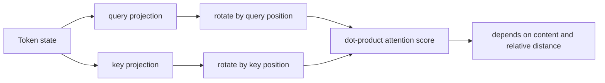
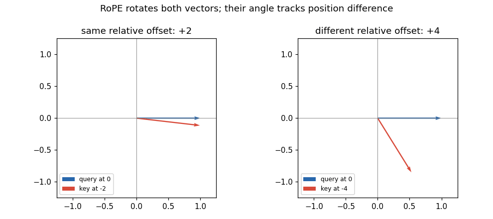

# RoFormer: Enhanced Transformer with Rotary Position Embedding

## TL;DR

Transformers need position information because attention alone can see a bag of tokens. The original Transformer in [paper 01](../01-attention-is-all-you-need/README.md) adds a position vector to each token representation; RoFormer instead rotates each query and key in two-dimensional coordinate pairs. The rotation angle grows with token position, and the query--key dot product consequently depends on their relative displacement. That compact change, now called RoPE, preserves vector length, works at arbitrary sequence lengths in the formula, and became a common positional mechanism in open-weight decoder LLMs.

## Why It Matters

Attention computes a compatibility score between a query at one token and keys at other tokens. Without a position signal, swapping two identical word embeddings changes nothing: a model cannot tell whether an adjective came before or after a noun. The 2017 Transformer solved this by adding fixed sine/cosine vectors to token embeddings before the projections. Addition is simple and effective, but the attention score then mixes content-position, position-content, and position-position terms. A relative offset is not isolated by construction.

RoFormer (Su et al., submitted 2021 and revised 2023) asked for a representation that injects absolute position while making the attention comparison explicitly sensitive to *relative* position. Its answer is not a learned lookup table or an extra relative-position bias. It is a rotation applied after query/key projection. The paper evaluates RoFormer on long-text classification and reports that its rotary method consistently beats the positional alternatives considered there; its abstract also highlights compatibility with linear attention and a decaying-dependency property.

This matters because a positional scheme sits on a very hot path. It is applied for every layer, head, token, and query/key pair. A method that is algebraically clean, preserves norms, and needs no table of learned vectors is attractive to model builders. Later decoder architectures such as LLaMA, GPT-NeoX, and Mistral use RoPE-family implementations. That is later practice, not evidence that the original RoFormer paper invented their context-extension recipes. The historical point is narrower and more useful: RoPE changed how positional information enters attention scores.

## Core Intuition

Imagine two people carrying compass needles while walking along a trail. At every trail marker, each person turns their needle by a prescribed amount. Looking at one needle alone tells you an absolute location; comparing the two needle directions tells you how far apart their markers are. If both people walk forward five markers, both needles rotate another five turns and their angle *between each other* stays the same.

RoPE does this with tiny compass planes inside a query and key vector. It pairs coordinates, such as dimensions 0 and 1, and rotates that pair. Different pairs rotate at different speeds, so a whole vector carries a multi-scale positional signature. A nearby displacement is visible to fast and slow pairs; a large displacement is distinguished by the slower pairs. Content still determines the initial direction of each pair, so position is not replacing meaning.



The important contrast with a clock is that RoPE is not trying to make every token point in one shared direction. It makes query and key directions rotate together according to their own positions. That shared motion is exactly what cancels absolute position in their dot product. The model can still learn that “previous token” and “twenty tokens ago” are different relations, but it does not have to rediscover the arithmetic of subtracting two absolute embedding vectors.

## The Mechanism

Let a head have even dimension \(d\). For pair \(i\), RoPE uses angular frequency \(\theta_i = 10000^{-2i/d}\), matching the frequency schedule familiar from sinusoidal encodings. At position \(m\), it rotates coordinates \((x_{2i},x_{2i+1})\) by \(m\theta_i\):

\[
R_{m,i}\begin{bmatrix}x_{2i}\\x_{2i+1}\end{bmatrix}=
\begin{bmatrix}\cos(m\theta_i)&-\sin(m\theta_i)\\ \sin(m\theta_i)&\cos(m\theta_i)\end{bmatrix}\begin{bmatrix}x_{2i}\\x_{2i+1}\end{bmatrix}.
\]

Implementations commonly express the same operation with `rotate_half`: split even/odd or first/second halves according to a chosen layout, multiply by precomputed cosine values, and add the rotated half times sine values. The layout is an implementation convention; query and key must use the same convention. RoFormer applies the operation to projected queries and keys, not to values: position changes which values are selected, while values remain the information being mixed.



The central identity is \(R_m^T R_n = R_{n-m}\). Thus a score is
\[
(R_m q)^T(R_n k)=q^T R_m^T R_n k=q^T R_{n-m}k.
\]
It depends on the difference \(n-m\), alongside the content vectors \(q,k\), rather than separately on both absolute positions. A useful sign check: changing the convention for “query position minus key position” changes the sign in the rotation but not the fact that only the relative offset remains. The code example tests equal offsets at several absolute locations.

Rotation matrices are orthogonal, so \(\lVert R_m x\rVert=\lVert x\rVert\). RoPE therefore does not arbitrarily amplify a query or key merely because it occurs later. It changes direction. That norm preservation is especially helpful because scaled dot-product attention is sensitive to score magnitude; positional information becomes a controlled phase relationship rather than an unbounded additive magnitude.

```mermaid
flowchart TD
  X[hidden state x at position m] --> WQ[Wq x]
  X --> WK[Wk x]
  WQ --> Q[RoPE: R_m q]
  WK --> K[RoPE: R_n k]
  Q --> DOT[score = q^T R_(n-m) k]
  K --> DOT
  DOT --> SOFTMAX[softmax over keys]
  SOFTMAX --> MIX[weighted values]
```

The paper additionally analyses decay behavior under a distributional assumption on the query/key components: averaged dependencies can decline with distance. That is not a hard rule that every trained head must attend less to distant tokens. A head can learn long-range patterns, and finite-dimensional sinusoidal phases eventually repeat. The more defensible statement is that RoPE provides relative phase features at multiple scales, not a guarantee of perfect extrapolation beyond every training length.

For multi-head attention, each head repeats the operation at its own head dimension. Cache-aware autoregressive inference stores already-rotated keys (or equivalently applies the known position exactly once before caching); the new query is rotated at its new position and attends to those cached keys. Positions must remain aligned with the cache after padding, packed examples, sliding windows, or speculative decoding. That bookkeeping is mundane, but an off-by-one position ID silently changes every attention score.

There are two useful ways to view the coordinate pairing. The real-valued implementation uses a two-by-two matrix for every pair. The equivalent complex-number view treats a pair as \(z=x_{2i}+\mathrm{i}x_{2i+1}\) and multiplies it by \(e^{\mathrm{i}m\theta_i}\). Multiplication by a unit complex number is a rotation, and multiplying one factor by the conjugate of another exposes the difference in their phases. The real matrix form is usually easier to code; the complex form makes the cancellation intuition compact. Neither view adds trainable positional parameters.

The frequency schedule is deliberately uneven. High-frequency pairs change phase rapidly and can distinguish short offsets, whereas low-frequency pairs change gradually and remain informative over longer distances. This is analogous to representing a signal with several wavelengths rather than one clock hand. It also means that no single coordinate should be interpreted as “the position.” Attention sees the combined contribution of all pairs after learned projections shape their content directions. The base `10000` is part of the original formulation’s schedule, but modern checkpoints may choose a different `rope_theta`; use the published checkpoint configuration when reproducing a model.

The relative identity is about an unmasked pair of positions. Causal attention still blocks future keys, padding masks still remove padding tokens, and cross-attention can use a different positional arrangement. In a decoder, a query at position \(m\) normally compares only keys at positions no greater than \(m\), so the available offsets are constrained by the causal mask. RoPE changes the values of permitted logits; it does not replace masking. Confusing those responsibilities leads to a particularly nasty class of bugs: a model may have correctly rotated Q/K and still leak future tokens through an incorrect attention mask.

Finally, the phrase “relative position” should not obscure the retained absolute information. Rotation is selected from the absolute index \(m\), and the score obtains a relative dependence only because both endpoints are transformed in a coordinated way. This permits efficient cached decoding: old keys do not need to be revisited when a new token arrives. The new query’s rotation already carries its index, and every cached key carries its own. Their dot product supplies the difference with no separate per-distance lookup at inference.

This is a small mathematical intervention with a large systems consequence: position becomes part of attention’s comparison operation, where sequence order is actually used.

## Practical Engineering Notes

In Hugging Face `transformers`, architecture-specific modules such as LLaMA and GPT-NeoX rotary embeddings generate cosine/sine caches and apply them to Q/K. Prefer the model’s supplied position-ID and cache APIs over copying a blog’s tensor reshaping: head layout, grouped-query attention, padding convention, and cache position have to agree. The operation is elementwise and cheap compared with matrix multiplication, but cached cos/sin tables and broadcasting can still create accidental allocations at long context lengths.

RoPE itself does not promise that a model trained at one maximum length will work unchanged at a much larger one. Position interpolation and NTK-aware/RoPE scaling are later context-extension techniques; they alter the mapping from token index to angle. Treat their scale factor, base, and training assumptions as checkpoint-specific configuration, not a harmless inference toggle. A wrong setting can preserve tensor shapes while degrading retrieval or generation quality.

For kernels, fuse rotation into Q/K preparation when possible, but keep a clear reference path for testing. Test at positions near zero, around a cache boundary, and with nonzero offsets; merely testing position zero misses the entire feature. In reduced precision, compute or cache angles with the precision recommended by the model implementation, then cast as appropriate. Very large angles and long context magnify numerical and configuration mistakes.

The design also has a product implication: a relative relationship is available inside the score without adding a position-bias lookup. That helps a model generalize patterns such as locality, but it does not supply document structure, timestamps, or segment semantics. Those may still require tokenization choices, special tokens, attention masks, or other features. RoPE is a positional coordinate system, not a complete long-context strategy.

## Runnable Code Example

[`code/rope_relative_position.py`](code/rope_relative_position.py) implements the pairwise rotation in plain PyTorch. It creates fixed query/key vectors, scores three position pairs with the same offset, and asserts the scores agree to `1e-6`. It also checks that a different offset changes the score for this seeded example and that rotations preserve the query norm. Run it with:

```bash
python3 papers/08-roformer-rope/code/rope_relative_position.py
```

The program is deliberately a single-head vector calculation, not a language model. Its invariant is stronger and easier to inspect than a generated-text demo: moving both endpoints together does not change the RoPE dot product when their separation is held fixed.

## Common Misconceptions & Pitfalls

- **“RoPE adds a relative-position embedding.”** No vector is added here. Absolute position selects a rotation, and relative position emerges when rotated Q and K are compared.
- **“Any two pairs with the same offset always have the same score.”** They do only when the underlying content vectors are the same. Different tokens produce different Q/K content, as they should.
- **“Rotation makes attention translation invariant.”** The positional factor has the relative-offset identity; masks, content, boundaries, and learned layers can still make a whole network sensitive to absolute context.
- **“RoPE solves arbitrary length extrapolation.”** The formula accepts any integer position, but a trained model may not use very long or rescaled phases well.

## Interview Q&A

**Q:** Why rotate Q and K instead of the token embedding before projection?
**A:** Rotating Q/K makes the relative-position identity apply directly to the dot product that produces attention logits. Pre-projection rotation would interact with learned projections differently.

**Q:** What property keeps RoPE from changing a vector’s magnitude?
**A:** Each two-dimensional block is an orthogonal rotation matrix, whose transpose times itself is the identity.

**Q:** Where does relative position appear algebraically?
**A:** In \(R_m^T R_n=R_{n-m}\), so the two absolute rotations collapse to one rotation indexed by their difference.

**Q:** Does RoPE rotate values too?
**A:** Standard RoPE applies to queries and keys. Values are mixed according to the positionalized scores rather than rotated as part of that mechanism.

**Q:** What is a common production bug?
**A:** Giving cached keys and a new query inconsistent position IDs, especially after padding, a sliding window, or cache compaction.

## Further Reading

- [Original RoFormer paper](https://arxiv.org/abs/2104.09864)
- [Attention Is All You Need](https://arxiv.org/abs/1706.03762)
- [Hugging Face RoFormer documentation](https://huggingface.co/docs/transformers/model_doc/roformer)
- [Position Interpolation for extending context window](https://arxiv.org/abs/2306.15595)
