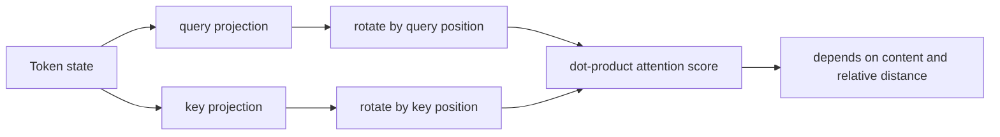
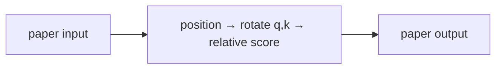
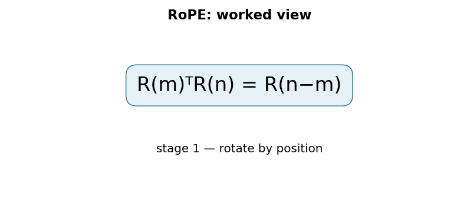

# RoFormer: Enhanced Transformer with Rotary Position Embedding

## 1. TL;DR
Transformers need position information because attention alone can see a bag of tokens. The original Transformer in [paper 01](../01-attention-is-all-you-need/README.md) adds a position vector to each token representation; RoFormer instead rotates each query and key in two-dimensional coordinate pairs. The rotation angle grows with token position, and the query--key dot product consequently depends on their relative displacement. That compact change, now called RoPE, preserves vector length, works at arbitrary sequence lengths in the formula, and became a common positional mechanism in open-weight decoder LLMs.

## 2. Fun Map for First Years
RoPE gives each word a tiny spin based on where it sits. Comparing two spun vectors lets attention notice how far apart words are.

`📍 position → 🌀 rotate vectors → 👀 compare relative distance → 🧠 ordered language`

Imagine every word holds an arrow. RoPE turns the arrow a little more for later positions, so attention can sense both matching content and relative order.

Two identical token embeddings at positions 2 and 20 receive different rotations. When attention compares them with another rotated vector, their angle difference carries the relative distance.

💻 **CS analogy:** RoPE is like encoding an array index as an angle, so subtracting positions becomes a simple relative phase comparison.

### Beginner walkthrough

Read the arrows as a sequence of responsibilities. First identify what enters
the system, then ask what the paper changes, what information is preserved or
discarded, and what leaves the operation. For **rotary position encoding applied to query and key pairs**, the key question
is not “does the model sound clever?” but “which intermediate value carries the
new information, and what would go wrong if it were missing?”

### CS student checkpoint

The map corresponds to a small program: input data enters a function, the
paper-specific state or transformation runs, and an assertion checks **relative offsets, tensor shape, and rotation pairing stay consistent across positions**.
The equation `R(m)ᵀR(n)=R(n−m)` is the compact specification for that function. Trace
one concrete item through each arrow before thinking about larger batches,
parallel hardware, or production optimizations.

## 3. Math Playground
The essential equation or rule is:

```text
(x,y) → (x cos θ − y sin θ, x sin θ + y cos θ)
```

**Essential equation:** (x,y) → (x cos θ − y sin θ, x sin θ + y cos θ). This is the high-school formula for rotating a point around the origin. RoPE gives each word a rotation angle based on its position. A rotation keeps an arrow’s length the same but changes its direction, so comparing two word arrows can reveal how far apart their positions are.

x and y are two coordinates of an arrow, while θ is its turn angle. Sine and cosine describe the horizontal and vertical parts after a turn.

A 90-degree rotation turns (1,0) into (0,1), so the formula is a familiar geometry operation rather than mysterious new arithmetic. RoPE applies many such two-number rotations at different frequencies.

## 4. Background: What Came Before
Transformers need position information because attention alone does not know token order. Absolute position embeddings worked but did not naturally express a relative distance inside an attention score or extrapolate gracefully. RoPE was needed to encode position as a rotation, so the query–key interaction directly reflects relative offset.

RoPE answered the need for position information that naturally appears inside attention comparisons rather than as a separate position label.

This gave later Transformer builders a compact positional mechanism that preserves vector length while changing the attention score in a distance-aware way.

## 5. Why It Matters
Attention computes a compatibility score between a query at one token and keys at other tokens. Without a position signal, swapping two identical word embeddings changes nothing: a model cannot tell whether an adjective came before or after a noun. The 2017 Transformer solved this by adding fixed sine/cosine vectors to token embeddings before the projections. Addition is simple and effective, but the attention score then mixes content-position, position-content, and position-position terms. A relative offset is not isolated by construction.

RoFormer (Su et al., submitted 2021 and revised 2023) asked for a representation that injects absolute position while making the attention comparison explicitly sensitive to *relative* position. Its answer is not a learned lookup table or an extra relative-position bias. It is a rotation applied after query/key projection. The paper evaluates RoFormer on long-text classification and reports that its rotary method consistently beats the positional alternatives considered there; its abstract also highlights compatibility with linear attention and a decaying-dependency property.

This matters because a positional scheme sits on a very hot path. It is applied for every layer, head, token, and query/key pair. A method that is algebraically clean, preserves norms, and needs no table of learned vectors is attractive to model builders. Later decoder architectures such as LLaMA, GPT-NeoX, and Mistral use RoPE-family implementations. That is later practice, not evidence that the original RoFormer paper invented their context-extension recipes. The historical point is narrower and more useful: RoPE changed how positional information enters attention scores.

## 6. Core Intuition
Imagine two people carrying compass needles while walking along a trail. At every trail marker, each person turns their needle by a prescribed amount. Looking at one needle alone tells you an absolute location; comparing the two needle directions tells you how far apart their markers are. If both people walk forward five markers, both needles rotate another five turns and their angle *between each other* stays the same.

RoPE does this with tiny compass planes inside a query and key vector. It pairs coordinates, such as dimensions 0 and 1, and rotates that pair. Different pairs rotate at different speeds, so a whole vector carries a multi-scale positional signature. A nearby displacement is visible to fast and slow pairs; a large displacement is distinguished by the slower pairs. Content still determines the initial direction of each pair, so position is not replacing meaning.



The important contrast with a clock is that RoPE is not trying to make every token point in one shared direction. It makes query and key directions rotate together according to their own positions. That shared motion is exactly what cancels absolute position in their dot product. The model can still learn that “previous token” and “twenty tokens ago” are different relations, but it does not have to rediscover the arithmetic of subtracting two absolute embedding vectors.

## 7. The Mechanism
Let a head have even dimension \(d\). For pair \(i\), RoPE uses angular frequency \(\theta_i = 10000^{-2i/d}\), matching the frequency schedule familiar from sinusoidal encodings. At position \(m\), it rotates coordinates \((x_{2i},x_{2i+1})\) by \(m\theta_i\):

\[
R_{m,i}\begin{bmatrix}x_{2i}\\x_{2i+1}\end{bmatrix}=
\begin{bmatrix}\cos(m\theta_i)&-\sin(m\theta_i)\\ \sin(m\theta_i)&\cos(m\theta_i)\end{bmatrix}\begin{bmatrix}x_{2i}\\x_{2i+1}\end{bmatrix}.
\]

Implementations commonly express the same operation with `rotate_half`: split even/odd or first/second halves according to a chosen layout, multiply by precomputed cosine values, and add the rotated half times sine values. The layout is an implementation convention; query and key must use the same convention. RoFormer applies the operation to projected queries and keys, not to values: position changes which values are selected, while values remain the information being mixed.


The central identity is \(R_m^T R_n = R_{n-m}\). Thus a score is
\[
(R_m q)^T(R_n k)=q^T R_m^T R_n k=q^T R_{n-m}k.
\]
It depends on the difference \(n-m\), alongside the content vectors \(q,k\), rather than separately on both absolute positions. A useful sign check: changing the convention for “query position minus key position” changes the sign in the rotation but not the fact that only the relative offset remains. The code example tests equal offsets at several absolute locations.

Rotation matrices are orthogonal, so \(\lVert R_m x\rVert=\lVert x\rVert\). RoPE therefore does not arbitrarily amplify a query or key merely because it occurs later. It changes direction. That norm preservation is especially helpful because scaled dot-product attention is sensitive to score magnitude; positional information becomes a controlled phase relationship rather than an unbounded additive magnitude.

```mermaid
flowchart TD
  X[hidden state x at position m] --> WQ[Wq x]
  X --> WK[Wk x]
  WQ --> Q[RoPE: R_m q]
  WK --> K[RoPE: R_n k]
  Q --> DOT[score = q^T R_(n-m) k]
  K --> DOT
  DOT --> SOFTMAX[softmax over keys]
  SOFTMAX --> MIX[weighted values]
```

The paper additionally analyses decay behavior under a distributional assumption on the query/key components: averaged dependencies can decline with distance. That is not a hard rule that every trained head must attend less to distant tokens. A head can learn long-range patterns, and finite-dimensional sinusoidal phases eventually repeat. The more defensible statement is that RoPE provides relative phase features at multiple scales, not a guarantee of perfect extrapolation beyond every training length.

For multi-head attention, each head repeats the operation at its own head dimension. Cache-aware autoregressive inference stores already-rotated keys (or equivalently applies the known position exactly once before caching); the new query is rotated at its new position and attends to those cached keys. Positions must remain aligned with the cache after padding, packed examples, sliding windows, or speculative decoding. That bookkeeping is mundane, but an off-by-one position ID silently changes every attention score.

There are two useful ways to view the coordinate pairing. The real-valued implementation uses a two-by-two matrix for every pair. The equivalent complex-number view treats a pair as \(z=x_{2i}+\mathrm{i}x_{2i+1}\) and multiplies it by \(e^{\mathrm{i}m\theta_i}\). Multiplication by a unit complex number is a rotation, and multiplying one factor by the conjugate of another exposes the difference in their phases. The real matrix form is usually easier to code; the complex form makes the cancellation intuition compact. Neither view adds trainable positional parameters.

The frequency schedule is deliberately uneven. High-frequency pairs change phase rapidly and can distinguish short offsets, whereas low-frequency pairs change gradually and remain informative over longer distances. This is analogous to representing a signal with several wavelengths rather than one clock hand. It also means that no single coordinate should be interpreted as “the position.” Attention sees the combined contribution of all pairs after learned projections shape their content directions. The base `10000` is part of the original formulation’s schedule, but modern checkpoints may choose a different `rope_theta`; use the published checkpoint configuration when reproducing a model.

The relative identity is about an unmasked pair of positions. Causal attention still blocks future keys, padding masks still remove padding tokens, and cross-attention can use a different positional arrangement. In a decoder, a query at position \(m\) normally compares only keys at positions no greater than \(m\), so the available offsets are constrained by the causal mask. RoPE changes the values of permitted logits; it does not replace masking. Confusing those responsibilities leads to a particularly nasty class of bugs: a model may have correctly rotated Q/K and still leak future tokens through an incorrect attention mask.

Finally, the phrase “relative position” should not obscure the retained absolute information. Rotation is selected from the absolute index \(m\), and the score obtains a relative dependence only because both endpoints are transformed in a coordinated way. This permits efficient cached decoding: old keys do not need to be revisited when a new token arrives. The new query’s rotation already carries its index, and every cached key carries its own. Their dot product supplies the difference with no separate per-distance lookup at inference.

This is a small mathematical intervention with a large systems consequence: position becomes part of attention’s comparison operation, where sequence order is actually used.

### Mechanism in Code

At implementation level, the mechanism operates on query/key pairs and position indices. A faithful
forward pass should follow this order: pair dimensions, rotate each pair by its position angle, then take attention dot products. Keep the intermediate
representation available while debugging; collapsing everything into one
opaque framework call makes shape and numerical errors much harder to isolate.

The key production failure to guard against is using a different rotation convention or position base for cached tokens. Add a tiny
reference test with hand-checkable values, then add a property test that
covers padding, empty/short inputs, boundary probabilities, and the largest
supported shape. Compare intermediate tensors with tolerances appropriate to
the dtype, and log the paper-specific statistic during a canary rollout.


## 8. Practical Engineering Notes
### Worked Math & Dataflow

The compact view below makes the paper's central calculation concrete:

```text
R(m)ᵀR(n) = R(n−m)
```

In practice, the calculation is a pipeline: Rotating queries and keys by position makes their dot product depend on a relative offset. The rotation angle controls how quickly positional phase changes across dimensions. The important engineering
choice is to preserve the paper's intended invariant while making the operation
fit the available memory, batch size, and evaluation protocol.






In Hugging Face `transformers`, architecture-specific modules such as LLaMA and GPT-NeoX rotary embeddings generate cosine/sine caches and apply them to Q/K. Prefer the model’s supplied position-ID and cache APIs over copying a blog’s tensor reshaping: head layout, grouped-query attention, padding convention, and cache position have to agree. The operation is elementwise and cheap compared with matrix multiplication, but cached cos/sin tables and broadcasting can still create accidental allocations at long context lengths.

RoPE itself does not promise that a model trained at one maximum length will work unchanged at a much larger one. Position interpolation and NTK-aware/RoPE scaling are later context-extension techniques; they alter the mapping from token index to angle. Treat their scale factor, base, and training assumptions as checkpoint-specific configuration, not a harmless inference toggle. A wrong setting can preserve tensor shapes while degrading retrieval or generation quality.

For kernels, fuse rotation into Q/K preparation when possible, but keep a clear reference path for testing. Test at positions near zero, around a cache boundary, and with nonzero offsets; merely testing position zero misses the entire feature. In reduced precision, compute or cache angles with the precision recommended by the model implementation, then cast as appropriate. Very large angles and long context magnify numerical and configuration mistakes.

The design also has a product implication: a relative relationship is available inside the score without adding a position-bias lookup. That helps a model generalize patterns such as locality, but it does not supply document structure, timestamps, or segment semantics. Those may still require tokenization choices, special tokens, attention masks, or other features. RoPE is a positional coordinate system, not a complete long-context strategy.

## 9. Runnable Code Example
### Run from the repository root

Prerequisites: Python 3 and the dependencies imported by [`implementations/08-roformer-rope/code/rope_relative_position.py`](implementations/08-roformer-rope/code/rope_relative_position.py).
The example is intentionally small enough to run on CPU; it is a teaching
implementation, not a production training or serving benchmark.

```bash
python3 implementations/08-roformer-rope/code/rope_relative_position.py
```

### What the example demonstrates

Read the module docstring first, then follow the functions implementing
**rotary position encoding applied to query and key pairs**. The program turns `R(m)ᵀR(n)=R(n−m)` into executable operations,
prints a compact result, and checks that **relative offsets, tensor shape, and rotation pairing stay consistent across positions**. The assertion matters:
it tests the semantic contract near the mechanism instead of treating a
plausible final number as proof that the implementation is correct.

### Expected behavior and useful experiments

The command should finish without a traceback and print a successful summary
or assertion message. You should observe the paper-specific behavior, not a
particular random numeric value. Change one input at a time: inspect the
intermediate tensor or state, rerun with a boundary case, and then compare the
result with the expected invariant. A useful first experiment is to **test relative-offset invariance and compare long-context perplexity with a no-rotation control**.

### Production connection

The toy program does not model every distributed or large-scale concern. In a
real service, version the preprocessing and configuration, record the relevant
intermediate statistic, and measure peak memory, throughput, p95/p99 latency,
and task quality. The first production guard should target **frequency extrapolation failure or an off-by-one position/cache index**;
preserve a transparent reference path or a canary comparison before replacing
it with a fused, distributed, or highly optimized implementation.

## 10. Common Misconceptions & Pitfalls
- **Misconception: `R(m)ᵀR(n)=R(n−m)` is the whole implementation.** The equation describes the paper's central relationship, but `rotary position encoding applied to query and key pairs` also requires explicit input contracts, ordering, masking or sampling rules, and numerical choices. If those details are left implicit, two implementations can share the same formula and still produce different results. Treat the equation as a contract and document each intermediate tensor or state transition.
- **Misconception: the mechanism is automatically reliable when the final metric looks good.** A model can compensate for a wrong reduction, stale state, or malformed edge/token boundary on common examples. The local guard is **relative offsets, tensor shape, and rotation pairing stay consistent across positions**. Check it on a tiny hand-worked fixture and on adversarial inputs before trusting an aggregate benchmark.
- **Pitfall: optimizing the operation before measuring its actual bottleneck.** For this paper, watch for **frequency extrapolation failure or an off-by-one position/cache index** rather than assuming the largest theoretical term dominates every workload. Record memory, bandwidth, batch shape, tail latency, and quality slices. An optimization is only safe when it preserves the paper-specific contract and has a rollback path.
- **Pitfall: debugging only the final prediction.** Start with **test relative-offset invariance and compare long-context perplexity with a no-rotation control**; compare intermediate values with a simple reference. Freeze preprocessing, configuration, seeds, and model versions; then bisect the first divergence. This makes a failure reproducible and distinguishes data-contract errors from numerical instability, integration bugs, and a genuinely unsuitable paper mechanism.

## 11. Quick Concept Checks
**Q:** What is the central idea behind **rotary position encoding applied to query and key pairs**?
**A:** It is a structured data or optimization path, not a slogan: inputs are transformed, paper-specific relationships are computed, invalid choices are excluded when necessary, and the result is aggregated into an output or objective. The important implementation question is which intermediate values must remain observable so a reviewer can connect the code to the paper.

**Q:** How should I read `R(m)ᵀR(n)=R(n−m)`?
**A:** Read each symbol as an operation with a shape, a data source, and a numerical range. Ask what changes when its scale, temperature, rank, timestep, neighborhood, or other paper-specific value changes. Then make a two- or three-example fixture where the expected result can be calculated by hand; this catches notation-to-code misunderstandings early.

**Q:** What invariant must a correct implementation preserve?
**A:** It must preserve **relative offsets, tensor shape, and rotation pairing stay consistent across positions**. This is stronger than asking whether accuracy improved because it is local, deterministic, and testable near the operation that could be wrong. Assert it at the boundary, compare against a small reference implementation, and include the unusual input shape most likely to violate it in production.

**Q:** What is the most dangerous failure mode?
**A:** The first risk to investigate is **frequency extrapolation failure or an off-by-one position/cache index**. It can produce plausible outputs while degrading only a slice of traffic, so monitor a paper-specific statistic alongside quality and system metrics. A canary should compare the old and new paths on identical inputs and should retain enough intermediate diagnostics to explain a regression.

**Q:** How would I test this idea beyond a happy-path unit test?
**A:** Begin with **test relative-offset invariance and compare long-context perplexity with a no-rotation control**, then add differential tests against a transparent reference on small randomized inputs. Cover boundaries such as padding, termination, empty neighborhoods, long sequences, rare tokens, extreme values, or duplicated examples when they apply. Test both output values and gradients or state updates when training behavior is part of the paper's claim.

**Q:** What should I remember when applying the paper in a real system?
**A:** Keep the paper's assumptions in the production contract: version the preprocessing and configuration, expose the relevant intermediate statistic, and define quality slices before tuning performance. Compare throughput, peak memory, p95/p99 latency, and task quality against a baseline. The paper is useful only when its mechanism remains correct under the workload and failure modes you actually operate.

## 12. Interview Q&A
**Q:** Walk through **rotary position encoding applied to query and key pairs** end to end. How would you implement `R(m)ᵀR(n)=R(n−m)`?
**A:** Decompose the expression into the actual data path: inputs enter the paper-specific transformation, intermediate scores or states are computed, invalid elements are excluded, and the result is reduced into the output or loss. For this paper, `R(m)ᵀR(n)=R(n−m)` is an executable contract, not decoration: document tensor shapes, ownership of mutable state, numerical precision, and where batching changes semantics. Keep a small reference implementation beside the optimized path so a reviewer can connect each line of `code` to one term in the equation.

**Follow-up:** What invariant would you assert, and why is it stronger than checking final accuracy?
**A:** Assert that **relative offsets, tensor shape, and rotation pairing stay consistent across positions**. That property is local enough to fail near the defect, whereas accuracy can remain acceptable while a mask, reduction, or state boundary is wrong on a rare input. Add a hand-computed fixture, a randomized differential test against the reference, and shape/dtype assertions at the API boundary. The test should also cover an empty, padded, terminal, high-degree, long-context, or otherwise adversarial case when that input is meaningful for this mechanism.

**Q:** What is the main production trade-off in this paper, and how would you capacity-plan it?
**A:** The central trade-off is that **the mechanism changes both quality behavior and resource use**. Capacity planning therefore needs more than average FLOPs: measure peak memory, memory bandwidth, communication, preprocessing, batch-size sensitivity, and p95/p99 latency on representative distributions. Define a quality budget before optimizing, then compare a simple baseline with the paper mechanism using identical inputs and seeds. A faster path that silently changes tokenization, routing, masking, sampling, or optimization behavior is not an acceptable optimization until its quality impact is measured.

**Follow-up:** Which failure mode would make you roll back first?
**A:** Roll back on evidence of **frequency extrapolation failure or an off-by-one position/cache index**, especially when the symptom is silent and outputs still look plausible. Add dashboards for the paper-specific statistic, error and timeout rates, resource saturation, and a task metric sliced by difficult inputs. Use a canary or shadow comparison with the previous implementation, retain the old path behind a flag, and make the rollback decision threshold explicit before deployment. The important SDE2 judgment is to protect the paper’s semantic contract, not merely to chase a faster benchmark.

**Q:** A model passes unit tests but fails in production. What is your debugging plan?
**A:** Start with **test relative-offset invariance and compare long-context perplexity with a no-rotation control**. Reproduce the smallest production-shaped example, freeze the model and preprocessing versions, and compare intermediate tensors or records rather than only the final prediction. Check data contracts, masks, sequence boundaries, random seeds, numerical precision, and serving mode in that order; then bisect between the reference and optimized implementations. If the defect is not numerical, run a controlled ablation that removes the paper-specific mechanism and compare the resulting failure rate, which separates integration problems from a bad mechanism or configuration.

**Follow-up:** What evidence would you present in the review or postmortem?
**A:** Present one minimal failing input, the expected **relative offsets, tensor shape, and rotation pairing stay consistent across positions**, the first intermediate value that diverged, and the regression test that now protects it. Include a before/after table for task quality, memory, throughput, p95/p99 latency, and cost, with slices for the failure population. A complete SDE2 answer also states the rollout guard, owner, and alert threshold. That turns a paper idea into an operable system rather than a one-line claim about an equation.

## 13. Further Reading
- [Original RoFormer paper](https://arxiv.org/abs/2104.09864)
- [Attention Is All You Need](https://arxiv.org/abs/1706.03762)
- [Hugging Face RoFormer documentation](https://huggingface.co/docs/transformers/model_doc/roformer)
- [Position Interpolation for extending context window](https://arxiv.org/abs/2306.15595)
