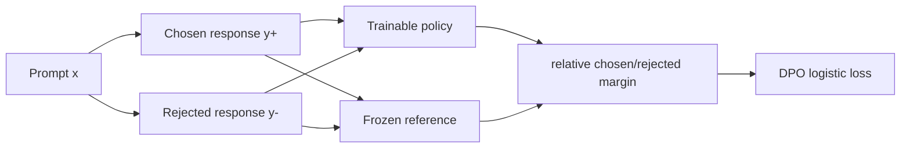
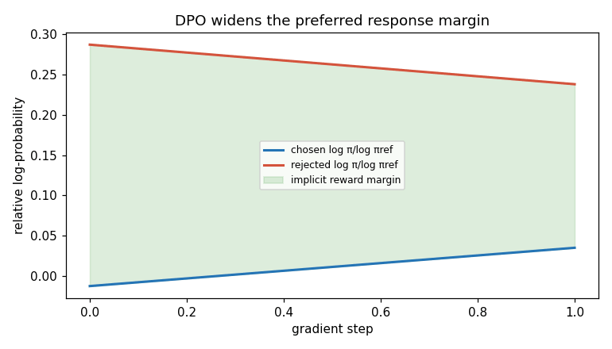

# Direct Preference Optimization: Your Language Model is Secretly a Reward Model

## TL;DR

Direct Preference Optimization (DPO) turns a dataset of “response A is preferred to response B” judgments into a direct language-model loss. It compares how much the trainable policy prefers the chosen answer over the rejected answer relative to a frozen reference model. Unlike the PPO stage in [InstructGPT](../05-instructgpt-rlhf/README.md), it does not first fit a separate reward model and then run an online reinforcement-learning loop. The result is a simple, stable pairwise classification objective, while still being motivated by KL-regularized RLHF.

## Fun Map for First Years 🧭

DPO learns from “this answer is better than that one” pairs directly. It nudges the model toward winners without running a separate reinforcement-learning loop.

`❓ prompt → 👍 preferred answer / 👎 rejected answer → 📏 preference loss → 🤖 better choices`

💻 **CS analogy:** DPO is a direct ranking-loss update, similar to teaching a search ranker from clicked-versus-skipped result pairs.

## Math Playground 🧮

**Essential equation:** \(-\log\sigma(\beta[\log\frac{\pi(y_w|x)}{\pi_\text{ref}(y_w|x)}-\log\frac{\pi(y_l|x)}{\pi_\text{ref}(y_l|x)}])\). \(y_w\) is the answer a human chose and \(y_l\) is the losing answer. In simple terms, DPO rewards the new model when it makes the winner more likely than the loser, but measures both changes against a frozen reference model. The sigmoid turns that gap into a 0-to-1 confidence; logs turn many word-probability multiplications into additions.

## Background: What Came Before 🕰️

RLHF could align a model with preferences, but it required training a separate reward model and running a delicate PPO loop. That pipeline adds moving parts and opportunities for instability. DPO was needed to learn directly from preferred-versus-rejected response pairs while keeping a reference model as an anchor.

## Why It Matters

Instruction tuning teaches an LM to imitate demonstrations, but imitation alone cannot represent every trade-off people care about: helpfulness versus brevity, harmlessness versus compliance, or a clear answer versus a rambling one. Preference data is often easier to collect than a calibrated scalar reward: show an annotator two answers to the same prompt and ask which is better. The classic InstructGPT pipeline in paper 05 fits a reward model to those comparisons, samples completions from a policy, and uses PPO to increase reward while a KL term restrains drift from the supervised model.

That pipeline is useful but operationally demanding. A reward model is another model to train, evaluate, version, and protect from exploitation. PPO introduces rollouts, a value function, clipping, reward scaling, multiple sensitive hyperparameters, and a moving distribution of sampled responses. A training failure can be caused by any one of those components. This is why the DPO paper calls conventional RLHF complex and often unstable, rather than claiming it is conceptually invalid.

Rafailov et al. (2023) observe that the KL-constrained optimum of the reward-maximization problem has a known form. Rearranging that form expresses a reward through the log probability ratio between the optimized policy and a reference policy. Substitute that parameterization into a Bradley--Terry model of pairwise human preferences and the unknown reward model disappears. The model itself supplies an *implicit* reward, measured relative to a frozen copy.

The paper reports DPO matches or improves PPO-based RLHF on its summarization and single-turn dialogue settings, and exceeds it on sentiment control, while avoiding sampling during fine-tuning and significant hyperparameter tuning. Those are experiment-specific results, not a guarantee that DPO dominates every online preference-optimization setting. Its lasting engineering contribution is an objective that makes an offline preference dataset look like ordinary supervised minibatch training.

## Core Intuition

Think of a reference model as a carefully parked car and the trainable model as the same car with a steering wheel. A preference pair says which of two nearby destinations is better. DPO does not ask for an absolute map score for either destination. It asks the policy to turn more toward the chosen destination than it would have turned from its original parked orientation, and less toward the rejected one. The reference makes “more” meaningful: a common, already-likely response should not earn credit simply for being common.

The comparison is deliberately paired. A chosen answer with log probability \(-2\) is not intrinsically good or bad; it may be much more likely than the reference made it, or much less likely. DPO therefore evaluates the chosen answer’s change from reference and subtracts the rejected answer’s change. Increasing that gap makes the human-preferred completion more favored *relative to the baseline*.



This is not magic reward-model elimination in the philosophical sense. The data still encodes preferences, and the policy parameters learn behavior that scores well under those comparisons. “Secretly a reward model” means the policy/reference log-ratio provides a parameterization compatible with the optimal policy equation. It does not mean every arbitrary policy logit is a trustworthy human-value score outside the training distribution.

## The Mechanism

Start with the regularized RLHF objective for prompt \(x\), reward \(r(x,y)\), reference \(\pi_{ref}\), and policy \(\pi\): maximize expected reward minus \(\beta\) times \(\mathrm{KL}(\pi(\cdot|x)\|\pi_{ref}(\cdot|x))\). The coefficient convention matters: in the DPO derivation, \(\beta\) controls how sharply reward differences move the optimal policy away from reference. Solving the constrained objective gives

\[
\pi^*(y|x)=\frac{1}{Z(x)}\pi_{ref}(y|x)\exp(r(x,y)/\beta).
\]

Rearrange it: \(r(x,y)=\beta[\log\pi^*(y|x)-\log\pi_{ref}(y|x)+\log Z(x)]\). For two responses to the same prompt, the unknown partition term \(\log Z(x)\) cancels. The Bradley--Terry preference model says the probability that \(y_w\) wins over \(y_l\) is the sigmoid of their reward difference. Substitution yields DPO’s loss:

\[
\mathcal L=-\log\sigma\left(\beta\left[\log\frac{\pi_\theta(y_w|x)}{\pi_{ref}(y_w|x)}-\log\frac{\pi_\theta(y_l|x)}{\pi_{ref}(y_l|x)}\right]\right).
\]

For a sequence, each \(\log\pi(y|x)\) is the sum of next-token log probabilities over its completion, with masking that excludes prompt tokens and padding. Sum rather than mean unless the chosen training convention explicitly changes length treatment: averaging can quietly alter how length affects pairwise scores. Both chosen and rejected completions must be conditioned on the identical prompt.



```mermaid
flowchart TD
 B[Preference batch: x, y_w, y_l] --> LP[policy sequence log probabilities]
 B --> LR[reference sequence log probabilities, no gradients]
 LP --> A[Δw = log πθ(yw)-log πref(yw)]
 LR --> A
 LP --> C[Δl = log πθ(yl)-log πref(yl)]
 LR --> C
 A --> M[β(Δw - Δl)]
 C --> M
 M --> N[-log sigmoid(margin)]
 N --> U[backprop only into policy]
```

The frozen reference is essential. If it moved with the policy, the relative ratios could remain unchanged while both models drifted, removing the anchor that represents the starting behavior. In practice it is usually the SFT checkpoint, loaded without gradients. The policy begins from that same checkpoint or a compatible initialization, so its initial ratios are near zero and preference updates begin from a known distribution.

Beta is a knob, not merely a cosmetic temperature. A larger multiplier makes the logistic loss react more sharply to a given relative margin; under the KL-regularized derivation it corresponds to the reward/KL trade-off convention. Extremely aggressive settings can push a policy too far from the reference on noisy pairs; tiny settings produce weak preference signal. State the implementation’s convention because libraries sometimes expose an equivalent inverse-looking parameterization.

DPO removes online exploration during its own fine-tuning loop. That is a simplification and a limitation. It learns from the fixed pair distribution rather than repeatedly generating new candidate responses, querying a reward signal, and correcting behavior on-policy. PPO can in principle incorporate online rewards, constraints, and exploration but pays for rollout and stability complexity. DPO has no separate adaptive KL controller in the PPO sense; its reference-relative loss supplies a fixed-form regularization connection.

## Practical Engineering Notes

Hugging Face TRL’s `DPOTrainer` handles paired tokenization, reference log probabilities, and standard DPO training. Still inspect a batch: chosen and rejected strings need a common prompt boundary, matching chat templates, correct EOS handling, and an attention mask that scores only completion tokens. Template mismatches are more damaging than an exotic optimizer choice because they change the conditional probabilities being compared.

Reference-model memory is a real cost. A separate frozen model doubles much of the model footprint; PEFT/LoRA workflows can often use a base model as reference while adapters define the policy, subject to the trainer’s supported reference-free or adapter-switching mode. Precompute reference log probabilities for a static dataset when storage and tokenizer/version locking make that safe; otherwise compute them online with gradients disabled.

Monitor the chosen reward proxy, rejected proxy, margin, policy/reference KL estimate, response length, and evaluation win rate. A falling training loss only means pairs are becoming separable under this objective. It does not prove truthfulness, safety, robust multi-turn behavior, or resistance to reward hacking. Hold out prompts and, where appropriate, human evaluation remain necessary.

IPO and KTO are related follow-ups with different preference objectives. They are useful comparison points, but are not interchangeable flags: their assumptions and loss geometry differ. Start with a reproducible DPO baseline, preserve the dataset and chat template, and change one objective at a time.

One subtle systems detail is length. An autoregressive model assigns a sequence probability by multiplying token probabilities, so its log probability is a sum. Longer completions generally accumulate more negative log probability even if every token is locally sensible. The original implementation choice, dataset construction, and trainer option determine whether this is desirable behavior for a task. If a team changes from summed to length-normalized scores, it has changed the pairwise preference objective and should re-evaluate it, especially where one candidate is systematically more verbose. Do not silently compare raw token losses from a generic language-model training loop to DPO sequence scores.

Data ingestion also needs defensive validation. Ensure each preference record has a nonempty chosen and rejected completion, that the two differ, and that a pair has not been reversed by a column-name mapping. Remove accidental answer labels such as “A)” or “B)” only if doing so matches the intended deployment format; those labels can be genuine tokens a model needs to learn. Deduplicate near-identical prompts across train and evaluation splits. Since DPO can fit a pairwise signal quite directly, leakage can make an offline win-rate report look better than generalization really is.

At scale, the two completions can be concatenated along a batch dimension for one policy forward pass, then split to form the loss. This is usually more efficient than two independent calls, provided padding and loss masks are kept distinct. The reference computation has the same opportunity. Gradient checkpointing, mixed precision, and distributed sharding work much as for ordinary causal-LM fine-tuning, but a numerical issue in a log probability can propagate through a subtraction and sigmoid. Check for finite masked token log probabilities before interpreting an exploding margin as a learning breakthrough.

Preference labels are comparative and can conceal disagreement. If annotators prefer different styles, a single binary winner discards that uncertainty. Keep annotator metadata where policy allows, measure agreement, and consider whether prompt categories need different evaluation slices. A high margin on a controversial or low-agreement pair is not evidence of alignment. Likewise, avoiding a rejected response does not prove a model knows why it was rejected. It may memorize a surface form, so adversarial and out-of-distribution checks complement the loss.

Finally, separate training-time reference anchoring from serving-time behavior. At inference there is normally no reference model in the request path; the trained policy simply generates. That is one reason DPO is operationally attractive after training. But serving controls such as system prompts, decoding temperature, safety filters, and tool permissions still matter. DPO changes the model distribution; it does not replace an application’s authorization boundaries or observability.

For reproducibility, log the reference checkpoint revision, tokenizer revision, chat-template text, beta, maximum lengths, truncation direction, dataset hash, and the exact preference-field mapping. These are part of the objective’s effective definition. A change in any of them can alter the computed log-ratio while leaving the training command apparently unchanged.

## Runnable Code Example

[`code/dpo_toy_preference.py`](code/dpo_toy_preference.py) contains a three-response toy policy and a frozen logit table as reference. Responses 0 and 1 are the chosen and rejected pair. It computes the exact DPO logistic loss, takes 80 SGD steps, and asserts that the chosen-minus-rejected log-probability margin relative to reference rises by more than one nat.

```bash
python3 papers/09-dpo/code/dpo_toy_preference.py
```

This is not a language model or a benchmark. It isolates the gradient direction that matters: DPO improves a *relative* preference margin, not necessarily the raw probability of every chosen string in isolation.

## Common Misconceptions & Pitfalls

- **“DPO has no reward interpretation.”** Its derivation parameterizes reward through the policy/reference ratio; it merely avoids fitting a separate explicit reward network.
- **“DPO is supervised fine-tuning on chosen answers.”** The rejected answer and frozen reference both appear in the loss, so discarding them changes the algorithm.
- **“The reference is optional bookkeeping.”** It anchors behavior and defines the log ratios. Accidentally training it invalidates the intended objective.
- **“Offline means safe.”** Fixed preference data can be biased, noisy, jailbroken, or unrepresentative; DPO does not repair those labels.

## Interview Q&A

**Q:** What is the DPO training example format?
**A:** A prompt plus a chosen and rejected completion, scored conditionally under both policy and frozen reference.

**Q:** Why do reference terms cancel a prompt-dependent constant?
**A:** The optimal-policy normalization depends only on the prompt, so subtracting two responses for that prompt removes it.

**Q:** Which parameters receive gradients?
**A:** Only the trainable policy. Reference log probabilities are computed with gradients disabled.

**Q:** What does beta control?
**A:** The scale of the pairwise margin and, in the derivation’s convention, the strength of the reward-versus-KL trade-off.

**Q:** What does DPO give up relative to PPO RLHF?
**A:** It does not perform on-policy exploration or use an online reward loop with adaptive PPO-style control.

## Further Reading

- [Original DPO paper](https://arxiv.org/abs/2305.18290)
- [InstructGPT paper](https://arxiv.org/abs/2203.02155)
- [TRL DPOTrainer documentation](https://huggingface.co/docs/trl/dpo_trainer)
- [Bradley--Terry preference model](https://en.wikipedia.org/wiki/Bradley%E2%80%93Terry_model)
