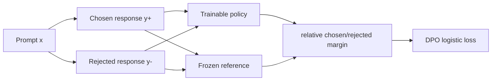
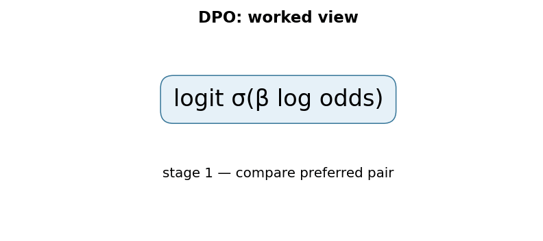

# Direct Preference Optimization: Your Language Model is Secretly a Reward Model

## TL;DR

Direct Preference Optimization (DPO) turns a dataset of “response A is preferred to response B” judgments into a direct language-model loss. It compares how much the trainable policy prefers the chosen answer over the rejected answer relative to a frozen reference model. Unlike the PPO stage in [InstructGPT](../05-instructgpt-rlhf/README.md), it does not first fit a separate reward model and then run an online reinforcement-learning loop. The result is a simple, stable pairwise classification objective, while still being motivated by KL-regularized RLHF.

## Fun Map for First Years 🧭

DPO learns from “this answer is better than that one” pairs directly. It nudges the model toward winners without running a separate reinforcement-learning loop.

`❓ prompt → 👍 preferred answer / 👎 rejected answer → 📏 preference loss → 🤖 better choices`

DPO learns directly from paired choices. It avoids training a separate reward model and a reinforcement-learning loop, which makes the recipe simpler.

Given one prompt and two responses, DPO only needs the label “this one is preferred.” It raises the probability of that response relative to the rejected one, anchored to an earlier model.

💻 **CS analogy:** DPO is a direct ranking-loss update, similar to teaching a search ranker from clicked-versus-skipped result pairs.

## Math Playground 🧮

The essential equation or rule is:

```text
−log σ(β[log(π(y_w|x)/π_ref(y_w|x)) − log(π(y_l|x)/π_ref(y_l|x))])
```

**Essential equation:** \(-\log\sigma(\beta[\log\frac{\pi(y_w|x)}{\pi_\text{ref}(y_w|x)}-\log\frac{\pi(y_l|x)}{\pi_\text{ref}(y_l|x)}])\). \(y_w\) is the answer a human chose and \(y_l\) is the losing answer. In simple terms, DPO rewards the new model when it makes the winner more likely than the loser, but measures both changes against a frozen reference model. The sigmoid turns that gap into a 0-to-1 confidence; logs turn many word-probability multiplications into additions.

π means the new model’s answer probability, π_ref is the frozen reference, and β is a strength dial. The equation favors the winning answer without drifting too far.

The two fractions compare the new policy with the reference separately for winner and loser. Subtracting them asks whether the new model improved the winner more than it improved the loser.

## Background: What Came Before 🕰️

RLHF could align a model with preferences, but it required training a separate reward model and running a delicate PPO loop. That pipeline adds moving parts and opportunities for instability. DPO was needed to learn directly from preferred-versus-rejected response pairs while keeping a reference model as an anchor.

It was needed to keep the useful preference data of RLHF while removing several moving parts that can make RL training fragile.

This simplified alignment experiments and deployment pipelines, though the quality of the outcome remains limited by the preference data and the chosen reference.

## Why It Matters

Instruction tuning teaches an LM to imitate demonstrations, but imitation alone cannot represent every trade-off people care about: helpfulness versus brevity, harmlessness versus compliance, or a clear answer versus a rambling one. Preference data is often easier to collect than a calibrated scalar reward: show an annotator two answers to the same prompt and ask which is better. The classic InstructGPT pipeline in paper 05 fits a reward model to those comparisons, samples completions from a policy, and uses PPO to increase reward while a KL term restrains drift from the supervised model.

That pipeline is useful but operationally demanding. A reward model is another model to train, evaluate, version, and protect from exploitation. PPO introduces rollouts, a value function, clipping, reward scaling, multiple sensitive hyperparameters, and a moving distribution of sampled responses. A training failure can be caused by any one of those components. This is why the DPO paper calls conventional RLHF complex and often unstable, rather than claiming it is conceptually invalid.

Rafailov et al. (2023) observe that the KL-constrained optimum of the reward-maximization problem has a known form. Rearranging that form expresses a reward through the log probability ratio between the optimized policy and a reference policy. Substitute that parameterization into a Bradley--Terry model of pairwise human preferences and the unknown reward model disappears. The model itself supplies an *implicit* reward, measured relative to a frozen copy.

The paper reports DPO matches or improves PPO-based RLHF on its summarization and single-turn dialogue settings, and exceeds it on sentiment control, while avoiding sampling during fine-tuning and significant hyperparameter tuning. Those are experiment-specific results, not a guarantee that DPO dominates every online preference-optimization setting. Its lasting engineering contribution is an objective that makes an offline preference dataset look like ordinary supervised minibatch training.

## Core Intuition

Think of a reference model as a carefully parked car and the trainable model as the same car with a steering wheel. A preference pair says which of two nearby destinations is better. DPO does not ask for an absolute map score for either destination. It asks the policy to turn more toward the chosen destination than it would have turned from its original parked orientation, and less toward the rejected one. The reference makes “more” meaningful: a common, already-likely response should not earn credit simply for being common.

The comparison is deliberately paired. A chosen answer with log probability \(-2\) is not intrinsically good or bad; it may be much more likely than the reference made it, or much less likely. DPO therefore evaluates the chosen answer’s change from reference and subtracts the rejected answer’s change. Increasing that gap makes the human-preferred completion more favored *relative to the baseline*.



This is not magic reward-model elimination in the philosophical sense. The data still encodes preferences, and the policy parameters learn behavior that scores well under those comparisons. “Secretly a reward model” means the policy/reference log-ratio provides a parameterization compatible with the optimal policy equation. It does not mean every arbitrary policy logit is a trustworthy human-value score outside the training distribution.

## The Mechanism

Start with the regularized RLHF objective for prompt \(x\), reward \(r(x,y)\), reference \(\pi_{ref}\), and policy \(\pi\): maximize expected reward minus \(\beta\) times \(\mathrm{KL}(\pi(\cdot|x)\|\pi_{ref}(\cdot|x))\). The coefficient convention matters: in the DPO derivation, \(\beta\) controls how sharply reward differences move the optimal policy away from reference. Solving the constrained objective gives

\[
\pi^*(y|x)=\frac{1}{Z(x)}\pi_{ref}(y|x)\exp(r(x,y)/\beta).
\]

Rearrange it: \(r(x,y)=\beta[\log\pi^*(y|x)-\log\pi_{ref}(y|x)+\log Z(x)]\). For two responses to the same prompt, the unknown partition term \(\log Z(x)\) cancels. The Bradley--Terry preference model says the probability that \(y_w\) wins over \(y_l\) is the sigmoid of their reward difference. Substitution yields DPO’s loss:

\[
\mathcal L=-\log\sigma\left(\beta\left[\log\frac{\pi_\theta(y_w|x)}{\pi_{ref}(y_w|x)}-\log\frac{\pi_\theta(y_l|x)}{\pi_{ref}(y_l|x)}\right]\right).
\]

For a sequence, each \(\log\pi(y|x)\) is the sum of next-token log probabilities over its completion, with masking that excludes prompt tokens and padding. Sum rather than mean unless the chosen training convention explicitly changes length treatment: averaging can quietly alter how length affects pairwise scores. Both chosen and rejected completions must be conditioned on the identical prompt.


```mermaid
flowchart TD
 B[Preference batch: x, y_w, y_l] --> LP[policy sequence log probabilities]
 B --> LR[reference sequence log probabilities, no gradients]
 LP --> A[Δw = log πθ(yw)-log πref(yw)]
 LR --> A
 LP --> C[Δl = log πθ(yl)-log πref(yl)]
 LR --> C
 A --> M[β(Δw - Δl)]
 C --> M
 M --> N[-log sigmoid(margin)]
 N --> U[backprop only into policy]
```

The frozen reference is essential. If it moved with the policy, the relative ratios could remain unchanged while both models drifted, removing the anchor that represents the starting behavior. In practice it is usually the SFT checkpoint, loaded without gradients. The policy begins from that same checkpoint or a compatible initialization, so its initial ratios are near zero and preference updates begin from a known distribution.

Beta is a knob, not merely a cosmetic temperature. A larger multiplier makes the logistic loss react more sharply to a given relative margin; under the KL-regularized derivation it corresponds to the reward/KL trade-off convention. Extremely aggressive settings can push a policy too far from the reference on noisy pairs; tiny settings produce weak preference signal. State the implementation’s convention because libraries sometimes expose an equivalent inverse-looking parameterization.

DPO removes online exploration during its own fine-tuning loop. That is a simplification and a limitation. It learns from the fixed pair distribution rather than repeatedly generating new candidate responses, querying a reward signal, and correcting behavior on-policy. PPO can in principle incorporate online rewards, constraints, and exploration but pays for rollout and stability complexity. DPO has no separate adaptive KL controller in the PPO sense; its reference-relative loss supplies a fixed-form regularization connection.

### Mechanism in Code

At implementation level, the mechanism operates on chosen/rejected completions and reference log-probabilities. A faithful
forward pass should follow this order: compute sequence log-probabilities, form relative log-odds, and apply the preference loss. Keep the intermediate
representation available while debugging; collapsing everything into one
opaque framework call makes shape and numerical errors much harder to isolate.

The key production failure to guard against is summing token scores with inconsistent length normalization. Add a tiny
reference test with hand-checkable values, then add a property test that
covers padding, empty/short inputs, boundary probabilities, and the largest
supported shape. Compare intermediate tensors with tolerances appropriate to
the dtype, and log the paper-specific statistic during a canary rollout.


## Practical Engineering Notes

### Worked Math & Dataflow

The compact view below makes the paper's central calculation concrete:

```text
logit σ(β log odds)
```

In practice, the calculation is a pipeline: A preferred/rejected pair supplies a direct log-probability comparison against a reference policy. β controls how strongly the pairwise preference is enforced. The important engineering
choice is to preserve the paper's intended invariant while making the operation
fit the available memory, batch size, and evaluation protocol.





Hugging Face TRL’s `DPOTrainer` handles paired tokenization, reference log probabilities, and standard DPO training. Still inspect a batch: chosen and rejected strings need a common prompt boundary, matching chat templates, correct EOS handling, and an attention mask that scores only completion tokens. Template mismatches are more damaging than an exotic optimizer choice because they change the conditional probabilities being compared.

Reference-model memory is a real cost. A separate frozen model doubles much of the model footprint; PEFT/LoRA workflows can often use a base model as reference while adapters define the policy, subject to the trainer’s supported reference-free or adapter-switching mode. Precompute reference log probabilities for a static dataset when storage and tokenizer/version locking make that safe; otherwise compute them online with gradients disabled.

Monitor the chosen reward proxy, rejected proxy, margin, policy/reference KL estimate, response length, and evaluation win rate. A falling training loss only means pairs are becoming separable under this objective. It does not prove truthfulness, safety, robust multi-turn behavior, or resistance to reward hacking. Hold out prompts and, where appropriate, human evaluation remain necessary.

IPO and KTO are related follow-ups with different preference objectives. They are useful comparison points, but are not interchangeable flags: their assumptions and loss geometry differ. Start with a reproducible DPO baseline, preserve the dataset and chat template, and change one objective at a time.

One subtle systems detail is length. An autoregressive model assigns a sequence probability by multiplying token probabilities, so its log probability is a sum. Longer completions generally accumulate more negative log probability even if every token is locally sensible. The original implementation choice, dataset construction, and trainer option determine whether this is desirable behavior for a task. If a team changes from summed to length-normalized scores, it has changed the pairwise preference objective and should re-evaluate it, especially where one candidate is systematically more verbose. Do not silently compare raw token losses from a generic language-model training loop to DPO sequence scores.

Data ingestion also needs defensive validation. Ensure each preference record has a nonempty chosen and rejected completion, that the two differ, and that a pair has not been reversed by a column-name mapping. Remove accidental answer labels such as “A)” or “B)” only if doing so matches the intended deployment format; those labels can be genuine tokens a model needs to learn. Deduplicate near-identical prompts across train and evaluation splits. Since DPO can fit a pairwise signal quite directly, leakage can make an offline win-rate report look better than generalization really is.

At scale, the two completions can be concatenated along a batch dimension for one policy forward pass, then split to form the loss. This is usually more efficient than two independent calls, provided padding and loss masks are kept distinct. The reference computation has the same opportunity. Gradient checkpointing, mixed precision, and distributed sharding work much as for ordinary causal-LM fine-tuning, but a numerical issue in a log probability can propagate through a subtraction and sigmoid. Check for finite masked token log probabilities before interpreting an exploding margin as a learning breakthrough.

Preference labels are comparative and can conceal disagreement. If annotators prefer different styles, a single binary winner discards that uncertainty. Keep annotator metadata where policy allows, measure agreement, and consider whether prompt categories need different evaluation slices. A high margin on a controversial or low-agreement pair is not evidence of alignment. Likewise, avoiding a rejected response does not prove a model knows why it was rejected. It may memorize a surface form, so adversarial and out-of-distribution checks complement the loss.

Finally, separate training-time reference anchoring from serving-time behavior. At inference there is normally no reference model in the request path; the trained policy simply generates. That is one reason DPO is operationally attractive after training. But serving controls such as system prompts, decoding temperature, safety filters, and tool permissions still matter. DPO changes the model distribution; it does not replace an application’s authorization boundaries or observability.

For reproducibility, log the reference checkpoint revision, tokenizer revision, chat-template text, beta, maximum lengths, truncation direction, dataset hash, and the exact preference-field mapping. These are part of the objective’s effective definition. A change in any of them can alter the computed log-ratio while leaving the training command apparently unchanged.

## Runnable Code Example

### Run from the repository root

Prerequisites: Python 3 and the dependencies imported by [`implementations/09-dpo/code/dpo_toy_preference.py`](implementations/09-dpo/code/dpo_toy_preference.py).
The example is intentionally small enough to run on CPU; it is a teaching
implementation, not a production training or serving benchmark.

```bash
python3 implementations/09-dpo/code/dpo_toy_preference.py
```

### What the example demonstrates

Read the module docstring first, then follow the functions implementing
**direct preference optimization against a reference policy**. The program turns `logit σ(β log(π(yw|x)/πref(yw|x)−log(π(yl|x)/πref(yl|x))))` into executable operations,
prints a compact result, and checks that **chosen/rejected sequences use the same prompt boundary and reference log-probabilities are detached**. The assertion matters:
it tests the semantic contract near the mechanism instead of treating a
plausible final number as proof that the implementation is correct.

### Expected behavior and useful experiments

The command should finish without a traceback and print a successful summary
or assertion message. You should observe the paper-specific behavior, not a
particular random numeric value. Change one input at a time: inspect the
intermediate tensor or state, rerun with a boundary case, and then compare the
result with the expected invariant. A useful first experiment is to **unit-test pairwise margins and monitor held-out preference accuracy by length bucket**.

### Production connection

The toy program does not model every distributed or large-scale concern. In a
real service, version the preprocessing and configuration, record the relevant
intermediate statistic, and measure peak memory, throughput, p95/p99 latency,
and task quality. The first production guard should target **preference leakage, length bias, or incorrect sequence log-prob summation**;
preserve a transparent reference path or a canary comparison before replacing
it with a fused, distributed, or highly optimized implementation.

## Common Misconceptions & Pitfalls

- **Misconception: `logit σ(β log(π(yw|x)/πref(yw|x)−log(π(yl|x)/πref(yl|x))))` is the whole implementation.** The equation describes the paper's central relationship, but `direct preference optimization against a reference policy` also requires explicit input contracts, ordering, masking or sampling rules, and numerical choices. If those details are left implicit, two implementations can share the same formula and still produce different results. Treat the equation as a contract and document each intermediate tensor or state transition.
- **Misconception: the mechanism is automatically reliable when the final metric looks good.** A model can compensate for a wrong reduction, stale state, or malformed edge/token boundary on common examples. The local guard is **chosen/rejected sequences use the same prompt boundary and reference log-probabilities are detached**. Check it on a tiny hand-worked fixture and on adversarial inputs before trusting an aggregate benchmark.
- **Pitfall: optimizing the operation before measuring its actual bottleneck.** For this paper, watch for **preference leakage, length bias, or incorrect sequence log-prob summation** rather than assuming the largest theoretical term dominates every workload. Record memory, bandwidth, batch shape, tail latency, and quality slices. An optimization is only safe when it preserves the paper-specific contract and has a rollback path.
- **Pitfall: debugging only the final prediction.** Start with **unit-test pairwise margins and monitor held-out preference accuracy by length bucket**; compare intermediate values with a simple reference. Freeze preprocessing, configuration, seeds, and model versions; then bisect the first divergence. This makes a failure reproducible and distinguishes data-contract errors from numerical instability, integration bugs, and a genuinely unsuitable paper mechanism.

## Quick Concept Checks

**Q:** What is the central idea behind **direct preference optimization against a reference policy**?
**A:** It is a structured data or optimization path, not a slogan: inputs are transformed, paper-specific relationships are computed, invalid choices are excluded when necessary, and the result is aggregated into an output or objective. The important implementation question is which intermediate values must remain observable so a reviewer can connect the code to the paper.

**Q:** How should I read `logit σ(β log(π(yw|x)/πref(yw|x)−log(π(yl|x)/πref(yl|x))))`?
**A:** Read each symbol as an operation with a shape, a data source, and a numerical range. Ask what changes when its scale, temperature, rank, timestep, neighborhood, or other paper-specific value changes. Then make a two- or three-example fixture where the expected result can be calculated by hand; this catches notation-to-code misunderstandings early.

**Q:** What invariant must a correct implementation preserve?
**A:** It must preserve **chosen/rejected sequences use the same prompt boundary and reference log-probabilities are detached**. This is stronger than asking whether accuracy improved because it is local, deterministic, and testable near the operation that could be wrong. Assert it at the boundary, compare against a small reference implementation, and include the unusual input shape most likely to violate it in production.

**Q:** What is the most dangerous failure mode?
**A:** The first risk to investigate is **preference leakage, length bias, or incorrect sequence log-prob summation**. It can produce plausible outputs while degrading only a slice of traffic, so monitor a paper-specific statistic alongside quality and system metrics. A canary should compare the old and new paths on identical inputs and should retain enough intermediate diagnostics to explain a regression.

**Q:** How would I test this idea beyond a happy-path unit test?
**A:** Begin with **unit-test pairwise margins and monitor held-out preference accuracy by length bucket**, then add differential tests against a transparent reference on small randomized inputs. Cover boundaries such as padding, termination, empty neighborhoods, long sequences, rare tokens, extreme values, or duplicated examples when they apply. Test both output values and gradients or state updates when training behavior is part of the paper's claim.

**Q:** What should I remember when applying the paper in a real system?
**A:** Keep the paper's assumptions in the production contract: version the preprocessing and configuration, expose the relevant intermediate statistic, and define quality slices before tuning performance. Compare throughput, peak memory, p95/p99 latency, and task quality against a baseline. The paper is useful only when its mechanism remains correct under the workload and failure modes you actually operate.

## Interview Q&A

**Q:** Walk through **direct preference optimization against a reference policy** end to end. How would you implement `logit σ(β log(π(yw|x)/πref(yw|x)−log(π(yl|x)/πref(yl|x))))`?
**A:** Decompose the expression into the actual data path: inputs enter the paper-specific transformation, intermediate scores or states are computed, invalid elements are excluded, and the result is reduced into the output or loss. For this paper, `logit σ(β log(π(yw|x)/πref(yw|x)−log(π(yl|x)/πref(yl|x))))` is an executable contract, not decoration: document tensor shapes, ownership of mutable state, numerical precision, and where batching changes semantics. Keep a small reference implementation beside the optimized path so a reviewer can connect each line of `code` to one term in the equation.

**Follow-up:** What invariant would you assert, and why is it stronger than checking final accuracy?
**A:** Assert that **chosen/rejected sequences use the same prompt boundary and reference log-probabilities are detached**. That property is local enough to fail near the defect, whereas accuracy can remain acceptable while a mask, reduction, or state boundary is wrong on a rare input. Add a hand-computed fixture, a randomized differential test against the reference, and shape/dtype assertions at the API boundary. The test should also cover an empty, padded, terminal, high-degree, long-context, or otherwise adversarial case when that input is meaningful for this mechanism.

**Q:** What is the main production trade-off in this paper, and how would you capacity-plan it?
**A:** The central trade-off is that **the mechanism changes both quality behavior and resource use**. Capacity planning therefore needs more than average FLOPs: measure peak memory, memory bandwidth, communication, preprocessing, batch-size sensitivity, and p95/p99 latency on representative distributions. Define a quality budget before optimizing, then compare a simple baseline with the paper mechanism using identical inputs and seeds. A faster path that silently changes tokenization, routing, masking, sampling, or optimization behavior is not an acceptable optimization until its quality impact is measured.

**Follow-up:** Which failure mode would make you roll back first?
**A:** Roll back on evidence of **preference leakage, length bias, or incorrect sequence log-prob summation**, especially when the symptom is silent and outputs still look plausible. Add dashboards for the paper-specific statistic, error and timeout rates, resource saturation, and a task metric sliced by difficult inputs. Use a canary or shadow comparison with the previous implementation, retain the old path behind a flag, and make the rollback decision threshold explicit before deployment. The important SDE2 judgment is to protect the paper’s semantic contract, not merely to chase a faster benchmark.

**Q:** A model passes unit tests but fails in production. What is your debugging plan?
**A:** Start with **unit-test pairwise margins and monitor held-out preference accuracy by length bucket**. Reproduce the smallest production-shaped example, freeze the model and preprocessing versions, and compare intermediate tensors or records rather than only the final prediction. Check data contracts, masks, sequence boundaries, random seeds, numerical precision, and serving mode in that order; then bisect between the reference and optimized implementations. If the defect is not numerical, run a controlled ablation that removes the paper-specific mechanism and compare the resulting failure rate, which separates integration problems from a bad mechanism or configuration.

**Follow-up:** What evidence would you present in the review or postmortem?
**A:** Present one minimal failing input, the expected **chosen/rejected sequences use the same prompt boundary and reference log-probabilities are detached**, the first intermediate value that diverged, and the regression test that now protects it. Include a before/after table for task quality, memory, throughput, p95/p99 latency, and cost, with slices for the failure population. A complete SDE2 answer also states the rollout guard, owner, and alert threshold. That turns a paper idea into an operable system rather than a one-line claim about an equation.

## Further Reading

- [Original DPO paper](https://arxiv.org/abs/2305.18290)
- [InstructGPT paper](https://arxiv.org/abs/2203.02155)
- [TRL DPOTrainer documentation](https://huggingface.co/docs/trl/dpo_trainer)
- [Bradley--Terry preference model](https://en.wikipedia.org/wiki/Bradley%E2%80%93Terry_model)
