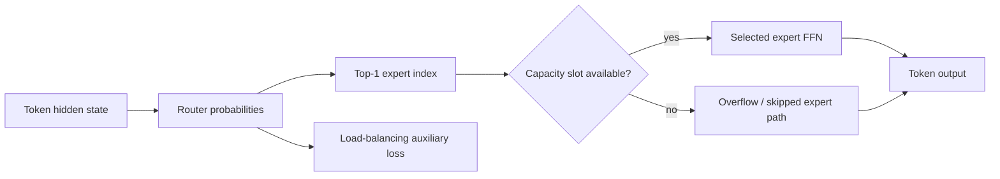
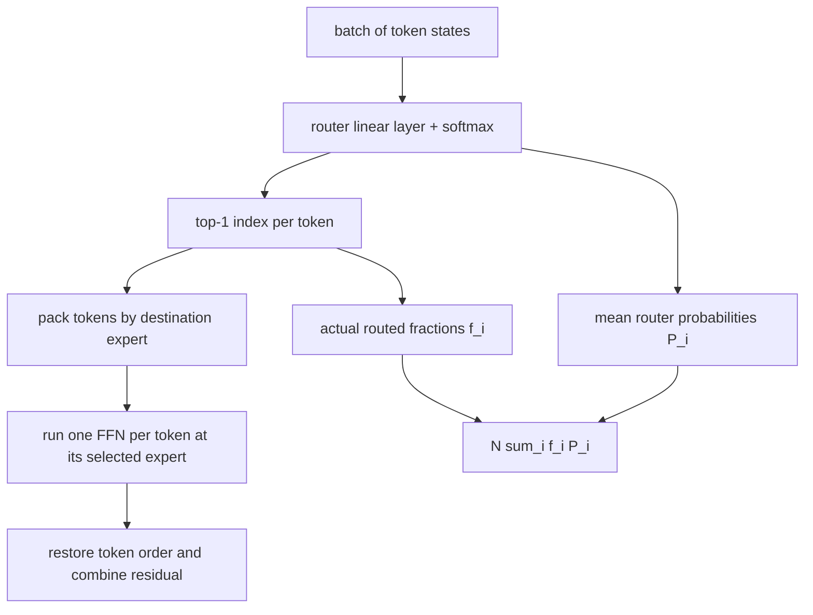
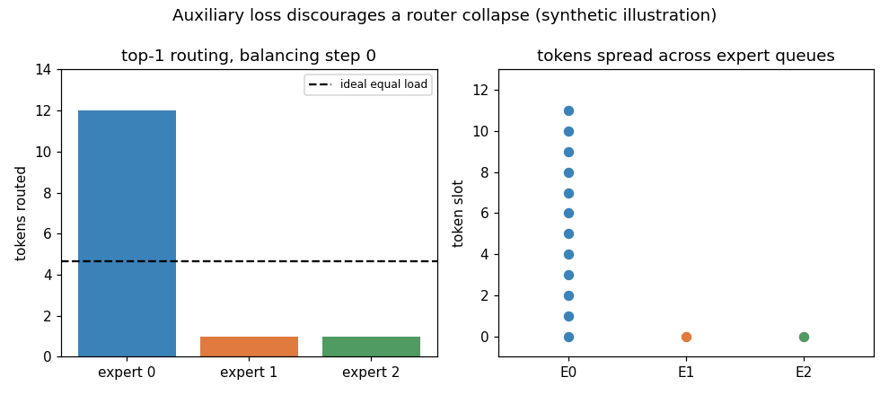
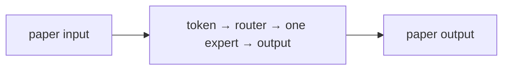
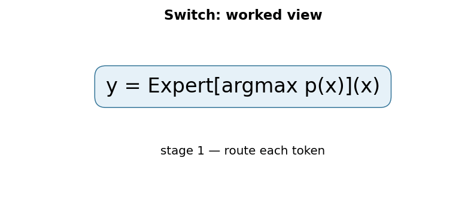

# Switch Transformers: Scaling to Trillion Parameter Models with Simple and Efficient Sparsity

## 1. TL;DR
Switch Transformer replaces a dense Transformer feed-forward network with many expert feed-forward networks and routes each token to just one expert. This top-1 “switch” routing lets total parameter count grow while each token activates roughly the compute of one ordinary FFN. The design is simpler than earlier top-k mixture-of-experts routing, but it needs capacity limits and an auxiliary loss to stop every token choosing the same expert. Fedus, Zoph, and Shazeer showed this sparse design could train very large language models efficiently, including a trillion-parameter model.

## 2. Fun Map for First Years
Switch Transformers have many expert helpers, but each token visits only one. It is like sending a question to one specialist instead of waking every specialist.

`🔤 token → 🚦 router picks expert → 🧑‍🔧 one expert works → 🧠 large capacity, lower cost`

Different tokens may need different processing. The router makes a quick choice so the model gets many specialists without asking every specialist to work on every token.

A token about Python syntax might be routed to one expert while a multilingual phrase goes to another. Only the selected expert runs, so capacity increases without every token paying for every expert.

💻 **CS analogy:** the router is a load balancer that picks one worker for each request while trying not to overload one machine.

### Beginner walkthrough

Read the arrows as a sequence of responsibilities. First identify what enters
the system, then ask what the paper changes, what information is preserved or
discarded, and what leaves the operation. For **top-1 sparse mixture-of-experts routing**, the key question
is not “does the model sound clever?” but “which intermediate value carries the
new information, and what would go wrong if it were missing?”

### CS student checkpoint

The map corresponds to a small program: input data enters a function, the
paper-specific state or transformation runs, and an assertion checks **each token is dispatched to exactly one selected expert and capacity overflow is observable**.
The equation `y=Expert[argmax p(x)](x)` is the compact specification for that function. Trace
one concrete item through each arrow before thinking about larger batches,
parallel hardware, or production optimizations.

## 3. Math Playground
The essential equation or rule is:

```text
i = argmaxⱼ pⱼ(x),  pⱼ(x) = softmax(Wx)ⱼ
```

**Essential rule:** i = argmaxⱼ pⱼ(x), where pⱼ(x) = softmax(Wx)ⱼ. For each token x, a router gives every expert j a percentage-like score and sends the token only to the expert with the largest score. This one-winner rule is the paper’s central mathematical simplification: the model can store many experts while paying to run only one.

argmax means “choose the biggest.” Softmax changes raw router scores into percentages, so the chosen expert is simply the expert with the largest percentage.

argmax ignores every score except the largest one after routing. That makes the forward pass cheap, but it also means training needs a balancing term so all tokens do not choose the same expert.

## 4. Background: What Came Before
Dense Transformers use every parameter for every token, so expanding parameter count also expands compute. Earlier mixture-of-experts designs existed but routing multiple experts made training and communication harder. Switch Transformer was needed to scale capacity with a simple one-expert-per-token routing rule.

The paper made sparse models easier to scale by reducing a multi-expert routing problem to one clear routing choice per token.

The paper showed that conditional computation can scale parameter count separately from per-token work, with networking and load balance becoming central engineering concerns.

## 5. Why It Matters
Every dense model in the earlier parts of this collection uses all of its layer parameters for every token. Scaling a dense FFN from billions to hundreds of billions of weights increases both what can be stored and how much arithmetic each token requires. That coupling is expensive: capacity and per-token latency rise together. Mixture of Experts (MoE) breaks it by storing a collection of specialist FFNs but calling only a small subset for each token.

Earlier MoE systems often used top-k routing: a gate chooses several experts, their outputs are combined, and distributed workers exchange the relevant token activations. That can improve capacity but brings duplicated expert computation, more all-to-all communication, routing complexity, and load-balancing problems. The Switch paper’s key simplification is exactly one selected expert per token. The router computes probabilities over experts, takes an argmax, and sends the token to that expert alone.

The paper is therefore a scaling-systems paper as much as an architecture paper. Its arXiv abstract says MoE adoption had been limited by complexity, communication cost, and training instability. The authors report up to sevenfold pre-training speedups for Switch models based on T5-Base and T5-Large under the same resources, gains across all 101 languages of their mT5-base comparison, and a trillion-parameter pre-training run on the Colossal Clean Crawled Corpus. Those are reported experimental results, not a universal promise that any sparse checkpoint serves seven times faster.

The central bargain is appealing: increase *total* parameters without making every token visit every parameter. But it changes the bottleneck. A dense FFN is regular matrix multiplication; a sparse MoE layer requires routing, packing variable-sized token batches, cross-device transfer in expert-parallel layouts, capacity decisions, and recovery from imbalance. Switch made that bargain practical enough to become a major ancestor of modern sparse models, including the style of sparse expert layers popularized by Mixtral.

## 6. Core Intuition
Imagine a customer-support desk with many specialist queues. A normal dense FFN is one giant generalist desk: every request is handled by the same workforce. An MoE layer has many desks, but sending every request to every desk would be wasteful. A Switch router reads the ticket and stamps it for one desk. The company can employ many specialists, yet each ticket receives one desk’s worth of work.

That stamp creates a traffic-management problem. If the router decides that every ticket belongs to expert 0, expert 0 has a long queue while other desks are idle. The model has nominally many parameters but functionally uses one. Switch therefore gives each expert a finite number of slots per batch and charges a balancing penalty when routing probabilities and actual traffic concentrate. Overflow tickets are dropped or bypass the expert according to the implementation policy; they cannot make an expert’s batch unbounded.



The analogy also clarifies specialization. The router is not given human labels such as “math expert” or “French expert.” Its decisions and expert weights are learned from the training objective. Some experts may become correlated with domains or token patterns, but one should not assume an interpretable profession for each. The balancing term asks for usable traffic distribution, not semantic diversity by itself.

## 7. The Mechanism
Replace a Transformer block’s dense FFN with \(N\) expert FFNs \(E_i\). For token state \(x\), a learned router produces \(p(x)=\mathrm{softmax}(W_r x)\). Switch chooses \(i^*=\arg\max_i p_i(x)\), then produces the selected expert output scaled by that gate value: \(y=p_{i^*}(x)E_{i^*}(x)\). Only one expert’s two FFN projections execute for that token. The surrounding attention, residual, and normalization layers remain dense Transformer components.



Top-1 is the distinguishing simplification. In top-2 routing, two experts must process a token and outputs need a weighted combination; Switch eliminates that second expert computation and associated routing. It does not make routing free. The discrete argmax determines where activations go, while the selected probability multiplier and auxiliary objective provide differentiable learning signal to the router. Implementations must be precise about masking, capacity, and dispatch order because a token’s path is data-dependent.

Each expert has a capacity. For batch token count \(T\), number of experts \(N\), and capacity factor \(c\), the typical capacity is proportional to \(cT/N\) (rounded to an integer). A factor near one allocates about equal-share slots; a larger factor gives headroom for uneven assignments at the cost of memory and compute padding. When assignments exceed an expert’s capacity, the excess cannot simply be appended: that would turn worst-case routing collapse into unbounded memory. The paper studies capacity and token dropping as practical MoE concerns. The code example intentionally overloads one expert and asserts exactly which tokens cannot be accepted.



The paper’s auxiliary load-balancing loss combines two batch-level signals. Let \(f_i\) be the fraction of tokens whose top-1 route is expert \(i\), and \(P_i\) be the mean router probability for expert \(i\) over tokens. Then \(L_{aux}=N\sum_i f_iP_i\). Its minimum is one for uniform routing/probability in the ideal symmetric case, while collapsed routing makes the matching product large. The paper adds this term with a small coefficient to the main task loss. The hard fractions show actual dispatch; mean soft probabilities give the router a differentiable signal even though argmax itself is discrete.

Capacity and balancing solve related but different failures. Capacity limits resource use after a router decision; it cannot make a discarded token useful. The auxiliary loss changes training pressure so that fewer tokens want the same destination in the first place. Monitoring only average probabilities can hide a hard-routing collapse, and monitoring only counts can give poor gradients. Use both. Also track dropped-token rate per expert and per sequence position, since systematic overflows can create a subtle quality regression.

Sparse activation means per-token FLOPs through the expert part stay close to a dense FFN of the same expert width, while total stored expert parameters scale with \(N\). It does not mean whole-model cost is constant: router work, dispatch, communication, padding capacity, and memory bandwidth remain. In an expert-parallel setup, different devices own different experts; tokens must be all-to-all exchanged to the owning device and results returned. The fastest arithmetic kernel cannot hide a straggler expert or an overloaded network link.

The paper also highlights training stability techniques, including lower-precision bfloat16 training for large sparse models. Precision is especially relevant at the router: small logit changes can flip an argmax and radically change dispatch. A production implementation often keeps selected router computations in a more stable precision and uses carefully tested collective communication. These are engineering choices around the paper’s mechanism, not evidence that all MoE models must use one exact numeric recipe.

There is also a distinction between routing *probability* and routing *assignment*. A router can assign expert 0 because it is only fractionally ahead of expert 1, or because it is overwhelmingly confident; top-1 counts see both as the same destination. The balancing loss incorporates mean probabilities so it can respond to this confidence information, but it remains a batch statistic rather than a per-token quality guarantee. During diagnosis, histogram both router logits and realized assignments. A low loss with frequent capacity overflow suggests that the particular capacity, batch shape, or dispatch policy needs attention.

At inference, routing is usually deterministic given model weights and token states, but the token states themselves depend on earlier generated tokens and sampling choices. Consequently, an MoE request can have variable communication and expert utilization across otherwise similar prompts. Capacity planning should include percentile load and tail latency tests, not just an average token-per-expert figure. Sparse conditional computation buys scalable model capacity; it introduces a workload-distribution problem that dense layers largely avoid.

### Mechanism in Code

At implementation level, the mechanism operates on token representations and router logits. A faithful
forward pass should follow this order: softmax router scores, select top one, dispatch within capacity, and combine outputs. Keep the intermediate
representation available while debugging; collapsing everything into one
opaque framework call makes shape and numerical errors much harder to isolate.

The key production failure to guard against is dropping overflow tokens silently or letting one expert monopolize capacity. Add a tiny
reference test with hand-checkable values, then add a property test that
covers padding, empty/short inputs, boundary probabilities, and the largest
supported shape. Compare intermediate tensors with tolerances appropriate to
the dtype, and log the paper-specific statistic during a canary rollout.


## 8. Practical Engineering Notes
### Worked Math & Dataflow

The compact view below makes the paper's central calculation concrete:

```text
y = Expert[argmax p(x)](x)
```

In practice, the calculation is a pipeline: The router selects one expert per token, so compute grows with active experts rather than the total parameter pool. Capacity limits prevent one expert queue from overwhelming the batch. The important engineering
choice is to preserve the paper's intended invariant while making the operation
fit the available memory, batch size, and evaluation protocol.






Modern sparse systems make the routing pipeline visible. Mixtral is a widely used descendant-style sparse MoE model; GShard and ST-MoE are important forward pointers for large-scale expert routing. Framework implementations may live in PyTorch, JAX, Megatron-style stacks, or specialized kernels, but the conceptual interface is the same: router logits, top-k selection, capacity/dispatch, local expert FFNs, and an auxiliary loss. Confirm whether a model is top-1 or top-2 before assuming Switch’s exact compute trade-off.

Expert parallelism has a different deployment profile from ordinary tensor parallelism. A request’s tokens may need remote experts, so batch composition and sequence length affect network traffic. Small online batches can underfill expert capacity and waste kernels; large mixed batches can improve utilization yet increase tail latency. Co-locating popular experts is not enough if routing changes with prompt content. Profile all-to-all transfer, queueing, and per-expert load, not just total FLOPs.

Token drops deserve an explicit product decision. Some training paths pass overflow tokens through a residual path or leave them unchanged; serving implementations may choose a deterministic capacity policy. Either way, report the drop rate and test worst-case prompts. A model that looks healthy on average can route a particular language, format, or long-document region disproportionately to one expert. Capacity factor raises insurance but costs reserved slots, so it is not a free “quality” knob.

Router initialization, auxiliary-loss coefficient, z-loss or other later stabilizers, and precision policy are checkpoint-sensitive. Do not transplant values from Switch into Mixtral or another MoE model without its documentation. For debugging, start with a CPU reference dispatcher that preserves token order and records assignments, then compare it to a fused distributed path. Deterministic routing tests make it much easier to catch duplicate, lost, or wrongly reassembled tokens.

Finally, sparse total parameter count can mislead capacity planning. It affects checkpoint storage and aggregate memory across devices, whereas active parameters and communication dominate request latency. Quote both total and active parameters, plus expert count, top-k, and capacity policy. Those fields explain far more about a sparse model’s operating envelope than a headline parameter number alone.

## 9. Runnable Code Example
### Run from the repository root

Prerequisites: Python 3 and the dependencies imported by [`implementations/10-switch-transformer/code/switch_routing_demo.py`](implementations/10-switch-transformer/code/switch_routing_demo.py).
The example is intentionally small enough to run on CPU; it is a teaching
implementation, not a production training or serving benchmark.

```bash
python3 implementations/10-switch-transformer/code/switch_routing_demo.py
```

### What the example demonstrates

Read the module docstring first, then follow the functions implementing
**top-1 sparse mixture-of-experts routing**. The program turns `y=Expert[argmax p(x)](x)` into executable operations,
prints a compact result, and checks that **each token is dispatched to exactly one selected expert and capacity overflow is observable**. The assertion matters:
it tests the semantic contract near the mechanism instead of treating a
plausible final number as proof that the implementation is correct.

### Expected behavior and useful experiments

The command should finish without a traceback and print a successful summary
or assertion message. You should observe the paper-specific behavior, not a
particular random numeric value. Change one input at a time: inspect the
intermediate tensor or state, rerun with a boundary case, and then compare the
result with the expected invariant. A useful first experiment is to **log per-expert counts, overflow rate, routing entropy, and quality for overflowed tokens**.

### Production connection

The toy program does not model every distributed or large-scale concern. In a
real service, version the preprocessing and configuration, record the relevant
intermediate statistic, and measure peak memory, throughput, p95/p99 latency,
and task quality. The first production guard should target **expert load imbalance, dropped tokens, and all-to-all communication spikes**;
preserve a transparent reference path or a canary comparison before replacing
it with a fused, distributed, or highly optimized implementation.

## 10. Common Misconceptions & Pitfalls
- **Misconception: `y=Expert[argmax p(x)](x)` is the whole implementation.** The equation describes the paper's central relationship, but `top-1 sparse mixture-of-experts routing` also requires explicit input contracts, ordering, masking or sampling rules, and numerical choices. If those details are left implicit, two implementations can share the same formula and still produce different results. Treat the equation as a contract and document each intermediate tensor or state transition.
- **Misconception: the mechanism is automatically reliable when the final metric looks good.** A model can compensate for a wrong reduction, stale state, or malformed edge/token boundary on common examples. The local guard is **each token is dispatched to exactly one selected expert and capacity overflow is observable**. Check it on a tiny hand-worked fixture and on adversarial inputs before trusting an aggregate benchmark.
- **Pitfall: optimizing the operation before measuring its actual bottleneck.** For this paper, watch for **expert load imbalance, dropped tokens, and all-to-all communication spikes** rather than assuming the largest theoretical term dominates every workload. Record memory, bandwidth, batch shape, tail latency, and quality slices. An optimization is only safe when it preserves the paper-specific contract and has a rollback path.
- **Pitfall: debugging only the final prediction.** Start with **log per-expert counts, overflow rate, routing entropy, and quality for overflowed tokens**; compare intermediate values with a simple reference. Freeze preprocessing, configuration, seeds, and model versions; then bisect the first divergence. This makes a failure reproducible and distinguishes data-contract errors from numerical instability, integration bugs, and a genuinely unsuitable paper mechanism.

## 11. Quick Concept Checks
**Q:** What is the central idea behind **top-1 sparse mixture-of-experts routing**?
**A:** It is a structured data or optimization path, not a slogan: inputs are transformed, paper-specific relationships are computed, invalid choices are excluded when necessary, and the result is aggregated into an output or objective. The important implementation question is which intermediate values must remain observable so a reviewer can connect the code to the paper.

**Q:** How should I read `y=Expert[argmax p(x)](x)`?
**A:** Read each symbol as an operation with a shape, a data source, and a numerical range. Ask what changes when its scale, temperature, rank, timestep, neighborhood, or other paper-specific value changes. Then make a two- or three-example fixture where the expected result can be calculated by hand; this catches notation-to-code misunderstandings early.

**Q:** What invariant must a correct implementation preserve?
**A:** It must preserve **each token is dispatched to exactly one selected expert and capacity overflow is observable**. This is stronger than asking whether accuracy improved because it is local, deterministic, and testable near the operation that could be wrong. Assert it at the boundary, compare against a small reference implementation, and include the unusual input shape most likely to violate it in production.

**Q:** What is the most dangerous failure mode?
**A:** The first risk to investigate is **expert load imbalance, dropped tokens, and all-to-all communication spikes**. It can produce plausible outputs while degrading only a slice of traffic, so monitor a paper-specific statistic alongside quality and system metrics. A canary should compare the old and new paths on identical inputs and should retain enough intermediate diagnostics to explain a regression.

**Q:** How would I test this idea beyond a happy-path unit test?
**A:** Begin with **log per-expert counts, overflow rate, routing entropy, and quality for overflowed tokens**, then add differential tests against a transparent reference on small randomized inputs. Cover boundaries such as padding, termination, empty neighborhoods, long sequences, rare tokens, extreme values, or duplicated examples when they apply. Test both output values and gradients or state updates when training behavior is part of the paper's claim.

**Q:** What should I remember when applying the paper in a real system?
**A:** Keep the paper's assumptions in the production contract: version the preprocessing and configuration, expose the relevant intermediate statistic, and define quality slices before tuning performance. Compare throughput, peak memory, p95/p99 latency, and task quality against a baseline. The paper is useful only when its mechanism remains correct under the workload and failure modes you actually operate.

## 12. Interview Q&A
**Q:** Walk through **top-1 sparse mixture-of-experts routing** end to end. How would you implement `y=Expert[argmax p(x)](x)`?
**A:** Decompose the expression into the actual data path: inputs enter the paper-specific transformation, intermediate scores or states are computed, invalid elements are excluded, and the result is reduced into the output or loss. For this paper, `y=Expert[argmax p(x)](x)` is an executable contract, not decoration: document tensor shapes, ownership of mutable state, numerical precision, and where batching changes semantics. Keep a small reference implementation beside the optimized path so a reviewer can connect each line of `code` to one term in the equation.

**Follow-up:** What invariant would you assert, and why is it stronger than checking final accuracy?
**A:** Assert that **each token is dispatched to exactly one selected expert and capacity overflow is observable**. That property is local enough to fail near the defect, whereas accuracy can remain acceptable while a mask, reduction, or state boundary is wrong on a rare input. Add a hand-computed fixture, a randomized differential test against the reference, and shape/dtype assertions at the API boundary. The test should also cover an empty, padded, terminal, high-degree, long-context, or otherwise adversarial case when that input is meaningful for this mechanism.

**Q:** What is the main production trade-off in this paper, and how would you capacity-plan it?
**A:** The central trade-off is that **the mechanism changes both quality behavior and resource use**. Capacity planning therefore needs more than average FLOPs: measure peak memory, memory bandwidth, communication, preprocessing, batch-size sensitivity, and p95/p99 latency on representative distributions. Define a quality budget before optimizing, then compare a simple baseline with the paper mechanism using identical inputs and seeds. A faster path that silently changes tokenization, routing, masking, sampling, or optimization behavior is not an acceptable optimization until its quality impact is measured.

**Follow-up:** Which failure mode would make you roll back first?
**A:** Roll back on evidence of **expert load imbalance, dropped tokens, and all-to-all communication spikes**, especially when the symptom is silent and outputs still look plausible. Add dashboards for the paper-specific statistic, error and timeout rates, resource saturation, and a task metric sliced by difficult inputs. Use a canary or shadow comparison with the previous implementation, retain the old path behind a flag, and make the rollback decision threshold explicit before deployment. The important SDE2 judgment is to protect the paper’s semantic contract, not merely to chase a faster benchmark.

**Q:** A model passes unit tests but fails in production. What is your debugging plan?
**A:** Start with **log per-expert counts, overflow rate, routing entropy, and quality for overflowed tokens**. Reproduce the smallest production-shaped example, freeze the model and preprocessing versions, and compare intermediate tensors or records rather than only the final prediction. Check data contracts, masks, sequence boundaries, random seeds, numerical precision, and serving mode in that order; then bisect between the reference and optimized implementations. If the defect is not numerical, run a controlled ablation that removes the paper-specific mechanism and compare the resulting failure rate, which separates integration problems from a bad mechanism or configuration.

**Follow-up:** What evidence would you present in the review or postmortem?
**A:** Present one minimal failing input, the expected **each token is dispatched to exactly one selected expert and capacity overflow is observable**, the first intermediate value that diverged, and the regression test that now protects it. Include a before/after table for task quality, memory, throughput, p95/p99 latency, and cost, with slices for the failure population. A complete SDE2 answer also states the rollout guard, owner, and alert threshold. That turns a paper idea into an operable system rather than a one-line claim about an equation.

## 13. Further Reading
- [Original Switch Transformer paper](https://arxiv.org/abs/2101.03961)
- [GShard: Scaling Giant Models with Conditional Computation](https://arxiv.org/abs/2006.16668)
- [ST-MoE: Designing Stable and Transferable Sparse Expert Models](https://arxiv.org/abs/2202.08906)
- [Mixtral of Experts](https://arxiv.org/abs/2401.04088)
