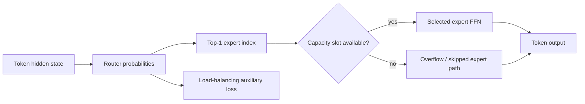
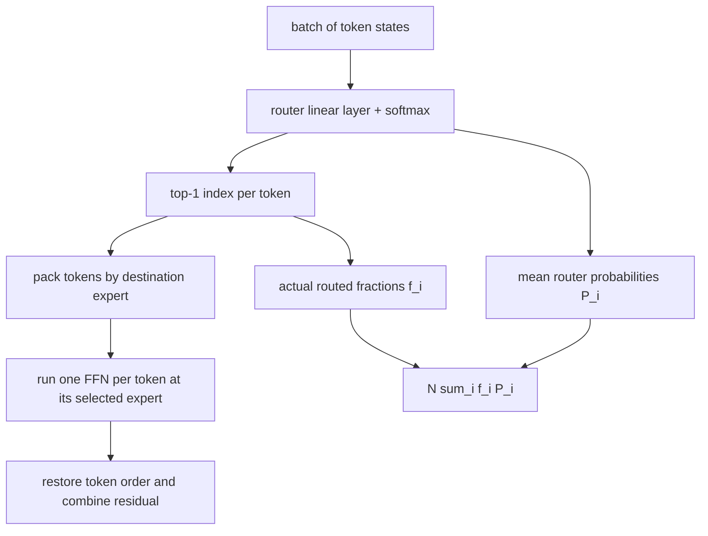
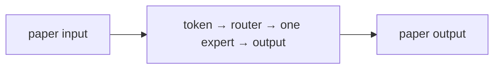

# Switch Transformers: Scaling to Trillion Parameter Models with Simple and Efficient Sparsity

## TL;DR

Switch Transformer replaces a dense Transformer feed-forward network with many expert feed-forward networks and routes each token to just one expert. This top-1 “switch” routing lets total parameter count grow while each token activates roughly the compute of one ordinary FFN. The design is simpler than earlier top-k mixture-of-experts routing, but it needs capacity limits and an auxiliary loss to stop every token choosing the same expert. Fedus, Zoph, and Shazeer showed this sparse design could train very large language models efficiently, including a trillion-parameter model.

## Fun Map for First Years 🧭

Switch Transformers have many expert helpers, but each token visits only one. It is like sending a question to one specialist instead of waking every specialist.

`🔤 token → 🚦 router picks expert → 🧑‍🔧 one expert works → 🧠 large capacity, lower cost`

Different tokens may need different processing. The router makes a quick choice so the model gets many specialists without asking every specialist to work on every token.

A token about Python syntax might be routed to one expert while a multilingual phrase goes to another. Only the selected expert runs, so capacity increases without every token paying for every expert.

💻 **CS analogy:** the router is a load balancer that picks one worker for each request while trying not to overload one machine.

## Math Playground 🧮

The essential equation or rule is:

```text
i = argmaxⱼ pⱼ(x),  pⱼ(x) = softmax(Wx)ⱼ
```

**Essential rule:** i = argmaxⱼ pⱼ(x), where pⱼ(x) = softmax(Wx)ⱼ. For each token x, a router gives every expert j a percentage-like score and sends the token only to the expert with the largest score. This one-winner rule is the paper’s central mathematical simplification: the model can store many experts while paying to run only one.

argmax means “choose the biggest.” Softmax changes raw router scores into percentages, so the chosen expert is simply the expert with the largest percentage.

argmax ignores every score except the largest one after routing. That makes the forward pass cheap, but it also means training needs a balancing term so all tokens do not choose the same expert.

## Background: What Came Before 🕰️

Dense Transformers use every parameter for every token, so expanding parameter count also expands compute. Earlier mixture-of-experts designs existed but routing multiple experts made training and communication harder. Switch Transformer was needed to scale capacity with a simple one-expert-per-token routing rule.

The paper made sparse models easier to scale by reducing a multi-expert routing problem to one clear routing choice per token.

The paper showed that conditional computation can scale parameter count separately from per-token work, with networking and load balance becoming central engineering concerns.

## Why It Matters

Every dense model in the earlier parts of this collection uses all of its layer parameters for every token. Scaling a dense FFN from billions to hundreds of billions of weights increases both what can be stored and how much arithmetic each token requires. That coupling is expensive: capacity and per-token latency rise together. Mixture of Experts (MoE) breaks it by storing a collection of specialist FFNs but calling only a small subset for each token.

Earlier MoE systems often used top-k routing: a gate chooses several experts, their outputs are combined, and distributed workers exchange the relevant token activations. That can improve capacity but brings duplicated expert computation, more all-to-all communication, routing complexity, and load-balancing problems. The Switch paper’s key simplification is exactly one selected expert per token. The router computes probabilities over experts, takes an argmax, and sends the token to that expert alone.

The paper is therefore a scaling-systems paper as much as an architecture paper. Its arXiv abstract says MoE adoption had been limited by complexity, communication cost, and training instability. The authors report up to sevenfold pre-training speedups for Switch models based on T5-Base and T5-Large under the same resources, gains across all 101 languages of their mT5-base comparison, and a trillion-parameter pre-training run on the Colossal Clean Crawled Corpus. Those are reported experimental results, not a universal promise that any sparse checkpoint serves seven times faster.

The central bargain is appealing: increase *total* parameters without making every token visit every parameter. But it changes the bottleneck. A dense FFN is regular matrix multiplication; a sparse MoE layer requires routing, packing variable-sized token batches, cross-device transfer in expert-parallel layouts, capacity decisions, and recovery from imbalance. Switch made that bargain practical enough to become a major ancestor of modern sparse models, including the style of sparse expert layers popularized by Mixtral.

## Core Intuition

Imagine a customer-support desk with many specialist queues. A normal dense FFN is one giant generalist desk: every request is handled by the same workforce. An MoE layer has many desks, but sending every request to every desk would be wasteful. A Switch router reads the ticket and stamps it for one desk. The company can employ many specialists, yet each ticket receives one desk’s worth of work.

That stamp creates a traffic-management problem. If the router decides that every ticket belongs to expert 0, expert 0 has a long queue while other desks are idle. The model has nominally many parameters but functionally uses one. Switch therefore gives each expert a finite number of slots per batch and charges a balancing penalty when routing probabilities and actual traffic concentrate. Overflow tickets are dropped or bypass the expert according to the implementation policy; they cannot make an expert’s batch unbounded.



The analogy also clarifies specialization. The router is not given human labels such as “math expert” or “French expert.” Its decisions and expert weights are learned from the training objective. Some experts may become correlated with domains or token patterns, but one should not assume an interpretable profession for each. The balancing term asks for usable traffic distribution, not semantic diversity by itself.

## The Mechanism

Replace a Transformer block’s dense FFN with \(N\) expert FFNs \(E_i\). For token state \(x\), a learned router produces \(p(x)=\mathrm{softmax}(W_r x)\). Switch chooses \(i^*=\arg\max_i p_i(x)\), then produces the selected expert output scaled by that gate value: \(y=p_{i^*}(x)E_{i^*}(x)\). Only one expert’s two FFN projections execute for that token. The surrounding attention, residual, and normalization layers remain dense Transformer components.



Top-1 is the distinguishing simplification. In top-2 routing, two experts must process a token and outputs need a weighted combination; Switch eliminates that second expert computation and associated routing. It does not make routing free. The discrete argmax determines where activations go, while the selected probability multiplier and auxiliary objective provide differentiable learning signal to the router. Implementations must be precise about masking, capacity, and dispatch order because a token’s path is data-dependent.

Each expert has a capacity. For batch token count \(T\), number of experts \(N\), and capacity factor \(c\), the typical capacity is proportional to \(cT/N\) (rounded to an integer). A factor near one allocates about equal-share slots; a larger factor gives headroom for uneven assignments at the cost of memory and compute padding. When assignments exceed an expert’s capacity, the excess cannot simply be appended: that would turn worst-case routing collapse into unbounded memory. The paper studies capacity and token dropping as practical MoE concerns. The code example intentionally overloads one expert and asserts exactly which tokens cannot be accepted.


The paper’s auxiliary load-balancing loss combines two batch-level signals. Let \(f_i\) be the fraction of tokens whose top-1 route is expert \(i\), and \(P_i\) be the mean router probability for expert \(i\) over tokens. Then \(L_{aux}=N\sum_i f_iP_i\). Its minimum is one for uniform routing/probability in the ideal symmetric case, while collapsed routing makes the matching product large. The paper adds this term with a small coefficient to the main task loss. The hard fractions show actual dispatch; mean soft probabilities give the router a differentiable signal even though argmax itself is discrete.

Capacity and balancing solve related but different failures. Capacity limits resource use after a router decision; it cannot make a discarded token useful. The auxiliary loss changes training pressure so that fewer tokens want the same destination in the first place. Monitoring only average probabilities can hide a hard-routing collapse, and monitoring only counts can give poor gradients. Use both. Also track dropped-token rate per expert and per sequence position, since systematic overflows can create a subtle quality regression.

Sparse activation means per-token FLOPs through the expert part stay close to a dense FFN of the same expert width, while total stored expert parameters scale with \(N\). It does not mean whole-model cost is constant: router work, dispatch, communication, padding capacity, and memory bandwidth remain. In an expert-parallel setup, different devices own different experts; tokens must be all-to-all exchanged to the owning device and results returned. The fastest arithmetic kernel cannot hide a straggler expert or an overloaded network link.

The paper also highlights training stability techniques, including lower-precision bfloat16 training for large sparse models. Precision is especially relevant at the router: small logit changes can flip an argmax and radically change dispatch. A production implementation often keeps selected router computations in a more stable precision and uses carefully tested collective communication. These are engineering choices around the paper’s mechanism, not evidence that all MoE models must use one exact numeric recipe.

There is also a distinction between routing *probability* and routing *assignment*. A router can assign expert 0 because it is only fractionally ahead of expert 1, or because it is overwhelmingly confident; top-1 counts see both as the same destination. The balancing loss incorporates mean probabilities so it can respond to this confidence information, but it remains a batch statistic rather than a per-token quality guarantee. During diagnosis, histogram both router logits and realized assignments. A low loss with frequent capacity overflow suggests that the particular capacity, batch shape, or dispatch policy needs attention.

At inference, routing is usually deterministic given model weights and token states, but the token states themselves depend on earlier generated tokens and sampling choices. Consequently, an MoE request can have variable communication and expert utilization across otherwise similar prompts. Capacity planning should include percentile load and tail latency tests, not just an average token-per-expert figure. Sparse conditional computation buys scalable model capacity; it introduces a workload-distribution problem that dense layers largely avoid.

### Mechanism in Code

At implementation level, the mechanism operates on token representations and router logits. A faithful
forward pass should follow this order: softmax router scores, select top one, dispatch within capacity, and combine outputs. Keep the intermediate
representation available while debugging; collapsing everything into one
opaque framework call makes shape and numerical errors much harder to isolate.

The key production failure to guard against is dropping overflow tokens silently or letting one expert monopolize capacity. Add a tiny
reference test with hand-checkable values, then add a property test that
covers padding, empty/short inputs, boundary probabilities, and the largest
supported shape. Compare intermediate tensors with tolerances appropriate to
the dtype, and log the paper-specific statistic during a canary rollout.


## Practical Engineering Notes

### Worked Math & Dataflow

The compact view below makes the paper's central calculation concrete:

```text
y = Expert[argmax p(x)](x)
```

In practice, the calculation is a pipeline: The router selects one expert per token, so compute grows with active experts rather than the total parameter pool. Capacity limits prevent one expert queue from overwhelming the batch. The important engineering
choice is to preserve the paper's intended invariant while making the operation
fit the available memory, batch size, and evaluation protocol.




Modern sparse systems make the routing pipeline visible. Mixtral is a widely used descendant-style sparse MoE model; GShard and ST-MoE are important forward pointers for large-scale expert routing. Framework implementations may live in PyTorch, JAX, Megatron-style stacks, or specialized kernels, but the conceptual interface is the same: router logits, top-k selection, capacity/dispatch, local expert FFNs, and an auxiliary loss. Confirm whether a model is top-1 or top-2 before assuming Switch’s exact compute trade-off.

Expert parallelism has a different deployment profile from ordinary tensor parallelism. A request’s tokens may need remote experts, so batch composition and sequence length affect network traffic. Small online batches can underfill expert capacity and waste kernels; large mixed batches can improve utilization yet increase tail latency. Co-locating popular experts is not enough if routing changes with prompt content. Profile all-to-all transfer, queueing, and per-expert load, not just total FLOPs.

Token drops deserve an explicit product decision. Some training paths pass overflow tokens through a residual path or leave them unchanged; serving implementations may choose a deterministic capacity policy. Either way, report the drop rate and test worst-case prompts. A model that looks healthy on average can route a particular language, format, or long-document region disproportionately to one expert. Capacity factor raises insurance but costs reserved slots, so it is not a free “quality” knob.

Router initialization, auxiliary-loss coefficient, z-loss or other later stabilizers, and precision policy are checkpoint-sensitive. Do not transplant values from Switch into Mixtral or another MoE model without its documentation. For debugging, start with a CPU reference dispatcher that preserves token order and records assignments, then compare it to a fused distributed path. Deterministic routing tests make it much easier to catch duplicate, lost, or wrongly reassembled tokens.

Finally, sparse total parameter count can mislead capacity planning. It affects checkpoint storage and aggregate memory across devices, whereas active parameters and communication dominate request latency. Quote both total and active parameters, plus expert count, top-k, and capacity policy. Those fields explain far more about a sparse model’s operating envelope than a headline parameter number alone.

## Runnable Code Example

### Run it

The implementation is intentionally small and self-checking. From the repository root, use Python 3; the module docstring states the learning goal, comments identify the paper-specific calculation, and assertions verify the toy invariant.

```bash
python3 papers/10-switch-transformer/code/switch_routing_demo.py
```

### Read it in order

Start with the module docstring, then follow the named helper calculations and the final assertions. The example is a dependency-light teaching implementation, not a production training system; change one input at a time and rerun it to see which invariant changes.


[`code/switch_routing_demo.py`](code/switch_routing_demo.py) builds nine toy token router-logit rows for three experts. Seven tokens strongly prefer expert 0, which has capacity two; the program accepts two, records five overflow tokens, and calculates the paper-style \(N\sum f_iP_i\) auxiliary loss. It asserts that the collapsed router has higher balancing loss than uniform probabilities.

```bash
python3 papers/10-switch-transformer/code/switch_routing_demo.py
```

The code does not train experts because the routing invariant is the point. It shows that top-1 selection alone is insufficient: without capacity and balance pressure, the sparse layer can collapse onto one queue.

## Common Misconceptions & Pitfalls

- **“Every token uses every expert.”** That is dense computation. Switch selects one expert per token, then processes tokens at their selected destinations.
- **“More experts automatically mean lower latency.”** Total capacity grows, but routing and all-to-all communication can dominate latency.
- **“The balancing loss guarantees semantic specialists.”** It encourages traffic balance, not a human-interpretable division of labor.
- **“Dropped tokens are harmless.”** They are a bounded-resource safety valve and must be monitored because systematic drops can degrade quality.

## Quick Concept Checks

**Q:** What makes Switch different from top-k MoE routing?
**A:** It routes each token to exactly one expert, avoiding the second expert’s computation and combination step.

**Q:** Why is expert capacity needed?
**A:** It bounds memory and compute when a router sends too many tokens to one expert.

**Q:** What are \(f_i\) and \(P_i\) in the auxiliary loss?
**A:** \(f_i\) is the hard fraction routed to expert i; \(P_i\) is its average soft router probability across the batch.

**Q:** Does sparse activation remove communication cost?
**A:** No. Expert-parallel execution often requires all-to-all token exchange between devices.

**Q:** Why can router precision matter so much?
**A:** A small logit perturbation can change a discrete top-1 destination and therefore the entire expert computation path.

## Worked Routing Path

At one token position, the router computes a score for every expert and sends
the token to the highest-scoring expert. Only that expert's feed-forward
network runs, so active compute stays close to a dense layer while total
parameter capacity grows. The router's auxiliary balancing loss matters
because a router that sends nearly every token to one expert turns the other
experts into unused storage and creates a capacity bottleneck.

Production routing needs observability: log expert load, dropped-token rate,
capacity factor, and quality by token class. Distributed all-to-all exchange
can dominate runtime when expert placement is poor, so an apparently sparse
model is not automatically cheap. Test router determinism, overflow handling,
and the distinction between training-time noisy routing and inference-time
dispatch before comparing throughput.

## Interview Q&A

These prompts are designed for a second-level software engineering interview: explain the mechanism, name the operational trade-off, and describe how you would test it.

**Q:** Walk through top-1 sparse mixture-of-experts routing end to end. What does `y=Expert[argmax p(x)](x)` mean in an implementation?
**A:** Start by identifying the data structure entering the operation, the learned or configured values it uses, and the invariant that must hold at the output. In this paper, y=Expert[argmax p(x)](x) is not just notation: it tells you what is compared, normalized, accumulated, or optimized. A strong implementation makes those stages visible in separate functions, keeps tensor shapes and dtypes explicit, and tests a tiny hand-computed example before optimizing. Explain what happens when the inputs are short, padded, empty, or unusually large; those cases often reveal whether the code actually matches the paper.

**Follow-up:** Which invariant would you assert?
**A:** Assert the property that makes the method meaningful: probabilities normalize over valid choices, a residual preserves shape, a target does not bootstrap past termination, or an update leaves frozen state untouched. The assertion should be local and cheap enough to run in tests, not an end-to-end hope such as “accuracy improves.” Also compare the optimized path with a simple reference on random small inputs using an appropriate tolerance. That catches indexing, masking, reduction, and broadcasting errors while the failing example is still understandable.

**Q:** What is the main production trade-off, and how would you capacity-plan it?
**A:** The practical trade-off here is active compute is sparse, but all-to-all communication and load imbalance can dominate. Estimate both arithmetic work and memory movement, then identify whether the service is compute-bound, bandwidth-bound, latency-bound, or limited by coordination. Include batch-size effects, peak activation/state memory, serialization, and cold-start behavior; average throughput can hide a bad tail latency. Choose a baseline configuration, measure it on representative shapes, and document which quality metric is allowed to move. If the system is distributed, include communication and retry behavior rather than treating the model operation as an isolated kernel.

**Follow-up:** What would make you reject an apparently faster optimization?
**A:** Reject it when it changes the evaluation contract, weakens isolation, creates silent quality regressions, or only wins on a synthetic shape. For this paper, watch especially for router collapse, dropped tokens, and expert capacity overflow. A safe rollout uses a reference implementation, shadow traffic or canaries, resource limits, and dashboards for both system and model metrics. Keep the old path available until numerical outputs, error rates, p95/p99 latency, and cost are stable across the important input distributions.

**Q:** How would you debug a model that passes unit tests but fails in production?
**A:** Reproduce the smallest production-shaped input and compare intermediate values against the reference path, not only the final score. Log versioned preprocessing, shapes, masks, random seeds where relevant, and the exact model/configuration identifiers; otherwise a numerical symptom can be caused by data drift or a serving mismatch. Separate failures into data, numerical stability, optimization, and infrastructure categories. For this method, begin with log per-expert counts, overflow rate, and routing entropy, then run a controlled ablation that disables the paper-specific mechanism to determine whether the regression is in the mechanism or its integration.

**Follow-up:** What evidence would you present in the postmortem or interview?
**A:** Show one minimal failing example, the expected invariant, the observed intermediate divergence, and the fix’s regression test. Add a before/after metric table covering quality, memory, throughput, and tail latency, plus the rollout guard that would catch recurrence. This demonstrates engineering judgment: the goal is not merely to identify a clever algorithm, but to make its behavior observable, reproducible, and safe to operate.


## Further Reading

- [Original Switch Transformer paper](https://arxiv.org/abs/2101.03961)
- [GShard: Scaling Giant Models with Conditional Computation](https://arxiv.org/abs/2006.16668)
- [ST-MoE: Designing Stable and Transferable Sparse Expert Models](https://arxiv.org/abs/2202.08906)
- [Mixtral of Experts](https://arxiv.org/abs/2401.04088)
