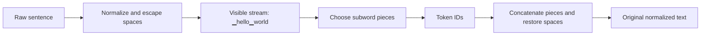
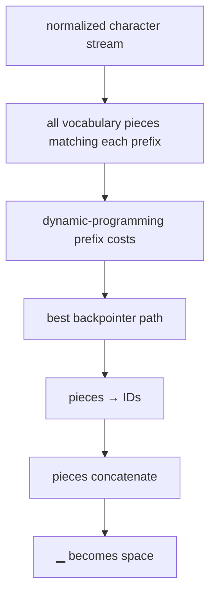
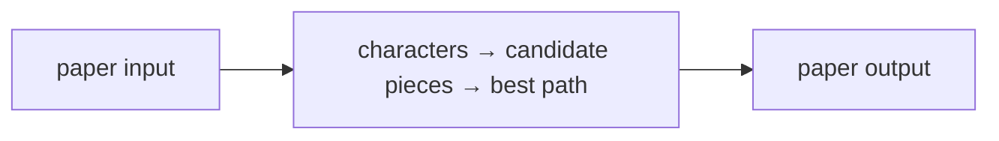
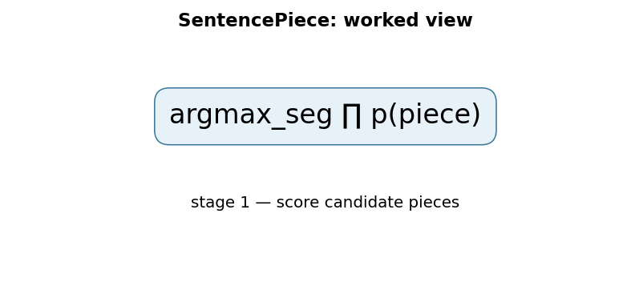

# SentencePiece: A Simple and Language Independent Subword Tokenizer and Detokenizer for Neural Text Processing

## 1. TL;DR
SentencePiece is a tokenizer framework that learns subword units directly from raw text instead of requiring a language-specific word splitter first. It makes whitespace a visible symbol, so a sequence of pieces can be concatenated and deterministically decoded back into text. This matters because a language model never sees characters or words directly: its vocabulary, lengths, costs, and failure modes all begin at tokenization. The 2018 paper provides an end-to-end, language-independent approach and open-source C++ and Python implementations for neural text processing.

## 2. Fun Map for First Years
SentencePiece turns raw text into reusable word pieces, including a visible marker for spaces. It helps a model read languages without guessing where “words” begin.

`📝 raw text → ⬜ visible spaces → 🧩 subword pieces → 🔢 token IDs`

Common pieces can be stored as larger chunks, while rare words can be assembled from smaller chunks. That avoids an unknown-word failure for unfamiliar spellings.

The word “unhappiness” might stay whole if common, or become “un”, “happi”, “ness” if those pieces explain the data better. Both training and inference use the same learned vocabulary.

💻 **CS analogy:** choosing subword pieces is a shortest-path problem over string positions, where each valid piece is an edge with a cost.

### Beginner walkthrough

Read the arrows as a sequence of responsibilities. First identify what enters
the system, then ask what the paper changes, what information is preserved or
discarded, and what leaves the operation. For **unigram subword segmentation over raw Unicode text**, the key question
is not “does the model sound clever?” but “which intermediate value carries the
new information, and what would go wrong if it were missing?”

### CS student checkpoint

The map corresponds to a small program: input data enters a function, the
paper-specific state or transformation runs, and an assertion checks **normalization, whitespace markers, and encode/decode round trips are versioned together**.
The equation `argmax_segmentation ∏p(piece)` is the compact specification for that function. Trace
one concrete item through each arrow before thinking about larger batches,
parallel hardware, or production optimizations.

## 3. Math Playground
The essential equation or rule is:

```text
p(text) = ∏ p(pieceᵢ)
```

**Essential equation:** p(text) = ∏ p(pieceᵢ). A spelling can be split in many ways; SentencePiece gives each possible piece a probability and prefers the split whose multiplied probabilities are largest. Computers use −log p instead, because multiplying many small decimals is awkward but adding costs is easy. Dynamic programming then finds the cheapest complete split, like finding the shortest route through a map.

The ∏ sign means multiply. Programs use −log p instead because adding costs is easier than multiplying many tiny decimals; dynamic programming finds the cheapest split.

A segmenter compares complete paths, not individual pieces alone: a high-probability prefix can be a bad choice if it leaves an impossible suffix. Dynamic programming keeps the best cost for each text position.

## 4. Background: What Came Before
Word tokenizers often depended on language-specific rules and produced unknown tokens for rare or misspelled words. Character tokenization avoids unknowns but makes sequences long. SentencePiece was needed to learn a language-agnostic subword vocabulary directly from raw text and make tokenization reproducible as part of a model artifact.

This supplied a language-independent middle ground between brittle whole-word vocabularies and very long character sequences.

This removed a hidden English-centric assumption that text must be split into words before a subword model can be trained.

## 5. Why It Matters
The Transformer papers in this repository begin with token IDs and embeddings. That is a useful abstraction, but it can conceal a consequential design decision: where did the IDs come from? A word vocabulary has trouble with unknown words, spelling variants, morphology, and languages that do not mark word boundaries with spaces. A character vocabulary avoids unknown words but makes sequences long. Subword tokenization is the middle ground: common sequences get compact pieces while rare words can be assembled from smaller ones.

Before SentencePiece, many subword tools assumed input was already split into words. That quietly imports an English-like assumption into the data pipeline. “Word” boundaries are not equally explicit in every writing system, and normalization or pre-tokenization rules can make training and serving disagree. Kudo and Richardson describe SentencePiece as language independent because it trains subword models from raw sentences. The paper’s English--Japanese NMT validation reports comparable accuracy to direct subword training from raw sentences, rather than treating a pre-tokenizer as a prerequisite.

The framework is often associated with the special visible whitespace character `▁`. It first escapes ordinary spaces, then treats that marker like any other character for segmentation. A sequence such as `▁hello▁world` preserves where spaces occurred. Detokenization is then simple: concatenate the pieces, replace the marker with a space, and remove the artificial leading space convention. This reversibility is operationally valuable: it prevents a downstream decoder from having to guess whether to insert a space between two output tokens.

SentencePiece is not one single vocabulary-learning objective. Its library supports both BPE-style merge vocabularies and unigram language-model vocabularies. The paper presents a framework and implementation; a careful explainer must not blur its raw-text interface with the algorithm that selected a particular vocabulary. Modern checkpoints may use SentencePiece with a unigram model, a BPE model, byte fallback, customized normalization, or special-token conventions. The serialized tokenizer model is therefore part of a checkpoint’s compatibility contract, not a disposable preprocessing detail.

## 6. Core Intuition
Imagine cutting a strip of printed text into reusable tiles. A word tokenizer owns only whole-word tiles: when it sees an unfamiliar name, it has no tile. A character tokenizer owns every letter tile: it can spell anything but must carry many tiles. A subword tokenizer owns a practical cabinet: whole common words, frequent roots, endings, punctuation, and a few small fallback pieces. It covers arbitrary text while keeping common text compact.

Now imagine that the space between words is also a tile. If someone hands you the tiles `▁hello`, `▁world`, you do not need a language-specific “insert a space after this word” rule. Put them together and the boundary is already present. This is the small but powerful SentencePiece idea: represent the input faithfully enough that segmentation and detokenization form one self-contained round trip.



A vocabulary is also a compression policy. A long piece such as `▁international` uses one ID but deserves a place only if it is frequent enough. Smaller pieces cover more cases but lengthen sequences. Training chooses a finite set of pieces; encoding chooses a segmentation from that set. The key intuition is not that the tokenizer “understands words.” It chooses a reproducible spelling of text in a learned alphabet that is useful for the downstream model.

## 7. The Mechanism
SentencePiece begins with a normalization step and a whitespace convention. A commonly shown representation prepends a space to the input and maps spaces to `▁`, making the beginning of a word visible: `hello world` becomes `▁hello▁world`. The exact normalizer is configurable and must be retained with the model. Unicode normalization, case conversion, and whitespace treatment can change the byte/character stream before segmentation; an encoder and decoder that use different versions are not compatible.

At inference, encoding chooses a sequence of vocabulary pieces whose concatenation is the normalized stream. In a unigram language-model tokenizer, each candidate piece has a probability (or negative log score), and the best segmentation minimizes the sum of negative log probabilities. Dynamic programming solves this efficiently. Let \(x_{a:b}\) be a candidate piece and \(C(b)\) the best cost for the prefix ending at index \(b\):

\[
C(b)=\min_{a<b,\,x_{a:b}\in V}\left(C(a)-\log p(x_{a:b})\right),\qquad C(0)=0.
\]

Backpointers recover the pieces that attained the minimum. The small program below implements this best-path calculation with hand-written costs. Production unigram training estimates a vocabulary from a corpus and can sample alternative segmentations for regularization; the program demonstrates only deterministic encoding, not full tokenizer training.




BPE is a different route to a subword vocabulary. It starts from small symbols and repeatedly merges frequent adjacent pairs; encoding generally applies the learned merges greedily according to their ranks. Unigram modeling starts with a large candidate set and selects/prunes pieces under a probabilistic objective, then finds a best path. Both can produce sensible segmentations such as a word stem plus suffix. Neither segmentation should be read as a linguistic parse: a boundary is chosen for vocabulary probability or merge history, not because it is necessarily a morpheme.

The visible marker addresses detokenization, but there are details around it. Newlines, tabs, repeated spaces, non-breaking spaces, and normalization rules can be preserved, collapsed, or mapped depending on configuration. Special IDs such as unknown, beginning-of-sequence, end-of-sequence, padding, and control symbols may be reserved outside normal segmentation. A tokenizer model has to specify which of these IDs are emitted, ignored, or treated as user-defined symbols. Treating the literal string `<eos>` as ordinary user text when a model expects an end marker can change generation behavior dramatically.

Subword fallback matters. If every character in a normalized input is representable, segmentation can always spell an unfamiliar word with small pieces. If not, an unknown token may replace a span; some later tokenizer configurations use byte fallback to guarantee coverage over arbitrary bytes. This is a later configuration feature, not a claim that every SentencePiece model has it. The engineering requirement is simpler: establish the model’s unknown-character behavior before accepting user input, and make it observable in logs and tests.

The original paper emphasizes self-contained processing: raw sentences are accepted directly, and detokenization restores readable text without external word-boundary logic. That makes pipelines more portable, but it does not erase normalization policy. Training data and serving inputs still need clear Unicode, whitespace, and special-token rules. “Language independent” means the framework does not require a language-specific pre-tokenizer; it does not mean every trained vocabulary performs equally well for every language or domain.

### Mechanism in Code

At implementation level, the mechanism operates on normalized characters and a piece vocabulary. A faithful
forward pass should follow this order: construct candidate edges, accumulate log scores, and backtrack the best path. Keep the intermediate
representation available while debugging; collapsing everything into one
opaque framework call makes shape and numerical errors much harder to isolate.

The key production failure to guard against is normalization changing offsets or making training and serving vocabularies disagree. Add a tiny
reference test with hand-checkable values, then add a property test that
covers padding, empty/short inputs, boundary probabilities, and the largest
supported shape. Compare intermediate tensors with tolerances appropriate to
the dtype, and log the paper-specific statistic during a canary rollout.


## 8. Practical Engineering Notes
### Worked Math & Dataflow

The compact view below makes the paper's central calculation concrete:

```text
argmax_seg ∏ p(piece)
```

In practice, the calculation is a pipeline: Tokenization is a search over possible segmentations, not simply a split on spaces. Viterbi decoding finds the highest-scoring path through candidate pieces. The important engineering
choice is to preserve the paper's intended invariant while making the operation
fit the available memory, batch size, and evaluation protocol.






The reference implementation is the `sentencepiece` package, whose `SentencePieceProcessor` loads the exact serialized `.model` file used for training. Hugging Face `transformers` and `tokenizers` wrap many SentencePiece-backed checkpoints, but the wrapper’s special tokens, chat template, and `add_special_tokens` defaults matter as much as the base piece model. Prefer loading the tokenizer from the same revision as the model weights rather than recreating one from a vocabulary list.

Never casually change tokenizer IDs under a trained embedding matrix. Token ID 42 is an index into learned input/output embeddings; swapping the tokenizer while retaining weights makes the model read one piece with another piece’s embedding. This can fail silently: tensor shapes remain valid while quality collapses. Lock tokenizer artifact hashes, normalization settings, vocabulary size, special-ID assignments, and library versions alongside a model release. Include round-trip and golden-ID tests for representative multilingual, punctuation-heavy, and chat-template strings.

Token counts are product metrics. They affect context limits, billing, batching, truncation, retrieval chunk boundaries, and latency. Do not estimate token count by splitting on spaces; that is especially misleading for code, URLs, CJK text, emoji, and unusual Unicode. Use the deployed tokenizer, with the exact special-token option that the serving path uses. For retrieval, chunk with the generation tokenizer or explicitly document the difference between embedder and generator token budgets.

Normalization is security and quality relevant. Visually similar Unicode characters can have different code points; invisible controls and whitespace variants can defeat simple string checks. A normalization policy should be explicit and tested, but avoid indiscriminate normalization that destroys meaningful user content. If a system accepts arbitrary bytes, understand whether the tokenizer uses unknown IDs or byte fallback and whether the decoding path can round-trip those inputs.

Finally, tokenization is not an authorization layer. A special-token string in user content, prompt injection payloads, or a malformed decode must be handled by application logic as well as tokenizer configuration. Test boundaries where raw text is concatenated with system prompts or tool delimiters. The tokenizer makes the input model-readable; it does not make an unsafe template safe.

Tokenizer training has its own reproducibility boundary. The corpus selection, sampling rate, normalization rules, requested vocabulary size, character coverage, and reserved symbols influence which pieces survive. A vocabulary trained on prose may use very inefficient segmentations for source code; a vocabulary trained mostly on one script may allocate poor coverage to another. Measure token-length distributions on the intended workload before treating a vocabulary size as an abstract quality number. Shorter sequences can improve throughput but are not automatically better if useful distinctions are lost or rare input becomes mostly unknown symbols.

During generation, decoding should normally be incremental and stateful at the application boundary. A single piece might begin with `▁`, contain punctuation, or be part of a multi-byte Unicode sequence after library-level decoding. Concatenating independently post-processed fragments can introduce spacing bugs. Use the tokenizer’s decode API for the complete generated ID sequence, and test stream rendering separately if tokens are surfaced to users. This is another reason to keep raw token IDs, decoded text, and stop-condition handling distinguishable in observability.

The framework also separates a normal vocabulary piece from control behavior. A user-defined symbol can be protected from splitting; a control symbol may affect an encoder without appearing as ordinary decoded text. These distinctions are model-specific. When integrating tools, retrieval citations, or multimodal placeholders, assign and validate their token behavior explicitly rather than assuming angle-bracket spelling makes a string special.

## 9. Runnable Code Example
### Run from the repository root

Prerequisites: Python 3 and the dependencies imported by [`implementations/11-sentencepiece/code/unigram_segmentation.py`](implementations/11-sentencepiece/code/unigram_segmentation.py).
The example is intentionally small enough to run on CPU; it is a teaching
implementation, not a production training or serving benchmark.

```bash
python3 implementations/11-sentencepiece/code/unigram_segmentation.py
```

### What the example demonstrates

Read the module docstring first, then follow the functions implementing
**unigram subword segmentation over raw Unicode text**. The program turns `argmax_segmentation ∏p(piece)` into executable operations,
prints a compact result, and checks that **normalization, whitespace markers, and encode/decode round trips are versioned together**. The assertion matters:
it tests the semantic contract near the mechanism instead of treating a
plausible final number as proof that the implementation is correct.

### Expected behavior and useful experiments

The command should finish without a traceback and print a successful summary
or assertion message. You should observe the paper-specific behavior, not a
particular random numeric value. Change one input at a time: inspect the
intermediate tensor or state, rerun with a boundary case, and then compare the
result with the expected invariant. A useful first experiment is to **snapshot token IDs and test round trips on punctuation, repeated spaces, and non-segmented languages**.

### Production connection

The toy program does not model every distributed or large-scale concern. In a
real service, version the preprocessing and configuration, record the relevant
intermediate statistic, and measure peak memory, throughput, p95/p99 latency,
and task quality. The first production guard should target **unknown pieces, changed normalization, or a tokenizer/model vocabulary mismatch**;
preserve a transparent reference path or a canary comparison before replacing
it with a fused, distributed, or highly optimized implementation.

## 10. Common Misconceptions & Pitfalls
- **Misconception: `argmax_segmentation ∏p(piece)` is the whole implementation.** The equation describes the paper's central relationship, but `unigram subword segmentation over raw Unicode text` also requires explicit input contracts, ordering, masking or sampling rules, and numerical choices. If those details are left implicit, two implementations can share the same formula and still produce different results. Treat the equation as a contract and document each intermediate tensor or state transition.
- **Misconception: the mechanism is automatically reliable when the final metric looks good.** A model can compensate for a wrong reduction, stale state, or malformed edge/token boundary on common examples. The local guard is **normalization, whitespace markers, and encode/decode round trips are versioned together**. Check it on a tiny hand-worked fixture and on adversarial inputs before trusting an aggregate benchmark.
- **Pitfall: optimizing the operation before measuring its actual bottleneck.** For this paper, watch for **unknown pieces, changed normalization, or a tokenizer/model vocabulary mismatch** rather than assuming the largest theoretical term dominates every workload. Record memory, bandwidth, batch shape, tail latency, and quality slices. An optimization is only safe when it preserves the paper-specific contract and has a rollback path.
- **Pitfall: debugging only the final prediction.** Start with **snapshot token IDs and test round trips on punctuation, repeated spaces, and non-segmented languages**; compare intermediate values with a simple reference. Freeze preprocessing, configuration, seeds, and model versions; then bisect the first divergence. This makes a failure reproducible and distinguishes data-contract errors from numerical instability, integration bugs, and a genuinely unsuitable paper mechanism.

## 11. Quick Concept Checks
**Q:** What is the central idea behind **unigram subword segmentation over raw Unicode text**?
**A:** It is a structured data or optimization path, not a slogan: inputs are transformed, paper-specific relationships are computed, invalid choices are excluded when necessary, and the result is aggregated into an output or objective. The important implementation question is which intermediate values must remain observable so a reviewer can connect the code to the paper.

**Q:** How should I read `argmax_segmentation ∏p(piece)`?
**A:** Read each symbol as an operation with a shape, a data source, and a numerical range. Ask what changes when its scale, temperature, rank, timestep, neighborhood, or other paper-specific value changes. Then make a two- or three-example fixture where the expected result can be calculated by hand; this catches notation-to-code misunderstandings early.

**Q:** What invariant must a correct implementation preserve?
**A:** It must preserve **normalization, whitespace markers, and encode/decode round trips are versioned together**. This is stronger than asking whether accuracy improved because it is local, deterministic, and testable near the operation that could be wrong. Assert it at the boundary, compare against a small reference implementation, and include the unusual input shape most likely to violate it in production.

**Q:** What is the most dangerous failure mode?
**A:** The first risk to investigate is **unknown pieces, changed normalization, or a tokenizer/model vocabulary mismatch**. It can produce plausible outputs while degrading only a slice of traffic, so monitor a paper-specific statistic alongside quality and system metrics. A canary should compare the old and new paths on identical inputs and should retain enough intermediate diagnostics to explain a regression.

**Q:** How would I test this idea beyond a happy-path unit test?
**A:** Begin with **snapshot token IDs and test round trips on punctuation, repeated spaces, and non-segmented languages**, then add differential tests against a transparent reference on small randomized inputs. Cover boundaries such as padding, termination, empty neighborhoods, long sequences, rare tokens, extreme values, or duplicated examples when they apply. Test both output values and gradients or state updates when training behavior is part of the paper's claim.

**Q:** What should I remember when applying the paper in a real system?
**A:** Keep the paper's assumptions in the production contract: version the preprocessing and configuration, expose the relevant intermediate statistic, and define quality slices before tuning performance. Compare throughput, peak memory, p95/p99 latency, and task quality against a baseline. The paper is useful only when its mechanism remains correct under the workload and failure modes you actually operate.

## 12. Interview Q&A
**Q:** Walk through **unigram subword segmentation over raw Unicode text** end to end. How would you implement `argmax_segmentation ∏p(piece)`?
**A:** Decompose the expression into the actual data path: inputs enter the paper-specific transformation, intermediate scores or states are computed, invalid elements are excluded, and the result is reduced into the output or loss. For this paper, `argmax_segmentation ∏p(piece)` is an executable contract, not decoration: document tensor shapes, ownership of mutable state, numerical precision, and where batching changes semantics. Keep a small reference implementation beside the optimized path so a reviewer can connect each line of `code` to one term in the equation.

**Follow-up:** What invariant would you assert, and why is it stronger than checking final accuracy?
**A:** Assert that **normalization, whitespace markers, and encode/decode round trips are versioned together**. That property is local enough to fail near the defect, whereas accuracy can remain acceptable while a mask, reduction, or state boundary is wrong on a rare input. Add a hand-computed fixture, a randomized differential test against the reference, and shape/dtype assertions at the API boundary. The test should also cover an empty, padded, terminal, high-degree, long-context, or otherwise adversarial case when that input is meaningful for this mechanism.

**Q:** What is the main production trade-off in this paper, and how would you capacity-plan it?
**A:** The central trade-off is that **the mechanism changes both quality behavior and resource use**. Capacity planning therefore needs more than average FLOPs: measure peak memory, memory bandwidth, communication, preprocessing, batch-size sensitivity, and p95/p99 latency on representative distributions. Define a quality budget before optimizing, then compare a simple baseline with the paper mechanism using identical inputs and seeds. A faster path that silently changes tokenization, routing, masking, sampling, or optimization behavior is not an acceptable optimization until its quality impact is measured.

**Follow-up:** Which failure mode would make you roll back first?
**A:** Roll back on evidence of **unknown pieces, changed normalization, or a tokenizer/model vocabulary mismatch**, especially when the symptom is silent and outputs still look plausible. Add dashboards for the paper-specific statistic, error and timeout rates, resource saturation, and a task metric sliced by difficult inputs. Use a canary or shadow comparison with the previous implementation, retain the old path behind a flag, and make the rollback decision threshold explicit before deployment. The important SDE2 judgment is to protect the paper’s semantic contract, not merely to chase a faster benchmark.

**Q:** A model passes unit tests but fails in production. What is your debugging plan?
**A:** Start with **snapshot token IDs and test round trips on punctuation, repeated spaces, and non-segmented languages**. Reproduce the smallest production-shaped example, freeze the model and preprocessing versions, and compare intermediate tensors or records rather than only the final prediction. Check data contracts, masks, sequence boundaries, random seeds, numerical precision, and serving mode in that order; then bisect between the reference and optimized implementations. If the defect is not numerical, run a controlled ablation that removes the paper-specific mechanism and compare the resulting failure rate, which separates integration problems from a bad mechanism or configuration.

**Follow-up:** What evidence would you present in the review or postmortem?
**A:** Present one minimal failing input, the expected **normalization, whitespace markers, and encode/decode round trips are versioned together**, the first intermediate value that diverged, and the regression test that now protects it. Include a before/after table for task quality, memory, throughput, p95/p99 latency, and cost, with slices for the failure population. A complete SDE2 answer also states the rollout guard, owner, and alert threshold. That turns a paper idea into an operable system rather than a one-line claim about an equation.

## 13. Further Reading
- [Original SentencePiece paper](https://arxiv.org/abs/1808.06226)
- [SentencePiece source repository](https://github.com/google/sentencepiece)
- [Hugging Face tokenizers documentation](https://huggingface.co/docs/tokenizers/)
- [Subword regularization paper](https://arxiv.org/abs/1804.10959)
