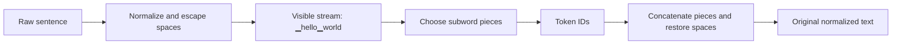
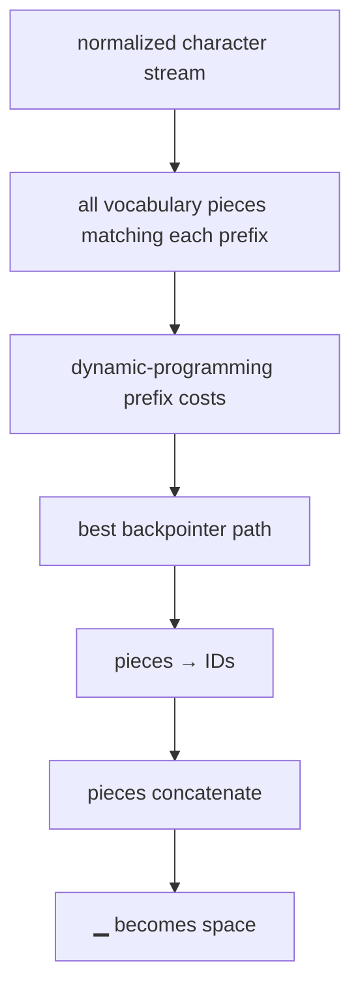

# SentencePiece: A Simple and Language Independent Subword Tokenizer and Detokenizer for Neural Text Processing

## TL;DR

SentencePiece is a tokenizer framework that learns subword units directly from raw text instead of requiring a language-specific word splitter first. It makes whitespace a visible symbol, so a sequence of pieces can be concatenated and deterministically decoded back into text. This matters because a language model never sees characters or words directly: its vocabulary, lengths, costs, and failure modes all begin at tokenization. The 2018 paper provides an end-to-end, language-independent approach and open-source C++ and Python implementations for neural text processing.

## Fun Map for First Years 🧭

SentencePiece turns raw text into reusable word pieces, including a visible marker for spaces. It helps a model read languages without guessing where “words” begin.

`📝 raw text → ⬜ visible spaces → 🧩 subword pieces → 🔢 token IDs`

Common pieces can be stored as larger chunks, while rare words can be assembled from smaller chunks. That avoids an unknown-word failure for unfamiliar spellings.

The word “unhappiness” might stay whole if common, or become “un”, “happi”, “ness” if those pieces explain the data better. Both training and inference use the same learned vocabulary.

💻 **CS analogy:** choosing subword pieces is a shortest-path problem over string positions, where each valid piece is an edge with a cost.

## Math Playground 🧮

The essential equation or rule is:

```text
p(text) = ∏ p(pieceᵢ)
```

**Essential equation:** p(text) = ∏ p(pieceᵢ). A spelling can be split in many ways; SentencePiece gives each possible piece a probability and prefers the split whose multiplied probabilities are largest. Computers use −log p instead, because multiplying many small decimals is awkward but adding costs is easy. Dynamic programming then finds the cheapest complete split, like finding the shortest route through a map.

The ∏ sign means multiply. Programs use −log p instead because adding costs is easier than multiplying many tiny decimals; dynamic programming finds the cheapest split.

A segmenter compares complete paths, not individual pieces alone: a high-probability prefix can be a bad choice if it leaves an impossible suffix. Dynamic programming keeps the best cost for each text position.

## Background: What Came Before 🕰️

Word tokenizers often depended on language-specific rules and produced unknown tokens for rare or misspelled words. Character tokenization avoids unknowns but makes sequences long. SentencePiece was needed to learn a language-agnostic subword vocabulary directly from raw text and make tokenization reproducible as part of a model artifact.

This supplied a language-independent middle ground between brittle whole-word vocabularies and very long character sequences.

This removed a hidden English-centric assumption that text must be split into words before a subword model can be trained.

## Why It Matters

The Transformer papers in this repository begin with token IDs and embeddings. That is a useful abstraction, but it can conceal a consequential design decision: where did the IDs come from? A word vocabulary has trouble with unknown words, spelling variants, morphology, and languages that do not mark word boundaries with spaces. A character vocabulary avoids unknown words but makes sequences long. Subword tokenization is the middle ground: common sequences get compact pieces while rare words can be assembled from smaller ones.

Before SentencePiece, many subword tools assumed input was already split into words. That quietly imports an English-like assumption into the data pipeline. “Word” boundaries are not equally explicit in every writing system, and normalization or pre-tokenization rules can make training and serving disagree. Kudo and Richardson describe SentencePiece as language independent because it trains subword models from raw sentences. The paper’s English--Japanese NMT validation reports comparable accuracy to direct subword training from raw sentences, rather than treating a pre-tokenizer as a prerequisite.

The framework is often associated with the special visible whitespace character `▁`. It first escapes ordinary spaces, then treats that marker like any other character for segmentation. A sequence such as `▁hello▁world` preserves where spaces occurred. Detokenization is then simple: concatenate the pieces, replace the marker with a space, and remove the artificial leading space convention. This reversibility is operationally valuable: it prevents a downstream decoder from having to guess whether to insert a space between two output tokens.

SentencePiece is not one single vocabulary-learning objective. Its library supports both BPE-style merge vocabularies and unigram language-model vocabularies. The paper presents a framework and implementation; a careful explainer must not blur its raw-text interface with the algorithm that selected a particular vocabulary. Modern checkpoints may use SentencePiece with a unigram model, a BPE model, byte fallback, customized normalization, or special-token conventions. The serialized tokenizer model is therefore part of a checkpoint’s compatibility contract, not a disposable preprocessing detail.

## Core Intuition

Imagine cutting a strip of printed text into reusable tiles. A word tokenizer owns only whole-word tiles: when it sees an unfamiliar name, it has no tile. A character tokenizer owns every letter tile: it can spell anything but must carry many tiles. A subword tokenizer owns a practical cabinet: whole common words, frequent roots, endings, punctuation, and a few small fallback pieces. It covers arbitrary text while keeping common text compact.

Now imagine that the space between words is also a tile. If someone hands you the tiles `▁hello`, `▁world`, you do not need a language-specific “insert a space after this word” rule. Put them together and the boundary is already present. This is the small but powerful SentencePiece idea: represent the input faithfully enough that segmentation and detokenization form one self-contained round trip.



A vocabulary is also a compression policy. A long piece such as `▁international` uses one ID but deserves a place only if it is frequent enough. Smaller pieces cover more cases but lengthen sequences. Training chooses a finite set of pieces; encoding chooses a segmentation from that set. The key intuition is not that the tokenizer “understands words.” It chooses a reproducible spelling of text in a learned alphabet that is useful for the downstream model.

## The Mechanism

SentencePiece begins with a normalization step and a whitespace convention. A commonly shown representation prepends a space to the input and maps spaces to `▁`, making the beginning of a word visible: `hello world` becomes `▁hello▁world`. The exact normalizer is configurable and must be retained with the model. Unicode normalization, case conversion, and whitespace treatment can change the byte/character stream before segmentation; an encoder and decoder that use different versions are not compatible.

At inference, encoding chooses a sequence of vocabulary pieces whose concatenation is the normalized stream. In a unigram language-model tokenizer, each candidate piece has a probability (or negative log score), and the best segmentation minimizes the sum of negative log probabilities. Dynamic programming solves this efficiently. Let \(x_{a:b}\) be a candidate piece and \(C(b)\) the best cost for the prefix ending at index \(b\):

\[
C(b)=\min_{a<b,\,x_{a:b}\in V}\left(C(a)-\log p(x_{a:b})\right),\qquad C(0)=0.
\]

Backpointers recover the pieces that attained the minimum. The small program below implements this best-path calculation with hand-written costs. Production unigram training estimates a vocabulary from a corpus and can sample alternative segmentations for regularization; the program demonstrates only deterministic encoding, not full tokenizer training.




BPE is a different route to a subword vocabulary. It starts from small symbols and repeatedly merges frequent adjacent pairs; encoding generally applies the learned merges greedily according to their ranks. Unigram modeling starts with a large candidate set and selects/prunes pieces under a probabilistic objective, then finds a best path. Both can produce sensible segmentations such as a word stem plus suffix. Neither segmentation should be read as a linguistic parse: a boundary is chosen for vocabulary probability or merge history, not because it is necessarily a morpheme.

The visible marker addresses detokenization, but there are details around it. Newlines, tabs, repeated spaces, non-breaking spaces, and normalization rules can be preserved, collapsed, or mapped depending on configuration. Special IDs such as unknown, beginning-of-sequence, end-of-sequence, padding, and control symbols may be reserved outside normal segmentation. A tokenizer model has to specify which of these IDs are emitted, ignored, or treated as user-defined symbols. Treating the literal string `<eos>` as ordinary user text when a model expects an end marker can change generation behavior dramatically.

Subword fallback matters. If every character in a normalized input is representable, segmentation can always spell an unfamiliar word with small pieces. If not, an unknown token may replace a span; some later tokenizer configurations use byte fallback to guarantee coverage over arbitrary bytes. This is a later configuration feature, not a claim that every SentencePiece model has it. The engineering requirement is simpler: establish the model’s unknown-character behavior before accepting user input, and make it observable in logs and tests.

The original paper emphasizes self-contained processing: raw sentences are accepted directly, and detokenization restores readable text without external word-boundary logic. That makes pipelines more portable, but it does not erase normalization policy. Training data and serving inputs still need clear Unicode, whitespace, and special-token rules. “Language independent” means the framework does not require a language-specific pre-tokenizer; it does not mean every trained vocabulary performs equally well for every language or domain.

## Practical Engineering Notes

The reference implementation is the `sentencepiece` package, whose `SentencePieceProcessor` loads the exact serialized `.model` file used for training. Hugging Face `transformers` and `tokenizers` wrap many SentencePiece-backed checkpoints, but the wrapper’s special tokens, chat template, and `add_special_tokens` defaults matter as much as the base piece model. Prefer loading the tokenizer from the same revision as the model weights rather than recreating one from a vocabulary list.

Never casually change tokenizer IDs under a trained embedding matrix. Token ID 42 is an index into learned input/output embeddings; swapping the tokenizer while retaining weights makes the model read one piece with another piece’s embedding. This can fail silently: tensor shapes remain valid while quality collapses. Lock tokenizer artifact hashes, normalization settings, vocabulary size, special-ID assignments, and library versions alongside a model release. Include round-trip and golden-ID tests for representative multilingual, punctuation-heavy, and chat-template strings.

Token counts are product metrics. They affect context limits, billing, batching, truncation, retrieval chunk boundaries, and latency. Do not estimate token count by splitting on spaces; that is especially misleading for code, URLs, CJK text, emoji, and unusual Unicode. Use the deployed tokenizer, with the exact special-token option that the serving path uses. For retrieval, chunk with the generation tokenizer or explicitly document the difference between embedder and generator token budgets.

Normalization is security and quality relevant. Visually similar Unicode characters can have different code points; invisible controls and whitespace variants can defeat simple string checks. A normalization policy should be explicit and tested, but avoid indiscriminate normalization that destroys meaningful user content. If a system accepts arbitrary bytes, understand whether the tokenizer uses unknown IDs or byte fallback and whether the decoding path can round-trip those inputs.

Finally, tokenization is not an authorization layer. A special-token string in user content, prompt injection payloads, or a malformed decode must be handled by application logic as well as tokenizer configuration. Test boundaries where raw text is concatenated with system prompts or tool delimiters. The tokenizer makes the input model-readable; it does not make an unsafe template safe.

Tokenizer training has its own reproducibility boundary. The corpus selection, sampling rate, normalization rules, requested vocabulary size, character coverage, and reserved symbols influence which pieces survive. A vocabulary trained on prose may use very inefficient segmentations for source code; a vocabulary trained mostly on one script may allocate poor coverage to another. Measure token-length distributions on the intended workload before treating a vocabulary size as an abstract quality number. Shorter sequences can improve throughput but are not automatically better if useful distinctions are lost or rare input becomes mostly unknown symbols.

During generation, decoding should normally be incremental and stateful at the application boundary. A single piece might begin with `▁`, contain punctuation, or be part of a multi-byte Unicode sequence after library-level decoding. Concatenating independently post-processed fragments can introduce spacing bugs. Use the tokenizer’s decode API for the complete generated ID sequence, and test stream rendering separately if tokens are surfaced to users. This is another reason to keep raw token IDs, decoded text, and stop-condition handling distinguishable in observability.

The framework also separates a normal vocabulary piece from control behavior. A user-defined symbol can be protected from splitting; a control symbol may affect an encoder without appearing as ordinary decoded text. These distinctions are model-specific. When integrating tools, retrieval citations, or multimodal placeholders, assign and validate their token behavior explicitly rather than assuming angle-bracket spelling makes a string special.

## Runnable Code Example

### Run it

The implementation is intentionally small and self-checking. From the repository root, use Python 3; the module docstring states the learning goal, comments identify the paper-specific calculation, and assertions verify the toy invariant.

```bash
python3 papers/11-sentencepiece/code/unigram_segmentation.py
```

### Read it in order

Start with the module docstring, then follow the named helper calculations and the final assertions. The example is a dependency-light teaching implementation, not a production training system; change one input at a time and rerun it to see which invariant changes.


[`code/unigram_segmentation.py`](code/unigram_segmentation.py) implements a tiny Viterbi-style best-path segmenter over the visible-whitespace string `▁hello▁world`. Its vocabulary includes both compact word-with-space pieces and smaller fallback pieces. The program asserts that concatenating the winning pieces restores the normalized stream, decoding restores `hello world`, and the selected path scores no worse than a known valid fallback.

```bash
python3 papers/11-sentencepiece/code/unigram_segmentation.py
```

It is intentionally not a replacement for SentencePiece training. Its invariant exposes the mechanism a production tokenizer relies on: segmentation may choose among pieces, but decoding must preserve the normalized text exactly.

## Common Misconceptions & Pitfalls

- **“SentencePiece is a tokenizer algorithm synonymous with BPE.”** SentencePiece is a raw-text tokenizer framework; it supports BPE and unigram-model approaches with different training and encoding behavior.
- **“The `▁` character is decoration.”** It represents escaped whitespace, allowing concatenation-based detokenization without a separate word-boundary rule.
- **“Subword pieces are linguistically correct morphemes.”** They are statistical vocabulary units and can split or join text in non-linguistic ways.
- **“A tokenizer can be swapped without retraining.”** Its IDs index learned embeddings, so a changed tokenizer changes the model’s input alphabet.

## Interview Q&A

**Q:** Why does SentencePiece use a visible whitespace marker?
**A:** It preserves word boundaries in the character stream, so concatenating decoded pieces can restore spaces deterministically.

**Q:** What does language independent mean here?
**A:** The pipeline trains from raw sentences without requiring a language-specific word splitter; vocabulary quality still depends on its corpus.

**Q:** How does unigram encoding select pieces?
**A:** It finds a lowest-cost segmentation under learned piece probabilities, commonly with dynamic programming.

**Q:** How is BPE different?
**A:** BPE learns ranked merges from small symbols, whereas unigram modeling selects pieces under a probabilistic vocabulary objective.

**Q:** What must ship with a model checkpoint?
**A:** The exact tokenizer model and configuration, special-token mapping, normalizer behavior, and ideally a tested wrapper revision.

## Further Reading

- [Original SentencePiece paper](https://arxiv.org/abs/1808.06226)
- [SentencePiece source repository](https://github.com/google/sentencepiece)
- [Hugging Face tokenizers documentation](https://huggingface.co/docs/tokenizers/)
- [Subword regularization paper](https://arxiv.org/abs/1804.10959)
