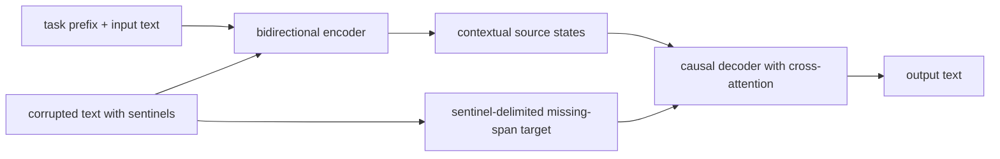
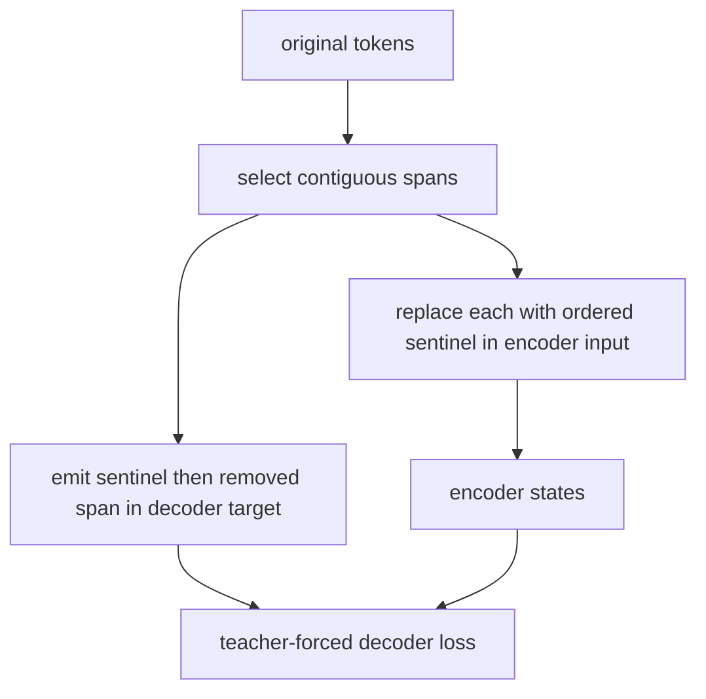
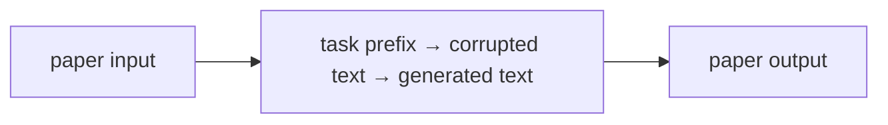

# Exploring the Limits of Transfer Learning with a Unified Text-to-Text Transformer (T5)

## TL;DR

T5 casts every NLP task as text in and text out: a prompt-like prefix identifies the task, and one encoder–decoder Transformer produces the answer. It supplies the missing third major Transformer family beside BERT’s encoder-only design and GPT’s decoder-only design. Its pre-training objective removes contiguous spans and asks the decoder to generate them, marked by ordered sentinel tokens. The paper is also a broad transfer-learning study: it compares objectives, architectures, data, and fine-tuning choices rather than presenting only one architectural novelty.

## Fun Map for First Years 🧭

T5 treats every language task as text in and text out. It practices repairing missing spans, then can translate, summarize, or answer using the same interface.

`📥 task text → 🧠 encoder understands → ✍️ decoder writes → 📤 task answer`

The same interface handles translation, summarization, and classification: give text in and ask for text out. A task prefix tells the model which job the input requests.

A classification input can be written as “sentiment: this film is great” and the output as “positive”; translation and summarization use the same input-to-output contract. The architecture need not change for each case.

💻 **CS analogy:** span corruption is like replacing missing substrings with numbered placeholders, then asking a decoder to emit the patch file in order.

## Math Playground 🧮

The essential equation or rule is:

```text
p(y|x) = ∏ p(yᵢ | earlier y, x)
```

**Essential equation:** p(y|x) = ∏ p(yᵢ | earlier y, x). To write output y from input x, T5 predicts one output token at a time. Each new prediction sees the original input and the output tokens already written. It is like completing a sentence while keeping both the question and your partial answer visible.

The ∏ sign means predict every output token in order. Each prediction sees both the original input and the answer already written.

For each output position, the model conditions on x and all earlier y tokens. That is why decoding is sequential: it cannot know the next output token until it has chosen the previous one.

## Background: What Came Before 🕰️

NLP systems used many different architectures and objectives for classification, translation, question answering, and summarization. That made transfer experiments hard to compare and implementations hard to reuse. T5 was needed to frame every task as text-to-text, so one encoder–decoder recipe and one training objective could cover them all.

This was needed because task-specific output heads and formats made transfer-learning systems harder to compare and reuse.

The text-to-text framing made experiments more comparable and made one model family easier to reuse across many NLP tasks.

## Why It Matters

Papers 02 and 03 establish two powerful but different patterns. BERT’s bidirectional encoder produces a representation that task-specific heads consume; GPT-style models predict the next token from a causal decoder. Before T5, benchmark practice often reflected this difference with a collection of custom heads, label mappings, and task-specific output formats. Classification might use a linear head, extractive QA might predict two positions, and translation might use a separate seq2seq model. The interface complexity makes transfer-learning comparisons harder than they need to be.

Raffel et al. propose a deliberately uniform contract: convert a task to a string and train a model to emit a string. For sentiment, an input might be `sst2 sentence: ...` and an output `positive`; for translation, the prefix names source and target languages; for summarization, the input names the operation and the output is the summary. This does not make every task equally easy, but it puts tokenization, loss computation, decoding, and model architecture on one reusable path.

The paper’s abstract describes a systematic study over dozens of language-understanding tasks, comparing pre-training objectives, architectures, unlabeled datasets, transfer methods, and other factors. Combining those findings with scale and the Colossal Clean Crawled Corpus (C4), it reports state-of-the-art results on tasks including summarization, QA, and classification. This makes T5 essential historically: it is both an encoder–decoder model family and a methodology for asking which transfer-learning choices matter.

T5 also connects to later papers in this collection. Switch Transformer is built from T5-Base and T5-Large variants, while RAG’s original formulation uses a pre-trained seq2seq generator. The point is not that every modern text model is T5. Decoder-only LLMs dominate many chat settings because their simple autoregressive interface scales and serves well. T5 remains a clear explanation of when an encoder can read all source text before a decoder generates a potentially different target sequence.

## Core Intuition

Think of a workshop with one intake desk and one output desk. The intake desk reads the complete work order before any work starts; that is the encoder. The output desk writes the result one item at a time while consulting the intake desk’s notes; that is the decoder. A translation order, a classification order, and a summarization order use the same desks because each can be written as a request and a textual response.

Span corruption trains the workshop like a document-restoration game. Someone removes several strips from a page and puts numbered blank labels in their places. The encoder sees the damaged page. The decoder writes a compact answer sheet: label zero followed by its missing words, label one followed by its missing words, and a final label. It need not reproduce all the untouched words, so training emphasizes reconstructing the informative missing spans.



The prefix is a label written in ordinary text, not a different neural head. This has practical charm: adding a task can look like adding examples to a shared API. But the model only follows the convention it learned. A poorly chosen prefix, ambiguous label spelling, or template mismatch is still a data-contract bug.

## The Mechanism

T5 uses an encoder–decoder Transformer. The encoder applies self-attention without a causal restriction over the source sequence, so each source token can incorporate information from both left and right context. The decoder predicts target token \(y_t\) autoregressively. Its masked self-attention sees earlier target tokens, and cross-attention queries the encoder’s source states. Training minimizes the standard conditional negative log likelihood:

\[
-\sum_{t=1}^{|y|}\log p_\theta(y_t\mid y_{<t},x).
\]

This makes the architecture naturally asymmetric: the source can be fully read once, while the target is generated step by step. It is suited to tasks where input and output have different lengths or forms. BERT does not have this autoregressive decoder; a decoder-only model represents the source as a prefix in its single causal stream rather than producing a separate encoded memory.

T5’s pre-training uses a denoising objective called span corruption. Random contiguous spans are removed from the input and each replaced with a unique sentinel token such as `<extra_id_0>`. The target concatenates the sentinels and removed spans in order, ending with the next sentinel. For example, `the small cat sat on the warm mat` can become source `the <extra_id_0> sat on <extra_id_1> mat` and target `<extra_id_0> small cat <extra_id_1> the warm <extra_id_2>`. A decoder output can therefore identify which gap each recovered content belongs to.




The sentinels are not ordinary mask tokens. BERT’s masked-language modeling replaces selected tokens and predicts them from encoder representations, commonly one position at a time. T5 asks a decoder to generate an ordered sequence of missing spans, compressing the target by omitting uncorrupted content. This differs from later instruction fine-tuning, where an input instruction and target response may be human-authored rather than a corrupted version of the same document.

The paper investigates a number of design choices, so resist attributing every later T5 configuration to the original “T5” label. Its relative-position bias, pre-normalization pattern, feed-forward architecture, vocabulary, and C4 corpus are part of a particular family and experimental study. T5.1.1, FLAN-T5, UL2, and other descendants make additional choices. When reproducing a result, use the actual model card/configuration and the paper version being cited rather than combining details across descendants.

Task prefixes create a simple multi-task interface but not a formal schema. Text labels must be canonicalized: `entailment` and `yes` are distinct targets even if a human considers them equivalent. Evaluation needs to map decoded strings back to task labels carefully and reject unexpected strings instead of silently coercing them. For generation tasks, decoding strategy changes output quality and cost; for classification framed as generation, a constrained vocabulary or log-probability comparison may be more reliable than unconstrained free decoding.

### Mechanism in Code

At implementation level, the mechanism operates on task-prefixed text and sentinel-marked spans. A faithful
forward pass should follow this order: encode corrupted input, autoregressively decode sentinel targets, and stop at EOS. Keep the intermediate
representation available while debugging; collapsing everything into one
opaque framework call makes shape and numerical errors much harder to isolate.

The key production failure to guard against is treating textual labels as free-form strings without exact evaluation rules. Add a tiny
reference test with hand-checkable values, then add a property test that
covers padding, empty/short inputs, boundary probabilities, and the largest
supported shape. Compare intermediate tensors with tolerances appropriate to
the dtype, and log the paper-specific statistic during a canary rollout.


## Practical Engineering Notes

### Worked Math & Dataflow

The compact view below makes the paper's central calculation concrete:

```text
text → text
```

In practice, the calculation is a pipeline: The same encoder-decoder interface can express classification, translation, and summarization by changing the textual task prefix. Sentinel tokens mark missing spans and delimit the target. The important engineering
choice is to preserve the paper's intended invariant while making the operation
fit the available memory, batch size, and evaluation protocol.




Hugging Face exposes T5 through `T5ForConditionalGeneration` and tokenizer/model classes whose checkpoint revision should be kept together. Training labels use `-100` for ignored padding positions in the common PyTorch loss path; accidentally supervising pad tokens changes gradients and masks quality issues. The decoder is normally seeded by a start token according to the model configuration, so avoid hand-building decoder inputs unless you understand the shifting convention.

For denoising pre-training, use a T5-compatible span-corruption collator rather than ordinary token masking. It must create non-overlapping spans, ordered sentinels, a source sequence within the encoder limit, and a target sequence within the decoder limit. The sentinel inventory is finite and is part of the tokenizer vocabulary. A corruption pipeline that reuses one sentinel for multiple spans destroys the reconstruction correspondence while still producing plausible tensors.

At serving time encoder–decoder models have different cost profiles from decoder-only models. The encoder runs once over the source, then every decoder step includes cross-attention over source states. Beam search can improve some sequence tasks but multiplies decoder-state and KV-cache work. Cache encoder outputs per request, batch compatible decoding lengths, cap source and target separately, and measure latency under real prompt distributions rather than only token throughput.

`t5x` is a useful forward pointer for large-scale T5-style training, while `transformers` is the common application integration. Treat task prompts/templates as versioned artifacts: a whitespace or prefix change can be an input-distribution change. For evaluation, retain raw output, normalized output, and task parser result so a failure can be traced to generation, label normalization, or scoring rather than reported as one opaque accuracy number.

The text-to-text abstraction is particularly useful at system boundaries. A data service can expose one record shape—input text, target text, task name—rather than a different tensor schema for every downstream benchmark. That reduces boilerplate, but it moves semantic responsibility into strings. Establish a stable delimiter policy for user-provided text, escape or quote fields when needed, and test examples where an input contains a phrase resembling a task prefix. The model has no parser that inherently knows which substring is instruction and which is quoted content.

Sequence budgets require two numbers. The encoder source limit controls how much evidence can be read; the decoder target limit controls how much answer can be written. Truncating the source can remove a crucial fact, while truncating labels or targets during fine-tuning teaches an incomplete output. Track both distributions, including the number of discarded source and target tokens, and make truncation direction task-specific. A summarizer may preserve a beginning differently from a document QA system, while neither policy should be implicit.

Span corruption also provides a useful test oracle. Given original tokens, selected spans, and an ordered target, reconstruction should be exact. Unit-test adjacent spans, a span at the beginning or end, and examples whose target reaches the final sentinel. Randomized corruption without a reproducible seed can make data debugging needlessly hard; log the seed or chosen span indices for failed batches. In distributed training, ensure all workers follow the same tokenizer/sentinel configuration even if their random span locations differ.

For fine-tuning, distinguish teacher-forced likelihood from generation-time quality. A model can obtain good loss by predicting the next target token under a gold prefix yet make poor free-running outputs because its own earlier errors alter later context. Evaluate with the intended decoding strategy and task metric. Conversely, optimize no more decoding than the task needs: a label task can score a small candidate set directly, whereas a summarization task needs robust EOS stopping, repetition handling, and output-length safeguards.

The unified interface does not eliminate data licensing, corpus filtering, or contamination concerns. C4 is a web-derived corpus construction and the paper’s result must be read in that experimental context. When adapting T5-like models, record the data mixture and evaluation overlap policy just as carefully as model hyperparameters. Transfer learning is a workflow spanning data, pre-training, formatting, and evaluation—not merely a call to `generate`.

## Runnable Code Example

### Run from the repository root

Prerequisites: Python 3 and the dependencies imported by [`implementations/12-t5/code/span_corruption.py`](implementations/12-t5/code/span_corruption.py).
The example is intentionally small enough to run on CPU; it is a teaching
implementation, not a production training or serving benchmark.

```bash
python3 implementations/12-t5/code/span_corruption.py
```

### What the example demonstrates

Read the module docstring first, then follow the functions implementing
**text-to-text transfer learning with task prefixes**. The program turns `input text → target text` into executable operations,
prints a compact result, and checks that **task prefix, target formatting, and special-token boundaries remain part of the model contract**. The assertion matters:
it tests the semantic contract near the mechanism instead of treating a
plausible final number as proof that the implementation is correct.

### Expected behavior and useful experiments

The command should finish without a traceback and print a successful summary
or assertion message. You should observe the paper-specific behavior, not a
particular random numeric value. Change one input at a time: inspect the
intermediate tensor or state, rerun with a boundary case, and then compare the
result with the expected invariant. A useful first experiment is to **test exact target formatting and run task-balanced validation for every supported prefix**.

### Production connection

The toy program does not model every distributed or large-scale concern. In a
real service, version the preprocessing and configuration, record the relevant
intermediate statistic, and measure peak memory, throughput, p95/p99 latency,
and task quality. The first production guard should target **a prefix or output-format regression that hides behind aggregate metrics**;
preserve a transparent reference path or a canary comparison before replacing
it with a fused, distributed, or highly optimized implementation.

## Common Misconceptions & Pitfalls

- **Misconception: `input text → target text` is the whole implementation.** The equation describes the paper's central relationship, but `text-to-text transfer learning with task prefixes` also requires explicit input contracts, ordering, masking or sampling rules, and numerical choices. If those details are left implicit, two implementations can share the same formula and still produce different results. Treat the equation as a contract and document each intermediate tensor or state transition.
- **Misconception: the mechanism is automatically reliable when the final metric looks good.** A model can compensate for a wrong reduction, stale state, or malformed edge/token boundary on common examples. The local guard is **task prefix, target formatting, and special-token boundaries remain part of the model contract**. Check it on a tiny hand-worked fixture and on adversarial inputs before trusting an aggregate benchmark.
- **Pitfall: optimizing the operation before measuring its actual bottleneck.** For this paper, watch for **a prefix or output-format regression that hides behind aggregate metrics** rather than assuming the largest theoretical term dominates every workload. Record memory, bandwidth, batch shape, tail latency, and quality slices. An optimization is only safe when it preserves the paper-specific contract and has a rollback path.
- **Pitfall: debugging only the final prediction.** Start with **test exact target formatting and run task-balanced validation for every supported prefix**; compare intermediate values with a simple reference. Freeze preprocessing, configuration, seeds, and model versions; then bisect the first divergence. This makes a failure reproducible and distinguishes data-contract errors from numerical instability, integration bugs, and a genuinely unsuitable paper mechanism.

## Quick Concept Checks

**Q:** What is the central idea behind **text-to-text transfer learning with task prefixes**?
**A:** It is a structured data or optimization path, not a slogan: inputs are transformed, paper-specific relationships are computed, invalid choices are excluded when necessary, and the result is aggregated into an output or objective. The important implementation question is which intermediate values must remain observable so a reviewer can connect the code to the paper.

**Q:** How should I read `input text → target text`?
**A:** Read each symbol as an operation with a shape, a data source, and a numerical range. Ask what changes when its scale, temperature, rank, timestep, neighborhood, or other paper-specific value changes. Then make a two- or three-example fixture where the expected result can be calculated by hand; this catches notation-to-code misunderstandings early.

**Q:** What invariant must a correct implementation preserve?
**A:** It must preserve **task prefix, target formatting, and special-token boundaries remain part of the model contract**. This is stronger than asking whether accuracy improved because it is local, deterministic, and testable near the operation that could be wrong. Assert it at the boundary, compare against a small reference implementation, and include the unusual input shape most likely to violate it in production.

**Q:** What is the most dangerous failure mode?
**A:** The first risk to investigate is **a prefix or output-format regression that hides behind aggregate metrics**. It can produce plausible outputs while degrading only a slice of traffic, so monitor a paper-specific statistic alongside quality and system metrics. A canary should compare the old and new paths on identical inputs and should retain enough intermediate diagnostics to explain a regression.

**Q:** How would I test this idea beyond a happy-path unit test?
**A:** Begin with **test exact target formatting and run task-balanced validation for every supported prefix**, then add differential tests against a transparent reference on small randomized inputs. Cover boundaries such as padding, termination, empty neighborhoods, long sequences, rare tokens, extreme values, or duplicated examples when they apply. Test both output values and gradients or state updates when training behavior is part of the paper's claim.

**Q:** What should I remember when applying the paper in a real system?
**A:** Keep the paper's assumptions in the production contract: version the preprocessing and configuration, expose the relevant intermediate statistic, and define quality slices before tuning performance. Compare throughput, peak memory, p95/p99 latency, and task quality against a baseline. The paper is useful only when its mechanism remains correct under the workload and failure modes you actually operate.

## Interview Q&A

**Q:** Walk through **text-to-text transfer learning with task prefixes** end to end. How would you implement `input text → target text`?
**A:** Decompose the expression into the actual data path: inputs enter the paper-specific transformation, intermediate scores or states are computed, invalid elements are excluded, and the result is reduced into the output or loss. For this paper, `input text → target text` is an executable contract, not decoration: document tensor shapes, ownership of mutable state, numerical precision, and where batching changes semantics. Keep a small reference implementation beside the optimized path so a reviewer can connect each line of `code` to one term in the equation.

**Follow-up:** What invariant would you assert, and why is it stronger than checking final accuracy?
**A:** Assert that **task prefix, target formatting, and special-token boundaries remain part of the model contract**. That property is local enough to fail near the defect, whereas accuracy can remain acceptable while a mask, reduction, or state boundary is wrong on a rare input. Add a hand-computed fixture, a randomized differential test against the reference, and shape/dtype assertions at the API boundary. The test should also cover an empty, padded, terminal, high-degree, long-context, or otherwise adversarial case when that input is meaningful for this mechanism.

**Q:** What is the main production trade-off in this paper, and how would you capacity-plan it?
**A:** The central trade-off is that **the mechanism changes both quality behavior and resource use**. Capacity planning therefore needs more than average FLOPs: measure peak memory, memory bandwidth, communication, preprocessing, batch-size sensitivity, and p95/p99 latency on representative distributions. Define a quality budget before optimizing, then compare a simple baseline with the paper mechanism using identical inputs and seeds. A faster path that silently changes tokenization, routing, masking, sampling, or optimization behavior is not an acceptable optimization until its quality impact is measured.

**Follow-up:** Which failure mode would make you roll back first?
**A:** Roll back on evidence of **a prefix or output-format regression that hides behind aggregate metrics**, especially when the symptom is silent and outputs still look plausible. Add dashboards for the paper-specific statistic, error and timeout rates, resource saturation, and a task metric sliced by difficult inputs. Use a canary or shadow comparison with the previous implementation, retain the old path behind a flag, and make the rollback decision threshold explicit before deployment. The important SDE2 judgment is to protect the paper’s semantic contract, not merely to chase a faster benchmark.

**Q:** A model passes unit tests but fails in production. What is your debugging plan?
**A:** Start with **test exact target formatting and run task-balanced validation for every supported prefix**. Reproduce the smallest production-shaped example, freeze the model and preprocessing versions, and compare intermediate tensors or records rather than only the final prediction. Check data contracts, masks, sequence boundaries, random seeds, numerical precision, and serving mode in that order; then bisect between the reference and optimized implementations. If the defect is not numerical, run a controlled ablation that removes the paper-specific mechanism and compare the resulting failure rate, which separates integration problems from a bad mechanism or configuration.

**Follow-up:** What evidence would you present in the review or postmortem?
**A:** Present one minimal failing input, the expected **task prefix, target formatting, and special-token boundaries remain part of the model contract**, the first intermediate value that diverged, and the regression test that now protects it. Include a before/after table for task quality, memory, throughput, p95/p99 latency, and cost, with slices for the failure population. A complete SDE2 answer also states the rollout guard, owner, and alert threshold. That turns a paper idea into an operable system rather than a one-line claim about an equation.

## Further Reading

- [Original T5 paper](https://arxiv.org/abs/1910.10683)
- [T5 in Hugging Face Transformers](https://huggingface.co/docs/transformers/model_doc/t5)
- [C4 dataset paper](https://aclanthology.org/2021.eacl-main.98/)
- [Switch Transformers](https://arxiv.org/abs/2101.03961)
