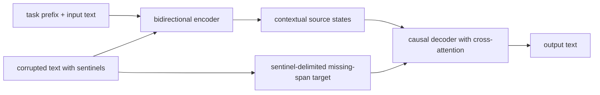
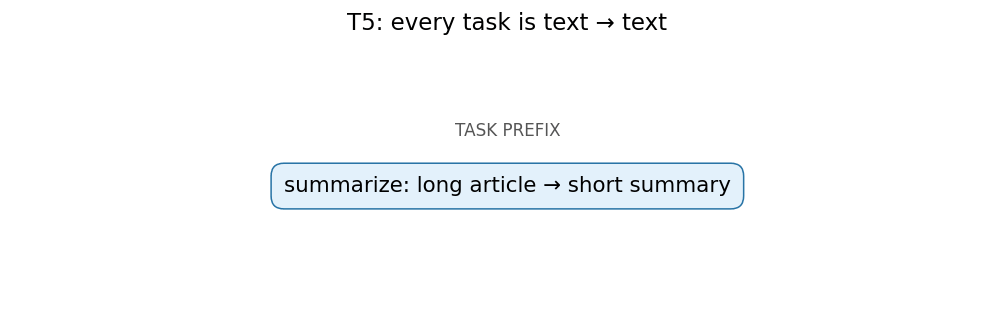
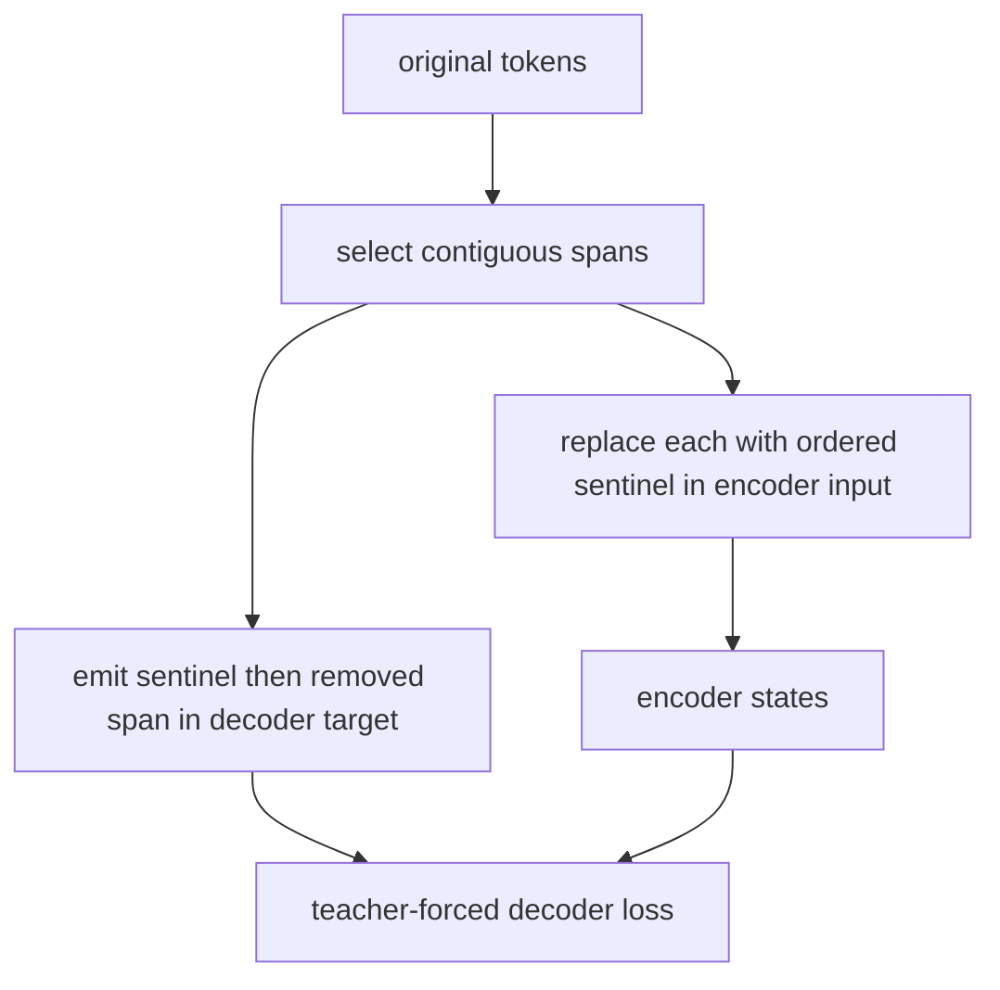
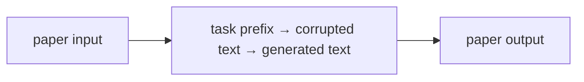
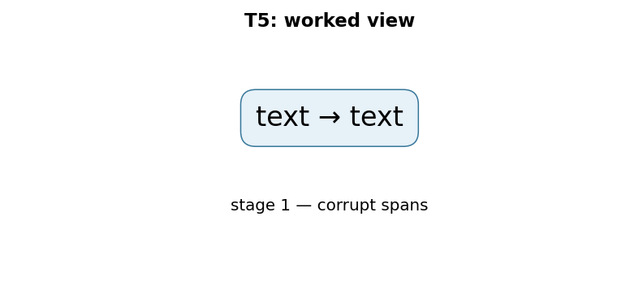

# Exploring the Limits of Transfer Learning with a Unified Text-to-Text Transformer (T5)

## TL;DR

T5 casts every NLP task as text in and text out: a prompt-like prefix identifies the task, and one encoder–decoder Transformer produces the answer. It supplies the missing third major Transformer family beside BERT’s encoder-only design and GPT’s decoder-only design. Its pre-training objective removes contiguous spans and asks the decoder to generate them, marked by ordered sentinel tokens. The paper is also a broad transfer-learning study: it compares objectives, architectures, data, and fine-tuning choices rather than presenting only one architectural novelty.

## Fun Map for First Years 🧭

T5 treats every language task as text in and text out. It practices repairing missing spans, then can translate, summarize, or answer using the same interface.

`📥 task text → 🧠 encoder understands → ✍️ decoder writes → 📤 task answer`

The same interface handles translation, summarization, and classification: give text in and ask for text out. A task prefix tells the model which job the input requests.

A classification input can be written as “sentiment: this film is great” and the output as “positive”; translation and summarization use the same input-to-output contract. The architecture need not change for each case.

💻 **CS analogy:** span corruption is like replacing missing substrings with numbered placeholders, then asking a decoder to emit the patch file in order.

## Math Playground 🧮

The essential equation or rule is:

```text
p(y|x) = ∏ p(yᵢ | earlier y, x)
```

**Essential equation:** p(y|x) = ∏ p(yᵢ | earlier y, x). To write output y from input x, T5 predicts one output token at a time. Each new prediction sees the original input and the output tokens already written. It is like completing a sentence while keeping both the question and your partial answer visible.

The ∏ sign means predict every output token in order. Each prediction sees both the original input and the answer already written.

For each output position, the model conditions on x and all earlier y tokens. That is why decoding is sequential: it cannot know the next output token until it has chosen the previous one.

## Background: What Came Before 🕰️

NLP systems used many different architectures and objectives for classification, translation, question answering, and summarization. That made transfer experiments hard to compare and implementations hard to reuse. T5 was needed to frame every task as text-to-text, so one encoder–decoder recipe and one training objective could cover them all.

This was needed because task-specific output heads and formats made transfer-learning systems harder to compare and reuse.

The text-to-text framing made experiments more comparable and made one model family easier to reuse across many NLP tasks.

## Why It Matters

Papers 02 and 03 establish two powerful but different patterns. BERT’s bidirectional encoder produces a representation that task-specific heads consume; GPT-style models predict the next token from a causal decoder. Before T5, benchmark practice often reflected this difference with a collection of custom heads, label mappings, and task-specific output formats. Classification might use a linear head, extractive QA might predict two positions, and translation might use a separate seq2seq model. The interface complexity makes transfer-learning comparisons harder than they need to be.

Raffel et al. propose a deliberately uniform contract: convert a task to a string and train a model to emit a string. For sentiment, an input might be `sst2 sentence: ...` and an output `positive`; for translation, the prefix names source and target languages; for summarization, the input names the operation and the output is the summary. This does not make every task equally easy, but it puts tokenization, loss computation, decoding, and model architecture on one reusable path.

The paper’s abstract describes a systematic study over dozens of language-understanding tasks, comparing pre-training objectives, architectures, unlabeled datasets, transfer methods, and other factors. Combining those findings with scale and the Colossal Clean Crawled Corpus (C4), it reports state-of-the-art results on tasks including summarization, QA, and classification. This makes T5 essential historically: it is both an encoder–decoder model family and a methodology for asking which transfer-learning choices matter.

T5 also connects to later papers in this collection. Switch Transformer is built from T5-Base and T5-Large variants, while RAG’s original formulation uses a pre-trained seq2seq generator. The point is not that every modern text model is T5. Decoder-only LLMs dominate many chat settings because their simple autoregressive interface scales and serves well. T5 remains a clear explanation of when an encoder can read all source text before a decoder generates a potentially different target sequence.

## Core Intuition

Think of a workshop with one intake desk and one output desk. The intake desk reads the complete work order before any work starts; that is the encoder. The output desk writes the result one item at a time while consulting the intake desk’s notes; that is the decoder. A translation order, a classification order, and a summarization order use the same desks because each can be written as a request and a textual response.

Span corruption trains the workshop like a document-restoration game. Someone removes several strips from a page and puts numbered blank labels in their places. The encoder sees the damaged page. The decoder writes a compact answer sheet: label zero followed by its missing words, label one followed by its missing words, and a final label. It need not reproduce all the untouched words, so training emphasizes reconstructing the informative missing spans.



The prefix is a label written in ordinary text, not a different neural head. This has practical charm: adding a task can look like adding examples to a shared API. But the model only follows the convention it learned. A poorly chosen prefix, ambiguous label spelling, or template mismatch is still a data-contract bug.

## The Mechanism

T5 uses an encoder–decoder Transformer. The encoder applies self-attention without a causal restriction over the source sequence, so each source token can incorporate information from both left and right context. The decoder predicts target token \(y_t\) autoregressively. Its masked self-attention sees earlier target tokens, and cross-attention queries the encoder’s source states. Training minimizes the standard conditional negative log likelihood:

\[
-\sum_{t=1}^{|y|}\log p_\theta(y_t\mid y_{<t},x).
\]

This makes the architecture naturally asymmetric: the source can be fully read once, while the target is generated step by step. It is suited to tasks where input and output have different lengths or forms. BERT does not have this autoregressive decoder; a decoder-only model represents the source as a prefix in its single causal stream rather than producing a separate encoded memory.

T5’s pre-training uses a denoising objective called span corruption. Random contiguous spans are removed from the input and each replaced with a unique sentinel token such as `<extra_id_0>`. The target concatenates the sentinels and removed spans in order, ending with the next sentinel. For example, `the small cat sat on the warm mat` can become source `the <extra_id_0> sat on <extra_id_1> mat` and target `<extra_id_0> small cat <extra_id_1> the warm <extra_id_2>`. A decoder output can therefore identify which gap each recovered content belongs to.





The sentinels are not ordinary mask tokens. BERT’s masked-language modeling replaces selected tokens and predicts them from encoder representations, commonly one position at a time. T5 asks a decoder to generate an ordered sequence of missing spans, compressing the target by omitting uncorrupted content. This differs from later instruction fine-tuning, where an input instruction and target response may be human-authored rather than a corrupted version of the same document.

The paper investigates a number of design choices, so resist attributing every later T5 configuration to the original “T5” label. Its relative-position bias, pre-normalization pattern, feed-forward architecture, vocabulary, and C4 corpus are part of a particular family and experimental study. T5.1.1, FLAN-T5, UL2, and other descendants make additional choices. When reproducing a result, use the actual model card/configuration and the paper version being cited rather than combining details across descendants.

Task prefixes create a simple multi-task interface but not a formal schema. Text labels must be canonicalized: `entailment` and `yes` are distinct targets even if a human considers them equivalent. Evaluation needs to map decoded strings back to task labels carefully and reject unexpected strings instead of silently coercing them. For generation tasks, decoding strategy changes output quality and cost; for classification framed as generation, a constrained vocabulary or log-probability comparison may be more reliable than unconstrained free decoding.

## Practical Engineering Notes

### Worked Math & Dataflow

The compact view below makes the paper's central calculation concrete:

```text
text → text
```

In practice, the calculation is a pipeline: The same encoder-decoder interface can express classification, translation, and summarization by changing the textual task prefix. Sentinel tokens mark missing spans and delimit the target. The important engineering
choice is to preserve the paper's intended invariant while making the operation
fit the available memory, batch size, and evaluation protocol.






Hugging Face exposes T5 through `T5ForConditionalGeneration` and tokenizer/model classes whose checkpoint revision should be kept together. Training labels use `-100` for ignored padding positions in the common PyTorch loss path; accidentally supervising pad tokens changes gradients and masks quality issues. The decoder is normally seeded by a start token according to the model configuration, so avoid hand-building decoder inputs unless you understand the shifting convention.

For denoising pre-training, use a T5-compatible span-corruption collator rather than ordinary token masking. It must create non-overlapping spans, ordered sentinels, a source sequence within the encoder limit, and a target sequence within the decoder limit. The sentinel inventory is finite and is part of the tokenizer vocabulary. A corruption pipeline that reuses one sentinel for multiple spans destroys the reconstruction correspondence while still producing plausible tensors.

At serving time encoder–decoder models have different cost profiles from decoder-only models. The encoder runs once over the source, then every decoder step includes cross-attention over source states. Beam search can improve some sequence tasks but multiplies decoder-state and KV-cache work. Cache encoder outputs per request, batch compatible decoding lengths, cap source and target separately, and measure latency under real prompt distributions rather than only token throughput.

`t5x` is a useful forward pointer for large-scale T5-style training, while `transformers` is the common application integration. Treat task prompts/templates as versioned artifacts: a whitespace or prefix change can be an input-distribution change. For evaluation, retain raw output, normalized output, and task parser result so a failure can be traced to generation, label normalization, or scoring rather than reported as one opaque accuracy number.

The text-to-text abstraction is particularly useful at system boundaries. A data service can expose one record shape—input text, target text, task name—rather than a different tensor schema for every downstream benchmark. That reduces boilerplate, but it moves semantic responsibility into strings. Establish a stable delimiter policy for user-provided text, escape or quote fields when needed, and test examples where an input contains a phrase resembling a task prefix. The model has no parser that inherently knows which substring is instruction and which is quoted content.

Sequence budgets require two numbers. The encoder source limit controls how much evidence can be read; the decoder target limit controls how much answer can be written. Truncating the source can remove a crucial fact, while truncating labels or targets during fine-tuning teaches an incomplete output. Track both distributions, including the number of discarded source and target tokens, and make truncation direction task-specific. A summarizer may preserve a beginning differently from a document QA system, while neither policy should be implicit.

Span corruption also provides a useful test oracle. Given original tokens, selected spans, and an ordered target, reconstruction should be exact. Unit-test adjacent spans, a span at the beginning or end, and examples whose target reaches the final sentinel. Randomized corruption without a reproducible seed can make data debugging needlessly hard; log the seed or chosen span indices for failed batches. In distributed training, ensure all workers follow the same tokenizer/sentinel configuration even if their random span locations differ.

For fine-tuning, distinguish teacher-forced likelihood from generation-time quality. A model can obtain good loss by predicting the next target token under a gold prefix yet make poor free-running outputs because its own earlier errors alter later context. Evaluate with the intended decoding strategy and task metric. Conversely, optimize no more decoding than the task needs: a label task can score a small candidate set directly, whereas a summarization task needs robust EOS stopping, repetition handling, and output-length safeguards.

The unified interface does not eliminate data licensing, corpus filtering, or contamination concerns. C4 is a web-derived corpus construction and the paper’s result must be read in that experimental context. When adapting T5-like models, record the data mixture and evaluation overlap policy just as carefully as model hyperparameters. Transfer learning is a workflow spanning data, pre-training, formatting, and evaluation—not merely a call to `generate`.

## Runnable Code Example

### Run it

The implementation is intentionally small and self-checking. From the repository root, use Python 3; the module docstring states the learning goal, comments identify the paper-specific calculation, and assertions verify the toy invariant.

```bash
python3 papers/12-t5/code/span_corruption.py
```

### Read it in order

Start with the module docstring, then follow the named helper calculations and the final assertions. The example is a dependency-light teaching implementation, not a production training system; change one input at a time and rerun it to see which invariant changes.


[`code/span_corruption.py`](code/span_corruption.py) constructs a token list with two removed spans, writes ordered sentinels into the source and target, then reconstructs the original tokens. It asserts that each sentinel is present once in the corrupted source and that the target’s fills restore the exact original order.

```bash
python3 papers/12-t5/code/span_corruption.py
```

The program is a data transformation, not a trained Transformer. That is intentional: the invariant clarifies the pre-training contract a real encoder–decoder is asked to learn.

## Common Misconceptions & Pitfalls

- **“Text-to-text means T5 has no task formatting.”** The task prefix and expected target spelling are formatting, and they are learned parts of the interface.
- **“T5 span corruption is BERT MLM.”** Both hide text, but T5 removes contiguous spans and generates a compact sentinel-delimited target with a decoder.
- **“An encoder–decoder always beats a decoder-only model.”** Architecture choice depends on task, scale, data, serving constraints, and desired generation interface.
- **“All T5 checkpoints share one exact configuration.”** Later T5-family releases alter objectives, data, training, and model settings.

## Interview Q&A

**Q:** What does the encoder contribute that a causal decoder lacks?
**A:** It can represent every source token using both left and right source context before the target is generated.

**Q:** Why are sentinel tokens ordered?
**A:** They identify which missing span belongs at each location, allowing a compact target to describe multiple gaps.

**Q:** How is classification expressed in T5?
**A:** A task-prefixed input maps to a textual label such as `positive` or `entailment`.

**Q:** What is decoder cross-attention?
**A:** Decoder queries attend to encoder-produced source states while generating each target token.

**Q:** What is a common data-pipeline bug?
**A:** Mishandling pad labels, sentinel order, or the decoder shift so the target no longer matches the corrupted source.

## Implementation Walkthrough

T5 converts every task into text-to-text form: a textual prefix identifies the
task, the encoder reads the input, and the decoder predicts target tokens.
Span corruption replaces consecutive source spans with sentinel tokens, so the
target teaches the decoder to restore missing spans in order. Keep sentinel
construction, target shifting, and task prefixes identical between pretraining
and fine-tuning or the model receives a different interface than it learned.

## SDE2 Interview Drill-down

These prompts are designed for a second-level software engineering interview: explain the mechanism, name the operational trade-off, and describe how you would test it.

**Q:** Walk through text-to-text transfer learning end to end. What does `input text → target text` mean in an implementation?
**A:** Start by identifying the data structure entering the operation, the learned or configured values it uses, and the invariant that must hold at the output. In this paper, input text → target text is not just notation: it tells you what is compared, normalized, accumulated, or optimized. A strong implementation makes those stages visible in separate functions, keeps tensor shapes and dtypes explicit, and tests a tiny hand-computed example before optimizing. Explain what happens when the inputs are short, padded, empty, or unusually large; those cases often reveal whether the code actually matches the paper.

**Follow-up:** Which invariant would you assert?
**A:** Assert the property that makes the method meaningful: probabilities normalize over valid choices, a residual preserves shape, a target does not bootstrap past termination, or an update leaves frozen state untouched. The assertion should be local and cheap enough to run in tests, not an end-to-end hope such as “accuracy improves.” Also compare the optimized path with a simple reference on random small inputs using an appropriate tolerance. That catches indexing, masking, reduction, and broadcasting errors while the failing example is still understandable.

**Q:** What is the main production trade-off, and how would you capacity-plan it?
**A:** The practical trade-off here is one interface simplifies serving many tasks, but prefixes and target formatting become part of the contract. Estimate both arithmetic work and memory movement, then identify whether the service is compute-bound, bandwidth-bound, latency-bound, or limited by coordination. Include batch-size effects, peak activation/state memory, serialization, and cold-start behavior; average throughput can hide a bad tail latency. Choose a baseline configuration, measure it on representative shapes, and document which quality metric is allowed to move. If the system is distributed, include communication and retry behavior rather than treating the model operation as an isolated kernel.

**Follow-up:** What would make you reject an apparently faster optimization?
**A:** Reject it when it changes the evaluation contract, weakens isolation, creates silent quality regressions, or only wins on a synthetic shape. For this paper, watch especially for ambiguous task prefixes, sentinel ordering, or label leakage. A safe rollout uses a reference implementation, shadow traffic or canaries, resource limits, and dashboards for both system and model metrics. Keep the old path available until numerical outputs, error rates, p95/p99 latency, and cost are stable across the important input distributions.

**Q:** How would you debug a model that passes unit tests but fails in production?
**A:** Reproduce the smallest production-shaped input and compare intermediate values against the reference path, not only the final score. Log versioned preprocessing, shapes, masks, random seeds where relevant, and the exact model/configuration identifiers; otherwise a numerical symptom can be caused by data drift or a serving mismatch. Separate failures into data, numerical stability, optimization, and infrastructure categories. For this method, begin with test exact target formatting and task-balanced validation suites, then run a controlled ablation that disables the paper-specific mechanism to determine whether the regression is in the mechanism or its integration.

**Follow-up:** What evidence would you present in the postmortem or interview?
**A:** Show one minimal failing example, the expected invariant, the observed intermediate divergence, and the fix’s regression test. Add a before/after metric table covering quality, memory, throughput, and tail latency, plus the rollout guard that would catch recurrence. This demonstrates engineering judgment: the goal is not merely to identify a clever algorithm, but to make its behavior observable, reproducible, and safe to operate.


## Further Reading

- [Original T5 paper](https://arxiv.org/abs/1910.10683)
- [T5 in Hugging Face Transformers](https://huggingface.co/docs/transformers/model_doc/t5)
- [C4 dataset paper](https://aclanthology.org/2021.eacl-main.98/)
- [Switch Transformers](https://arxiv.org/abs/2101.03961)
