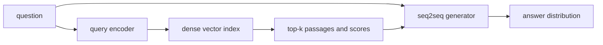
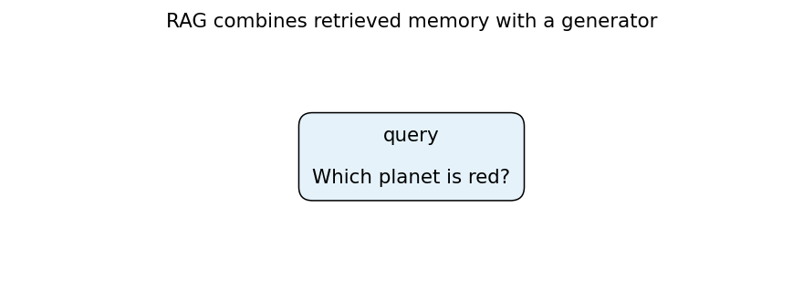
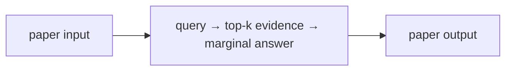
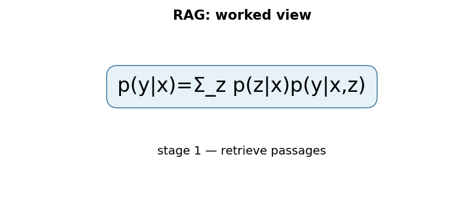

# Retrieval-Augmented Generation for Knowledge-Intensive NLP Tasks

## TL;DR

RAG combines a language model’s parametric knowledge with a searchable external document index. For a query, a dense retriever selects passages; a seq2seq generator conditions on them to produce an answer. Lewis et al. formulate generation as a marginal over retrieved documents, rather than treating retrieval as an unexamined preprocessing step. This is foundational because updating or inspecting a corpus is often easier than trying to edit facts stored in model weights.

## Fun Map for First Years 🧭

RAG lets a language model open a library before answering. It finds useful passages and uses them as extra notes while writing.

`❓ question → 🔎 retrieve passages → 📚 useful evidence → ✍️ generated answer`

The model does not have to keep every fact inside fixed weights. It can first look up useful notes, then use them while composing an answer.

For a question with two retrieved passages, one may strongly support “Paris” and the other weakly support “Lyon.” The weighted sum lets the stronger retrieval-and-generation path dominate without pretending the other does not exist.

💻 **CS analogy:** RAG is a weighted fan-out query: several retrieved documents each contribute an answer probability, then the system combines them.

## Math Playground 🧮

The essential equation or rule is:

```text
p(y|x) = Σ_z p(z|x)p(y|x,z)
```

**Essential equation:** \(p(y|x)=\sum_z p(z|x)p(y|x,z)\). x is the question, z is a retrieved document, and y is the answer. Rather than trust only one document, RAG treats each document as a possible source: its contribution is its answer probability times retrieval’s confidence in it, then the contributions are added. It is a weighted average over evidence branches.

Σ means add across documents. Each document contributes according to both retrieval’s confidence and how well it supports the answer.

If a document gets retrieval probability 0.8 and gives an answer probability 0.9, its contribution is 0.72. Summing contributions is ordinary weighted averaging over possible evidence sources.

## Background: What Came Before 🕰️

Parametric language models store knowledge only in their fixed weights, so facts can be stale, hard to audit, and expensive to update. Search systems can retrieve current documents but do not by themselves compose fluent answers. RAG was needed to couple retrieval with generation so a model can consult external evidence at answer time.

RAG addressed the need for knowledge that can be updated and inspected without retraining every parameter in a language model.

This added an external, replaceable memory to generation, enabling provenance and updates but also introducing risks from missing, stale, or malicious documents.

## Why It Matters

GPT-style models can answer factual questions because information is partially encoded in their weights, but that information is difficult to update, hard to attribute, and not guaranteed to be recalled precisely. The RAG paper identifies these limits explicitly: provenance and updating world knowledge remain open problems for parametric-only language models. A retrieval system offers a separate, non-parametric memory that can be refreshed without retraining every generator weight.

The original RAG system combines a pre-trained seq2seq model with a dense vector index of Wikipedia accessed through a pre-trained neural retriever. This connects two subsystems with different responsibilities. The retriever turns a question into a vector and finds passages whose vectors have high inner product. The generator turns question-plus-passage evidence into language. Neither subsystem alone is sufficient: an excellent generator cannot cite information it was not given, and an excellent retriever cannot produce a well-formed explanation by itself.

The paper compares RAG-Sequence, which uses the same retrieved passages for a whole generated sequence, with RAG-Token, which can use different passages for different generated tokens. It reports state-of-the-art results on three open-domain QA tasks and more specific, diverse, and factual generations than its parametric seq2seq baseline in its experiments. These are not claims that any deployed “RAG” system is factual. Retrieval can miss evidence, retrieve stale or malicious documents, or supply a passage the generator misreads.

For engineers, RAG changed an architectural boundary. Knowledge can be indexed, permission-filtered, refreshed, observed, and evaluated outside model training. It also creates a pipeline: embedding choice, chunking, index construction, retrieval latency, prompt composition, answer grounding, and citation rendering are all potential failures. Treating “add vector search” as a feature toggle obscures those dependencies.

## Core Intuition

Imagine an expert taking an open-book exam. A closed-book model must answer from memory. A RAG model first asks a librarian for the most relevant pages, then writes using both its learned language ability and those pages. The librarian may bring more than one page, and the writer should weigh them rather than believing every page equally.

The key distinction is that retrieval is evidence selection, not answer generation. A passage with a high similarity score is only a candidate. The generator still assigns probabilities to possible output strings conditioned on the query and that passage. RAG combines those conditional probabilities across retrieved passages, weighted by retriever confidence. This makes the retrieved document a latent variable in the probabilistic model.



An open book is not automatically a correct book. If the librarian returns the wrong edition, the writer can confidently repeat it. If the answer is not supported by any retrieved page, fluent text is still unsupported. Good RAG systems therefore expose retrieval results, measure retrieval separately, and use citations as inspectable links rather than decorative footnotes.

## The Mechanism

Let \(x\) be an input query, \(z\) a document, and \(y\) a generated answer. A dense retriever encodes query and documents into vectors and scores them with an inner product. Over the retrieved top \(k\) documents it produces a normalized distribution \(p_\eta(z\mid x)\). A generator supplies \(p_\theta(y\mid x,z)\). RAG-Sequence marginalizes the same document choice over an entire output:

\[
p(y\mid x)=\sum_{z\in\mathrm{top}\text{-}k}p_\eta(z\mid x)p_\theta(y\mid x,z).
\]

The sum is important. Concatenating top passages into a prompt is a common modern implementation pattern, but it is not exactly this objective. The paper’s formulation treats each retrieved document as a latent explanatory route and combines document-conditioned generation likelihoods. RAG-Token instead marginalizes at each output token, allowing the document choice to vary through generation. That is more flexible but changes computation and the interpretation of which document supported which token.



```mermaid
flowchart TD
 X[query x] --> E[encode query]
 E --> S[inner products with document vectors]
 S --> T[top-k documents]
 T --> W[softmax retrieval weights]
 T --> L[generator likelihood pθ(y|x,z)]
 W --> M[sum_z pη(z|x)pθ(y|x,z)]
 L --> M
 M --> LOSS[negative log likelihood]
```

The index is non-parametric memory: adding or changing a document can change retrieval without directly modifying generator weights. It is not fully differentiable through arbitrary approximate nearest-neighbor lookup in the everyday systems sense. The original setup uses a neural retriever and a fixed dense Wikipedia index in its described architecture; implementation details and what is trained should be checked in the primary paper before quoting them. In production, retriever training, embedding refreshes, and index rebuilds are often separate operational workflows.

Document chunking determines the units a retriever can return. Large chunks may contain needed context but dilute vector similarity and consume prompt budget. Tiny chunks improve targeting but may omit qualifiers, tables, or antecedents. Metadata such as timestamps, source authority, tenant ID, and ACLs must be filtered before retrieval—not merely removed from a final answer—because retrieved text can influence generation even when hidden from a user.

### Mechanism in Code

At implementation level, the mechanism operates on query, retriever scores, passages, and generator tokens. A faithful
forward pass should follow this order: retrieve and filter evidence, assemble context, score candidate answers, and preserve provenance. Keep the intermediate
representation available while debugging; collapsing everything into one
opaque framework call makes shape and numerical errors much harder to isolate.

The key production failure to guard against is authorizing or caching documents after retrieval instead of before it. Add a tiny
reference test with hand-checkable values, then add a property test that
covers padding, empty/short inputs, boundary probabilities, and the largest
supported shape. Compare intermediate tensors with tolerances appropriate to
the dtype, and log the paper-specific statistic during a canary rollout.


## Practical Engineering Notes

### Worked Math & Dataflow

The compact view below makes the paper's central calculation concrete:

```text
p(y|x)=Σ_z p(z|x)p(y|x,z)
```

In practice, the calculation is a pipeline: Retrieval supplies multiple possible evidence passages, and the generator combines their probability rather than blindly trusting one document. Better retrieval can therefore improve generation without changing the language model. The important engineering
choice is to preserve the paper's intended invariant while making the operation
fit the available memory, batch size, and evaluation protocol.






FAISS is a common library for approximate dense-vector search; Hugging Face provides RAG model classes; pgvector and managed vector stores are common system choices. These are implementations, not interchangeable statistical models. Pin the embedding model, preprocessing, dimensionality, distance metric, index build parameters, and document corpus version together. Query vectors from one embedding revision can produce meaningless neighbors in an index built with another.

Measure retrieval and generation separately. Retrieval recall against known supporting passages, nDCG-style ranking metrics, empty-result rate, and latency identify a different failure class from answer correctness, citation precision, or hallucination. A generator may answer correctly from parametric memory even when retrieval fails, concealing an index outage in end-to-end accuracy. Conversely, a correct retrieved passage can be ignored by the generator. Log query, filters, returned IDs, scores, prompt assembly, answer, and citations with privacy-aware retention.

Security begins at retrieval. Apply authorization filters in the search request, not after top-k selection. Treat documents as untrusted instructions: a retrieved page can contain prompt injection text, stale policy, or adversarial content. Delimit evidence clearly, instruct the generator about its role, and use task-specific validation for high-risk output. Citation strings alone do not prove entailment; test whether the cited passage actually supports the claim.

Latency budgets have several stages: embedding, index search, reranking if any, document fetch, prompt construction, and generation. Cache carefully with corpus/version and permissions in the key. Updating a source can create a window where text and vectors disagree, so use atomic index versions or explicit freshness metadata. A smaller top-k lowers generator context cost but can reduce recall; a larger top-k can crowd out relevant evidence. Tune these trade-offs on representative queries rather than a generic demo set.

Retrieval scores are not calibrated truth scores. Inner product measures compatibility under a particular embedding model and training distribution. A score may be high because a document shares terminology while answering a different relation, or low because the correct fact is expressed with unfamiliar wording. Reranking with a cross-encoder or a model-based relevance check can help, but adds cost and another failure mode. Set an abstention policy for weak evidence instead of forcing every query through an answer template. In many applications, “I could not find an authorized supporting document” is better than a polished guess.

The source of a document matters as much as its vector. Prefer canonical records over scraped copies when provenance is relevant, retain document IDs and snapshots, and define deletion/update propagation. If a source is revoked, embeddings and cached prompt fragments must be removed too. For regulated or private corpora, evaluate retrieval leakage: a query should not discover the existence of a document outside its authorization scope through score differences, titles, snippets, or latency side channels.

RAG can improve freshness but has no single freshness clock. The corpus may be current while the retriever embedding model was trained before new vocabulary existed; the index may be current while an answer cache is stale; an API source may return a live value that conflicts with a stored passage. Include timestamps and source versions in retrieval metadata and make user-facing claims appropriately scoped. “According to this document revision” is a stronger, auditable statement than an unqualified claim of present truth.

Prompt assembly is a compression problem. The generator has a finite context window, so retrieved text often needs truncation or selection. Preserve titles, source IDs, and local context around a relevant passage; avoid silently concatenating fragments from incompatible sources into a synthetic quotation. If a system asks the model to cite numbered passages, make the numbering deterministic and test that an output citation maps to the passage actually supplied. Citation rendering should never invent an ID merely because the model produced bracket-like text.

Training and serving can differ. The paper studies a neural retriever coupled to a seq2seq generator, while a practical application may use a frozen embedding API, lexical retrieval, hybrid search, metadata filters, and a decoder-only chat model. Those can still be useful retrieval-augmented systems, but their quality claims should not be transferred automatically from the original RAG results. Document the retrieval objective, corpus, and generator context format so an incident can be reproduced rather than attributed vaguely to “the model.”

Finally, RAG does not remove the need for model governance. A model can make unsafe inferences from benign evidence, follow malicious instructions embedded in a document, expose personally sensitive details, or answer a question outside its allowed purpose. Retrieval controls reduce the information available; output policy, human escalation, and application authorization remain distinct controls. The architecture provides inspectable evidence paths, which is valuable precisely because it makes these responsibilities testable.

Operational tests should include adversarial retrieval cases: a highly similar but wrong passage, duplicate documents, conflicting revisions, an empty eligible corpus, a document with hostile instructions, and a query whose correct answer requires combining two passages. Test each stage’s behavior rather than only final text. A robust design can surface uncertainty, preserve provenance, and avoid unauthorized context even when the retrieval distribution is inconvenient.

For cost planning, separate index storage from model memory and account for embedding calls, network transfer, reranking, and generator tokens. A compact index can be cheap to keep but expensive to refresh; a large context can improve evidence coverage but increase first-token latency. The right configuration is an application-level decision supported by trace data, not a universal top-k value.

Measure it continuously.

## Runnable Code Example

### Run it

The implementation is intentionally small and self-checking. From the repository root, use Python 3; the module docstring states the learning goal, comments identify the paper-specific calculation, and assertions verify the toy invariant.

```bash
python3 papers/13-rag/code/retrieval_marginalization.py
```

### Read it in order

Start with the module docstring, then follow the named helper calculations and the final assertions. The example is a dependency-light teaching implementation, not a production training system; change one input at a time and rerun it to see which invariant changes.


[`code/retrieval_marginalization.py`](code/retrieval_marginalization.py) retrieves two toy document vectors by inner product, softmaxes their scores, and marginalizes two document-conditioned answer distributions. It asserts that the result remains a probability distribution and that replacing the best document’s evidence can flip the answer ranking.

```bash
python3 papers/13-rag/code/retrieval_marginalization.py
```

The code is deliberately small: it demonstrates the paper’s probabilistic composition, not a realistic ANN index or neural generator.

## Common Misconceptions & Pitfalls

- **“RAG guarantees truthful answers.”** It supplies evidence candidates; retrieval and generation can each fail.
- **“A vector database is RAG.”** It is one possible retrieval component; RAG also needs a generator and an evidence-to-answer policy.
- **“Citations prove support.”** A cited document may be irrelevant or contradict the answer; support needs evaluation.
- **“Updating documents automatically updates every response.”** The updated content must be chunked, embedded, indexed, retrieved, and used by the generator.

## Quick Concept Checks

**Q:** What are RAG’s parametric and non-parametric memories?
**A:** The generator’s learned weights are parametric; the searchable document index is non-parametric.

**Q:** What is the RAG-Sequence marginalization?
**A:** It sums whole-sequence generator likelihoods over top-k documents weighted by retrieval probability.

**Q:** Why evaluate retrieval separately?
**A:** End-to-end answers cannot reveal whether a failure came from missing evidence or failure to use good evidence.

**Q:** What must happen before vector search in a multi-tenant system?
**A:** Authorization and metadata filters must constrain which documents are eligible to retrieve.

**Q:** Why is chunk size a quality trade-off?
**A:** It balances semantic context against retrieval precision and generator context budget.

## Implementation Walkthrough

RAG first embeds a query, retrieves a small set of document chunks, then
conditions generation on those chunks. Retrieval quality is therefore part of
the model output: chunk size, overlap, embedding version, index freshness, and
metadata filters can change an answer before the generator runs. Evaluate
retrieval recall separately from answer quality, and retain citations or chunk
identifiers so an incorrect answer can be traced to retrieval versus synthesis.

## Interview Q&A

These prompts are designed for a second-level software engineering interview: explain the mechanism, name the operational trade-off, and describe how you would test it.

**Q:** Walk through retrieval-augmented generation end to end. What does `p(y|x)=Σ_zp(z|x)p(y|x,z)` mean in an implementation?
**A:** Start by identifying the data structure entering the operation, the learned or configured values it uses, and the invariant that must hold at the output. In this paper, p(y|x)=Σ_zp(z|x)p(y|x,z) is not just notation: it tells you what is compared, normalized, accumulated, or optimized. A strong implementation makes those stages visible in separate functions, keeps tensor shapes and dtypes explicit, and tests a tiny hand-computed example before optimizing. Explain what happens when the inputs are short, padded, empty, or unusually large; those cases often reveal whether the code actually matches the paper.

**Follow-up:** Which invariant would you assert?
**A:** Assert the property that makes the method meaningful: probabilities normalize over valid choices, a residual preserves shape, a target does not bootstrap past termination, or an update leaves frozen state untouched. The assertion should be local and cheap enough to run in tests, not an end-to-end hope such as “accuracy improves.” Also compare the optimized path with a simple reference on random small inputs using an appropriate tolerance. That catches indexing, masking, reduction, and broadcasting errors while the failing example is still understandable.

**Q:** What is the main production trade-off, and how would you capacity-plan it?
**A:** The practical trade-off here is retrieval adds index, network, and context costs but can improve freshness without retraining. Estimate both arithmetic work and memory movement, then identify whether the service is compute-bound, bandwidth-bound, latency-bound, or limited by coordination. Include batch-size effects, peak activation/state memory, serialization, and cold-start behavior; average throughput can hide a bad tail latency. Choose a baseline configuration, measure it on representative shapes, and document which quality metric is allowed to move. If the system is distributed, include communication and retry behavior rather than treating the model operation as an isolated kernel.

**Follow-up:** What would make you reject an apparently faster optimization?
**A:** Reject it when it changes the evaluation contract, weakens isolation, creates silent quality regressions, or only wins on a synthetic shape. For this paper, watch especially for stale or unauthorized evidence and the generator ignoring retrieved context. A safe rollout uses a reference implementation, shadow traffic or canaries, resource limits, and dashboards for both system and model metrics. Keep the old path available until numerical outputs, error rates, p95/p99 latency, and cost are stable across the important input distributions.

**Q:** How would you debug a model that passes unit tests but fails in production?
**A:** Reproduce the smallest production-shaped input and compare intermediate values against the reference path, not only the final score. Log versioned preprocessing, shapes, masks, random seeds where relevant, and the exact model/configuration identifiers; otherwise a numerical symptom can be caused by data drift or a serving mismatch. Separate failures into data, numerical stability, optimization, and infrastructure categories. For this method, begin with measure retrieval recall, citation support, and answer quality independently, then run a controlled ablation that disables the paper-specific mechanism to determine whether the regression is in the mechanism or its integration.

**Follow-up:** What evidence would you present in the postmortem or interview?
**A:** Show one minimal failing example, the expected invariant, the observed intermediate divergence, and the fix’s regression test. Add a before/after metric table covering quality, memory, throughput, and tail latency, plus the rollout guard that would catch recurrence. This demonstrates engineering judgment: the goal is not merely to identify a clever algorithm, but to make its behavior observable, reproducible, and safe to operate.


## Further Reading

- [Original RAG paper](https://arxiv.org/abs/2005.11401)
- [FAISS](https://github.com/facebookresearch/faiss)
- [Hugging Face RAG documentation](https://huggingface.co/docs/transformers/model_doc/rag)
- [Dense Passage Retrieval](https://arxiv.org/abs/2004.04906)
