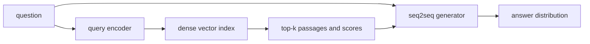
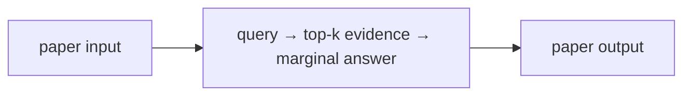

# Retrieval-Augmented Generation for Knowledge-Intensive NLP Tasks

## TL;DR

RAG combines a language model’s parametric knowledge with a searchable external document index. For a query, a dense retriever selects passages; a seq2seq generator conditions on them to produce an answer. Lewis et al. formulate generation as a marginal over retrieved documents, rather than treating retrieval as an unexamined preprocessing step. This is foundational because updating or inspecting a corpus is often easier than trying to edit facts stored in model weights.

## Fun Map for First Years 🧭

RAG lets a language model open a library before answering. It finds useful passages and uses them as extra notes while writing.

`❓ question → 🔎 retrieve passages → 📚 useful evidence → ✍️ generated answer`

The model does not have to keep every fact inside fixed weights. It can first look up useful notes, then use them while composing an answer.

For a question with two retrieved passages, one may strongly support “Paris” and the other weakly support “Lyon.” The weighted sum lets the stronger retrieval-and-generation path dominate without pretending the other does not exist.

💻 **CS analogy:** RAG is a weighted fan-out query: several retrieved documents each contribute an answer probability, then the system combines them.

## Math Playground 🧮

The essential equation or rule is:

```text
p(y|x) = Σ_z p(z|x)p(y|x,z)
```

**Essential equation:** \(p(y|x)=\sum_z p(z|x)p(y|x,z)\). x is the question, z is a retrieved document, and y is the answer. Rather than trust only one document, RAG treats each document as a possible source: its contribution is its answer probability times retrieval’s confidence in it, then the contributions are added. It is a weighted average over evidence branches.

Σ means add across documents. Each document contributes according to both retrieval’s confidence and how well it supports the answer.

If a document gets retrieval probability 0.8 and gives an answer probability 0.9, its contribution is 0.72. Summing contributions is ordinary weighted averaging over possible evidence sources.

## Background: What Came Before 🕰️

Parametric language models store knowledge only in their fixed weights, so facts can be stale, hard to audit, and expensive to update. Search systems can retrieve current documents but do not by themselves compose fluent answers. RAG was needed to couple retrieval with generation so a model can consult external evidence at answer time.

RAG addressed the need for knowledge that can be updated and inspected without retraining every parameter in a language model.

This added an external, replaceable memory to generation, enabling provenance and updates but also introducing risks from missing, stale, or malicious documents.

## Why It Matters

GPT-style models can answer factual questions because information is partially encoded in their weights, but that information is difficult to update, hard to attribute, and not guaranteed to be recalled precisely. The RAG paper identifies these limits explicitly: provenance and updating world knowledge remain open problems for parametric-only language models. A retrieval system offers a separate, non-parametric memory that can be refreshed without retraining every generator weight.

The original RAG system combines a pre-trained seq2seq model with a dense vector index of Wikipedia accessed through a pre-trained neural retriever. This connects two subsystems with different responsibilities. The retriever turns a question into a vector and finds passages whose vectors have high inner product. The generator turns question-plus-passage evidence into language. Neither subsystem alone is sufficient: an excellent generator cannot cite information it was not given, and an excellent retriever cannot produce a well-formed explanation by itself.

The paper compares RAG-Sequence, which uses the same retrieved passages for a whole generated sequence, with RAG-Token, which can use different passages for different generated tokens. It reports state-of-the-art results on three open-domain QA tasks and more specific, diverse, and factual generations than its parametric seq2seq baseline in its experiments. These are not claims that any deployed “RAG” system is factual. Retrieval can miss evidence, retrieve stale or malicious documents, or supply a passage the generator misreads.

For engineers, RAG changed an architectural boundary. Knowledge can be indexed, permission-filtered, refreshed, observed, and evaluated outside model training. It also creates a pipeline: embedding choice, chunking, index construction, retrieval latency, prompt composition, answer grounding, and citation rendering are all potential failures. Treating “add vector search” as a feature toggle obscures those dependencies.

## Core Intuition

Imagine an expert taking an open-book exam. A closed-book model must answer from memory. A RAG model first asks a librarian for the most relevant pages, then writes using both its learned language ability and those pages. The librarian may bring more than one page, and the writer should weigh them rather than believing every page equally.

The key distinction is that retrieval is evidence selection, not answer generation. A passage with a high similarity score is only a candidate. The generator still assigns probabilities to possible output strings conditioned on the query and that passage. RAG combines those conditional probabilities across retrieved passages, weighted by retriever confidence. This makes the retrieved document a latent variable in the probabilistic model.



An open book is not automatically a correct book. If the librarian returns the wrong edition, the writer can confidently repeat it. If the answer is not supported by any retrieved page, fluent text is still unsupported. Good RAG systems therefore expose retrieval results, measure retrieval separately, and use citations as inspectable links rather than decorative footnotes.

## The Mechanism

Let \(x\) be an input query, \(z\) a document, and \(y\) a generated answer. A dense retriever encodes query and documents into vectors and scores them with an inner product. Over the retrieved top \(k\) documents it produces a normalized distribution \(p_\eta(z\mid x)\). A generator supplies \(p_\theta(y\mid x,z)\). RAG-Sequence marginalizes the same document choice over an entire output:

\[
p(y\mid x)=\sum_{z\in\mathrm{top}\text{-}k}p_\eta(z\mid x)p_\theta(y\mid x,z).
\]

The sum is important. Concatenating top passages into a prompt is a common modern implementation pattern, but it is not exactly this objective. The paper’s formulation treats each retrieved document as a latent explanatory route and combines document-conditioned generation likelihoods. RAG-Token instead marginalizes at each output token, allowing the document choice to vary through generation. That is more flexible but changes computation and the interpretation of which document supported which token.


```mermaid
flowchart TD
 X[query x] --> E[encode query]
 E --> S[inner products with document vectors]
 S --> T[top-k documents]
 T --> W[softmax retrieval weights]
 T --> L[generator likelihood pθ(y|x,z)]
 W --> M[sum_z pη(z|x)pθ(y|x,z)]
 L --> M
 M --> LOSS[negative log likelihood]
```

The index is non-parametric memory: adding or changing a document can change retrieval without directly modifying generator weights. It is not fully differentiable through arbitrary approximate nearest-neighbor lookup in the everyday systems sense. The original setup uses a neural retriever and a fixed dense Wikipedia index in its described architecture; implementation details and what is trained should be checked in the primary paper before quoting them. In production, retriever training, embedding refreshes, and index rebuilds are often separate operational workflows.

Document chunking determines the units a retriever can return. Large chunks may contain needed context but dilute vector similarity and consume prompt budget. Tiny chunks improve targeting but may omit qualifiers, tables, or antecedents. Metadata such as timestamps, source authority, tenant ID, and ACLs must be filtered before retrieval—not merely removed from a final answer—because retrieved text can influence generation even when hidden from a user.

### Mechanism in Code

At implementation level, the mechanism operates on query, retriever scores, passages, and generator tokens. A faithful
forward pass should follow this order: retrieve and filter evidence, assemble context, score candidate answers, and preserve provenance. Keep the intermediate
representation available while debugging; collapsing everything into one
opaque framework call makes shape and numerical errors much harder to isolate.

The key production failure to guard against is authorizing or caching documents after retrieval instead of before it. Add a tiny
reference test with hand-checkable values, then add a property test that
covers padding, empty/short inputs, boundary probabilities, and the largest
supported shape. Compare intermediate tensors with tolerances appropriate to
the dtype, and log the paper-specific statistic during a canary rollout.


## Practical Engineering Notes

### Worked Math & Dataflow

The compact view below makes the paper's central calculation concrete:

```text
p(y|x)=Σ_z p(z|x)p(y|x,z)
```

In practice, the calculation is a pipeline: Retrieval supplies multiple possible evidence passages, and the generator combines their probability rather than blindly trusting one document. Better retrieval can therefore improve generation without changing the language model. The important engineering
choice is to preserve the paper's intended invariant while making the operation
fit the available memory, batch size, and evaluation protocol.




FAISS is a common library for approximate dense-vector search; Hugging Face provides RAG model classes; pgvector and managed vector stores are common system choices. These are implementations, not interchangeable statistical models. Pin the embedding model, preprocessing, dimensionality, distance metric, index build parameters, and document corpus version together. Query vectors from one embedding revision can produce meaningless neighbors in an index built with another.

Measure retrieval and generation separately. Retrieval recall against known supporting passages, nDCG-style ranking metrics, empty-result rate, and latency identify a different failure class from answer correctness, citation precision, or hallucination. A generator may answer correctly from parametric memory even when retrieval fails, concealing an index outage in end-to-end accuracy. Conversely, a correct retrieved passage can be ignored by the generator. Log query, filters, returned IDs, scores, prompt assembly, answer, and citations with privacy-aware retention.

Security begins at retrieval. Apply authorization filters in the search request, not after top-k selection. Treat documents as untrusted instructions: a retrieved page can contain prompt injection text, stale policy, or adversarial content. Delimit evidence clearly, instruct the generator about its role, and use task-specific validation for high-risk output. Citation strings alone do not prove entailment; test whether the cited passage actually supports the claim.

Latency budgets have several stages: embedding, index search, reranking if any, document fetch, prompt construction, and generation. Cache carefully with corpus/version and permissions in the key. Updating a source can create a window where text and vectors disagree, so use atomic index versions or explicit freshness metadata. A smaller top-k lowers generator context cost but can reduce recall; a larger top-k can crowd out relevant evidence. Tune these trade-offs on representative queries rather than a generic demo set.

Retrieval scores are not calibrated truth scores. Inner product measures compatibility under a particular embedding model and training distribution. A score may be high because a document shares terminology while answering a different relation, or low because the correct fact is expressed with unfamiliar wording. Reranking with a cross-encoder or a model-based relevance check can help, but adds cost and another failure mode. Set an abstention policy for weak evidence instead of forcing every query through an answer template. In many applications, “I could not find an authorized supporting document” is better than a polished guess.

The source of a document matters as much as its vector. Prefer canonical records over scraped copies when provenance is relevant, retain document IDs and snapshots, and define deletion/update propagation. If a source is revoked, embeddings and cached prompt fragments must be removed too. For regulated or private corpora, evaluate retrieval leakage: a query should not discover the existence of a document outside its authorization scope through score differences, titles, snippets, or latency side channels.

RAG can improve freshness but has no single freshness clock. The corpus may be current while the retriever embedding model was trained before new vocabulary existed; the index may be current while an answer cache is stale; an API source may return a live value that conflicts with a stored passage. Include timestamps and source versions in retrieval metadata and make user-facing claims appropriately scoped. “According to this document revision” is a stronger, auditable statement than an unqualified claim of present truth.

Prompt assembly is a compression problem. The generator has a finite context window, so retrieved text often needs truncation or selection. Preserve titles, source IDs, and local context around a relevant passage; avoid silently concatenating fragments from incompatible sources into a synthetic quotation. If a system asks the model to cite numbered passages, make the numbering deterministic and test that an output citation maps to the passage actually supplied. Citation rendering should never invent an ID merely because the model produced bracket-like text.

Training and serving can differ. The paper studies a neural retriever coupled to a seq2seq generator, while a practical application may use a frozen embedding API, lexical retrieval, hybrid search, metadata filters, and a decoder-only chat model. Those can still be useful retrieval-augmented systems, but their quality claims should not be transferred automatically from the original RAG results. Document the retrieval objective, corpus, and generator context format so an incident can be reproduced rather than attributed vaguely to “the model.”

Finally, RAG does not remove the need for model governance. A model can make unsafe inferences from benign evidence, follow malicious instructions embedded in a document, expose personally sensitive details, or answer a question outside its allowed purpose. Retrieval controls reduce the information available; output policy, human escalation, and application authorization remain distinct controls. The architecture provides inspectable evidence paths, which is valuable precisely because it makes these responsibilities testable.

Operational tests should include adversarial retrieval cases: a highly similar but wrong passage, duplicate documents, conflicting revisions, an empty eligible corpus, a document with hostile instructions, and a query whose correct answer requires combining two passages. Test each stage’s behavior rather than only final text. A robust design can surface uncertainty, preserve provenance, and avoid unauthorized context even when the retrieval distribution is inconvenient.

For cost planning, separate index storage from model memory and account for embedding calls, network transfer, reranking, and generator tokens. A compact index can be cheap to keep but expensive to refresh; a large context can improve evidence coverage but increase first-token latency. The right configuration is an application-level decision supported by trace data, not a universal top-k value.

Measure it continuously.

## Runnable Code Example

### Run from the repository root

Prerequisites: Python 3 and the dependencies imported by [`implementations/13-rag/code/retrieval_marginalization.py`](implementations/13-rag/code/retrieval_marginalization.py).
The example is intentionally small enough to run on CPU; it is a teaching
implementation, not a production training or serving benchmark.

```bash
python3 implementations/13-rag/code/retrieval_marginalization.py
```

### What the example demonstrates

Read the module docstring first, then follow the functions implementing
**retrieval-augmented generation**. The program turns `p(y|x)=Σ_zp(z|x)p(y|x,z)` into executable operations,
prints a compact result, and checks that **retrieved evidence is traceable to the answer and stale or empty retrieval is handled explicitly**. The assertion matters:
it tests the semantic contract near the mechanism instead of treating a
plausible final number as proof that the implementation is correct.

### Expected behavior and useful experiments

The command should finish without a traceback and print a successful summary
or assertion message. You should observe the paper-specific behavior, not a
particular random numeric value. Change one input at a time: inspect the
intermediate tensor or state, rerun with a boundary case, and then compare the
result with the expected invariant. A useful first experiment is to **measure retrieval recall, citation support, and answer quality independently with an index snapshot**.

### Production connection

The toy program does not model every distributed or large-scale concern. In a
real service, version the preprocessing and configuration, record the relevant
intermediate statistic, and measure peak memory, throughput, p95/p99 latency,
and task quality. The first production guard should target **retriever miss, stale index, prompt overflow, or unsupported generation**;
preserve a transparent reference path or a canary comparison before replacing
it with a fused, distributed, or highly optimized implementation.

## Common Misconceptions & Pitfalls

- **Misconception: `p(y|x)=Σ_zp(z|x)p(y|x,z)` is the whole implementation.** The equation describes the paper's central relationship, but `retrieval-augmented generation` also requires explicit input contracts, ordering, masking or sampling rules, and numerical choices. If those details are left implicit, two implementations can share the same formula and still produce different results. Treat the equation as a contract and document each intermediate tensor or state transition.
- **Misconception: the mechanism is automatically reliable when the final metric looks good.** A model can compensate for a wrong reduction, stale state, or malformed edge/token boundary on common examples. The local guard is **retrieved evidence is traceable to the answer and stale or empty retrieval is handled explicitly**. Check it on a tiny hand-worked fixture and on adversarial inputs before trusting an aggregate benchmark.
- **Pitfall: optimizing the operation before measuring its actual bottleneck.** For this paper, watch for **retriever miss, stale index, prompt overflow, or unsupported generation** rather than assuming the largest theoretical term dominates every workload. Record memory, bandwidth, batch shape, tail latency, and quality slices. An optimization is only safe when it preserves the paper-specific contract and has a rollback path.
- **Pitfall: debugging only the final prediction.** Start with **measure retrieval recall, citation support, and answer quality independently with an index snapshot**; compare intermediate values with a simple reference. Freeze preprocessing, configuration, seeds, and model versions; then bisect the first divergence. This makes a failure reproducible and distinguishes data-contract errors from numerical instability, integration bugs, and a genuinely unsuitable paper mechanism.

## Quick Concept Checks

**Q:** What is the central idea behind **retrieval-augmented generation**?
**A:** It is a structured data or optimization path, not a slogan: inputs are transformed, paper-specific relationships are computed, invalid choices are excluded when necessary, and the result is aggregated into an output or objective. The important implementation question is which intermediate values must remain observable so a reviewer can connect the code to the paper.

**Q:** How should I read `p(y|x)=Σ_zp(z|x)p(y|x,z)`?
**A:** Read each symbol as an operation with a shape, a data source, and a numerical range. Ask what changes when its scale, temperature, rank, timestep, neighborhood, or other paper-specific value changes. Then make a two- or three-example fixture where the expected result can be calculated by hand; this catches notation-to-code misunderstandings early.

**Q:** What invariant must a correct implementation preserve?
**A:** It must preserve **retrieved evidence is traceable to the answer and stale or empty retrieval is handled explicitly**. This is stronger than asking whether accuracy improved because it is local, deterministic, and testable near the operation that could be wrong. Assert it at the boundary, compare against a small reference implementation, and include the unusual input shape most likely to violate it in production.

**Q:** What is the most dangerous failure mode?
**A:** The first risk to investigate is **retriever miss, stale index, prompt overflow, or unsupported generation**. It can produce plausible outputs while degrading only a slice of traffic, so monitor a paper-specific statistic alongside quality and system metrics. A canary should compare the old and new paths on identical inputs and should retain enough intermediate diagnostics to explain a regression.

**Q:** How would I test this idea beyond a happy-path unit test?
**A:** Begin with **measure retrieval recall, citation support, and answer quality independently with an index snapshot**, then add differential tests against a transparent reference on small randomized inputs. Cover boundaries such as padding, termination, empty neighborhoods, long sequences, rare tokens, extreme values, or duplicated examples when they apply. Test both output values and gradients or state updates when training behavior is part of the paper's claim.

**Q:** What should I remember when applying the paper in a real system?
**A:** Keep the paper's assumptions in the production contract: version the preprocessing and configuration, expose the relevant intermediate statistic, and define quality slices before tuning performance. Compare throughput, peak memory, p95/p99 latency, and task quality against a baseline. The paper is useful only when its mechanism remains correct under the workload and failure modes you actually operate.

## Interview Q&A

**Q:** Walk through **retrieval-augmented generation** end to end. How would you implement `p(y|x)=Σ_zp(z|x)p(y|x,z)`?
**A:** Decompose the expression into the actual data path: inputs enter the paper-specific transformation, intermediate scores or states are computed, invalid elements are excluded, and the result is reduced into the output or loss. For this paper, `p(y|x)=Σ_zp(z|x)p(y|x,z)` is an executable contract, not decoration: document tensor shapes, ownership of mutable state, numerical precision, and where batching changes semantics. Keep a small reference implementation beside the optimized path so a reviewer can connect each line of `code` to one term in the equation.

**Follow-up:** What invariant would you assert, and why is it stronger than checking final accuracy?
**A:** Assert that **retrieved evidence is traceable to the answer and stale or empty retrieval is handled explicitly**. That property is local enough to fail near the defect, whereas accuracy can remain acceptable while a mask, reduction, or state boundary is wrong on a rare input. Add a hand-computed fixture, a randomized differential test against the reference, and shape/dtype assertions at the API boundary. The test should also cover an empty, padded, terminal, high-degree, long-context, or otherwise adversarial case when that input is meaningful for this mechanism.

**Q:** What is the main production trade-off in this paper, and how would you capacity-plan it?
**A:** The central trade-off is that **the mechanism changes both quality behavior and resource use**. Capacity planning therefore needs more than average FLOPs: measure peak memory, memory bandwidth, communication, preprocessing, batch-size sensitivity, and p95/p99 latency on representative distributions. Define a quality budget before optimizing, then compare a simple baseline with the paper mechanism using identical inputs and seeds. A faster path that silently changes tokenization, routing, masking, sampling, or optimization behavior is not an acceptable optimization until its quality impact is measured.

**Follow-up:** Which failure mode would make you roll back first?
**A:** Roll back on evidence of **retriever miss, stale index, prompt overflow, or unsupported generation**, especially when the symptom is silent and outputs still look plausible. Add dashboards for the paper-specific statistic, error and timeout rates, resource saturation, and a task metric sliced by difficult inputs. Use a canary or shadow comparison with the previous implementation, retain the old path behind a flag, and make the rollback decision threshold explicit before deployment. The important SDE2 judgment is to protect the paper’s semantic contract, not merely to chase a faster benchmark.

**Q:** A model passes unit tests but fails in production. What is your debugging plan?
**A:** Start with **measure retrieval recall, citation support, and answer quality independently with an index snapshot**. Reproduce the smallest production-shaped example, freeze the model and preprocessing versions, and compare intermediate tensors or records rather than only the final prediction. Check data contracts, masks, sequence boundaries, random seeds, numerical precision, and serving mode in that order; then bisect between the reference and optimized implementations. If the defect is not numerical, run a controlled ablation that removes the paper-specific mechanism and compare the resulting failure rate, which separates integration problems from a bad mechanism or configuration.

**Follow-up:** What evidence would you present in the review or postmortem?
**A:** Present one minimal failing input, the expected **retrieved evidence is traceable to the answer and stale or empty retrieval is handled explicitly**, the first intermediate value that diverged, and the regression test that now protects it. Include a before/after table for task quality, memory, throughput, p95/p99 latency, and cost, with slices for the failure population. A complete SDE2 answer also states the rollout guard, owner, and alert threshold. That turns a paper idea into an operable system rather than a one-line claim about an equation.

## Further Reading

- [Original RAG paper](https://arxiv.org/abs/2005.11401)
- [FAISS](https://github.com/facebookresearch/faiss)
- [Hugging Face RAG documentation](https://huggingface.co/docs/transformers/model_doc/rag)
- [Dense Passage Retrieval](https://arxiv.org/abs/2004.04906)
