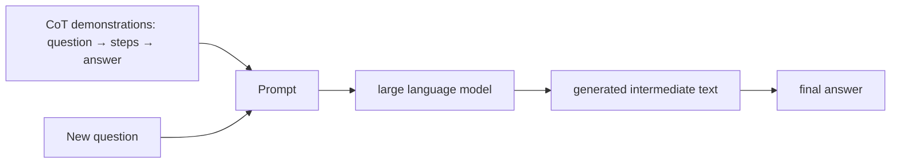
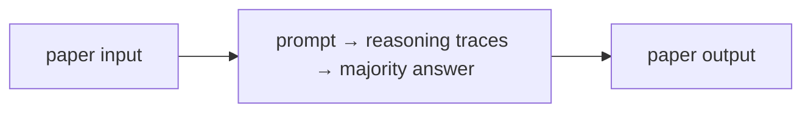
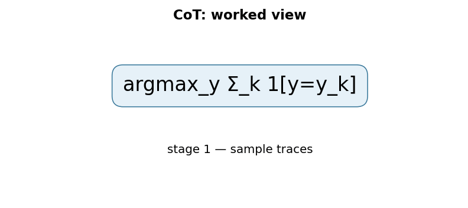

# Chain-of-Thought Prompting Elicits Reasoning in Large Language Models

## TL;DR

Chain-of-thought (CoT) prompting gives a language model few-shot examples that include intermediate reasoning steps as well as final answers. Wei et al. show that this can substantially improve arithmetic, commonsense, and symbolic reasoning in sufficiently large language models. It is an inference-time prompting method, not a new architecture, training objective, or proof that a displayed rationale faithfully caused an answer. The original paper reports that eight CoT demonstrations with a 540B-parameter model achieved state-of-the-art GSM8K accuracy, surpassing a finetuned GPT-3 verifier baseline in that experiment.

## Fun Map for First Years 🧭

Chain-of-thought prompting shows worked examples, so a model can write intermediate steps before its final answer. Steps can help, but they still need checking.

`🧮 problem → 🪜 intermediate steps → ✅ final answer → 🔍 verify important work`

Writing intermediate steps gives the model more places to keep track of numbers and decisions. It is useful scratch work, but it still needs checking.

For 17 + 25, a trace can write “17 + 20 = 37; plus 5 = 42” before the final answer. The extra tokens act as visible state that can reduce the difficulty of one large jump.

💻 **CS analogy:** a reasoning trace is an execution trace: intermediate state can make a hard final result easier to compute and debug.

## Math Playground 🧮

The essential equation or rule is:

```text
p(steps, answer | prompt)
```

**Essential concept:** p(steps, answer | prompt). The model does not solve arithmetic using a special calculator equation; it predicts a longer sequence: intermediate words first, final answer last. Those steps act like scratch-paper lines or temporary variables in a program. They can make a hard answer easier to reach, but convincing-looking steps are still not proof that every step is correct.

The comma means the model predicts the steps and final answer together. The vertical bar means both depend on the earlier prompt.

The expression is a joint probability, not a proof rule: the model can assign high probability to plausible but wrong steps. That is why verification tools and answer checks remain important.

## Background: What Came Before 🕰️

Large language models could answer many questions from a direct prompt, yet multi-step arithmetic and symbolic tasks often failed because the final answer had to appear in one jump. Fine-tuning a reasoning model was not always available. Chain-of-thought prompting was needed to show that demonstrations containing intermediate steps can unlock better in-context problem solving.

It was needed because direct prompts often forced a multi-step problem into one jump with too little room for intermediate state.

This made prompting a more capable problem-solving interface, and it motivated later work on sampling multiple traces, tools, and verifiers.

## Why It Matters

GPT-3 established that a decoder-only language model can adapt from examples placed in its context. A conventional few-shot example maps question directly to answer: input, then label. Many reasoning tasks have a harder shape. A word problem must identify quantities, select operations, apply them in order, and only then emit a number. Asking for the final answer in one jump can leave the model little textual structure in which to represent intermediate state.

CoT prompting changes the demonstrations. Instead of `Q: ... A: 42`, they show a natural-language sequence that decomposes the calculation or inference and ends with the answer. At test time the model continues that pattern. The paper’s central empirical claim is scale-sensitive: the benefit emerges naturally in sufficiently large models, rather than being a universal prompt trick for every small model. It evaluates three large language models across arithmetic, commonsense, and symbolic tasks.

This distinction matters for engineering. CoT is not a guarantee of correct reasoning, and a plausible trace is not a verified proof. A model can produce an incorrect intermediate step, rationalize an answer after the fact, or follow a demonstration’s surface style without understanding its logic. Nevertheless, making intermediate structure available gives a generator more tokens in which to perform a computation-like decomposition. It opened a major line of work on prompting, self-consistency, verification, tool use, and structured reasoning.

The method also separates training from deployment. No model weights are changed in ordinary few-shot CoT prompting; performance and cost are changed by the request context and generated output. That makes experimentation easy but puts prompt examples, token budget, privacy, and evaluation squarely in the application layer. A hidden prompt edit can materially change behavior even when the model version is unchanged.

## Core Intuition

Consider asking someone to solve a long-division problem while forbidding scratch paper. They may know the operations but make a slip because all intermediate state must remain in working memory. Give them a page and ask them to write each step, and the page becomes an external workspace. A CoT prompt gives a language model examples of what that workspace looks like in text.

The examples are not merely longer answers. They establish a format: identify facts, transform them, state a conclusion. The model is then more likely to emit a sequence whose early tokens constrain later tokens. This can make a hard direct mapping easier to express as several simpler next-token predictions. But the notebook analogy has a limit: seeing written work does not prove the writer used it honestly or correctly.



For example, an answer-only demonstration might teach `3 plus 4 → 7`. A CoT demonstration teaches `start at 3; add 4; total is 7`. The additional words can expose an operation and a state transition. They also consume tokens and can introduce extra opportunities for error, so more verbose prompting is not automatically better.

## The Mechanism

An autoregressive LM assigns probability to an output sequence token by token, \(p(y\mid x)=\prod_t p(y_t\mid x,y_{<t})\). Few-shot prompting prepends demonstrations to \(x\); the model is not updated, but conditioning changes every next-token distribution. In CoT, each demonstration includes a rationale \(r\) and answer \(a\). The requested completion is effectively a joint sequence \(p(r,a\mid x)\), rather than only the short answer distribution \(p(a\mid x)\).

The useful interpretation is decomposition, not a magical new inference engine. Generating a rationale creates intermediate tokens that subsequent tokens can attend to. A model may turn “solve this” into smaller text-prediction subproblems: extract numbers, describe an operation, compute a result, state an answer. Whether that sequence corresponds to an internally faithful causal process is a separate research question; the original paper demonstrates performance, not guaranteed interpretability.


```mermaid
flowchart TD
 X[question plus few-shot examples] --> R[generate rationale tokens]
 R --> F[generate answer token(s)]
 F --> E[task-specific answer extraction]
 E --> V[optional external verification]
 R --> SC[optional later: sample multiple traces]
 SC --> MV[majority vote / verifier]
```

The original paper uses few-shot CoT exemplars. “Let’s think step by step” zero-shot prompting, self-consistency sampling, tree search, tool calling, and hidden-reasoning policies are later methods or deployment choices. They should be described as successors, not silently attributed to the original result. The program in this directory explicitly demonstrates a later self-consistency-style majority vote over fixed traces because it supplies a clean deterministic invariant; it is not an implementation of the original single-chain prompt.

Prompt design is a data interface. Demonstrations should match the task distribution, use unambiguous answer formatting, and avoid leaking evaluation examples. If an answer parser expects `#### 42`, then every example and output policy should use that convention. The model may include the answer in a sentence, repeat it, or emit multiple candidates; a brittle parser can turn correct reasoning into an incorrect score. Separate raw generation, parsed answer, and evaluator result in logs.

Scale is central to the paper’s finding. Its abstract says reasoning abilities emerge naturally in sufficiently large models and identifies one 540B example; it does not establish a fixed parameter threshold that applies across datasets, tokenizers, training mixtures, or future architectures. Small models can be confused by long rationales, and a larger model may still fail on tasks requiring precise tools or missing information. Test the actual model and prompt budget instead of assuming CoT is monotonic.

## Practical Engineering Notes

### Worked Math & Dataflow

The compact view below makes the paper's central calculation concrete:

```text
argmax_y Σ_k 1[y=y_k]
```

In practice, the calculation is a pipeline: Self-consistency samples several reasoning paths and chooses the answer that appears most often. It can improve arithmetic reliability, but extra traces also increase latency and can repeat a shared error. The important engineering
choice is to preserve the paper's intended invariant while making the operation
fit the available memory, batch size, and evaluation protocol.






Hugging Face generation APIs and provider chat APIs can produce CoT-style text, but production systems should treat it as untrusted model output. Set maximum new-token limits, stop sequences, temperature, and retry behavior deliberately. A long rationale can dominate latency and cost, especially if multiple samples are generated for self-consistency. Use structured final-answer fields or a verifier when a downstream action depends on a result; do not parse an arbitrary prose paragraph with a fragile regular expression.

Few-shot examples are executable policy. Version them with model revision, system prompt, tokenizer, decoding settings, and evaluator. Test prompt injection: user text may imitate a demonstration boundary or ask the model to ignore prior examples. Delimit user content, avoid giving retrieved documents instruction authority, and keep tool permissions outside the model’s narrative output. CoT does not grant a model permission to execute code, transfer money, or access private data.

Reasoning traces can expose sensitive context, copyrighted text, private user information, or internal policy details. Decide whether traces are displayed, retained, redacted, or replaced with concise explanations based on the product and risk domain. In high-stakes arithmetic, finance, medicine, or law, use approved calculators, databases, or human review. A fluent chain is evidence of a generated explanation, not certification.

For evaluation, measure final-answer accuracy and also analyze error type: bad extraction, wrong arithmetic, irrelevant rationale, unsafe tool request, or missing information. Compare answer-only, CoT, and tool-assisted baselines at equal token/cost budgets. A CoT win on a curated benchmark can disappear when examples are mismatched or output length is constrained. The right operational question is whether the added reasoning tokens improve the decision enough to justify their latency, cost, and exposure.

There is an important distinction between a rationale as a user explanation and a rationale as a scratchpad. A user may benefit from a short derivation that names assumptions and cites evidence; a model may generate a much longer stream containing false starts, irrelevant associations, or sensitive context. Product design should decide which of those artifacts, if any, is shown. Do not promise that an exposed trace is a complete audit log. If auditability matters, record trusted inputs, tool calls, retrieved sources, deterministic calculations, and the final decision separately from free-form prose.

Few-shot selection is itself an optimization problem. Examples should cover the intended operation without copying test items or relying on accidental wording. A demonstration that uses dollars, for instance, can cause a model to imitate currency language on unrelated arithmetic. Keep exemplar order stable during evaluation, then test order variation and distractor examples as robustness checks. Prompt length is finite: adding one demonstration removes context available for the user question or retrieved evidence. The best number of exemplars is empirical and model-specific.

Answer verification can be stronger than rationale inspection. For arithmetic, parse a constrained final number and recompute it with a trusted calculator. For structured extraction, validate against a schema and source spans. For code, run tests in a sandbox. For factual claims, check retrieved evidence and date. These controls do not require deciding whether an internal-looking chain was faithful. They verify the externally meaningful property directly, which is usually more reliable for a production workflow.

Sampling needs care. Temperature zero produces one deterministic continuation for a fixed model/service configuration; higher temperature can explore alternative traces but also increases variance. Self-consistency can aggregate multiple samples when answers are independently distributed enough to benefit, but correlated mistakes can win a majority. Budget the number of samples, detect malformed final answers, and use a tie/low-agreement fallback rather than treating every vote as confidence.

Finally, reasoning tasks may be under-specified. A model can write a flawless calculation based on a missing assumption, such as a tax rate, date, unit conversion, or definition. A good CoT prompt can encourage the model to state uncertainty, but application logic should make missing inputs explicit and request clarification when needed. Better reasoning format cannot create absent evidence.

## Runnable Code Example

### Run it

The implementation is intentionally small and self-checking. From the repository root, use Python 3; the module docstring states the learning goal, comments identify the paper-specific calculation, and assertions verify the toy invariant.

```bash
python3 papers/14-chain-of-thought/code/trace_majority_vote.py
```

### Read it in order

Start with the module docstring, then follow the named helper calculations and the final assertions. The example is a dependency-light teaching implementation, not a production training system; change one input at a time and rerun it to see which invariant changes.


[`code/trace_majority_vote.py`](code/trace_majority_vote.py) parses five fixed arithmetic traces and majority-votes their final answers. It asserts that four correct traces beat one incorrect trace. This illustrates later self-consistency, not the original paper’s single-chain few-shot method; the distinction is deliberately documented in the code and mechanism section.

```bash
python3 papers/14-chain-of-thought/code/trace_majority_vote.py
```

## Common Misconceptions & Pitfalls

- **“A chain of thought proves the answer.”** It is generated text and can be wrong, post-hoc, or irrelevant.
- **“CoT is fine-tuning.”** Ordinary CoT prompting changes context at inference time, not weights.
- **“The original paper introduced every reasoning prompt variant.”** Zero-shot CoT and self-consistency are later work.
- **“More steps always help.”** They add cost, error opportunities, and sometimes distract smaller models.

## Interview Q&A

**Q:** What changes in CoT prompting compared with ordinary few-shot prompting?
**A:** Demonstrations contain intermediate rationale tokens before final answers.

**Q:** Why can intermediate tokens help?
**A:** They provide generated state that later tokens can condition on, decomposing a difficult direct answer.

**Q:** Does CoT guarantee faithful reasoning?
**A:** No; a plausible rationale is not proof of the model’s internal causal process.

**Q:** What is self-consistency?
**A:** A later technique that samples multiple reasoning paths and aggregates their answers, often by majority vote.

**Q:** What is the main production trade-off?
**A:** Potential accuracy gains versus more tokens, latency, cost, and sensitive generated content.

## Implementation Walkthrough

Chain-of-thought prompting changes the intermediate text a model is invited to
produce before its final answer. It can help multi-step tasks because earlier
generated steps become part of the context for later steps, but it does not
make every intermediate statement true. Use held-out answers, multiple prompt
forms, and task-specific verification rather than grading only whether an
explanation sounds plausible.

## SDE2 Interview Drill-down

These prompts are designed for a second-level software engineering interview: explain the mechanism, name the operational trade-off, and describe how you would test it.

**Q:** Walk through self-consistency over reasoning traces end to end. What does `argmax_y Σ_k1[y=y_k]` mean in an implementation?
**A:** Start by identifying the data structure entering the operation, the learned or configured values it uses, and the invariant that must hold at the output. In this paper, argmax_y Σ_k1[y=y_k] is not just notation: it tells you what is compared, normalized, accumulated, or optimized. A strong implementation makes those stages visible in separate functions, keeps tensor shapes and dtypes explicit, and tests a tiny hand-computed example before optimizing. Explain what happens when the inputs are short, padded, empty, or unusually large; those cases often reveal whether the code actually matches the paper.

**Follow-up:** Which invariant would you assert?
**A:** Assert the property that makes the method meaningful: probabilities normalize over valid choices, a residual preserves shape, a target does not bootstrap past termination, or an update leaves frozen state untouched. The assertion should be local and cheap enough to run in tests, not an end-to-end hope such as “accuracy improves.” Also compare the optimized path with a simple reference on random small inputs using an appropriate tolerance. That catches indexing, masking, reduction, and broadcasting errors while the failing example is still understandable.

**Q:** What is the main production trade-off, and how would you capacity-plan it?
**A:** The practical trade-off here is sampling more traces can improve majority reliability but increases latency and may amplify correlated errors. Estimate both arithmetic work and memory movement, then identify whether the service is compute-bound, bandwidth-bound, latency-bound, or limited by coordination. Include batch-size effects, peak activation/state memory, serialization, and cold-start behavior; average throughput can hide a bad tail latency. Choose a baseline configuration, measure it on representative shapes, and document which quality metric is allowed to move. If the system is distributed, include communication and retry behavior rather than treating the model operation as an isolated kernel.

**Follow-up:** What would make you reject an apparently faster optimization?
**A:** Reject it when it changes the evaluation contract, weakens isolation, creates silent quality regressions, or only wins on a synthetic shape. For this paper, watch especially for leaking sensitive reasoning, verbose unsupported traces, or correlated sampling. A safe rollout uses a reference implementation, shadow traffic or canaries, resource limits, and dashboards for both system and model metrics. Keep the old path available until numerical outputs, error rates, p95/p99 latency, and cost are stable across the important input distributions.

**Q:** How would you debug a model that passes unit tests but fails in production?
**A:** Reproduce the smallest production-shaped input and compare intermediate values against the reference path, not only the final score. Log versioned preprocessing, shapes, masks, random seeds where relevant, and the exact model/configuration identifiers; otherwise a numerical symptom can be caused by data drift or a serving mismatch. Separate failures into data, numerical stability, optimization, and infrastructure categories. For this method, begin with score final answers independently from trace quality and test adversarial problems, then run a controlled ablation that disables the paper-specific mechanism to determine whether the regression is in the mechanism or its integration.

**Follow-up:** What evidence would you present in the postmortem or interview?
**A:** Show one minimal failing example, the expected invariant, the observed intermediate divergence, and the fix’s regression test. Add a before/after metric table covering quality, memory, throughput, and tail latency, plus the rollout guard that would catch recurrence. This demonstrates engineering judgment: the goal is not merely to identify a clever algorithm, but to make its behavior observable, reproducible, and safe to operate.


## Further Reading

- [Original Chain-of-Thought paper](https://arxiv.org/abs/2201.11903)
- [Self-Consistency Improves Chain of Thought Reasoning](https://arxiv.org/abs/2203.11171)
- [Hugging Face generation strategies](https://huggingface.co/docs/transformers/generation_strategies)
- [GSM8K](https://arxiv.org/abs/2110.14168)
