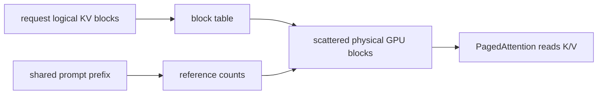
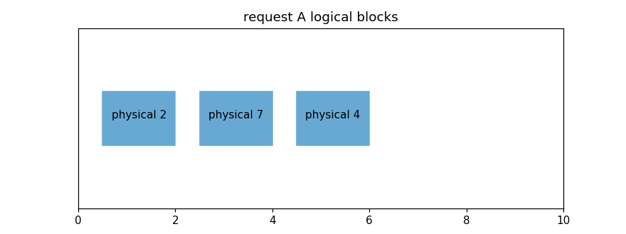
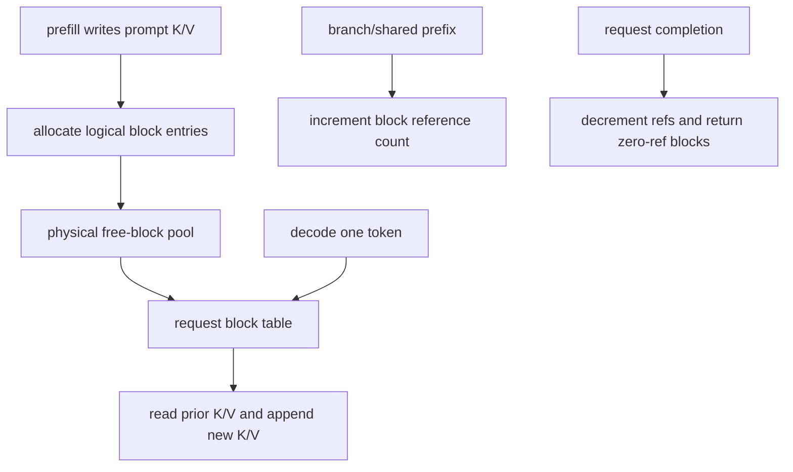
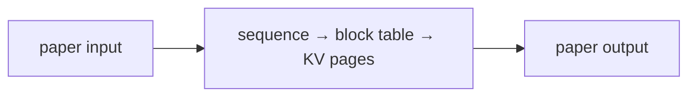
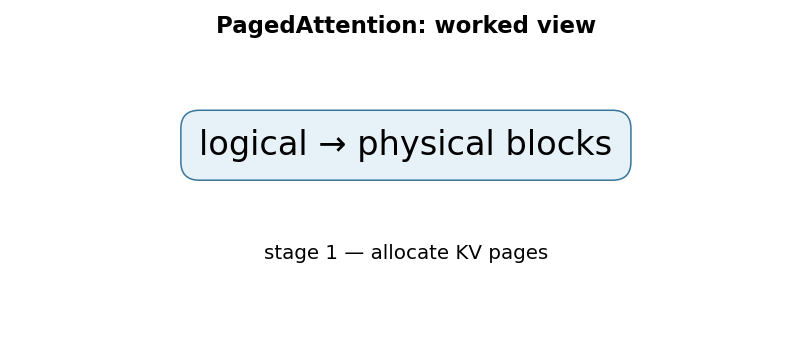

# Efficient Memory Management for Large Language Model Serving with PagedAttention

## TL;DR

PagedAttention is a serving-system technique for managing the growing key/value (KV) cache of autoregressive LLM requests. Instead of reserving one contiguous cache region per request, it stores fixed-size KV blocks wherever GPU memory has room and uses a per-request block table to make them logically contiguous. This sharply reduces memory waste from fragmentation and enables safe sharing of prompt-prefix blocks between requests. Kwon et al. build vLLM around this idea and report 2–4× higher throughput at similar latency than the systems compared in their SOSP 2023 evaluation.

## Fun Map for First Years 🧭

PagedAttention stores a model’s growing memory in small blocks, like library books on numbered shelves instead of one giant reserved desk.

`💬 request tokens → 🧱 KV-cache blocks → 🗺️ block table → 🚀 more requests fit`

Long conversations produce a growing cache of past-token information. PagedAttention keeps that cache in small reusable blocks, so one request does not need one giant unbroken memory region.

If two requests begin with the same system prompt, their logical block tables can point to shared physical blocks. They only need separate blocks once the requests diverge.

💻 **CS analogy:** PagedAttention uses virtual-memory-style indirection: a logical token address maps through a table to a physical memory block.

## Math Playground 🧮

The essential equation or rule is:

```text
block = floor(t/B),  offset = t mod B
```

**Essential equation:** block = floor(t/B), offset = t mod B. If each memory block holds B tokens, divide token number t by B: the whole-number part tells you which block to use, and the remainder tells you the slot inside it. For token 23 in blocks of 8, that is block 2, slot 7. This is the same page-number-and-offset arithmetic used by virtual memory.

The whole-number quotient chooses a block and the remainder chooses a slot inside it. For token 23 with blocks of 8, that is block 2, slot 7.

Integer division answers “which page?” and modulo answers “where inside that page?” These operations are constant-time, so indirection adds little computation compared with the memory it saves.

## Background: What Came Before 🕰️

Autoregressive serving stores a growing key–value cache for every request, and conventional contiguous allocation wastes memory when requests have different lengths. That waste restricts batch size and throughput. PagedAttention was needed to manage KV cache memory in fixed blocks, much like virtual memory, so more requests fit safely.

This was needed to serve many variable-length requests without wasting memory on large contiguous allocations.

This let a serving engine handle a changing mix of request lengths with less fragmentation, increasing practical throughput rather than changing model accuracy.

## Why It Matters

FlashAttention makes the attention calculation itself more IO-efficient. Serving has a different bottleneck: after every generated token, the model needs the keys and values for all previous tokens in the request. This KV cache is large, grows token by token, and has an unknown final length when generation begins. A conventional allocator may reserve a maximum-length contiguous region for every request or repeatedly allocate and copy regions as a request grows. Both approaches waste expensive GPU memory and limit how many requests can be batched.

PagedAttention borrows the address-translation idea of operating-system virtual memory. A request sees a logical sequence of KV blocks numbered 0, 1, 2, and so on. The allocator maps each logical block to any available physical GPU block. Attention reads the block table to find the keys and values. The tokens are contiguous *logically* even when physical blocks are scattered. This is an analogy, not CPU paging: vLLM’s blocks remain GPU-resident during normal attention rather than faulting from disk.

The paper’s abstract identifies both fragmentation and redundant duplication as limitations of existing serving systems. Fixed blocks reduce internal waste to at most the partly filled final block; they also make a prompt prefix shareable. Parallel samples or beam branches can reference the same completed prefix blocks and allocate new blocks only when their generated suffixes diverge. Reference counts prevent a shared block from being reclaimed while another request still needs it.

## Core Intuition

Think of a request’s conversation history as a book whose pages need not sit next to one another in a warehouse. The request owns a table saying “logical page 0 is shelf 19, page 1 is shelf 4.” A reader follows the table and experiences one continuous book. A second request with the same opening chapter can point to the same physical pages instead of photocopying them.

The benefit is not that storage becomes infinite. Every generated token still needs KV space. The benefit is that the scheduler can use free blocks from across memory and release them promptly, rather than holding a large reserved but unused tail for each active request. Block size is a trade-off: smaller blocks reduce unused tail space but grow table and management overhead; larger blocks simplify bookkeeping but waste more space in a partially filled final block.



## The Mechanism

Autoregressive decoding has two phases. During prefill, the server processes the prompt and writes a KV entry for every layer, head, and prompt token. During decode, it produces one token at a time; each step reads the existing KV cache and appends a new entry. The cache therefore grows dynamically and is often the dominant per-request memory cost at long context lengths.

PagedAttention partitions each request’s KV cache into blocks that each hold a fixed number of token positions. A logical token index \(i\) maps to logical block \(\lfloor i/B\rfloor\) and in-block offset \(i\bmod B\), where \(B\) is block capacity. A block table maps that logical block to its physical block ID. The attention kernel gathers keys and values through this mapping while computing attention; it does not require the physical storage to be adjacent.





Sharing is especially useful for parallel sampling and beam search. A common prompt is encoded once, and branches initially refer to the same physical prefix blocks. If a branch must write into a partially filled shared block, a copy-on-write-style operation is needed before modifying it; otherwise one request could overwrite another’s cache. When a request completes, its references are decremented. Only blocks whose count reaches zero return to the free pool. The toy program asserts this lifetime rule.

PagedAttention is distinct from FlashAttention. FlashAttention changes how attention tiles scores and avoids materializing an \(N\times N\) matrix during an operation. PagedAttention changes where persistent K/V state for many serving requests lives and how it is addressed. A serving stack can use both: a fast attention kernel and a block-managed KV allocator address different layers of the performance problem.

The paper reports near-zero KV-cache waste and flexible sharing as system properties, plus 2–4× throughput gains at the same latency against named systems in its evaluation. Do not treat that range as a universal SLA. Throughput depends on model size, prompt/output lengths, decode algorithm, batch scheduler, GPU, network topology, kernel versions, and workload shape. Longer sequences and complex decoding are specifically noted in the abstract as settings where the reported improvement is more pronounced.

### Mechanism in Code

At implementation level, the mechanism operates on logical token blocks and physical KV pages. A faithful
forward pass should follow this order: append block mappings, read physical pages during decode, share prefixes, and copy on write. Keep the intermediate
representation available while debugging; collapsing everything into one
opaque framework call makes shape and numerical errors much harder to isolate.

The key production failure to guard against is reusing a page after one request frees it while another still references it. Add a tiny
reference test with hand-checkable values, then add a property test that
covers padding, empty/short inputs, boundary probabilities, and the largest
supported shape. Compare intermediate tensors with tolerances appropriate to
the dtype, and log the paper-specific statistic during a canary rollout.


## Practical Engineering Notes

### Worked Math & Dataflow

The compact view below makes the paper's central calculation concrete:

```text
logical → physical blocks
```

In practice, the calculation is a pipeline: A sequence sees contiguous logical token blocks even when its KV cache is stored in non-contiguous physical pages. Reference counting and copy-on-write allow safe prefix sharing. The important engineering
choice is to preserve the paper's intended invariant while making the operation
fit the available memory, batch size, and evaluation protocol.






vLLM implements PagedAttention and is the primary real-system pointer. Compare it with Hugging Face Text Generation Inference or other servers at the level of scheduler, batching, cache policy, model support, and operational requirements—not a single headline throughput number. Profile prefill and decode separately: prompt-heavy traffic stresses compute and input bandwidth, while many concurrent decodes stress KV capacity and scheduler behavior.

Monitor free blocks, allocated blocks, partially filled blocks, prefix-cache hits, reference counts, evictions, prefill/decode queue time, and p50/p95/p99 time to first token and inter-token latency. A high cache hit rate can still be bad if permission-aware cache keys are wrong; a full free pool can coexist with poor latency if requests are scheduled inefficiently. Include model revision, tokenizer, adapter identity, and tenant/authorization scope in prefix-cache identity.

Block size is a tuning parameter, not a cosmetic constant. Smaller blocks reduce final-block waste and improve sharing granularity, but add block-table lookup, metadata, and allocation traffic. Larger blocks can improve kernel regularity but reserve more unused token slots at request ends. Test real prompt and completion distributions, including cancellation and streaming disconnects; leaked references after a client disconnect turn a memory-efficiency feature into a slow capacity leak.

Use admission control and quotas. Paged allocation makes memory usage predictable in blocks, so a scheduler can reject or queue work before OOM rather than gambling on maximum output lengths. Release blocks on normal completion, cancellation, error, and worker failure paths. For multi-tenant workloads, never allow a reused physical block to expose stale K/V data; allocator zeroing/isolation behavior and cache-key authorization are security requirements, not optional optimizations.

## Runnable Code Example

### Run it

The implementation is intentionally small and self-checking. From the repository root, use Python 3; the module docstring states the learning goal, comments identify the paper-specific calculation, and assertions verify the toy invariant.

```bash
python3 papers/15-pagedattention-vllm/code/block_manager.py
```

### Read it in order

Start with the module docstring, then follow the named helper calculations and the final assertions. The example is a dependency-light teaching implementation, not a production training system; change one input at a time and rerun it to see which invariant changes.


[`code/block_manager.py`](code/block_manager.py) builds a tiny fixed-size block manager. Two requests share a prefix physical block, map a logical token index to physical block plus offset, then release their blocks in turn. Assertions verify that the prefix remains allocated after the first request finishes and is reclaimed only after the final reference is released.

```bash
python3 papers/15-pagedattention-vllm/code/block_manager.py
```

## Common Misconceptions & Pitfalls

- **“PagedAttention pages KV data to CPU or disk.”** Its central design is GPU-resident fixed blocks with logical-to-physical translation.
- **“It replaces attention kernels such as FlashAttention.”** It manages persistent serving memory; kernels and cache management solve separate problems.
- **“Sharing a prefix is always safe.”** Shared blocks need reference counting, authorization-aware keys, and copy-on-write protection for modifications.
- **“Near-zero waste means no memory limit.”** Active KV entries, weights, scheduler queues, and block metadata still consume finite GPU memory.

## Quick Concept Checks

**Q:** Why does an LLM server need a KV cache?
**A:** Decode steps reuse prior attention keys and values instead of recomputing the full prefix every token.

**Q:** What does a block table map?
**A:** A request’s logical KV block number to an arbitrary physical GPU block.

**Q:** Why use fixed-size blocks?
**A:** They avoid large contiguous reservations and bound unused tail memory.

**Q:** Why reference count shared prefix blocks?
**A:** A block must not be freed while another beam, sample, or request still reads it.

**Q:** What is the principal operational trade-off?
**A:** Better utilization and sharing versus allocator, scheduler, metadata, and block-size complexity.

## Implementation Walkthrough

PagedAttention stores each request's key-value cache in fixed-size blocks and
maps logical token positions to physical blocks. This avoids reserving one
large contiguous cache for every possible request length and permits sharing
prefix blocks safely. A serving implementation must track block ownership,
reference counts, eviction, and request cancellation; a cache leak or mistaken
shared writable block is both a throughput and correctness failure.

## Interview Q&A

> **SDE2 drill-down:** Explain the mechanism, show the invariant, name the production trade-off, and give evidence from a test or debugging experiment. Use inline `code`, fenced snippets, and **bold** labels to make the reasoning scannable.

**Q:** Walk through **paged KV-cache allocation for continuous batching** end to end. How would you implement `logical block → physical block`?
**A:** Decompose the expression into the actual data path: inputs enter the paper-specific transformation, intermediate scores or states are computed, invalid elements are excluded, and the result is reduced into the output or loss. For this paper, `logical block → physical block` is an executable contract, not decoration: document tensor shapes, ownership of mutable state, numerical precision, and where batching changes semantics. Keep a small reference implementation beside the optimized path so a reviewer can connect each line of `code` to one term in the equation.

**Follow-up:** What invariant would you assert, and why is it stronger than checking final accuracy?
**A:** Assert that **a request can read only its own logical blocks and reference counts free blocks exactly once**. That property is local enough to fail near the defect, whereas accuracy can remain acceptable while a mask, reduction, or state boundary is wrong on a rare input. Add a hand-computed fixture, a randomized differential test against the reference, and shape/dtype assertions at the API boundary. The test should also cover an empty, padded, terminal, high-degree, long-context, or otherwise adversarial case when that input is meaningful for this mechanism.

**Q:** What is the main production trade-off in this paper, and how would you capacity-plan it?
**A:** The central trade-off is that **non-contiguous pages reduce fragmentation, while block tables add indirection and bookkeeping**. Capacity planning therefore needs more than average FLOPs: measure peak memory, memory bandwidth, communication, preprocessing, batch-size sensitivity, and p95/p99 latency on representative distributions. Define a quality budget before optimizing, then compare a simple baseline with the paper mechanism using identical inputs and seeds. A faster path that silently changes tokenization, routing, masking, sampling, or optimization behavior is not an acceptable optimization until its quality impact is measured.

**Follow-up:** Which failure mode would make you roll back first?
**A:** Roll back on evidence of **cross-request cache contamination, fragmentation, or block-table races**, especially when the symptom is silent and outputs still look plausible. Add dashboards for the paper-specific statistic, error and timeout rates, resource saturation, and a task metric sliced by difficult inputs. Use a canary or shadow comparison with the previous implementation, retain the old path behind a flag, and make the rollback decision threshold explicit before deployment. The important SDE2 judgment is to protect the paper’s semantic contract, not merely to chase a faster benchmark.

**Q:** A model passes unit tests but fails in production. What is your debugging plan?
**A:** Start with **stress concurrent requests with isolation and reference-count assertions**. Reproduce the smallest production-shaped example, freeze the model and preprocessing versions, and compare intermediate tensors or records rather than only the final prediction. Check data contracts, masks, sequence boundaries, random seeds, numerical precision, and serving mode in that order; then bisect between the reference and optimized implementations. If the defect is not numerical, run a controlled ablation that removes the paper-specific mechanism and compare the resulting failure rate, which separates integration problems from a bad mechanism or configuration.

**Follow-up:** What evidence would you present in the review or postmortem?
**A:** Present one minimal failing input, the expected **a request can read only its own logical blocks and reference counts free blocks exactly once**, the first intermediate value that diverged, and the regression test that now protects it. Include a before/after table for task quality, memory, throughput, p95/p99 latency, and cost, with slices for the failure population. A complete SDE2 answer also states the rollout guard, owner, and alert threshold. That turns a paper idea into an operable system rather than a one-line claim about an equation.

## Further Reading

- [Original PagedAttention/vLLM paper](https://arxiv.org/abs/2309.06180)
- [vLLM project](https://github.com/vllm-project/vllm)
- [FlashAttention](https://arxiv.org/abs/2205.14135)
- [Hugging Face Text Generation Inference](https://github.com/huggingface/text-generation-inference)
