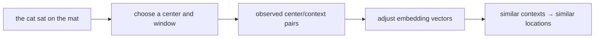
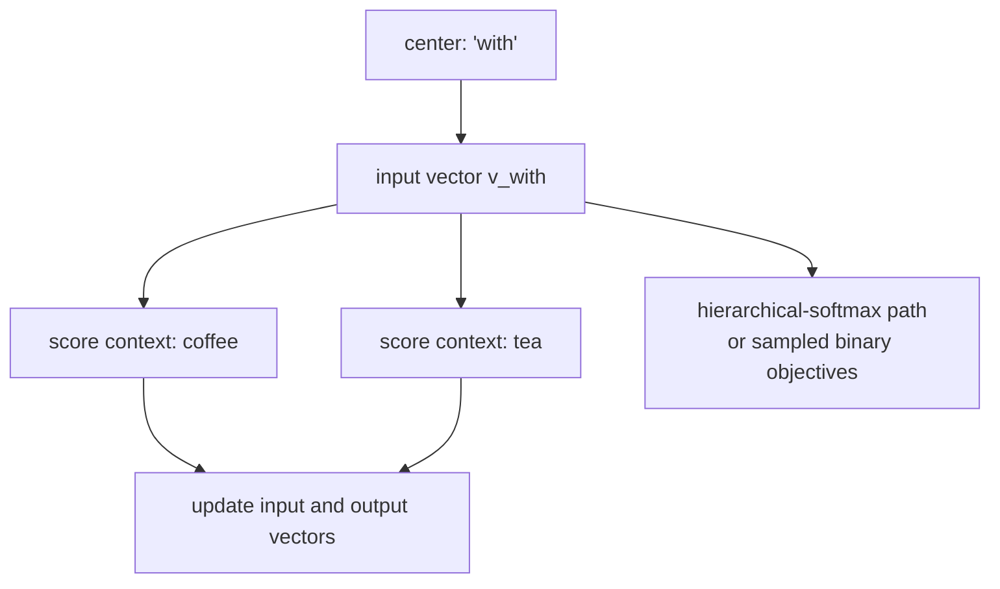
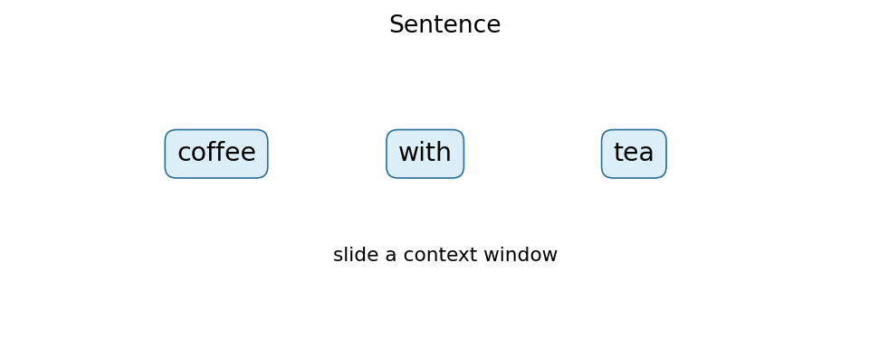
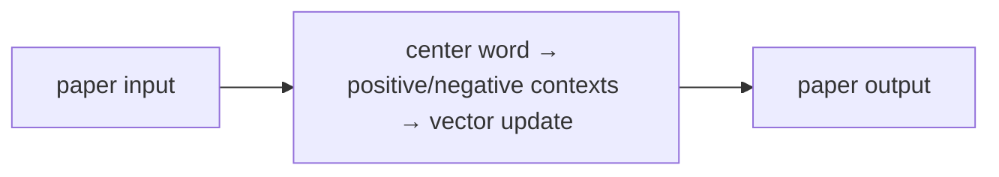
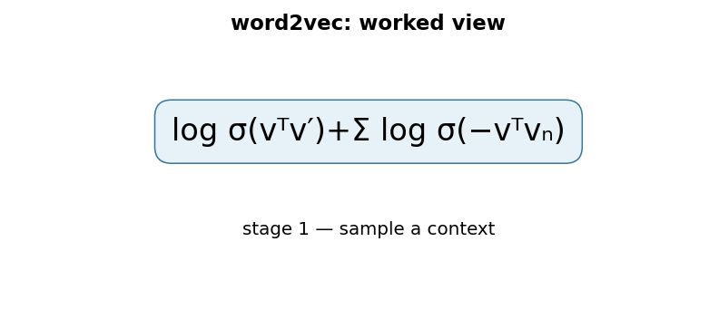

# Efficient Estimation of Word Representations in Vector Space (word2vec)

## TL;DR

Mikolov and colleagues introduced two very small neural objectives, CBOW and
skip-gram, for learning a vector for each word from its neighboring words.
Instead of treating `coffee` and `tea` as unrelated integer IDs, training puts
words used in similar contexts in nearby regions of a vector space. The paper's
point was as much speed as representation quality: removing a costly hidden
layer made it practical to learn useful vectors from very large corpora. These
are static embeddings, so one vector cannot choose a different meaning for
`bank` in a river sentence and a finance sentence.

## Fun Map for First Years 🧭

word2vec learns a map where words used in similar neighborhoods stand near each other, like classmates grouped by the clubs they join.

`📝 nearby words → 🧠 adjust word vectors → 🗺️ similar contexts nearby → 🔎 useful comparisons`

Words that appear in similar neighborhoods get similar coordinates. That turns text patterns into numbers that simple programs can compare quickly.

In “I drink coffee” and “I drink tea,” coffee and tea see similar neighboring words. Training moves their vectors so a later program can recognize that similarity.

💻 **CS analogy:** this is an embedding table plus a vector-search score: a word ID looks up a row, and dot products rank candidate neighbors.

## Math Playground 🧮

The essential equation or rule is:

```text
p(o|c) = exp(u_oᵀv_c) / Σ_w exp(u_wᵀv_c)
```

**Essential equation:** \(p(o\mid c)=\exp(u_o^Tv_c)/\sum_w\exp(u_w^Tv_c)\). c is a center word and o a nearby word. Their dot product is a “how well do these arrows point together?” score. Exponentials make high scores stand out, and dividing by the sum converts all candidate scores into probabilities that add to 1. Training raises the probability of words that really occur nearby.

The dot product measures how well two word arrows agree. Dividing by the total turns all candidate scores into probabilities that add to 1.

If two vectors point in similar directions, their dot product is large. The exponential makes that large score stand out before the division converts all candidates into a probability distribution.

## Background: What Came Before 🕰️

Before word2vec, programs often represented a word as a huge one-hot ID or counted co-occurrences in a table. Those representations made related words look unrelated and were costly to use at scale. This paper was needed to make compact, reusable word features practical on very large text collections.

This gave NLP compact features where related words could be discovered from usage instead of manually coded.

This made word meaning usable as a compact numeric feature, though one static vector still cannot separate every sense of a word.

## Why It Matters

Older count tables and one-hot encodings made vocabulary items independent:
an application had to rediscover that `Paris` and `Rome` behave similarly.
Neural language models could learn dense representations, but their hidden
layers and vocabulary-wide output made large-scale training expensive. The
2013 paper isolated the representation-learning step into simple log-linear
models. Its authors reported training high-quality vectors from 1.6 billion
words in under a day, then evaluated relationships such as city/country and
singular/plural using vector offsets.

That changed everyday NLP practice. A frozen embedding matrix became a cheap
input feature for classifiers, taggers, retrieval systems, and sequence models.
Today, transformer token embeddings are trained end-to-end and contextualize a
token with attention, but word2vec remains the clearest introduction to why an
embedding lookup is learnable rather than merely a table of numbers. It also
introduced engineering ideas—sampling, frequency-aware output coding, and
streaming corpus updates—that recur in large-scale training.

## Core Intuition

Imagine learning a map of a city from who regularly shares a table at lunch.
You never receive labels such as “beverage” or “capital”; you only observe
neighbors. If `coffee` often occurs near `tea`, `cup`, and `cafe`, their map
locations should become useful for similar downstream decisions. A word vector
is that location, not a dictionary definition.



CBOW takes surrounding words, averages their vectors, and predicts the middle
word: it is the speedy “fill in the blank” version. Skip-gram reverses the
arrow: one center word predicts each nearby context word. Neither model reads a
whole document or understands a sentence grammar. The useful pressure comes
from many overlapping local windows: words that substitute for one another
receive related training signals.

## The Mechanism

Let each vocabulary item have an input vector \(v_w\) and an output vector
\(u_w\). In skip-gram, a center word \(c\) and one observed neighboring word
\(o\) should score highly through the dot product \(u_o^T v_c\). With a full
softmax, the conditional probability is

\[
p(o\mid c)=\frac{\exp(u_o^T v_c)}{\sum_{w\in V}\exp(u_w^T v_c)}.
\]

Training maximizes the log probability of every center/context pair in a
window. CBOW instead averages or sums its context input vectors and predicts
the center. The original paper used a hierarchical softmax: vocabulary words
are leaves of a Huffman binary tree, so a prediction follows a path of binary
decisions. Frequent words receive short paths, avoiding one score for every
vocabulary entry.





The animation is illustrative, not a figure or measured result from the paper.
It shows the later, widely used negative-sampling implementation pattern: for
an observed pair, maximize \(\log\sigma(u_o^T v_c)\), while for a few sampled
noise words \(n\), maximize \(\log\sigma(-u_n^T v_c)\). This turns one huge
multiclass prediction into several binary distinctions. It is important not to
attribute negative sampling to this particular paper's reported architecture;
the paper presents hierarchical softmax, while negative sampling appeared in
the follow-up word2vec paper.

For a positive pair, the derivative increases its dot product. For a negative
pair, it decreases the dot product. Updating both the center and context-side
tables lets context statistics settle into geometry. Cosine similarity is then
often used at query time because it compares direction rather than raw vector
length. The famous analogy calculation, such as `Paris - France + Italy`, is a
nearest-neighbor probe, not a law of language and not evidence that a model has
symbolically reasoned about geography.

The paper compared CBOW and skip-gram on a semantic/syntactic relationship
test. Its 640-dimensional comparison reported stronger semantic accuracy for
skip-gram and stronger syntactic accuracy for CBOW; results depend on corpus,
window, vocabulary, and metric. The central contribution is the efficient
architecture, not a claim that a single benchmark establishes understanding.

### Mechanism in Code

At implementation level, the mechanism operates on center/context ids and sampled negatives. A faithful
forward pass should follow this order: score the positive pair, score negatives, compute binary logistic gradients, and update vectors. Keep the intermediate
representation available while debugging; collapsing everything into one
opaque framework call makes shape and numerical errors much harder to isolate.

The key production failure to guard against is sampling negatives from an unsuitable frequency distribution. Add a tiny
reference test with hand-checkable values, then add a property test that
covers padding, empty/short inputs, boundary probabilities, and the largest
supported shape. Compare intermediate tensors with tolerances appropriate to
the dtype, and log the paper-specific statistic during a canary rollout.


## Practical Engineering Notes

### Worked Math & Dataflow

The compact view below makes the paper's central calculation concrete:

```text
log σ(vᵀv′)+Σ log σ(−vᵀvₙ)
```

In practice, the calculation is a pipeline: Skip-gram increases the score of a real center-context pair and decreases scores for sampled negatives. Negative sampling turns a large vocabulary normalization into a few binary decisions. The important engineering
choice is to preserve the paper's intended invariant while making the operation
fit the available memory, batch size, and evaluation protocol.






For production, use a maintained implementation rather than this tiny demo.
`gensim.models.Word2Vec` provides skip-gram/CBOW training and vocabulary
management; PyTorch's `nn.Embedding` is the usual building block when the
embedding is part of a larger model. Keep the text normalization, tokenizer,
vocabulary cutoff, and embedding artifact versioned together. A changed
lowercasing rule silently changes IDs and makes an old index or classifier
incompatible.

The output table can dominate memory: two float32 tables of \(|V|\times d\)
need roughly \(8|V|d\) bytes during basic training. Subsampling very common
words, discarding rare words, hierarchical softmax, or negative sampling reduce
compute, but each changes what “co-occurrence” means. Stream corpus shards and
record the random seed and worker count; asynchronous/hogwild-style updates can
be fast but less reproducible. For search, normalize only if the intended score
is cosine similarity, and use an approximate-nearest-neighbor index such as
FAISS when scans no longer fit the latency budget.

Static embeddings encode corpus biases and stale language. Audit nearest
neighbors and downstream slices instead of treating a visually pleasing analogy
as a safety test. They also have no vector for a truly unseen word unless the
pipeline supplies an `UNK` rule; subword methods such as SentencePiece or
fastText address that limitation differently. Do not mix vectors trained with
different preprocessing or dimensions in the same retrieval index.

Evaluate embeddings with the job they will actually serve. Intrinsic neighbor
lists and analogy accuracy are useful regression checks, but they do not prove
that a ranking, moderation, or classification product improves. Pin a held-out
downstream evaluation, watch for vocabulary coverage by language and customer
segment, and decide explicitly how a missing token is represented. If vectors
are exposed through nearest-neighbor search, retain document-level permission
filters outside the vector lookup: embedding proximity is not authorization.

## Runnable Code Example

### Run it

The implementation is intentionally small and self-checking. From the repository root, use Python 3; the module docstring states the learning goal, comments identify the paper-specific calculation, and assertions verify the toy invariant.

```bash
python3 papers/16-word2vec/code/skipgram_negative_sampling.py
```

### Read it in order

Start with the module docstring, then follow the named helper calculations and the final assertions. The example is a dependency-light teaching implementation, not a production training system; change one input at a time and rerun it to see which invariant changes.


[`code/skipgram_negative_sampling.py`](code/skipgram_negative_sampling.py)
implements one scalar logistic update for an observed pair and for sampled
noise. It deliberately avoids a training framework so the invariant is visible:
the positive pair's score rises, while the negative pair's score falls.

```bash
python3 papers/16-word2vec/code/skipgram_negative_sampling.py
```

This is a teaching fragment, not a trainer: a real model updates vector
coordinates for many windows, samples negatives from a frequency distribution,
and manages two embedding matrices.

## Common Misconceptions & Pitfalls

**“word2vec is one algorithm.”** It is commonly used as a family name. This
paper describes CBOW and skip-gram with hierarchical softmax; negative sampling
is a later, related optimization.

**“Close vectors mean synonyms.”** Shared contexts can also make antonyms,
topical associates, and stereotyped associations close. Similarity is a corpus
statistic, not a lexical guarantee.

**“Vector arithmetic always works.”** An analogy benchmark selects examples
where an offset is useful and exact-match scoring is brittle. Multiword names,
polysemy, and cultural variation routinely break it.

## Interview Q&A

**Q:** What is the difference between CBOW and skip-gram?
**A:** CBOW predicts a center word from its context; skip-gram predicts context
words from one center word. CBOW is often cheaper, while the best choice is
empirical.

**Q:** Why are there two embedding tables during training?
**A:** A word can be a center and a context target. Separate input and output
roles make the prediction objective simple; applications often retain input
vectors, or combine them after checking the implementation convention.

**Q:** Why not compute full softmax for every pair?
**A:** It scores every vocabulary word, so cost grows with vocabulary size.
Hierarchical softmax and negative sampling approximate a cheaper learning
signal.

**Q:** What does the window size trade off?
**A:** Small windows emphasize local/syntactic context; wider windows include
broader topical association and increase the number of training pairs.

**Q:** Why do transformers reduce the need for word2vec?
**A:** They learn token representations in task context, so `bank` can differ
by sentence. They still use learned embedding lookups at their input.

## Implementation Walkthrough

Skip-gram starts with a center word and learns to score nearby context words
above sampled noise words. Negative sampling avoids a full vocabulary softmax,
but its noise distribution and number of negatives change the learned space.
Build examples from a fixed window, exclude padding and self-pairs, then inspect
nearest neighbors and a downstream task rather than assuming lower loss means
better semantic behavior.

## SDE2 Interview Drill-down

These prompts are designed for a second-level software engineering interview: explain the mechanism, name the operational trade-off, and describe how you would test it.

**Q:** Walk through skip-gram with negative sampling end to end. What does `logσ(vᵀv′)+Σlogσ(−vᵀvₙ)` mean in an implementation?
**A:** Start by identifying the data structure entering the operation, the learned or configured values it uses, and the invariant that must hold at the output. In this paper, logσ(vᵀv′)+Σlogσ(−vᵀvₙ) is not just notation: it tells you what is compared, normalized, accumulated, or optimized. A strong implementation makes those stages visible in separate functions, keeps tensor shapes and dtypes explicit, and tests a tiny hand-computed example before optimizing. Explain what happens when the inputs are short, padded, empty, or unusually large; those cases often reveal whether the code actually matches the paper.

**Follow-up:** Which invariant would you assert?
**A:** Assert the property that makes the method meaningful: probabilities normalize over valid choices, a residual preserves shape, a target does not bootstrap past termination, or an update leaves frozen state untouched. The assertion should be local and cheap enough to run in tests, not an end-to-end hope such as “accuracy improves.” Also compare the optimized path with a simple reference on random small inputs using an appropriate tolerance. That catches indexing, masking, reduction, and broadcasting errors while the failing example is still understandable.

**Q:** What is the main production trade-off, and how would you capacity-plan it?
**A:** The practical trade-off here is negative sampling avoids a full vocabulary softmax but changes the learned objective and frequency bias. Estimate both arithmetic work and memory movement, then identify whether the service is compute-bound, bandwidth-bound, latency-bound, or limited by coordination. Include batch-size effects, peak activation/state memory, serialization, and cold-start behavior; average throughput can hide a bad tail latency. Choose a baseline configuration, measure it on representative shapes, and document which quality metric is allowed to move. If the system is distributed, include communication and retry behavior rather than treating the model operation as an isolated kernel.

**Follow-up:** What would make you reject an apparently faster optimization?
**A:** Reject it when it changes the evaluation contract, weakens isolation, creates silent quality regressions, or only wins on a synthetic shape. For this paper, watch especially for bad negative distribution or evaluating analogy quality as truth. A safe rollout uses a reference implementation, shadow traffic or canaries, resource limits, and dashboards for both system and model metrics. Keep the old path available until numerical outputs, error rates, p95/p99 latency, and cost are stable across the important input distributions.

**Q:** How would you debug a model that passes unit tests but fails in production?
**A:** Reproduce the smallest production-shaped input and compare intermediate values against the reference path, not only the final score. Log versioned preprocessing, shapes, masks, random seeds where relevant, and the exact model/configuration identifiers; otherwise a numerical symptom can be caused by data drift or a serving mismatch. Separate failures into data, numerical stability, optimization, and infrastructure categories. For this method, begin with check positive scores rise relative to sampled negatives and audit neighbors, then run a controlled ablation that disables the paper-specific mechanism to determine whether the regression is in the mechanism or its integration.

**Follow-up:** What evidence would you present in the postmortem or interview?
**A:** Show one minimal failing example, the expected invariant, the observed intermediate divergence, and the fix’s regression test. Add a before/after metric table covering quality, memory, throughput, and tail latency, plus the rollout guard that would catch recurrence. This demonstrates engineering judgment: the goal is not merely to identify a clever algorithm, but to make its behavior observable, reproducible, and safe to operate.


## Further Reading

- [Original paper](https://arxiv.org/abs/1301.3781)
- [Distributed Representations of Words and Phrases and their Compositionality](https://arxiv.org/abs/1310.4546)
- [Gensim Word2Vec documentation](https://radimrehurek.com/gensim/models/word2vec.html)
- [FAISS documentation](https://faiss.ai/)
