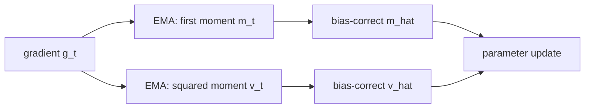
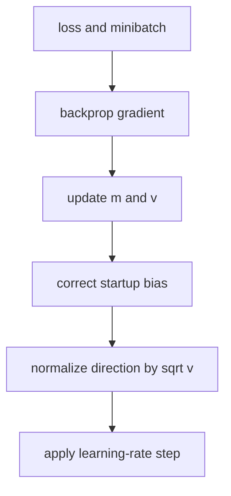
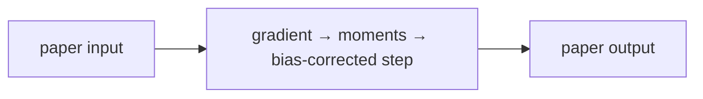
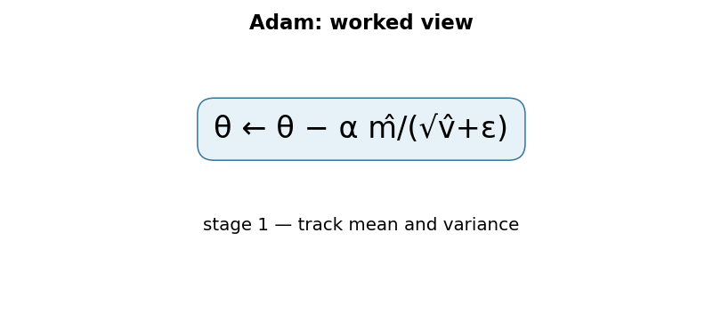

# Adam: A Method for Stochastic Optimization

## 1. TL;DR
Adam is a first-order optimizer that keeps an exponentially decayed average of
gradients and of squared gradients for every parameter. The first estimate
provides a direction with momentum; the second scales that direction down where
recent gradients have been large. Bias correction matters at the start because
both moving averages were initialized at zero. Adam became a common default
because it is simple, efficient, and works well with noisy or sparse gradients,
not because it removes the need to tune a training run.

## 2. Fun Map for First Years
Adam is a careful downhill walker: it remembers the usual slope and slows down on bumpy directions, helping training take steadier steps.

`📉 gradient → 🧠 remember direction + bumpiness → 👣 scaled update → 🎯 lower loss`

Training is like walking downhill in fog. Adam remembers the recent downhill direction but slows down on bumpy, unreliable directions.

If recent gradients repeatedly point left, Adam keeps moving left; if they are large and erratic, it reduces the step size. It combines momentum with a per-weight caution signal.

💻 **CS analogy:** Adam is like monitoring a noisy service: keep a smoothed recent trend and a smoothed “how jumpy is it?” metric before changing a setting.

### Beginner walkthrough

Read the arrows as a sequence of responsibilities. First identify what enters
the system, then ask what the paper changes, what information is preserved or
discarded, and what leaves the operation. For **Adam adaptive moment updates with bias correction**, the key question
is not “does the model sound clever?” but “which intermediate value carries the
new information, and what would go wrong if it were missing?”

### CS student checkpoint

The map corresponds to a small program: input data enters a function, the
paper-specific state or transformation runs, and an assertion checks **first and second moments advance with the same step and state is not silently reset**.
The equation `θ←θ−αm̂/(√v̂+ε)` is the compact specification for that function. Trace
one concrete item through each arrow before thinking about larger batches,
parallel hardware, or production optimizations.

## 3. Math Playground
The essential equation or rule is:

```text
m_t = β₁m_(t−1) + (1−β₁)g_t
v_t = β₂v_(t−1) + (1−β₂)g_t²
```

**Essential equations:** \(m_t=\beta_1m_{t-1}+(1-\beta_1)g_t\) and \(v_t=\beta_2v_{t-1}+(1-\beta_2)g_t^2\). A gradient g tells which way to change a weight now. m is a smoothed direction vote from recent gradients; v measures how wildly that direction has varied. Adam divides by \(\sqrt{v_t}\), so a noisy coordinate gets smaller, safer steps.

m is a smoothed direction vote; v measures recent squared gradient size. Dividing by √v makes unusually noisy coordinates take smaller steps.

β values close to 1 remember more history, while values closer to 0 react faster to new gradients. Squaring g removes its sign so v measures size rather than direction.

## 4. Background: What Came Before
Plain SGD used the latest gradient as its whole steering signal, while momentum helped smooth it and RMSProp scaled coordinates by recent squared gradients. Tuning either method still required care. Adam was needed as a simple default that combines both ideas and works well across many neural-network jobs.

Adam was needed because one fixed learning-rate rule can be slow or unstable when weights receive gradients of very different sizes.

This gave deep-learning practitioners a robust default optimizer, although learning rate, weight decay, and data scale still need deliberate tuning.

## 5. Why It Matters
Plain stochastic gradient descent uses one global learning rate. A coordinate
that rarely receives a gradient and a coordinate whose gradient is consistently
large therefore get the same nominal step size. Momentum smooths directions,
while AdaGrad adapts per coordinate but continually accumulates squared
gradients, which can make late steps tiny. RMSProp uses a decayed squared-
gradient average. Adam combines the momentum-like first moment with an RMSProp-
like second moment and corrects their initial zero bias.

The paper describes an algorithm for stochastic objectives that is cheap in
memory—two extra scalar states per parameter—and invariant to diagonal
rescaling of gradients. That made it particularly convenient for neural models
with embeddings, attention, and sparse signals. It is now exposed by
`torch.optim.Adam`, `torch.optim.AdamW`, Optax, and TensorFlow/Keras. The name
does not identify one universal training recipe: schedule, batch size, data,
regularization, precision, and clipping remain part of the model.

## 6. Core Intuition
Think of descending a foggy hillside. The current gradient is one noisy glance
at the slope. Adam remembers where recent glances tend to point, while also
remembering which coordinate directions have been volatile. It takes a careful
step in a consistently useful direction and a smaller step where its readings
have been erratic. At the first few steps, the memory is artificially small
only because it has not had time to fill; bias correction fixes that artifact.



## 7. The Mechanism
For parameter vector \(\theta\), gradient \(g_t\), and coefficients
\(\beta_1,\beta_2\), Adam computes

\[
m_t=\beta_1m_{t-1}+(1-\beta_1)g_t,\quad
v_t=\beta_2v_{t-1}+(1-\beta_2)g_t^2.
\]

The square is elementwise. With zero initialization, these estimates are biased
toward zero, especially when beta is close to one. At step \(t\), divide by
\(1-\beta_1^t\) and \(1-\beta_2^t\), then update
\(\theta_t=\theta_{t-1}-\alpha\hat m_t/(\sqrt{\hat v_t}+\epsilon)\).
The denominator is coordinatewise and epsilon prevents division problems.




The GIF is illustrative, not a plot from the paper. The first moment is not a
second derivative, and the second moment is not a full covariance matrix: it is
only an EMA of each coordinate's squared gradient. Consequently Adam ignores
cross-coordinate curvature. Its default values in the paper were commonly
reported as \(\alpha=0.001, \beta_1=0.9, \beta_2=0.999\), and
\(\epsilon=10^{-8}\), but defaults should be treated as a starting experiment,
not a theorem about every architecture.

Bias correction is easy to omit in a handwritten implementation. On the first
step, \(m_1=(1-\beta_1)g_1\), so dividing recovers \(g_1\); similarly,
\(v_1/(1-\beta_2)=g_1^2\). Later, the correction compensates for the finite
history. Learning-rate warmup, gradient clipping, and mixed-precision loss
scaling solve different problems and are not replacements for it.

### Mechanism in Code

At implementation level, the mechanism operates on gradient, first moment, second moment, and parameter. A faithful
forward pass should follow this order: update moving averages, correct their startup bias, then scale the parameter step. Keep the intermediate
representation available while debugging; collapsing everything into one
opaque framework call makes shape and numerical errors much harder to isolate.

The key production failure to guard against is applying weight decay through the gradient when decoupled decay was intended. Add a tiny
reference test with hand-checkable values, then add a property test that
covers padding, empty/short inputs, boundary probabilities, and the largest
supported shape. Compare intermediate tensors with tolerances appropriate to
the dtype, and log the paper-specific statistic during a canary rollout.


## 8. Practical Engineering Notes
### Worked Math & Dataflow

The compact view below makes the paper's central calculation concrete:

```text
θ ← θ − α m̂/(√v̂+ε)
```

In practice, the calculation is a pipeline: The first moment tracks gradient direction and the second tracks squared-gradient scale. Bias correction matters early because both moving averages start at zero. The important engineering
choice is to preserve the paper's intended invariant while making the operation
fit the available memory, batch size, and evaluation protocol.






Use `torch.optim.Adam` when you want coupled L2-style regularization, and
`torch.optim.AdamW` when you want decoupled weight decay; AdamW is a distinct
update choice, not simply an argument spelling. Put biases and normalization
scales in explicit parameter groups if they should not receive decay. Log the
learning rate, gradient norm, update-to-weight ratio, loss scale, and NaN/Inf
events. A healthy loss curve alone can hide vanishingly small updates.

Optimizer state doubles are material: Adam's `m` and `v` are usually float32
even when weights are lower precision, so training memory is much larger than
inference memory. Sharded optimizers such as PyTorch FSDP/ZeRO variants manage
that state across devices. Resume checkpoints must include optimizer state and
the scheduler; restarting with only model weights silently changes the effective
training dynamics. In distributed runs, clarify whether clipping occurs before
or after gradient synchronization.

Adam can converge to a useful solution quickly yet generalize differently from
SGD on a given workload. Compare on a fixed validation protocol, tune the peak
learning rate and schedule, and include a baseline rather than assuming one
optimizer dominates. Epsilon placement and fused-kernel numerical behavior can
differ across libraries, so reproducibility requires recording the framework
and version in addition to hyperparameters.

### Operational checklist

Start with a small, deterministic smoke test. Confirm that a single batch
reduces loss, that gradients reach every intended parameter group, and that the
optimizer contains no frozen or duplicated parameters. Then run a short learning
rate range test on the real batching path. An apparently reasonable rate on one
global batch size may be unstable after changing data parallelism, gradient
accumulation, sequence length, or precision. Record all of those quantities in
the run configuration.

Monitor the distribution, not just the average, of gradients and updates. A
large embedding table can have mostly idle rows while a small head dominates the
global norm. Sparse-gradient implementations may keep state only for touched
rows, whereas dense Adam allocates state for all rows; select the optimizer and
embedding representation together. When clipping, log the fraction of steps
that clip. Constant clipping often means the learning rate, data pipeline, or
loss scale deserves attention rather than that the run is simply “protected.”

In low precision, perform the moment calculations at sufficient precision and
use framework-supported mixed precision rather than manually casting state.
Underflow in the squared moment or overflow before unscaling makes the adaptive
ratio misleading. Dynamic loss scaling detects some failures, but it does not
make an excessively aggressive schedule correct. A finite loss after recovery
is not enough evidence; inspect validation quality and update statistics.

For finetuning, optimizer-state policy is a deliberate product decision.
Starting fresh is common when the objective changes, while restoring state is
appropriate for an interrupted run. Neither is “more faithful” in every case.
If layers are progressively unfrozen, add their parameter groups with an
explicit learning rate and verify their new state initialization. If an
experiment changes tokenizer, data filtering, or loss weighting, annotate it
as a new optimization regime even when the model checkpoint is shared.

Finally, distinguish failures of the optimizer from failures of measurement.
Data leakage, unstable validation sampling, mislabeled examples, and a metric
computed at the wrong sequence truncation can produce apparent optimizer wins.
Compare complete training curves, best-checkpoint selection rules, wall-clock
cost, and held-out outcomes. Adam is an excellent controlled baseline precisely
because its update is simple to specify, not because it can compensate for an
unclear experiment.

One final deployment distinction is that optimizer settings affect training
only. Do not package moment tensors into an inference artifact unless an
application truly supports continued local training. Serve the selected model
weights, tokenizer, preprocessing, and calibration configuration instead.
Keeping training checkpoints separately reduces deployment size and avoids
accidentally resuming an old experiment with a production-exported model.
This separation also clarifies ownership and rollback procedures.

## 9. Runnable Code Example
### Run from the repository root

Prerequisites: Python 3 and the dependencies imported by [`implementations/17-adam/code/adam_step.py`](implementations/17-adam/code/adam_step.py).
The example is intentionally small enough to run on CPU; it is a teaching
implementation, not a production training or serving benchmark.

```bash
python3 implementations/17-adam/code/adam_step.py
```

### What the example demonstrates

Read the module docstring first, then follow the functions implementing
**Adam adaptive moment updates with bias correction**. The program turns `θ←θ−αm̂/(√v̂+ε)` into executable operations,
prints a compact result, and checks that **first and second moments advance with the same step and state is not silently reset**. The assertion matters:
it tests the semantic contract near the mechanism instead of treating a
plausible final number as proof that the implementation is correct.

### Expected behavior and useful experiments

The command should finish without a traceback and print a successful summary
or assertion message. You should observe the paper-specific behavior, not a
particular random numeric value. Change one input at a time: inspect the
intermediate tensor or state, rerun with a boundary case, and then compare the
result with the expected invariant. A useful first experiment is to **run a scalar hand calculation and compare optimizer-state memory and update traces**.

### Production connection

The toy program does not model every distributed or large-scale concern. In a
real service, version the preprocessing and configuration, record the relevant
intermediate statistic, and measure peak memory, throughput, p95/p99 latency,
and task quality. The first production guard should target **incorrect bias correction, mixed-precision underflow, or weight-decay coupling**;
preserve a transparent reference path or a canary comparison before replacing
it with a fused, distributed, or highly optimized implementation.

## 10. Common Misconceptions & Pitfalls
- **Misconception: `θ←θ−αm̂/(√v̂+ε)` is the whole implementation.** The equation describes the paper's central relationship, but `Adam adaptive moment updates with bias correction` also requires explicit input contracts, ordering, masking or sampling rules, and numerical choices. If those details are left implicit, two implementations can share the same formula and still produce different results. Treat the equation as a contract and document each intermediate tensor or state transition.
- **Misconception: the mechanism is automatically reliable when the final metric looks good.** A model can compensate for a wrong reduction, stale state, or malformed edge/token boundary on common examples. The local guard is **first and second moments advance with the same step and state is not silently reset**. Check it on a tiny hand-worked fixture and on adversarial inputs before trusting an aggregate benchmark.
- **Pitfall: optimizing the operation before measuring its actual bottleneck.** For this paper, watch for **incorrect bias correction, mixed-precision underflow, or weight-decay coupling** rather than assuming the largest theoretical term dominates every workload. Record memory, bandwidth, batch shape, tail latency, and quality slices. An optimization is only safe when it preserves the paper-specific contract and has a rollback path.
- **Pitfall: debugging only the final prediction.** Start with **run a scalar hand calculation and compare optimizer-state memory and update traces**; compare intermediate values with a simple reference. Freeze preprocessing, configuration, seeds, and model versions; then bisect the first divergence. This makes a failure reproducible and distinguishes data-contract errors from numerical instability, integration bugs, and a genuinely unsuitable paper mechanism.

## 11. Quick Concept Checks
**Q:** What is the central idea behind **Adam adaptive moment updates with bias correction**?
**A:** It is a structured data or optimization path, not a slogan: inputs are transformed, paper-specific relationships are computed, invalid choices are excluded when necessary, and the result is aggregated into an output or objective. The important implementation question is which intermediate values must remain observable so a reviewer can connect the code to the paper.

**Q:** How should I read `θ←θ−αm̂/(√v̂+ε)`?
**A:** Read each symbol as an operation with a shape, a data source, and a numerical range. Ask what changes when its scale, temperature, rank, timestep, neighborhood, or other paper-specific value changes. Then make a two- or three-example fixture where the expected result can be calculated by hand; this catches notation-to-code misunderstandings early.

**Q:** What invariant must a correct implementation preserve?
**A:** It must preserve **first and second moments advance with the same step and state is not silently reset**. This is stronger than asking whether accuracy improved because it is local, deterministic, and testable near the operation that could be wrong. Assert it at the boundary, compare against a small reference implementation, and include the unusual input shape most likely to violate it in production.

**Q:** What is the most dangerous failure mode?
**A:** The first risk to investigate is **incorrect bias correction, mixed-precision underflow, or weight-decay coupling**. It can produce plausible outputs while degrading only a slice of traffic, so monitor a paper-specific statistic alongside quality and system metrics. A canary should compare the old and new paths on identical inputs and should retain enough intermediate diagnostics to explain a regression.

**Q:** How would I test this idea beyond a happy-path unit test?
**A:** Begin with **run a scalar hand calculation and compare optimizer-state memory and update traces**, then add differential tests against a transparent reference on small randomized inputs. Cover boundaries such as padding, termination, empty neighborhoods, long sequences, rare tokens, extreme values, or duplicated examples when they apply. Test both output values and gradients or state updates when training behavior is part of the paper's claim.

**Q:** What should I remember when applying the paper in a real system?
**A:** Keep the paper's assumptions in the production contract: version the preprocessing and configuration, expose the relevant intermediate statistic, and define quality slices before tuning performance. Compare throughput, peak memory, p95/p99 latency, and task quality against a baseline. The paper is useful only when its mechanism remains correct under the workload and failure modes you actually operate.

## 12. Interview Q&A
**Q:** Walk through **Adam adaptive moment updates with bias correction** end to end. How would you implement `θ←θ−αm̂/(√v̂+ε)`?
**A:** Decompose the expression into the actual data path: inputs enter the paper-specific transformation, intermediate scores or states are computed, invalid elements are excluded, and the result is reduced into the output or loss. For this paper, `θ←θ−αm̂/(√v̂+ε)` is an executable contract, not decoration: document tensor shapes, ownership of mutable state, numerical precision, and where batching changes semantics. Keep a small reference implementation beside the optimized path so a reviewer can connect each line of `code` to one term in the equation.

**Follow-up:** What invariant would you assert, and why is it stronger than checking final accuracy?
**A:** Assert that **first and second moments advance with the same step and state is not silently reset**. That property is local enough to fail near the defect, whereas accuracy can remain acceptable while a mask, reduction, or state boundary is wrong on a rare input. Add a hand-computed fixture, a randomized differential test against the reference, and shape/dtype assertions at the API boundary. The test should also cover an empty, padded, terminal, high-degree, long-context, or otherwise adversarial case when that input is meaningful for this mechanism.

**Q:** What is the main production trade-off in this paper, and how would you capacity-plan it?
**A:** The central trade-off is that **the mechanism changes both quality behavior and resource use**. Capacity planning therefore needs more than average FLOPs: measure peak memory, memory bandwidth, communication, preprocessing, batch-size sensitivity, and p95/p99 latency on representative distributions. Define a quality budget before optimizing, then compare a simple baseline with the paper mechanism using identical inputs and seeds. A faster path that silently changes tokenization, routing, masking, sampling, or optimization behavior is not an acceptable optimization until its quality impact is measured.

**Follow-up:** Which failure mode would make you roll back first?
**A:** Roll back on evidence of **incorrect bias correction, mixed-precision underflow, or weight-decay coupling**, especially when the symptom is silent and outputs still look plausible. Add dashboards for the paper-specific statistic, error and timeout rates, resource saturation, and a task metric sliced by difficult inputs. Use a canary or shadow comparison with the previous implementation, retain the old path behind a flag, and make the rollback decision threshold explicit before deployment. The important SDE2 judgment is to protect the paper’s semantic contract, not merely to chase a faster benchmark.

**Q:** A model passes unit tests but fails in production. What is your debugging plan?
**A:** Start with **run a scalar hand calculation and compare optimizer-state memory and update traces**. Reproduce the smallest production-shaped example, freeze the model and preprocessing versions, and compare intermediate tensors or records rather than only the final prediction. Check data contracts, masks, sequence boundaries, random seeds, numerical precision, and serving mode in that order; then bisect between the reference and optimized implementations. If the defect is not numerical, run a controlled ablation that removes the paper-specific mechanism and compare the resulting failure rate, which separates integration problems from a bad mechanism or configuration.

**Follow-up:** What evidence would you present in the review or postmortem?
**A:** Present one minimal failing input, the expected **first and second moments advance with the same step and state is not silently reset**, the first intermediate value that diverged, and the regression test that now protects it. Include a before/after table for task quality, memory, throughput, p95/p99 latency, and cost, with slices for the failure population. A complete SDE2 answer also states the rollout guard, owner, and alert threshold. That turns a paper idea into an operable system rather than a one-line claim about an equation.

## 13. Further Reading
- [Original paper](https://arxiv.org/abs/1412.6980)
- [Decoupled Weight Decay Regularization](https://arxiv.org/abs/1711.05101)
- [PyTorch Adam documentation](https://pytorch.org/docs/stable/generated/torch.optim.Adam.html)
