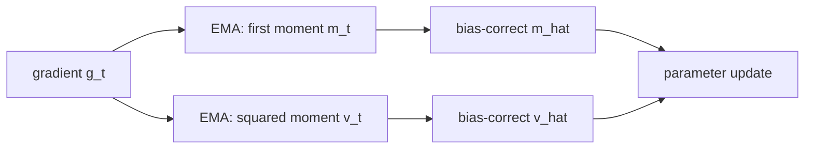
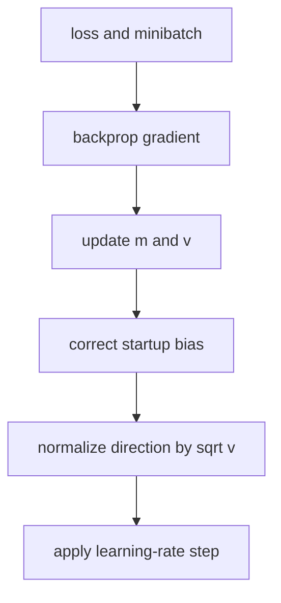

# Adam: A Method for Stochastic Optimization

## TL;DR

Adam is a first-order optimizer that keeps an exponentially decayed average of
gradients and of squared gradients for every parameter. The first estimate
provides a direction with momentum; the second scales that direction down where
recent gradients have been large. Bias correction matters at the start because
both moving averages were initialized at zero. Adam became a common default
because it is simple, efficient, and works well with noisy or sparse gradients,
not because it removes the need to tune a training run.

## Fun Map for First Years 🧭

Adam is a careful downhill walker: it remembers the usual slope and slows down on bumpy directions, helping training take steadier steps.

`📉 gradient → 🧠 remember direction + bumpiness → 👣 scaled update → 🎯 lower loss`

Training is like walking downhill in fog. Adam remembers the recent downhill direction but slows down on bumpy, unreliable directions.

If recent gradients repeatedly point left, Adam keeps moving left; if they are large and erratic, it reduces the step size. It combines momentum with a per-weight caution signal.

💻 **CS analogy:** Adam is like monitoring a noisy service: keep a smoothed recent trend and a smoothed “how jumpy is it?” metric before changing a setting.

## Math Playground 🧮

The essential equation or rule is:

```text
m_t = β₁m_(t−1) + (1−β₁)g_t
v_t = β₂v_(t−1) + (1−β₂)g_t²
```

**Essential equations:** \(m_t=\beta_1m_{t-1}+(1-\beta_1)g_t\) and \(v_t=\beta_2v_{t-1}+(1-\beta_2)g_t^2\). A gradient g tells which way to change a weight now. m is a smoothed direction vote from recent gradients; v measures how wildly that direction has varied. Adam divides by \(\sqrt{v_t}\), so a noisy coordinate gets smaller, safer steps.

m is a smoothed direction vote; v measures recent squared gradient size. Dividing by √v makes unusually noisy coordinates take smaller steps.

β values close to 1 remember more history, while values closer to 0 react faster to new gradients. Squaring g removes its sign so v measures size rather than direction.

## Background: What Came Before 🕰️

Plain SGD used the latest gradient as its whole steering signal, while momentum helped smooth it and RMSProp scaled coordinates by recent squared gradients. Tuning either method still required care. Adam was needed as a simple default that combines both ideas and works well across many neural-network jobs.

Adam was needed because one fixed learning-rate rule can be slow or unstable when weights receive gradients of very different sizes.

This gave deep-learning practitioners a robust default optimizer, although learning rate, weight decay, and data scale still need deliberate tuning.

## Why It Matters

Plain stochastic gradient descent uses one global learning rate. A coordinate
that rarely receives a gradient and a coordinate whose gradient is consistently
large therefore get the same nominal step size. Momentum smooths directions,
while AdaGrad adapts per coordinate but continually accumulates squared
gradients, which can make late steps tiny. RMSProp uses a decayed squared-
gradient average. Adam combines the momentum-like first moment with an RMSProp-
like second moment and corrects their initial zero bias.

The paper describes an algorithm for stochastic objectives that is cheap in
memory—two extra scalar states per parameter—and invariant to diagonal
rescaling of gradients. That made it particularly convenient for neural models
with embeddings, attention, and sparse signals. It is now exposed by
`torch.optim.Adam`, `torch.optim.AdamW`, Optax, and TensorFlow/Keras. The name
does not identify one universal training recipe: schedule, batch size, data,
regularization, precision, and clipping remain part of the model.

## Core Intuition

Think of descending a foggy hillside. The current gradient is one noisy glance
at the slope. Adam remembers where recent glances tend to point, while also
remembering which coordinate directions have been volatile. It takes a careful
step in a consistently useful direction and a smaller step where its readings
have been erratic. At the first few steps, the memory is artificially small
only because it has not had time to fill; bias correction fixes that artifact.



## The Mechanism

For parameter vector \(\theta\), gradient \(g_t\), and coefficients
\(\beta_1,\beta_2\), Adam computes

\[
m_t=\beta_1m_{t-1}+(1-\beta_1)g_t,\quad
v_t=\beta_2v_{t-1}+(1-\beta_2)g_t^2.
\]

The square is elementwise. With zero initialization, these estimates are biased
toward zero, especially when beta is close to one. At step \(t\), divide by
\(1-\beta_1^t\) and \(1-\beta_2^t\), then update
\(\theta_t=\theta_{t-1}-\alpha\hat m_t/(\sqrt{\hat v_t}+\epsilon)\).
The denominator is coordinatewise and epsilon prevents division problems.




The GIF is illustrative, not a plot from the paper. The first moment is not a
second derivative, and the second moment is not a full covariance matrix: it is
only an EMA of each coordinate's squared gradient. Consequently Adam ignores
cross-coordinate curvature. Its default values in the paper were commonly
reported as \(\alpha=0.001, \beta_1=0.9, \beta_2=0.999\), and
\(\epsilon=10^{-8}\), but defaults should be treated as a starting experiment,
not a theorem about every architecture.

Bias correction is easy to omit in a handwritten implementation. On the first
step, \(m_1=(1-\beta_1)g_1\), so dividing recovers \(g_1\); similarly,
\(v_1/(1-\beta_2)=g_1^2\). Later, the correction compensates for the finite
history. Learning-rate warmup, gradient clipping, and mixed-precision loss
scaling solve different problems and are not replacements for it.

## Practical Engineering Notes

Use `torch.optim.Adam` when you want coupled L2-style regularization, and
`torch.optim.AdamW` when you want decoupled weight decay; AdamW is a distinct
update choice, not simply an argument spelling. Put biases and normalization
scales in explicit parameter groups if they should not receive decay. Log the
learning rate, gradient norm, update-to-weight ratio, loss scale, and NaN/Inf
events. A healthy loss curve alone can hide vanishingly small updates.

Optimizer state doubles are material: Adam's `m` and `v` are usually float32
even when weights are lower precision, so training memory is much larger than
inference memory. Sharded optimizers such as PyTorch FSDP/ZeRO variants manage
that state across devices. Resume checkpoints must include optimizer state and
the scheduler; restarting with only model weights silently changes the effective
training dynamics. In distributed runs, clarify whether clipping occurs before
or after gradient synchronization.

Adam can converge to a useful solution quickly yet generalize differently from
SGD on a given workload. Compare on a fixed validation protocol, tune the peak
learning rate and schedule, and include a baseline rather than assuming one
optimizer dominates. Epsilon placement and fused-kernel numerical behavior can
differ across libraries, so reproducibility requires recording the framework
and version in addition to hyperparameters.

### Operational checklist

Start with a small, deterministic smoke test. Confirm that a single batch
reduces loss, that gradients reach every intended parameter group, and that the
optimizer contains no frozen or duplicated parameters. Then run a short learning
rate range test on the real batching path. An apparently reasonable rate on one
global batch size may be unstable after changing data parallelism, gradient
accumulation, sequence length, or precision. Record all of those quantities in
the run configuration.

Monitor the distribution, not just the average, of gradients and updates. A
large embedding table can have mostly idle rows while a small head dominates the
global norm. Sparse-gradient implementations may keep state only for touched
rows, whereas dense Adam allocates state for all rows; select the optimizer and
embedding representation together. When clipping, log the fraction of steps
that clip. Constant clipping often means the learning rate, data pipeline, or
loss scale deserves attention rather than that the run is simply “protected.”

In low precision, perform the moment calculations at sufficient precision and
use framework-supported mixed precision rather than manually casting state.
Underflow in the squared moment or overflow before unscaling makes the adaptive
ratio misleading. Dynamic loss scaling detects some failures, but it does not
make an excessively aggressive schedule correct. A finite loss after recovery
is not enough evidence; inspect validation quality and update statistics.

For finetuning, optimizer-state policy is a deliberate product decision.
Starting fresh is common when the objective changes, while restoring state is
appropriate for an interrupted run. Neither is “more faithful” in every case.
If layers are progressively unfrozen, add their parameter groups with an
explicit learning rate and verify their new state initialization. If an
experiment changes tokenizer, data filtering, or loss weighting, annotate it
as a new optimization regime even when the model checkpoint is shared.

Finally, distinguish failures of the optimizer from failures of measurement.
Data leakage, unstable validation sampling, mislabeled examples, and a metric
computed at the wrong sequence truncation can produce apparent optimizer wins.
Compare complete training curves, best-checkpoint selection rules, wall-clock
cost, and held-out outcomes. Adam is an excellent controlled baseline precisely
because its update is simple to specify, not because it can compensate for an
unclear experiment.

One final deployment distinction is that optimizer settings affect training
only. Do not package moment tensors into an inference artifact unless an
application truly supports continued local training. Serve the selected model
weights, tokenizer, preprocessing, and calibration configuration instead.
Keeping training checkpoints separately reduces deployment size and avoids
accidentally resuming an old experiment with a production-exported model.
This separation also clarifies ownership and rollback procedures.

## Runnable Code Example

### Run it

The implementation is intentionally small and self-checking. From the repository root, use Python 3; the module docstring states the learning goal, comments identify the paper-specific calculation, and assertions verify the toy invariant.

```bash
python3 papers/17-adam/code/adam_step.py
```

### Read it in order

Start with the module docstring, then follow the named helper calculations and the final assertions. The example is a dependency-light teaching implementation, not a production training system; change one input at a time and rerun it to see which invariant changes.


[`code/adam_step.py`](code/adam_step.py) performs Adam's first scalar step and
asserts that bias correction recovers the first gradient and squared gradient.

```bash
python3 papers/17-adam/code/adam_step.py
```

It omits a model and backpropagation so the optimizer invariant is directly
visible.

## Common Misconceptions & Pitfalls

**“Adam automatically chooses the learning rate.”** It adapts coordinates, but
the global learning rate and schedule still strongly affect stability.

**“Weight decay is always L2 regularization.”** Coupled L2 and decoupled AdamW
weight decay have different updates with adaptive preconditioning.

**“The denominator is curvature.”** Squared gradients are a diagonal history,
not a Hessian estimate.

## Interview Q&A

**Q:** Why does Adam need bias correction?
**A:** Zero-initialized moving averages underestimate moments at early steps;
the correction removes this startup bias.

**Q:** What does the second moment do?
**A:** It reduces normalized steps in coordinates with large recent squared
gradients.

**Q:** How much state does Adam add?
**A:** Usually one first- and one second-moment tensor per trainable parameter.

**Q:** Why use warmup with Adam?
**A:** Warmup controls the global schedule during fragile early optimization; it
is separate from moment bias correction.

**Q:** What is AdamW?
**A:** A variant that applies weight decay directly to parameters rather than
mixing it into the adaptive gradient.

## Further Reading

- [Original paper](https://arxiv.org/abs/1412.6980)
- [Decoupled Weight Decay Regularization](https://arxiv.org/abs/1711.05101)
- [PyTorch Adam documentation](https://pytorch.org/docs/stable/generated/torch.optim.Adam.html)
