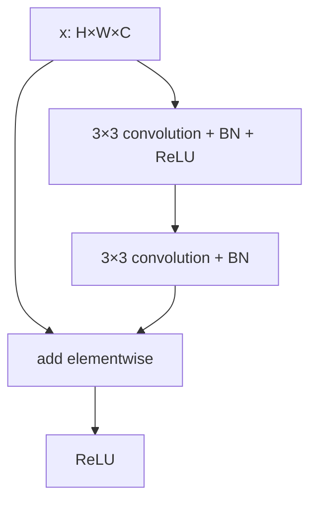
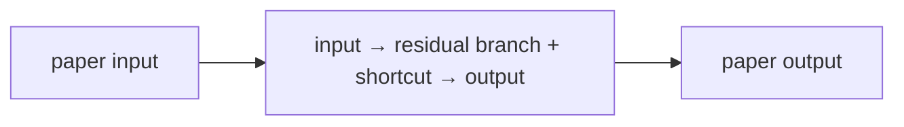

# Deep Residual Learning for Image Recognition (ResNet)

## TL;DR

ResNet changes a stack of layers from “learn the whole desired mapping” to
“learn a correction to the input.” A shortcut carries the input around a small
convolutional branch and the two paths are added: \(y=F(x)+x\). That simple
reparameterization made very deep image networks substantially easier to
optimize. It does not mean deeper is automatically better, or that every
shortcut is an identity when shapes change.

## Fun Map for First Years 🧭

ResNet lets a layer learn a small change instead of rebuilding everything. A shortcut carries the original information around the new work.

`📦 input → 🛠️ small correction + ➡️ shortcut → ➕ add together → 🧠 deeper network`

A residual block preserves the original signal and learns only a small correction. That makes a very deep stack less likely to forget useful information.

A block can preserve a clear edge detector and only add a small correction for a more useful pattern. The shortcut means deeper layers do not have to recreate what earlier layers already know.

💻 **CS analogy:** a residual block is a patch or decorator: keep the original value and add only the small correction a function has learned.

## Math Playground 🧮

The essential equation or rule is:

```text
y = F(x) + x
```

**Essential equation:** \(y=F(x)+x\). x is the layer’s input and F(x) is the change the new layers learn. Instead of asking a layer stack to rebuild the whole answer, ResNet asks it to learn only a correction. If no correction helps, F(x) can be near zero and x passes through unchanged—like applying an empty code diff.

x is the incoming value and F(x) is the correction. If no correction helps, F(x) can be near zero and x still passes through.

When F(x) is zero, y equals x exactly. The plus sign also creates a short route for error signals during training, helping them reach earlier layers.

## Background: What Came Before 🕰️

Researchers could make image networks deeper, but simply stacking layers eventually made even the training error worse, not just the test error. Better initialization and normalization helped, yet optimization paths were still fragile. ResNet was needed to let a deep stack learn incremental corrections instead of forcing every block to relearn its entire input.

This solved the problem that adding more ordinary layers could make a network train worse, not better.

This made very deep vision networks practical and turned residual connections into a general pattern used far beyond image classification.

## Why It Matters

By 2015, convolutional networks had shown that depth could improve image
recognition, but simply stacking more layers exposed a degradation problem: a
deeper plain network could have *higher training error* than a shallower one.
That is distinct from overfitting. In principle, added layers could implement
identity and preserve the shallower solution; in practice, the optimizer had
trouble finding it. ResNet gave every block an easy identity reference point.

The original paper evaluated networks up to 152 layers on ImageNet, describing
that model as eight times deeper than VGG while having lower complexity. Its
residual blocks became standard visual backbones and the core idea spread into
transformers, diffusion models, graph networks, and numerical-modeling views
of neural nets. Today `torchvision.models.resnet50` is a useful baseline, but
modern implementations vary in normalization order, stem, stride placement,
and training recipe from the 2015 paper.

## Core Intuition

Suppose a photo-processing pipeline already passes a useful image feature
forward. A new stage usually needs a small correction—sharpen this edge, add a
texture cue, suppress a background—not a complete replacement. Asking the
stage to output only its correction is easier than asking it to reconstruct the
entire signal. If no correction helps, the learned branch can approach zero and
the bypass still transports the signal.

```mermaid
flowchart LR
 X[input features x] --> F[convolutional residual branch F(x)]
 X --> S[identity shortcut]
 F --> A[add]
 S --> A
 A --> Y[output y]
```

This is not a claim that a residual branch literally learns an image residual
in pixel space. It is a feature-space parameterization. The shortcut also gives
gradients a direct additive route through a block, though successful deep
training still depends on initialization, normalization, data, and schedules.

## The Mechanism

A basic residual block defines \(y=F(x,\{W_i\})+x\), followed by the paper's
activation placement. For the two-layer example, \(F\) can be convolution,
batch normalization, ReLU, then another convolutional transform. Addition is
elementwise, so both paths must agree in spatial size and channel count. An
identity shortcut adds no learned parameters and almost no compute beyond the
addition.




When a block changes resolution or channel count, its shortcut cannot be a
literal identity. The paper describes options including padding plus a stride,
or a learned projection (often a 1×1 convolution) \(W_sx\), giving
\(y=F(x)+W_sx\). Projection shortcuts cost parameters and compute, but align
shapes. The original ImageNet architectures used two 3×3 layers in basic blocks
for 18/34-layer models and 1×1, 3×3, 1×1 bottleneck blocks for 50/101/152-layer
models, reducing expensive wide 3×3 computation.

The paper trained ImageNet models with batch normalization after each
convolution and before activation, SGD with momentum, and data augmentation.
Those details matter: a shortcut alone is not a reproduction recipe. Later
“pre-activation” ResNets move normalization and activation before weight
layers; that is an influential refinement, not the exact original block.

The GIF is an illustrative teaching diagram, not a result from the paper. It
shows why zeroing the residual branch preserves a same-shaped input. In a real
network, ReLU and normalization affect exact identity behavior, and a learned
block need not have a small numerical residual. The empirical claim is about
easier optimization of the architecture family, not a universal proof.

## Practical Engineering Notes

### Worked Math & Dataflow

The compact view below makes the paper's central calculation concrete:

```text
y = F(x)+x
```

In practice, the calculation is a pipeline: The residual branch only needs to learn the change from the input to the desired representation. If that change is near zero, the identity shortcut still passes a useful signal. The important engineering
choice is to preserve the paper's intended invariant while making the operation
fit the available memory, batch size, and evaluation protocol.




Start with `torchvision.models.resnet18` or `resnet50` and inspect its weight
metadata, input normalization, and license rather than copying a checkpoint
name into production. A classifier head must match class order exactly; store
the labels, resize/crop convention, color order, and normalization constants
alongside weights. Fine-tuning only the head is cheap, but freezing a backbone
whose source images differ strongly from the target may cap accuracy.

Profile activation memory as well as parameters. Deeper networks retain more
intermediate tensors for backpropagation; gradient checkpointing trades extra
compute for memory. BatchNorm depends on training-mode batch statistics and
running estimates, so small per-device batches, distributed synchronization,
and accidental `train()`/`eval()` mode changes can dominate a debugging session.
For small batches, GroupNorm or carefully frozen BatchNorm may be appropriate,
but that changes the recipe and needs validation.

At serving time, fuse supported convolution/normalization operations, batch
requests within latency limits, and benchmark the actual input sizes. A ResNet
that is accurate at 224×224 can fail operationally if the crop discards the
object users care about. Test corruptions, class imbalance, calibration, and
slice performance; residual connections do not mitigate dataset bias. Use
feature-map and latency telemetry to catch an unintended resolution change.

### Training and integration decisions

Choose the block variant as part of the interface, not as an invisible
implementation detail. A checkpoint trained with a basic block cannot simply
load into a bottleneck architecture because tensor shapes and stage widths
differ. Likewise, changing the stride from the first to the second convolution
in a bottleneck changes feature alignment and may invalidate published weight
porting assumptions. Framework model factories encode these decisions; pin the
factory version and verify a known image's logits after export.

The additive operation requires disciplined tensor layout. In NCHW systems the
two tensors must agree on batch, channel, height, and width; broadcasting a
singleton dimension can silently create a different operation in generic array
code. Assert shapes at custom stage boundaries, especially after a branch adds
an attention module or a feature pyramid. For quantized inference, ensure the
two add inputs have compatible quantization scales or use the backend's fused
residual-add support; otherwise conversions can introduce unexpected latency or
accuracy movement.

Treat transfer learning as an experiment in representation reuse. Start with a
linear probe to measure whether frozen features carry target information, then
compare partial and full fine-tuning under identical augmentations. A small
target set can overfit the head while making a validation curve look smooth;
preserve a final test split and inspect confusion matrices. If labels describe
objects at a much smaller scale than ImageNet crops, adjust the resolution and
re-benchmark rather than assuming the architecture is at fault.

Residual feature extractors are often connected to detection and segmentation
necks. Those consumers depend on named stage outputs, spatial stride, and
channel counts. Document this feature contract and test it when replacing a
backbone. It prevents a common production failure where a seemingly compatible
new ResNet changes a pyramid level's geometry and degrades downstream boxes
without raising a shape error.

Finally, distinguish a residual architecture from a reproducible model result.
The paper's success used a particular dataset, augmentation, optimization
schedule, and evaluation protocol. Recreating the block in a modern framework
is valuable, but claiming its benchmark number requires reproducing the whole
measurement path, including preprocessing and multi-crop or multi-scale
inference where applicable.

## Runnable Code Example

### Run it

The implementation is intentionally small and self-checking. From the repository root, use Python 3; the module docstring states the learning goal, comments identify the paper-specific calculation, and assertions verify the toy invariant.

```bash
python3 papers/18-resnet/code/residual_block.py
```

### Read it in order

Start with the module docstring, then follow the named helper calculations and the final assertions. The example is a dependency-light teaching implementation, not a production training system; change one input at a time and rerun it to see which invariant changes.


[`code/residual_block.py`](code/residual_block.py) represents the add operation
with lists and asserts the essential invariant: a zero residual branch preserves
its input. Run it with:

```bash
python3 papers/18-resnet/code/residual_block.py
```

It is not a convolutional trainer; the small example isolates the architectural
contract that a framework block must satisfy before it handles shapes and
normalization.

## Common Misconceptions & Pitfalls

**“A shortcut removes vanishing gradients.”** It provides an easier additive
path but does not eliminate all optimization or numerical failures.

**“Residual means the network predicts image differences.”** The residual is a
learned mapping between internal feature tensors.

**“Every shortcut is free.”** Projection shortcuts, normalization, and shape
changes add cost and must be included in profiling.

## Interview Q&A

**Q:** What problem did ResNet target?
**A:** Optimization degradation: deeper plain networks could train worse than
shallower counterparts, even before considering test overfitting.

**Q:** Why can residual learning help?
**A:** It makes identity-like behavior easy: the branch can learn a correction
near zero while the shortcut carries the input.

**Q:** When is a projection shortcut needed?
**A:** When spatial resolution or channel count changes and elementwise addition
would otherwise have incompatible shapes.

**Q:** What is a bottleneck block?
**A:** A 1×1 reduction, 3×3 processing, and 1×1 expansion design that enables
deep, wide stages more efficiently.

**Q:** Is ResNet only for vision?
**A:** No. The residual parameterization is widely used wherever deep transforms
benefit from an identity reference path.

## Implementation Walkthrough

A residual block computes a transformation and adds the untouched input through
a shortcut. When dimensions change, a projection shortcut aligns shape and
channel count; otherwise addition is invalid. Track tensor shapes at each
stage, use normalization and activation in the intended order, and compare a
plain-depth control to confirm that residual paths—not just more parameters—
improve optimization.

## SDE2 Interview Drill-down

These prompts are designed for a second-level software engineering interview: explain the mechanism, name the operational trade-off, and describe how you would test it.

**Q:** Walk through residual learning end to end. What does `y=F(x)+x` mean in an implementation?
**A:** Start by identifying the data structure entering the operation, the learned or configured values it uses, and the invariant that must hold at the output. In this paper, y=F(x)+x is not just notation: it tells you what is compared, normalized, accumulated, or optimized. A strong implementation makes those stages visible in separate functions, keeps tensor shapes and dtypes explicit, and tests a tiny hand-computed example before optimizing. Explain what happens when the inputs are short, padded, empty, or unusually large; those cases often reveal whether the code actually matches the paper.

**Follow-up:** Which invariant would you assert?
**A:** Assert the property that makes the method meaningful: probabilities normalize over valid choices, a residual preserves shape, a target does not bootstrap past termination, or an update leaves frozen state untouched. The assertion should be local and cheap enough to run in tests, not an end-to-end hope such as “accuracy improves.” Also compare the optimized path with a simple reference on random small inputs using an appropriate tolerance. That catches indexing, masking, reduction, and broadcasting errors while the failing example is still understandable.

**Q:** What is the main production trade-off, and how would you capacity-plan it?
**A:** The practical trade-off here is identity shortcuts improve optimization and preserve shape-compatible signals, while projection shortcuts add parameters. Estimate both arithmetic work and memory movement, then identify whether the service is compute-bound, bandwidth-bound, latency-bound, or limited by coordination. Include batch-size effects, peak activation/state memory, serialization, and cold-start behavior; average throughput can hide a bad tail latency. Choose a baseline configuration, measure it on representative shapes, and document which quality metric is allowed to move. If the system is distributed, include communication and retry behavior rather than treating the model operation as an isolated kernel.

**Follow-up:** What would make you reject an apparently faster optimization?
**A:** Reject it when it changes the evaluation contract, weakens isolation, creates silent quality regressions, or only wins on a synthetic shape. For this paper, watch especially for wrong stride/channel projection or placing normalization in the wrong branch. A safe rollout uses a reference implementation, shadow traffic or canaries, resource limits, and dashboards for both system and model metrics. Keep the old path available until numerical outputs, error rates, p95/p99 latency, and cost are stable across the important input distributions.

**Q:** How would you debug a model that passes unit tests but fails in production?
**A:** Reproduce the smallest production-shaped input and compare intermediate values against the reference path, not only the final score. Log versioned preprocessing, shapes, masks, random seeds where relevant, and the exact model/configuration identifiers; otherwise a numerical symptom can be caused by data drift or a serving mismatch. Separate failures into data, numerical stability, optimization, and infrastructure categories. For this method, begin with zero the residual branch and assert the block behaves like its shortcut, then run a controlled ablation that disables the paper-specific mechanism to determine whether the regression is in the mechanism or its integration.

**Follow-up:** What evidence would you present in the postmortem or interview?
**A:** Show one minimal failing example, the expected invariant, the observed intermediate divergence, and the fix’s regression test. Add a before/after metric table covering quality, memory, throughput, and tail latency, plus the rollout guard that would catch recurrence. This demonstrates engineering judgment: the goal is not merely to identify a clever algorithm, but to make its behavior observable, reproducible, and safe to operate.


## Further Reading

- [Original paper](https://arxiv.org/abs/1512.03385)
- [Identity Mappings in Deep Residual Networks](https://arxiv.org/abs/1603.05027)
- [Torchvision ResNet documentation](https://pytorch.org/vision/stable/models/resnet.html)
