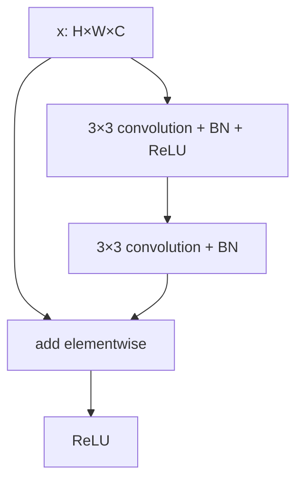
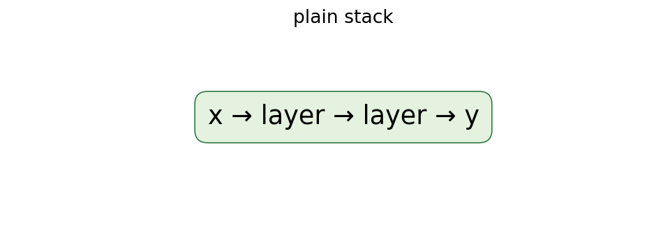
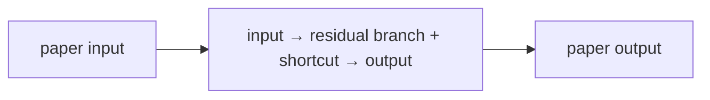
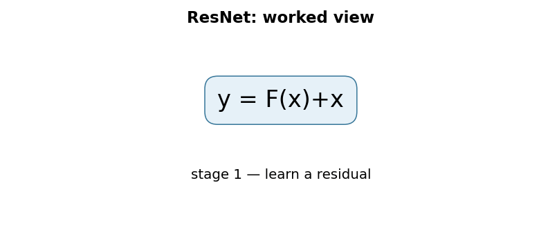

# Deep Residual Learning for Image Recognition (ResNet)

## 1. TL;DR
ResNet changes a stack of layers from “learn the whole desired mapping” to
“learn a correction to the input.” A shortcut carries the input around a small
convolutional branch and the two paths are added: \(y=F(x)+x\). That simple
reparameterization made very deep image networks substantially easier to
optimize. It does not mean deeper is automatically better, or that every
shortcut is an identity when shapes change.

## 2. Fun Map for First Years
ResNet lets a layer learn a small change instead of rebuilding everything. A shortcut carries the original information around the new work.

`📦 input → 🛠️ small correction + ➡️ shortcut → ➕ add together → 🧠 deeper network`

A residual block preserves the original signal and learns only a small correction. That makes a very deep stack less likely to forget useful information.

A block can preserve a clear edge detector and only add a small correction for a more useful pattern. The shortcut means deeper layers do not have to recreate what earlier layers already know.

💻 **CS analogy:** a residual block is a patch or decorator: keep the original value and add only the small correction a function has learned.

### Beginner walkthrough

Read the arrows as a sequence of responsibilities. First identify what enters
the system, then ask what the paper changes, what information is preserved or
discarded, and what leaves the operation. For **residual learning through identity or projection shortcuts**, the key question
is not “does the model sound clever?” but “which intermediate value carries the
new information, and what would go wrong if it were missing?”

### CS student checkpoint

The map corresponds to a small program: input data enters a function, the
paper-specific state or transformation runs, and an assertion checks **the shortcut and residual branch produce identical batch/spatial shapes before addition**.
The equation `y=F(x)+x` is the compact specification for that function. Trace
one concrete item through each arrow before thinking about larger batches,
parallel hardware, or production optimizations.

## 3. Math Playground
The essential equation or rule is:

```text
y = F(x) + x
```

**Essential equation:** \(y=F(x)+x\). x is the layer’s input and F(x) is the change the new layers learn. Instead of asking a layer stack to rebuild the whole answer, ResNet asks it to learn only a correction. If no correction helps, F(x) can be near zero and x passes through unchanged—like applying an empty code diff.

x is the incoming value and F(x) is the correction. If no correction helps, F(x) can be near zero and x still passes through.

When F(x) is zero, y equals x exactly. The plus sign also creates a short route for error signals during training, helping them reach earlier layers.

## 4. Background: What Came Before
Researchers could make image networks deeper, but simply stacking layers eventually made even the training error worse, not just the test error. Better initialization and normalization helped, yet optimization paths were still fragile. ResNet was needed to let a deep stack learn incremental corrections instead of forcing every block to relearn its entire input.

This solved the problem that adding more ordinary layers could make a network train worse, not better.

This made very deep vision networks practical and turned residual connections into a general pattern used far beyond image classification.

## 5. Why It Matters
By 2015, convolutional networks had shown that depth could improve image
recognition, but simply stacking more layers exposed a degradation problem: a
deeper plain network could have *higher training error* than a shallower one.
That is distinct from overfitting. In principle, added layers could implement
identity and preserve the shallower solution; in practice, the optimizer had
trouble finding it. ResNet gave every block an easy identity reference point.

The original paper evaluated networks up to 152 layers on ImageNet, describing
that model as eight times deeper than VGG while having lower complexity. Its
residual blocks became standard visual backbones and the core idea spread into
transformers, diffusion models, graph networks, and numerical-modeling views
of neural nets. Today `torchvision.models.resnet50` is a useful baseline, but
modern implementations vary in normalization order, stem, stride placement,
and training recipe from the 2015 paper.

## 6. Core Intuition
Suppose a photo-processing pipeline already passes a useful image feature
forward. A new stage usually needs a small correction—sharpen this edge, add a
texture cue, suppress a background—not a complete replacement. Asking the
stage to output only its correction is easier than asking it to reconstruct the
entire signal. If no correction helps, the learned branch can approach zero and
the bypass still transports the signal.

```mermaid
flowchart LR
 X[input features x] --> F[convolutional residual branch F(x)]
 X --> S[identity shortcut]
 F --> A[add]
 S --> A
 A --> Y[output y]
```

This is not a claim that a residual branch literally learns an image residual
in pixel space. It is a feature-space parameterization. The shortcut also gives
gradients a direct additive route through a block, though successful deep
training still depends on initialization, normalization, data, and schedules.

## 7. The Mechanism
A basic residual block defines \(y=F(x,\{W_i\})+x\), followed by the paper's
activation placement. For the two-layer example, \(F\) can be convolution,
batch normalization, ReLU, then another convolutional transform. Addition is
elementwise, so both paths must agree in spatial size and channel count. An
identity shortcut adds no learned parameters and almost no compute beyond the
addition.





When a block changes resolution or channel count, its shortcut cannot be a
literal identity. The paper describes options including padding plus a stride,
or a learned projection (often a 1×1 convolution) \(W_sx\), giving
\(y=F(x)+W_sx\). Projection shortcuts cost parameters and compute, but align
shapes. The original ImageNet architectures used two 3×3 layers in basic blocks
for 18/34-layer models and 1×1, 3×3, 1×1 bottleneck blocks for 50/101/152-layer
models, reducing expensive wide 3×3 computation.

The paper trained ImageNet models with batch normalization after each
convolution and before activation, SGD with momentum, and data augmentation.
Those details matter: a shortcut alone is not a reproduction recipe. Later
“pre-activation” ResNets move normalization and activation before weight
layers; that is an influential refinement, not the exact original block.

The GIF is an illustrative teaching diagram, not a result from the paper. It
shows why zeroing the residual branch preserves a same-shaped input. In a real
network, ReLU and normalization affect exact identity behavior, and a learned
block need not have a small numerical residual. The empirical claim is about
easier optimization of the architecture family, not a universal proof.

### Mechanism in Code

At implementation level, the mechanism operates on residual branch and identity shortcut. A faithful
forward pass should follow this order: transform the branch, align dimensions if needed, add the shortcut, then activate. Keep the intermediate
representation available while debugging; collapsing everything into one
opaque framework call makes shape and numerical errors much harder to isolate.

The key production failure to guard against is using a projection with the wrong stride or changing the identity path unexpectedly. Add a tiny
reference test with hand-checkable values, then add a property test that
covers padding, empty/short inputs, boundary probabilities, and the largest
supported shape. Compare intermediate tensors with tolerances appropriate to
the dtype, and log the paper-specific statistic during a canary rollout.


## 8. Practical Engineering Notes
### Worked Math & Dataflow

The compact view below makes the paper's central calculation concrete:

```text
y = F(x)+x
```

In practice, the calculation is a pipeline: The residual branch only needs to learn the change from the input to the desired representation. If that change is near zero, the identity shortcut still passes a useful signal. The important engineering
choice is to preserve the paper's intended invariant while making the operation
fit the available memory, batch size, and evaluation protocol.






Start with `torchvision.models.resnet18` or `resnet50` and inspect its weight
metadata, input normalization, and license rather than copying a checkpoint
name into production. A classifier head must match class order exactly; store
the labels, resize/crop convention, color order, and normalization constants
alongside weights. Fine-tuning only the head is cheap, but freezing a backbone
whose source images differ strongly from the target may cap accuracy.

Profile activation memory as well as parameters. Deeper networks retain more
intermediate tensors for backpropagation; gradient checkpointing trades extra
compute for memory. BatchNorm depends on training-mode batch statistics and
running estimates, so small per-device batches, distributed synchronization,
and accidental `train()`/`eval()` mode changes can dominate a debugging session.
For small batches, GroupNorm or carefully frozen BatchNorm may be appropriate,
but that changes the recipe and needs validation.

At serving time, fuse supported convolution/normalization operations, batch
requests within latency limits, and benchmark the actual input sizes. A ResNet
that is accurate at 224×224 can fail operationally if the crop discards the
object users care about. Test corruptions, class imbalance, calibration, and
slice performance; residual connections do not mitigate dataset bias. Use
feature-map and latency telemetry to catch an unintended resolution change.

### Training and integration decisions

Choose the block variant as part of the interface, not as an invisible
implementation detail. A checkpoint trained with a basic block cannot simply
load into a bottleneck architecture because tensor shapes and stage widths
differ. Likewise, changing the stride from the first to the second convolution
in a bottleneck changes feature alignment and may invalidate published weight
porting assumptions. Framework model factories encode these decisions; pin the
factory version and verify a known image's logits after export.

The additive operation requires disciplined tensor layout. In NCHW systems the
two tensors must agree on batch, channel, height, and width; broadcasting a
singleton dimension can silently create a different operation in generic array
code. Assert shapes at custom stage boundaries, especially after a branch adds
an attention module or a feature pyramid. For quantized inference, ensure the
two add inputs have compatible quantization scales or use the backend's fused
residual-add support; otherwise conversions can introduce unexpected latency or
accuracy movement.

Treat transfer learning as an experiment in representation reuse. Start with a
linear probe to measure whether frozen features carry target information, then
compare partial and full fine-tuning under identical augmentations. A small
target set can overfit the head while making a validation curve look smooth;
preserve a final test split and inspect confusion matrices. If labels describe
objects at a much smaller scale than ImageNet crops, adjust the resolution and
re-benchmark rather than assuming the architecture is at fault.

Residual feature extractors are often connected to detection and segmentation
necks. Those consumers depend on named stage outputs, spatial stride, and
channel counts. Document this feature contract and test it when replacing a
backbone. It prevents a common production failure where a seemingly compatible
new ResNet changes a pyramid level's geometry and degrades downstream boxes
without raising a shape error.

Finally, distinguish a residual architecture from a reproducible model result.
The paper's success used a particular dataset, augmentation, optimization
schedule, and evaluation protocol. Recreating the block in a modern framework
is valuable, but claiming its benchmark number requires reproducing the whole
measurement path, including preprocessing and multi-crop or multi-scale
inference where applicable.

## 9. Runnable Code Example
### Run from the repository root

Prerequisites: Python 3 and the dependencies imported by [`implementations/18-resnet/code/residual_block.py`](implementations/18-resnet/code/residual_block.py).
The example is intentionally small enough to run on CPU; it is a teaching
implementation, not a production training or serving benchmark.

```bash
python3 implementations/18-resnet/code/residual_block.py
```

### What the example demonstrates

Read the module docstring first, then follow the functions implementing
**residual learning through identity or projection shortcuts**. The program turns `y=F(x)+x` into executable operations,
prints a compact result, and checks that **the shortcut and residual branch produce identical batch/spatial shapes before addition**. The assertion matters:
it tests the semantic contract near the mechanism instead of treating a
plausible final number as proof that the implementation is correct.

### Expected behavior and useful experiments

The command should finish without a traceback and print a successful summary
or assertion message. You should observe the paper-specific behavior, not a
particular random numeric value. Change one input at a time: inspect the
intermediate tensor or state, rerun with a boundary case, and then compare the
result with the expected invariant. A useful first experiment is to **zero the residual branch and assert shortcut behavior, then compare gradient norms**.

### Production connection

The toy program does not model every distributed or large-scale concern. In a
real service, version the preprocessing and configuration, record the relevant
intermediate statistic, and measure peak memory, throughput, p95/p99 latency,
and task quality. The first production guard should target **a projection or normalization mismatch that blocks the identity path**;
preserve a transparent reference path or a canary comparison before replacing
it with a fused, distributed, or highly optimized implementation.

## 10. Common Misconceptions & Pitfalls
- **Misconception: `y=F(x)+x` is the whole implementation.** The equation describes the paper's central relationship, but `residual learning through identity or projection shortcuts` also requires explicit input contracts, ordering, masking or sampling rules, and numerical choices. If those details are left implicit, two implementations can share the same formula and still produce different results. Treat the equation as a contract and document each intermediate tensor or state transition.
- **Misconception: the mechanism is automatically reliable when the final metric looks good.** A model can compensate for a wrong reduction, stale state, or malformed edge/token boundary on common examples. The local guard is **the shortcut and residual branch produce identical batch/spatial shapes before addition**. Check it on a tiny hand-worked fixture and on adversarial inputs before trusting an aggregate benchmark.
- **Pitfall: optimizing the operation before measuring its actual bottleneck.** For this paper, watch for **a projection or normalization mismatch that blocks the identity path** rather than assuming the largest theoretical term dominates every workload. Record memory, bandwidth, batch shape, tail latency, and quality slices. An optimization is only safe when it preserves the paper-specific contract and has a rollback path.
- **Pitfall: debugging only the final prediction.** Start with **zero the residual branch and assert shortcut behavior, then compare gradient norms**; compare intermediate values with a simple reference. Freeze preprocessing, configuration, seeds, and model versions; then bisect the first divergence. This makes a failure reproducible and distinguishes data-contract errors from numerical instability, integration bugs, and a genuinely unsuitable paper mechanism.

## 11. Quick Concept Checks
**Q:** What is the central idea behind **residual learning through identity or projection shortcuts**?
**A:** It is a structured data or optimization path, not a slogan: inputs are transformed, paper-specific relationships are computed, invalid choices are excluded when necessary, and the result is aggregated into an output or objective. The important implementation question is which intermediate values must remain observable so a reviewer can connect the code to the paper.

**Q:** How should I read `y=F(x)+x`?
**A:** Read each symbol as an operation with a shape, a data source, and a numerical range. Ask what changes when its scale, temperature, rank, timestep, neighborhood, or other paper-specific value changes. Then make a two- or three-example fixture where the expected result can be calculated by hand; this catches notation-to-code misunderstandings early.

**Q:** What invariant must a correct implementation preserve?
**A:** It must preserve **the shortcut and residual branch produce identical batch/spatial shapes before addition**. This is stronger than asking whether accuracy improved because it is local, deterministic, and testable near the operation that could be wrong. Assert it at the boundary, compare against a small reference implementation, and include the unusual input shape most likely to violate it in production.

**Q:** What is the most dangerous failure mode?
**A:** The first risk to investigate is **a projection or normalization mismatch that blocks the identity path**. It can produce plausible outputs while degrading only a slice of traffic, so monitor a paper-specific statistic alongside quality and system metrics. A canary should compare the old and new paths on identical inputs and should retain enough intermediate diagnostics to explain a regression.

**Q:** How would I test this idea beyond a happy-path unit test?
**A:** Begin with **zero the residual branch and assert shortcut behavior, then compare gradient norms**, then add differential tests against a transparent reference on small randomized inputs. Cover boundaries such as padding, termination, empty neighborhoods, long sequences, rare tokens, extreme values, or duplicated examples when they apply. Test both output values and gradients or state updates when training behavior is part of the paper's claim.

**Q:** What should I remember when applying the paper in a real system?
**A:** Keep the paper's assumptions in the production contract: version the preprocessing and configuration, expose the relevant intermediate statistic, and define quality slices before tuning performance. Compare throughput, peak memory, p95/p99 latency, and task quality against a baseline. The paper is useful only when its mechanism remains correct under the workload and failure modes you actually operate.

## 12. Interview Q&A
**Q:** Walk through **residual learning through identity or projection shortcuts** end to end. How would you implement `y=F(x)+x`?
**A:** Decompose the expression into the actual data path: inputs enter the paper-specific transformation, intermediate scores or states are computed, invalid elements are excluded, and the result is reduced into the output or loss. For this paper, `y=F(x)+x` is an executable contract, not decoration: document tensor shapes, ownership of mutable state, numerical precision, and where batching changes semantics. Keep a small reference implementation beside the optimized path so a reviewer can connect each line of `code` to one term in the equation.

**Follow-up:** What invariant would you assert, and why is it stronger than checking final accuracy?
**A:** Assert that **the shortcut and residual branch produce identical batch/spatial shapes before addition**. That property is local enough to fail near the defect, whereas accuracy can remain acceptable while a mask, reduction, or state boundary is wrong on a rare input. Add a hand-computed fixture, a randomized differential test against the reference, and shape/dtype assertions at the API boundary. The test should also cover an empty, padded, terminal, high-degree, long-context, or otherwise adversarial case when that input is meaningful for this mechanism.

**Q:** What is the main production trade-off in this paper, and how would you capacity-plan it?
**A:** The central trade-off is that **the mechanism changes both quality behavior and resource use**. Capacity planning therefore needs more than average FLOPs: measure peak memory, memory bandwidth, communication, preprocessing, batch-size sensitivity, and p95/p99 latency on representative distributions. Define a quality budget before optimizing, then compare a simple baseline with the paper mechanism using identical inputs and seeds. A faster path that silently changes tokenization, routing, masking, sampling, or optimization behavior is not an acceptable optimization until its quality impact is measured.

**Follow-up:** Which failure mode would make you roll back first?
**A:** Roll back on evidence of **a projection or normalization mismatch that blocks the identity path**, especially when the symptom is silent and outputs still look plausible. Add dashboards for the paper-specific statistic, error and timeout rates, resource saturation, and a task metric sliced by difficult inputs. Use a canary or shadow comparison with the previous implementation, retain the old path behind a flag, and make the rollback decision threshold explicit before deployment. The important SDE2 judgment is to protect the paper’s semantic contract, not merely to chase a faster benchmark.

**Q:** A model passes unit tests but fails in production. What is your debugging plan?
**A:** Start with **zero the residual branch and assert shortcut behavior, then compare gradient norms**. Reproduce the smallest production-shaped example, freeze the model and preprocessing versions, and compare intermediate tensors or records rather than only the final prediction. Check data contracts, masks, sequence boundaries, random seeds, numerical precision, and serving mode in that order; then bisect between the reference and optimized implementations. If the defect is not numerical, run a controlled ablation that removes the paper-specific mechanism and compare the resulting failure rate, which separates integration problems from a bad mechanism or configuration.

**Follow-up:** What evidence would you present in the review or postmortem?
**A:** Present one minimal failing input, the expected **the shortcut and residual branch produce identical batch/spatial shapes before addition**, the first intermediate value that diverged, and the regression test that now protects it. Include a before/after table for task quality, memory, throughput, p95/p99 latency, and cost, with slices for the failure population. A complete SDE2 answer also states the rollout guard, owner, and alert threshold. That turns a paper idea into an operable system rather than a one-line claim about an equation.

## 13. Further Reading
- [Original paper](https://arxiv.org/abs/1512.03385)
- [Identity Mappings in Deep Residual Networks](https://arxiv.org/abs/1603.05027)
- [Torchvision ResNet documentation](https://pytorch.org/vision/stable/models/resnet.html)
