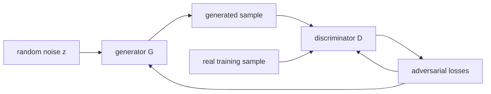
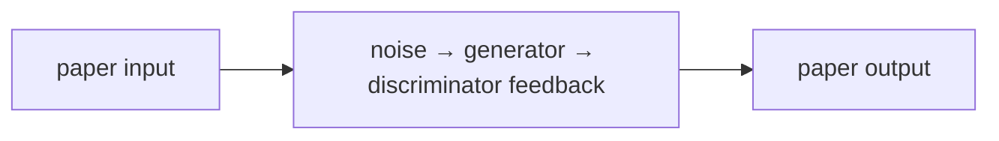
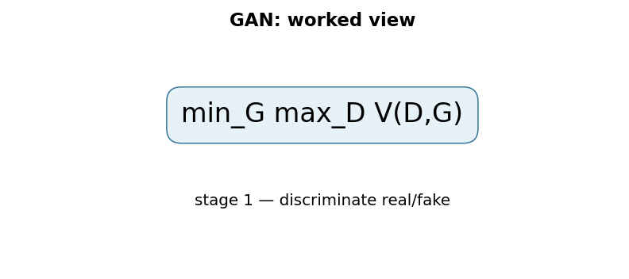

# Generative Adversarial Networks

## TL;DR

GANs train a generator to turn random noise into samples and a discriminator to
distinguish generated samples from real training data. The generator improves
by making the discriminator's job harder, yielding a two-player minimax game.
This avoids writing down an explicit likelihood for the generator, but makes
training sensitive because both players move at once. GANs can generate sharp
samples, yet they do not guarantee coverage of every mode in the data.

## Fun Map for First Years 🧭

A GAN is a game between an artist who makes fakes and a detective who spots them. Each pushes the other to improve.

`🎲 noise → 🎨 generator makes sample → 🕵️ discriminator checks → 🔁 both learn`

A generator tries to make convincing examples while a discriminator tries to spot fakes. Each side improves because the other side exposes its weaknesses.

If the discriminator easily catches fake images, the generator receives a learning signal about what looks unrealistic. If the generator improves, the discriminator must learn a sharper test.

💻 **CS analogy:** it resembles a red-team test loop: one program creates tricky cases while another program tries to detect them, and each forces the other to improve.

## Math Playground 🧮

The essential equation or rule is:

```text
min_G max_D E[log D(x)] + E[log(1 − D(G(z)))]
```

**Essential equation:** \(\min_G\max_D\;E[\log D(x)]+E[\log(1-D(G(z)))]\). D is a judge that wants real examples x to score near 1 and generated examples G(z) near 0. G is a creator trying to fool that judge. The min and max mean they have opposite goals, like two players in a game rather than one student minimizing one error score.

D is the judge, G is the creator, x is real data, and z is random input. Min and max show they want opposite outcomes.

Expectation E means average over many examples, not one picture. The logarithms create a loss that heavily penalizes confident mistakes by the discriminator.

## Background: What Came Before 🕰️

Earlier generative models often had to specify a tractable likelihood or carefully approximate one, which limited the kinds of image generators people could train. They could be mathematically neat but produce blurry outputs. GANs were needed as a new route: learn to generate by competing against a learned judge rather than explicitly scoring every pixel configuration.

GANs were needed to learn rich data generation without requiring one hand-written similarity score for every possible image.

GANs produced striking samples but also revealed that a two-player optimization game can oscillate, collapse to few outputs, or be hard to evaluate.

## Why It Matters

Before GANs, many generative approaches either modeled a tractable likelihood,
used Markov chains, or introduced approximate inference machinery. Goodfellow
and colleagues proposed an adversarial alternative: learn a sampler directly
through a differentiable critic. The original paper states that, with arbitrary
functions at equilibrium, the generator recovers the data distribution and the
discriminator outputs one half everywhere. Neural networks do not automatically
reach that idealized equilibrium, but the formulation opened a major line of
image synthesis and representation-learning work.

GANs made it possible to think of a generator as a program that maps a compact
latent vector to a high-dimensional output. Later systems such as DCGAN,
StyleGAN, conditional GANs, and image-to-image translation changed architecture
and stabilization substantially. They should not be conflated with the 2014
fully connected experiments. Diffusion models now dominate many quality and
coverage applications, but GAN ideas remain central for low-latency synthesis,
super-resolution, domain translation, and adversarial learning.

## Core Intuition

Picture a counterfeiter and an inspector. The counterfeiter starts with random
materials and creates a fake note. The inspector sees real notes and fakes and
learns to spot the difference. Each new inspector weakness teaches the
counterfeiter where the fake is implausible. The goal is not for the inspector
to stay perfect; at a balanced distribution it cannot tell which source made a
sample.



## The Mechanism

Let \(p_{data}\) be the unknown real distribution, \(z\sim p_z\) a simple
noise distribution, generator \(G(z)\), and discriminator \(D(x)\in(0,1)\).
The original value function is

\[
\min_G\max_D\;E_{x\sim p_{data}}[\log D(x)] +
E_{z\sim p_z}[\log(1-D(G(z)))].
\]

The discriminator maximizes real scores and minimizes fake scores. The
generator minimizes the second term, trying to make fake samples receive high
realness. Gradients flow through D into G, but D's parameters are held fixed
while G updates. Alternating a few discriminator and generator optimization
steps is an approximation to the game, not ordinary minimization of one static
loss.

```mermaid
flowchart TD
 A[draw real x and noise z] --> B[make G(z)]
 B --> C[update D on real and fake]
 C --> E[freeze D parameters]
 E --> F[update G through D(G(z))]
 F --> A
```


The paper's minimax generator loss can yield weak gradients when D easily
rejects early fakes. A commonly used later heuristic maximizes
\(\log D(G(z))\) instead (“non-saturating” loss); it has the same fixed point
but a stronger early gradient. Do not mistake that practical choice for the
literal original minimax update. Other later changes—Wasserstein critics,
gradient penalties, spectral normalization, and feature matching—address
specific pathologies with different objectives.

At the ideal optimum and sufficient discriminator capacity, the induced
generator distribution matches the data and D is 1/2. This does not say that a
finite network, finite dataset, or finite training budget will do so. Mode
collapse occurs when many noise inputs produce a narrow subset of outputs that
temporarily fool D. Oscillation occurs because improving one player changes the
other player's loss landscape. The GIF is instructional rather than a paper
measurement.

### Mechanism in Code

At implementation level, the mechanism operates on real samples, latent noise, generator, and discriminator. A faithful
forward pass should follow this order: update the discriminator, freeze it for generator loss, then alternate. Keep the intermediate
representation available while debugging; collapsing everything into one
opaque framework call makes shape and numerical errors much harder to isolate.

The key production failure to guard against is interpreting either player’s loss as a standalone quality metric. Add a tiny
reference test with hand-checkable values, then add a property test that
covers padding, empty/short inputs, boundary probabilities, and the largest
supported shape. Compare intermediate tensors with tolerances appropriate to
the dtype, and log the paper-specific statistic during a canary rollout.


## Practical Engineering Notes

### Worked Math & Dataflow

The compact view below makes the paper's central calculation concrete:

```text
min_G max_D V(D,G)
```

In practice, the calculation is a pipeline: The discriminator improves by separating data from generated samples, while the generator changes to fool it. Training is a coupled game, so one player becoming too strong can starve the other of useful gradients. The important engineering
choice is to preserve the paper's intended invariant while making the operation
fit the available memory, batch size, and evaluation protocol.






Use a well-tested implementation in PyTorch, TensorFlow, or a research codebase
for the chosen GAN family; hand-rolled alternating updates often leak gradients
into the wrong optimizer or apply BatchNorm in the wrong mode. Keep separate
optimizers and parameter sets. During a discriminator update, detach generated
samples; during a generator update, allow gradients through D's computation but
do not step D. Unit-test both conditions with parameter snapshots.

Track sample grids, diversity metrics, critic/discriminator statistics, and a
held-out task metric where possible. A declining scalar loss is not reliable:
the players' losses can move together, oscillate, or look balanced while images
are poor. FID is common but depends on preprocessing, sample count, and the
feature extractor; it is not a universal quality or safety measure. Maintain a
fixed latent seed panel for regression comparisons and inspect random samples
to catch cherry-picking.

Data governance matters especially for generators. Training images may be
memorized or replicated, outputs can contain stereotypes, and an image that
looks plausible can be factually false. Record dataset licenses, consent,
filtering, and intended-use restrictions. If an application exposes generated
media, provide provenance and abuse controls; a discriminator score is not a
content-safety classifier.

Memory is usually dominated by storing activations for both networks. Mixed
precision and gradient checkpointing help, but check loss scaling and visual
regressions. Conditional generation requires a consistent label or text
conditioning interface at train and serve time. Never assume a latent vector
has a stable semantic interpretation without evaluating traversals and
conditioning behavior on the actual model.

### Failure analysis and release practice

Diagnose failures by separating generator coverage from discriminator capacity.
If D is nearly perfect very early, reduce its advantage, inspect the input
pipeline, and check whether real and generated tensors use the same range and
normalization. A simple mismatch such as real images in `[0, 1]` and generated
images in `[-1, 1]` gives the discriminator a shortcut unrelated to visual
quality. If D is weak, increasing generator capacity will not fix a missing
learning signal. Compare real/fake augmentations, batch construction, and
conditioning labels before changing the objective.

Save both networks, both optimizer states, random-number-generator states, and
the data/preprocessing revision in a resumable checkpoint. Saving only G is
enough for inference but not for controlled continuation. When selecting a
checkpoint for release, pre-register the selection metric and retain samples
from multiple seeds. Human review is valuable for discovering artifacts, but it
must have a documented rubric and diverse reviewers if it is used as a quality
gate.

For conditional models, test that labels alter the requested attribute without
destroying diversity or changing unrelated attributes. A model can obtain a good
aggregate score while failing rare conditions. Evaluate per class, per source
domain, and across demographic or geographical slices that are relevant to the
data. Avoid claims that generated samples increase a minority class unless a
downstream evaluation proves both utility and lack of harmful representation
shift.

Operationally, rate-limit expensive generation, bound requested resolution and
batch size, and make cancellation release GPU work safely. Generated media
should be marked as such where product context warrants it. A similarity search
against training or protected reference sets can be part of a memorization
review, but near-neighbor distance alone cannot settle copyright, privacy, or
identity questions. Escalate those questions to the appropriate policy and
legal processes rather than treating a model metric as authorization.

GANs are therefore best treated as a system: objective, architecture, data,
monitoring, evaluation, and release controls jointly determine whether the
generator is useful. The minimax equation supplies a compact organizing idea;
it is not a substitute for the engineering and governance around a generative
product.

## Runnable Code Example

### Run it

The implementation is intentionally small and self-checking. From the repository root, use Python 3; the module docstring states the learning goal, comments identify the paper-specific calculation, and assertions verify the toy invariant.

```bash
python3 papers/19-gan/code/adversarial_step.py
```

### Read it in order

Start with the module docstring, then follow the named helper calculations and the final assertions. The example is a dependency-light teaching implementation, not a production training system; change one input at a time and rerun it to see which invariant changes.


[`code/adversarial_step.py`](code/adversarial_step.py) shows the scalar logistic
directions for real, fake, and non-saturating generator objectives.

```bash
python3 papers/19-gan/code/adversarial_step.py
```

It demonstrates signs of the updates, not image generation or convergence.

## Common Misconceptions & Pitfalls

- **Misconception: `min_Gmax_D V(D,G)` is the whole implementation.** The equation describes the paper's central relationship, but `alternating generator/discriminator adversarial training` also requires explicit input contracts, ordering, masking or sampling rules, and numerical choices. If those details are left implicit, two implementations can share the same formula and still produce different results. Treat the equation as a contract and document each intermediate tensor or state transition.
- **Misconception: the mechanism is automatically reliable when the final metric looks good.** A model can compensate for a wrong reduction, stale state, or malformed edge/token boundary on common examples. The local guard is **each optimizer updates only its intended network and sample diversity is measured separately from realism**. Check it on a tiny hand-worked fixture and on adversarial inputs before trusting an aggregate benchmark.
- **Pitfall: optimizing the operation before measuring its actual bottleneck.** For this paper, watch for **mode collapse, discriminator overpowering, or misleading loss interpretation** rather than assuming the largest theoretical term dominates every workload. Record memory, bandwidth, batch shape, tail latency, and quality slices. An optimization is only safe when it preserves the paper-specific contract and has a rollback path.
- **Pitfall: debugging only the final prediction.** Start with **track diversity and held-out samples while logging both players’ gradient norms**; compare intermediate values with a simple reference. Freeze preprocessing, configuration, seeds, and model versions; then bisect the first divergence. This makes a failure reproducible and distinguishes data-contract errors from numerical instability, integration bugs, and a genuinely unsuitable paper mechanism.

## Quick Concept Checks

**Q:** What is the central idea behind **alternating generator/discriminator adversarial training**?
**A:** It is a structured data or optimization path, not a slogan: inputs are transformed, paper-specific relationships are computed, invalid choices are excluded when necessary, and the result is aggregated into an output or objective. The important implementation question is which intermediate values must remain observable so a reviewer can connect the code to the paper.

**Q:** How should I read `min_Gmax_D V(D,G)`?
**A:** Read each symbol as an operation with a shape, a data source, and a numerical range. Ask what changes when its scale, temperature, rank, timestep, neighborhood, or other paper-specific value changes. Then make a two- or three-example fixture where the expected result can be calculated by hand; this catches notation-to-code misunderstandings early.

**Q:** What invariant must a correct implementation preserve?
**A:** It must preserve **each optimizer updates only its intended network and sample diversity is measured separately from realism**. This is stronger than asking whether accuracy improved because it is local, deterministic, and testable near the operation that could be wrong. Assert it at the boundary, compare against a small reference implementation, and include the unusual input shape most likely to violate it in production.

**Q:** What is the most dangerous failure mode?
**A:** The first risk to investigate is **mode collapse, discriminator overpowering, or misleading loss interpretation**. It can produce plausible outputs while degrading only a slice of traffic, so monitor a paper-specific statistic alongside quality and system metrics. A canary should compare the old and new paths on identical inputs and should retain enough intermediate diagnostics to explain a regression.

**Q:** How would I test this idea beyond a happy-path unit test?
**A:** Begin with **track diversity and held-out samples while logging both players’ gradient norms**, then add differential tests against a transparent reference on small randomized inputs. Cover boundaries such as padding, termination, empty neighborhoods, long sequences, rare tokens, extreme values, or duplicated examples when they apply. Test both output values and gradients or state updates when training behavior is part of the paper's claim.

**Q:** What should I remember when applying the paper in a real system?
**A:** Keep the paper's assumptions in the production contract: version the preprocessing and configuration, expose the relevant intermediate statistic, and define quality slices before tuning performance. Compare throughput, peak memory, p95/p99 latency, and task quality against a baseline. The paper is useful only when its mechanism remains correct under the workload and failure modes you actually operate.

## Interview Q&A

**Q:** Walk through **alternating generator/discriminator adversarial training** end to end. How would you implement `min_Gmax_D V(D,G)`?
**A:** Decompose the expression into the actual data path: inputs enter the paper-specific transformation, intermediate scores or states are computed, invalid elements are excluded, and the result is reduced into the output or loss. For this paper, `min_Gmax_D V(D,G)` is an executable contract, not decoration: document tensor shapes, ownership of mutable state, numerical precision, and where batching changes semantics. Keep a small reference implementation beside the optimized path so a reviewer can connect each line of `code` to one term in the equation.

**Follow-up:** What invariant would you assert, and why is it stronger than checking final accuracy?
**A:** Assert that **each optimizer updates only its intended network and sample diversity is measured separately from realism**. That property is local enough to fail near the defect, whereas accuracy can remain acceptable while a mask, reduction, or state boundary is wrong on a rare input. Add a hand-computed fixture, a randomized differential test against the reference, and shape/dtype assertions at the API boundary. The test should also cover an empty, padded, terminal, high-degree, long-context, or otherwise adversarial case when that input is meaningful for this mechanism.

**Q:** What is the main production trade-off in this paper, and how would you capacity-plan it?
**A:** The central trade-off is that **the mechanism changes both quality behavior and resource use**. Capacity planning therefore needs more than average FLOPs: measure peak memory, memory bandwidth, communication, preprocessing, batch-size sensitivity, and p95/p99 latency on representative distributions. Define a quality budget before optimizing, then compare a simple baseline with the paper mechanism using identical inputs and seeds. A faster path that silently changes tokenization, routing, masking, sampling, or optimization behavior is not an acceptable optimization until its quality impact is measured.

**Follow-up:** Which failure mode would make you roll back first?
**A:** Roll back on evidence of **mode collapse, discriminator overpowering, or misleading loss interpretation**, especially when the symptom is silent and outputs still look plausible. Add dashboards for the paper-specific statistic, error and timeout rates, resource saturation, and a task metric sliced by difficult inputs. Use a canary or shadow comparison with the previous implementation, retain the old path behind a flag, and make the rollback decision threshold explicit before deployment. The important SDE2 judgment is to protect the paper’s semantic contract, not merely to chase a faster benchmark.

**Q:** A model passes unit tests but fails in production. What is your debugging plan?
**A:** Start with **track diversity and held-out samples while logging both players’ gradient norms**. Reproduce the smallest production-shaped example, freeze the model and preprocessing versions, and compare intermediate tensors or records rather than only the final prediction. Check data contracts, masks, sequence boundaries, random seeds, numerical precision, and serving mode in that order; then bisect between the reference and optimized implementations. If the defect is not numerical, run a controlled ablation that removes the paper-specific mechanism and compare the resulting failure rate, which separates integration problems from a bad mechanism or configuration.

**Follow-up:** What evidence would you present in the review or postmortem?
**A:** Present one minimal failing input, the expected **each optimizer updates only its intended network and sample diversity is measured separately from realism**, the first intermediate value that diverged, and the regression test that now protects it. Include a before/after table for task quality, memory, throughput, p95/p99 latency, and cost, with slices for the failure population. A complete SDE2 answer also states the rollout guard, owner, and alert threshold. That turns a paper idea into an operable system rather than a one-line claim about an equation.

## Further Reading

- [Original paper](https://arxiv.org/abs/1406.2661)
- [Unsupervised Representation Learning with Deep Convolutional GANs](https://arxiv.org/abs/1511.06434)
- [StyleGAN2 paper](https://arxiv.org/abs/1912.04958)
