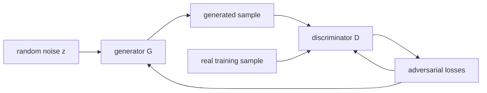
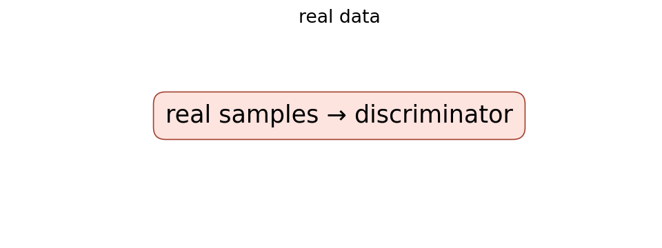

# Generative Adversarial Networks

## TL;DR

GANs train a generator to turn random noise into samples and a discriminator to
distinguish generated samples from real training data. The generator improves
by making the discriminator's job harder, yielding a two-player minimax game.
This avoids writing down an explicit likelihood for the generator, but makes
training sensitive because both players move at once. GANs can generate sharp
samples, yet they do not guarantee coverage of every mode in the data.

## Fun Map for First Years 🧭

A GAN is a game between an artist who makes fakes and a detective who spots them. Each pushes the other to improve.

`🎲 noise → 🎨 generator makes sample → 🕵️ discriminator checks → 🔁 both learn`

A generator tries to make convincing examples while a discriminator tries to spot fakes. Each side improves because the other side exposes its weaknesses.

If the discriminator easily catches fake images, the generator receives a learning signal about what looks unrealistic. If the generator improves, the discriminator must learn a sharper test.

💻 **CS analogy:** it resembles a red-team test loop: one program creates tricky cases while another program tries to detect them, and each forces the other to improve.

## Math Playground 🧮

The essential equation or rule is:

```text
min_G max_D E[log D(x)] + E[log(1 − D(G(z)))]
```

**Essential equation:** \(\min_G\max_D\;E[\log D(x)]+E[\log(1-D(G(z)))]\). D is a judge that wants real examples x to score near 1 and generated examples G(z) near 0. G is a creator trying to fool that judge. The min and max mean they have opposite goals, like two players in a game rather than one student minimizing one error score.

D is the judge, G is the creator, x is real data, and z is random input. Min and max show they want opposite outcomes.

Expectation E means average over many examples, not one picture. The logarithms create a loss that heavily penalizes confident mistakes by the discriminator.

## Background: What Came Before 🕰️

Earlier generative models often had to specify a tractable likelihood or carefully approximate one, which limited the kinds of image generators people could train. They could be mathematically neat but produce blurry outputs. GANs were needed as a new route: learn to generate by competing against a learned judge rather than explicitly scoring every pixel configuration.

GANs were needed to learn rich data generation without requiring one hand-written similarity score for every possible image.

GANs produced striking samples but also revealed that a two-player optimization game can oscillate, collapse to few outputs, or be hard to evaluate.

## Why It Matters

Before GANs, many generative approaches either modeled a tractable likelihood,
used Markov chains, or introduced approximate inference machinery. Goodfellow
and colleagues proposed an adversarial alternative: learn a sampler directly
through a differentiable critic. The original paper states that, with arbitrary
functions at equilibrium, the generator recovers the data distribution and the
discriminator outputs one half everywhere. Neural networks do not automatically
reach that idealized equilibrium, but the formulation opened a major line of
image synthesis and representation-learning work.

GANs made it possible to think of a generator as a program that maps a compact
latent vector to a high-dimensional output. Later systems such as DCGAN,
StyleGAN, conditional GANs, and image-to-image translation changed architecture
and stabilization substantially. They should not be conflated with the 2014
fully connected experiments. Diffusion models now dominate many quality and
coverage applications, but GAN ideas remain central for low-latency synthesis,
super-resolution, domain translation, and adversarial learning.

## Core Intuition

Picture a counterfeiter and an inspector. The counterfeiter starts with random
materials and creates a fake note. The inspector sees real notes and fakes and
learns to spot the difference. Each new inspector weakness teaches the
counterfeiter where the fake is implausible. The goal is not for the inspector
to stay perfect; at a balanced distribution it cannot tell which source made a
sample.



## The Mechanism

Let \(p_{data}\) be the unknown real distribution, \(z\sim p_z\) a simple
noise distribution, generator \(G(z)\), and discriminator \(D(x)\in(0,1)\).
The original value function is

\[
\min_G\max_D\;E_{x\sim p_{data}}[\log D(x)] +
E_{z\sim p_z}[\log(1-D(G(z)))].
\]

The discriminator maximizes real scores and minimizes fake scores. The
generator minimizes the second term, trying to make fake samples receive high
realness. Gradients flow through D into G, but D's parameters are held fixed
while G updates. Alternating a few discriminator and generator optimization
steps is an approximation to the game, not ordinary minimization of one static
loss.

```mermaid
flowchart TD
 A[draw real x and noise z] --> B[make G(z)]
 B --> C[update D on real and fake]
 C --> E[freeze D parameters]
 E --> F[update G through D(G(z))]
 F --> A
```



The paper's minimax generator loss can yield weak gradients when D easily
rejects early fakes. A commonly used later heuristic maximizes
\(\log D(G(z))\) instead (“non-saturating” loss); it has the same fixed point
but a stronger early gradient. Do not mistake that practical choice for the
literal original minimax update. Other later changes—Wasserstein critics,
gradient penalties, spectral normalization, and feature matching—address
specific pathologies with different objectives.

At the ideal optimum and sufficient discriminator capacity, the induced
generator distribution matches the data and D is 1/2. This does not say that a
finite network, finite dataset, or finite training budget will do so. Mode
collapse occurs when many noise inputs produce a narrow subset of outputs that
temporarily fool D. Oscillation occurs because improving one player changes the
other player's loss landscape. The GIF is instructional rather than a paper
measurement.

## Practical Engineering Notes

Use a well-tested implementation in PyTorch, TensorFlow, or a research codebase
for the chosen GAN family; hand-rolled alternating updates often leak gradients
into the wrong optimizer or apply BatchNorm in the wrong mode. Keep separate
optimizers and parameter sets. During a discriminator update, detach generated
samples; during a generator update, allow gradients through D's computation but
do not step D. Unit-test both conditions with parameter snapshots.

Track sample grids, diversity metrics, critic/discriminator statistics, and a
held-out task metric where possible. A declining scalar loss is not reliable:
the players' losses can move together, oscillate, or look balanced while images
are poor. FID is common but depends on preprocessing, sample count, and the
feature extractor; it is not a universal quality or safety measure. Maintain a
fixed latent seed panel for regression comparisons and inspect random samples
to catch cherry-picking.

Data governance matters especially for generators. Training images may be
memorized or replicated, outputs can contain stereotypes, and an image that
looks plausible can be factually false. Record dataset licenses, consent,
filtering, and intended-use restrictions. If an application exposes generated
media, provide provenance and abuse controls; a discriminator score is not a
content-safety classifier.

Memory is usually dominated by storing activations for both networks. Mixed
precision and gradient checkpointing help, but check loss scaling and visual
regressions. Conditional generation requires a consistent label or text
conditioning interface at train and serve time. Never assume a latent vector
has a stable semantic interpretation without evaluating traversals and
conditioning behavior on the actual model.

### Failure analysis and release practice

Diagnose failures by separating generator coverage from discriminator capacity.
If D is nearly perfect very early, reduce its advantage, inspect the input
pipeline, and check whether real and generated tensors use the same range and
normalization. A simple mismatch such as real images in `[0, 1]` and generated
images in `[-1, 1]` gives the discriminator a shortcut unrelated to visual
quality. If D is weak, increasing generator capacity will not fix a missing
learning signal. Compare real/fake augmentations, batch construction, and
conditioning labels before changing the objective.

Save both networks, both optimizer states, random-number-generator states, and
the data/preprocessing revision in a resumable checkpoint. Saving only G is
enough for inference but not for controlled continuation. When selecting a
checkpoint for release, pre-register the selection metric and retain samples
from multiple seeds. Human review is valuable for discovering artifacts, but it
must have a documented rubric and diverse reviewers if it is used as a quality
gate.

For conditional models, test that labels alter the requested attribute without
destroying diversity or changing unrelated attributes. A model can obtain a good
aggregate score while failing rare conditions. Evaluate per class, per source
domain, and across demographic or geographical slices that are relevant to the
data. Avoid claims that generated samples increase a minority class unless a
downstream evaluation proves both utility and lack of harmful representation
shift.

Operationally, rate-limit expensive generation, bound requested resolution and
batch size, and make cancellation release GPU work safely. Generated media
should be marked as such where product context warrants it. A similarity search
against training or protected reference sets can be part of a memorization
review, but near-neighbor distance alone cannot settle copyright, privacy, or
identity questions. Escalate those questions to the appropriate policy and
legal processes rather than treating a model metric as authorization.

GANs are therefore best treated as a system: objective, architecture, data,
monitoring, evaluation, and release controls jointly determine whether the
generator is useful. The minimax equation supplies a compact organizing idea;
it is not a substitute for the engineering and governance around a generative
product.

## Runnable Code Example

### Run it

The implementation is intentionally small and self-checking. From the repository root, use Python 3; the module docstring states the learning goal, comments identify the paper-specific calculation, and assertions verify the toy invariant.

```bash
python3 papers/19-gan/code/adversarial_step.py
```

### Read it in order

Start with the module docstring, then follow the named helper calculations and the final assertions. The example is a dependency-light teaching implementation, not a production training system; change one input at a time and rerun it to see which invariant changes.


[`code/adversarial_step.py`](code/adversarial_step.py) shows the scalar logistic
directions for real, fake, and non-saturating generator objectives.

```bash
python3 papers/19-gan/code/adversarial_step.py
```

It demonstrates signs of the updates, not image generation or convergence.

## Common Misconceptions & Pitfalls

**“GAN loss should steadily go to zero.”** It is a game, so individual losses
are not a monotonic quality score.

**“A discriminator at 50% proves success.”** It can also be weak, undertrained,
or evaluated on an uninformative split.

**“Random noise guarantees diversity.”** A generator can ignore parts of its
latent input and collapse to a few outputs.

## Interview Q&A

**Q:** What does a GAN learn without explicitly modeling?
**A:** It learns a sampler that can produce data-like samples without requiring
an explicit normalized likelihood for each output.

**Q:** Why alternate updates?
**A:** Generator and discriminator optimize opposing objectives, so each update
changes the other's learning signal.

**Q:** What is mode collapse?
**A:** Many latent inputs map to too few kinds of samples, reducing coverage.

**Q:** Why use the non-saturating loss?
**A:** It gives stronger early generator gradients when the discriminator easily
recognizes fakes.

**Q:** Can GAN output be trusted as evidence?
**A:** No. Plausible appearance does not establish authenticity, accuracy, or
permission to use the depicted content.

## Further Reading

- [Original paper](https://arxiv.org/abs/1406.2661)
- [Unsupervised Representation Learning with Deep Convolutional GANs](https://arxiv.org/abs/1511.06434)
- [StyleGAN2 paper](https://arxiv.org/abs/1912.04958)
