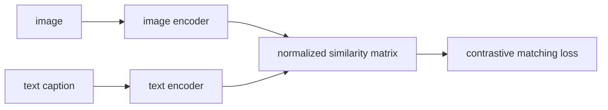
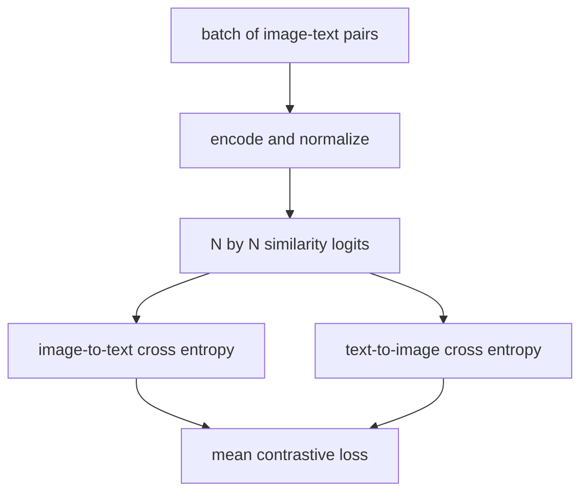
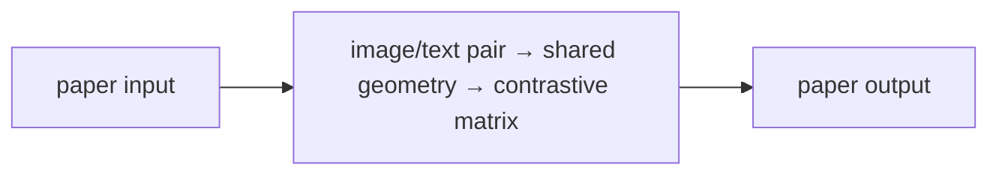

# Learning Transferable Visual Models From Natural Language Supervision (CLIP)

## TL;DR

CLIP learns an image encoder and text encoder together by making matching
image-caption pairs close in one embedding space and mismatched pairs distant.
At inference, candidate labels become text prompts; their text embeddings are
compared with an image embedding to form a zero-shot classifier. The paper
trained on large-scale web image-text pairs and found transfer across many
tasks. It is a matching representation, not a guarantee that a prompt is true.

## Fun Map for First Years 🧭

CLIP puts pictures and captions on one shared map. A photo of a dog should land close to the words “a photo of a dog.”

`🖼️ image + 📝 caption → 🧠 two encoders → 🗺️ shared space → 🔎 compare with prompts`

CLIP learns a shared map where a photo and its matching caption land close together. New label names can later be used as prompts without retraining a classifier.

A batch might pair a dog photo with “a photo of a dog” and a car photo with “a photo of a car.” Each image must rank its own caption above the other caption, and vice versa.

💻 **CS analogy:** CLIP builds a shared search index: a picture query and a text query should retrieve the same matching record.

## Math Playground 🧮

The essential equation or rule is:

```text
S_ij = τ I_iᵀT_j
```

**Essential equation:** \(S_{ij}=\tau I_i^TT_j\). Iᵢ is image i turned into an arrow of numbers and Tⱼ is text j turned into another arrow. Their dot product is high when they point in similar directions; τ adjusts how sharply scores differ. In a batch, every image is compared with every caption, and training teaches the real paired image and caption to score highest.

I is an image arrow and T is a text arrow; their dot product is high when they point in similar directions. τ adjusts how sharply scores differ.

The score matrix has one row per image and one column per text. The diagonal entries are true pairs; contrastive training makes those diagonal scores win against off-diagonal mismatches.

## Background: What Came Before 🕰️

Vision models were commonly trained on fixed human-written class labels, so adding a new label set required a new supervised dataset and training run. Text and image systems also tended to live in separate pipelines. CLIP was needed to use plentiful captioned web data to connect the two modalities and make text-defined, zero-shot classification possible.

This was needed to escape fixed class lists and use the broader supervision in image-caption pairs.

This made text a flexible classifier interface: new categories can be described in language, though prompt wording and web-data biases affect results.

## Why It Matters

Traditional image classification starts with a fixed label taxonomy and requires
human-curated examples for each class. Natural language supplies a broader form
of supervision: captions, titles, alt text, and nearby prose connect images to
concepts that were never selected as a closed label list. CLIP turns every
minibatch into a retrieval problem: identify the paired caption for an image and
the paired image for a caption. That makes text a flexible output interface.

The paper helped establish contrastive vision-language pretraining as a basis
for zero-shot classification, image search, and later multimodal systems. Its
transfer result does not make web text ground truth. Captions can be noisy,
biased, incomplete, or unrelated to pixels, and benchmark overlap matters. A
newer model called CLIP may use different data, encoders, losses, and safety
policies than the original paper.

## Core Intuition

Imagine placing photographs and their descriptions on the same map. A golden
retriever image should land near “a photo of a golden retriever,” not near “a
photo of a traffic light.” Repeated pairings teach which visual patterns and
phrases occupy neighboring places. To classify a new image, place the candidate
class descriptions on that map and choose the closest one.



The procedure is closer to retrieval than to a classifier with a permanent
softmax vocabulary. Prompts define the candidate classes at inference, which is
useful but sensitive: “a photo of a dog” and “a satellite image of a dog” are
different queries.

## The Mechanism

For a batch of \(N\) paired examples, CLIP encodes images as \(I_i\) and text
as \(T_j\), L2-normalizes both, and forms logits
\(L_{ij}=\tau I_i^TT_j\), with learned temperature \(\tau\). The diagonal
contains observed matches. Cross entropy treats matching text as each image
row's target and matching image as each text column's target; the final loss is
the mean of these directions.




At zero-shot classification time, turn each class name into one or more
templates such as “a photo of a {label}.” Encode these prompts, compare a new
image against them, and softmax only over the supplied candidates. The original
paper used prompt ensembling because wording changes results. This is not
open-world detection and it cannot say “none of the above” without an extra
decision policy.

The loss supplies relative information: an image prefers its paired caption to
the other captions in the batch, rather than reconstructing pixels or language.
Batch composition therefore provides negatives, and larger diverse batches give
more comparisons. The GIF is illustrative, not a paper plot. It shows diagonal
matches increasing and mismatched scores decreasing.

The paper used ResNet or Vision Transformer image encoders, a Transformer text
encoder, and 400 million image-text pairs collected from public web sources.
Exact transfer depends on encoder and prompt set. The geometry can capture useful
concepts while absorbing web-data biases, shortcuts, and coverage gaps.

### Mechanism in Code

At implementation level, the mechanism operates on paired image/text embeddings. A faithful
forward pass should follow this order: normalize both modalities, build the full similarity matrix, and apply symmetric targets. Keep the intermediate
representation available while debugging; collapsing everything into one
opaque framework call makes shape and numerical errors much harder to isolate.

The key production failure to guard against is duplicate or weak captions creating false negatives and shortcuts. Add a tiny
reference test with hand-checkable values, then add a property test that
covers padding, empty/short inputs, boundary probabilities, and the largest
supported shape. Compare intermediate tensors with tolerances appropriate to
the dtype, and log the paper-specific statistic during a canary rollout.


## Practical Engineering Notes

### Worked Math & Dataflow

The compact view below makes the paper's central calculation concrete:

```text
sim(I,T)=Ĩ·T̃
```

In practice, the calculation is a pipeline: Normalized image and text embeddings turn paired supervision into a batch similarity matrix. The diagonal is positive evidence; off-diagonal pairs act as negatives. The important engineering
choice is to preserve the paper's intended invariant while making the operation
fit the available memory, batch size, and evaluation protocol.




Use a maintained implementation such as OpenCLIP or a package with documented
weights, tokenizer, transform, and license. Resize/crop, RGB handling,
normalization, text context length, and prompts are part of the checkpoint
contract. Embedding offline images with one transform and queries with another
silently changes score distributions.

Normalize vectors if the checkpoint expects cosine similarity, and record
whether an index stores float32, float16, or quantized embeddings. FAISS can
make large retrieval practical, but alters recall and can require reranking.
Keep index, model, prompt, and corpus revisions together. Re-embedding only
some documents after a model upgrade creates incompatible vector spaces.

Evaluate with the exact candidate labels and prompt ensemble used in production.
Synonyms and domain terminology can change rankings. Add a rejection policy or
calibrated downstream head when the product must abstain. A high similarity is
not a probability of truth, identity, safety, or intent. Contrastive models can
rely on shortcut cues and fail under image-text distribution shift.

Image-text data can contain personal information, copyrighted material,
stereotypes, and misleading captions. Apply access control before retrieval,
document data provenance, and red-team harmful associations. People-related
uses need task-specific privacy and fairness review, not extrapolation from a
broad benchmark. Rate limit embedding APIs and establish a policy for sensitive
similarity search.

### Evaluation and operations

Treat prompts as versioned configuration. A broad concept can need several
templates and class-name variants; average normalized text embeddings only after
validating on a held-out set. Keep the exact prompt set with the deployment so
a copy edit cannot silently change rankings. For retrieval, test both recall and
the relevance of returned content, not only a nearest-neighbor distance.

Log transform revision, tokenizer failures, input dimensions, score margins,
candidate-set size, rejection rate, and latency under an approved telemetry
policy. Sudden confidence changes can reveal a preprocessing bug, not improved
semantics. Review representative failures, including rare classes and new
domains, with a documented evaluation rubric.

ANN retrieval needs the same access controls as keyword search: similarity does
not grant access to a private image or document. Build and validate a new index
revision before switching traffic, retain the previous revision for rollback,
and compare a canary sample against exact search. Production quality depends on
this surrounding system as much as on the contrastive loss.

Finally, useful zero-shot ranking is not a safe automated decision. High-stakes
uses need domain-specific data, error analysis, abstention or human review where
appropriate, and post-release monitoring. Broad web supervision is valuable for
transfer but does not establish fairness, completeness, or suitability for a
particular population.

### Integration checklist

Before release, run a deterministic embedding canary: a small approved set of
images and prompts with expected nearest-neighbor order and score tolerances.
It catches swapped color channels, changed interpolation, tokenizer upgrades,
or accidental model substitutions. Include an end-to-end test that builds an
index, executes an authorized query, applies filtering, and verifies that a
denied record is never returned. This checks a product property that contrastive
training itself cannot express.

Use separate evaluation sets for prompt selection and final reporting. Repeated
prompt edits against one benchmark can overfit wording to that benchmark just as
repeated hyperparameter tuning can overfit a validation set. For multilingual
or specialized domains, evaluate the actual language and terminology rather
than assuming English web supervision transfers. An absent label, unfamiliar
script, or specialized image modality should be represented as uncertainty,
not silently forced into the nearest broad class.

Embedding caches need lifecycle management. Associate each vector with model,
transform, tokenizer, source, and permission revisions; delete or rebuild it
when retention policy requires. If a document is removed, propagate removal to
the vector index and its backups. These details make CLIP's flexible matching
capability reliable within a real application rather than only in a notebook.

## Runnable Code Example

### Run it

The implementation is intentionally small and self-checking. From the repository root, use Python 3; the module docstring states the learning goal, comments identify the paper-specific calculation, and assertions verify the toy invariant.

```bash
python3 papers/20-clip/code/contrastive_ranking.py
```

### Read it in order

Start with the module docstring, then follow the named helper calculations and the final assertions. The example is a dependency-light teaching implementation, not a production training system; change one input at a time and rerun it to see which invariant changes.


[`code/contrastive_ranking.py`](code/contrastive_ranking.py) checks a toy score
matrix in image-to-text and text-to-image directions.

```bash
python3 papers/20-clip/code/contrastive_ranking.py
```

It isolates the ranking invariant; real CLIP computes encoder vectors, a
temperature-scaled matrix, and cross-entropy gradients over a batch.

## Common Misconceptions & Pitfalls

**“Zero-shot means no choices are needed.”** Candidate labels and prompt wording
can materially change accuracy and bias.

**“Similarity is factual confidence.”** It is a relative compatibility score,
not a calibrated claim about reality.

**“CLIP detects every object.”** Standard zero-shot scoring compares a whole
image to supplied text; detection requires additional methods.

## Quick Concept Checks

**Q:** What is CLIP's training target?
**A:** It identifies matching image-text pairs within a batch in both directions.

**Q:** Why normalize embeddings?
**A:** It makes dot products behave as cosine similarities and stabilizes the
comparison geometry.

**Q:** How does zero-shot classification work?
**A:** Encode prompted labels and choose the text embedding most similar to the
image embedding.

**Q:** Why is temperature learned?
**A:** It controls the sharpness of contrastive softmax logits.

**Q:** What is a deployment risk?
**A:** A preprocessing, tokenizer, index, or prompt mismatch can invalidate
scores without a runtime error.

## Implementation Walkthrough

CLIP encodes a batch of images and matching text, computes every image-text
similarity, and trains the diagonal pairs to outrank off-diagonal pairs. The
batch itself supplies negatives, so batch composition, distributed gathering,
and duplicate captions matter. At zero-shot inference, compare an image
embedding to carefully chosen text prompts; prompt wording is an input feature,
not an afterthought.

## Interview Q&A

**Q:** Walk through **symmetric image-text contrastive learning** end to end. How would you implement `sim(I,T)=ĨᵀT̃`?
**A:** Decompose the expression into the actual data path: inputs enter the paper-specific transformation, intermediate scores or states are computed, invalid elements are excluded, and the result is reduced into the output or loss. For this paper, `sim(I,T)=ĨᵀT̃` is an executable contract, not decoration: document tensor shapes, ownership of mutable state, numerical precision, and where batching changes semantics. Keep a small reference implementation beside the optimized path so a reviewer can connect each line of `code` to one term in the equation.

**Follow-up:** What invariant would you assert, and why is it stronger than checking final accuracy?
**A:** Assert that **image-text positives align on both retrieval directions and temperature is applied consistently**. That property is local enough to fail near the defect, whereas accuracy can remain acceptable while a mask, reduction, or state boundary is wrong on a rare input. Add a hand-computed fixture, a randomized differential test against the reference, and shape/dtype assertions at the API boundary. The test should also cover an empty, padded, terminal, high-degree, long-context, or otherwise adversarial case when that input is meaningful for this mechanism.

**Q:** What is the main production trade-off in this paper, and how would you capacity-plan it?
**A:** The central trade-off is that **the mechanism changes both quality behavior and resource use**. Capacity planning therefore needs more than average FLOPs: measure peak memory, memory bandwidth, communication, preprocessing, batch-size sensitivity, and p95/p99 latency on representative distributions. Define a quality budget before optimizing, then compare a simple baseline with the paper mechanism using identical inputs and seeds. A faster path that silently changes tokenization, routing, masking, sampling, or optimization behavior is not an acceptable optimization until its quality impact is measured.

**Follow-up:** Which failure mode would make you roll back first?
**A:** Roll back on evidence of **duplicate captions, batch composition bias, or preprocessing mismatch between modalities**, especially when the symptom is silent and outputs still look plausible. Add dashboards for the paper-specific statistic, error and timeout rates, resource saturation, and a task metric sliced by difficult inputs. Use a canary or shadow comparison with the previous implementation, retain the old path behind a flag, and make the rollback decision threshold explicit before deployment. The important SDE2 judgment is to protect the paper’s semantic contract, not merely to chase a faster benchmark.

**Q:** A model passes unit tests but fails in production. What is your debugging plan?
**A:** Start with **test image-to-text and text-to-image retrieval with duplicate and hard-negative slices**. Reproduce the smallest production-shaped example, freeze the model and preprocessing versions, and compare intermediate tensors or records rather than only the final prediction. Check data contracts, masks, sequence boundaries, random seeds, numerical precision, and serving mode in that order; then bisect between the reference and optimized implementations. If the defect is not numerical, run a controlled ablation that removes the paper-specific mechanism and compare the resulting failure rate, which separates integration problems from a bad mechanism or configuration.

**Follow-up:** What evidence would you present in the review or postmortem?
**A:** Present one minimal failing input, the expected **image-text positives align on both retrieval directions and temperature is applied consistently**, the first intermediate value that diverged, and the regression test that now protects it. Include a before/after table for task quality, memory, throughput, p95/p99 latency, and cost, with slices for the failure population. A complete SDE2 answer also states the rollout guard, owner, and alert threshold. That turns a paper idea into an operable system rather than a one-line claim about an equation.

## Further Reading

- [Original paper](https://arxiv.org/abs/2103.00020)
- [OpenCLIP](https://github.com/mlfoundations/open_clip)
- [FAISS documentation](https://faiss.ai/)
