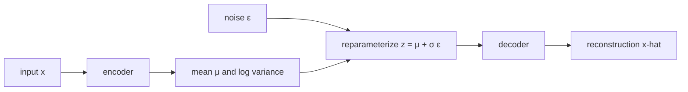
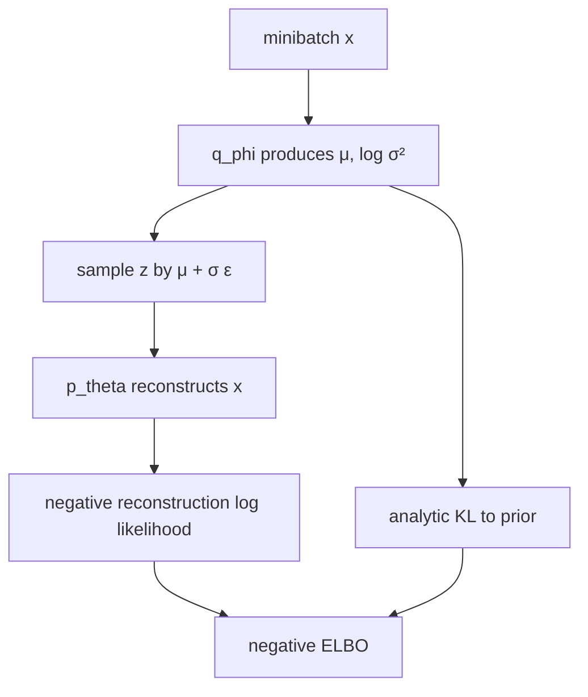
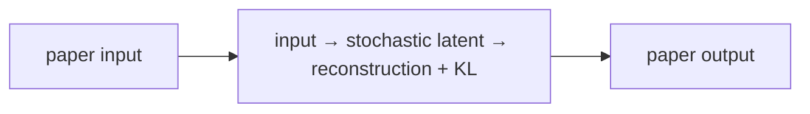
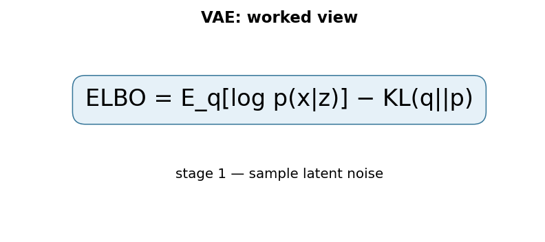

# Auto-Encoding Variational Bayes (VAE)

## TL;DR

A variational autoencoder learns a probability distribution over compact latent
variables rather than mapping an input to one fixed code. An encoder predicts a
mean and variance for an approximate posterior, samples a latent value through
the reparameterization trick, and a decoder reconstructs the input. Training
balances reconstruction quality against keeping latent distributions near a
simple prior. This makes sampling possible, but a VAE is not simply an ordinary
autoencoder with noise added.

## Fun Map for First Years 🧭

A VAE learns a tidy hidden sketch space. It compresses an example into a fuzzy point, then learns to rebuild examples from nearby points.

`🖼️ input → 🎒 latent distribution → 🎲 sample code → 🛠️ decoder rebuilds image`

A VAE compresses an input into a small, slightly random code, then rebuilds it. Keeping nearby codes meaningful lets us sample a new code to generate a result.

A photo of a face can become a point in a smooth hidden map. Nearby points decode to similar faces, so sliding or sampling in that map can create variations instead of only memorizing training images.

💻 **CS analogy:** a VAE is a lossy compressor with a random, structured code: it must reconstruct an input while keeping its codes organized enough to sample later.

## Math Playground 🧮

The essential equation or rule is:

```text
E_q(z|x)[log p(x|z)] − KL(q(z|x) || p(z))
```

**Essential equation:** \(\mathbb{E}_{q(z\mid x)}[\log p(x\mid z)]-\mathrm{KL}(q(z\mid x)\|p(z))\). The first part rewards rebuilding input x from a short hidden code z. The second part penalizes codes that become a messy, disconnected map; it encourages them to stay near a simple bell-shaped distribution. Together: reconstruct well, but keep the code space tidy enough that sampling a new point can make a sensible result.

The first term rewards good reconstruction. The second keeps the code space near a simple bell-shaped pattern, so it stays organized instead of scattered.

KL is a measure of how different two probability distributions are. Penalizing it prevents every input from hiding in its own isolated code region, which would make random sampling fail.

## Background: What Came Before 🕰️

Autoencoders could compress and reconstruct data, but their latent spaces could be irregular: picking a random point might decode to nonsense. Probabilistic latent-variable models supplied structure but were hard to train with modern neural networks. VAEs were needed to connect neural encoders and decoders with a latent space that supports both reconstruction and sampling.

This was needed to combine compression and generation in one model whose hidden space could be sampled smoothly.

This supplied a principled probabilistic latent-variable model, trading some sample sharpness for a structured and controllable hidden space.

## Why It Matters

Latent-variable generative models aim to explain observations using hidden
causes. For images, a hidden code might capture factors that make a particular
image likely. Exact posterior inference, \(p(z\mid x)\), is generally
intractable for expressive neural decoders. Earlier variational methods could
also require separate optimization for every datapoint, making large datasets
awkward.

Kingma and Welling introduced an amortized recognition model that predicts an
approximate posterior from each input and a reparameterized lower-bound
estimator trainable with ordinary stochastic gradients. This made continuous
latent-variable modeling practical at scale and became a foundation for
probabilistic representation learning, latent diffusion components, and many
generative architectures. It does not make every learned coordinate
interpretable or guarantee that random prior samples will be high quality.

## Core Intuition

An ordinary autoencoder can assign each training example a private code and
decode it well, leaving arbitrary gaps between codes. A VAE asks every example
to occupy a small cloud in a shared, organized latent space. The cloud must be
close enough to a standard normal prior that new points drawn from that prior
decode plausibly. Reconstruction says “retain information”; the prior penalty
says “make the map navigable.”



## The Mechanism

The model specifies a prior \(p(z)\), commonly a standard normal, and decoder
likelihood \(p_\theta(x\mid z)\). The encoder produces
\(q_\phi(z\mid x)\), commonly a diagonal Gaussian. Maximizing the evidence
lower bound (ELBO) avoids the intractable marginal likelihood:

\[
\log p_\theta(x) \ge
E_{q_\phi(z\mid x)}[\log p_\theta(x\mid z)]-
KL(q_\phi(z\mid x)\|p(z)).
\]

The first term is reconstruction likelihood; with a Gaussian or Bernoulli
decoder it corresponds to a suitable reconstruction loss. The KL term penalizes
an approximate posterior that departs from the prior. For a diagonal Gaussian
against a standard normal, the KL has a closed form, so it need not be sampled.




Naively sampling \(z\sim q_\phi(z\mid x)\) hides a random operation inside
the gradient path. The reparameterization trick writes the sample as
\(z=\mu_\phi(x)+\sigma_\phi(x)\epsilon\), with
\(\epsilon\sim N(0,I)\). Randomness is now in an input independent of encoder
parameters, so backpropagation differentiates through \(\mu\) and \(\sigma\).
The GIF is illustrative rather than a paper result.

The ELBO is a lower bound, not the exact log likelihood. A powerful decoder can
sometimes ignore z, yielding posterior collapse; an overly strong KL penalty
can similarly erase useful latent information. Beta-VAEs, KL annealing, free
bits, and alternative priors are later design choices with different tradeoffs,
not requirements of the original objective.

### Mechanism in Code

At implementation level, the mechanism operates on encoder parameters μ/log variance and decoder output. A faithful
forward pass should follow this order: sample with reparameterization, compute reconstruction likelihood, and add KL. Keep the intermediate
representation available while debugging; collapsing everything into one
opaque framework call makes shape and numerical errors much harder to isolate.

The key production failure to guard against is reducing KL across the wrong axes or evaluating with stochastic noise unintentionally. Add a tiny
reference test with hand-checkable values, then add a property test that
covers padding, empty/short inputs, boundary probabilities, and the largest
supported shape. Compare intermediate tensors with tolerances appropriate to
the dtype, and log the paper-specific statistic during a canary rollout.


## Practical Engineering Notes

### Worked Math & Dataflow

The compact view below makes the paper's central calculation concrete:

```text
ELBO = E_q[log p(x|z)] − KL(q||p)
```

In practice, the calculation is a pipeline: The reconstruction term preserves information about the input, while KL regularization keeps the learned latent distribution close to a simple prior. Removing either term breaks the intended trade-off. The important engineering
choice is to preserve the paper's intended invariant while making the operation
fit the available memory, batch size, and evaluation protocol.






Implement mean and log-variance heads, not a raw unconstrained variance. Compute
standard deviation as `exp(0.5 * logvar)` and guard against numerical extremes.
PyTorch distributions can express likelihoods, while a small explicit loss is
often easier to inspect. Sum or average reconstruction terms consistently with
the KL term: changing image resolution or reduction semantics changes their
relative scale. Log both pieces separately, plus latent mean/variance and
active latent dimensions.

The decoder likelihood must match preprocessing. Bernoulli likelihoods expect a
specific bounded interpretation; a generic mean-squared error is not equivalent
to a properly chosen likelihood. Keep pixel range, dequantization policy,
channel order, and normalization with the checkpoint. For non-image data,
choose likelihoods appropriate to counts, categories, sequences, or continuous
measurements rather than reusing an image recipe.

Sample from the prior for generation, but reconstruct using encoder samples for
diagnostics; they answer different questions. Interpolate in latent space only
after checking the prior geometry and decoder behavior. Evaluate samples with
diversity, coverage, and task-relevant metrics, not a few selected images.
Generative outputs can leak sensitive training examples or reproduce harmful
biases, so apply data governance and release review as for other generators.

### Training, debugging, and deployment

Begin with an overfit test on a tiny fixed subset. A correct implementation
should lower reconstruction loss and expose a nonzero but finite KL term. If
reconstruction improves while KL immediately approaches zero, inspect decoder
capacity, the reduction convention, and whether the encoder receives gradients.
If KL explodes, check the sign, log-variance initialization, learning rate, and
whether dimensions were accidentally summed twice. Plot reconstructions, prior
samples, posterior samples, and per-dimension KL through the same preprocessing
path used in training.

The Monte Carlo expectation introduces noise. Use enough samples for the
application, but a single reparameterized sample per input is a normal training
estimator. Do not expect each minibatch's ELBO components to be monotonic. For
reproducible tests, seed the random source and make the expected reduction
explicit. In distributed training, record global batch size and loss reduction;
averaging reconstruction across workers while summing KL in one place changes
the effective beta without any named hyperparameter changing.

Latent spaces are attractive for search and editing, but they are not
automatically safe identifiers. Nearby codes can decode to perceptually
different outputs, and an apparent direction can be entangled with protected or
irrelevant attributes. Evaluate interventions on held-out examples and include
negative cases. For medical, scientific, or other high-impact data, a generated
reconstruction is not a measurement and must not replace domain validation.

At service boundaries, distinguish three APIs: encoding an input to posterior
parameters, reconstructing from a posterior sample or mean, and generating from
the prior. Each has different privacy and product semantics. Returning a mean
may look smoother but hides uncertainty; returning samples can reveal instability
or sensitive variation. Version the encoder and decoder together, retain the
data and likelihood assumptions in metadata, and reject tensors that do not
match the trained preprocessing contract.

VAEs are also useful as a baseline. Their explicit latent prior and ELBO make
tradeoffs visible when comparing against autoregressive, adversarial, or
diffusion generators. A comparison should use comparable data splits, compute,
likelihood assumptions, and sample-selection rules. Without those controls, a
sharper image or a lower reconstruction number can obscure whether the model
actually covers the desired distribution.

For experimentation, keep a simple baseline decoder and a documented metric.
Increasing decoder depth, changing reconstruction distributions, and scheduling
the KL coefficient at once makes a failure impossible to attribute. Run ablations
one variable at a time and retain generated samples from fixed latent seeds. The
goal is not merely a lower scalar objective; it is evidence that the learned
probabilistic model supports the intended reconstruction or generation use.
This discipline also makes later capacity or objective changes scientifically
comparable, rather than merely more elaborate.
It preserves useful engineering evidence across iterations.
It also supports clearer review and rollback decisions.

## Runnable Code Example

### Run from the repository root

Prerequisites: Python 3 and the dependencies imported by [`implementations/21-vae/code/reparameterization.py`](implementations/21-vae/code/reparameterization.py).
The example is intentionally small enough to run on CPU; it is a teaching
implementation, not a production training or serving benchmark.

```bash
python3 implementations/21-vae/code/reparameterization.py
```

### What the example demonstrates

Read the module docstring first, then follow the functions implementing
**variational encoding with a reconstruction objective and KL regularizer**. The program turns `ELBO=E_q[logp(x|z)]−KL(q||p)` into executable operations,
prints a compact result, and checks that **reconstruction and KL terms are logged separately and latent samples use the reparameterization path**. The assertion matters:
it tests the semantic contract near the mechanism instead of treating a
plausible final number as proof that the implementation is correct.

### Expected behavior and useful experiments

The command should finish without a traceback and print a successful summary
or assertion message. You should observe the paper-specific behavior, not a
particular random numeric value. Change one input at a time: inspect the
intermediate tensor or state, rerun with a boundary case, and then compare the
result with the expected invariant. A useful first experiment is to **plot both loss terms and sample from the prior rather than evaluating encodings only**.

### Production connection

The toy program does not model every distributed or large-scale concern. In a
real service, version the preprocessing and configuration, record the relevant
intermediate statistic, and measure peak memory, throughput, p95/p99 latency,
and task quality. The first production guard should target **posterior collapse, KL dominance, or a decoder that ignores the latent**;
preserve a transparent reference path or a canary comparison before replacing
it with a fused, distributed, or highly optimized implementation.

## Common Misconceptions & Pitfalls

- **Misconception: `ELBO=E_q[logp(x|z)]−KL(q||p)` is the whole implementation.** The equation describes the paper's central relationship, but `variational encoding with a reconstruction objective and KL regularizer` also requires explicit input contracts, ordering, masking or sampling rules, and numerical choices. If those details are left implicit, two implementations can share the same formula and still produce different results. Treat the equation as a contract and document each intermediate tensor or state transition.
- **Misconception: the mechanism is automatically reliable when the final metric looks good.** A model can compensate for a wrong reduction, stale state, or malformed edge/token boundary on common examples. The local guard is **reconstruction and KL terms are logged separately and latent samples use the reparameterization path**. Check it on a tiny hand-worked fixture and on adversarial inputs before trusting an aggregate benchmark.
- **Pitfall: optimizing the operation before measuring its actual bottleneck.** For this paper, watch for **posterior collapse, KL dominance, or a decoder that ignores the latent** rather than assuming the largest theoretical term dominates every workload. Record memory, bandwidth, batch shape, tail latency, and quality slices. An optimization is only safe when it preserves the paper-specific contract and has a rollback path.
- **Pitfall: debugging only the final prediction.** Start with **plot both loss terms and sample from the prior rather than evaluating encodings only**; compare intermediate values with a simple reference. Freeze preprocessing, configuration, seeds, and model versions; then bisect the first divergence. This makes a failure reproducible and distinguishes data-contract errors from numerical instability, integration bugs, and a genuinely unsuitable paper mechanism.

## Quick Concept Checks

**Q:** What is the central idea behind **variational encoding with a reconstruction objective and KL regularizer**?
**A:** It is a structured data or optimization path, not a slogan: inputs are transformed, paper-specific relationships are computed, invalid choices are excluded when necessary, and the result is aggregated into an output or objective. The important implementation question is which intermediate values must remain observable so a reviewer can connect the code to the paper.

**Q:** How should I read `ELBO=E_q[logp(x|z)]−KL(q||p)`?
**A:** Read each symbol as an operation with a shape, a data source, and a numerical range. Ask what changes when its scale, temperature, rank, timestep, neighborhood, or other paper-specific value changes. Then make a two- or three-example fixture where the expected result can be calculated by hand; this catches notation-to-code misunderstandings early.

**Q:** What invariant must a correct implementation preserve?
**A:** It must preserve **reconstruction and KL terms are logged separately and latent samples use the reparameterization path**. This is stronger than asking whether accuracy improved because it is local, deterministic, and testable near the operation that could be wrong. Assert it at the boundary, compare against a small reference implementation, and include the unusual input shape most likely to violate it in production.

**Q:** What is the most dangerous failure mode?
**A:** The first risk to investigate is **posterior collapse, KL dominance, or a decoder that ignores the latent**. It can produce plausible outputs while degrading only a slice of traffic, so monitor a paper-specific statistic alongside quality and system metrics. A canary should compare the old and new paths on identical inputs and should retain enough intermediate diagnostics to explain a regression.

**Q:** How would I test this idea beyond a happy-path unit test?
**A:** Begin with **plot both loss terms and sample from the prior rather than evaluating encodings only**, then add differential tests against a transparent reference on small randomized inputs. Cover boundaries such as padding, termination, empty neighborhoods, long sequences, rare tokens, extreme values, or duplicated examples when they apply. Test both output values and gradients or state updates when training behavior is part of the paper's claim.

**Q:** What should I remember when applying the paper in a real system?
**A:** Keep the paper's assumptions in the production contract: version the preprocessing and configuration, expose the relevant intermediate statistic, and define quality slices before tuning performance. Compare throughput, peak memory, p95/p99 latency, and task quality against a baseline. The paper is useful only when its mechanism remains correct under the workload and failure modes you actually operate.

## Interview Q&A

**Q:** Walk through **variational encoding with a reconstruction objective and KL regularizer** end to end. How would you implement `ELBO=E_q[logp(x|z)]−KL(q||p)`?
**A:** Decompose the expression into the actual data path: inputs enter the paper-specific transformation, intermediate scores or states are computed, invalid elements are excluded, and the result is reduced into the output or loss. For this paper, `ELBO=E_q[logp(x|z)]−KL(q||p)` is an executable contract, not decoration: document tensor shapes, ownership of mutable state, numerical precision, and where batching changes semantics. Keep a small reference implementation beside the optimized path so a reviewer can connect each line of `code` to one term in the equation.

**Follow-up:** What invariant would you assert, and why is it stronger than checking final accuracy?
**A:** Assert that **reconstruction and KL terms are logged separately and latent samples use the reparameterization path**. That property is local enough to fail near the defect, whereas accuracy can remain acceptable while a mask, reduction, or state boundary is wrong on a rare input. Add a hand-computed fixture, a randomized differential test against the reference, and shape/dtype assertions at the API boundary. The test should also cover an empty, padded, terminal, high-degree, long-context, or otherwise adversarial case when that input is meaningful for this mechanism.

**Q:** What is the main production trade-off in this paper, and how would you capacity-plan it?
**A:** The central trade-off is that **the mechanism changes both quality behavior and resource use**. Capacity planning therefore needs more than average FLOPs: measure peak memory, memory bandwidth, communication, preprocessing, batch-size sensitivity, and p95/p99 latency on representative distributions. Define a quality budget before optimizing, then compare a simple baseline with the paper mechanism using identical inputs and seeds. A faster path that silently changes tokenization, routing, masking, sampling, or optimization behavior is not an acceptable optimization until its quality impact is measured.

**Follow-up:** Which failure mode would make you roll back first?
**A:** Roll back on evidence of **posterior collapse, KL dominance, or a decoder that ignores the latent**, especially when the symptom is silent and outputs still look plausible. Add dashboards for the paper-specific statistic, error and timeout rates, resource saturation, and a task metric sliced by difficult inputs. Use a canary or shadow comparison with the previous implementation, retain the old path behind a flag, and make the rollback decision threshold explicit before deployment. The important SDE2 judgment is to protect the paper’s semantic contract, not merely to chase a faster benchmark.

**Q:** A model passes unit tests but fails in production. What is your debugging plan?
**A:** Start with **plot both loss terms and sample from the prior rather than evaluating encodings only**. Reproduce the smallest production-shaped example, freeze the model and preprocessing versions, and compare intermediate tensors or records rather than only the final prediction. Check data contracts, masks, sequence boundaries, random seeds, numerical precision, and serving mode in that order; then bisect between the reference and optimized implementations. If the defect is not numerical, run a controlled ablation that removes the paper-specific mechanism and compare the resulting failure rate, which separates integration problems from a bad mechanism or configuration.

**Follow-up:** What evidence would you present in the review or postmortem?
**A:** Present one minimal failing input, the expected **reconstruction and KL terms are logged separately and latent samples use the reparameterization path**, the first intermediate value that diverged, and the regression test that now protects it. Include a before/after table for task quality, memory, throughput, p95/p99 latency, and cost, with slices for the failure population. A complete SDE2 answer also states the rollout guard, owner, and alert threshold. That turns a paper idea into an operable system rather than a one-line claim about an equation.

## Further Reading

- [Original paper](https://arxiv.org/abs/1312.6114)
- [Understanding disentangling in beta-VAE](https://arxiv.org/abs/1804.03599)
- [PyTorch distributions documentation](https://pytorch.org/docs/stable/distributions.html)
