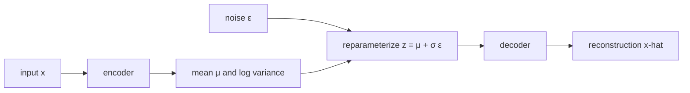
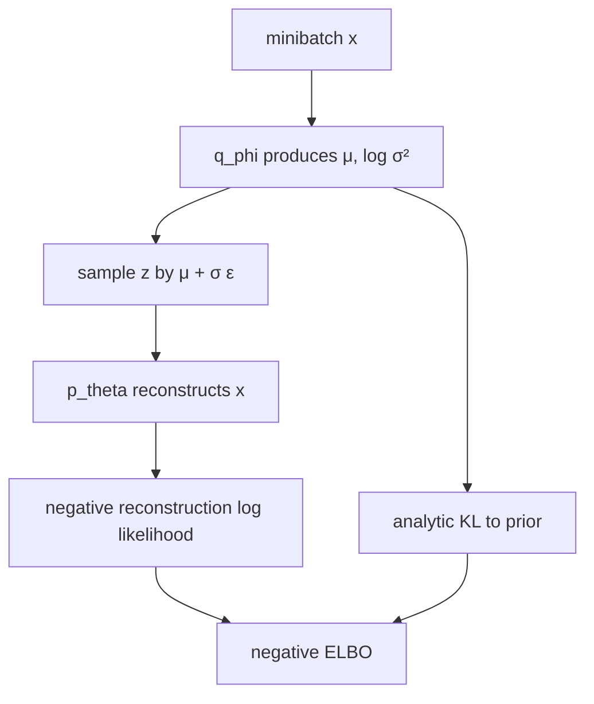

# Auto-Encoding Variational Bayes (VAE)

## TL;DR

A variational autoencoder learns a probability distribution over compact latent
variables rather than mapping an input to one fixed code. An encoder predicts a
mean and variance for an approximate posterior, samples a latent value through
the reparameterization trick, and a decoder reconstructs the input. Training
balances reconstruction quality against keeping latent distributions near a
simple prior. This makes sampling possible, but a VAE is not simply an ordinary
autoencoder with noise added.

## Fun Map for First Years 🧭

A VAE learns a tidy hidden sketch space. It compresses an example into a fuzzy point, then learns to rebuild examples from nearby points.

`🖼️ input → 🎒 latent distribution → 🎲 sample code → 🛠️ decoder rebuilds image`

💻 **CS analogy:** a VAE is a lossy compressor with a random, structured code: it must reconstruct an input while keeping its codes organized enough to sample later.

## Math Playground 🧮

The VAE maximizes an ELBO: \(\mathbb{E}_{q(z\mid x)}[\log p(x\mid z)]-\mathrm{KL}(q(z\mid x)\|p(z))\). The first term is a reconstruction score; the KL term is a tidy-code penalty that keeps each encoded cloud near a simple prior. Sampling \(z=\mu+\sigma\epsilon\) lets gradients flow through the random-looking step.

## Background: What Came Before 🕰️

Autoencoders could compress and reconstruct data, but their latent spaces could be irregular: picking a random point might decode to nonsense. Probabilistic latent-variable models supplied structure but were hard to train with modern neural networks. VAEs were needed to connect neural encoders and decoders with a latent space that supports both reconstruction and sampling.

## Why It Matters

Latent-variable generative models aim to explain observations using hidden
causes. For images, a hidden code might capture factors that make a particular
image likely. Exact posterior inference, \(p(z\mid x)\), is generally
intractable for expressive neural decoders. Earlier variational methods could
also require separate optimization for every datapoint, making large datasets
awkward.

Kingma and Welling introduced an amortized recognition model that predicts an
approximate posterior from each input and a reparameterized lower-bound
estimator trainable with ordinary stochastic gradients. This made continuous
latent-variable modeling practical at scale and became a foundation for
probabilistic representation learning, latent diffusion components, and many
generative architectures. It does not make every learned coordinate
interpretable or guarantee that random prior samples will be high quality.

## Core Intuition

An ordinary autoencoder can assign each training example a private code and
decode it well, leaving arbitrary gaps between codes. A VAE asks every example
to occupy a small cloud in a shared, organized latent space. The cloud must be
close enough to a standard normal prior that new points drawn from that prior
decode plausibly. Reconstruction says “retain information”; the prior penalty
says “make the map navigable.”



## The Mechanism

The model specifies a prior \(p(z)\), commonly a standard normal, and decoder
likelihood \(p_\theta(x\mid z)\). The encoder produces
\(q_\phi(z\mid x)\), commonly a diagonal Gaussian. Maximizing the evidence
lower bound (ELBO) avoids the intractable marginal likelihood:

\[
\log p_\theta(x) \ge
E_{q_\phi(z\mid x)}[\log p_\theta(x\mid z)]-
KL(q_\phi(z\mid x)\|p(z)).
\]

The first term is reconstruction likelihood; with a Gaussian or Bernoulli
decoder it corresponds to a suitable reconstruction loss. The KL term penalizes
an approximate posterior that departs from the prior. For a diagonal Gaussian
against a standard normal, the KL has a closed form, so it need not be sampled.




Naively sampling \(z\sim q_\phi(z\mid x)\) hides a random operation inside
the gradient path. The reparameterization trick writes the sample as
\(z=\mu_\phi(x)+\sigma_\phi(x)\epsilon\), with
\(\epsilon\sim N(0,I)\). Randomness is now in an input independent of encoder
parameters, so backpropagation differentiates through \(\mu\) and \(\sigma\).
The GIF is illustrative rather than a paper result.

The ELBO is a lower bound, not the exact log likelihood. A powerful decoder can
sometimes ignore z, yielding posterior collapse; an overly strong KL penalty
can similarly erase useful latent information. Beta-VAEs, KL annealing, free
bits, and alternative priors are later design choices with different tradeoffs,
not requirements of the original objective.

## Practical Engineering Notes

Implement mean and log-variance heads, not a raw unconstrained variance. Compute
standard deviation as `exp(0.5 * logvar)` and guard against numerical extremes.
PyTorch distributions can express likelihoods, while a small explicit loss is
often easier to inspect. Sum or average reconstruction terms consistently with
the KL term: changing image resolution or reduction semantics changes their
relative scale. Log both pieces separately, plus latent mean/variance and
active latent dimensions.

The decoder likelihood must match preprocessing. Bernoulli likelihoods expect a
specific bounded interpretation; a generic mean-squared error is not equivalent
to a properly chosen likelihood. Keep pixel range, dequantization policy,
channel order, and normalization with the checkpoint. For non-image data,
choose likelihoods appropriate to counts, categories, sequences, or continuous
measurements rather than reusing an image recipe.

Sample from the prior for generation, but reconstruct using encoder samples for
diagnostics; they answer different questions. Interpolate in latent space only
after checking the prior geometry and decoder behavior. Evaluate samples with
diversity, coverage, and task-relevant metrics, not a few selected images.
Generative outputs can leak sensitive training examples or reproduce harmful
biases, so apply data governance and release review as for other generators.

### Training, debugging, and deployment

Begin with an overfit test on a tiny fixed subset. A correct implementation
should lower reconstruction loss and expose a nonzero but finite KL term. If
reconstruction improves while KL immediately approaches zero, inspect decoder
capacity, the reduction convention, and whether the encoder receives gradients.
If KL explodes, check the sign, log-variance initialization, learning rate, and
whether dimensions were accidentally summed twice. Plot reconstructions, prior
samples, posterior samples, and per-dimension KL through the same preprocessing
path used in training.

The Monte Carlo expectation introduces noise. Use enough samples for the
application, but a single reparameterized sample per input is a normal training
estimator. Do not expect each minibatch's ELBO components to be monotonic. For
reproducible tests, seed the random source and make the expected reduction
explicit. In distributed training, record global batch size and loss reduction;
averaging reconstruction across workers while summing KL in one place changes
the effective beta without any named hyperparameter changing.

Latent spaces are attractive for search and editing, but they are not
automatically safe identifiers. Nearby codes can decode to perceptually
different outputs, and an apparent direction can be entangled with protected or
irrelevant attributes. Evaluate interventions on held-out examples and include
negative cases. For medical, scientific, or other high-impact data, a generated
reconstruction is not a measurement and must not replace domain validation.

At service boundaries, distinguish three APIs: encoding an input to posterior
parameters, reconstructing from a posterior sample or mean, and generating from
the prior. Each has different privacy and product semantics. Returning a mean
may look smoother but hides uncertainty; returning samples can reveal instability
or sensitive variation. Version the encoder and decoder together, retain the
data and likelihood assumptions in metadata, and reject tensors that do not
match the trained preprocessing contract.

VAEs are also useful as a baseline. Their explicit latent prior and ELBO make
tradeoffs visible when comparing against autoregressive, adversarial, or
diffusion generators. A comparison should use comparable data splits, compute,
likelihood assumptions, and sample-selection rules. Without those controls, a
sharper image or a lower reconstruction number can obscure whether the model
actually covers the desired distribution.

For experimentation, keep a simple baseline decoder and a documented metric.
Increasing decoder depth, changing reconstruction distributions, and scheduling
the KL coefficient at once makes a failure impossible to attribute. Run ablations
one variable at a time and retain generated samples from fixed latent seeds. The
goal is not merely a lower scalar objective; it is evidence that the learned
probabilistic model supports the intended reconstruction or generation use.
This discipline also makes later capacity or objective changes scientifically
comparable, rather than merely more elaborate.
It preserves useful engineering evidence across iterations.
It also supports clearer review and rollback decisions.

## Runnable Code Example

[`code/reparameterization.py`](code/reparameterization.py) samples a scalar
latent variable using \(z=\mu+\sigma\epsilon\) and asserts the expected value
for a fixed noise draw.

```bash
python3 papers/21-vae/code/reparameterization.py
```

It illustrates gradient-friendly sampling, not full neural training or ELBO
optimization.

## Common Misconceptions & Pitfalls

**“The encoder outputs one latent vector.”** It outputs distribution parameters;
training samples a latent vector from that approximate posterior.

**“Low reconstruction error means good generation.”** A private-code
autoencoder can reconstruct well while leaving a prior-sampled latent space bad.

**“KL is just regularization.”** It has a probabilistic role: it relates the
approximate posterior to the model's chosen prior.

## Interview Q&A

**Q:** What does amortized inference mean?
**A:** One encoder network maps every input to posterior parameters instead of
optimizing separate variational parameters per example.

**Q:** Why reparameterize?
**A:** It moves randomness into parameter-independent noise so gradients can
flow through the sampled latent value.

**Q:** What is the ELBO tradeoff?
**A:** It balances explaining each observation with making its posterior resemble
the prior used for generation.

**Q:** What is posterior collapse?
**A:** The decoder ignores z and the approximate posterior approaches the prior,
so the latent code carries little information.

**Q:** Can VAE latents be called disentangled by default?
**A:** No. Useful or separated factors require evidence and often additional
assumptions or objectives.

## Further Reading

- [Original paper](https://arxiv.org/abs/1312.6114)
- [Understanding disentangling in beta-VAE](https://arxiv.org/abs/1804.03599)
- [PyTorch distributions documentation](https://pytorch.org/docs/stable/distributions.html)
