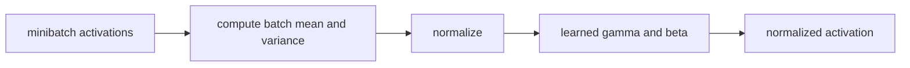
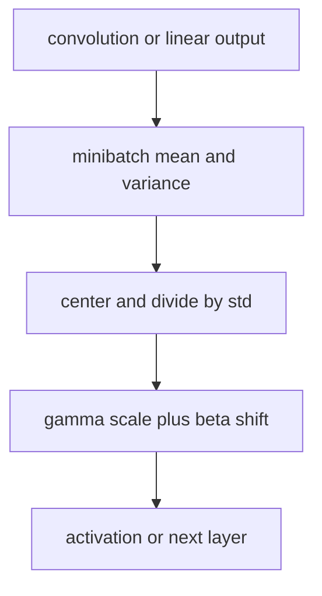

# Batch Normalization: Accelerating Deep Network Training

## TL;DR

Batch Normalization standardizes intermediate activations using statistics from
the current training minibatch, then restores learnable scale and shift. This
usually makes optimization less sensitive to initialization and permits more
aggressive learning rates. At inference it uses accumulated running statistics
rather than the current request batch. That train/eval difference is essential:
BatchNorm is not a stateless activation function.

## Fun Map for First Years 🧭

BatchNorm gives a layer numbers on a more predictable scale, like converting many classroom tests to the same grading scale before comparing them.

`📊 batch values → ➗ center and scale → 🎚️ learned adjuster → 🧠 steadier training`

💻 **CS analogy:** it is like standardizing measurements before a shared service consumes them, then allowing each caller to choose a scale and offset again.

## Math Playground 🧮

For a mini-batch, BatchNorm computes \(\hat{x}=(x-\mu_B)/\sqrt{\sigma_B^2+\epsilon}\), then returns \(y=\gamma\hat{x}+\beta\). Subtracting the mean centers the batch; dividing by its spread makes values comparable. The learned \(\gamma,\beta\) are an escape hatch: the network can restore whatever scale or shift it needs.

## Background: What Came Before 🕰️

Deep networks were increasingly hard to optimize because a layer kept receiving differently distributed inputs as earlier layers changed. Smaller learning rates and careful initialization helped but slowed experiments. Batch Normalization was needed to make training more stable and permit more aggressive optimization settings.

## Why It Matters

Deep networks change the distribution arriving at a layer whenever preceding
weights change. The paper called this internal covariate shift and proposed
normalizing inputs to transformations inside the network. The authors reported
that BatchNorm enabled higher learning rates and less careful initialization;
on their image-classification experiment it reached comparable accuracy with
fourteen times fewer training steps. The original explanation motivated a
widely adopted practical layer, although later work debates whether internal
covariate shift is the complete theoretical reason for its success.

BatchNorm became a standard component in convolutional backbones including
ResNet. It also creates an important operational contract: model output depends
on training versus evaluation mode and on the statistics saved in a checkpoint.
Transformer models more often use LayerNorm because sequence and small-batch
conditions differ. Normalization choice is architectural, not a harmless
interchangeable flag.

## Core Intuition

Imagine a downstream layer receiving measurements whose units drift after each
upstream change. It must continually adapt to whether “large” means ten or one
thousand. BatchNorm gives that layer a locally standardized stream, then lets it
learn the useful scale and offset. The learned affine parameters mean the model
can still represent a nonzero mean or nonunit scale when that is useful.



## The Mechanism

For a feature's minibatch values \(x_1,\ldots,x_m\), compute
\(\mu_B=\frac1m\sum_i x_i\) and
\(\sigma_B^2=\frac1m\sum_i(x_i-\mu_B)^2\). BatchNorm produces
\(\hat x_i=(x_i-\mu_B)/\sqrt{\sigma_B^2+\epsilon}\), then
\(y_i=\gamma\hat x_i+\beta\). Gamma and beta are learned per feature or
channel. Epsilon avoids unstable division when a batch has negligible variance.




For convolutional tensors, BatchNorm normally pools statistics across batch and
spatial positions independently for each channel. It does not normalize each
pixel alone. During training, frameworks update running mean and variance as an
estimate for inference. During `eval()` they use those saved values instead of
statistics from the current batch, ensuring a prediction does not depend on
which unrelated requests arrived alongside it. The GIF is illustrative, not a
measurement from the paper.

Batch-derived noise can regularize training, but it is not a substitute for all
regularization. Very small or non-IID batches make statistics noisy and can hurt
accuracy. SyncBatchNorm shares statistics across devices; GroupNorm and
LayerNorm normalize different axes and have different behavior. The original
paper's placement and training recipe should not be confused with every later
pre-activation or fused implementation.

## Practical Engineering Notes

Use `torch.nn.BatchNorm1d`, `BatchNorm2d`, or `BatchNorm3d` with explicit
understanding of the input layout. Verify channel dimension and `num_features`;
a tensor that runs with the wrong layout can silently normalize the wrong axis.
Call `model.train()` for training and `model.eval()` for validation/serving, and
checkpoint buffers as well as parameters. Loading weights while discarding
running statistics changes predictions even though gamma and beta match.

Batch size is a systems decision. Per-device batches can shrink as images or
models grow, making local BatchNorm statistics unstable. Distributed training
may need synchronized statistics, frozen pretrained statistics, or a different
normalization family. Test the exact global and per-device topology: gradient
accumulation does not make BatchNorm see one large batch because it executes
separate forward passes. Export paths that fuse convolution and BatchNorm must
only do so after training statistics are finalized.

Monitor running means/variances, activation ranges, train/eval output deltas,
and NaN rates. A data pipeline normalization change can shift every BatchNorm
layer. When fine-tuning on small or shifted datasets, compare updating, freezing,
and recalibrating statistics using a held-out protocol. Do not copy one choice
from another task; the right answer depends on batch size, domain shift, and
whether pretrained features are being adapted.

### Reproducibility and troubleshooting

BatchNorm's running buffers are state, not incidental telemetry. A production
artifact must preserve `running_mean`, `running_var`, the affine parameters, the
epsilon, and the framework's interpretation of momentum. Framework momentum is
commonly a coefficient for updating running statistics, not the optimizer's SGD
momentum; mixing those concepts produces misleading configuration reviews.
Calibrating buffers after a quantization or export transformation should use a
representative, authorized dataset and evaluation mode chosen deliberately.

When comparing experiments, keep batch construction stable. Dropping the final
small batch, shuffling order, dynamic image shapes, and distributed shard size
all affect observed statistics. A model can therefore differ slightly across
hardware even with the same parameter seed. For a regression test, execute a
known batch in both train and eval modes, check buffer updates only in train
mode, and allow numerical tolerances appropriate to the backend.

Avoid “fixing” a train/eval gap by accidentally leaving the model in training
mode at serving time. That makes one user's prediction depend on other requests,
updates state during traffic, and creates difficult-to-reproduce behavior.
Conversely, forgetting train mode while fine-tuning leaves old statistics frozen
and may conceal domain shift. Make mode switching explicit at entry points and
test it in integration tests, not just notebooks.

BatchNorm interacts with augmentations and sampling. If a rare source domain is
clustered in batches, its feature statistics can influence another domain's
examples. Inspect per-domain and per-device activation statistics when fairness
or robustness matters. If cross-example coupling is unacceptable, consider a
normalization method that operates within examples, but measure accuracy,
throughput, and memory rather than assuming an alternative is superior.

For inference optimization, fold a convolution followed by fixed BatchNorm into
new convolution weights and bias only after confirming all tensors and epsilon
conventions. Validate fused output against unfused output on a canary suite.
Fusing before statistics settle, or using a runtime that treats variance
corrections differently, can create a subtle accuracy regression. Keep an
unfused reference path for debugging and compare layerwise activation ranges.

The important engineering lesson is that normalization reaches beyond one
formula. It changes the training dataflow, checkpoint contents, distributed
semantics, and serving behavior. Treat it as a stateful component with tests,
observability, and versioned configuration.

One useful release gate compares representative validation results with the
model's running statistics frozen exactly as they will be served. If an offline
evaluation accidentally uses training mode, it reports a different model and
can make a small-batch deployment failure look like a data problem. Capture
train/eval mode in experiment metadata, and test both single-request and normal
batched inference. These simple checks catch most BatchNorm deployment errors
before users see inconsistent predictions.

The same principle applies to model conversion. Treat a converted or fused
artifact as a new build: preserve the source revision, compare outputs on a
frozen test suite, inspect activation distributions, and retain a rollback
candidate. BatchNorm makes these checks cheap and concrete because its buffers
and affine parameters provide visible state to compare across runtimes.

## Runnable Code Example

[`code/batch_norm.py`](code/batch_norm.py) computes scalar minibatch statistics
and asserts the transformed batch has approximately zero mean and unit variance.

```bash
python3 papers/22-batch-normalization/code/batch_norm.py
```

It omits learned gamma/beta gradients and running buffers so the central
training-batch calculation is visible.

## Common Misconceptions & Pitfalls

**“BatchNorm normalizes each example independently.”** It uses statistics across
the minibatch (and spatial positions for convolutional channels).

**“Train and eval mode are equivalent.”** Training uses current batch statistics;
evaluation uses accumulated running estimates.

**“BatchNorm fixes any unstable training.”** Learning rate, loss scaling, data,
and architecture can still cause divergence.

## Interview Q&A

**Q:** Why are gamma and beta needed?
**A:** They let the network recover useful feature scales and offsets after
standardization.

**Q:** Why keep running statistics?
**A:** Serving often has one request or variable batches, so current-batch
statistics would make predictions request-dependent.

**Q:** What happens with batch size one?
**A:** Statistics are weak or degenerate for some shapes, so BatchNorm can become
unstable or inappropriate.

**Q:** Is BatchNorm the same as LayerNorm?
**A:** No. They normalize different axes and have different dependence on other
examples in a batch.

**Q:** Can a convolution and BatchNorm be fused?
**A:** At inference, fixed running statistics allow an equivalent fused transform
in many runtimes.

## Further Reading

- [Original paper](https://arxiv.org/abs/1502.03167)
- [Group Normalization](https://arxiv.org/abs/1803.08494)
- [PyTorch BatchNorm2d documentation](https://pytorch.org/docs/stable/generated/torch.nn.BatchNorm2d.html)
