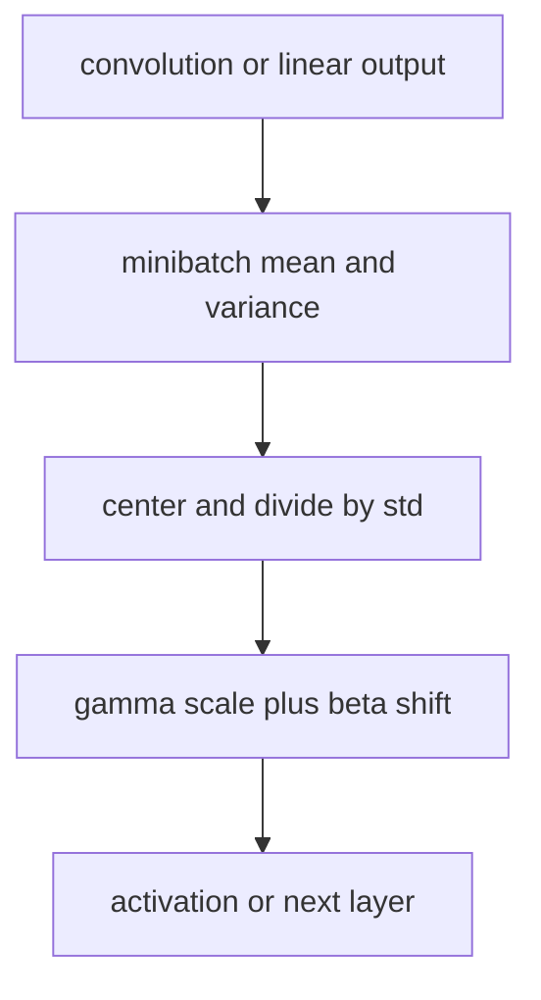
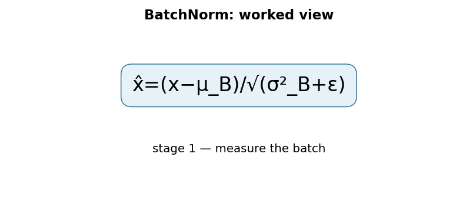

# Batch Normalization: Accelerating Deep Network Training

## TL;DR

Batch Normalization standardizes intermediate activations using statistics from
the current training minibatch, then restores learnable scale and shift. This
usually makes optimization less sensitive to initialization and permits more
aggressive learning rates. At inference it uses accumulated running statistics
rather than the current request batch. That train/eval difference is essential:
BatchNorm is not a stateless activation function.

## Fun Map for First Years 🧭

BatchNorm gives a layer numbers on a more predictable scale, like converting many classroom tests to the same grading scale before comparing them.

`📊 batch values → ➗ center and scale → 🎚️ learned adjuster → 🧠 steadier training`

BatchNorm gives each layer inputs with a more predictable scale during training. The layer can still learn the scale it wants afterward.

If one minibatch produces values around 1,000 and the next around 0.01, later layers see a moving target. BatchNorm standardizes each batch before letting the model choose a useful scale again.

💻 **CS analogy:** it is like standardizing measurements before a shared service consumes them, then allowing each caller to choose a scale and offset again.

## Math Playground 🧮

The essential equation or rule is:

```text
x̂ = (x − μ_B) / √(σ_B² + ε)
y = γx̂ + β
```

**Essential equation:** \(\hat{x}=(x-\mu_B)/\sqrt{\sigma_B^2+\epsilon}\), followed by \(y=\gamma\hat{x}+\beta\). First subtract the batch average \(\mu_B\), so values are centered around zero. Then divide by the spread (standard deviation), so a wide-ranging batch and narrow-ranging batch use a comparable scale. The learned γ and β can scale and shift the result back if that helps the network.

Subtracting μ centers values around zero; dividing by the spread makes batches comparable. γ and β are learned knobs that can rescale and shift the result.

ε is a tiny positive number that prevents division by zero when a batch has almost no variation. The square root turns variance into standard deviation, measured in the same units as x.

## Background: What Came Before 🕰️

Deep networks were increasingly hard to optimize because a layer kept receiving differently distributed inputs as earlier layers changed. Smaller learning rates and careful initialization helped but slowed experiments. Batch Normalization was needed to make training more stable and permit more aggressive optimization settings.

It addressed unstable deep-network training, where changing earlier layers constantly changed the scale seen by later layers.

This stabilized many training recipes and allowed larger learning rates, while also making batch size and train-versus-inference behavior important implementation details.

## Why It Matters

Deep networks change the distribution arriving at a layer whenever preceding
weights change. The paper called this internal covariate shift and proposed
normalizing inputs to transformations inside the network. The authors reported
that BatchNorm enabled higher learning rates and less careful initialization;
on their image-classification experiment it reached comparable accuracy with
fourteen times fewer training steps. The original explanation motivated a
widely adopted practical layer, although later work debates whether internal
covariate shift is the complete theoretical reason for its success.

BatchNorm became a standard component in convolutional backbones including
ResNet. It also creates an important operational contract: model output depends
on training versus evaluation mode and on the statistics saved in a checkpoint.
Transformer models more often use LayerNorm because sequence and small-batch
conditions differ. Normalization choice is architectural, not a harmless
interchangeable flag.

## Core Intuition

Imagine a downstream layer receiving measurements whose units drift after each
upstream change. It must continually adapt to whether “large” means ten or one
thousand. BatchNorm gives that layer a locally standardized stream, then lets it
learn the useful scale and offset. The learned affine parameters mean the model
can still represent a nonzero mean or nonunit scale when that is useful.


## The Mechanism

For a feature's minibatch values \(x_1,\ldots,x_m\), compute
\(\mu_B=\frac1m\sum_i x_i\) and
\(\sigma_B^2=\frac1m\sum_i(x_i-\mu_B)^2\). BatchNorm produces
\(\hat x_i=(x_i-\mu_B)/\sqrt{\sigma_B^2+\epsilon}\), then
\(y_i=\gamma\hat x_i+\beta\). Gamma and beta are learned per feature or
channel. Epsilon avoids unstable division when a batch has negligible variance.




For convolutional tensors, BatchNorm normally pools statistics across batch and
spatial positions independently for each channel. It does not normalize each
pixel alone. During training, frameworks update running mean and variance as an
estimate for inference. During `eval()` they use those saved values instead of
statistics from the current batch, ensuring a prediction does not depend on
which unrelated requests arrived alongside it. The GIF is illustrative, not a
measurement from the paper.

Batch-derived noise can regularize training, but it is not a substitute for all
regularization. Very small or non-IID batches make statistics noisy and can hurt
accuracy. SyncBatchNorm shares statistics across devices; GroupNorm and
LayerNorm normalize different axes and have different behavior. The original
paper's placement and training recipe should not be confused with every later
pre-activation or fused implementation.

### Mechanism in Code

At implementation level, the mechanism operates on feature batch and running statistics. A faithful
forward pass should follow this order: compute batch moments, normalize, apply γ/β, update running estimates, and switch modes. Keep the intermediate
representation available while debugging; collapsing everything into one
opaque framework call makes shape and numerical errors much harder to isolate.

The key production failure to guard against is using batch statistics in serving or updating running statistics during validation. Add a tiny
reference test with hand-checkable values, then add a property test that
covers padding, empty/short inputs, boundary probabilities, and the largest
supported shape. Compare intermediate tensors with tolerances appropriate to
the dtype, and log the paper-specific statistic during a canary rollout.


## Practical Engineering Notes

### Worked Math & Dataflow

The compact view below makes the paper's central calculation concrete:

```text
x̂=(x−μ_B)/√(σ²_B+ε)
```

In practice, the calculation is a pipeline: Batch statistics put activations on a predictable scale, then learned γ and β restore useful shifts and magnitudes. Training uses batches; evaluation uses running estimates. The important engineering
choice is to preserve the paper's intended invariant while making the operation
fit the available memory, batch size, and evaluation protocol.





Use `torch.nn.BatchNorm1d`, `BatchNorm2d`, or `BatchNorm3d` with explicit
understanding of the input layout. Verify channel dimension and `num_features`;
a tensor that runs with the wrong layout can silently normalize the wrong axis.
Call `model.train()` for training and `model.eval()` for validation/serving, and
checkpoint buffers as well as parameters. Loading weights while discarding
running statistics changes predictions even though gamma and beta match.

Batch size is a systems decision. Per-device batches can shrink as images or
models grow, making local BatchNorm statistics unstable. Distributed training
may need synchronized statistics, frozen pretrained statistics, or a different
normalization family. Test the exact global and per-device topology: gradient
accumulation does not make BatchNorm see one large batch because it executes
separate forward passes. Export paths that fuse convolution and BatchNorm must
only do so after training statistics are finalized.

Monitor running means/variances, activation ranges, train/eval output deltas,
and NaN rates. A data pipeline normalization change can shift every BatchNorm
layer. When fine-tuning on small or shifted datasets, compare updating, freezing,
and recalibrating statistics using a held-out protocol. Do not copy one choice
from another task; the right answer depends on batch size, domain shift, and
whether pretrained features are being adapted.

### Reproducibility and troubleshooting

BatchNorm's running buffers are state, not incidental telemetry. A production
artifact must preserve `running_mean`, `running_var`, the affine parameters, the
epsilon, and the framework's interpretation of momentum. Framework momentum is
commonly a coefficient for updating running statistics, not the optimizer's SGD
momentum; mixing those concepts produces misleading configuration reviews.
Calibrating buffers after a quantization or export transformation should use a
representative, authorized dataset and evaluation mode chosen deliberately.

When comparing experiments, keep batch construction stable. Dropping the final
small batch, shuffling order, dynamic image shapes, and distributed shard size
all affect observed statistics. A model can therefore differ slightly across
hardware even with the same parameter seed. For a regression test, execute a
known batch in both train and eval modes, check buffer updates only in train
mode, and allow numerical tolerances appropriate to the backend.

Avoid “fixing” a train/eval gap by accidentally leaving the model in training
mode at serving time. That makes one user's prediction depend on other requests,
updates state during traffic, and creates difficult-to-reproduce behavior.
Conversely, forgetting train mode while fine-tuning leaves old statistics frozen
and may conceal domain shift. Make mode switching explicit at entry points and
test it in integration tests, not just notebooks.

BatchNorm interacts with augmentations and sampling. If a rare source domain is
clustered in batches, its feature statistics can influence another domain's
examples. Inspect per-domain and per-device activation statistics when fairness
or robustness matters. If cross-example coupling is unacceptable, consider a
normalization method that operates within examples, but measure accuracy,
throughput, and memory rather than assuming an alternative is superior.

For inference optimization, fold a convolution followed by fixed BatchNorm into
new convolution weights and bias only after confirming all tensors and epsilon
conventions. Validate fused output against unfused output on a canary suite.
Fusing before statistics settle, or using a runtime that treats variance
corrections differently, can create a subtle accuracy regression. Keep an
unfused reference path for debugging and compare layerwise activation ranges.

The important engineering lesson is that normalization reaches beyond one
formula. It changes the training dataflow, checkpoint contents, distributed
semantics, and serving behavior. Treat it as a stateful component with tests,
observability, and versioned configuration.

One useful release gate compares representative validation results with the
model's running statistics frozen exactly as they will be served. If an offline
evaluation accidentally uses training mode, it reports a different model and
can make a small-batch deployment failure look like a data problem. Capture
train/eval mode in experiment metadata, and test both single-request and normal
batched inference. These simple checks catch most BatchNorm deployment errors
before users see inconsistent predictions.

The same principle applies to model conversion. Treat a converted or fused
artifact as a new build: preserve the source revision, compare outputs on a
frozen test suite, inspect activation distributions, and retain a rollback
candidate. BatchNorm makes these checks cheap and concrete because its buffers
and affine parameters provide visible state to compare across runtimes.

## Runnable Code Example

### Run it

The implementation is intentionally small and self-checking. From the repository root, use Python 3; the module docstring states the learning goal, comments identify the paper-specific calculation, and assertions verify the toy invariant.

```bash
python3 papers/22-batch-normalization/code/batch_norm.py
```

### Read it in order

Start with the module docstring, then follow the named helper calculations and the final assertions. The example is a dependency-light teaching implementation, not a production training system; change one input at a time and rerun it to see which invariant changes.


[`code/batch_norm.py`](code/batch_norm.py) computes scalar minibatch statistics
and asserts the transformed batch has approximately zero mean and unit variance.

```bash
python3 papers/22-batch-normalization/code/batch_norm.py
```

It omits learned gamma/beta gradients and running buffers so the central
training-batch calculation is visible.

## Common Misconceptions & Pitfalls

**“BatchNorm normalizes each example independently.”** It uses statistics across
the minibatch (and spatial positions for convolutional channels).

**“Train and eval mode are equivalent.”** Training uses current batch statistics;
evaluation uses accumulated running estimates.

**“BatchNorm fixes any unstable training.”** Learning rate, loss scaling, data,
and architecture can still cause divergence.

## Interview Q&A

**Q:** Why are gamma and beta needed?
**A:** They let the network recover useful feature scales and offsets after
standardization.

**Q:** Why keep running statistics?
**A:** Serving often has one request or variable batches, so current-batch
statistics would make predictions request-dependent.

**Q:** What happens with batch size one?
**A:** Statistics are weak or degenerate for some shapes, so BatchNorm can become
unstable or inappropriate.

**Q:** Is BatchNorm the same as LayerNorm?
**A:** No. They normalize different axes and have different dependence on other
examples in a batch.

**Q:** Can a convolution and BatchNorm be fused?
**A:** At inference, fixed running statistics allow an equivalent fused transform
in many runtimes.

## Implementation Walkthrough

Batch normalization uses current batch statistics in training and running
averages at inference. The mode switch is part of the algorithm, not a
framework detail. Small or nonrepresentative batches make estimates noisy, so
verify train/eval behavior, checkpoint running statistics, and consider group
or layer normalization when batch size is constrained.

## SDE2 Interview Drill-down

These prompts are designed for a second-level software engineering interview: explain the mechanism, name the operational trade-off, and describe how you would test it.

**Q:** Walk through batch normalization with running statistics end to end. What does `x̂=(x−μB)/√(σ²B+ε)` mean in an implementation?
**A:** Start by identifying the data structure entering the operation, the learned or configured values it uses, and the invariant that must hold at the output. In this paper, x̂=(x−μB)/√(σ²B+ε) is not just notation: it tells you what is compared, normalized, accumulated, or optimized. A strong implementation makes those stages visible in separate functions, keeps tensor shapes and dtypes explicit, and tests a tiny hand-computed example before optimizing. Explain what happens when the inputs are short, padded, empty, or unusually large; those cases often reveal whether the code actually matches the paper.

**Follow-up:** Which invariant would you assert?
**A:** Assert the property that makes the method meaningful: probabilities normalize over valid choices, a residual preserves shape, a target does not bootstrap past termination, or an update leaves frozen state untouched. The assertion should be local and cheap enough to run in tests, not an end-to-end hope such as “accuracy improves.” Also compare the optimized path with a simple reference on random small inputs using an appropriate tolerance. That catches indexing, masking, reduction, and broadcasting errors while the failing example is still understandable.

**Q:** What is the main production trade-off, and how would you capacity-plan it?
**A:** The practical trade-off here is training depends on batch statistics while inference depends on stored estimates, creating a mode and batch-size contract. Estimate both arithmetic work and memory movement, then identify whether the service is compute-bound, bandwidth-bound, latency-bound, or limited by coordination. Include batch-size effects, peak activation/state memory, serialization, and cold-start behavior; average throughput can hide a bad tail latency. Choose a baseline configuration, measure it on representative shapes, and document which quality metric is allowed to move. If the system is distributed, include communication and retry behavior rather than treating the model operation as an isolated kernel.

**Follow-up:** What would make you reject an apparently faster optimization?
**A:** Reject it when it changes the evaluation contract, weakens isolation, creates silent quality regressions, or only wins on a synthetic shape. For this paper, watch especially for train/eval mismatch, small batches, or statistics leaking across domains. A safe rollout uses a reference implementation, shadow traffic or canaries, resource limits, and dashboards for both system and model metrics. Keep the old path available until numerical outputs, error rates, p95/p99 latency, and cost are stable across the important input distributions.

**Q:** How would you debug a model that passes unit tests but fails in production?
**A:** Reproduce the smallest production-shaped input and compare intermediate values against the reference path, not only the final score. Log versioned preprocessing, shapes, masks, random seeds where relevant, and the exact model/configuration identifiers; otherwise a numerical symptom can be caused by data drift or a serving mismatch. Separate failures into data, numerical stability, optimization, and infrastructure categories. For this method, begin with compare batch and running-stat outputs and freeze/evaluate explicitly, then run a controlled ablation that disables the paper-specific mechanism to determine whether the regression is in the mechanism or its integration.

**Follow-up:** What evidence would you present in the postmortem or interview?
**A:** Show one minimal failing example, the expected invariant, the observed intermediate divergence, and the fix’s regression test. Add a before/after metric table covering quality, memory, throughput, and tail latency, plus the rollout guard that would catch recurrence. This demonstrates engineering judgment: the goal is not merely to identify a clever algorithm, but to make its behavior observable, reproducible, and safe to operate.


## Further Reading

- [Original paper](https://arxiv.org/abs/1502.03167)
- [Group Normalization](https://arxiv.org/abs/1803.08494)
- [PyTorch BatchNorm2d documentation](https://pytorch.org/docs/stable/generated/torch.nn.BatchNorm2d.html)
