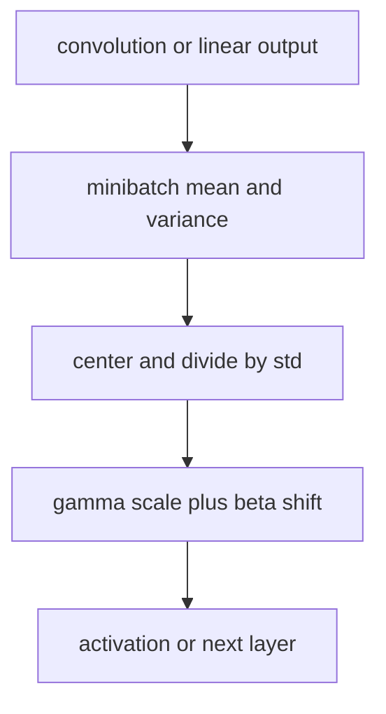
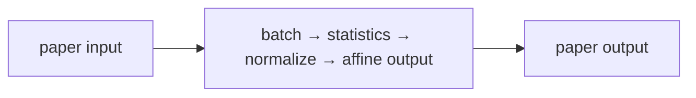

# Batch Normalization: Accelerating Deep Network Training

## 1. TL;DR
Batch Normalization standardizes intermediate activations using statistics from
the current training minibatch, then restores learnable scale and shift. This
usually makes optimization less sensitive to initialization and permits more
aggressive learning rates. At inference it uses accumulated running statistics
rather than the current request batch. That train/eval difference is essential:
BatchNorm is not a stateless activation function.

## 2. Fun Map for First Years
BatchNorm gives a layer numbers on a more predictable scale, like converting many classroom tests to the same grading scale before comparing them.

`📊 batch values → ➗ center and scale → 🎚️ learned adjuster → 🧠 steadier training`

BatchNorm gives each layer inputs with a more predictable scale during training. The layer can still learn the scale it wants afterward.

If one minibatch produces values around 1,000 and the next around 0.01, later layers see a moving target. BatchNorm standardizes each batch before letting the model choose a useful scale again.

💻 **CS analogy:** it is like standardizing measurements before a shared service consumes them, then allowing each caller to choose a scale and offset again.

### Beginner walkthrough

Read the arrows as a sequence of responsibilities. First identify what enters
the system, then ask what the paper changes, what information is preserved or
discarded, and what leaves the operation. For **batch normalization with train-time batch and eval-time running statistics**, the key question
is not “does the model sound clever?” but “which intermediate value carries the
new information, and what would go wrong if it were missing?”

### CS student checkpoint

The map corresponds to a small program: input data enters a function, the
paper-specific state or transformation runs, and an assertion checks **train/eval mode, running-stat updates, and channel axes are explicit**.
The equation `x̂=(x−μB)/√(σ²B+ε)` is the compact specification for that function. Trace
one concrete item through each arrow before thinking about larger batches,
parallel hardware, or production optimizations.

## 3. Math Playground
The essential equation or rule is:

```text
x̂ = (x − μ_B) / √(σ_B² + ε)
y = γx̂ + β
```

**Essential equation:** \(\hat{x}=(x-\mu_B)/\sqrt{\sigma_B^2+\epsilon}\), followed by \(y=\gamma\hat{x}+\beta\). First subtract the batch average \(\mu_B\), so values are centered around zero. Then divide by the spread (standard deviation), so a wide-ranging batch and narrow-ranging batch use a comparable scale. The learned γ and β can scale and shift the result back if that helps the network.

Subtracting μ centers values around zero; dividing by the spread makes batches comparable. γ and β are learned knobs that can rescale and shift the result.

ε is a tiny positive number that prevents division by zero when a batch has almost no variation. The square root turns variance into standard deviation, measured in the same units as x.

## 4. Background: What Came Before
Deep networks were increasingly hard to optimize because a layer kept receiving differently distributed inputs as earlier layers changed. Smaller learning rates and careful initialization helped but slowed experiments. Batch Normalization was needed to make training more stable and permit more aggressive optimization settings.

It addressed unstable deep-network training, where changing earlier layers constantly changed the scale seen by later layers.

This stabilized many training recipes and allowed larger learning rates, while also making batch size and train-versus-inference behavior important implementation details.

## 5. Why It Matters
Deep networks change the distribution arriving at a layer whenever preceding
weights change. The paper called this internal covariate shift and proposed
normalizing inputs to transformations inside the network. The authors reported
that BatchNorm enabled higher learning rates and less careful initialization;
on their image-classification experiment it reached comparable accuracy with
fourteen times fewer training steps. The original explanation motivated a
widely adopted practical layer, although later work debates whether internal
covariate shift is the complete theoretical reason for its success.

BatchNorm became a standard component in convolutional backbones including
ResNet. It also creates an important operational contract: model output depends
on training versus evaluation mode and on the statistics saved in a checkpoint.
Transformer models more often use LayerNorm because sequence and small-batch
conditions differ. Normalization choice is architectural, not a harmless
interchangeable flag.

## 6. Core Intuition
Imagine a downstream layer receiving measurements whose units drift after each
upstream change. It must continually adapt to whether “large” means ten or one
thousand. BatchNorm gives that layer a locally standardized stream, then lets it
learn the useful scale and offset. The learned affine parameters mean the model
can still represent a nonzero mean or nonunit scale when that is useful.


## 7. The Mechanism
For a feature's minibatch values \(x_1,\ldots,x_m\), compute
\(\mu_B=\frac1m\sum_i x_i\) and
\(\sigma_B^2=\frac1m\sum_i(x_i-\mu_B)^2\). BatchNorm produces
\(\hat x_i=(x_i-\mu_B)/\sqrt{\sigma_B^2+\epsilon}\), then
\(y_i=\gamma\hat x_i+\beta\). Gamma and beta are learned per feature or
channel. Epsilon avoids unstable division when a batch has negligible variance.




For convolutional tensors, BatchNorm normally pools statistics across batch and
spatial positions independently for each channel. It does not normalize each
pixel alone. During training, frameworks update running mean and variance as an
estimate for inference. During `eval()` they use those saved values instead of
statistics from the current batch, ensuring a prediction does not depend on
which unrelated requests arrived alongside it. The GIF is illustrative, not a
measurement from the paper.

Batch-derived noise can regularize training, but it is not a substitute for all
regularization. Very small or non-IID batches make statistics noisy and can hurt
accuracy. SyncBatchNorm shares statistics across devices; GroupNorm and
LayerNorm normalize different axes and have different behavior. The original
paper's placement and training recipe should not be confused with every later
pre-activation or fused implementation.

### Mechanism in Code

At implementation level, the mechanism operates on feature batch and running statistics. A faithful
forward pass should follow this order: compute batch moments, normalize, apply γ/β, update running estimates, and switch modes. Keep the intermediate
representation available while debugging; collapsing everything into one
opaque framework call makes shape and numerical errors much harder to isolate.

The key production failure to guard against is using batch statistics in serving or updating running statistics during validation. Add a tiny
reference test with hand-checkable values, then add a property test that
covers padding, empty/short inputs, boundary probabilities, and the largest
supported shape. Compare intermediate tensors with tolerances appropriate to
the dtype, and log the paper-specific statistic during a canary rollout.


## 8. Practical Engineering Notes
### Worked Math & Dataflow

The compact view below makes the paper's central calculation concrete:

```text
x̂=(x−μ_B)/√(σ²_B+ε)
```

In practice, the calculation is a pipeline: Batch statistics put activations on a predictable scale, then learned γ and β restore useful shifts and magnitudes. Training uses batches; evaluation uses running estimates. The important engineering
choice is to preserve the paper's intended invariant while making the operation
fit the available memory, batch size, and evaluation protocol.




Use `torch.nn.BatchNorm1d`, `BatchNorm2d`, or `BatchNorm3d` with explicit
understanding of the input layout. Verify channel dimension and `num_features`;
a tensor that runs with the wrong layout can silently normalize the wrong axis.
Call `model.train()` for training and `model.eval()` for validation/serving, and
checkpoint buffers as well as parameters. Loading weights while discarding
running statistics changes predictions even though gamma and beta match.

Batch size is a systems decision. Per-device batches can shrink as images or
models grow, making local BatchNorm statistics unstable. Distributed training
may need synchronized statistics, frozen pretrained statistics, or a different
normalization family. Test the exact global and per-device topology: gradient
accumulation does not make BatchNorm see one large batch because it executes
separate forward passes. Export paths that fuse convolution and BatchNorm must
only do so after training statistics are finalized.

Monitor running means/variances, activation ranges, train/eval output deltas,
and NaN rates. A data pipeline normalization change can shift every BatchNorm
layer. When fine-tuning on small or shifted datasets, compare updating, freezing,
and recalibrating statistics using a held-out protocol. Do not copy one choice
from another task; the right answer depends on batch size, domain shift, and
whether pretrained features are being adapted.

### Reproducibility and troubleshooting

BatchNorm's running buffers are state, not incidental telemetry. A production
artifact must preserve `running_mean`, `running_var`, the affine parameters, the
epsilon, and the framework's interpretation of momentum. Framework momentum is
commonly a coefficient for updating running statistics, not the optimizer's SGD
momentum; mixing those concepts produces misleading configuration reviews.
Calibrating buffers after a quantization or export transformation should use a
representative, authorized dataset and evaluation mode chosen deliberately.

When comparing experiments, keep batch construction stable. Dropping the final
small batch, shuffling order, dynamic image shapes, and distributed shard size
all affect observed statistics. A model can therefore differ slightly across
hardware even with the same parameter seed. For a regression test, execute a
known batch in both train and eval modes, check buffer updates only in train
mode, and allow numerical tolerances appropriate to the backend.

Avoid “fixing” a train/eval gap by accidentally leaving the model in training
mode at serving time. That makes one user's prediction depend on other requests,
updates state during traffic, and creates difficult-to-reproduce behavior.
Conversely, forgetting train mode while fine-tuning leaves old statistics frozen
and may conceal domain shift. Make mode switching explicit at entry points and
test it in integration tests, not just notebooks.

BatchNorm interacts with augmentations and sampling. If a rare source domain is
clustered in batches, its feature statistics can influence another domain's
examples. Inspect per-domain and per-device activation statistics when fairness
or robustness matters. If cross-example coupling is unacceptable, consider a
normalization method that operates within examples, but measure accuracy,
throughput, and memory rather than assuming an alternative is superior.

For inference optimization, fold a convolution followed by fixed BatchNorm into
new convolution weights and bias only after confirming all tensors and epsilon
conventions. Validate fused output against unfused output on a canary suite.
Fusing before statistics settle, or using a runtime that treats variance
corrections differently, can create a subtle accuracy regression. Keep an
unfused reference path for debugging and compare layerwise activation ranges.

The important engineering lesson is that normalization reaches beyond one
formula. It changes the training dataflow, checkpoint contents, distributed
semantics, and serving behavior. Treat it as a stateful component with tests,
observability, and versioned configuration.

One useful release gate compares representative validation results with the
model's running statistics frozen exactly as they will be served. If an offline
evaluation accidentally uses training mode, it reports a different model and
can make a small-batch deployment failure look like a data problem. Capture
train/eval mode in experiment metadata, and test both single-request and normal
batched inference. These simple checks catch most BatchNorm deployment errors
before users see inconsistent predictions.

The same principle applies to model conversion. Treat a converted or fused
artifact as a new build: preserve the source revision, compare outputs on a
frozen test suite, inspect activation distributions, and retain a rollback
candidate. BatchNorm makes these checks cheap and concrete because its buffers
and affine parameters provide visible state to compare across runtimes.

## 9. Runnable Code Example
### Run from the repository root

Prerequisites: Python 3 and the dependencies imported by [`implementations/22-batch-normalization/code/batch_norm.py`](implementations/22-batch-normalization/code/batch_norm.py).
The example is intentionally small enough to run on CPU; it is a teaching
implementation, not a production training or serving benchmark.

```bash
python3 implementations/22-batch-normalization/code/batch_norm.py
```

### What the example demonstrates

Read the module docstring first, then follow the functions implementing
**batch normalization with train-time batch and eval-time running statistics**. The program turns `x̂=(x−μB)/√(σ²B+ε)` into executable operations,
prints a compact result, and checks that **train/eval mode, running-stat updates, and channel axes are explicit**. The assertion matters:
it tests the semantic contract near the mechanism instead of treating a
plausible final number as proof that the implementation is correct.

### Expected behavior and useful experiments

The command should finish without a traceback and print a successful summary
or assertion message. You should observe the paper-specific behavior, not a
particular random numeric value. Change one input at a time: inspect the
intermediate tensor or state, rerun with a boundary case, and then compare the
result with the expected invariant. A useful first experiment is to **compare batch and running-stat outputs at several batch sizes with an explicit eval-mode test**.

### Production connection

The toy program does not model every distributed or large-scale concern. In a
real service, version the preprocessing and configuration, record the relevant
intermediate statistic, and measure peak memory, throughput, p95/p99 latency,
and task quality. The first production guard should target **small-batch drift or serving accidentally left in training mode**;
preserve a transparent reference path or a canary comparison before replacing
it with a fused, distributed, or highly optimized implementation.

## 10. Common Misconceptions & Pitfalls
- **Misconception: `x̂=(x−μB)/√(σ²B+ε)` is the whole implementation.** The equation describes the paper's central relationship, but `batch normalization with train-time batch and eval-time running statistics` also requires explicit input contracts, ordering, masking or sampling rules, and numerical choices. If those details are left implicit, two implementations can share the same formula and still produce different results. Treat the equation as a contract and document each intermediate tensor or state transition.
- **Misconception: the mechanism is automatically reliable when the final metric looks good.** A model can compensate for a wrong reduction, stale state, or malformed edge/token boundary on common examples. The local guard is **train/eval mode, running-stat updates, and channel axes are explicit**. Check it on a tiny hand-worked fixture and on adversarial inputs before trusting an aggregate benchmark.
- **Pitfall: optimizing the operation before measuring its actual bottleneck.** For this paper, watch for **small-batch drift or serving accidentally left in training mode** rather than assuming the largest theoretical term dominates every workload. Record memory, bandwidth, batch shape, tail latency, and quality slices. An optimization is only safe when it preserves the paper-specific contract and has a rollback path.
- **Pitfall: debugging only the final prediction.** Start with **compare batch and running-stat outputs at several batch sizes with an explicit eval-mode test**; compare intermediate values with a simple reference. Freeze preprocessing, configuration, seeds, and model versions; then bisect the first divergence. This makes a failure reproducible and distinguishes data-contract errors from numerical instability, integration bugs, and a genuinely unsuitable paper mechanism.

## 11. Quick Concept Checks
**Q:** What is the central idea behind **batch normalization with train-time batch and eval-time running statistics**?
**A:** It is a structured data or optimization path, not a slogan: inputs are transformed, paper-specific relationships are computed, invalid choices are excluded when necessary, and the result is aggregated into an output or objective. The important implementation question is which intermediate values must remain observable so a reviewer can connect the code to the paper.

**Q:** How should I read `x̂=(x−μB)/√(σ²B+ε)`?
**A:** Read each symbol as an operation with a shape, a data source, and a numerical range. Ask what changes when its scale, temperature, rank, timestep, neighborhood, or other paper-specific value changes. Then make a two- or three-example fixture where the expected result can be calculated by hand; this catches notation-to-code misunderstandings early.

**Q:** What invariant must a correct implementation preserve?
**A:** It must preserve **train/eval mode, running-stat updates, and channel axes are explicit**. This is stronger than asking whether accuracy improved because it is local, deterministic, and testable near the operation that could be wrong. Assert it at the boundary, compare against a small reference implementation, and include the unusual input shape most likely to violate it in production.

**Q:** What is the most dangerous failure mode?
**A:** The first risk to investigate is **small-batch drift or serving accidentally left in training mode**. It can produce plausible outputs while degrading only a slice of traffic, so monitor a paper-specific statistic alongside quality and system metrics. A canary should compare the old and new paths on identical inputs and should retain enough intermediate diagnostics to explain a regression.

**Q:** How would I test this idea beyond a happy-path unit test?
**A:** Begin with **compare batch and running-stat outputs at several batch sizes with an explicit eval-mode test**, then add differential tests against a transparent reference on small randomized inputs. Cover boundaries such as padding, termination, empty neighborhoods, long sequences, rare tokens, extreme values, or duplicated examples when they apply. Test both output values and gradients or state updates when training behavior is part of the paper's claim.

**Q:** What should I remember when applying the paper in a real system?
**A:** Keep the paper's assumptions in the production contract: version the preprocessing and configuration, expose the relevant intermediate statistic, and define quality slices before tuning performance. Compare throughput, peak memory, p95/p99 latency, and task quality against a baseline. The paper is useful only when its mechanism remains correct under the workload and failure modes you actually operate.

## 12. Interview Q&A
**Q:** Walk through **batch normalization with train-time batch and eval-time running statistics** end to end. How would you implement `x̂=(x−μB)/√(σ²B+ε)`?
**A:** Decompose the expression into the actual data path: inputs enter the paper-specific transformation, intermediate scores or states are computed, invalid elements are excluded, and the result is reduced into the output or loss. For this paper, `x̂=(x−μB)/√(σ²B+ε)` is an executable contract, not decoration: document tensor shapes, ownership of mutable state, numerical precision, and where batching changes semantics. Keep a small reference implementation beside the optimized path so a reviewer can connect each line of `code` to one term in the equation.

**Follow-up:** What invariant would you assert, and why is it stronger than checking final accuracy?
**A:** Assert that **train/eval mode, running-stat updates, and channel axes are explicit**. That property is local enough to fail near the defect, whereas accuracy can remain acceptable while a mask, reduction, or state boundary is wrong on a rare input. Add a hand-computed fixture, a randomized differential test against the reference, and shape/dtype assertions at the API boundary. The test should also cover an empty, padded, terminal, high-degree, long-context, or otherwise adversarial case when that input is meaningful for this mechanism.

**Q:** What is the main production trade-off in this paper, and how would you capacity-plan it?
**A:** The central trade-off is that **the mechanism changes both quality behavior and resource use**. Capacity planning therefore needs more than average FLOPs: measure peak memory, memory bandwidth, communication, preprocessing, batch-size sensitivity, and p95/p99 latency on representative distributions. Define a quality budget before optimizing, then compare a simple baseline with the paper mechanism using identical inputs and seeds. A faster path that silently changes tokenization, routing, masking, sampling, or optimization behavior is not an acceptable optimization until its quality impact is measured.

**Follow-up:** Which failure mode would make you roll back first?
**A:** Roll back on evidence of **small-batch drift or serving accidentally left in training mode**, especially when the symptom is silent and outputs still look plausible. Add dashboards for the paper-specific statistic, error and timeout rates, resource saturation, and a task metric sliced by difficult inputs. Use a canary or shadow comparison with the previous implementation, retain the old path behind a flag, and make the rollback decision threshold explicit before deployment. The important SDE2 judgment is to protect the paper’s semantic contract, not merely to chase a faster benchmark.

**Q:** A model passes unit tests but fails in production. What is your debugging plan?
**A:** Start with **compare batch and running-stat outputs at several batch sizes with an explicit eval-mode test**. Reproduce the smallest production-shaped example, freeze the model and preprocessing versions, and compare intermediate tensors or records rather than only the final prediction. Check data contracts, masks, sequence boundaries, random seeds, numerical precision, and serving mode in that order; then bisect between the reference and optimized implementations. If the defect is not numerical, run a controlled ablation that removes the paper-specific mechanism and compare the resulting failure rate, which separates integration problems from a bad mechanism or configuration.

**Follow-up:** What evidence would you present in the review or postmortem?
**A:** Present one minimal failing input, the expected **train/eval mode, running-stat updates, and channel axes are explicit**, the first intermediate value that diverged, and the regression test that now protects it. Include a before/after table for task quality, memory, throughput, p95/p99 latency, and cost, with slices for the failure population. A complete SDE2 answer also states the rollout guard, owner, and alert threshold. That turns a paper idea into an operable system rather than a one-line claim about an equation.

## 13. Further Reading
- [Original paper](https://arxiv.org/abs/1502.03167)
- [Group Normalization](https://arxiv.org/abs/1803.08494)
- [PyTorch BatchNorm2d documentation](https://pytorch.org/docs/stable/generated/torch.nn.BatchNorm2d.html)
