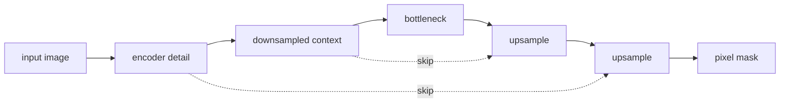
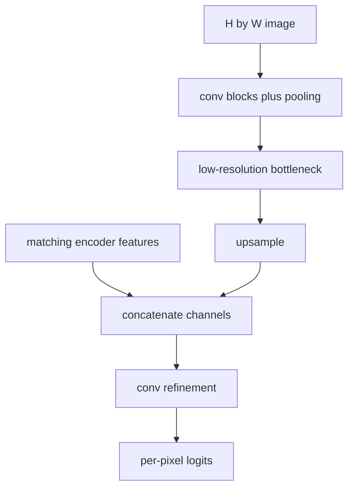
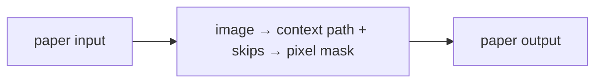
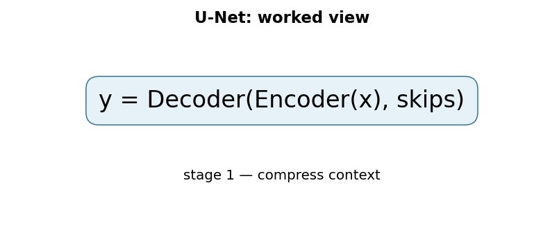

# U-Net: Convolutional Networks for Biomedical Image Segmentation

## TL;DR

U-Net is an encoder-decoder convolutional network for assigning a class to every
pixel, not one class to an entire image. Its contracting path gathers context by
downsampling; its expanding path restores resolution. Skip connections concatenate
high-resolution encoder features with decoder features so localization detail is
not lost. The original paper paired this architecture with strong augmentation
to learn biomedical segmentation from relatively few annotated images.

## Fun Map for First Years 🧭

U-Net first zooms out to understand a whole image, then zooms back in while carrying fine details so it can color every pixel correctly.

`🖼️ image → 🔍 zoom out for context → 🪜 skip details → 🎨 pixel-by-pixel mask`

U-Net shrinks an image to understand broad context, then expands it back to label every pixel. Shortcuts carry fine detail to the expanding side.

For a medical scan, broad context can say “this is likely an organ,” while the shortcut carries sharp boundary detail needed to label each individual pixel. Both kinds of information are required.

💻 **CS analogy:** the encoder is a compressed index, while skip connections are direct links back to the full-resolution source records needed for precise output.

## Math Playground 🧮

The essential equation or rule is:

```text
−Σ_c y_c log p_c
```

**Essential equation:** \(-\sum_c y_c\log p_c\), the per-pixel cross-entropy loss. For one pixel, \(p_c\) is the model’s probability for class c, while \(y_c\) is 1 only for the true class and 0 for the rest. The sum therefore picks out the probability of the correct label and penalizes it when it is small. U-Net applies this simple quiz score to every pixel in an image.

For a pixel, y is 1 for the correct class and 0 otherwise, so the loss focuses on the model’s probability p for the true label.

If the true pixel class has probability 0.9, the loss is low; if it has 0.01, the loss is high. Summing across classes is a compact way to select the one true label.

## Background: What Came Before 🕰️

Classifiers could say what was in an image but discarded spatial detail as they pooled down to one label. Sliding-window methods preserved locality but repeated expensive work. U-Net was needed to combine broad context with exact localization, especially when labeled medical images were scarce.

This was needed because classifiers could recognize an object but often lost the exact location and boundary needed for segmentation.

This made dense prediction feasible with limited labeled data and established an encoder-decoder pattern now common in segmentation tasks.

## Why It Matters

Image classification can compress an image to one label, but segmentation must
retain where each structure is. Sliding-window classifiers made pixel predictions
by repeatedly evaluating local crops, which was redundant and limited global
context. Fully convolutional networks were faster, but aggressive downsampling
could blur boundaries. U-Net joined a context-rich encoder to a localization-rich
decoder through matching-resolution feature skips.

The original work focused on neuronal structures and microscopy cell tracking,
where annotations are scarce and boundary errors matter. The U-shaped
encoder-decoder with skips became a general dense-prediction pattern in medical
imaging, satellite imagery, documents, and generative models. A U-Net name does
not guarantee the original architecture: modern variants change padding,
normalization, residual blocks, attention, dimensionality, loss, and decoder
operations. Evaluate the actual model and labeling protocol.

## Core Intuition

To decide whether a pixel belongs to a cell, a model needs both a close look at
the edge and a wide view of the surrounding structure. Downsampling provides a
wide view but loses exact coordinates. U-Net keeps a copy of detailed features
at each scale and hands that copy to the decoder when it returns to that scale.
It is like making a low-resolution route plan while retaining the street map for
each neighborhood you revisit.



## The Mechanism

The contracting path repeatedly applies convolutions and downsampling, increasing
channels while reducing spatial resolution. The expanding path upsamples,
concatenates the corresponding encoder feature map, and applies convolutions to
combine broad context with fine detail. A final 1×1 convolution maps each pixel
feature vector to class logits. Training uses a per-pixel loss such as cross
entropy; class imbalance often motivates Dice-like losses in later practice.




Concatenation differs from addition: it preserves both feature sets as separate
channels for later convolutions to mix. Shapes must align. In the original
“valid” convolution design, encoder feature maps were cropped before joining
the decoder because borders shrink; many modern implementations use padding to
avoid crops. These are not interchangeable when loading weights or aligning a
mask. Upsampling can use transposed convolution or interpolation followed by a
convolution, with different artifact and compute tradeoffs.

The paper emphasized elastic deformation augmentation, reflecting its small
annotated biomedical datasets. Augmentation must be applied identically to image
and mask geometry: a random rotation on an image without rotating its label is
silent label corruption. Intensity augmentation may apply only to images. The
GIF is illustrative, not a result from the paper.

### Mechanism in Code

At implementation level, the mechanism operates on multi-resolution encoder features and decoder features. A faithful
forward pass should follow this order: downsample for context, upsample, align spatial sizes, concatenate skips, and classify pixels. Keep the intermediate
representation available while debugging; collapsing everything into one
opaque framework call makes shape and numerical errors much harder to isolate.

The key production failure to guard against is misaligning image/mask transforms or cropping the wrong border. Add a tiny
reference test with hand-checkable values, then add a property test that
covers padding, empty/short inputs, boundary probabilities, and the largest
supported shape. Compare intermediate tensors with tolerances appropriate to
the dtype, and log the paper-specific statistic during a canary rollout.


## Practical Engineering Notes

### Worked Math & Dataflow

The compact view below makes the paper's central calculation concrete:

```text
y = Decoder(Encoder(x), skips)
```

In practice, the calculation is a pipeline: Downsampling gathers broad context but loses precise coordinates. Skip connections return matching-resolution features so the decoder can place a boundary rather than only classify a region. The important engineering
choice is to preserve the paper's intended invariant while making the operation
fit the available memory, batch size, and evaluation protocol.






Use a tested implementation such as MONAI's U-Net components or a carefully
reviewed PyTorch model. Define tensor layout, voxel spacing, image orientation,
class IDs, ignore label, and interpolation policy before training. For masks,
nearest-neighbor interpolation preserves discrete class IDs; bilinear resizing
creates invalid fractional labels. In 3D imaging, patch extraction and anisotropic
spacing change receptive fields and must be recorded with the checkpoint.

Train/validation splits must avoid leakage by patient, volume, site, or time,
not merely by adjacent slices. Report Dice/IoU alongside boundary-sensitive and
per-class metrics where they matter; aggregate scores can hide failure on small
structures. Inspect overlay visualizations and empty-mask cases. A high pixel
accuracy can be meaningless when background dominates. Calibrate thresholds if
logits are converted to binary masks in a product.

Memory grows with high-resolution encoder activations retained for skips. Use
patching, mixed precision, checkpointing, and overlap-tile inference deliberately
and benchmark seams at patch boundaries. Keep preprocessing, normalization,
tiling, and postprocessing with weights. A model trained on one scanner or
staining protocol can fail after a routine acquisition change; monitor source
metadata and run domain-shift validation.

### Data, inference, and safety checks

Segmentation labels are measurements with uncertainty, not unquestionable ground
truth. Inter-annotator disagreement is especially important at fuzzy borders,
tiny objects, and partially visible structures. Preserve annotator guidance,
review workflow, and label versions. If multiple masks exist, decide whether the
training target represents consensus, independent raters, or uncertainty. A
network cannot resolve an ambiguous labeling policy merely by optimizing more
epochs.

Choose losses to match the failure cost. Cross entropy treats each pixel as a
classification example; Dice-oriented objectives emphasize overlap and can help
rare foreground classes. They have different behavior on empty masks and tiny
regions, so test those cases explicitly. Do not tune a threshold using the final
test set. For multiclass work, verify whether classes are mutually exclusive or
multi-label, then use softmax or independent sigmoid outputs accordingly.

Inference often needs a preprocessing contract more detailed than classification:
resampling changes physical scale, cropping may remove anatomy, and intensity
normalization can depend on volume rather than patch. Record original-space
coordinates so a predicted mask can be returned in the source image geometry.
When overlap-tile inference is necessary, use enough overlap for the receptive
field and blend logits or probabilities before an explicit final decision. This
reduces seams compared with stitching hard masks.

Review errors at the object level. A merged pair of cells and a shifted boundary
may have similar Dice yet very different scientific or operational impact. For
clinical, industrial, or geographic uses, define acceptance criteria with domain
owners, include out-of-distribution detection or abstention when appropriate,
and never substitute an automatically generated mask for expert confirmation
without a validated workflow. Audit data access and retention because masks can
reveal sensitive attributes even when raw images are restricted.

For maintainability, version the label ontology with the model. Adding or
reordering a class changes the final layer and postprocessing semantics; a mask
value from one revision may mean a different structure in another. Test the
whole pipeline from raw image through export, visualization, and downstream
consumption. A shape-compatible model can still be wrong if its channel order,
spacing, or class mapping drifted.

U-Net remains a strong baseline because its information flow is transparent, but
it is not a universal architecture choice. Compare receptive field, memory,
latency, labeling budget, and target geometry against alternatives. The best
model is the one that produces reliable masks under the acquisition and review
conditions that actually exist.

Measure both accuracy and operating cost on representative full images. A model
that succeeds only with large overlap, long preprocessing, or unavailable GPU
memory may fail a real-time workflow despite a strong benchmark score. Capture
end-to-end latency, peak memory, throughput, and error-recovery behavior. These
constraints frequently decide whether a dense-prediction model is deployable.
They should be evaluated before selecting an architecture solely on validation
overlap, especially when human review depends on timely, correctly registered
outputs.
That evidence makes deployment decisions measurable and accountable.
It also supports careful post-release monitoring.

## Runnable Code Example

### Run from the repository root

Prerequisites: Python 3 and the dependencies imported by [`implementations/23-unet/code/skip_concat.py`](implementations/23-unet/code/skip_concat.py).
The example is intentionally small enough to run on CPU; it is a teaching
implementation, not a production training or serving benchmark.

```bash
python3 implementations/23-unet/code/skip_concat.py
```

### What the example demonstrates

Read the module docstring first, then follow the functions implementing
**encoder-decoder segmentation with skip connections**. The program turns `y=Decoder(Encoder(x), skips)` into executable operations,
prints a compact result, and checks that **skip tensors align spatially and channels before concatenation or addition**. The assertion matters:
it tests the semantic contract near the mechanism instead of treating a
plausible final number as proof that the implementation is correct.

### Expected behavior and useful experiments

The command should finish without a traceback and print a successful summary
or assertion message. You should observe the paper-specific behavior, not a
particular random numeric value. Change one input at a time: inspect the
intermediate tensor or state, rerun with a boundary case, and then compare the
result with the expected invariant. A useful first experiment is to **assert every join shape and evaluate boundary metrics on synthetic masks**.

### Production connection

The toy program does not model every distributed or large-scale concern. In a
real service, version the preprocessing and configuration, record the relevant
intermediate statistic, and measure peak memory, throughput, p95/p99 latency,
and task quality. The first production guard should target **crop/padding misalignment and activation-memory pressure at high resolution**;
preserve a transparent reference path or a canary comparison before replacing
it with a fused, distributed, or highly optimized implementation.

## Common Misconceptions & Pitfalls

- **Misconception: `y=Decoder(Encoder(x), skips)` is the whole implementation.** The equation describes the paper's central relationship, but `encoder-decoder segmentation with skip connections` also requires explicit input contracts, ordering, masking or sampling rules, and numerical choices. If those details are left implicit, two implementations can share the same formula and still produce different results. Treat the equation as a contract and document each intermediate tensor or state transition.
- **Misconception: the mechanism is automatically reliable when the final metric looks good.** A model can compensate for a wrong reduction, stale state, or malformed edge/token boundary on common examples. The local guard is **skip tensors align spatially and channels before concatenation or addition**. Check it on a tiny hand-worked fixture and on adversarial inputs before trusting an aggregate benchmark.
- **Pitfall: optimizing the operation before measuring its actual bottleneck.** For this paper, watch for **crop/padding misalignment and activation-memory pressure at high resolution** rather than assuming the largest theoretical term dominates every workload. Record memory, bandwidth, batch shape, tail latency, and quality slices. An optimization is only safe when it preserves the paper-specific contract and has a rollback path.
- **Pitfall: debugging only the final prediction.** Start with **assert every join shape and evaluate boundary metrics on synthetic masks**; compare intermediate values with a simple reference. Freeze preprocessing, configuration, seeds, and model versions; then bisect the first divergence. This makes a failure reproducible and distinguishes data-contract errors from numerical instability, integration bugs, and a genuinely unsuitable paper mechanism.

## Quick Concept Checks

**Q:** What is the central idea behind **encoder-decoder segmentation with skip connections**?
**A:** It is a structured data or optimization path, not a slogan: inputs are transformed, paper-specific relationships are computed, invalid choices are excluded when necessary, and the result is aggregated into an output or objective. The important implementation question is which intermediate values must remain observable so a reviewer can connect the code to the paper.

**Q:** How should I read `y=Decoder(Encoder(x), skips)`?
**A:** Read each symbol as an operation with a shape, a data source, and a numerical range. Ask what changes when its scale, temperature, rank, timestep, neighborhood, or other paper-specific value changes. Then make a two- or three-example fixture where the expected result can be calculated by hand; this catches notation-to-code misunderstandings early.

**Q:** What invariant must a correct implementation preserve?
**A:** It must preserve **skip tensors align spatially and channels before concatenation or addition**. This is stronger than asking whether accuracy improved because it is local, deterministic, and testable near the operation that could be wrong. Assert it at the boundary, compare against a small reference implementation, and include the unusual input shape most likely to violate it in production.

**Q:** What is the most dangerous failure mode?
**A:** The first risk to investigate is **crop/padding misalignment and activation-memory pressure at high resolution**. It can produce plausible outputs while degrading only a slice of traffic, so monitor a paper-specific statistic alongside quality and system metrics. A canary should compare the old and new paths on identical inputs and should retain enough intermediate diagnostics to explain a regression.

**Q:** How would I test this idea beyond a happy-path unit test?
**A:** Begin with **assert every join shape and evaluate boundary metrics on synthetic masks**, then add differential tests against a transparent reference on small randomized inputs. Cover boundaries such as padding, termination, empty neighborhoods, long sequences, rare tokens, extreme values, or duplicated examples when they apply. Test both output values and gradients or state updates when training behavior is part of the paper's claim.

**Q:** What should I remember when applying the paper in a real system?
**A:** Keep the paper's assumptions in the production contract: version the preprocessing and configuration, expose the relevant intermediate statistic, and define quality slices before tuning performance. Compare throughput, peak memory, p95/p99 latency, and task quality against a baseline. The paper is useful only when its mechanism remains correct under the workload and failure modes you actually operate.

## Interview Q&A

**Q:** Walk through **encoder-decoder segmentation with skip connections** end to end. How would you implement `y=Decoder(Encoder(x), skips)`?
**A:** Decompose the expression into the actual data path: inputs enter the paper-specific transformation, intermediate scores or states are computed, invalid elements are excluded, and the result is reduced into the output or loss. For this paper, `y=Decoder(Encoder(x), skips)` is an executable contract, not decoration: document tensor shapes, ownership of mutable state, numerical precision, and where batching changes semantics. Keep a small reference implementation beside the optimized path so a reviewer can connect each line of `code` to one term in the equation.

**Follow-up:** What invariant would you assert, and why is it stronger than checking final accuracy?
**A:** Assert that **skip tensors align spatially and channels before concatenation or addition**. That property is local enough to fail near the defect, whereas accuracy can remain acceptable while a mask, reduction, or state boundary is wrong on a rare input. Add a hand-computed fixture, a randomized differential test against the reference, and shape/dtype assertions at the API boundary. The test should also cover an empty, padded, terminal, high-degree, long-context, or otherwise adversarial case when that input is meaningful for this mechanism.

**Q:** What is the main production trade-off in this paper, and how would you capacity-plan it?
**A:** The central trade-off is that **the mechanism changes both quality behavior and resource use**. Capacity planning therefore needs more than average FLOPs: measure peak memory, memory bandwidth, communication, preprocessing, batch-size sensitivity, and p95/p99 latency on representative distributions. Define a quality budget before optimizing, then compare a simple baseline with the paper mechanism using identical inputs and seeds. A faster path that silently changes tokenization, routing, masking, sampling, or optimization behavior is not an acceptable optimization until its quality impact is measured.

**Follow-up:** Which failure mode would make you roll back first?
**A:** Roll back on evidence of **crop/padding misalignment and activation-memory pressure at high resolution**, especially when the symptom is silent and outputs still look plausible. Add dashboards for the paper-specific statistic, error and timeout rates, resource saturation, and a task metric sliced by difficult inputs. Use a canary or shadow comparison with the previous implementation, retain the old path behind a flag, and make the rollback decision threshold explicit before deployment. The important SDE2 judgment is to protect the paper’s semantic contract, not merely to chase a faster benchmark.

**Q:** A model passes unit tests but fails in production. What is your debugging plan?
**A:** Start with **assert every join shape and evaluate boundary metrics on synthetic masks**. Reproduce the smallest production-shaped example, freeze the model and preprocessing versions, and compare intermediate tensors or records rather than only the final prediction. Check data contracts, masks, sequence boundaries, random seeds, numerical precision, and serving mode in that order; then bisect between the reference and optimized implementations. If the defect is not numerical, run a controlled ablation that removes the paper-specific mechanism and compare the resulting failure rate, which separates integration problems from a bad mechanism or configuration.

**Follow-up:** What evidence would you present in the review or postmortem?
**A:** Present one minimal failing input, the expected **skip tensors align spatially and channels before concatenation or addition**, the first intermediate value that diverged, and the regression test that now protects it. Include a before/after table for task quality, memory, throughput, p95/p99 latency, and cost, with slices for the failure population. A complete SDE2 answer also states the rollout guard, owner, and alert threshold. That turns a paper idea into an operable system rather than a one-line claim about an equation.

## Further Reading

- [Original paper](https://arxiv.org/abs/1505.04597)
- [MONAI U-Net documentation](https://docs.monai.io/en/stable/networks.html)
- [nnU-Net](https://arxiv.org/abs/1809.10486)
