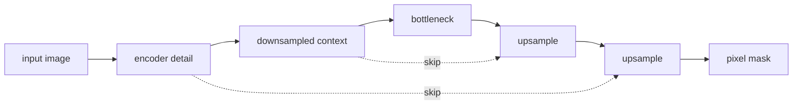
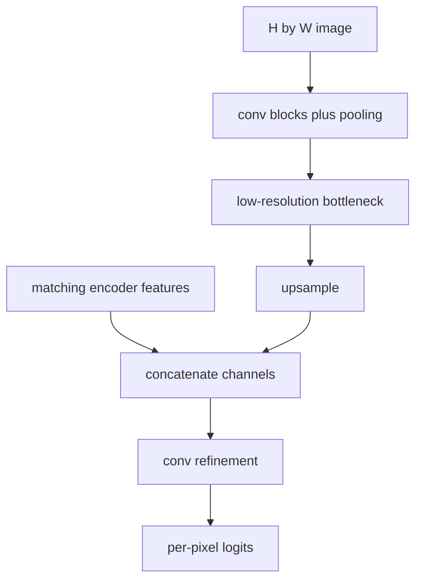
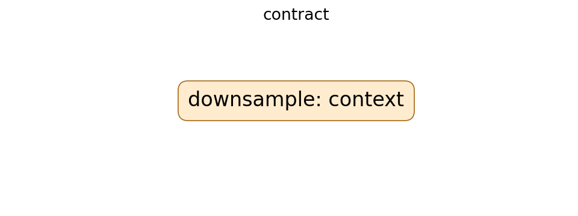

# U-Net: Convolutional Networks for Biomedical Image Segmentation

## TL;DR

U-Net is an encoder-decoder convolutional network for assigning a class to every
pixel, not one class to an entire image. Its contracting path gathers context by
downsampling; its expanding path restores resolution. Skip connections concatenate
high-resolution encoder features with decoder features so localization detail is
not lost. The original paper paired this architecture with strong augmentation
to learn biomedical segmentation from relatively few annotated images.

## Fun Map for First Years 🧭

U-Net first zooms out to understand a whole image, then zooms back in while carrying fine details so it can color every pixel correctly.

`🖼️ image → 🔍 zoom out for context → 🪜 skip details → 🎨 pixel-by-pixel mask`

U-Net shrinks an image to understand broad context, then expands it back to label every pixel. Shortcuts carry fine detail to the expanding side.

💻 **CS analogy:** the encoder is a compressed index, while skip connections are direct links back to the full-resolution source records needed for precise output.

## Math Playground 🧮
## Math Playground 🧮

The essential equation or rule is:

```text
−Σ_c y_c log p_c
```

**Essential equation:** \(-\sum_c y_c\log p_c\), the per-pixel cross-entropy loss. For one pixel, \(p_c\) is the model’s probability for class c, while \(y_c\) is 1 only for the true class and 0 for the rest. The sum therefore picks out the probability of the correct label and penalizes it when it is small. U-Net applies this simple quiz score to every pixel in an image.

For a pixel, y is 1 for the correct class and 0 otherwise, so the loss focuses on the model’s probability p for the true label.

## Background: What Came Before 🕰️

Classifiers could say what was in an image but discarded spatial detail as they pooled down to one label. Sliding-window methods preserved locality but repeated expensive work. U-Net was needed to combine broad context with exact localization, especially when labeled medical images were scarce.

This was needed because classifiers could recognize an object but often lost the exact location and boundary needed for segmentation.

## Why It Matters

Image classification can compress an image to one label, but segmentation must
retain where each structure is. Sliding-window classifiers made pixel predictions
by repeatedly evaluating local crops, which was redundant and limited global
context. Fully convolutional networks were faster, but aggressive downsampling
could blur boundaries. U-Net joined a context-rich encoder to a localization-rich
decoder through matching-resolution feature skips.

The original work focused on neuronal structures and microscopy cell tracking,
where annotations are scarce and boundary errors matter. The U-shaped
encoder-decoder with skips became a general dense-prediction pattern in medical
imaging, satellite imagery, documents, and generative models. A U-Net name does
not guarantee the original architecture: modern variants change padding,
normalization, residual blocks, attention, dimensionality, loss, and decoder
operations. Evaluate the actual model and labeling protocol.

## Core Intuition

To decide whether a pixel belongs to a cell, a model needs both a close look at
the edge and a wide view of the surrounding structure. Downsampling provides a
wide view but loses exact coordinates. U-Net keeps a copy of detailed features
at each scale and hands that copy to the decoder when it returns to that scale.
It is like making a low-resolution route plan while retaining the street map for
each neighborhood you revisit.



## The Mechanism

The contracting path repeatedly applies convolutions and downsampling, increasing
channels while reducing spatial resolution. The expanding path upsamples,
concatenates the corresponding encoder feature map, and applies convolutions to
combine broad context with fine detail. A final 1×1 convolution maps each pixel
feature vector to class logits. Training uses a per-pixel loss such as cross
entropy; class imbalance often motivates Dice-like losses in later practice.





Concatenation differs from addition: it preserves both feature sets as separate
channels for later convolutions to mix. Shapes must align. In the original
“valid” convolution design, encoder feature maps were cropped before joining
the decoder because borders shrink; many modern implementations use padding to
avoid crops. These are not interchangeable when loading weights or aligning a
mask. Upsampling can use transposed convolution or interpolation followed by a
convolution, with different artifact and compute tradeoffs.

The paper emphasized elastic deformation augmentation, reflecting its small
annotated biomedical datasets. Augmentation must be applied identically to image
and mask geometry: a random rotation on an image without rotating its label is
silent label corruption. Intensity augmentation may apply only to images. The
GIF is illustrative, not a result from the paper.

## Practical Engineering Notes

Use a tested implementation such as MONAI's U-Net components or a carefully
reviewed PyTorch model. Define tensor layout, voxel spacing, image orientation,
class IDs, ignore label, and interpolation policy before training. For masks,
nearest-neighbor interpolation preserves discrete class IDs; bilinear resizing
creates invalid fractional labels. In 3D imaging, patch extraction and anisotropic
spacing change receptive fields and must be recorded with the checkpoint.

Train/validation splits must avoid leakage by patient, volume, site, or time,
not merely by adjacent slices. Report Dice/IoU alongside boundary-sensitive and
per-class metrics where they matter; aggregate scores can hide failure on small
structures. Inspect overlay visualizations and empty-mask cases. A high pixel
accuracy can be meaningless when background dominates. Calibrate thresholds if
logits are converted to binary masks in a product.

Memory grows with high-resolution encoder activations retained for skips. Use
patching, mixed precision, checkpointing, and overlap-tile inference deliberately
and benchmark seams at patch boundaries. Keep preprocessing, normalization,
tiling, and postprocessing with weights. A model trained on one scanner or
staining protocol can fail after a routine acquisition change; monitor source
metadata and run domain-shift validation.

### Data, inference, and safety checks

Segmentation labels are measurements with uncertainty, not unquestionable ground
truth. Inter-annotator disagreement is especially important at fuzzy borders,
tiny objects, and partially visible structures. Preserve annotator guidance,
review workflow, and label versions. If multiple masks exist, decide whether the
training target represents consensus, independent raters, or uncertainty. A
network cannot resolve an ambiguous labeling policy merely by optimizing more
epochs.

Choose losses to match the failure cost. Cross entropy treats each pixel as a
classification example; Dice-oriented objectives emphasize overlap and can help
rare foreground classes. They have different behavior on empty masks and tiny
regions, so test those cases explicitly. Do not tune a threshold using the final
test set. For multiclass work, verify whether classes are mutually exclusive or
multi-label, then use softmax or independent sigmoid outputs accordingly.

Inference often needs a preprocessing contract more detailed than classification:
resampling changes physical scale, cropping may remove anatomy, and intensity
normalization can depend on volume rather than patch. Record original-space
coordinates so a predicted mask can be returned in the source image geometry.
When overlap-tile inference is necessary, use enough overlap for the receptive
field and blend logits or probabilities before an explicit final decision. This
reduces seams compared with stitching hard masks.

Review errors at the object level. A merged pair of cells and a shifted boundary
may have similar Dice yet very different scientific or operational impact. For
clinical, industrial, or geographic uses, define acceptance criteria with domain
owners, include out-of-distribution detection or abstention when appropriate,
and never substitute an automatically generated mask for expert confirmation
without a validated workflow. Audit data access and retention because masks can
reveal sensitive attributes even when raw images are restricted.

For maintainability, version the label ontology with the model. Adding or
reordering a class changes the final layer and postprocessing semantics; a mask
value from one revision may mean a different structure in another. Test the
whole pipeline from raw image through export, visualization, and downstream
consumption. A shape-compatible model can still be wrong if its channel order,
spacing, or class mapping drifted.

U-Net remains a strong baseline because its information flow is transparent, but
it is not a universal architecture choice. Compare receptive field, memory,
latency, labeling budget, and target geometry against alternatives. The best
model is the one that produces reliable masks under the acquisition and review
conditions that actually exist.

Measure both accuracy and operating cost on representative full images. A model
that succeeds only with large overlap, long preprocessing, or unavailable GPU
memory may fail a real-time workflow despite a strong benchmark score. Capture
end-to-end latency, peak memory, throughput, and error-recovery behavior. These
constraints frequently decide whether a dense-prediction model is deployable.
They should be evaluated before selecting an architecture solely on validation
overlap, especially when human review depends on timely, correctly registered
outputs.
That evidence makes deployment decisions measurable and accountable.
It also supports careful post-release monitoring.

## Runnable Code Example

### Run it

The implementation is intentionally small and self-checking. From the repository root, use Python 3; the module docstring states the learning goal, comments identify the paper-specific calculation, and assertions verify the toy invariant.

```bash
python3 papers/23-unet/code/skip_concat.py
```

### Read it in order

Start with the module docstring, then follow the named helper calculations and the final assertions. The example is a dependency-light teaching implementation, not a production training system; change one input at a time and rerun it to see which invariant changes.


[`code/skip_concat.py`](code/skip_concat.py) shows two same-resolution feature
maps concatenating along channels, the skip-connection contract a real U-Net
must satisfy.

```bash
python3 papers/23-unet/code/skip_concat.py
```

It does not implement convolutions or segmentation training; it isolates why
matching spatial dimensions are required before a skip merge.

## Common Misconceptions & Pitfalls

**“U-Net outputs one label per image.”** It produces dense per-pixel or per-voxel
logits, usually followed by a mask decision.

**“Skips only improve gradients.”** They also deliver high-resolution features
that are directly useful for localization.

**“Any image augmentation applies to masks.”** Geometry must match exactly and
label interpolation must preserve categorical values.

## Interview Q&A

**Q:** Why does U-Net downsample first?
**A:** Downsampling grows receptive field and captures broader context efficiently.

**Q:** Why add skip connections?
**A:** Decoder stages regain high-resolution encoder detail needed for boundaries.

**Q:** What does a 1×1 output convolution do?
**A:** It maps per-pixel features to the requested number of class logits.

**Q:** Why can pixel accuracy mislead?
**A:** A large background class can dominate it while small important objects fail.

**Q:** What causes tiled-inference seams?
**A:** Inadequate context, inconsistent padding, or naive merging at patch borders.

## Further Reading

- [Original paper](https://arxiv.org/abs/1505.04597)
- [MONAI U-Net documentation](https://docs.monai.io/en/stable/networks.html)
- [nnU-Net](https://arxiv.org/abs/1809.10486)
