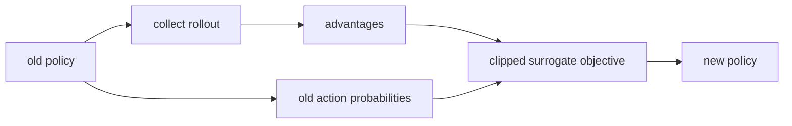
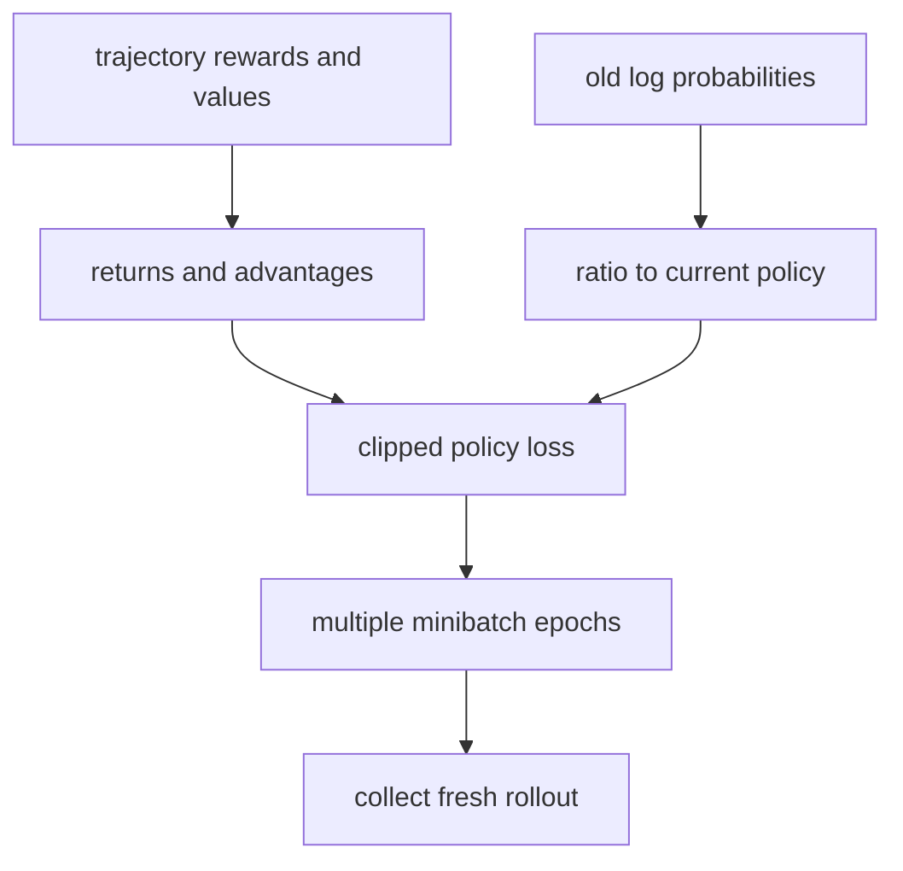
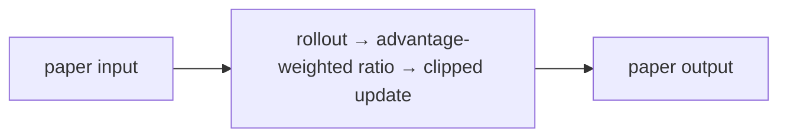
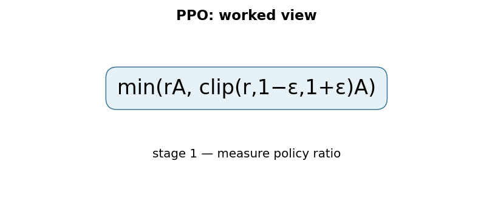

# Proximal Policy Optimization Algorithms (PPO)

## TL;DR

PPO is a policy-gradient algorithm that reuses rollout data for several
minibatch epochs while discouraging an updated policy from moving too far from
the policy that collected that data. Its common clipped surrogate objective
limits the benefit of changing an action probability beyond a small range. PPO
is simpler than trust-region methods and became a common reinforcement-learning
baseline. It does not guarantee safe behavior, monotonic improvement, or sample
efficiency in every environment.

## Fun Map for First Years 🧭

PPO teaches an agent from rewards but stops it from changing its behavior too wildly after one lucky lesson.

`🎮 try action → 🏆 reward signal → 📏 clip giant change → 🤖 safer learning step`

An agent tries actions, receives feedback, then improves its behavior a little. PPO prevents one surprising result from causing an enormous policy change.

An agent that discovers a good jump in a game should become more likely to jump, but not immediately change from 10% to 100% confidence from one lucky trial. PPO makes that update gradual.

💻 **CS analogy:** PPO is a rate limiter around a policy update: a promising change is allowed, but a giant jump is capped before it destabilizes the running system.

## Math Playground 🧮

The essential equation or rule is:

```text
min(r_tA_t, clip(r_t,1−ε,1+ε)A_t)
```

**Essential equation:** \(\min(r_tA_t,\operatorname{clip}(r_t,1-\epsilon,1+\epsilon)A_t)\). rₜ compares the new policy’s probability of an action with the old policy’s probability; Aₜ says whether that action turned out better or worse than expected. Clipping limits rₜ to a small range around 1. It is a safety rail: one training update cannot claim a huge reward by changing its mind too drastically.

r compares a new action probability with its old probability; A says whether the action beat expectation. Clip limits r near 1 as a safety rail.

When r stays between 1−ε and 1+ε, the unclipped improvement is used. Outside that range, clipping removes the incentive for an excessively large probability change.

## Background: What Came Before 🕰️

Policy-gradient methods could learn directly from rewards but often made updates so large that a previously useful policy collapsed. Trust-region methods improved stability but needed more complicated constrained optimization. PPO was needed as a practical approximation that keeps the update guardrail simple enough for broad adoption.

PPO made policy-gradient reinforcement learning more stable and easier to use than earlier methods with delicate update constraints.

This gave practitioners a simple trust-region-like safety mechanism and became a common baseline for control and later preference optimization.

## Why It Matters

A policy maps observations to an action distribution. Standard on-policy policy
gradients collect trajectories, estimate which actions were better than expected,
and adjust probabilities. A single large update can make the new policy unlike
the policy that produced the data, invalidating the local estimate and causing
collapse. One update per sample is also data-inefficient for costly simulation
or human-feedback rollouts.

Trust Region Policy Optimization constrained policy movement with a more complex
optimization procedure. PPO proposed practical surrogate objectives usable with
ordinary minibatch stochastic gradient ascent. The paper alternates environment
sampling with multiple optimization epochs and reported a favorable balance of
simplicity, sample complexity, and wall time on Atari and simulated locomotion.
PPO later became important in RLHF pipelines, but language-model PPO adds reward
models, KL controls, token masks, and distributed systems beyond this paper.

## Core Intuition

Suppose a coach reviews yesterday's plays. If one action looked helpful, it is
reasonable to make it somewhat more likely. It is risky to turn a modest signal
into an absolute rule after one batch: yesterday's evidence was collected under
the old strategy and may not describe the consequences of a radically changed
strategy. PPO lets the coach learn from the tape repeatedly but stops rewarding
an action-probability change once it exceeds a small trust-like neighborhood.



## The Mechanism

For an action sampled from old policy \(\pi_{old}\), define probability ratio
\(r_t(\theta)=\pi_\theta(a_t\mid s_t)/\pi_{old}(a_t\mid s_t)\). With advantage
estimate \(\hat A_t\), PPO's clipped objective is:

```text
L^CLIP(θ) = E_t[min(r_t(θ) Â_t,
                    clip(r_t(θ), 1 − ε, 1 + ε) Â_t)]

r_t(θ) = π_θ(a_t | s_t) / π_old(a_t | s_t)
```

Here, \(\pi_\theta\) is the policy being updated, \(\pi_{old}\) is the policy
that collected the rollout, \(a_t\) is the recorded action, \(s_t\) is its
state, \(\hat A_t\) estimates whether that action was better or worse than
expected, and \(\epsilon\) is the allowed ratio range. The expectation \(E_t\)
means average the term over rollout timesteps or minibatch examples.

For a positive advantage, increasing an action's probability helps until the
ratio reaches \(1+\epsilon\); beyond that, clipping removes extra objective
reward. For negative advantage, decreasing probability is similarly bounded.
The minimum selects the pessimistic of unclipped and clipped terms, discouraging
the update from exploiting the surrogate far from the rollout policy.




Implementations commonly add a value-function regression loss and entropy bonus
to the clipped policy objective. Advantage estimates often use generalized
advantage estimation, which trades bias and variance through gamma and lambda.
Those components are important in practical actor-critic systems but should not
be confused with the core clipping equation. The GIF is illustrative, not a
paper measurement.

PPO is on-policy: rollout actions must retain old log probabilities, values,
termination flags, and observation/action preprocessing. After too many epochs
or an overly large learning rate, the ratio can still drift; clipping is not a
hard global divergence constraint. Monitor approximate KL divergence and clip
fraction. A policy can improve the surrogate while exploiting a misspecified
reward, so reward design and environment evaluation remain central.

### Mechanism in Code

At implementation level, the mechanism operates on rollout actions, old log-probabilities, returns, and advantages. A faithful
forward pass should follow this order: recompute current log-probabilities, form ratios, clip the surrogate, and perform limited epochs. Keep the intermediate
representation available while debugging; collapsing everything into one
opaque framework call makes shape and numerical errors much harder to isolate.

The key production failure to guard against is using stale rollouts or bootstrapping through a true terminal state. Add a tiny
reference test with hand-checkable values, then add a property test that
covers padding, empty/short inputs, boundary probabilities, and the largest
supported shape. Compare intermediate tensors with tolerances appropriate to
the dtype, and log the paper-specific statistic during a canary rollout.


## Practical Engineering Notes

### Worked Math & Dataflow

The compact view below makes the paper's central calculation concrete:

```text
min(rA, clip(r,1−ε,1+ε)A)
```

In practice, the calculation is a pipeline: The ratio compares new and old action probabilities, while the clipped term limits how much one rollout can change the policy. ε is a trust-region-like safety knob, not a guarantee of optimality. The important engineering
choice is to preserve the paper's intended invariant while making the operation
fit the available memory, batch size, and evaluation protocol.






Use a maintained implementation such as Stable-Baselines3 PPO, CleanRL, or
RLlib as a reference before modifying a custom environment. Define reset,
termination versus truncation, action bounds, reward scale, seed handling, and
observation normalization precisely. Bootstrapping a truncated episode as if it
were terminal biases return estimates; treating a true terminal state as a
truncation leaks value beyond the episode. Unit-test these transitions.

Store rollout tensors with their behavior-policy log probabilities. Recomputing
the “old” policy after parameters change silently makes the ratio one and defeats
the objective. Normalize advantages per rollout or minibatch only according to a
documented recipe, since it changes effective update scale. Log policy loss,
value loss, entropy, approximate KL, clip fraction, explained variance, episode
return, episode length, and environment errors. No one scalar establishes that
an RL run is healthy.

Parallel environments improve throughput but affect reproducibility and reward
statistics. Capture environment versions, wrappers, simulator settings, seeds,
and action repeat. Checkpoint actor, critic, optimizer, normalizers, RNG state,
and training counters. Evaluation uses fixed seeds and typically deterministic
or documented stochastic action selection; never compare runs with different
evaluation policies without labeling the difference.

For human-feedback or high-impact policies, reward is a proxy. Optimize against
held-out adversarial scenarios, apply action constraints outside the learned
policy, and maintain rollback and human oversight. A clipped update cannot make
an unsafe reward safe. RL agents may discover loopholes that yield high reward
while violating intended behavior, so inspect trajectories and define failure
metrics before deployment.

### Debugging and evaluation discipline

Start with a tiny environment where a random policy and an optimal policy are
easy to distinguish. Verify action distributions respect bounds, returns reset
at episode boundaries, and a known reward produces an expected advantage sign.
Then overfit a deterministic small problem. If PPO cannot learn that case,
changing network size or adding more workers only hides a dataflow error. Inspect
one trajectory by hand: observation, action, reward, value, return, advantage,
old log probability, ratio, and clipped term should all be explainable.

Hyperparameters interact. Rollout length determines how fresh data is and how
far credit assignment can reach; number of epochs determines reuse; minibatch
size changes optimizer noise; epsilon changes the surrogate's local tolerance.
Learning rate, entropy coefficient, value coefficient, reward scaling, gamma,
and lambda must be logged together. Scaling rewards changes advantage magnitude
and therefore policy updates even if the objective formula is unchanged. Use a
small sweep with fixed evaluation protocol rather than adopting settings from a
different environment blindly.

Separate training exploration from product behavior. Entropy encourages policy
randomness during learning, but an evaluator or deployed system may need a
deterministic argmax or a controlled sampling temperature. Report which action
selection policy produced each score. Test rare resets, invalid actions, delayed
rewards, simulator timeouts, and observation corruption. These operational cases
often dominate real-agent reliability more than average benchmark return.

If the environment has costly, irreversible, or human-facing actions, train in
an isolated simulator and enforce external permission checks at execution time.
Rate limits, action allowlists, budget caps, and manual escalation are system
controls, not rewards. Retain enough trajectory provenance to investigate a bad
outcome without collecting unnecessary sensitive data. A policy checkpoint
should never be deployed merely because its reward chart rose faster.

PPO is valuable because it makes the relationship between rollout data and
updates explicit. That clarity supports rigorous evaluation: compare equal
interaction budgets, confidence intervals over seeds, worst-case episodes, and
wall-clock cost. A single fortunate seed or an average-only plot is too weak to
claim a policy is ready for an environment with meaningful consequences.
Record failures as carefully as successes: they reveal reward loopholes,
environment assumptions, and distribution shifts that summary metrics conceal.
They are essential evidence for responsible model operation.

## Runnable Code Example

### Run it

The implementation is intentionally small and self-checking. From the repository root, use Python 3; the module docstring states the learning goal, comments identify the paper-specific calculation, and assertions verify the toy invariant.

```bash
python3 papers/24-ppo/code/clipped_objective.py
```

### Read it in order

Start with the module docstring, then follow the named helper calculations and the final assertions. The example is a dependency-light teaching implementation, not a production training system; change one input at a time and rerun it to see which invariant changes.


[`code/clipped_objective.py`](code/clipped_objective.py) calculates a positive-
advantage clipped surrogate and asserts that a ratio beyond the upper bound gains
no extra objective value.

```bash
python3 papers/24-ppo/code/clipped_objective.py
```

It demonstrates one scalar term, not an environment, neural policy, or value
function trainer.

## Common Misconceptions & Pitfalls

**“PPO forbids policy changes beyond epsilon.”** It clips objective incentive;
the actual policy can still move because parameters affect many actions.

**“PPO is off-policy because it has multiple epochs.”** Its samples come from a
recent behavior policy and must be refreshed regularly.

**“A higher reward proves correct behavior.”** Reward can be misspecified or
gamed, especially outside the training distribution.

## Quick Concept Checks

**Q:** What is the PPO ratio?
**A:** The current policy's action probability divided by the rollout policy's
probability for the same state-action pair.

**Q:** Why clip the objective?
**A:** To reduce incentive for overly large probability changes on fixed rollout
data while retaining simple first-order optimization.

**Q:** What is an advantage estimate?
**A:** An estimate of how much better an action was than the policy's expected
value at that state.

**Q:** Why retain old log probabilities?
**A:** They are needed to calculate the behavior-to-current policy ratio.

**Q:** Is PPO a safety mechanism?
**A:** No. It stabilizes optimization; safety needs constraints, evaluation, and
operational controls.

## Implementation Walkthrough

PPO collects trajectories with an old policy, estimates advantages, then makes
several clipped updates without allowing probability ratios to move too far.
The clip is not a promise of safe improvement; monitor approximate KL,
clip fraction, entropy, reward, and value error together. Normalize advantages
and keep terminal masks correct, since a mistaken bootstrap target can dominate
the policy signal.

## Interview Q&A

**Q:** Walk through **clipped on-policy policy optimization** end to end. How would you implement `L^CLIP(θ)=E_t[min(r_t(θ)Â_t, clip(r_t(θ),1−ε,1+ε)Â_t)]`?
**A:** Decompose the expression into the actual data path: inputs enter the paper-specific transformation, intermediate scores or states are computed, invalid elements are excluded, and the result is reduced into the output or loss. For this paper, `L^CLIP(θ)=E_t[min(r_t(θ)Â_t, clip(r_t(θ),1−ε,1+ε)Â_t)]` is an executable contract, not decoration: document tensor shapes, ownership of mutable state, numerical precision, and where batching changes semantics. Keep a small reference implementation beside the optimized path so a reviewer can connect each line of `code` to one term in the equation.

**Follow-up:** What invariant would you assert, and why is it stronger than checking final accuracy?
**A:** Assert that **the ratio uses the behavior-policy log-probability, terminated transitions do not bootstrap, and clipping is sign-aware**. That property is local enough to fail near the defect, whereas accuracy can remain acceptable while a mask, reduction, or state boundary is wrong on a rare input. Add a hand-computed fixture, a randomized differential test against the reference, and shape/dtype assertions at the API boundary. The test should also cover an empty, padded, terminal, high-degree, long-context, or otherwise adversarial case when that input is meaningful for this mechanism.

**Q:** What is the main production trade-off in this paper, and how would you capacity-plan it?
**A:** The central trade-off is that **the mechanism changes both quality behavior and resource use**. Capacity planning therefore needs more than average FLOPs: measure peak memory, memory bandwidth, communication, preprocessing, batch-size sensitivity, and p95/p99 latency on representative distributions. Define a quality budget before optimizing, then compare a simple baseline with the paper mechanism using identical inputs and seeds. A faster path that silently changes tokenization, routing, masking, sampling, or optimization behavior is not an acceptable optimization until its quality impact is measured.

**Follow-up:** Which failure mode would make you roll back first?
**A:** Roll back on evidence of **stale rollouts, incorrect advantage normalization, or confusing clip fraction with a hard constraint**, especially when the symptom is silent and outputs still look plausible. Add dashboards for the paper-specific statistic, error and timeout rates, resource saturation, and a task metric sliced by difficult inputs. Use a canary or shadow comparison with the previous implementation, retain the old path behind a flag, and make the rollback decision threshold explicit before deployment. The important SDE2 judgment is to protect the paper’s semantic contract, not merely to chase a faster benchmark.

**Q:** A model passes unit tests but fails in production. What is your debugging plan?
**A:** Start with **monitor approximate KL, clip fraction, entropy, and advantage statistics with a one-step hand check**. Reproduce the smallest production-shaped example, freeze the model and preprocessing versions, and compare intermediate tensors or records rather than only the final prediction. Check data contracts, masks, sequence boundaries, random seeds, numerical precision, and serving mode in that order; then bisect between the reference and optimized implementations. If the defect is not numerical, run a controlled ablation that removes the paper-specific mechanism and compare the resulting failure rate, which separates integration problems from a bad mechanism or configuration.

**Follow-up:** What evidence would you present in the review or postmortem?
**A:** Present one minimal failing input, the expected **the ratio uses the behavior-policy log-probability, terminated transitions do not bootstrap, and clipping is sign-aware**, the first intermediate value that diverged, and the regression test that now protects it. Include a before/after table for task quality, memory, throughput, p95/p99 latency, and cost, with slices for the failure population. A complete SDE2 answer also states the rollout guard, owner, and alert threshold. That turns a paper idea into an operable system rather than a one-line claim about an equation.

## Further Reading

- [Original paper](https://arxiv.org/abs/1707.06347)
- [Generalized Advantage Estimation](https://arxiv.org/abs/1506.02438)
- [Stable-Baselines3 PPO documentation](https://stable-baselines3.readthedocs.io/en/master/modules/ppo.html)
