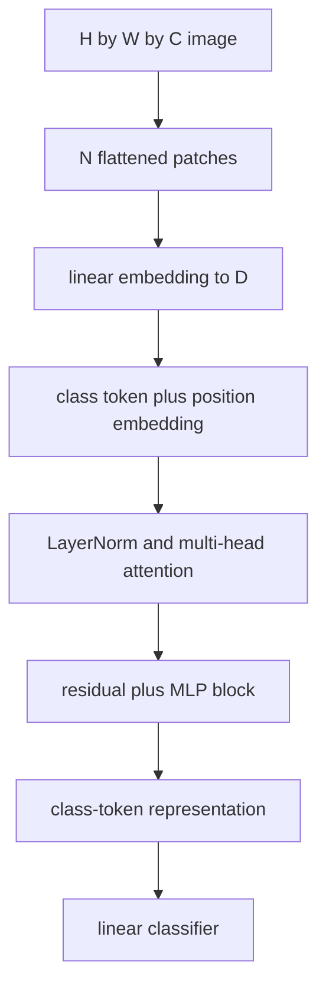

# An Image is Worth 16x16 Words: Transformers for Image Recognition at Scale

## TL;DR

Vision Transformer (ViT) applies a standard Transformer encoder to a sequence
of fixed-size image patches. Each patch is flattened and linearly embedded like
a token, position embeddings preserve layout, and self-attention mixes global
information across patches. The paper showed that, with sufficiently large
pretraining, this simple architecture can compete with or exceed convolutional
networks on image recognition. ViT does not eliminate image preprocessing,
compute tradeoffs, or the need to validate data scale and transfer behavior.

## Fun Map for First Years 🧭

ViT cuts an image into square patches and treats them like word tokens, letting attention connect a patch in one corner to one far away.

`🖼️ image → 🧩 patches → 📍 add positions → 👀 Transformer attention → 🏷️ label`

A Vision Transformer treats an image as a sequence of small square patches. Attention can then compare distant image regions just as it compares distant words.

A 224×224 image split into 16×16 patches produces 196 tokens. A patch containing a wheel can attend directly to a patch containing a car body even when they are far apart.

💻 **CS analogy:** split an image file into fixed-size chunks, turn each chunk into a record, and let an attention-based service decide which records should exchange information.

## Math Playground 🧮

The essential equation or rule is:

```text
N = HW / P²
```

**Essential equation:** \(N=HW/P^2\). An image that is H pixels high and W pixels wide is cut into square patches with side length P; each patch has \(P^2\) pixels, so the image becomes N patch tokens. For a 224×224 image with 16×16 patches, N = 196. Smaller patches preserve more detail but create more tokens for attention to compare.

H and W are image height and width, while P is patch side length. Dividing image area by patch area gives the number of tokens N.

Halving patch side P creates four times as many patches because area grows with P². More tokens preserve finer detail but attention must compare many more pairs.

## Background: What Came Before 🕰️

Convolutional networks dominated vision because locality and translation assumptions made them data-efficient. Transformers had succeeded in language but their all-pairs attention seemed ill-suited to raw image pixels. ViT was needed to test whether a nearly unchanged transformer could become a strong vision model when images were represented as patches and enough data was available.

This tested whether Transformer attention could replace vision-specific convolutional assumptions.

This questioned the assumption that local convolutions were necessary for vision, while showing that enough data and regularization make a general Transformer competitive.

## Why It Matters

Convolutional networks bake in locality and translation equivariance through
small shared filters. That inductive bias makes them data-efficient, but it also
means long-range interactions are built through many layers. The Transformer
already handled long-range token interactions in NLP. ViT asked whether an image
could simply be serialized into patch tokens and handled by an almost unchanged
encoder.

The answer depended on scale. The paper found that plain Transformer vision
models performed very well when pretrained on very large datasets and transferred
to downstream tasks. It established patch tokenization as a standard interface
for vision-language models and modern image backbones. The result is not that
convolutions are obsolete: smaller data regimes, latency, resolution, and
hardware constraints can favor CNNs or hybrid approaches.

## Core Intuition

Treat an image as a page made of equal tiles. Each tile becomes a short
description of local visual content, much as a word embedding summarizes a
word. A Transformer can then compare every tile with every other tile, allowing
a patch containing a wheel to attend directly to patches containing a vehicle
body. Position embeddings tell it that the tiles came from a two-dimensional
grid rather than an unordered bag.


## The Mechanism

For image height \(H\), width \(W\), channels \(C\), and square patch size
\(P\), ViT forms \(N=HW/P^2\) non-overlapping patches. Each flattened patch has
\(P^2C\) values and a learned linear projection maps it to model dimension
\(D\). A learned class token is prepended and learned one-dimensional position
embeddings are added. The resulting sequence passes through repeated Transformer
encoder blocks of LayerNorm, multi-head self-attention, MLP, and residual paths.




Self-attention computes pairwise token interactions, whose straightforward cost
grows quadratically with patch count. Smaller patches preserve detail but make
the sequence longer and attention more expensive. The original paper's title
refers to 16×16 patches in a named model family, not a rule that every vision
application should use that size. The GIF is instructional rather than a figure
or benchmark result from the paper.

ViT's class token serves as an aggregate representation for classification in
the original setup. Other applications can use all patch tokens for dense
prediction, pooling, or cross-modal alignment. Positional embeddings are
essential because self-attention alone is permutation-equivariant; changing the
order of patch tokens without changing positions would otherwise have no spatial
meaning. Interpolating learned positional embeddings to new resolutions is a
common transfer technique, but requires validation and is not an exact equality.

### Mechanism in Code

At implementation level, the mechanism operates on image patches, class token, and position embeddings. A faithful
forward pass should follow this order: flatten patches in a fixed order, project them, add positions, and encode globally. Keep the intermediate
representation available while debugging; collapsing everything into one
opaque framework call makes shape and numerical errors much harder to isolate.

The key production failure to guard against is changing image resolution without a tested positional interpolation policy. Add a tiny
reference test with hand-checkable values, then add a property test that
covers padding, empty/short inputs, boundary probabilities, and the largest
supported shape. Compare intermediate tensors with tolerances appropriate to
the dtype, and log the paper-specific statistic during a canary rollout.


## Practical Engineering Notes

### Worked Math & Dataflow

The compact view below makes the paper's central calculation concrete:

```text
N = HW/P²
```

In practice, the calculation is a pipeline: Patch size trades sequence length against spatial detail: smaller patches preserve more local information but increase attention cost quadratically. A class token gathers the image-level representation. The important engineering
choice is to preserve the paper's intended invariant while making the operation
fit the available memory, batch size, and evaluation protocol.


Use a documented implementation such as `timm`, Hugging Face `ViTModel`, or a
framework's maintained weights. Image resize/crop, normalization constants,
color order, patch size, positional embedding interpolation, class labels, and
head revision are checkpoint contract fields. A model can load successfully and
still be wrong if a 224-pixel pretraining transform is replaced by an arbitrary
resize or if the label order changes.

Budget attention memory before increasing resolution. Doubling both dimensions
roughly quadruples patch count and can make pairwise attention far more costly.
Profile tokens, activation memory, latency, batch size, and throughput on the
target accelerator. Windowed attention, token pooling, and hierarchical designs
are architectural alternatives, not automatic drop-in optimizations. Mixed
precision and activation checkpointing can help training but require numerical
and accuracy checks.

For fine-tuning, compare a frozen feature extractor, head-only adaptation, and
full fine-tuning using the same augmentation and evaluation split. The original
paper's large-pretraining conclusion does not transfer automatically to a small
specialized dataset. Track calibration, class/slice metrics, corruptions, and
out-of-distribution behavior. A class-token score is not a localized explanation
and attention maps should not be presented as proof of causal visual reasoning.

### Dataflow, evaluation, and release

Patch boundaries are a dataflow choice. An object that crosses a boundary must
be represented through token interactions, and fine textures smaller than a
patch can be difficult to preserve. Test target objects at varied location,
scale, crop, and aspect ratio. If a workflow needs arbitrary high resolution,
benchmark tiled inference or a hierarchical model rather than silently resizing
away the signal. Interpolation method, antialiasing, and padding all influence
the effective visual input and must be versioned.

Pretraining and finetuning datasets can differ in license, consent, geography,
and class definitions. Record both sources and evaluate meaningful slices rather
than assuming a large generic corpus resolves domain gaps. Visual classifiers can
learn background, watermark, acquisition-device, or demographic shortcuts. Use
counterfactual or controlled examples where possible and review errors with
domain experts. A high aggregate score should not authorize high-stakes use.

For distributed training, token count affects communication and memory planning
as well as model FLOPs. Dynamic resolution or random resized crops may yield
different token counts only if the input pipeline pads or resizes deliberately.
Log effective resolution, sequence length, global batch size, gradient
accumulation, precision, and attention implementation. Checkpoint optimizer and
scheduler state along with positional embeddings; resuming with a changed image
size can require an intentional interpolation migration.

Serving needs the same rigor. Validate the exported runtime against eager-model
logits and embeddings for a canary image set. Bound input dimensions before
allocating attention tensors to prevent accidental memory exhaustion. Monitor
preprocessing failures, rejected formats, latency by resolution, score margins,
and label distribution drift. If a feature embedding feeds retrieval, version
the vector index with the model and transform; mixing spaces from different ViT
revisions invalidates similarity scores.

Interpretability tools require careful claims. Attention weights show one
internal routing quantity, but they are not automatically a faithful explanation
of a prediction. Evaluate explanations against interventions before using them
in user-facing or review workflows. Preserve a path for abstention, human
review, and rollback when visual predictions are consequential. ViT's simple
patch interface is powerful precisely because it can be integrated broadly, so
its surrounding data controls and operational safeguards deserve equal care.

Finally, compare against a strong convolutional or hybrid baseline under equal
pretraining, augmentation, compute, and evaluation. Architecture conclusions
drawn from unmatched data scale are unreliable. The practical question is not
whether a Transformer is fashionable; it is whether its accuracy, calibration,
cost, and failure profile meet the actual application's requirements.
Documenting that decision and its evidence makes model maintenance substantially
more reliable as data, hardware, and product requirements evolve.
It supports transparent technical review and controlled future updates.

## Runnable Code Example

### Run it

The implementation is intentionally small and self-checking. From the repository root, use Python 3; the module docstring states the learning goal, comments identify the paper-specific calculation, and assertions verify the toy invariant.

```bash
python3 papers/25-vision-transformer/code/patch_tokens.py
```

### Read it in order

Start with the module docstring, then follow the named helper calculations and the final assertions. The example is a dependency-light teaching implementation, not a production training system; change one input at a time and rerun it to see which invariant changes.


[`code/patch_tokens.py`](code/patch_tokens.py) splits a 4×4 toy image into four
non-overlapping 2×2 flattened tokens and asserts their common shape.

```bash
python3 papers/25-vision-transformer/code/patch_tokens.py
```

It shows the input representation only; a real ViT learns patch projections,
positions, attention weights, MLPs, and a task head.

## Common Misconceptions & Pitfalls

**“ViT consumes pixels one at a time.”** Standard ViT begins with fixed patches,
which are the sequence tokens.

**“Patches preserve all fine detail.”** A patch projection compresses local
pixels and patch size sets a resolution-versus-compute tradeoff.

**“Attention makes positional information unnecessary.”** Position embeddings
are required to distinguish layouts with the same unordered patch set.

## Quick Concept Checks

**Q:** How many tokens does a patch ViT create?
**A:** \(HW/P^2\) image patch tokens, plus any special tokens such as the class
token.

**Q:** Why add position embeddings?
**A:** Attention alone has no knowledge of which patch came from which grid
location.

**Q:** What is the main resolution cost?
**A:** Full self-attention compares token pairs, so more patches raise memory and
compute rapidly.

**Q:** Why did large pretraining matter in the paper?
**A:** ViT has less built-in image locality bias than a CNN and benefited strongly
from broad visual supervision.

**Q:** Can ViT be used for segmentation?
**A:** Yes, by using patch-level features with an appropriate dense-prediction
decoder and spatial evaluation pipeline.

## Implementation Walkthrough

ViT turns fixed-size image patches into token embeddings, adds position
information, and processes them with Transformer layers. Patch size controls
the token count and thus attention cost: smaller patches preserve more detail
but make sequence-square attention expensive. Validate image normalization,
patch ordering, class-token handling, and resolution changes before attributing
a result to architecture.

## Interview Q&A

**Q:** Walk through **image patchification followed by transformer token mixing** end to end. How would you implement `N=HW/P²`?
**A:** Decompose the expression into the actual data path: inputs enter the paper-specific transformation, intermediate scores or states are computed, invalid elements are excluded, and the result is reduced into the output or loss. For this paper, `N=HW/P²` is an executable contract, not decoration: document tensor shapes, ownership of mutable state, numerical precision, and where batching changes semantics. Keep a small reference implementation beside the optimized path so a reviewer can connect each line of `code` to one term in the equation.

**Follow-up:** What invariant would you assert, and why is it stronger than checking final accuracy?
**A:** Assert that **patch ordering and positional embeddings preserve the mapping back to image coordinates**. That property is local enough to fail near the defect, whereas accuracy can remain acceptable while a mask, reduction, or state boundary is wrong on a rare input. Add a hand-computed fixture, a randomized differential test against the reference, and shape/dtype assertions at the API boundary. The test should also cover an empty, padded, terminal, high-degree, long-context, or otherwise adversarial case when that input is meaningful for this mechanism.

**Q:** What is the main production trade-off in this paper, and how would you capacity-plan it?
**A:** The central trade-off is that **the mechanism changes both quality behavior and resource use**. Capacity planning therefore needs more than average FLOPs: measure peak memory, memory bandwidth, communication, preprocessing, batch-size sensitivity, and p95/p99 latency on representative distributions. Define a quality budget before optimizing, then compare a simple baseline with the paper mechanism using identical inputs and seeds. A faster path that silently changes tokenization, routing, masking, sampling, or optimization behavior is not an acceptable optimization until its quality impact is measured.

**Follow-up:** Which failure mode would make you roll back first?
**A:** Roll back on evidence of **patch-size information loss, quadratic token cost, or a patchify normalization mismatch**, especially when the symptom is silent and outputs still look plausible. Add dashboards for the paper-specific statistic, error and timeout rates, resource saturation, and a task metric sliced by difficult inputs. Use a canary or shadow comparison with the previous implementation, retain the old path behind a flag, and make the rollback decision threshold explicit before deployment. The important SDE2 judgment is to protect the paper’s semantic contract, not merely to chase a faster benchmark.

**Q:** A model passes unit tests but fails in production. What is your debugging plan?
**A:** Start with **round-trip patchify/unpatchify and compare attention cost and accuracy by patch size**. Reproduce the smallest production-shaped example, freeze the model and preprocessing versions, and compare intermediate tensors or records rather than only the final prediction. Check data contracts, masks, sequence boundaries, random seeds, numerical precision, and serving mode in that order; then bisect between the reference and optimized implementations. If the defect is not numerical, run a controlled ablation that removes the paper-specific mechanism and compare the resulting failure rate, which separates integration problems from a bad mechanism or configuration.

**Follow-up:** What evidence would you present in the review or postmortem?
**A:** Present one minimal failing input, the expected **patch ordering and positional embeddings preserve the mapping back to image coordinates**, the first intermediate value that diverged, and the regression test that now protects it. Include a before/after table for task quality, memory, throughput, p95/p99 latency, and cost, with slices for the failure population. A complete SDE2 answer also states the rollout guard, owner, and alert threshold. That turns a paper idea into an operable system rather than a one-line claim about an equation.

## Further Reading

- [Original paper](https://arxiv.org/abs/2010.11929)
- [Hugging Face ViT documentation](https://huggingface.co/docs/transformers/model_doc/vit)
- [timm Vision Transformer models](https://huggingface.co/docs/timm/en/reference/models)
