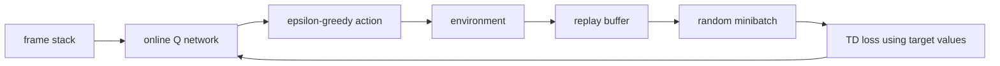
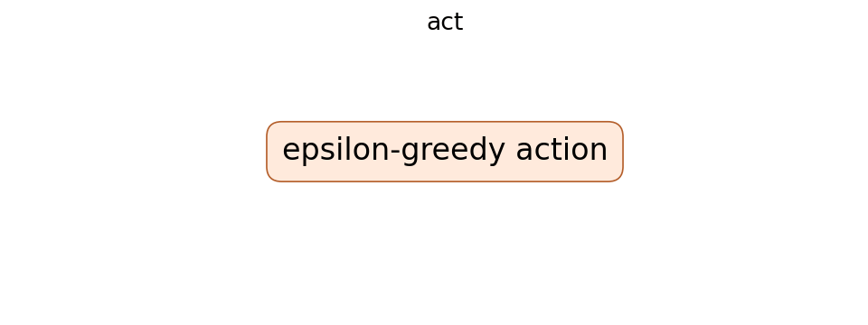
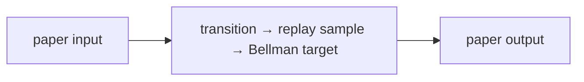
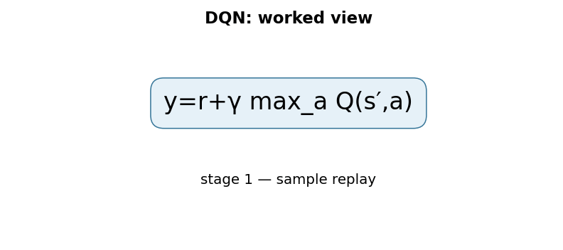

# Playing Atari with Deep Reinforcement Learning (DQN)

## TL;DR

DQN uses a convolutional neural network to estimate one action value for each
discrete action directly from game pixels. It combines Q-learning with a replay
buffer that randomly samples stored transitions and a target network that changes
more slowly than the network being trained. An epsilon-greedy policy collects
experience while the network learns from replayed transitions. This is a
foundational value-based RL design, not a general recipe for safe control.

## Fun Map for First Years 🧭

DQN learns which game move is worth most by remembering past moves and their rewards, like studying shuffled flashcards from old games.

`🎮 state → 🎯 choose action → 🏆 reward → 🗃️ replay memory → 🧠 better values`

DQN learns a score for each possible action. It updates the score using both the reward it got now and an estimate of what happens next.

After moving right in a game, the immediate reward may be zero but the next state may contain a valuable item. The target credits the current action for that promising future.

💻 **CS analogy:** DQN is dynamic programming with a learned cache: store an estimate of each state–action value, then update it from the best estimate of the next state.

## Math Playground 🧮

The essential equation or rule is:

```text
y = r + γ max_a′ Q_target(s′, a′)
```

**Essential equation:** \(y=r+\gamma\max_{a'}Q_{\text{target}}(s',a')\). r is the reward received now. The second term is the best predicted future reward from the next situation s′, reduced by γ because future rewards are less certain or less immediate. Adding them teaches the agent: a move is good not only for today’s score, but also for where it leads.

r is today’s reward; the max term is the best predicted future reward from the next state. γ discounts that future because it is less immediate.

If γ is 0, the agent only cares about immediate reward; if γ is near 1, it values long-term outcomes more. The max says it assumes it will choose the best next action.

## Background: What Came Before 🕰️

Q-learning had strong tabular results, but a table cannot cover every possible video-game screen. Deep neural networks could read pixels yet combining them directly with bootstrapped value targets was unstable. DQN was needed to make one agent learn Atari control from high-dimensional observations using replay memory and a stabilized target.

This extended reinforcement learning from small hand-designed tables to high-dimensional inputs such as game pixels.

This introduced a practical bridge between value-learning theory and deep networks, while target networks and replay buffers addressed instability from changing targets and correlated data.

## Why It Matters

Q-learning can learn values without an environment model, but a table cannot
store a separate value for every possible visual frame. Combining neural
approximation, bootstrapped targets, correlated sequential data, and a moving
behavior policy was historically unstable. DQN showed a convolutional network
could learn Atari control from raw pixels with one architecture and algorithm
across several games.

The paper made replay-based deep value learning concrete: acting, storing,
sampling, and target calculation are separate operations. Later variants added
target networks, Double DQN, prioritized replay, and distributional values; do
not attribute every later stabilization to this workshop paper. PPO is a
different policy-gradient family, not a DQN configuration option.

## Core Intuition

Imagine learning a game from a scrapbook of past moves. Every entry records a
screen, action, immediate reward, and next screen. Rather than reading only the
latest page, DQN studies random pages so nearly identical consecutive frames do
not dominate an update. It learns that a move's value is immediate reward plus
the best future value possible from the next screen. A slowly changing answer
key stops that target from moving with every homework correction.



## The Mechanism

For transition \(s,a,r,s'\), DQN estimates \(Q_\theta(s,a)\). The one-step
target is \(y=r\) at a terminal transition and otherwise
\(y=r+\gamma\max_{a'}Q_{\theta^-}(s',a')\), where \(\theta^-\) is a target
network. A regression loss brings the online selected-action value toward that
target. The target includes another learned prediction, so it is not a fixed
supervised label from the environment.

```mermaid
flowchart TD
 T[transition from replay] --> O[online Q(s,a)]
 T --> N[target Q for next state]
 N --> Y[reward plus gamma max Q]
 O --> D[temporal-difference error]
 Y --> D
 D --> G[gradient update online network]
```



The behavior policy is epsilon-greedy: choose randomly with probability epsilon,
otherwise choose the online network's argmax. Replay randomizes samples and
allows expensive experience to be reused. Target parameters are copied or
soft-updated less often than online parameters. These mechanisms improve
stability but do not prove nonlinear off-policy learning will converge.

The original Atari pipeline used recent frame history to infer motion, grayscale
preprocessing, and action repeats. Those details are benchmark protocol, not
universal perception guidance. The GIF is illustrative, not a score curve.
DQN's maximization assumes a manageable discrete action set; continuous control
needs another method or an explicit discretization tradeoff.

### Mechanism in Code

At implementation level, the mechanism operates on replay transition and online/target Q networks. A faithful
forward pass should follow this order: select action values, build a detached Bellman target, regress online Q, and periodically sync. Keep the intermediate
representation available while debugging; collapsing everything into one
opaque framework call makes shape and numerical errors much harder to isolate.

The key production failure to guard against is allowing gradients through the target network or terminal next-state value. Add a tiny
reference test with hand-checkable values, then add a property test that
covers padding, empty/short inputs, boundary probabilities, and the largest
supported shape. Compare intermediate tensors with tolerances appropriate to
the dtype, and log the paper-specific statistic during a canary rollout.


## Practical Engineering Notes

### Worked Math & Dataflow

The compact view below makes the paper's central calculation concrete:

```text
y=r+γ max_a Q(s′,a)
```

In practice, the calculation is a pipeline: The target estimates immediate reward plus the best discounted future value. Replay breaks temporal correlation and a delayed target network reduces feedback-loop instability. The important engineering
choice is to preserve the paper's intended invariant while making the operation
fit the available memory, batch size, and evaluation protocol.






Use a maintained reference such as Stable-Baselines3 DQN before changing a
custom environment. Define reset, termination versus truncation, action mapping,
frame stacking, reward scaling, seed, and observation preprocessing. A terminal
flag decides whether a target bootstraps; treating a time-limit truncation as a
true terminal can bias values. Unit-test these transitions before interpreting
learning curves.

Replay is a data system. Store every field needed for targets, bound memory
deliberately, and avoid frame mutation through shared storage. For pixels,
compression and frame deduplication trade memory against CPU throughput. Log
buffer fill, sampled transition age, action distribution, terminal fraction,
TD-error distribution, Q scale, target lag, epsilon, and environment steps. A
rising return can hide exploding values or an action-wrapper bug.

Evaluate with frozen exploration policy and multiple seeds. Report interaction
count, wall time, preprocessing, and action-repeat protocol; scores are not
comparable otherwise. Check rare states, invalid actions, reward delays, and
simulator failures. For consequential systems, train in a sandbox and enforce
external constraints, budgets, and human review. Reward maximization does not
establish safety, permission, or robustness under distribution shift.

### Debugging and experiment controls

Start with a deterministic toy environment where the correct value target can
be calculated by hand. Verify terminal transitions do not bootstrap, truncated
transitions follow your selected semantics, and action indices map to intended
simulator actions. Then overfit a fixed replay set: TD loss should decrease and
selected values should approach known targets. If this fails, larger buffers or
deeper networks only hide a basic dataflow error.

Separate environment time from optimization time. A collected transition can be
replayed many times, so comparisons need update ratio, buffer size, warmup,
sampling policy, target-update cadence, batch size, discount, learning rate, and
reward transformation. Reward clipping can improve stability while changing
which behavior the value function prefers. Record the complete configuration.

Q-value overestimation can arise when a maximum selects noisy predictions.
Double DQN, introduced later, selects actions with the online network and
evaluates them with the target network to reduce this bias. It is a useful
extension, but it must be labeled separately from the original mechanism.
Prioritized replay likewise changes the sampling distribution and needs explicit
importance weighting; it is not a neutral optimization.

Build evaluation isolated from training replay and exploration. Lock simulator
seeds where possible, but also report variation across several seeds and
scenarios. Retain fixed trajectory videos or state snapshots for regression
inspection. A visual agent may seem improved because a wrapper changed crop,
frame rate, lives, or action repeat rather than because its policy improved.

Do not treat an argmax action as authorization in a deployed loop. Validate
inputs, bound action frequency and magnitude, apply allowlists for irreversible
operations, and retain an external safe fallback. If the environment changes,
pause behavior until re-evaluation. Replay and target networks stabilize
training; they do not provide monitoring, accountability, or harm prevention.

Finally compare against random and heuristic baselines with identical observation
and action interfaces. Report failure states, worst-case episodes, and resource
use with average return. Responsible evaluation asks what an agent does when
assumptions break, not only its mean score on a familiar benchmark.

Replay capacity is also a policy choice about recency. A very small buffer may
forget useful rare events, while a very large one can contain behavior from
policies that no longer resembles the current agent. There is no universally
correct size: monitor sample age and test environments with nonstationary
dynamics or curricula. If priorities or multiple collectors are introduced,
measure whether rare failures are actually sampled and learned from rather than
assuming additional system complexity helps.

Numerical checks prevent silent target bugs. Assert that `max` is taken over the
action dimension, that reward and done tensors broadcast as intended, and that
gradients do not flow through target values. Clip or inspect gradient norms only
after confirming loss scale and reward units. A finite scalar loss is weak
evidence: log target and online-value quantiles, and alert on persistent drift
or implausibly large magnitudes.

These controls make DQN a reproducible experimental baseline rather than a
black-box score generator. They also give a future maintainer enough evidence to
tell a genuine learning improvement from a changed simulator, preprocessing
path, or evaluation convention.

For every reported result, retain the configuration, checkpoint, environment
revision, and raw evaluation episodes. That audit trail makes comparison and
rollback possible when later changes reveal an unintended reward, simulator, or
measurement assumption.
It supports responsible maintenance and reproducible scientific review.

## Runnable Code Example

### Run it

The implementation is intentionally small and self-checking. From the repository root, use Python 3; the module docstring states the learning goal, comments identify the paper-specific calculation, and assertions verify the toy invariant.

```bash
python3 papers/26-dqn/code/td_target.py
```

### Read it in order

Start with the module docstring, then follow the named helper calculations and the final assertions. The example is a dependency-light teaching implementation, not a production training system; change one input at a time and rerun it to see which invariant changes.


[`code/td_target.py`](code/td_target.py) calculates a scalar nonterminal target
from reward and maximum next-action value.

```bash
python3 papers/26-dqn/code/td_target.py
```

It illustrates the target invariant, not convolutional perception, replay
storage, or a full Q-learning trainer.

## Common Misconceptions & Pitfalls

**“DQN learns from only its latest frame.”** Replay deliberately samples older
transitions to reduce correlation and reuse data.

**“The TD target is ground truth.”** It bootstraps from a learned target network
and can contain approximation error.

**“DQN handles any action space.”** Its max over actions assumes a manageable
discrete set.

## Quick Concept Checks

**Q:** Why use replay?
**A:** It breaks up sequential correlation and lets transitions support several
stochastic updates.

**Q:** Why use a target network?
**A:** It makes bootstrapped regression labels change more slowly.

**Q:** What is epsilon-greedy?
**A:** Randomly act with probability epsilon; otherwise choose the highest-valued
action.

**Q:** What is TD error?
**A:** The difference between current Q prediction and reward-plus-bootstrapped
target.

**Q:** Is DQN on-policy?
**A:** No. Replay contains behavior from past policies while current parameters
are optimized off-policy.

## Implementation Walkthrough

DQN stores transitions in replay memory, samples decorrelated batches, and
uses a slowly updated target network to form more stable temporal-difference
targets. The target must stop gradients through the next-state estimate.
Track replay coverage, epsilon schedule, target-update cadence, and episodic
returns; one unusually high reward is not evidence that value learning is
stable.

## Interview Q&A

**Q:** Walk through **replay-based deep Q-learning with a delayed target network** end to end. How would you implement `y=r+γmax_aQ(s′,a)`?
**A:** Decompose the expression into the actual data path: inputs enter the paper-specific transformation, intermediate scores or states are computed, invalid elements are excluded, and the result is reduced into the output or loss. For this paper, `y=r+γmax_aQ(s′,a)` is an executable contract, not decoration: document tensor shapes, ownership of mutable state, numerical precision, and where batching changes semantics. Keep a small reference implementation beside the optimized path so a reviewer can connect each line of `code` to one term in the equation.

**Follow-up:** What invariant would you assert, and why is it stronger than checking final accuracy?
**A:** Assert that **terminal transitions have no bootstrap term and target-network parameters update only on schedule**. That property is local enough to fail near the defect, whereas accuracy can remain acceptable while a mask, reduction, or state boundary is wrong on a rare input. Add a hand-computed fixture, a randomized differential test against the reference, and shape/dtype assertions at the API boundary. The test should also cover an empty, padded, terminal, high-degree, long-context, or otherwise adversarial case when that input is meaningful for this mechanism.

**Q:** What is the main production trade-off in this paper, and how would you capacity-plan it?
**A:** The central trade-off is that **the mechanism changes both quality behavior and resource use**. Capacity planning therefore needs more than average FLOPs: measure peak memory, memory bandwidth, communication, preprocessing, batch-size sensitivity, and p95/p99 latency on representative distributions. Define a quality budget before optimizing, then compare a simple baseline with the paper mechanism using identical inputs and seeds. A faster path that silently changes tokenization, routing, masking, sampling, or optimization behavior is not an acceptable optimization until its quality impact is measured.

**Follow-up:** Which failure mode would make you roll back first?
**A:** Roll back on evidence of **overestimation, replay correlation, or online/target networks drifting unexpectedly**, especially when the symptom is silent and outputs still look plausible. Add dashboards for the paper-specific statistic, error and timeout rates, resource saturation, and a task metric sliced by difficult inputs. Use a canary or shadow comparison with the previous implementation, retain the old path behind a flag, and make the rollback decision threshold explicit before deployment. The important SDE2 judgment is to protect the paper’s semantic contract, not merely to chase a faster benchmark.

**Q:** A model passes unit tests but fails in production. What is your debugging plan?
**A:** Start with **unit-test terminal targets and compare online/target drift under a fixed replay fixture**. Reproduce the smallest production-shaped example, freeze the model and preprocessing versions, and compare intermediate tensors or records rather than only the final prediction. Check data contracts, masks, sequence boundaries, random seeds, numerical precision, and serving mode in that order; then bisect between the reference and optimized implementations. If the defect is not numerical, run a controlled ablation that removes the paper-specific mechanism and compare the resulting failure rate, which separates integration problems from a bad mechanism or configuration.

**Follow-up:** What evidence would you present in the review or postmortem?
**A:** Present one minimal failing input, the expected **terminal transitions have no bootstrap term and target-network parameters update only on schedule**, the first intermediate value that diverged, and the regression test that now protects it. Include a before/after table for task quality, memory, throughput, p95/p99 latency, and cost, with slices for the failure population. A complete SDE2 answer also states the rollout guard, owner, and alert threshold. That turns a paper idea into an operable system rather than a one-line claim about an equation.

## Further Reading

- [Original paper](https://arxiv.org/abs/1312.5602)
- [Human-level control through deep reinforcement learning](https://www.nature.com/articles/nature14236)
- [Stable-Baselines3 DQN documentation](https://stable-baselines3.readthedocs.io/en/master/modules/dqn.html)
