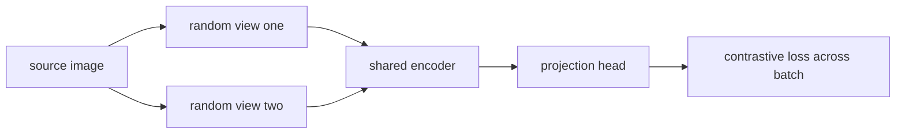
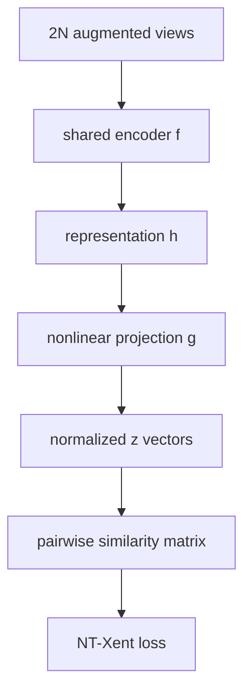
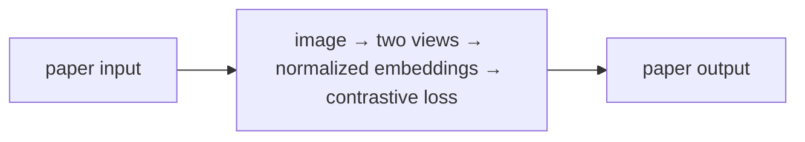
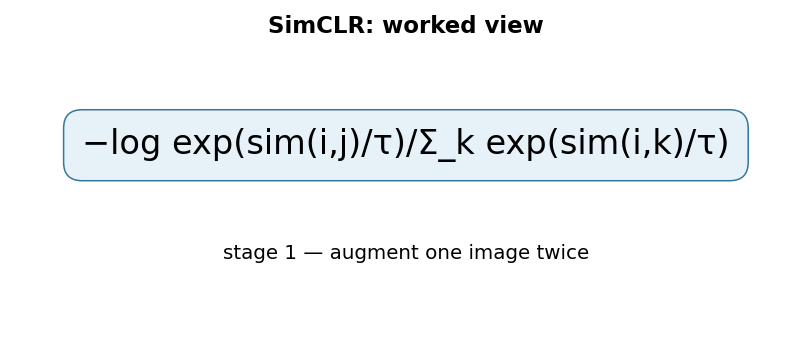

# A Simple Framework for Contrastive Learning of Visual Representations (SimCLR)

## TL;DR

SimCLR learns visual features without class labels by treating two random
augmentations of one image as a positive pair and views from other images as
negatives. A shared encoder produces representations and a small projection head
produces contrastive-space vectors. The contrastive loss raises similarity of
matching views while lowering similarity to other batch examples. The paper
showed that augmentation composition, a nonlinear projection head, and large
batches are central to strong self-supervised visual learning.

## Fun Map for First Years 🧭

SimCLR shows a model two altered versions of the same picture and says “these still belong together,” while other pictures should stay apart.

`🖼️ one image → ✂️ two random views → 🧠 shared encoder → 🤝 pull together / ↔️ push apart`

SimCLR makes two altered views of the same picture agree, while making views from different pictures less similar. It learns image features without human labels.

Take one photo, crop it twice, and adjust colors differently. The two views should still describe the same object, while views from other photos should remain distinguishable.

💻 **CS analogy:** treat two transformed copies as duplicate records that must hash nearby, while every other record in the batch is a temporary negative test case.

## Math Playground 🧮

The essential equation or rule is:

```text
−log(exp(sim(i,j)/τ) / Σ_(k≠i) exp(sim(i,k)/τ))
```

**Essential equation:** \(-\log\frac{\exp(\mathrm{sim}(i,j)/\tau)}{\sum_{k\ne i}\exp(\mathrm{sim}(i,k)/\tau)}\). i and j are two altered views of the same image. The top says “how similar is the true partner?”; the bottom compares it with every other image in the batch. Training wants the true pair to win this retrieval contest. Temperature τ controls how strongly the contest favors the highest score.

The top is the true pair’s similarity and the bottom includes all competing images in the batch. Training makes the true pair win this retrieval contest.

Cosine similarity compares vector direction rather than length. A smaller temperature τ makes the softmax contest sharper, so the model is punished more for confusing close competitors.

## Background: What Came Before 🕰️

Image representations usually relied on manual labels, while earlier self-supervised approaches used hand-designed pretext tasks whose benefit did not always transfer. Contrastive ideas existed but their training recipes were complicated. SimCLR was needed to show that strong augmentations, a projection head, and a simple contrastive objective could learn highly useful visual features without labels.

This was needed because labeled images are costly, while simple image augmentations can create learning signals for free.

This showed that strong image representations can emerge from instance discrimination, provided augmentations are chosen carefully enough to preserve identity.

## Why It Matters

Supervised vision representation learning requires labels that can be expensive,
narrow, or unavailable. Earlier self-supervised methods designed proxy tasks
such as predicting rotation or image patch location, which can teach shortcuts
unrelated to downstream semantic categories. Contrastive learning creates its
own training signal from multiple views of an image: preserve what should remain
the same under chosen transformations and distinguish other images.

SimCLR simplified contrastive visual learning by avoiding a memory bank and
specialized architecture. Its systematic ablations made an important point:
augmentations define the task, so they are not merely regularization. The paper
reported that a learned nonlinear projection between representation and loss,
larger batch size, and more training steps materially improved linear evaluation.
CLIP also uses contrastive learning, but its positives are image-text pairs;
SimCLR's positives are two views of the same image.

## Core Intuition

If two photographers crop and recolor the same bicycle photo, an embedding for
downstream recognition should still identify them as related. If one photo is a
bicycle and another is a volcano, their embeddings should separate. SimCLR asks
the model to solve exactly this matching game repeatedly. The crucial judgment is
which edits preserve identity: a crop can encourage object-level features, while
an augmentation that erases a medically relevant detail would teach the wrong
invariance.



## The Mechanism

For each of \(N\) source images, sample two transformed views, yielding \(2N\)
examples. An encoder \(f\) produces representation \(h\), and projection head
\(g\) produces normalized vector \(z\). For an anchor \(i\) and its matching
view \(j\), the NT-Xent objective compares their cosine similarity against all
other views in the batch:

\[
\ell_{i,j}=-\log \frac{\exp(\mathrm{sim}(z_i,z_j)/\tau)}
{\sum_{k\ne i}\exp(\mathrm{sim}(z_i,z_k)/\tau)}.
\]

The temperature \(\tau\) controls logit sharpness. The positive is excluded
from its own denominator but included as the desired numerator; all nonmatching
views serve as negatives. Training averages both directional losses for each
positive pair. After pretraining, SimCLR evaluates the encoder representation,
not necessarily the projection output, with a linear classifier.




The GIF is illustrative, not a paper result. It represents the encoder as shared
between views; there is no separate teacher in SimCLR. Negatives are batch
examples rather than a memory queue in the basic formulation. Small batches can
provide too few negatives, while a large batch has communication and memory
cost. Later methods such as BYOL and SimSiam changed the negative-pair design;
they are not implementation settings of the original objective.

### Mechanism in Code

At implementation level, the mechanism operates on two augmented views per image and normalized projections. A faithful
forward pass should follow this order: form positive indices, compare every view with batch negatives, and average both directions. Keep the intermediate
representation available while debugging; collapsing everything into one
opaque framework call makes shape and numerical errors much harder to isolate.

The key production failure to guard against is including the anchor itself or treating two views of different samples as positive. Add a tiny
reference test with hand-checkable values, then add a property test that
covers padding, empty/short inputs, boundary probabilities, and the largest
supported shape. Compare intermediate tensors with tolerances appropriate to
the dtype, and log the paper-specific statistic during a canary rollout.


## Practical Engineering Notes

### Worked Math & Dataflow

The compact view below makes the paper's central calculation concrete:

```text
−log exp(sim(i,j)/τ)/Σ_k exp(sim(i,k)/τ)
```

In practice, the calculation is a pipeline: Two augmentations of one image form a positive pair, while other images in the batch provide negatives. Temperature τ controls how sharply the loss focuses on the hardest similarities. The important engineering
choice is to preserve the paper's intended invariant while making the operation
fit the available memory, batch size, and evaluation protocol.






Use a controlled augmentation pipeline and record every operation, probability,
crop scale, color transform, blur, resolution, and random seed policy. Apply the
same family of transforms to both views but sample them independently. Audit
whether augmentations preserve the downstream label for each important slice.
For satellite, medical, document, or manufacturing images, standard ImageNet
color jitter can be invalid. Treat transformation review as dataset governance.

The encoder, projection head, and optimizer all need checkpointing. Linear
evaluation uses frozen encoder features and a separately trained classifier, so
do not accidentally evaluate the projection head or fine-tune the encoder when
claiming a linear probe. Log contrastive loss, positive similarity, negative
similarity, representation norms, batch size, global batch size, temperature,
and downstream probe scores. A low loss can arise from a shortcut that does not
transfer to the intended task.

Large batches may require distributed all-gather so each worker's negatives are
visible globally. Ensure gradients and normalization semantics match the chosen
implementation, profile communication, and test one-device versus multi-device
results. Mixed precision can affect normalized-dot-product accuracy; keep
normalization and reduction choices documented. Cache or precompute only data
that does not accidentally make two views identical.

### Evaluation and operational safeguards

Pretraining labels are not needed, but downstream evaluation labels still matter.
Use a held-out linear probe set that is separate from augmentation and
hyperparameter selection. Compare representations against supervised, random,
and simpler self-supervised baselines under the same encoder capacity and input
resolution. Probe performance by class, source domain, acquisition device, and
image quality. A representation can look good on average while failing precisely
where the target product needs invariance or discrimination.

Augmentation choices can encode harmful assumptions. Random crops may remove a
small clinically important finding; aggressive color jitter can erase stain or
manufacturing signals; horizontal flips can invalidate text or asymmetric
anatomy. Build an augmentation review with domain owners and save visual samples
of paired views for each release. If a transform changes the intended label,
that pair is a false positive training signal rather than useful diversity.

Representation collapse checks are useful even though contrastive negatives make
full collapse less likely in the basic objective. Monitor per-dimension variance,
embedding norm, positive/negative score separation, and nearest-neighbor
examples. Inspect whether nearest images share the expected semantic property or
a shortcut such as background color, watermark, crop style, or camera type.
These diagnostics give more actionable information than the objective alone.

For retrieval systems, version encoder weights, transform pipeline, projection
choice, normalization, and vector-index revision together. A downstream index
should normally use the representation chosen by evaluation, not automatically
the contrastive projection head. When changing any component, rebuild or isolate
the index; mixed embedding spaces make similarity scores meaningless. Apply
authorization filters before returning neighbor records, because representation
proximity is not permission to reveal an image.

At serving time, bound image size and format before decoding, batch requests
within latency limits, and log failure reasons without retaining unnecessary
image data. Establish a rejection or human-review path for applications where a
retrieval or classifier decision has real consequence. SimCLR learns useful
invariances from data; it does not validate truth, identity, safety, or fairness
for a particular deployment. Those properties need explicit datasets, tests,
and operational controls.

Finally, preserve experiment lineage. Record data filters, licensing, consent,
source distribution, encoder revision, optimizer, batch topology, augmentation
configuration, and evaluation protocol. This makes a later representation change
auditable and lets maintainers distinguish a genuine learning improvement from a
new sample mix or changed probe. It is especially important when a pretrained
encoder becomes shared infrastructure for several downstream teams.

When a representation is reused across products, define ownership for model
updates, quality regressions, and data removal requests. A feature-space change
can affect ranking, classification, and anomaly detection simultaneously. A
staged rollout with canary comparisons, index rollback, and downstream owner
sign-off limits this blast radius. These operational practices convert a useful
research representation into dependable shared infrastructure.
It also preserves clear accountability for model behavior.
It supports measured, safe iteration across dependent products.

## Runnable Code Example

### Run it

The implementation is intentionally small and self-checking. From the repository root, use Python 3; the module docstring states the learning goal, comments identify the paper-specific calculation, and assertions verify the toy invariant.

```bash
python3 papers/27-simclr/code/contrastive_pair.py
```

### Read it in order

Start with the module docstring, then follow the named helper calculations and the final assertions. The example is a dependency-light teaching implementation, not a production training system; change one input at a time and rerun it to see which invariant changes.


[`code/contrastive_pair.py`](code/contrastive_pair.py) checks that a hand-built
positive view embedding scores above two negative image embeddings.

```bash
python3 papers/27-simclr/code/contrastive_pair.py
```

It demonstrates ranking only; it does not implement augmentation or gradient
training.

## Common Misconceptions & Pitfalls

- **Misconception: `−log exp(sim(i,j)/τ)/Σ_kexp(sim(i,k)/τ)` is the whole implementation.** The equation describes the paper's central relationship, but `contrastive visual representation learning with augmented positive pairs` also requires explicit input contracts, ordering, masking or sampling rules, and numerical choices. If those details are left implicit, two implementations can share the same formula and still produce different results. Treat the equation as a contract and document each intermediate tensor or state transition.
- **Misconception: the mechanism is automatically reliable when the final metric looks good.** A model can compensate for a wrong reduction, stale state, or malformed edge/token boundary on common examples. The local guard is **positive indices are correct, self-similarity is excluded, and temperature has the intended scale**. Check it on a tiny hand-worked fixture and on adversarial inputs before trusting an aggregate benchmark.
- **Pitfall: optimizing the operation before measuring its actual bottleneck.** For this paper, watch for **augmentation leakage, false negatives, or a batch too small to supply useful negatives** rather than assuming the largest theoretical term dominates every workload. Record memory, bandwidth, batch shape, tail latency, and quality slices. An optimization is only safe when it preserves the paper-specific contract and has a rollback path.
- **Pitfall: debugging only the final prediction.** Start with **assert pair indexing and inspect retrieval before linear evaluation across augmentation ablations**; compare intermediate values with a simple reference. Freeze preprocessing, configuration, seeds, and model versions; then bisect the first divergence. This makes a failure reproducible and distinguishes data-contract errors from numerical instability, integration bugs, and a genuinely unsuitable paper mechanism.

## Quick Concept Checks

**Q:** What is the central idea behind **contrastive visual representation learning with augmented positive pairs**?
**A:** It is a structured data or optimization path, not a slogan: inputs are transformed, paper-specific relationships are computed, invalid choices are excluded when necessary, and the result is aggregated into an output or objective. The important implementation question is which intermediate values must remain observable so a reviewer can connect the code to the paper.

**Q:** How should I read `−log exp(sim(i,j)/τ)/Σ_kexp(sim(i,k)/τ)`?
**A:** Read each symbol as an operation with a shape, a data source, and a numerical range. Ask what changes when its scale, temperature, rank, timestep, neighborhood, or other paper-specific value changes. Then make a two- or three-example fixture where the expected result can be calculated by hand; this catches notation-to-code misunderstandings early.

**Q:** What invariant must a correct implementation preserve?
**A:** It must preserve **positive indices are correct, self-similarity is excluded, and temperature has the intended scale**. This is stronger than asking whether accuracy improved because it is local, deterministic, and testable near the operation that could be wrong. Assert it at the boundary, compare against a small reference implementation, and include the unusual input shape most likely to violate it in production.

**Q:** What is the most dangerous failure mode?
**A:** The first risk to investigate is **augmentation leakage, false negatives, or a batch too small to supply useful negatives**. It can produce plausible outputs while degrading only a slice of traffic, so monitor a paper-specific statistic alongside quality and system metrics. A canary should compare the old and new paths on identical inputs and should retain enough intermediate diagnostics to explain a regression.

**Q:** How would I test this idea beyond a happy-path unit test?
**A:** Begin with **assert pair indexing and inspect retrieval before linear evaluation across augmentation ablations**, then add differential tests against a transparent reference on small randomized inputs. Cover boundaries such as padding, termination, empty neighborhoods, long sequences, rare tokens, extreme values, or duplicated examples when they apply. Test both output values and gradients or state updates when training behavior is part of the paper's claim.

**Q:** What should I remember when applying the paper in a real system?
**A:** Keep the paper's assumptions in the production contract: version the preprocessing and configuration, expose the relevant intermediate statistic, and define quality slices before tuning performance. Compare throughput, peak memory, p95/p99 latency, and task quality against a baseline. The paper is useful only when its mechanism remains correct under the workload and failure modes you actually operate.

## Interview Q&A

**Q:** Walk through **contrastive visual representation learning with augmented positive pairs** end to end. How would you implement `−log exp(sim(i,j)/τ)/Σ_kexp(sim(i,k)/τ)`?
**A:** Decompose the expression into the actual data path: inputs enter the paper-specific transformation, intermediate scores or states are computed, invalid elements are excluded, and the result is reduced into the output or loss. For this paper, `−log exp(sim(i,j)/τ)/Σ_kexp(sim(i,k)/τ)` is an executable contract, not decoration: document tensor shapes, ownership of mutable state, numerical precision, and where batching changes semantics. Keep a small reference implementation beside the optimized path so a reviewer can connect each line of `code` to one term in the equation.

**Follow-up:** What invariant would you assert, and why is it stronger than checking final accuracy?
**A:** Assert that **positive indices are correct, self-similarity is excluded, and temperature has the intended scale**. That property is local enough to fail near the defect, whereas accuracy can remain acceptable while a mask, reduction, or state boundary is wrong on a rare input. Add a hand-computed fixture, a randomized differential test against the reference, and shape/dtype assertions at the API boundary. The test should also cover an empty, padded, terminal, high-degree, long-context, or otherwise adversarial case when that input is meaningful for this mechanism.

**Q:** What is the main production trade-off in this paper, and how would you capacity-plan it?
**A:** The central trade-off is that **the mechanism changes both quality behavior and resource use**. Capacity planning therefore needs more than average FLOPs: measure peak memory, memory bandwidth, communication, preprocessing, batch-size sensitivity, and p95/p99 latency on representative distributions. Define a quality budget before optimizing, then compare a simple baseline with the paper mechanism using identical inputs and seeds. A faster path that silently changes tokenization, routing, masking, sampling, or optimization behavior is not an acceptable optimization until its quality impact is measured.

**Follow-up:** Which failure mode would make you roll back first?
**A:** Roll back on evidence of **augmentation leakage, false negatives, or a batch too small to supply useful negatives**, especially when the symptom is silent and outputs still look plausible. Add dashboards for the paper-specific statistic, error and timeout rates, resource saturation, and a task metric sliced by difficult inputs. Use a canary or shadow comparison with the previous implementation, retain the old path behind a flag, and make the rollback decision threshold explicit before deployment. The important SDE2 judgment is to protect the paper’s semantic contract, not merely to chase a faster benchmark.

**Q:** A model passes unit tests but fails in production. What is your debugging plan?
**A:** Start with **assert pair indexing and inspect retrieval before linear evaluation across augmentation ablations**. Reproduce the smallest production-shaped example, freeze the model and preprocessing versions, and compare intermediate tensors or records rather than only the final prediction. Check data contracts, masks, sequence boundaries, random seeds, numerical precision, and serving mode in that order; then bisect between the reference and optimized implementations. If the defect is not numerical, run a controlled ablation that removes the paper-specific mechanism and compare the resulting failure rate, which separates integration problems from a bad mechanism or configuration.

**Follow-up:** What evidence would you present in the review or postmortem?
**A:** Present one minimal failing input, the expected **positive indices are correct, self-similarity is excluded, and temperature has the intended scale**, the first intermediate value that diverged, and the regression test that now protects it. Include a before/after table for task quality, memory, throughput, p95/p99 latency, and cost, with slices for the failure population. A complete SDE2 answer also states the rollout guard, owner, and alert threshold. That turns a paper idea into an operable system rather than a one-line claim about an equation.

## Further Reading

- [Original paper](https://arxiv.org/abs/2002.05709)
- [SimCLR code](https://github.com/google-research/simclr)
- [PyTorch distributed documentation](https://pytorch.org/docs/stable/distributed.html)
