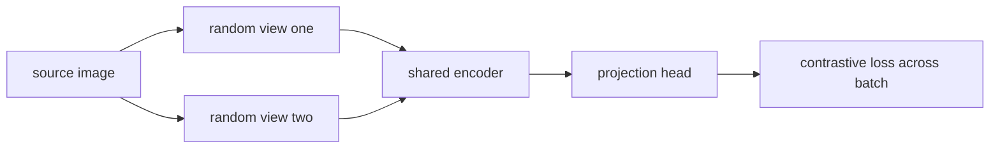
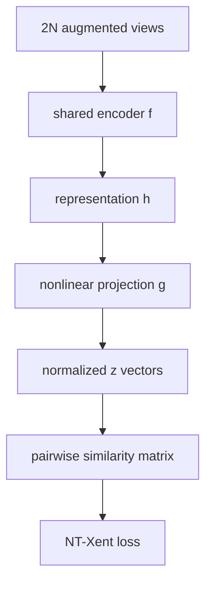
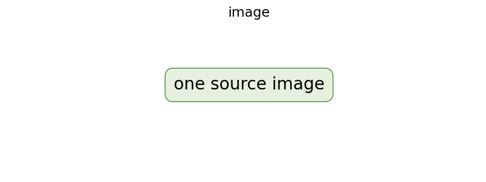

# A Simple Framework for Contrastive Learning of Visual Representations (SimCLR)

## TL;DR

SimCLR learns visual features without class labels by treating two random
augmentations of one image as a positive pair and views from other images as
negatives. A shared encoder produces representations and a small projection head
produces contrastive-space vectors. The contrastive loss raises similarity of
matching views while lowering similarity to other batch examples. The paper
showed that augmentation composition, a nonlinear projection head, and large
batches are central to strong self-supervised visual learning.

## Fun Map for First Years 🧭

SimCLR shows a model two altered versions of the same picture and says “these still belong together,” while other pictures should stay apart.

`🖼️ one image → ✂️ two random views → 🧠 shared encoder → 🤝 pull together / ↔️ push apart`

SimCLR makes two altered views of the same picture agree, while making views from different pictures less similar. It learns image features without human labels.

Take one photo, crop it twice, and adjust colors differently. The two views should still describe the same object, while views from other photos should remain distinguishable.

💻 **CS analogy:** treat two transformed copies as duplicate records that must hash nearby, while every other record in the batch is a temporary negative test case.

## Math Playground 🧮

The essential equation or rule is:

```text
−log(exp(sim(i,j)/τ) / Σ_(k≠i) exp(sim(i,k)/τ))
```

**Essential equation:** \(-\log\frac{\exp(\mathrm{sim}(i,j)/\tau)}{\sum_{k\ne i}\exp(\mathrm{sim}(i,k)/\tau)}\). i and j are two altered views of the same image. The top says “how similar is the true partner?”; the bottom compares it with every other image in the batch. Training wants the true pair to win this retrieval contest. Temperature τ controls how strongly the contest favors the highest score.

The top is the true pair’s similarity and the bottom includes all competing images in the batch. Training makes the true pair win this retrieval contest.

Cosine similarity compares vector direction rather than length. A smaller temperature τ makes the softmax contest sharper, so the model is punished more for confusing close competitors.

## Background: What Came Before 🕰️

Image representations usually relied on manual labels, while earlier self-supervised approaches used hand-designed pretext tasks whose benefit did not always transfer. Contrastive ideas existed but their training recipes were complicated. SimCLR was needed to show that strong augmentations, a projection head, and a simple contrastive objective could learn highly useful visual features without labels.

This was needed because labeled images are costly, while simple image augmentations can create learning signals for free.

This showed that strong image representations can emerge from instance discrimination, provided augmentations are chosen carefully enough to preserve identity.

## Why It Matters

Supervised vision representation learning requires labels that can be expensive,
narrow, or unavailable. Earlier self-supervised methods designed proxy tasks
such as predicting rotation or image patch location, which can teach shortcuts
unrelated to downstream semantic categories. Contrastive learning creates its
own training signal from multiple views of an image: preserve what should remain
the same under chosen transformations and distinguish other images.

SimCLR simplified contrastive visual learning by avoiding a memory bank and
specialized architecture. Its systematic ablations made an important point:
augmentations define the task, so they are not merely regularization. The paper
reported that a learned nonlinear projection between representation and loss,
larger batch size, and more training steps materially improved linear evaluation.
CLIP also uses contrastive learning, but its positives are image-text pairs;
SimCLR's positives are two views of the same image.

## Core Intuition

If two photographers crop and recolor the same bicycle photo, an embedding for
downstream recognition should still identify them as related. If one photo is a
bicycle and another is a volcano, their embeddings should separate. SimCLR asks
the model to solve exactly this matching game repeatedly. The crucial judgment is
which edits preserve identity: a crop can encourage object-level features, while
an augmentation that erases a medically relevant detail would teach the wrong
invariance.



## The Mechanism

For each of \(N\) source images, sample two transformed views, yielding \(2N\)
examples. An encoder \(f\) produces representation \(h\), and projection head
\(g\) produces normalized vector \(z\). For an anchor \(i\) and its matching
view \(j\), the NT-Xent objective compares their cosine similarity against all
other views in the batch:

\[
\ell_{i,j}=-\log \frac{\exp(\mathrm{sim}(z_i,z_j)/\tau)}
{\sum_{k\ne i}\exp(\mathrm{sim}(z_i,z_k)/\tau)}.
\]

The temperature \(\tau\) controls logit sharpness. The positive is excluded
from its own denominator but included as the desired numerator; all nonmatching
views serve as negatives. Training averages both directional losses for each
positive pair. After pretraining, SimCLR evaluates the encoder representation,
not necessarily the projection output, with a linear classifier.





The GIF is illustrative, not a paper result. It represents the encoder as shared
between views; there is no separate teacher in SimCLR. Negatives are batch
examples rather than a memory queue in the basic formulation. Small batches can
provide too few negatives, while a large batch has communication and memory
cost. Later methods such as BYOL and SimSiam changed the negative-pair design;
they are not implementation settings of the original objective.

## Practical Engineering Notes

Use a controlled augmentation pipeline and record every operation, probability,
crop scale, color transform, blur, resolution, and random seed policy. Apply the
same family of transforms to both views but sample them independently. Audit
whether augmentations preserve the downstream label for each important slice.
For satellite, medical, document, or manufacturing images, standard ImageNet
color jitter can be invalid. Treat transformation review as dataset governance.

The encoder, projection head, and optimizer all need checkpointing. Linear
evaluation uses frozen encoder features and a separately trained classifier, so
do not accidentally evaluate the projection head or fine-tune the encoder when
claiming a linear probe. Log contrastive loss, positive similarity, negative
similarity, representation norms, batch size, global batch size, temperature,
and downstream probe scores. A low loss can arise from a shortcut that does not
transfer to the intended task.

Large batches may require distributed all-gather so each worker's negatives are
visible globally. Ensure gradients and normalization semantics match the chosen
implementation, profile communication, and test one-device versus multi-device
results. Mixed precision can affect normalized-dot-product accuracy; keep
normalization and reduction choices documented. Cache or precompute only data
that does not accidentally make two views identical.

### Evaluation and operational safeguards

Pretraining labels are not needed, but downstream evaluation labels still matter.
Use a held-out linear probe set that is separate from augmentation and
hyperparameter selection. Compare representations against supervised, random,
and simpler self-supervised baselines under the same encoder capacity and input
resolution. Probe performance by class, source domain, acquisition device, and
image quality. A representation can look good on average while failing precisely
where the target product needs invariance or discrimination.

Augmentation choices can encode harmful assumptions. Random crops may remove a
small clinically important finding; aggressive color jitter can erase stain or
manufacturing signals; horizontal flips can invalidate text or asymmetric
anatomy. Build an augmentation review with domain owners and save visual samples
of paired views for each release. If a transform changes the intended label,
that pair is a false positive training signal rather than useful diversity.

Representation collapse checks are useful even though contrastive negatives make
full collapse less likely in the basic objective. Monitor per-dimension variance,
embedding norm, positive/negative score separation, and nearest-neighbor
examples. Inspect whether nearest images share the expected semantic property or
a shortcut such as background color, watermark, crop style, or camera type.
These diagnostics give more actionable information than the objective alone.

For retrieval systems, version encoder weights, transform pipeline, projection
choice, normalization, and vector-index revision together. A downstream index
should normally use the representation chosen by evaluation, not automatically
the contrastive projection head. When changing any component, rebuild or isolate
the index; mixed embedding spaces make similarity scores meaningless. Apply
authorization filters before returning neighbor records, because representation
proximity is not permission to reveal an image.

At serving time, bound image size and format before decoding, batch requests
within latency limits, and log failure reasons without retaining unnecessary
image data. Establish a rejection or human-review path for applications where a
retrieval or classifier decision has real consequence. SimCLR learns useful
invariances from data; it does not validate truth, identity, safety, or fairness
for a particular deployment. Those properties need explicit datasets, tests,
and operational controls.

Finally, preserve experiment lineage. Record data filters, licensing, consent,
source distribution, encoder revision, optimizer, batch topology, augmentation
configuration, and evaluation protocol. This makes a later representation change
auditable and lets maintainers distinguish a genuine learning improvement from a
new sample mix or changed probe. It is especially important when a pretrained
encoder becomes shared infrastructure for several downstream teams.

When a representation is reused across products, define ownership for model
updates, quality regressions, and data removal requests. A feature-space change
can affect ranking, classification, and anomaly detection simultaneously. A
staged rollout with canary comparisons, index rollback, and downstream owner
sign-off limits this blast radius. These operational practices convert a useful
research representation into dependable shared infrastructure.
It also preserves clear accountability for model behavior.
It supports measured, safe iteration across dependent products.

## Runnable Code Example

### Run it

The implementation is intentionally small and self-checking. From the repository root, use Python 3; the module docstring states the learning goal, comments identify the paper-specific calculation, and assertions verify the toy invariant.

```bash
python3 papers/27-simclr/code/contrastive_pair.py
```

### Read it in order

Start with the module docstring, then follow the named helper calculations and the final assertions. The example is a dependency-light teaching implementation, not a production training system; change one input at a time and rerun it to see which invariant changes.


[`code/contrastive_pair.py`](code/contrastive_pair.py) checks that a hand-built
positive view embedding scores above two negative image embeddings.

```bash
python3 papers/27-simclr/code/contrastive_pair.py
```

It demonstrates ranking only; it does not implement augmentation or gradient
training.

## Common Misconceptions & Pitfalls

**“Self-supervised means augmentation choices do not matter.”** They define the
invariances and therefore the learning task.

**“All views from one image must be pixel similar.”** They can be strongly
transformed while still being designated as a positive pair.

**“Loss alone proves representation quality.”** Transfer needs a held-out
downstream evaluation and shortcut analysis.

## Interview Q&A

**Q:** What is a SimCLR positive pair?
**A:** Two independently augmented views of the same source image.

**Q:** Why use a projection head?
**A:** It gives the contrastive objective a separate space while preserving a
representation better suited to downstream linear evaluation.

**Q:** Why does batch size matter?
**A:** Other batch views supply negatives in the basic objective.

**Q:** What does temperature do?
**A:** It scales similarities before softmax and changes how sharply examples
compete.

**Q:** Is SimCLR supervised classification?
**A:** No. It uses instance identity created by augmentations, then evaluates
features with labels later.

## Implementation Walkthrough

SimCLR makes two augmented views of each image, pulls their projected
representations together, and pushes other batch examples apart with a
temperature-scaled contrastive objective. Augmentations define which invariances
are learned, so tune crop, color, blur, and batch size as part of the method.
Evaluate frozen representations with a linear probe to separate representation
quality from classifier fine-tuning.

## Further Reading

- [Original paper](https://arxiv.org/abs/2002.05709)
- [SimCLR code](https://github.com/google-research/simclr)
- [PyTorch distributed documentation](https://pytorch.org/docs/stable/distributed.html)
