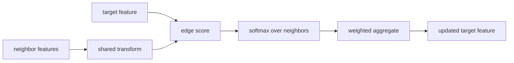
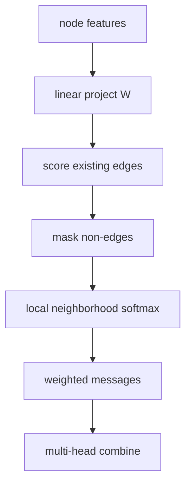
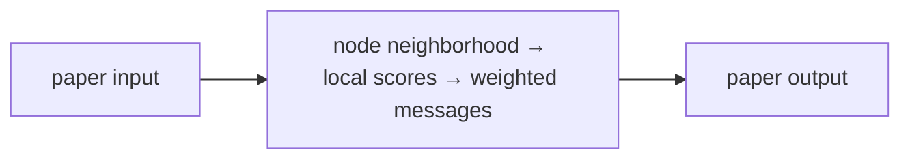
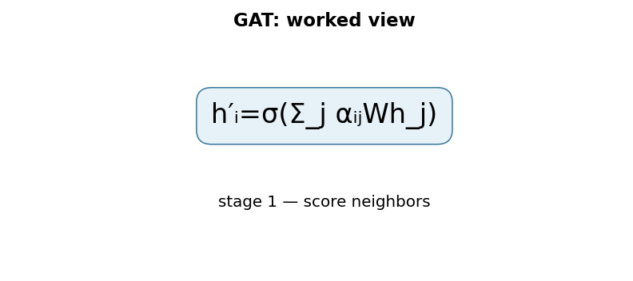

# Graph Attention Networks

## TL;DR

Graph Attention Networks update each node by weighting its neighbors according
to learned attention coefficients. A shared feature transform, an edge scoring
function, and a neighborhood softmax form a local weighted aggregation. Multiple
heads can learn several weighting patterns. This provides adaptive message
passing without requiring spectral graph operations or a fixed graph size.

## Fun Map for First Years 🧭

GAT lets each dot in a network listen to nearby dots with different volumes, rather than treating every neighbor as equally useful.

`🔵 node + 👥 neighbors → 🎚️ attention weights → 📬 weighted messages → 🧠 updated node`

A graph node can listen to its neighbors, but not every neighbor deserves equal attention. GAT learns which incoming messages matter most.

In a citation graph, a paper may care more about a closely related citation than a generic survey. Attention weights let the node choose rather than averaging every neighbor equally.

💻 **CS analogy:** each node runs a priority inbox: it reads messages from neighbors but turns their relevance scores into per-neighbor weights before combining them.

## Math Playground 🧮

The essential equation or rule is:

```text
Σ_j α_ij W h_j,  α_ij = softmax_j(e_ij)
```

**Essential equation:** \(\sum_j\alpha_{ij}Wh_j\), with \(\alpha_{ij}=\operatorname{softmax}_j(e_{ij})\). Node i receives a message from every neighbor j. The softmax turns the neighbor scores into weights that add to 1, like splitting a fixed 100% attention budget among messages. The result is a weighted average, so useful neighbors can count more than irrelevant ones.

α is a percentage-like attention weight for neighbor j. The weighted sum lets useful neighbors contribute more than irrelevant ones.

Softmax makes all α weights positive and sum to 1, so the update is a weighted average. W first transforms all features into a shared space where those comparisons are meaningful.

## Background: What Came Before 🕰️

Graph neural networks could average or sum neighbor features, but that treats every neighbor as equally useful and can blur distinct roles. Fixed graph filters also made it hard to adapt importance across nodes. GAT was needed to learn which neighboring messages deserve more weight while remaining usable on graphs with varying degrees.

This improved on graph methods that treated every neighbor alike, even in noisy graphs.

This added adaptive neighbor importance to graph learning and made the model more interpretable, though attention weights are not automatically causal explanations.

## Why It Matters

Graphs represent relationships that grids and sequences do not: citations,
molecules, suppliers, software dependencies, and social links. Earlier graph
convolutions aggregate neighbors with fixed structure-based weights. GAT lets
features influence which neighboring messages matter to a particular target
node. The original paper highlighted both transductive citation tasks and an
inductive protein-interaction setting with unseen test graphs.

GAT established attention as a standard graph-neural-network primitive. It does
not make graph learning automatically interpretable or safe. Attention weights
are learned routing values, not causal evidence. Later graph transformers,
edge-aware layers, sampling schemes, and heterogeneous-graph methods extend the
basic formulation and must be identified separately.

## Core Intuition

Imagine a researcher reading collaborators' advice. A close collaborator on the
same topic should influence a paper more than a loosely connected author. GAT
learns this rule from features for every target node. It listens only to graph
neighbors, not every node in the world. Multiple heads act like independent
readers, each able to notice a different useful relationship.



## The Mechanism

For node feature \(h_i\), GAT first applies learned matrix \(W\). For neighbor
\(j\) into target \(i\), it scores a pair using a shared vector, commonly
\(e_{ij}=\mathrm{LeakyReLU}(a^T[Wh_i\Vert Wh_j])\). The graph masks this score
to allowed neighbors and softmax normalizes the local scores:

\[
\alpha_{ij}=\frac{\exp(e_{ij})}{\sum_{k\in\mathcal N(i)}\exp(e_{ik})}.
\]

The target update is a nonlinearity applied to
\(\sum_{j\in\mathcal N(i)}\alpha_{ij}Wh_j\). A self-loop lets the old node
feature contribute to its update. Multiple heads use separate parameters; hidden
layers often concatenate heads, while output layers may average them.




The softmax is local to each target. A large coefficient means that message was
useful to this trained model on this input; it does not mean the neighbor is
globally important or causally responsible. The GIF is illustrative, not a
paper result. Edge direction, relation type, self-loops, and duplicate edges
must be defined before the aggregation has a valid meaning.

### Mechanism in Code

At implementation level, the mechanism operates on node features and adjacency edges. A faithful
forward pass should follow this order: project features, score only neighbors, normalize locally, and aggregate messages. Keep the intermediate
representation available while debugging; collapsing everything into one
opaque framework call makes shape and numerical errors much harder to isolate.

The key production failure to guard against is assuming attention weights are global explanations or forgetting self-loops. Add a tiny
reference test with hand-checkable values, then add a property test that
covers padding, empty/short inputs, boundary probabilities, and the largest
supported shape. Compare intermediate tensors with tolerances appropriate to
the dtype, and log the paper-specific statistic during a canary rollout.


## Practical Engineering Notes

### Worked Math & Dataflow

The compact view below makes the paper's central calculation concrete:

```text
h′ᵢ=σ(Σ_j αᵢⱼWh_j)
```

In practice, the calculation is a pipeline: Each node normalizes scores only across its own neighborhood, so an unrelated node cannot receive weight. Multi-head attention can provide several local aggregation patterns. The important engineering
choice is to preserve the paper's intended invariant while making the operation
fit the available memory, batch size, and evaluation protocol.






Use PyTorch Geometric `GATConv` or DGL layers as implementation references, then
verify defaults for self-loops, edge features, dropout, head concatenation, and
bipartite input. Version node-ID mapping and graph revision with features. A
shuffled feature matrix with unchanged edges runs successfully but computes an
unrelated graph. Assert node count, edge index bounds, direction, duplicates,
and isolated-node handling at every pipeline boundary.

Full graph attention can exhaust memory on high-degree graphs because every edge
has a score and coefficient. Neighbor sampling, mini-batching, degree caps, or
distributed storage improve scale but also change the sampled neighborhood and
therefore the softmax objective. Measure accuracy, bias, tail latency, degree
distribution, sampled edge count, head count, attention entropy, and isolated
node behavior. Treat a sampler as model configuration, not an invisible loader.

Graphs can reveal sensitive relationships. Apply access filters before message
passing or retrieval, since embeddings can leak neighbor information a caller
should not see. Use temporal splits for evolving graphs; random splits can leak
future edges. In social or recommendation applications, audit popularity bias,
node-group outcomes, and feedback loops. A graph prediction can amplify past
connectivity rather than reveal a stable property of an individual node.

### Data quality, debugging, and delivery

Graph construction is often the highest-risk modeling decision. An edge can mean
coauthorship, co-purchase, physical contact, a temporal event, or an inferred
similarity; these meanings have different leakage and causal implications.
Document how edges are collected, filtered, directed, timestamped, and weighted.
Keep raw graph evidence separate from derived edge indices so a reviewer can
rebuild a revision. Do not infer a missing relation merely because a model's
embedding makes two nodes close.

Begin implementation with a tiny hand-written graph. Compute one target's
scores, softmax weights, and aggregate manually, then assert the framework layer
agrees within tolerance. Test permutation invariance by reordering nodes and
edges while preserving mappings. Test that non-edges cannot contribute, that a
self-loop is present only when intended, and that an isolated node has a defined
output. These checks catch common errors that loss curves cannot reveal.

Split policy deserves equal care. A transductive citation benchmark can expose
the full graph while hiding labels, whereas an inductive deployment may receive
new nodes, new connected components, or future edges. Random edge or node splits
can leak connectivity from evaluation into training. Use a split reflecting the
actual arrival process, preserve it as an artifact, and report which topology was
visible during fitting, validation, and serving.

Attention dropout and feature dropout regularize different paths. Attention
dropout removes messages after scores are normalized; feature dropout changes
the inputs to scoring and aggregation. Record both rates, head configuration,
activation, residual connections, and normalization. A head-average versus
concatenation choice changes output dimension and downstream classifier shape.
Changing it under a checkpoint without updating the consumer can create silent
quality loss or an obvious tensor mismatch.

For high-degree hubs, inspect coefficient distributions rather than assuming the
softmax focuses meaningfully. A nearly uniform distribution can dilute useful
signals; an extremely peaked one can create brittle dependence on one neighbor.
Compare attention entropy and ablation performance across degree buckets. When
sampling, quantify how often important relations are absent and whether degree
correlates with error. These diagnostics turn “attention” from a decorative
visualization into a measurable part of the model behavior.

At deployment, graph freshness is an explicit service-level choice. Decide
whether embeddings update online, on a scheduled batch, or only after reviewed
graph rebuilds. Mixing node features from one date with edges from another can
create invalid messages. Use atomic graph revisions, monitor update lag, and
provide rollback. For sensitive domains, access rules must apply not only to a
returned node but also to every relationship allowed to influence its embedding.

Finally, measure downstream value against a feature-only baseline and a simple
graph aggregation baseline. A GAT adds data dependencies, storage costs, and
potential relationship leakage. It is worthwhile only when adaptive neighboring
information improves the task under the required privacy, latency, and
maintainability constraints.

Evaluation artifacts should include the exact graph snapshot and feature
snapshot, not merely trained weights. Replaying a score with changed neighbors
can yield a different embedding even when model parameters are identical. This
is especially important for incident analysis: an investigator needs to know
which edges and attributes were visible at the decision time. Retention and
access policies for those snapshots should match the sensitivity of relationship
data.

Use calibration and abstention where the task outputs probabilities or rankings
that drive a workflow. Graph structure can make examples statistically dependent,
so conventional independent confidence assumptions may be misleading. Evaluate
component-level and temporal slices, and verify that a model's error on a new
connected component is not masked by high performance on familiar densely linked
regions. These tests align measured behavior with the intended inductive use.
They provide meaningful evidence before release decisions.

## Runnable Code Example

### Run it

The implementation is intentionally small and self-checking. From the repository root, use Python 3; the module docstring states the learning goal, comments identify the paper-specific calculation, and assertions verify the toy invariant.

```bash
python3 papers/28-graph-attention-networks/code/neighbor_attention.py
```

### Read it in order

Start with the module docstring, then follow the named helper calculations and the final assertions. The example is a dependency-light teaching implementation, not a production training system; change one input at a time and rerun it to see which invariant changes.


[`code/neighbor_attention.py`](code/neighbor_attention.py) normalizes two toy
neighbor scores and verifies that the weighted feature lies between inputs.

```bash
python3 papers/28-graph-attention-networks/code/neighbor_attention.py
```

It demonstrates one attention distribution, not a trained multi-head GNN.

## Common Misconceptions & Pitfalls

**“GAT attends to every node.”** Basic GAT masks attention to a local neighbor
set.

**“Attention weights are causal explanations.”** They are learned coefficients;
causal claims require intervention evidence.

**“Inductive means preprocessing is unnecessary.”** Features, edge semantics,
node IDs, and split policy remain part of the model contract.

## Quick Concept Checks

**Q:** What does GAT normalize?
**A:** Scores across each target node's allowed neighborhood.

**Q:** Why use several heads?
**A:** They learn independent message-weighting patterns and can stabilize output.

**Q:** What does masking do?
**A:** It excludes non-neighbors from a local attention calculation.

**Q:** Why add self-loops?
**A:** A node's own transformed feature can participate in its update.

**Q:** What is an inductive graph task?
**A:** A learned local rule must apply to unseen nodes or unseen graphs.

## Implementation Walkthrough

A graph-attention layer transforms neighboring node features, scores each edge,
normalizes scores separately for every destination node, then aggregates
neighbor messages. Add self-loops deliberately so a node can retain its own
feature. Inspect normalization by node degree and use sparse edge operations;
building a dense adjacency square makes even a modest graph unnecessarily
expensive.

## Interview Q&A

**Q:** Walk through **masked attention over graph neighborhoods** end to end. How would you implement `h′ᵢ=σ(Σ_jαᵢⱼWh_j)`?
**A:** Decompose the expression into the actual data path: inputs enter the paper-specific transformation, intermediate scores or states are computed, invalid elements are excluded, and the result is reduced into the output or loss. For this paper, `h′ᵢ=σ(Σ_jαᵢⱼWh_j)` is an executable contract, not decoration: document tensor shapes, ownership of mutable state, numerical precision, and where batching changes semantics. Keep a small reference implementation beside the optimized path so a reviewer can connect each line of `code` to one term in the equation.

**Follow-up:** What invariant would you assert, and why is it stronger than checking final accuracy?
**A:** Assert that **attention weights normalize over each node’s incoming neighbors and self-loops are intentional**. That property is local enough to fail near the defect, whereas accuracy can remain acceptable while a mask, reduction, or state boundary is wrong on a rare input. Add a hand-computed fixture, a randomized differential test against the reference, and shape/dtype assertions at the API boundary. The test should also cover an empty, padded, terminal, high-degree, long-context, or otherwise adversarial case when that input is meaningful for this mechanism.

**Q:** What is the main production trade-off in this paper, and how would you capacity-plan it?
**A:** The central trade-off is that **the mechanism changes both quality behavior and resource use**. Capacity planning therefore needs more than average FLOPs: measure peak memory, memory bandwidth, communication, preprocessing, batch-size sensitivity, and p95/p99 latency on representative distributions. Define a quality budget before optimizing, then compare a simple baseline with the paper mechanism using identical inputs and seeds. A faster path that silently changes tokenization, routing, masking, sampling, or optimization behavior is not an acceptable optimization until its quality impact is measured.

**Follow-up:** Which failure mode would make you roll back first?
**A:** Roll back on evidence of **dense adjacency construction, isolated-node NaNs, or neighbor-order dependence**, especially when the symptom is silent and outputs still look plausible. Add dashboards for the paper-specific statistic, error and timeout rates, resource saturation, and a task metric sliced by difficult inputs. Use a canary or shadow comparison with the previous implementation, retain the old path behind a flag, and make the rollback decision threshold explicit before deployment. The important SDE2 judgment is to protect the paper’s semantic contract, not merely to chase a faster benchmark.

**Q:** A model passes unit tests but fails in production. What is your debugging plan?
**A:** Start with **assert local weight sums, test permutation invariance, and compare sparse output with a tiny dense reference**. Reproduce the smallest production-shaped example, freeze the model and preprocessing versions, and compare intermediate tensors or records rather than only the final prediction. Check data contracts, masks, sequence boundaries, random seeds, numerical precision, and serving mode in that order; then bisect between the reference and optimized implementations. If the defect is not numerical, run a controlled ablation that removes the paper-specific mechanism and compare the resulting failure rate, which separates integration problems from a bad mechanism or configuration.

**Follow-up:** What evidence would you present in the review or postmortem?
**A:** Present one minimal failing input, the expected **attention weights normalize over each node’s incoming neighbors and self-loops are intentional**, the first intermediate value that diverged, and the regression test that now protects it. Include a before/after table for task quality, memory, throughput, p95/p99 latency, and cost, with slices for the failure population. A complete SDE2 answer also states the rollout guard, owner, and alert threshold. That turns a paper idea into an operable system rather than a one-line claim about an equation.

## Further Reading

- [Original paper](https://arxiv.org/abs/1710.10903)
- [PyTorch Geometric GATConv](https://pytorch-geometric.readthedocs.io/en/latest/generated/torch_geometric.nn.conv.GATConv.html)
- [DGL documentation](https://www.dgl.ai/)
