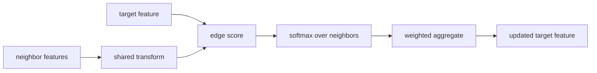
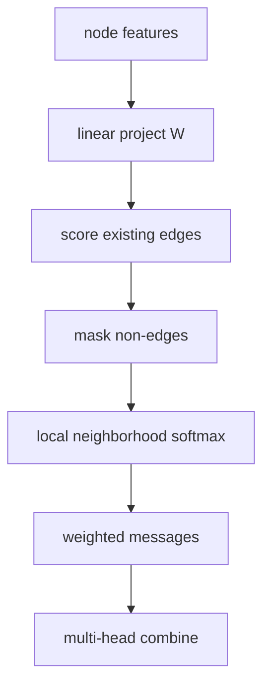
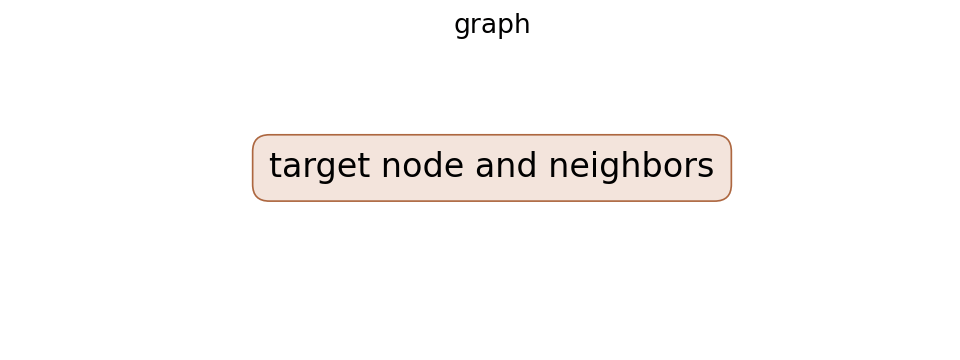

# Graph Attention Networks

## TL;DR

Graph Attention Networks update each node by weighting its neighbors according
to learned attention coefficients. A shared feature transform, an edge scoring
function, and a neighborhood softmax form a local weighted aggregation. Multiple
heads can learn several weighting patterns. This provides adaptive message
passing without requiring spectral graph operations or a fixed graph size.

## Fun Map for First Years 🧭

GAT lets each dot in a network listen to nearby dots with different volumes, rather than treating every neighbor as equally useful.

`🔵 node + 👥 neighbors → 🎚️ attention weights → 📬 weighted messages → 🧠 updated node`

💻 **CS analogy:** each node runs a priority inbox: it reads messages from neighbors but turns their relevance scores into per-neighbor weights before combining them.

## Math Playground 🧮

For neighbor \(j\), GAT computes a score, normalizes it with \(\alpha_{ij}=\operatorname{softmax}_j(e_{ij})\), then forms \(\sum_j\alpha_{ij}Wh_j\). Softmax makes the incoming weights add to one, like dividing a fixed attention budget among messages. \(W\) first puts every node feature in a shared representation space.

## Background: What Came Before 🕰️

Graph neural networks could average or sum neighbor features, but that treats every neighbor as equally useful and can blur distinct roles. Fixed graph filters also made it hard to adapt importance across nodes. GAT was needed to learn which neighboring messages deserve more weight while remaining usable on graphs with varying degrees.

## Why It Matters

Graphs represent relationships that grids and sequences do not: citations,
molecules, suppliers, software dependencies, and social links. Earlier graph
convolutions aggregate neighbors with fixed structure-based weights. GAT lets
features influence which neighboring messages matter to a particular target
node. The original paper highlighted both transductive citation tasks and an
inductive protein-interaction setting with unseen test graphs.

GAT established attention as a standard graph-neural-network primitive. It does
not make graph learning automatically interpretable or safe. Attention weights
are learned routing values, not causal evidence. Later graph transformers,
edge-aware layers, sampling schemes, and heterogeneous-graph methods extend the
basic formulation and must be identified separately.

## Core Intuition

Imagine a researcher reading collaborators' advice. A close collaborator on the
same topic should influence a paper more than a loosely connected author. GAT
learns this rule from features for every target node. It listens only to graph
neighbors, not every node in the world. Multiple heads act like independent
readers, each able to notice a different useful relationship.



## The Mechanism

For node feature \(h_i\), GAT first applies learned matrix \(W\). For neighbor
\(j\) into target \(i\), it scores a pair using a shared vector, commonly
\(e_{ij}=\mathrm{LeakyReLU}(a^T[Wh_i\Vert Wh_j])\). The graph masks this score
to allowed neighbors and softmax normalizes the local scores:

\[
\alpha_{ij}=\frac{\exp(e_{ij})}{\sum_{k\in\mathcal N(i)}\exp(e_{ik})}.
\]

The target update is a nonlinearity applied to
\(\sum_{j\in\mathcal N(i)}\alpha_{ij}Wh_j\). A self-loop lets the old node
feature contribute to its update. Multiple heads use separate parameters; hidden
layers often concatenate heads, while output layers may average them.





The softmax is local to each target. A large coefficient means that message was
useful to this trained model on this input; it does not mean the neighbor is
globally important or causally responsible. The GIF is illustrative, not a
paper result. Edge direction, relation type, self-loops, and duplicate edges
must be defined before the aggregation has a valid meaning.

## Practical Engineering Notes

Use PyTorch Geometric `GATConv` or DGL layers as implementation references, then
verify defaults for self-loops, edge features, dropout, head concatenation, and
bipartite input. Version node-ID mapping and graph revision with features. A
shuffled feature matrix with unchanged edges runs successfully but computes an
unrelated graph. Assert node count, edge index bounds, direction, duplicates,
and isolated-node handling at every pipeline boundary.

Full graph attention can exhaust memory on high-degree graphs because every edge
has a score and coefficient. Neighbor sampling, mini-batching, degree caps, or
distributed storage improve scale but also change the sampled neighborhood and
therefore the softmax objective. Measure accuracy, bias, tail latency, degree
distribution, sampled edge count, head count, attention entropy, and isolated
node behavior. Treat a sampler as model configuration, not an invisible loader.

Graphs can reveal sensitive relationships. Apply access filters before message
passing or retrieval, since embeddings can leak neighbor information a caller
should not see. Use temporal splits for evolving graphs; random splits can leak
future edges. In social or recommendation applications, audit popularity bias,
node-group outcomes, and feedback loops. A graph prediction can amplify past
connectivity rather than reveal a stable property of an individual node.

### Data quality, debugging, and delivery

Graph construction is often the highest-risk modeling decision. An edge can mean
coauthorship, co-purchase, physical contact, a temporal event, or an inferred
similarity; these meanings have different leakage and causal implications.
Document how edges are collected, filtered, directed, timestamped, and weighted.
Keep raw graph evidence separate from derived edge indices so a reviewer can
rebuild a revision. Do not infer a missing relation merely because a model's
embedding makes two nodes close.

Begin implementation with a tiny hand-written graph. Compute one target's
scores, softmax weights, and aggregate manually, then assert the framework layer
agrees within tolerance. Test permutation invariance by reordering nodes and
edges while preserving mappings. Test that non-edges cannot contribute, that a
self-loop is present only when intended, and that an isolated node has a defined
output. These checks catch common errors that loss curves cannot reveal.

Split policy deserves equal care. A transductive citation benchmark can expose
the full graph while hiding labels, whereas an inductive deployment may receive
new nodes, new connected components, or future edges. Random edge or node splits
can leak connectivity from evaluation into training. Use a split reflecting the
actual arrival process, preserve it as an artifact, and report which topology was
visible during fitting, validation, and serving.

Attention dropout and feature dropout regularize different paths. Attention
dropout removes messages after scores are normalized; feature dropout changes
the inputs to scoring and aggregation. Record both rates, head configuration,
activation, residual connections, and normalization. A head-average versus
concatenation choice changes output dimension and downstream classifier shape.
Changing it under a checkpoint without updating the consumer can create silent
quality loss or an obvious tensor mismatch.

For high-degree hubs, inspect coefficient distributions rather than assuming the
softmax focuses meaningfully. A nearly uniform distribution can dilute useful
signals; an extremely peaked one can create brittle dependence on one neighbor.
Compare attention entropy and ablation performance across degree buckets. When
sampling, quantify how often important relations are absent and whether degree
correlates with error. These diagnostics turn “attention” from a decorative
visualization into a measurable part of the model behavior.

At deployment, graph freshness is an explicit service-level choice. Decide
whether embeddings update online, on a scheduled batch, or only after reviewed
graph rebuilds. Mixing node features from one date with edges from another can
create invalid messages. Use atomic graph revisions, monitor update lag, and
provide rollback. For sensitive domains, access rules must apply not only to a
returned node but also to every relationship allowed to influence its embedding.

Finally, measure downstream value against a feature-only baseline and a simple
graph aggregation baseline. A GAT adds data dependencies, storage costs, and
potential relationship leakage. It is worthwhile only when adaptive neighboring
information improves the task under the required privacy, latency, and
maintainability constraints.

Evaluation artifacts should include the exact graph snapshot and feature
snapshot, not merely trained weights. Replaying a score with changed neighbors
can yield a different embedding even when model parameters are identical. This
is especially important for incident analysis: an investigator needs to know
which edges and attributes were visible at the decision time. Retention and
access policies for those snapshots should match the sensitivity of relationship
data.

Use calibration and abstention where the task outputs probabilities or rankings
that drive a workflow. Graph structure can make examples statistically dependent,
so conventional independent confidence assumptions may be misleading. Evaluate
component-level and temporal slices, and verify that a model's error on a new
connected component is not masked by high performance on familiar densely linked
regions. These tests align measured behavior with the intended inductive use.
They provide meaningful evidence before release decisions.

## Runnable Code Example

[`code/neighbor_attention.py`](code/neighbor_attention.py) normalizes two toy
neighbor scores and verifies that the weighted feature lies between inputs.

```bash
python3 papers/28-graph-attention-networks/code/neighbor_attention.py
```

It demonstrates one attention distribution, not a trained multi-head GNN.

## Common Misconceptions & Pitfalls

**“GAT attends to every node.”** Basic GAT masks attention to a local neighbor
set.

**“Attention weights are causal explanations.”** They are learned coefficients;
causal claims require intervention evidence.

**“Inductive means preprocessing is unnecessary.”** Features, edge semantics,
node IDs, and split policy remain part of the model contract.

## Interview Q&A

**Q:** What does GAT normalize?
**A:** Scores across each target node's allowed neighborhood.

**Q:** Why use several heads?
**A:** They learn independent message-weighting patterns and can stabilize output.

**Q:** What does masking do?
**A:** It excludes non-neighbors from a local attention calculation.

**Q:** Why add self-loops?
**A:** A node's own transformed feature can participate in its update.

**Q:** What is an inductive graph task?
**A:** A learned local rule must apply to unseen nodes or unseen graphs.

## Further Reading

- [Original paper](https://arxiv.org/abs/1710.10903)
- [PyTorch Geometric GATConv](https://pytorch-geometric.readthedocs.io/en/latest/generated/torch_geometric.nn.conv.GATConv.html)
- [DGL documentation](https://www.dgl.ai/)
