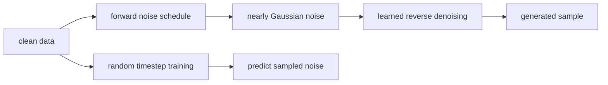
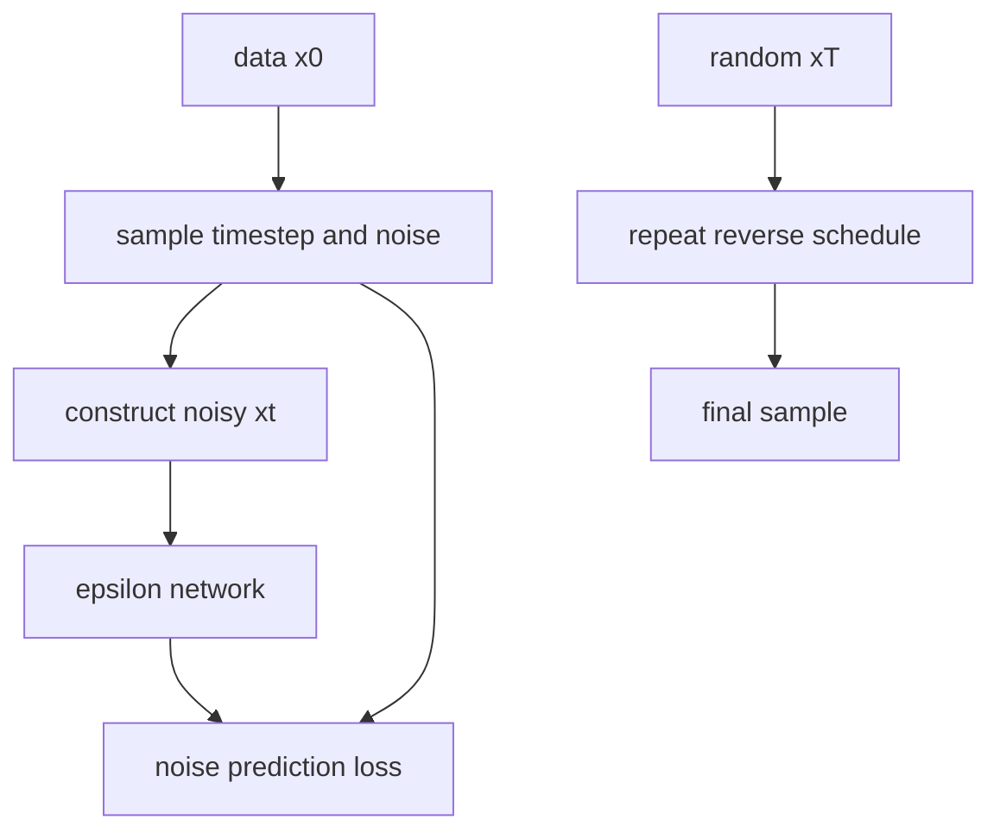
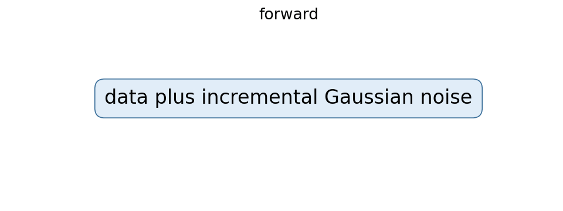
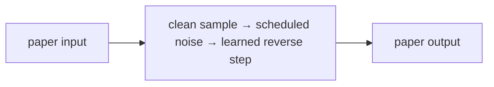
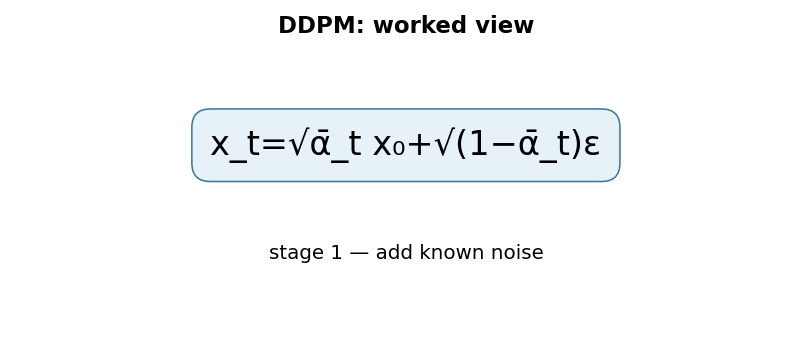

# Denoising Diffusion Probabilistic Models

## TL;DR

DDPMs generate data by learning to reverse a gradual Gaussian noising process.
Training chooses a clean example and random timestep, adds schedule-defined
noise, and trains a network to predict that noise. Sampling starts from random
noise and repeatedly applies learned reverse steps. The method made diffusion a
practical high-quality image-generation approach, but naive sampling is slower
than a one-pass generator.

## Fun Map for First Years 🧭

DDPM learns to remove a little noise at a time. It practices on messy data, then starts from static and slowly turns it into a sample.

`🖼️ clean data → 🌨️ add noise → 🧠 predict noise → 🧼 many denoise steps → ✨ sample`

Diffusion starts with a real image, adds more static, then learns how to remove the static. Starting from pure noise and reversing the process can create a new image.

A clean image becomes increasingly hard to recognize as noise is added. The network is trained on many noise levels, so it learns a small cleanup move that can be repeated from random static.

💻 **CS analogy:** it is like learning a robust cleanup function: first deliberately corrupt a file in many tiny steps, then train a program to undo one step at a time.

## Math Playground 🧮

The essential equation or rule is:

```text
x_t = √ᾱ_t x_0 + √(1 − ᾱ_t) ε
```

**Essential equation:** \(x_t=\sqrt{\bar\alpha_t}x_0+\sqrt{1-\bar\alpha_t}\epsilon\). x₀ is a clean image and ε is random static. The formula mixes them: \(\bar\alpha_t\) says how much original image remains at time t, while the rest becomes noise. The model learns to predict the static, so generation can repeatedly remove its estimate from a noisy image.

x₀ is a clean image, ε is random static, and ᾱ controls how much signal remains. The weights mix them without changing scale too much.

At early t, ᾱ is close to 1 so most signal remains; later it is close to 0 so noise dominates. Predicting ε is convenient because the exact noise added during training is known.

## Background: What Came Before 🕰️

GANs could make sharp images but their adversarial game could collapse or miss parts of the data distribution. Likelihood-based alternatives often had other architectural constraints. DDPM was needed to offer a stable, simple generative recipe: turn data into noise gradually and learn the reverse denoising process.

This provided a stable alternative to adversarial generation, using a direct prediction task rather than a two-player game.

This turned generation into many stable denoising predictions, avoiding some adversarial-game failures at the cost of a slower multi-step sampling process.

## Why It Matters

Generative models must capture complex distributions without merely memorizing
examples. GANs use a two-player game and can miss modes; autoregressive models
factor outputs sequentially. Diffusion defines a fixed corruption process and
learns to undo it. The DDPM paper connected a weighted variational bound with
denoising score matching and showed strong CIFAR-10 and LSUN results.

This mechanism underlies many modern image, audio, video, and scientific systems.
The original DDPM is not every later latent diffusion, text-conditioned model,
guidance method, or fast sampler. Those additions alter representation,
conditioning, objective, or reverse solver. The core idea remains learned
iterative denoising.

## Core Intuition

Picture a photograph dropped into a snowstorm a little at a time. Eventually it
becomes indistinguishable from static. A model practices identifying the fresh
snow at every corruption level, then learns small moves back toward a plausible
photograph. Generation begins with static and repeats those moves. Each decision
is modest, although a complete sample may require many such decisions.



## The Mechanism

Forward diffusion uses a fixed variance schedule \(\beta_t\):
\(q(x_t|x_{t-1})=N(\sqrt{1-\beta_t}x_{t-1},\beta_tI)\). With
\(\alpha_t=1-\beta_t\) and cumulative \(\bar\alpha_t=\prod_s\alpha_s\),
any step is sampled directly:

\[
x_t=\sqrt{\bar\alpha_t}x_0+\sqrt{1-\bar\alpha_t}\epsilon,
\quad\epsilon\sim N(0,I).
\]

The network receives \(x_t\) and a timestep embedding and predicts epsilon.
The common simplified objective is mean-squared error between sampled and
predicted noise. During generation, the predicted noise parameterizes a reverse
conditional that moves \(x_t\) toward \(x_{t-1}\), with schedule-defined
variance.





The forward process is fixed and only the reverse model is learned. The GIF is
illustrative, not paper data. Noise, clean-sample, and velocity prediction can
be related under a schedule, but a checkpoint must be paired with the exact
prediction type its scheduler expects. Sampler steps, variance choices, and
guidance all trade fidelity, diversity, cost, and latency.

### Mechanism in Code

At implementation level, the mechanism operates on clean sample, timestep, schedule, and Gaussian noise. A faithful
forward pass should follow this order: sample a timestep, construct x_t analytically, predict noise, and apply the matching reverse scheduler. Keep the intermediate
representation available while debugging; collapsing everything into one
opaque framework call makes shape and numerical errors much harder to isolate.

The key production failure to guard against is pairing a checkpoint with the wrong prediction type or beta schedule. Add a tiny
reference test with hand-checkable values, then add a property test that
covers padding, empty/short inputs, boundary probabilities, and the largest
supported shape. Compare intermediate tensors with tolerances appropriate to
the dtype, and log the paper-specific statistic during a canary rollout.


## Practical Engineering Notes

### Worked Math & Dataflow

The compact view below makes the paper's central calculation concrete:

```text
x_t=√ᾱ_t x₀+√(1−ᾱ_t)ε
```

In practice, the calculation is a pipeline: The forward process chooses a noisy version with a known formula, allowing training at random timesteps. The network learns the noise component needed to step back toward the data distribution. The important engineering
choice is to preserve the paper's intended invariant while making the operation
fit the available memory, batch size, and evaluation protocol.






Use a maintained implementation such as Hugging Face Diffusers and version the
UNet, scheduler, timestep count, beta schedule, prediction type, VAE if present,
text encoder, tokenizer, and safety components together. A scheduler mismatch
can yield plausible but wrong outputs without a shape error. Validate a fixed
seed canary after exports and upgrades. Keep preprocessing consistent with the
expected pixel or latent range.

Training needs random timestep sampling and correct per-example noise. Verify
time embeddings vary with t, noise has intended independence, and loss uses the
chosen representation. Log loss by timestep, prediction error, gradient norms,
fixed-seed samples, diversity, and held-out metrics. Lower average loss does not
guarantee better samples at every noise level. Mixed precision and distributed
training need numerical checks because schedule errors compound during sampling.

Sampling is a product tradeoff. More reverse steps can improve quality but raise
latency and cost. Fast solvers and distilled models are separate methods that
need task-specific evaluation. Bound resolution, batch size, and request duration
before allocating tensors. Cache conditioning only when its revision and access
permission match the request, and let cancellation safely free accelerator work.

Generated images can reproduce harmful bias, misleading content, or rare
training examples. Dataset licenses, consent, provenance, filtering, abuse
controls, and review policy are system requirements. A denoising objective does
not establish factuality or permission. High-impact applications need domain
evaluation, restrictions, and human review or abstention paths.

### Debugging, evaluation, and release

Start with a deterministic low-dimensional or tiny-image experiment. Fix an
example, timestep, and noise tensor, then verify the forward equation against a
manual calculation. Test edge timesteps near zero and the terminal schedule;
off-by-one indexing is common because implementations use zero-based arrays
while papers number timesteps from one. Confirm that the network receives the
same timestep used to construct the noisy input, and that classifier-free or
other conditioning dropout does not alter unconditional examples unexpectedly.

The forward schedule is a model interface. Changing beta values, number of
steps, clipping conventions, variance type, or prediction parameterization can
invalidate a checkpoint even when every tensor shape matches. Store scheduler
configuration in the artifact, not only in an experiment notebook. For a
conversion, render fixed seed outputs, compare intermediate noise predictions,
and retain a rollback build. A visually acceptable result from one prompt is too
weak a test of a stochastic generator.

Evaluate quality, diversity, and memorization risk separately. FID or Inception
Score depend on feature extractors, preprocessing, sample count, and reference
sets; record all of them. Fixed seed grids reveal regressions, while random
samples reveal selection bias. Nearest-neighbor reviews and privacy testing can
identify problematic reproduction but do not settle legal or consent questions.
For conditional models, assess prompt adherence and failures across languages,
styles, groups, and rare concepts rather than only generic benchmark captions.

Serving systems need resource isolation. Diffusion work can occupy an accelerator
for many denoising steps, so admission control, per-request limits, queue
timeouts, cancellation, and fair batching matter. Separate user-provided prompts
from trusted system conditioning, validate input types, and preserve an audit
trail consistent with privacy policy. The reverse chain is a computation plan,
not a permission boundary or content policy.

When comparing sampler optimizations, use identical model weights, seeds where
applicable, output resolution, prompt settings, and compute budgets. A faster
sampler may alter numerical trajectory and diversity. Track end-to-end latency,
peak memory, throughput, failed generations, and quality slices. Release only
after these tradeoffs meet the actual product requirement, with a known rollback
to the previous scheduler and weights.

Finally, document limitations plainly. A diffusion model predicts distributional
plausibility, not facts. It can synthesize convincing but incorrect images and
may reproduce training biases. Downstream workflows should verify relevant
claims with independent data or people, especially in medical, scientific,
identity, safety, or public-information contexts.

Data lifecycle controls matter because training and generation can be separated
by long periods. Track source, preprocessing, license, consent, and removal
status for every corpus shard. If a removal request or policy change requires
unlearning or retraining, know which checkpoints, cached latents, fine-tunes,
and indexes are affected. A model card should describe both generation limits
and the operational procedure for retiring a model revision.

For research comparisons, distinguish the stochastic model from the sample
selection process. Generate a predeclared number of samples with fixed seeds
where feasible, report any filtering, and retain failure examples. Human ratings
need a blinded protocol, representative prompts, and a documented rubric. This
prevents attractive cherry-picked samples from substituting for distributional
evidence. It also reveals when a method improves one aesthetic while harming
coverage, controllability, or reliability.

The most useful mental model is a chain of probabilistic transformations coupled
to a real serving system. Schedule math, denoiser weights, conditioning inputs,
sampler, hardware precision, and policy controls all contribute to an output.
Making these interfaces explicit keeps diffusion engineering testable as models
and products evolve.
It enables reliable technical review and safe iteration.

## Runnable Code Example

### Run it

The implementation is intentionally small and self-checking. From the repository root, use Python 3; the module docstring states the learning goal, comments identify the paper-specific calculation, and assertions verify the toy invariant.

```bash
python3 papers/29-ddpm/code/noise_schedule.py
```

### Read it in order

Start with the module docstring, then follow the named helper calculations and the final assertions. The example is a dependency-light teaching implementation, not a production training system; change one input at a time and rerun it to see which invariant changes.


[`code/noise_schedule.py`](code/noise_schedule.py) applies the closed-form
forward noising equation to one scalar clean value and fixed Gaussian noise.

```bash
python3 papers/29-ddpm/code/noise_schedule.py
```

It illustrates the schedule equation, not image generation or reverse training.

## Common Misconceptions & Pitfalls

- **Misconception: `x_t=√ᾱ_tx₀+√(1−ᾱ_t)ε` is the whole implementation.** The equation describes the paper's central relationship, but `diffusion forward noising and sequential reverse denoising` also requires explicit input contracts, ordering, masking or sampling rules, and numerical choices. If those details are left implicit, two implementations can share the same formula and still produce different results. Treat the equation as a contract and document each intermediate tensor or state transition.
- **Misconception: the mechanism is automatically reliable when the final metric looks good.** A model can compensate for a wrong reduction, stale state, or malformed edge/token boundary on common examples. The local guard is **the timestep schedule and noise parameterization agree between training and sampling**. Check it on a tiny hand-worked fixture and on adversarial inputs before trusting an aggregate benchmark.
- **Pitfall: optimizing the operation before measuring its actual bottleneck.** For this paper, watch for **wrong schedule indexing, accumulated reverse-step error, or excessive sampling latency** rather than assuming the largest theoretical term dominates every workload. Record memory, bandwidth, batch shape, tail latency, and quality slices. An optimization is only safe when it preserves the paper-specific contract and has a rollback path.
- **Pitfall: debugging only the final prediction.** Start with **reconstruct known noised samples and check timestep-dependent noise statistics**; compare intermediate values with a simple reference. Freeze preprocessing, configuration, seeds, and model versions; then bisect the first divergence. This makes a failure reproducible and distinguishes data-contract errors from numerical instability, integration bugs, and a genuinely unsuitable paper mechanism.

## Quick Concept Checks

**Q:** What is the central idea behind **diffusion forward noising and sequential reverse denoising**?
**A:** It is a structured data or optimization path, not a slogan: inputs are transformed, paper-specific relationships are computed, invalid choices are excluded when necessary, and the result is aggregated into an output or objective. The important implementation question is which intermediate values must remain observable so a reviewer can connect the code to the paper.

**Q:** How should I read `x_t=√ᾱ_tx₀+√(1−ᾱ_t)ε`?
**A:** Read each symbol as an operation with a shape, a data source, and a numerical range. Ask what changes when its scale, temperature, rank, timestep, neighborhood, or other paper-specific value changes. Then make a two- or three-example fixture where the expected result can be calculated by hand; this catches notation-to-code misunderstandings early.

**Q:** What invariant must a correct implementation preserve?
**A:** It must preserve **the timestep schedule and noise parameterization agree between training and sampling**. This is stronger than asking whether accuracy improved because it is local, deterministic, and testable near the operation that could be wrong. Assert it at the boundary, compare against a small reference implementation, and include the unusual input shape most likely to violate it in production.

**Q:** What is the most dangerous failure mode?
**A:** The first risk to investigate is **wrong schedule indexing, accumulated reverse-step error, or excessive sampling latency**. It can produce plausible outputs while degrading only a slice of traffic, so monitor a paper-specific statistic alongside quality and system metrics. A canary should compare the old and new paths on identical inputs and should retain enough intermediate diagnostics to explain a regression.

**Q:** How would I test this idea beyond a happy-path unit test?
**A:** Begin with **reconstruct known noised samples and check timestep-dependent noise statistics**, then add differential tests against a transparent reference on small randomized inputs. Cover boundaries such as padding, termination, empty neighborhoods, long sequences, rare tokens, extreme values, or duplicated examples when they apply. Test both output values and gradients or state updates when training behavior is part of the paper's claim.

**Q:** What should I remember when applying the paper in a real system?
**A:** Keep the paper's assumptions in the production contract: version the preprocessing and configuration, expose the relevant intermediate statistic, and define quality slices before tuning performance. Compare throughput, peak memory, p95/p99 latency, and task quality against a baseline. The paper is useful only when its mechanism remains correct under the workload and failure modes you actually operate.

## Interview Q&A

**Q:** Walk through **diffusion forward noising and sequential reverse denoising** end to end. How would you implement `x_t=√ᾱ_tx₀+√(1−ᾱ_t)ε`?
**A:** Decompose the expression into the actual data path: inputs enter the paper-specific transformation, intermediate scores or states are computed, invalid elements are excluded, and the result is reduced into the output or loss. For this paper, `x_t=√ᾱ_tx₀+√(1−ᾱ_t)ε` is an executable contract, not decoration: document tensor shapes, ownership of mutable state, numerical precision, and where batching changes semantics. Keep a small reference implementation beside the optimized path so a reviewer can connect each line of `code` to one term in the equation.

**Follow-up:** What invariant would you assert, and why is it stronger than checking final accuracy?
**A:** Assert that **the timestep schedule and noise parameterization agree between training and sampling**. That property is local enough to fail near the defect, whereas accuracy can remain acceptable while a mask, reduction, or state boundary is wrong on a rare input. Add a hand-computed fixture, a randomized differential test against the reference, and shape/dtype assertions at the API boundary. The test should also cover an empty, padded, terminal, high-degree, long-context, or otherwise adversarial case when that input is meaningful for this mechanism.

**Q:** What is the main production trade-off in this paper, and how would you capacity-plan it?
**A:** The central trade-off is that **the mechanism changes both quality behavior and resource use**. Capacity planning therefore needs more than average FLOPs: measure peak memory, memory bandwidth, communication, preprocessing, batch-size sensitivity, and p95/p99 latency on representative distributions. Define a quality budget before optimizing, then compare a simple baseline with the paper mechanism using identical inputs and seeds. A faster path that silently changes tokenization, routing, masking, sampling, or optimization behavior is not an acceptable optimization until its quality impact is measured.

**Follow-up:** Which failure mode would make you roll back first?
**A:** Roll back on evidence of **wrong schedule indexing, accumulated reverse-step error, or excessive sampling latency**, especially when the symptom is silent and outputs still look plausible. Add dashboards for the paper-specific statistic, error and timeout rates, resource saturation, and a task metric sliced by difficult inputs. Use a canary or shadow comparison with the previous implementation, retain the old path behind a flag, and make the rollback decision threshold explicit before deployment. The important SDE2 judgment is to protect the paper’s semantic contract, not merely to chase a faster benchmark.

**Q:** A model passes unit tests but fails in production. What is your debugging plan?
**A:** Start with **reconstruct known noised samples and check timestep-dependent noise statistics**. Reproduce the smallest production-shaped example, freeze the model and preprocessing versions, and compare intermediate tensors or records rather than only the final prediction. Check data contracts, masks, sequence boundaries, random seeds, numerical precision, and serving mode in that order; then bisect between the reference and optimized implementations. If the defect is not numerical, run a controlled ablation that removes the paper-specific mechanism and compare the resulting failure rate, which separates integration problems from a bad mechanism or configuration.

**Follow-up:** What evidence would you present in the review or postmortem?
**A:** Present one minimal failing input, the expected **the timestep schedule and noise parameterization agree between training and sampling**, the first intermediate value that diverged, and the regression test that now protects it. Include a before/after table for task quality, memory, throughput, p95/p99 latency, and cost, with slices for the failure population. A complete SDE2 answer also states the rollout guard, owner, and alert threshold. That turns a paper idea into an operable system rather than a one-line claim about an equation.

## Further Reading

- [Original paper](https://arxiv.org/abs/2006.11239)
- [Diffusers documentation](https://huggingface.co/docs/diffusers)
- [Denoising Diffusion Implicit Models](https://arxiv.org/abs/2010.02502)
