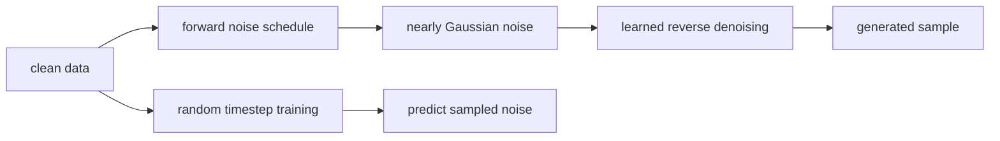
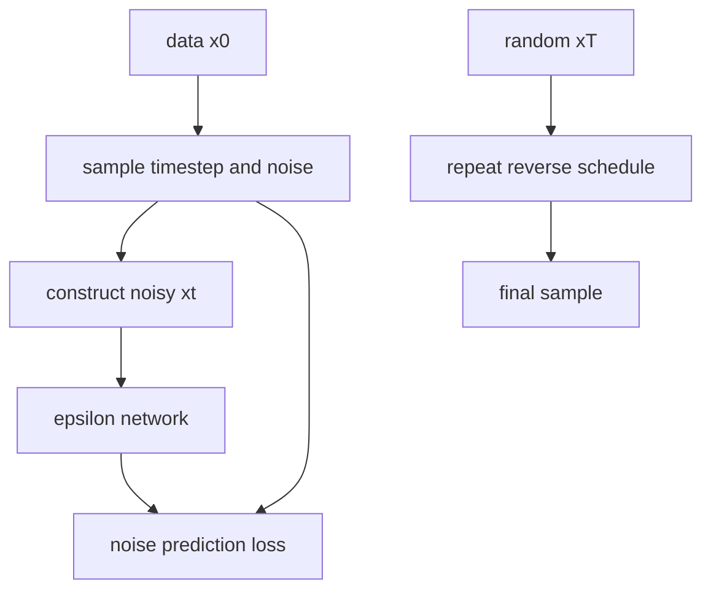
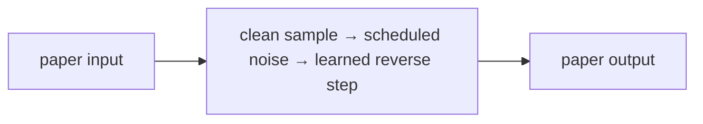

# Denoising Diffusion Probabilistic Models

## TL;DR

DDPMs generate data by learning to reverse a gradual Gaussian noising process.
Training chooses a clean example and random timestep, adds schedule-defined
noise, and trains a network to predict that noise. Sampling starts from random
noise and repeatedly applies learned reverse steps. The method made diffusion a
practical high-quality image-generation approach, but naive sampling is slower
than a one-pass generator.

## Fun Map for First Years 🧭

DDPM learns to remove a little noise at a time. It practices on messy data, then starts from static and slowly turns it into a sample.

`🖼️ clean data → 🌨️ add noise → 🧠 predict noise → 🧼 many denoise steps → ✨ sample`

Diffusion starts with a real image, adds more static, then learns how to remove the static. Starting from pure noise and reversing the process can create a new image.

A clean image becomes increasingly hard to recognize as noise is added. The network is trained on many noise levels, so it learns a small cleanup move that can be repeated from random static.

💻 **CS analogy:** it is like learning a robust cleanup function: first deliberately corrupt a file in many tiny steps, then train a program to undo one step at a time.

## Math Playground 🧮

The essential equation or rule is:

```text
x_t = √ᾱ_t x_0 + √(1 − ᾱ_t) ε
```

**Essential equation:** \(x_t=\sqrt{\bar\alpha_t}x_0+\sqrt{1-\bar\alpha_t}\epsilon\). x₀ is a clean image and ε is random static. The formula mixes them: \(\bar\alpha_t\) says how much original image remains at time t, while the rest becomes noise. The model learns to predict the static, so generation can repeatedly remove its estimate from a noisy image.

x₀ is a clean image, ε is random static, and ᾱ controls how much signal remains. The weights mix them without changing scale too much.

At early t, ᾱ is close to 1 so most signal remains; later it is close to 0 so noise dominates. Predicting ε is convenient because the exact noise added during training is known.

## Background: What Came Before 🕰️

GANs could make sharp images but their adversarial game could collapse or miss parts of the data distribution. Likelihood-based alternatives often had other architectural constraints. DDPM was needed to offer a stable, simple generative recipe: turn data into noise gradually and learn the reverse denoising process.

This provided a stable alternative to adversarial generation, using a direct prediction task rather than a two-player game.

This turned generation into many stable denoising predictions, avoiding some adversarial-game failures at the cost of a slower multi-step sampling process.

## Why It Matters

Generative models must capture complex distributions without merely memorizing
examples. GANs use a two-player game and can miss modes; autoregressive models
factor outputs sequentially. Diffusion defines a fixed corruption process and
learns to undo it. The DDPM paper connected a weighted variational bound with
denoising score matching and showed strong CIFAR-10 and LSUN results.

This mechanism underlies many modern image, audio, video, and scientific systems.
The original DDPM is not every later latent diffusion, text-conditioned model,
guidance method, or fast sampler. Those additions alter representation,
conditioning, objective, or reverse solver. The core idea remains learned
iterative denoising.

## Core Intuition

Picture a photograph dropped into a snowstorm a little at a time. Eventually it
becomes indistinguishable from static. A model practices identifying the fresh
snow at every corruption level, then learns small moves back toward a plausible
photograph. Generation begins with static and repeats those moves. Each decision
is modest, although a complete sample may require many such decisions.



## The Mechanism

Forward diffusion uses a fixed variance schedule \(\beta_t\):
\(q(x_t|x_{t-1})=N(\sqrt{1-\beta_t}x_{t-1},\beta_tI)\). With
\(\alpha_t=1-\beta_t\) and cumulative \(\bar\alpha_t=\prod_s\alpha_s\),
any step is sampled directly:

\[
x_t=\sqrt{\bar\alpha_t}x_0+\sqrt{1-\bar\alpha_t}\epsilon,
\quad\epsilon\sim N(0,I).
\]

The network receives \(x_t\) and a timestep embedding and predicts epsilon.
The common simplified objective is mean-squared error between sampled and
predicted noise. During generation, the predicted noise parameterizes a reverse
conditional that moves \(x_t\) toward \(x_{t-1}\), with schedule-defined
variance.




The forward process is fixed and only the reverse model is learned. The GIF is
illustrative, not paper data. Noise, clean-sample, and velocity prediction can
be related under a schedule, but a checkpoint must be paired with the exact
prediction type its scheduler expects. Sampler steps, variance choices, and
guidance all trade fidelity, diversity, cost, and latency.

### Mechanism in Code

At implementation level, the mechanism operates on clean sample, timestep, schedule, and Gaussian noise. A faithful
forward pass should follow this order: sample a timestep, construct x_t analytically, predict noise, and apply the matching reverse scheduler. Keep the intermediate
representation available while debugging; collapsing everything into one
opaque framework call makes shape and numerical errors much harder to isolate.

The key production failure to guard against is pairing a checkpoint with the wrong prediction type or beta schedule. Add a tiny
reference test with hand-checkable values, then add a property test that
covers padding, empty/short inputs, boundary probabilities, and the largest
supported shape. Compare intermediate tensors with tolerances appropriate to
the dtype, and log the paper-specific statistic during a canary rollout.


## Practical Engineering Notes

### Worked Math & Dataflow

The compact view below makes the paper's central calculation concrete:

```text
x_t=√ᾱ_t x₀+√(1−ᾱ_t)ε
```

In practice, the calculation is a pipeline: The forward process chooses a noisy version with a known formula, allowing training at random timesteps. The network learns the noise component needed to step back toward the data distribution. The important engineering
choice is to preserve the paper's intended invariant while making the operation
fit the available memory, batch size, and evaluation protocol.




Use a maintained implementation such as Hugging Face Diffusers and version the
UNet, scheduler, timestep count, beta schedule, prediction type, VAE if present,
text encoder, tokenizer, and safety components together. A scheduler mismatch
can yield plausible but wrong outputs without a shape error. Validate a fixed
seed canary after exports and upgrades. Keep preprocessing consistent with the
expected pixel or latent range.

Training needs random timestep sampling and correct per-example noise. Verify
time embeddings vary with t, noise has intended independence, and loss uses the
chosen representation. Log loss by timestep, prediction error, gradient norms,
fixed-seed samples, diversity, and held-out metrics. Lower average loss does not
guarantee better samples at every noise level. Mixed precision and distributed
training need numerical checks because schedule errors compound during sampling.

Sampling is a product tradeoff. More reverse steps can improve quality but raise
latency and cost. Fast solvers and distilled models are separate methods that
need task-specific evaluation. Bound resolution, batch size, and request duration
before allocating tensors. Cache conditioning only when its revision and access
permission match the request, and let cancellation safely free accelerator work.

Generated images can reproduce harmful bias, misleading content, or rare
training examples. Dataset licenses, consent, provenance, filtering, abuse
controls, and review policy are system requirements. A denoising objective does
not establish factuality or permission. High-impact applications need domain
evaluation, restrictions, and human review or abstention paths.

### Debugging, evaluation, and release

Start with a deterministic low-dimensional or tiny-image experiment. Fix an
example, timestep, and noise tensor, then verify the forward equation against a
manual calculation. Test edge timesteps near zero and the terminal schedule;
off-by-one indexing is common because implementations use zero-based arrays
while papers number timesteps from one. Confirm that the network receives the
same timestep used to construct the noisy input, and that classifier-free or
other conditioning dropout does not alter unconditional examples unexpectedly.

The forward schedule is a model interface. Changing beta values, number of
steps, clipping conventions, variance type, or prediction parameterization can
invalidate a checkpoint even when every tensor shape matches. Store scheduler
configuration in the artifact, not only in an experiment notebook. For a
conversion, render fixed seed outputs, compare intermediate noise predictions,
and retain a rollback build. A visually acceptable result from one prompt is too
weak a test of a stochastic generator.

Evaluate quality, diversity, and memorization risk separately. FID or Inception
Score depend on feature extractors, preprocessing, sample count, and reference
sets; record all of them. Fixed seed grids reveal regressions, while random
samples reveal selection bias. Nearest-neighbor reviews and privacy testing can
identify problematic reproduction but do not settle legal or consent questions.
For conditional models, assess prompt adherence and failures across languages,
styles, groups, and rare concepts rather than only generic benchmark captions.

Serving systems need resource isolation. Diffusion work can occupy an accelerator
for many denoising steps, so admission control, per-request limits, queue
timeouts, cancellation, and fair batching matter. Separate user-provided prompts
from trusted system conditioning, validate input types, and preserve an audit
trail consistent with privacy policy. The reverse chain is a computation plan,
not a permission boundary or content policy.

When comparing sampler optimizations, use identical model weights, seeds where
applicable, output resolution, prompt settings, and compute budgets. A faster
sampler may alter numerical trajectory and diversity. Track end-to-end latency,
peak memory, throughput, failed generations, and quality slices. Release only
after these tradeoffs meet the actual product requirement, with a known rollback
to the previous scheduler and weights.

Finally, document limitations plainly. A diffusion model predicts distributional
plausibility, not facts. It can synthesize convincing but incorrect images and
may reproduce training biases. Downstream workflows should verify relevant
claims with independent data or people, especially in medical, scientific,
identity, safety, or public-information contexts.

Data lifecycle controls matter because training and generation can be separated
by long periods. Track source, preprocessing, license, consent, and removal
status for every corpus shard. If a removal request or policy change requires
unlearning or retraining, know which checkpoints, cached latents, fine-tunes,
and indexes are affected. A model card should describe both generation limits
and the operational procedure for retiring a model revision.

For research comparisons, distinguish the stochastic model from the sample
selection process. Generate a predeclared number of samples with fixed seeds
where feasible, report any filtering, and retain failure examples. Human ratings
need a blinded protocol, representative prompts, and a documented rubric. This
prevents attractive cherry-picked samples from substituting for distributional
evidence. It also reveals when a method improves one aesthetic while harming
coverage, controllability, or reliability.

The most useful mental model is a chain of probabilistic transformations coupled
to a real serving system. Schedule math, denoiser weights, conditioning inputs,
sampler, hardware precision, and policy controls all contribute to an output.
Making these interfaces explicit keeps diffusion engineering testable as models
and products evolve.
It enables reliable technical review and safe iteration.

## Runnable Code Example

### Run it

The implementation is intentionally small and self-checking. From the repository root, use Python 3; the module docstring states the learning goal, comments identify the paper-specific calculation, and assertions verify the toy invariant.

```bash
python3 papers/29-ddpm/code/noise_schedule.py
```

### Read it in order

Start with the module docstring, then follow the named helper calculations and the final assertions. The example is a dependency-light teaching implementation, not a production training system; change one input at a time and rerun it to see which invariant changes.


[`code/noise_schedule.py`](code/noise_schedule.py) applies the closed-form
forward noising equation to one scalar clean value and fixed Gaussian noise.

```bash
python3 papers/29-ddpm/code/noise_schedule.py
```

It illustrates the schedule equation, not image generation or reverse training.

## Common Misconceptions & Pitfalls

**“Diffusion adds noise only during training.”** Generation starts from noise
and uses a learned reverse chain.

**“A scheduler is a generic helper.”** It encodes assumptions coupled to model
prediction type and training schedule.

**“More steps always improve a product.”** They can increase quality but also
latency, cost, and operational failure opportunities.

## Interview Q&A

**Q:** What does a basic DDPM network predict?
**A:** Usually the Gaussian noise added at a sampled timestep.

**Q:** Why sample x_t directly from x_0?
**A:** Composition of Gaussian forward steps has closed-form cumulative moments.

**Q:** What starts generation?
**A:** A sample near the terminal Gaussian noise distribution.

**Q:** Why embed time?
**A:** The model needs the corruption level to estimate appropriate noise.

**Q:** Is DDPM one reverse network call?
**A:** No. Standard sampling repeatedly applies the denoiser through a schedule.

## Implementation Walkthrough

DDPM training adds noise at a randomly chosen timestep and teaches a network
to predict that noise from the noisy sample and timestep. Sampling reverses
the schedule one step at a time, using the prediction to remove noise.
Precompute schedule coefficients with care, keep timestep broadcasting correct,
and inspect generated samples across the reverse trajectory rather than only
the final image.

## SDE2 Interview Drill-down

These prompts are designed for a second-level software engineering interview: explain the mechanism, name the operational trade-off, and describe how you would test it.

**Q:** Walk through denoising diffusion generation end to end. What does `x_t=√ᾱ_tx₀+√(1−ᾱ_t)ε` mean in an implementation?
**A:** Start by identifying the data structure entering the operation, the learned or configured values it uses, and the invariant that must hold at the output. In this paper, x_t=√ᾱ_tx₀+√(1−ᾱ_t)ε is not just notation: it tells you what is compared, normalized, accumulated, or optimized. A strong implementation makes those stages visible in separate functions, keeps tensor shapes and dtypes explicit, and tests a tiny hand-computed example before optimizing. Explain what happens when the inputs are short, padded, empty, or unusually large; those cases often reveal whether the code actually matches the paper.

**Follow-up:** Which invariant would you assert?
**A:** Assert the property that makes the method meaningful: probabilities normalize over valid choices, a residual preserves shape, a target does not bootstrap past termination, or an update leaves frozen state untouched. The assertion should be local and cheap enough to run in tests, not an end-to-end hope such as “accuracy improves.” Also compare the optimized path with a simple reference on random small inputs using an appropriate tolerance. That catches indexing, masking, reduction, and broadcasting errors while the failing example is still understandable.

**Q:** What is the main production trade-off, and how would you capacity-plan it?
**A:** The practical trade-off here is training samples random timesteps, but generation requires many sequential reverse steps. Estimate both arithmetic work and memory movement, then identify whether the service is compute-bound, bandwidth-bound, latency-bound, or limited by coordination. Include batch-size effects, peak activation/state memory, serialization, and cold-start behavior; average throughput can hide a bad tail latency. Choose a baseline configuration, measure it on representative shapes, and document which quality metric is allowed to move. If the system is distributed, include communication and retry behavior rather than treating the model operation as an isolated kernel.

**Follow-up:** What would make you reject an apparently faster optimization?
**A:** Reject it when it changes the evaluation contract, weakens isolation, creates silent quality regressions, or only wins on a synthetic shape. For this paper, watch especially for schedule mismatch, wrong variance, or conditioning leakage. A safe rollout uses a reference implementation, shadow traffic or canaries, resource limits, and dashboards for both system and model metrics. Keep the old path available until numerical outputs, error rates, p95/p99 latency, and cost are stable across the important input distributions.

**Q:** How would you debug a model that passes unit tests but fails in production?
**A:** Reproduce the smallest production-shaped input and compare intermediate values against the reference path, not only the final score. Log versioned preprocessing, shapes, masks, random seeds where relevant, and the exact model/configuration identifiers; otherwise a numerical symptom can be caused by data drift or a serving mismatch. Separate failures into data, numerical stability, optimization, and infrastructure categories. For this method, begin with reconstruct known noised samples and check timestep-dependent noise statistics, then run a controlled ablation that disables the paper-specific mechanism to determine whether the regression is in the mechanism or its integration.

**Follow-up:** What evidence would you present in the postmortem or interview?
**A:** Show one minimal failing example, the expected invariant, the observed intermediate divergence, and the fix’s regression test. Add a before/after metric table covering quality, memory, throughput, and tail latency, plus the rollout guard that would catch recurrence. This demonstrates engineering judgment: the goal is not merely to identify a clever algorithm, but to make its behavior observable, reproducible, and safe to operate.


## Further Reading

- [Original paper](https://arxiv.org/abs/2006.11239)
- [Diffusers documentation](https://huggingface.co/docs/diffusers)
- [Denoising Diffusion Implicit Models](https://arxiv.org/abs/2010.02502)
