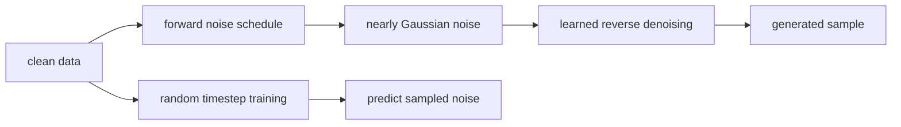
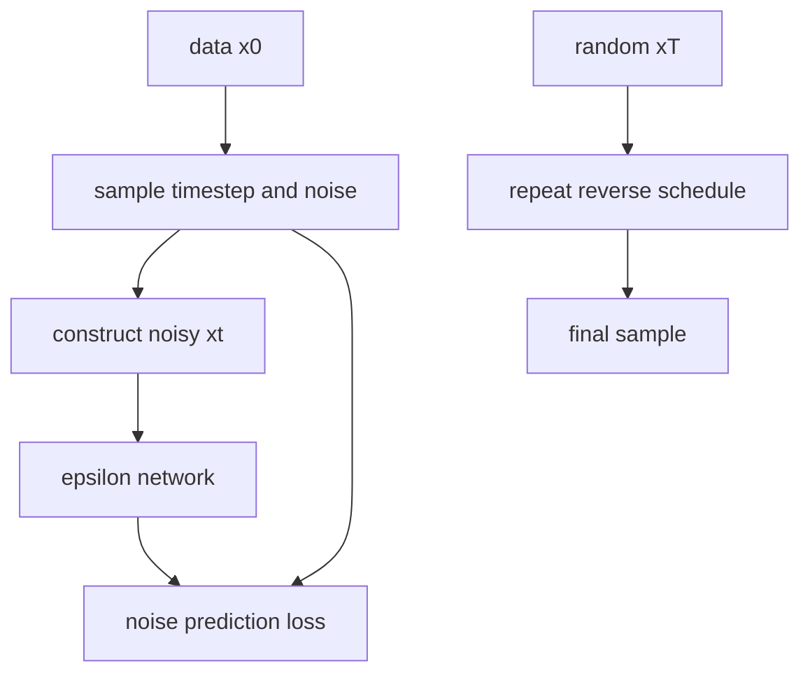

# Denoising Diffusion Probabilistic Models

## TL;DR

DDPMs generate data by learning to reverse a gradual Gaussian noising process.
Training chooses a clean example and random timestep, adds schedule-defined
noise, and trains a network to predict that noise. Sampling starts from random
noise and repeatedly applies learned reverse steps. The method made diffusion a
practical high-quality image-generation approach, but naive sampling is slower
than a one-pass generator.

## Why It Matters

Generative models must capture complex distributions without merely memorizing
examples. GANs use a two-player game and can miss modes; autoregressive models
factor outputs sequentially. Diffusion defines a fixed corruption process and
learns to undo it. The DDPM paper connected a weighted variational bound with
denoising score matching and showed strong CIFAR-10 and LSUN results.

This mechanism underlies many modern image, audio, video, and scientific systems.
The original DDPM is not every later latent diffusion, text-conditioned model,
guidance method, or fast sampler. Those additions alter representation,
conditioning, objective, or reverse solver. The core idea remains learned
iterative denoising.

## Core Intuition

Picture a photograph dropped into a snowstorm a little at a time. Eventually it
becomes indistinguishable from static. A model practices identifying the fresh
snow at every corruption level, then learns small moves back toward a plausible
photograph. Generation begins with static and repeats those moves. Each decision
is modest, although a complete sample may require many such decisions.



## The Mechanism

Forward diffusion uses a fixed variance schedule \(\beta_t\):
\(q(x_t|x_{t-1})=N(\sqrt{1-\beta_t}x_{t-1},\beta_tI)\). With
\(\alpha_t=1-\beta_t\) and cumulative \(\bar\alpha_t=\prod_s\alpha_s\),
any step is sampled directly:

\[
x_t=\sqrt{\bar\alpha_t}x_0+\sqrt{1-\bar\alpha_t}\epsilon,
\quad\epsilon\sim N(0,I).
\]

The network receives \(x_t\) and a timestep embedding and predicts epsilon.
The common simplified objective is mean-squared error between sampled and
predicted noise. During generation, the predicted noise parameterizes a reverse
conditional that moves \(x_t\) toward \(x_{t-1}\), with schedule-defined
variance.




The forward process is fixed and only the reverse model is learned. The GIF is
illustrative, not paper data. Noise, clean-sample, and velocity prediction can
be related under a schedule, but a checkpoint must be paired with the exact
prediction type its scheduler expects. Sampler steps, variance choices, and
guidance all trade fidelity, diversity, cost, and latency.

## Practical Engineering Notes

Use a maintained implementation such as Hugging Face Diffusers and version the
UNet, scheduler, timestep count, beta schedule, prediction type, VAE if present,
text encoder, tokenizer, and safety components together. A scheduler mismatch
can yield plausible but wrong outputs without a shape error. Validate a fixed
seed canary after exports and upgrades. Keep preprocessing consistent with the
expected pixel or latent range.

Training needs random timestep sampling and correct per-example noise. Verify
time embeddings vary with t, noise has intended independence, and loss uses the
chosen representation. Log loss by timestep, prediction error, gradient norms,
fixed-seed samples, diversity, and held-out metrics. Lower average loss does not
guarantee better samples at every noise level. Mixed precision and distributed
training need numerical checks because schedule errors compound during sampling.

Sampling is a product tradeoff. More reverse steps can improve quality but raise
latency and cost. Fast solvers and distilled models are separate methods that
need task-specific evaluation. Bound resolution, batch size, and request duration
before allocating tensors. Cache conditioning only when its revision and access
permission match the request, and let cancellation safely free accelerator work.

Generated images can reproduce harmful bias, misleading content, or rare
training examples. Dataset licenses, consent, provenance, filtering, abuse
controls, and review policy are system requirements. A denoising objective does
not establish factuality or permission. High-impact applications need domain
evaluation, restrictions, and human review or abstention paths.

### Debugging, evaluation, and release

Start with a deterministic low-dimensional or tiny-image experiment. Fix an
example, timestep, and noise tensor, then verify the forward equation against a
manual calculation. Test edge timesteps near zero and the terminal schedule;
off-by-one indexing is common because implementations use zero-based arrays
while papers number timesteps from one. Confirm that the network receives the
same timestep used to construct the noisy input, and that classifier-free or
other conditioning dropout does not alter unconditional examples unexpectedly.

The forward schedule is a model interface. Changing beta values, number of
steps, clipping conventions, variance type, or prediction parameterization can
invalidate a checkpoint even when every tensor shape matches. Store scheduler
configuration in the artifact, not only in an experiment notebook. For a
conversion, render fixed seed outputs, compare intermediate noise predictions,
and retain a rollback build. A visually acceptable result from one prompt is too
weak a test of a stochastic generator.

Evaluate quality, diversity, and memorization risk separately. FID or Inception
Score depend on feature extractors, preprocessing, sample count, and reference
sets; record all of them. Fixed seed grids reveal regressions, while random
samples reveal selection bias. Nearest-neighbor reviews and privacy testing can
identify problematic reproduction but do not settle legal or consent questions.
For conditional models, assess prompt adherence and failures across languages,
styles, groups, and rare concepts rather than only generic benchmark captions.

Serving systems need resource isolation. Diffusion work can occupy an accelerator
for many denoising steps, so admission control, per-request limits, queue
timeouts, cancellation, and fair batching matter. Separate user-provided prompts
from trusted system conditioning, validate input types, and preserve an audit
trail consistent with privacy policy. The reverse chain is a computation plan,
not a permission boundary or content policy.

When comparing sampler optimizations, use identical model weights, seeds where
applicable, output resolution, prompt settings, and compute budgets. A faster
sampler may alter numerical trajectory and diversity. Track end-to-end latency,
peak memory, throughput, failed generations, and quality slices. Release only
after these tradeoffs meet the actual product requirement, with a known rollback
to the previous scheduler and weights.

Finally, document limitations plainly. A diffusion model predicts distributional
plausibility, not facts. It can synthesize convincing but incorrect images and
may reproduce training biases. Downstream workflows should verify relevant
claims with independent data or people, especially in medical, scientific,
identity, safety, or public-information contexts.

Data lifecycle controls matter because training and generation can be separated
by long periods. Track source, preprocessing, license, consent, and removal
status for every corpus shard. If a removal request or policy change requires
unlearning or retraining, know which checkpoints, cached latents, fine-tunes,
and indexes are affected. A model card should describe both generation limits
and the operational procedure for retiring a model revision.

For research comparisons, distinguish the stochastic model from the sample
selection process. Generate a predeclared number of samples with fixed seeds
where feasible, report any filtering, and retain failure examples. Human ratings
need a blinded protocol, representative prompts, and a documented rubric. This
prevents attractive cherry-picked samples from substituting for distributional
evidence. It also reveals when a method improves one aesthetic while harming
coverage, controllability, or reliability.

The most useful mental model is a chain of probabilistic transformations coupled
to a real serving system. Schedule math, denoiser weights, conditioning inputs,
sampler, hardware precision, and policy controls all contribute to an output.
Making these interfaces explicit keeps diffusion engineering testable as models
and products evolve.
It enables reliable technical review and safe iteration.

## Runnable Code Example

[`code/noise_schedule.py`](code/noise_schedule.py) applies the closed-form
forward noising equation to one scalar clean value and fixed Gaussian noise.

```bash
python3 papers/29-ddpm/code/noise_schedule.py
```

It illustrates the schedule equation, not image generation or reverse training.

## Common Misconceptions & Pitfalls

**“Diffusion adds noise only during training.”** Generation starts from noise
and uses a learned reverse chain.

**“A scheduler is a generic helper.”** It encodes assumptions coupled to model
prediction type and training schedule.

**“More steps always improve a product.”** They can increase quality but also
latency, cost, and operational failure opportunities.

## Interview Q&A

**Q:** What does a basic DDPM network predict?
**A:** Usually the Gaussian noise added at a sampled timestep.

**Q:** Why sample x_t directly from x_0?
**A:** Composition of Gaussian forward steps has closed-form cumulative moments.

**Q:** What starts generation?
**A:** A sample near the terminal Gaussian noise distribution.

**Q:** Why embed time?
**A:** The model needs the corruption level to estimate appropriate noise.

**Q:** Is DDPM one reverse network call?
**A:** No. Standard sampling repeatedly applies the denoiser through a schedule.

## Further Reading

- [Original paper](https://arxiv.org/abs/2006.11239)
- [Diffusers documentation](https://huggingface.co/docs/diffusers)
- [Denoising Diffusion Implicit Models](https://arxiv.org/abs/2010.02502)
